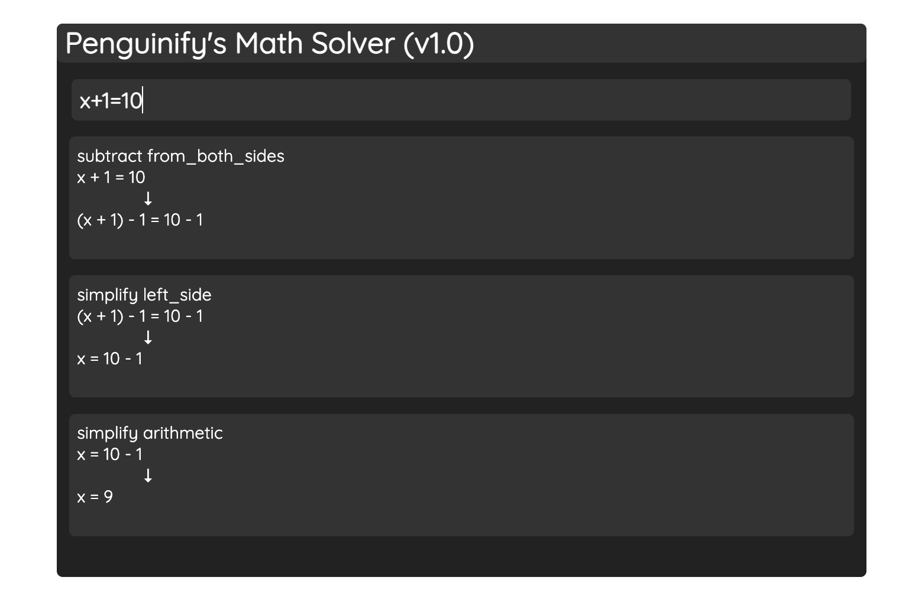

# math-bookmarklet
Finish your math easily with this bookmarklet!

- Easily Solve for x or calculate simple problems
- Quickly Simplify any expression
- Factor Quadratics and etc
- View all steps in equation for free
- Draggable UI

# Install
## Bookmarklet
1. Create a new bookmark
2. Copy and paste this into the url bar for the bookmark.
`javascript:(function()%7Bjavascript%3A(function()%257B%252F*!%2520For%2520license%2520information%2520please%2520see%2520bundle.js.LICENSE.txt%2520*%252F%250A(()%253D%253E%257Bvar%2520e%253D%257B61977%253Afunction(e%252Ct)%257Bvar%2520r%253B!function(n)%257B%2522use%2520strict%2522%253Bvar%2520i%253D%257Bre%253A0%252Cim%253A0%257D%253BMath.cosh%253DMath.cosh%257C%257Cfunction(e)%257Breturn.5*(Math.exp(e)%252BMath.exp(-e))%257D%252CMath.sinh%253DMath.sinh%257C%257Cfunction(e)%257Breturn.5*(Math.exp(e)-Math.exp(-e))%257D%253Bvar%2520o%253Dfunction()%257Bthrow%2520SyntaxError(%2522Invalid%2520Param%2522)%257D%253Bfunction%2520a(e%252Ct)%257Bvar%2520r%253DMath.abs(e)%252Cn%253DMath.abs(t)%253Breturn%25200%253D%253D%253De%253FMath.log(n)%253A0%253D%253D%253Dt%253FMath.log(r)%253Ar%253C3e3%2526%2526n%253C3e3%253F.5*Math.log(e*e%252Bt*t)%253AMath.log(e%252FMath.cos(Math.atan2(t%252Ce)))%257Dvar%2520s%253Dfunction(e%252Ct)%257Bif(null%253D%253De)i.re%253Di.im%253D0%253Belse%2520if(void%25200!%253D%253Dt)i.re%253De%252Ci.im%253Dt%253Belse%2520switch(typeof%2520e)%257Bcase%2522object%2522%253A%2522im%2522in%2520e%2526%2526%2522re%2522in%2520e%253F(i.re%253De.re%252Ci.im%253De.im)%253A%2522abs%2522in%2520e%2526%2526%2522arg%2522in%2520e%253F(i.re%253De.abs*Math.cos(e.arg)%252Ci.im%253De.abs*Math.sin(e.arg))%253A%2522r%2522in%2520e%2526%2526%2522phi%2522in%2520e%253F(i.re%253De.r*Math.cos(e.phi)%252Ci.im%253De.r*Math.sin(e.phi))%253Ao()%253Bbreak%253Bcase%2522string%2522%253Ai.im%253Di.re%253D0%253Bvar%2520r%253De.match(%252F%255Cd%252B%255C.%253F%255Cd*e%255B%252B-%255D%253F%255Cd%252B%257C%255Cd%252B%255C.%253F%255Cd*%257C%255C.%255Cd%252B%257C.%252Fg)%252Cn%253D1%252Ca%253D0%253Bnull%253D%253D%253Dr%2526%2526o()%253Bfor(var%2520s%253D0%253Bs%253Cr.length%253Bs%252B%252B)%257Bvar%2520u%253Dr%255Bs%255D%253B%2522%2520%2522%253D%253D%253Du%257C%257C%2522%255Ct%2522%253D%253D%253Du%257C%257C%2522%255Cn%2522%253D%253D%253Du%257C%257C(%2522%252B%2522%253D%253D%253Du%253Fn%252B%252B%253A%2522-%2522%253D%253D%253Du%253Fa%252B%252B%253A%2522i%2522%253D%253D%253Du%257C%257C%2522I%2522%253D%253D%253Du%253F(n%252Ba%253D%253D%253D0%2526%2526o()%252C%2522%2520%2522%253D%253D%253Dr%255Bs%252B1%255D%257C%257CisNaN(r%255Bs%252B1%255D)%253Fi.im%252B%253DparseFloat((a%25252%253F%2522-%2522%253A%2522%2522)%252B%25221%2522)%253A(i.im%252B%253DparseFloat((a%25252%253F%2522-%2522%253A%2522%2522)%252Br%255Bs%252B1%255D)%252Cs%252B%252B)%252Cn%253Da%253D0)%253A((n%252Ba%253D%253D%253D0%257C%257CisNaN(u))%2526%2526o()%252C%2522i%2522%253D%253D%253Dr%255Bs%252B1%255D%257C%257C%2522I%2522%253D%253D%253Dr%255Bs%252B1%255D%253F(i.im%252B%253DparseFloat((a%25252%253F%2522-%2522%253A%2522%2522)%252Bu)%252Cs%252B%252B)%253Ai.re%252B%253DparseFloat((a%25252%253F%2522-%2522%253A%2522%2522)%252Bu)%252Cn%253Da%253D0))%257Dn%252Ba%253E0%2526%2526o()%253Bbreak%253Bcase%2522number%2522%253Ai.im%253D0%252Ci.re%253De%253Bbreak%253Bdefault%253Ao()%257DisNaN(i.re)%257C%257CisNaN(i.im)%257D%253Bfunction%2520u(e%252Ct)%257Bif(!(this%2520instanceof%2520u))return%2520new%2520u(e%252Ct)%253Bs(e%252Ct)%252Cthis.re%253Di.re%252Cthis.im%253Di.im%257Du.prototype%253D%257Bre%253A0%252Cim%253A0%252Csign%253Afunction()%257Bvar%2520e%253Dthis.abs()%253Breturn%2520new%2520u(this.re%252Fe%252Cthis.im%252Fe)%257D%252Cadd%253Afunction(e%252Ct)%257Breturn%2520s(e%252Ct)%252Cnew%2520u(this.re%252Bi.re%252Cthis.im%252Bi.im)%257D%252Csub%253Afunction(e%252Ct)%257Breturn%2520s(e%252Ct)%252Cnew%2520u(this.re-i.re%252Cthis.im-i.im)%257D%252Cmul%253Afunction(e%252Ct)%257Breturn%2520s(e%252Ct)%252C0%253D%253D%253Di.im%2526%25260%253D%253D%253Dthis.im%253Fnew%2520u(this.re*i.re%252C0)%253Anew%2520u(this.re*i.re-this.im*i.im%252Cthis.re*i.im%252Bthis.im*i.re)%257D%252Cdiv%253Afunction(e%252Ct)%257Bs(e%252Ct)%252Ce%253Dthis.re%252Ct%253Dthis.im%253Bvar%2520r%252Cn%252Co%253Di.re%252Ca%253Di.im%253Breturn%25200%253D%253D%253Do%2526%25260%253D%253D%253Da%253Fnew%2520u(0!%253D%253De%253Fe%252F0%253A0%252C0!%253D%253Dt%253Ft%252F0%253A0)%253A0%253D%253D%253Da%253Fnew%2520u(e%252Fo%252Ct%252Fo)%253AMath.abs(o)%253CMath.abs(a)%253Fnew%2520u((e*(n%253Do%252Fa)%252Bt)%252F(r%253Do*n%252Ba)%252C(t*n-e)%252Fr)%253Anew%2520u((e%252Bt*(n%253Da%252Fo))%252F(r%253Da*n%252Bo)%252C(t-e*n)%252Fr)%257D%252Cpow%253Afunction(e%252Ct)%257Bif(s(e%252Ct)%252Ce%253Dthis.re%252Ct%253Dthis.im%252C0%253D%253D%253De%2526%25260%253D%253D%253Dt)return%2520new%2520u(0%252C0)%253Bvar%2520r%253DMath.atan2(t%252Ce)%252Cn%253Da(e%252Ct)%253Bif(0%253D%253D%253Di.im)%257Bif(0%253D%253D%253Dt%2526%2526e%253E%253D0)return%2520new%2520u(Math.pow(e%252Ci.re)%252C0)%253Bif(0%253D%253D%253De)switch(i.re%25254)%257Bcase%25200%253Areturn%2520new%2520u(Math.pow(t%252Ci.re)%252C0)%253Bcase%25201%253Areturn%2520new%2520u(0%252CMath.pow(t%252Ci.re))%253Bcase%25202%253Areturn%2520new%2520u(-Math.pow(t%252Ci.re)%252C0)%253Bcase%25203%253Areturn%2520new%2520u(0%252C-Math.pow(t%252Ci.re))%257D%257Dreturn%2520e%253DMath.exp(i.re*n-i.im*r)%252Ct%253Di.im*n%252Bi.re*r%252Cnew%2520u(e*Math.cos(t)%252Ce*Math.sin(t))%257D%252Csqrt%253Afunction()%257Bvar%2520e%252Ct%252Cr%253Dthis.re%252Cn%253Dthis.im%252Ci%253Dthis.abs()%253Breturn%2520r%253E%253D0%2526%25260%253D%253D%253Dn%253Fnew%2520u(Math.sqrt(r)%252C0)%253A(e%253Dr%253E%253D0%253F.5*Math.sqrt(2*(i%252Br))%253AMath.abs(n)%252FMath.sqrt(2*(i-r))%252Ct%253Dr%253C%253D0%253F.5*Math.sqrt(2*(i-r))%253AMath.abs(n)%252FMath.sqrt(2*(i%252Br))%252Cnew%2520u(e%252Cn%253E%253D0%253Ft%253A-t))%257D%252Cexp%253Afunction()%257Bvar%2520e%253DMath.exp(this.re)%253Breturn%2520this.im%252Cnew%2520u(e*Math.cos(this.im)%252Ce*Math.sin(this.im))%257D%252Clog%253Afunction()%257Bvar%2520e%253Dthis.re%252Ct%253Dthis.im%253Breturn%2520new%2520u(a(e%252Ct)%252CMath.atan2(t%252Ce))%257D%252Cabs%253Afunction()%257Bvar%2520e%253DMath.abs(this.re)%252Ct%253DMath.abs(this.im)%253Breturn%2520e%253C3e3%2526%2526t%253C3e3%253FMath.sqrt(e*e%252Bt*t)%253A(e%253Ct%253F(e%253Dt%252Ct%253Dthis.re%252Fthis.im)%253At%253Dthis.im%252Fthis.re%252Ce*Math.sqrt(1%252Bt*t))%257D%252Carg%253Afunction()%257Breturn%2520Math.atan2(this.im%252Cthis.re)%257D%252Csin%253Afunction()%257Bvar%2520e%253Dthis.re%252Ct%253Dthis.im%253Breturn%2520new%2520u(Math.sin(e)*Math.cosh(t)%252CMath.cos(e)*Math.sinh(t))%257D%252Ccos%253Afunction()%257Bvar%2520e%253Dthis.re%252Ct%253Dthis.im%253Breturn%2520new%2520u(Math.cos(e)*Math.cosh(t)%252C-Math.sin(e)*Math.sinh(t))%257D%252Ctan%253Afunction()%257Bvar%2520e%253D2*this.re%252Ct%253D2*this.im%252Cr%253DMath.cos(e)%252BMath.cosh(t)%253Breturn%2520new%2520u(Math.sin(e)%252Fr%252CMath.sinh(t)%252Fr)%257D%252Ccot%253Afunction()%257Bvar%2520e%253D2*this.re%252Ct%253D2*this.im%252Cr%253DMath.cos(e)-Math.cosh(t)%253Breturn%2520new%2520u(-Math.sin(e)%252Fr%252CMath.sinh(t)%252Fr)%257D%252Csec%253Afunction()%257Bvar%2520e%253Dthis.re%252Ct%253Dthis.im%252Cr%253D.5*Math.cosh(2*t)%252B.5*Math.cos(2*e)%253Breturn%2520new%2520u(Math.cos(e)*Math.cosh(t)%252Fr%252CMath.sin(e)*Math.sinh(t)%252Fr)%257D%252Ccsc%253Afunction()%257Bvar%2520e%253Dthis.re%252Ct%253Dthis.im%252Cr%253D.5*Math.cosh(2*t)-.5*Math.cos(2*e)%253Breturn%2520new%2520u(Math.sin(e)*Math.cosh(t)%252Fr%252C-Math.cos(e)*Math.sinh(t)%252Fr)%257D%252Casin%253Afunction()%257Bvar%2520e%253Dthis.re%252Ct%253Dthis.im%252Cr%253Dnew%2520u(t*t-e*e%252B1%252C-2*e*t).sqrt()%252Cn%253Dnew%2520u(r.re-t%252Cr.im%252Be).log()%253Breturn%2520new%2520u(n.im%252C-n.re)%257D%252Cacos%253Afunction()%257Bvar%2520e%253Dthis.re%252Ct%253Dthis.im%252Cr%253Dnew%2520u(t*t-e*e%252B1%252C-2*e*t).sqrt()%252Cn%253Dnew%2520u(r.re-t%252Cr.im%252Be).log()%253Breturn%2520new%2520u(Math.PI%252F2-n.im%252Cn.re)%257D%252Catan%253Afunction()%257Bvar%2520e%253Dthis.re%252Ct%253Dthis.im%253Bif(0%253D%253D%253De)%257Bif(1%253D%253D%253Dt)return%2520new%2520u(0%252C1%252F0)%253Bif(-1%253D%253D%253Dt)return%2520new%2520u(0%252C-1%252F0)%257Dvar%2520r%253De*e%252B(1-t)*(1-t)%252Cn%253Dnew%2520u((1-t*t-e*e)%252Fr%252C-2*e%252Fr).log()%253Breturn%2520new%2520u(-.5*n.im%252C.5*n.re)%257D%252Cacot%253Afunction()%257Bvar%2520e%253Dthis.re%252Ct%253Dthis.im%253Bif(0%253D%253D%253Dt)return%2520new%2520u(Math.atan2(1%252Ce)%252C0)%253Bvar%2520r%253De*e%252Bt*t%253Breturn%25200!%253D%253Dr%253Fnew%2520u(e%252Fr%252C-t%252Fr).atan()%253Anew%2520u(0!%253D%253De%253Fe%252F0%253A0%252C0!%253D%253Dt%253F-t%252F0%253A0).atan()%257D%252Casec%253Afunction()%257Bvar%2520e%253Dthis.re%252Ct%253Dthis.im%253Bif(0%253D%253D%253De%2526%25260%253D%253D%253Dt)return%2520new%2520u(0%252C1%252F0)%253Bvar%2520r%253De*e%252Bt*t%253Breturn%25200!%253D%253Dr%253Fnew%2520u(e%252Fr%252C-t%252Fr).acos()%253Anew%2520u(0!%253D%253De%253Fe%252F0%253A0%252C0!%253D%253Dt%253F-t%252F0%253A0).acos()%257D%252Cacsc%253Afunction()%257Bvar%2520e%253Dthis.re%252Ct%253Dthis.im%253Bif(0%253D%253D%253De%2526%25260%253D%253D%253Dt)return%2520new%2520u(Math.PI%252F2%252C1%252F0)%253Bvar%2520r%253De*e%252Bt*t%253Breturn%25200!%253D%253Dr%253Fnew%2520u(e%252Fr%252C-t%252Fr).asin()%253Anew%2520u(0!%253D%253De%253Fe%252F0%253A0%252C0!%253D%253Dt%253F-t%252F0%253A0).asin()%257D%252Csinh%253Afunction()%257Bvar%2520e%253Dthis.re%252Ct%253Dthis.im%253Breturn%2520new%2520u(Math.sinh(e)*Math.cos(t)%252CMath.cosh(e)*Math.sin(t))%257D%252Ccosh%253Afunction()%257Bvar%2520e%253Dthis.re%252Ct%253Dthis.im%253Breturn%2520new%2520u(Math.cosh(e)*Math.cos(t)%252CMath.sinh(e)*Math.sin(t))%257D%252Ctanh%253Afunction()%257Bvar%2520e%253D2*this.re%252Ct%253D2*this.im%252Cr%253DMath.cosh(e)%252BMath.cos(t)%253Breturn%2520new%2520u(Math.sinh(e)%252Fr%252CMath.sin(t)%252Fr)%257D%252Ccoth%253Afunction()%257Bvar%2520e%253D2*this.re%252Ct%253D2*this.im%252Cr%253DMath.cosh(e)-Math.cos(t)%253Breturn%2520new%2520u(Math.sinh(e)%252Fr%252C-Math.sin(t)%252Fr)%257D%252Ccsch%253Afunction()%257Bvar%2520e%253Dthis.re%252Ct%253Dthis.im%252Cr%253DMath.cos(2*t)-Math.cosh(2*e)%253Breturn%2520new%2520u(-2*Math.sinh(e)*Math.cos(t)%252Fr%252C2*Math.cosh(e)*Math.sin(t)%252Fr)%257D%252Csech%253Afunction()%257Bvar%2520e%253Dthis.re%252Ct%253Dthis.im%252Cr%253DMath.cos(2*t)%252BMath.cosh(2*e)%253Breturn%2520new%2520u(2*Math.cosh(e)*Math.cos(t)%252Fr%252C-2*Math.sinh(e)*Math.sin(t)%252Fr)%257D%252Casinh%253Afunction()%257Bvar%2520e%253Dthis.im%253Bthis.im%253D-this.re%252Cthis.re%253De%253Bvar%2520t%253Dthis.asin()%253Breturn%2520this.re%253D-this.im%252Cthis.im%253De%252Ce%253Dt.re%252Ct.re%253D-t.im%252Ct.im%253De%252Ct%257D%252Cacosh%253Afunction()%257Bvar%2520e%252Ct%253Dthis.acos()%253Breturn%2520t.im%253C%253D0%253F(e%253Dt.re%252Ct.re%253D-t.im%252Ct.im%253De)%253A(e%253Dt.im%252Ct.im%253D-t.re%252Ct.re%253De)%252Ct%257D%252Catanh%253Afunction()%257Bvar%2520e%253Dthis.re%252Ct%253Dthis.im%252Cr%253De%253E1%2526%25260%253D%253D%253Dt%252Cn%253D1-e%252Ci%253D1%252Be%252Co%253Dn*n%252Bt*t%252Cs%253D0!%253D%253Do%253Fnew%2520u((i*n-t*t)%252Fo%252C(t*n%252Bi*t)%252Fo)%253Anew%2520u(-1!%253D%253De%253Fe%252F0%253A0%252C0!%253D%253Dt%253Ft%252F0%253A0)%252Cc%253Ds.re%253Breturn%2520s.re%253Da(s.re%252Cs.im)%252F2%252Cs.im%253DMath.atan2(s.im%252Cc)%252F2%252Cr%2526%2526(s.im%253D-s.im)%252Cs%257D%252Cacoth%253Afunction()%257Bvar%2520e%253Dthis.re%252Ct%253Dthis.im%253Bif(0%253D%253D%253De%2526%25260%253D%253D%253Dt)return%2520new%2520u(0%252CMath.PI%252F2)%253Bvar%2520r%253De*e%252Bt*t%253Breturn%25200!%253D%253Dr%253Fnew%2520u(e%252Fr%252C-t%252Fr).atanh()%253Anew%2520u(0!%253D%253De%253Fe%252F0%253A0%252C0!%253D%253Dt%253F-t%252F0%253A0).atanh()%257D%252Cacsch%253Afunction()%257Bvar%2520e%253Dthis.re%252Ct%253Dthis.im%253Bif(0%253D%253D%253Dt)return%2520new%2520u(0!%253D%253De%253FMath.log(e%252BMath.sqrt(e*e%252B1))%253A1%252F0%252C0)%253Bvar%2520r%253De*e%252Bt*t%253Breturn%25200!%253D%253Dr%253Fnew%2520u(e%252Fr%252C-t%252Fr).asinh()%253Anew%2520u(0!%253D%253De%253Fe%252F0%253A0%252C0!%253D%253Dt%253F-t%252F0%253A0).asinh()%257D%252Casech%253Afunction()%257Bvar%2520e%253Dthis.re%252Ct%253Dthis.im%253Bif(0%253D%253D%253De%2526%25260%253D%253D%253Dt)return%2520new%2520u(1%252F0%252C0)%253Bvar%2520r%253De*e%252Bt*t%253Breturn%25200!%253D%253Dr%253Fnew%2520u(e%252Fr%252C-t%252Fr).acosh()%253Anew%2520u(0!%253D%253De%253Fe%252F0%253A0%252C0!%253D%253Dt%253F-t%252F0%253A0).acosh()%257D%252Cinverse%253Afunction()%257Bvar%2520e%253Dthis.re%252Ct%253Dthis.im%252Cr%253De*e%252Bt*t%253Breturn%2520new%2520u(0!%253D%253De%253Fe%252Fr%253A0%252C0!%253D%253Dt%253F-t%252Fr%253A0)%257D%252Cconjugate%253Afunction()%257Breturn%2520new%2520u(this.re%252C-this.im)%257D%252Cneg%253Afunction()%257Breturn%2520new%2520u(-this.re%252C-this.im)%257D%252Cceil%253Afunction(e)%257Breturn%2520e%253DMath.pow(10%252Ce%257C%257C0)%252Cnew%2520u(Math.ceil(this.re*e)%252Fe%252CMath.ceil(this.im*e)%252Fe)%257D%252Cfloor%253Afunction(e)%257Breturn%2520e%253DMath.pow(10%252Ce%257C%257C0)%252Cnew%2520u(Math.floor(this.re*e)%252Fe%252CMath.floor(this.im*e)%252Fe)%257D%252Cround%253Afunction(e)%257Breturn%2520e%253DMath.pow(10%252Ce%257C%257C0)%252Cnew%2520u(Math.round(this.re*e)%252Fe%252CMath.round(this.im*e)%252Fe)%257D%252Cequals%253Afunction(e%252Ct)%257Breturn%2520s(e%252Ct)%252CMath.abs(i.re-this.re)%253C%253Du.EPSILON%2526%2526Math.abs(i.im-this.im)%253C%253Du.EPSILON%257D%252Cclone%253Afunction()%257Breturn%2520new%2520u(this.re%252Cthis.im)%257D%252CtoString%253Afunction()%257Bvar%2520e%253Dthis.re%252Ct%253Dthis.im%252Cr%253D%2522%2522%253Breturn%2520isNaN(e)%257C%257CisNaN(t)%253F%2522NaN%2522%253A(0!%253D%253De%2526%2526(r%252B%253De)%252C0!%253D%253Dt%2526%2526(0!%253D%253De%253Fr%252B%253Dt%253C0%253F%2522%2520-%2520%2522%253A%2522%2520%252B%2520%2522%253At%253C0%2526%2526(r%252B%253D%2522-%2522)%252C1!%253D%253D(t%253DMath.abs(t))%2526%2526(r%252B%253Dt)%252Cr%252B%253D%2522i%2522)%252Cr%257C%257C%25220%2522)%257D%252CtoVector%253Afunction()%257Breturn%255Bthis.re%252Cthis.im%255D%257D%252CvalueOf%253Afunction()%257Breturn%25200%253D%253D%253Dthis.im%253Fthis.re%253Anull%257D%252CisNaN%253Afunction()%257Breturn%2520isNaN(this.re)%257C%257CisNaN(this.im)%257D%257D%252Cu.ZERO%253Dnew%2520u(0%252C0)%252Cu.ONE%253Dnew%2520u(1%252C0)%252Cu.I%253Dnew%2520u(0%252C1)%252Cu.PI%253Dnew%2520u(Math.PI%252C0)%252Cu.E%253Dnew%2520u(Math.E%252C0)%252Cu.EPSILON%253D1e-16%252Cvoid%25200%253D%253D%253D(r%253Dfunction()%257Breturn%2520u%257D.apply(t%252C%255B%255D))%257C%257C(e.exports%253Dr)%257D()%257D%252C20028%253A(e%252Ct%252Cr)%253D%253E%257B%2522use%2520strict%2522%253Br.d(t%252C%257BZ%253A()%253D%253Es%257D)%253Bvar%2520n%253Dr(8081)%252Ci%253Dr.n(n)%252Co%253Dr(23645)%252Ca%253Dr.n(o)()(i())%253Ba.push(%255Be.id%252C%2522%2540import%2520url(https%253A%252F%252Ffonts.googleapis.com%252Fcss2%253Ffamily%253DQuicksand%2526display%253Dswap)%253B%2522%255D)%252Ca.push(%255Be.id%252C%2522%2523math_UI%2520%257B%255Cn%2520%2520%2520%2520width%253A%252040%2525%253B%255Cn%2520%2520%2520%2520overflow%253A%2520hidden%253B%255Cn%2520%2520%2520%2520border-radius%253A%25205px%253B%255Cn%2520%2520%2520%2520position%253A%2520fixed%253B%255Cn%2520%2520%2520%2520background-color%253A%2520%2523222%253B%255Cn%2520%2520%2520%2520display%253A%2520flex%253B%255Cn%2520%2520%2520%2520flex-direction%253A%2520column%253B%255Cn%2520%2520%2520%2520align-items%253A%2520center%253B%255Cn%2520%2520%2520%2520padding-bottom%253A%25202%2525%253B%255Cn%2520%2520%2520%2520top%253A0%253B%255Cn%2520%2520%2520%2520right%253A0%253B%255Cn%2520%2520%2520%2520z-index%253A100000000000%253B%255Cn%257D%255Cn%255Cn%2523math_HEADER%2520%257B%255Cn%2520%2520%2520%2520width%253A%252099%2525%253B%255Cn%2520%2520%2520%2520user-select%253A%2520none%253B%255Cn%2520%2520%2520%2520border-radius%253A%25205px%253B%255Cn%2520%2520%2520%2520height%253A%25204vh%253B%255Cn%2520%2520%2520%2520background-color%253A%2520%2523333%253B%255Cn%2520%2520%2520%2520color%253A%2520%2523fff%253B%255Cn%2520%2520%2520%2520display%253Aflex%253B%255Cn%2520%2520%2520%2520flex-direction%253A%2520row%253B%255Cn%2520%2520%2520%2520text-align%253A%2520left%253B%255Cn%2520%2520%2520%2520align-items%253A%2520center%253B%255Cn%2520%2520%2520%2520justify-content%253A%2520space-between%253B%255Cn%2520%2520%2520%2520font-size%253A%25203vh%253B%255Cn%2520%2520%2520%2520font-weight%253A%2520bold%253B%255Cn%2520%2520%2520%2520font-family%253A%2520'Quicksand'%252C%2520sans-serif%253B%255Cn%2520%2520%2520%2520padding-left%253A%25201%2525%253B%255Cn%257D%255Cn%255Cn%2523math_INPUT%2520%257B%255Cn%2520%2520%2520%2520width%253A%252095%2525%253B%255Cn%2520%2520%2520%2520border-radius%253A%25205px%253B%255Cn%2520%2520%2520%2520height%253A%25204vh%253B%255Cn%2520%2520%2520%2520margin-top%253A%25202%2525%253B%255Cn%2520%2520%2520%2520background-color%253A%2520%2523333%253B%255Cn%2520%2520%2520%2520color%253A%2520%2523fff%253B%255Cn%2520%2520%2520%2520border%253A%2520none%253B%255Cn%2520%2520%2520%2520text-align%253A%2520left%253B%255Cn%2520%2520%2520%2520font-size%253A%25202.25vh%253B%255Cn%2520%2520%2520%2520font-weight%253A%2520bold%253B%255Cn%2520%2520%2520%2520font-family%253A%2520'Quicksand'%252C%2520sans-serif%253B%255Cn%2520%2520%2520%2520padding-left%253A%25201%2525%253B%255Cn%257D%255Cn%255Cn%2523math_INPUT%253Afocus%2520%257B%255Cn%2520%2520%2520%2520outline%253A%2520none%253B%255Cn%257D%255Cn%255Cn%2523math_OUTPUT%2520%257B%255Cn%2520%2520%2520%2520width%253A%2520100%2525%253B%255Cn%2520%2520%2520%2520display%253A%2520flex%253B%255Cn%2520%2520%2520%2520align-items%253A%2520center%253B%255Cn%2520%2520%2520%2520flex-direction%253A%2520column%253B%255Cn%257D%255Cn%255Cn.math_STEP%2520%257B%255Cn%2520%2520%2520%2520font-family%253A%2520'Quicksand'%252C%2520sans-serif%253B%255Cn%2520%2520%2520%2520width%253A%252095%2525%253B%255Cn%2520%2520%2520%2520border-radius%253A%25205px%253B%255Cn%2520%2520%2520%2520margin-top%253A%25202%2525%253B%255Cn%2520%2520%2520%2520background-color%253A%2520%2523333%253B%255Cn%2520%2520%2520%2520color%253A%2520%2523fff%253B%255Cn%2520%2520%2520%2520text-align%253A%2520left%253B%255Cn%2520%2520%2520%2520font-size%253A%25201.75vh%253B%255Cn%2520%2520%2520%2520padding%253A%25201%2525%253B%255Cn%257D%255Cn%255Cn%2523solve_TYPE%2520%257B%255Cn%2520%2520%2520%2520width%253A%252095%2525%253B%255Cn%2520%2520%2520%2520margin-top%253A%25202%2525%253B%255Cn%257D%255Cn%255Cn%2523math_CLOSE%2520%257B%255Cn%2520%2520%2520%2520width%253A%25207%2525%253B%255Cn%2520%2520%2520%2520font-size%253A%25202vh%253B%255Cn%2520%2520%2520%2520background%253A%2520%2523333%253B%255Cn%2520%2520%2520%2520color%253A%2520%2523fff%253B%255Cn%2520%2520%2520%2520border%253A%2520none%253B%255Cn%2520%2520%2520%2520border-radius%253A%25205px%253B%255Cn%2520%2520%2520%2520margin-top%253A%25202%2525%253B%255Cn%2520%2520%2520%2520font-size%253A%25204vh%253B%255Cn%2520%2520%2520%2520font-family%253A%2520'Quicksand'%252C%2520sans-serif%253B%255Cn%257D%255Cn%255Cn.math_ENABLED%2520%257B%255Cn%2520%2520%2520%2520width%253A%252020%2525%253B%255Cn%2520%2520%2520%2520font-size%253A%25202vh%253B%255Cn%2520%2520%2520%2520background%253A%2520%2523444%253B%255Cn%2520%2520%2520%2520color%253A%2520%2523fff%253B%255Cn%2520%2520%2520%2520border%253A%2520none%253B%255Cn%2520%2520%2520%2520border-radius%253A%25205px%253B%255Cn%2520%2520%2520%2520margin-top%253A%25202%2525%253B%255Cn%2520%2520%2520%2520margin-right%253A%25202%2525%253B%255Cn%2520%2520%2520%2520font-family%253A%2520'Quicksand'%252C%2520sans-serif%253B%255Cn%257D%255Cn%255Cn.math_DISABLED%2520%257B%255Cn%2520%2520%2520%2520width%253A%252020%2525%253B%255Cn%2520%2520%2520%2520font-size%253A%25202vh%253B%255Cn%2520%2520%2520%2520background%253A%2520%2523333%253B%255Cn%2520%2520%2520%2520color%253A%2520%2523fff%253B%255Cn%2520%2520%2520%2520border%253A%2520none%253B%255Cn%2520%2520%2520%2520margin-right%253A%25202%2525%253B%255Cn%2520%2520%2520%2520border-radius%253A%25205px%253B%255Cn%2520%2520%2520%2520margin-top%253A%25202%2525%253B%255Cn%2520%2520%2520%2520font-family%253A%2520'Quicksand'%252C%2520sans-serif%253B%255Cn%257D%255Cn%2522%252C%2522%2522%255D)%253Bconst%2520s%253Da%257D%252C23645%253Ae%253D%253E%257B%2522use%2520strict%2522%253Be.exports%253Dfunction(e)%257Bvar%2520t%253D%255B%255D%253Breturn%2520t.toString%253Dfunction()%257Breturn%2520this.map((function(t)%257Bvar%2520r%253D%2522%2522%252Cn%253Dvoid%25200!%253D%253Dt%255B5%255D%253Breturn%2520t%255B4%255D%2526%2526(r%252B%253D%2522%2540supports%2520(%2522.concat(t%255B4%255D%252C%2522)%2520%257B%2522))%252Ct%255B2%255D%2526%2526(r%252B%253D%2522%2540media%2520%2522.concat(t%255B2%255D%252C%2522%2520%257B%2522))%252Cn%2526%2526(r%252B%253D%2522%2540layer%2522.concat(t%255B5%255D.length%253E0%253F%2522%2520%2522.concat(t%255B5%255D)%253A%2522%2522%252C%2522%2520%257B%2522))%252Cr%252B%253De(t)%252Cn%2526%2526(r%252B%253D%2522%257D%2522)%252Ct%255B2%255D%2526%2526(r%252B%253D%2522%257D%2522)%252Ct%255B4%255D%2526%2526(r%252B%253D%2522%257D%2522)%252Cr%257D)).join(%2522%2522)%257D%252Ct.i%253Dfunction(e%252Cr%252Cn%252Ci%252Co)%257B%2522string%2522%253D%253Dtypeof%2520e%2526%2526(e%253D%255B%255Bnull%252Ce%252Cvoid%25200%255D%255D)%253Bvar%2520a%253D%257B%257D%253Bif(n)for(var%2520s%253D0%253Bs%253Cthis.length%253Bs%252B%252B)%257Bvar%2520u%253Dthis%255Bs%255D%255B0%255D%253Bnull!%253Du%2526%2526(a%255Bu%255D%253D!0)%257Dfor(var%2520c%253D0%253Bc%253Ce.length%253Bc%252B%252B)%257Bvar%2520f%253D%255B%255D.concat(e%255Bc%255D)%253Bn%2526%2526a%255Bf%255B0%255D%255D%257C%257C(void%25200!%253D%253Do%2526%2526(void%25200%253D%253D%253Df%255B5%255D%257C%257C(f%255B1%255D%253D%2522%2540layer%2522.concat(f%255B5%255D.length%253E0%253F%2522%2520%2522.concat(f%255B5%255D)%253A%2522%2522%252C%2522%2520%257B%2522).concat(f%255B1%255D%252C%2522%257D%2522))%252Cf%255B5%255D%253Do)%252Cr%2526%2526(f%255B2%255D%253F(f%255B1%255D%253D%2522%2540media%2520%2522.concat(f%255B2%255D%252C%2522%2520%257B%2522).concat(f%255B1%255D%252C%2522%257D%2522)%252Cf%255B2%255D%253Dr)%253Af%255B2%255D%253Dr)%252Ci%2526%2526(f%255B4%255D%253F(f%255B1%255D%253D%2522%2540supports%2520(%2522.concat(f%255B4%255D%252C%2522)%2520%257B%2522).concat(f%255B1%255D%252C%2522%257D%2522)%252Cf%255B4%255D%253Di)%253Af%255B4%255D%253D%2522%2522.concat(i))%252Ct.push(f))%257D%257D%252Ct%257D%257D%252C8081%253Ae%253D%253E%257B%2522use%2520strict%2522%253Be.exports%253Dfunction(e)%257Breturn%2520e%255B1%255D%257D%257D%252C93776%253Afunction(e%252Ct%252Cr)%257Bvar%2520n%253B!function(i)%257B%2522use%2520strict%2522%253Bvar%2520o%252Ca%252Cs%253D9e15%252Cu%253D1e9%252Cc%253D%25220123456789abcdef%2522%252Cf%253D%25222.3025850929940456840179914546843642076011014886287729760333279009675726096773524802359972050895982983419677840422862486334095254650828067566662873690987816894829072083255546808437998948262331985283935053089653777326288461633662222876982198867465436674744042432743651550489343149393914796194044002221051017141748003688084012647080685567743216228355220114804663715659121373450747856947683463616792101806445070648000277502684916746550586856935673420670581136429224554405758925724208241314695689016758940256776311356919292033376587141660230105703089634572075440370847469940168269282808481184289314848524948644871927809676271275775397027668605952496716674183485704422507197965004714951050492214776567636938662976979522110718264549734772662425709429322582798502585509785265383207606726317164309505995087807523710333101197857547331541421808427543863591778117054309827482385045648019095610299291824318237525357709750539565187697510374970888692180205189339507238539205144634197265287286965110862571492198849978748873771345686209167058%2522%252Cl%253D%25223.1415926535897932384626433832795028841971693993751058209749445923078164062862089986280348253421170679821480865132823066470938446095505822317253594081284811174502841027019385211055596446229489549303819644288109756659334461284756482337867831652712019091456485669234603486104543266482133936072602491412737245870066063155881748815209209628292540917153643678925903600113305305488204665213841469519415116094330572703657595919530921861173819326117931051185480744623799627495673518857527248912279381830119491298336733624406566430860213949463952247371907021798609437027705392171762931767523846748184676694051320005681271452635608277857713427577896091736371787214684409012249534301465495853710507922796892589235420199561121290219608640344181598136297747713099605187072113499999983729780499510597317328160963185950244594553469083026425223082533446850352619311881710100031378387528865875332083814206171776691473035982534904287554687311595628638823537875937519577818577805321712268066130019278766111959092164201989380952572010654858632789%2522%252Cp%253D%257Bprecision%253A20%252Crounding%253A4%252Cmodulo%253A1%252CtoExpNeg%253A-7%252CtoExpPos%253A21%252CminE%253A-s%252CmaxE%253As%252Ccrypto%253A!1%257D%252Ch%253D!0%252Cm%253D%2522%255BDecimalError%255D%2520%2522%252Cg%253Dm%252B%2522Invalid%2520argument%253A%2520%2522%252Cd%253Dm%252B%2522Precision%2520limit%2520exceeded%2522%252Cy%253Dm%252B%2522crypto%2520unavailable%2522%252Cv%253DMath.floor%252Cx%253DMath.pow%252Cw%253D%252F%255E0b(%255B01%255D%252B(%255C.%255B01%255D*)%253F%257C%255C.%255B01%255D%252B)(p%255B%252B-%255D%253F%255Cd%252B)%253F%2524%252Fi%252Cb%253D%252F%255E0x(%255B0-9a-f%255D%252B(%255C.%255B0-9a-f%255D*)%253F%257C%255C.%255B0-9a-f%255D%252B)(p%255B%252B-%255D%253F%255Cd%252B)%253F%2524%252Fi%252CN%253D%252F%255E0o(%255B0-7%255D%252B(%255C.%255B0-7%255D*)%253F%257C%255C.%255B0-7%255D%252B)(p%255B%252B-%255D%253F%255Cd%252B)%253F%2524%252Fi%252CE%253D%252F%255E(%255Cd%252B(%255C.%255Cd*)%253F%257C%255C.%255Cd%252B)(e%255B%252B-%255D%253F%255Cd%252B)%253F%2524%252Fi%252CT%253D1e7%252CC%253D7%252CO%253Df.length-1%252CM%253Dl.length-1%252C_%253D%257B%257D%253Bfunction%2520S(e)%257Bvar%2520t%252Cr%252Cn%252Ci%253De.length-1%252Co%253D%2522%2522%252Ca%253De%255B0%255D%253Bif(i%253E0)%257Bfor(o%252B%253Da%252Ct%253D1%253Bt%253Ci%253Bt%252B%252B)n%253De%255Bt%255D%252B%2522%2522%252C(r%253DC-n.length)%2526%2526(o%252B%253Dq(r))%252Co%252B%253Dn%253Ba%253De%255Bt%255D%252C(r%253DC-(n%253Da%252B%2522%2522).length)%2526%2526(o%252B%253Dq(r))%257Delse%2520if(0%253D%253D%253Da)return%25220%2522%253Bfor(%253Ba%252510%253D%253D0%253B)a%252F%253D10%253Breturn%2520o%252Ba%257Dfunction%2520A(e%252Ct%252Cr)%257Bif(e!%253D%253D~~e%257C%257Ce%253Ct%257C%257Ce%253Er)throw%2520Error(g%252Be)%257Dfunction%2520I(e%252Ct%252Cr%252Cn)%257Bvar%2520i%252Co%252Ca%252Cs%253Bfor(o%253De%255B0%255D%253Bo%253E%253D10%253Bo%252F%253D10)--t%253Breturn--t%253C0%253F(t%252B%253DC%252Ci%253D0)%253A(i%253DMath.ceil((t%252B1)%252FC)%252Ct%2525%253DC)%252Co%253Dx(10%252CC-t)%252Cs%253De%255Bi%255D%2525o%257C0%252Cnull%253D%253Dn%253Ft%253C3%253F(0%253D%253Dt%253Fs%253Ds%252F100%257C0%253A1%253D%253Dt%2526%2526(s%253Ds%252F10%257C0)%252Ca%253Dr%253C4%2526%252699999%253D%253Ds%257C%257Cr%253E3%2526%252649999%253D%253Ds%257C%257C5e4%253D%253Ds%257C%257C0%253D%253Ds)%253Aa%253D(r%253C4%2526%2526s%252B1%253D%253Do%257C%257Cr%253E3%2526%2526s%252B1%253D%253Do%252F2)%2526%2526(e%255Bi%252B1%255D%252Fo%252F100%257C0)%253D%253Dx(10%252Ct-2)-1%257C%257C(s%253D%253Do%252F2%257C%257C0%253D%253Ds)%2526%25260%253D%253D(e%255Bi%252B1%255D%252Fo%252F100%257C0)%253At%253C4%253F(0%253D%253Dt%253Fs%253Ds%252F1e3%257C0%253A1%253D%253Dt%253Fs%253Ds%252F100%257C0%253A2%253D%253Dt%2526%2526(s%253Ds%252F10%257C0)%252Ca%253D(n%257C%257Cr%253C4)%2526%25269999%253D%253Ds%257C%257C!n%2526%2526r%253E3%2526%25264999%253D%253Ds)%253Aa%253D((n%257C%257Cr%253C4)%2526%2526s%252B1%253D%253Do%257C%257C!n%2526%2526r%253E3%2526%2526s%252B1%253D%253Do%252F2)%2526%2526(e%255Bi%252B1%255D%252Fo%252F1e3%257C0)%253D%253Dx(10%252Ct-3)-1%252Ca%257Dfunction%2520R(e%252Ct%252Cr)%257Bfor(var%2520n%252Ci%252Co%253D%255B0%255D%252Ca%253D0%252Cs%253De.length%253Ba%253Cs%253B)%257Bfor(i%253Do.length%253Bi--%253B)o%255Bi%255D*%253Dt%253Bfor(o%255B0%255D%252B%253Dc.indexOf(e.charAt(a%252B%252B))%252Cn%253D0%253Bn%253Co.length%253Bn%252B%252B)o%255Bn%255D%253Er-1%2526%2526(void%25200%253D%253D%253Do%255Bn%252B1%255D%2526%2526(o%255Bn%252B1%255D%253D0)%252Co%255Bn%252B1%255D%252B%253Do%255Bn%255D%252Fr%257C0%252Co%255Bn%255D%2525%253Dr)%257Dreturn%2520o.reverse()%257D_.absoluteValue%253D_.abs%253Dfunction()%257Bvar%2520e%253Dnew%2520this.constructor(this)%253Breturn%2520e.s%253C0%2526%2526(e.s%253D1)%252CU(e)%257D%252C_.ceil%253Dfunction()%257Breturn%2520U(new%2520this.constructor(this)%252Cthis.e%252B1%252C2)%257D%252C_.comparedTo%253D_.cmp%253Dfunction(e)%257Bvar%2520t%252Cr%252Cn%252Ci%252Co%253Dthis%252Ca%253Do.d%252Cs%253D(e%253Dnew%2520o.constructor(e)).d%252Cu%253Do.s%252Cc%253De.s%253Bif(!a%257C%257C!s)return%2520u%2526%2526c%253Fu!%253D%253Dc%253Fu%253Aa%253D%253D%253Ds%253F0%253A!a%255Eu%253C0%253F1%253A-1%253ANaN%253Bif(!a%255B0%255D%257C%257C!s%255B0%255D)return%2520a%255B0%255D%253Fu%253As%255B0%255D%253F-c%253A0%253Bif(u!%253D%253Dc)return%2520u%253Bif(o.e!%253D%253De.e)return%2520o.e%253Ee.e%255Eu%253C0%253F1%253A-1%253Bfor(t%253D0%252Cr%253D(n%253Da.length)%253C(i%253Ds.length)%253Fn%253Ai%253Bt%253Cr%253B%252B%252Bt)if(a%255Bt%255D!%253D%253Ds%255Bt%255D)return%2520a%255Bt%255D%253Es%255Bt%255D%255Eu%253C0%253F1%253A-1%253Breturn%2520n%253D%253D%253Di%253F0%253An%253Ei%255Eu%253C0%253F1%253A-1%257D%252C_.cosine%253D_.cos%253Dfunction()%257Bvar%2520e%252Ct%252Cr%253Dthis%252Cn%253Dr.constructor%253Breturn%2520r.d%253Fr.d%255B0%255D%253F(e%253Dn.precision%252Ct%253Dn.rounding%252Cn.precision%253De%252BMath.max(r.e%252Cr.sd())%252BC%252Cn.rounding%253D1%252Cr%253Dfunction(e%252Ct)%257Bvar%2520r%252Cn%252Ci%253Dt.d.length%253Bi%253C32%253F(r%253DMath.ceil(i%252F3)%252Cn%253DMath.pow(4%252C-r).toString())%253A(r%253D16%252Cn%253D%25222.3283064365386962890625e-10%2522)%252Ce.precision%252B%253Dr%252Ct%253DX(e%252C1%252Ct.times(n)%252Cnew%2520e(1))%253Bfor(var%2520o%253Dr%253Bo--%253B)%257Bvar%2520a%253Dt.times(t)%253Bt%253Da.times(a).minus(a).times(8).plus(1)%257Dreturn%2520e.precision-%253Dr%252Ct%257D(n%252CW(n%252Cr))%252Cn.precision%253De%252Cn.rounding%253Dt%252CU(2%253D%253Da%257C%257C3%253D%253Da%253Fr.neg()%253Ar%252Ce%252Ct%252C!0))%253Anew%2520n(1)%253Anew%2520n(NaN)%257D%252C_.cubeRoot%253D_.cbrt%253Dfunction()%257Bvar%2520e%252Ct%252Cr%252Cn%252Ci%252Co%252Ca%252Cs%252Cu%252Cc%252Cf%253Dthis%252Cl%253Df.constructor%253Bif(!f.isFinite()%257C%257Cf.isZero())return%2520new%2520l(f)%253Bfor(h%253D!1%252C(o%253Df.s*Math.pow(f.s*f%252C1%252F3))%2526%2526Math.abs(o)!%253D1%252F0%253Fn%253Dnew%2520l(o.toString())%253A(r%253DS(f.d)%252C(o%253D((e%253Df.e)-r.length%252B1)%25253)%2526%2526(r%252B%253D1%253D%253Do%257C%257C-2%253D%253Do%253F%25220%2522%253A%252200%2522)%252Co%253DMath.pow(r%252C1%252F3)%252Ce%253Dv((e%252B1)%252F3)-(e%25253%253D%253D(e%253C0%253F-1%253A2))%252C(n%253Dnew%2520l(r%253Do%253D%253D1%252F0%253F%25225e%2522%252Be%253A(r%253Do.toExponential()).slice(0%252Cr.indexOf(%2522e%2522)%252B1)%252Be)).s%253Df.s)%252Ca%253D(e%253Dl.precision)%252B3%253B%253B)if(c%253D(u%253D(s%253Dn).times(s).times(s)).plus(f)%252Cn%253DP(c.plus(f).times(s)%252Cc.plus(u)%252Ca%252B2%252C1)%252CS(s.d).slice(0%252Ca)%253D%253D%253D(r%253DS(n.d)).slice(0%252Ca))%257Bif(%25229999%2522!%253D(r%253Dr.slice(a-3%252Ca%252B1))%2526%2526(i%257C%257C%25224999%2522!%253Dr))%257B%252Br%2526%2526(%252Br.slice(1)%257C%257C%25225%2522!%253Dr.charAt(0))%257C%257C(U(n%252Ce%252B1%252C1)%252Ct%253D!n.times(n).times(n).eq(f))%253Bbreak%257Dif(!i%2526%2526(U(s%252Ce%252B1%252C0)%252Cs.times(s).times(s).eq(f)))%257Bn%253Ds%253Bbreak%257Da%252B%253D4%252Ci%253D1%257Dreturn%2520h%253D!0%252CU(n%252Ce%252Cl.rounding%252Ct)%257D%252C_.decimalPlaces%253D_.dp%253Dfunction()%257Bvar%2520e%252Ct%253Dthis.d%252Cr%253DNaN%253Bif(t)%257Bif(r%253D((e%253Dt.length-1)-v(this.e%252FC))*C%252Ce%253Dt%255Be%255D)for(%253Be%252510%253D%253D0%253Be%252F%253D10)r--%253Br%253C0%2526%2526(r%253D0)%257Dreturn%2520r%257D%252C_.dividedBy%253D_.div%253Dfunction(e)%257Breturn%2520P(this%252Cnew%2520this.constructor(e))%257D%252C_.dividedToIntegerBy%253D_.divToInt%253Dfunction(e)%257Bvar%2520t%253Dthis.constructor%253Breturn%2520U(P(this%252Cnew%2520t(e)%252C0%252C1%252C1)%252Ct.precision%252Ct.rounding)%257D%252C_.equals%253D_.eq%253Dfunction(e)%257Breturn%25200%253D%253D%253Dthis.cmp(e)%257D%252C_.floor%253Dfunction()%257Breturn%2520U(new%2520this.constructor(this)%252Cthis.e%252B1%252C3)%257D%252C_.greaterThan%253D_.gt%253Dfunction(e)%257Breturn%2520this.cmp(e)%253E0%257D%252C_.greaterThanOrEqualTo%253D_.gte%253Dfunction(e)%257Bvar%2520t%253Dthis.cmp(e)%253Breturn%25201%253D%253Dt%257C%257C0%253D%253D%253Dt%257D%252C_.hyperbolicCosine%253D_.cosh%253Dfunction()%257Bvar%2520e%252Ct%252Cr%252Cn%252Ci%252Co%253Dthis%252Ca%253Do.constructor%252Cs%253Dnew%2520a(1)%253Bif(!o.isFinite())return%2520new%2520a(o.s%253F1%252F0%253ANaN)%253Bif(o.isZero())return%2520s%253Br%253Da.precision%252Cn%253Da.rounding%252Ca.precision%253Dr%252BMath.max(o.e%252Co.sd())%252B4%252Ca.rounding%253D1%252C(i%253Do.d.length)%253C32%253F(e%253DMath.ceil(i%252F3)%252Ct%253DMath.pow(4%252C-e).toString())%253A(e%253D16%252Ct%253D%25222.3283064365386962890625e-10%2522)%252Co%253DX(a%252C1%252Co.times(t)%252Cnew%2520a(1)%252C!0)%253Bfor(var%2520u%252Cc%253De%252Cf%253Dnew%2520a(8)%253Bc--%253B)u%253Do.times(o)%252Co%253Ds.minus(u.times(f.minus(u.times(f))))%253Breturn%2520U(o%252Ca.precision%253Dr%252Ca.rounding%253Dn%252C!0)%257D%252C_.hyperbolicSine%253D_.sinh%253Dfunction()%257Bvar%2520e%252Ct%252Cr%252Cn%252Ci%253Dthis%252Co%253Di.constructor%253Bif(!i.isFinite()%257C%257Ci.isZero())return%2520new%2520o(i)%253Bif(t%253Do.precision%252Cr%253Do.rounding%252Co.precision%253Dt%252BMath.max(i.e%252Ci.sd())%252B4%252Co.rounding%253D1%252C(n%253Di.d.length)%253C3)i%253DX(o%252C2%252Ci%252Ci%252C!0)%253Belse%257Be%253D(e%253D1.4*Math.sqrt(n))%253E16%253F16%253A0%257Ce%252Ci%253DX(o%252C2%252Ci%253Di.times(Math.pow(5%252C-e))%252Ci%252C!0)%253Bfor(var%2520a%252Cs%253Dnew%2520o(5)%252Cu%253Dnew%2520o(16)%252Cc%253Dnew%2520o(20)%253Be--%253B)a%253Di.times(i)%252Ci%253Di.times(s.plus(a.times(u.times(a).plus(c))))%257Dreturn%2520o.precision%253Dt%252Co.rounding%253Dr%252CU(i%252Ct%252Cr%252C!0)%257D%252C_.hyperbolicTangent%253D_.tanh%253Dfunction()%257Bvar%2520e%252Ct%252Cr%253Dthis%252Cn%253Dr.constructor%253Breturn%2520r.isFinite()%253Fr.isZero()%253Fnew%2520n(r)%253A(e%253Dn.precision%252Ct%253Dn.rounding%252Cn.precision%253De%252B7%252Cn.rounding%253D1%252CP(r.sinh()%252Cr.cosh()%252Cn.precision%253De%252Cn.rounding%253Dt))%253Anew%2520n(r.s)%257D%252C_.inverseCosine%253D_.acos%253Dfunction()%257Bvar%2520e%252Ct%253Dthis%252Cr%253Dt.constructor%252Cn%253Dt.abs().cmp(1)%252Ci%253Dr.precision%252Co%253Dr.rounding%253Breturn-1!%253D%253Dn%253F0%253D%253D%253Dn%253Ft.isNeg()%253FF(r%252Ci%252Co)%253Anew%2520r(0)%253Anew%2520r(NaN)%253At.isZero()%253FF(r%252Ci%252B4%252Co).times(.5)%253A(r.precision%253Di%252B6%252Cr.rounding%253D1%252Ct%253Dt.asin()%252Ce%253DF(r%252Ci%252B4%252Co).times(.5)%252Cr.precision%253Di%252Cr.rounding%253Do%252Ce.minus(t))%257D%252C_.inverseHyperbolicCosine%253D_.acosh%253Dfunction()%257Bvar%2520e%252Ct%252Cr%253Dthis%252Cn%253Dr.constructor%253Breturn%2520r.lte(1)%253Fnew%2520n(r.eq(1)%253F0%253ANaN)%253Ar.isFinite()%253F(e%253Dn.precision%252Ct%253Dn.rounding%252Cn.precision%253De%252BMath.max(Math.abs(r.e)%252Cr.sd())%252B4%252Cn.rounding%253D1%252Ch%253D!1%252Cr%253Dr.times(r).minus(1).sqrt().plus(r)%252Ch%253D!0%252Cn.precision%253De%252Cn.rounding%253Dt%252Cr.ln())%253Anew%2520n(r)%257D%252C_.inverseHyperbolicSine%253D_.asinh%253Dfunction()%257Bvar%2520e%252Ct%252Cr%253Dthis%252Cn%253Dr.constructor%253Breturn!r.isFinite()%257C%257Cr.isZero()%253Fnew%2520n(r)%253A(e%253Dn.precision%252Ct%253Dn.rounding%252Cn.precision%253De%252B2*Math.max(Math.abs(r.e)%252Cr.sd())%252B6%252Cn.rounding%253D1%252Ch%253D!1%252Cr%253Dr.times(r).plus(1).sqrt().plus(r)%252Ch%253D!0%252Cn.precision%253De%252Cn.rounding%253Dt%252Cr.ln())%257D%252C_.inverseHyperbolicTangent%253D_.atanh%253Dfunction()%257Bvar%2520e%252Ct%252Cr%252Cn%252Ci%253Dthis%252Co%253Di.constructor%253Breturn%2520i.isFinite()%253Fi.e%253E%253D0%253Fnew%2520o(i.abs().eq(1)%253Fi.s%252F0%253Ai.isZero()%253Fi%253ANaN)%253A(e%253Do.precision%252Ct%253Do.rounding%252Cn%253Di.sd()%252CMath.max(n%252Ce)%253C2*-i.e-1%253FU(new%2520o(i)%252Ce%252Ct%252C!0)%253A(o.precision%253Dr%253Dn-i.e%252Ci%253DP(i.plus(1)%252Cnew%2520o(1).minus(i)%252Cr%252Be%252C1)%252Co.precision%253De%252B4%252Co.rounding%253D1%252Ci%253Di.ln()%252Co.precision%253De%252Co.rounding%253Dt%252Ci.times(.5)))%253Anew%2520o(NaN)%257D%252C_.inverseSine%253D_.asin%253Dfunction()%257Bvar%2520e%252Ct%252Cr%252Cn%252Ci%253Dthis%252Co%253Di.constructor%253Breturn%2520i.isZero()%253Fnew%2520o(i)%253A(t%253Di.abs().cmp(1)%252Cr%253Do.precision%252Cn%253Do.rounding%252C-1!%253D%253Dt%253F0%253D%253D%253Dt%253F((e%253DF(o%252Cr%252B4%252Cn).times(.5)).s%253Di.s%252Ce)%253Anew%2520o(NaN)%253A(o.precision%253Dr%252B6%252Co.rounding%253D1%252Ci%253Di.div(new%2520o(1).minus(i.times(i)).sqrt().plus(1)).atan()%252Co.precision%253Dr%252Co.rounding%253Dn%252Ci.times(2)))%257D%252C_.inverseTangent%253D_.atan%253Dfunction()%257Bvar%2520e%252Ct%252Cr%252Cn%252Ci%252Co%252Ca%252Cs%252Cu%252Cc%253Dthis%252Cf%253Dc.constructor%252Cl%253Df.precision%252Cp%253Df.rounding%253Bif(c.isFinite())%257Bif(c.isZero())return%2520new%2520f(c)%253Bif(c.abs().eq(1)%2526%2526l%252B4%253C%253DM)return(a%253DF(f%252Cl%252B4%252Cp).times(.25)).s%253Dc.s%252Ca%257Delse%257Bif(!c.s)return%2520new%2520f(NaN)%253Bif(l%252B4%253C%253DM)return(a%253DF(f%252Cl%252B4%252Cp).times(.5)).s%253Dc.s%252Ca%257Dfor(f.precision%253Ds%253Dl%252B10%252Cf.rounding%253D1%252Ce%253Dr%253DMath.min(28%252Cs%252FC%252B2%257C0)%253Be%253B--e)c%253Dc.div(c.times(c).plus(1).sqrt().plus(1))%253Bfor(h%253D!1%252Ct%253DMath.ceil(s%252FC)%252Cn%253D1%252Cu%253Dc.times(c)%252Ca%253Dnew%2520f(c)%252Ci%253Dc%253B-1!%253D%253De%253B)if(i%253Di.times(u)%252Co%253Da.minus(i.div(n%252B%253D2))%252Ci%253Di.times(u)%252Cvoid%25200!%253D%253D(a%253Do.plus(i.div(n%252B%253D2))).d%255Bt%255D)for(e%253Dt%253Ba.d%255Be%255D%253D%253D%253Do.d%255Be%255D%2526%2526e--%253B)%253Breturn%2520r%2526%2526(a%253Da.times(2%253C%253Cr-1))%252Ch%253D!0%252CU(a%252Cf.precision%253Dl%252Cf.rounding%253Dp%252C!0)%257D%252C_.isFinite%253Dfunction()%257Breturn!!this.d%257D%252C_.isInteger%253D_.isInt%253Dfunction()%257Breturn!!this.d%2526%2526v(this.e%252FC)%253Ethis.d.length-2%257D%252C_.isNaN%253Dfunction()%257Breturn!this.s%257D%252C_.isNegative%253D_.isNeg%253Dfunction()%257Breturn%2520this.s%253C0%257D%252C_.isPositive%253D_.isPos%253Dfunction()%257Breturn%2520this.s%253E0%257D%252C_.isZero%253Dfunction()%257Breturn!!this.d%2526%25260%253D%253D%253Dthis.d%255B0%255D%257D%252C_.lessThan%253D_.lt%253Dfunction(e)%257Breturn%2520this.cmp(e)%253C0%257D%252C_.lessThanOrEqualTo%253D_.lte%253Dfunction(e)%257Breturn%2520this.cmp(e)%253C1%257D%252C_.logarithm%253D_.log%253Dfunction(e)%257Bvar%2520t%252Cr%252Cn%252Ci%252Co%252Ca%252Cs%252Cu%252Cc%253Dthis%252Cf%253Dc.constructor%252Cl%253Df.precision%252Cp%253Df.rounding%253Bif(null%253D%253De)e%253Dnew%2520f(10)%252Ct%253D!0%253Belse%257Bif(r%253D(e%253Dnew%2520f(e)).d%252Ce.s%253C0%257C%257C!r%257C%257C!r%255B0%255D%257C%257Ce.eq(1))return%2520new%2520f(NaN)%253Bt%253De.eq(10)%257Dif(r%253Dc.d%252Cc.s%253C0%257C%257C!r%257C%257C!r%255B0%255D%257C%257Cc.eq(1))return%2520new%2520f(r%2526%2526!r%255B0%255D%253F-1%252F0%253A1!%253Dc.s%253FNaN%253Ar%253F0%253A1%252F0)%253Bif(t)if(r.length%253E1)o%253D!0%253Belse%257Bfor(i%253Dr%255B0%255D%253Bi%252510%253D%253D0%253B)i%252F%253D10%253Bo%253D1!%253D%253Di%257Dif(h%253D!1%252Ca%253DY(c%252Cs%253Dl%252B5)%252Cn%253Dt%253Fz(f%252Cs%252B10)%253AY(e%252Cs)%252CI((u%253DP(a%252Cn%252Cs%252C1)).d%252Ci%253Dl%252Cp))do%257Bif(a%253DY(c%252Cs%252B%253D10)%252Cn%253Dt%253Fz(f%252Cs%252B10)%253AY(e%252Cs)%252Cu%253DP(a%252Cn%252Cs%252C1)%252C!o)%257B%252BS(u.d).slice(i%252B1%252Ci%252B15)%252B1%253D%253D1e14%2526%2526(u%253DU(u%252Cl%252B1%252C0))%253Bbreak%257D%257Dwhile(I(u.d%252Ci%252B%253D10%252Cp))%253Breturn%2520h%253D!0%252CU(u%252Cl%252Cp)%257D%252C_.minus%253D_.sub%253Dfunction(e)%257Bvar%2520t%252Cr%252Cn%252Ci%252Co%252Ca%252Cs%252Cu%252Cc%252Cf%252Cl%252Cp%252Cm%253Dthis%252Cg%253Dm.constructor%253Bif(e%253Dnew%2520g(e)%252C!m.d%257C%257C!e.d)return%2520m.s%2526%2526e.s%253Fm.d%253Fe.s%253D-e.s%253Ae%253Dnew%2520g(e.d%257C%257Cm.s!%253D%253De.s%253Fm%253ANaN)%253Ae%253Dnew%2520g(NaN)%252Ce%253Bif(m.s!%253De.s)return%2520e.s%253D-e.s%252Cm.plus(e)%253Bif(c%253Dm.d%252Cp%253De.d%252Cs%253Dg.precision%252Cu%253Dg.rounding%252C!c%255B0%255D%257C%257C!p%255B0%255D)%257Bif(p%255B0%255D)e.s%253D-e.s%253Belse%257Bif(!c%255B0%255D)return%2520new%2520g(3%253D%253D%253Du%253F-0%253A0)%253Be%253Dnew%2520g(m)%257Dreturn%2520h%253FU(e%252Cs%252Cu)%253Ae%257Dif(r%253Dv(e.e%252FC)%252Cf%253Dv(m.e%252FC)%252Cc%253Dc.slice()%252Co%253Df-r)%257Bfor((l%253Do%253C0)%253F(t%253Dc%252Co%253D-o%252Ca%253Dp.length)%253A(t%253Dp%252Cr%253Df%252Ca%253Dc.length)%252Co%253E(n%253DMath.max(Math.ceil(s%252FC)%252Ca)%252B2)%2526%2526(o%253Dn%252Ct.length%253D1)%252Ct.reverse()%252Cn%253Do%253Bn--%253B)t.push(0)%253Bt.reverse()%257Delse%257Bfor((l%253D(n%253Dc.length)%253C(a%253Dp.length))%2526%2526(a%253Dn)%252Cn%253D0%253Bn%253Ca%253Bn%252B%252B)if(c%255Bn%255D!%253Dp%255Bn%255D)%257Bl%253Dc%255Bn%255D%253Cp%255Bn%255D%253Bbreak%257Do%253D0%257Dfor(l%2526%2526(t%253Dc%252Cc%253Dp%252Cp%253Dt%252Ce.s%253D-e.s)%252Ca%253Dc.length%252Cn%253Dp.length-a%253Bn%253E0%253B--n)c%255Ba%252B%252B%255D%253D0%253Bfor(n%253Dp.length%253Bn%253Eo%253B)%257Bif(c%255B--n%255D%253Cp%255Bn%255D)%257Bfor(i%253Dn%253Bi%2526%25260%253D%253D%253Dc%255B--i%255D%253B)c%255Bi%255D%253DT-1%253B--c%255Bi%255D%252Cc%255Bn%255D%252B%253DT%257Dc%255Bn%255D-%253Dp%255Bn%255D%257Dfor(%253B0%253D%253D%253Dc%255B--a%255D%253B)c.pop()%253Bfor(%253B0%253D%253D%253Dc%255B0%255D%253Bc.shift())--r%253Breturn%2520c%255B0%255D%253F(e.d%253Dc%252Ce.e%253DL(c%252Cr)%252Ch%253FU(e%252Cs%252Cu)%253Ae)%253Anew%2520g(3%253D%253D%253Du%253F-0%253A0)%257D%252C_.modulo%253D_.mod%253Dfunction(e)%257Bvar%2520t%252Cr%253Dthis%252Cn%253Dr.constructor%253Breturn%2520e%253Dnew%2520n(e)%252C!r.d%257C%257C!e.s%257C%257Ce.d%2526%2526!e.d%255B0%255D%253Fnew%2520n(NaN)%253A!e.d%257C%257Cr.d%2526%2526!r.d%255B0%255D%253FU(new%2520n(r)%252Cn.precision%252Cn.rounding)%253A(h%253D!1%252C9%253D%253Dn.modulo%253F(t%253DP(r%252Ce.abs()%252C0%252C3%252C1)).s*%253De.s%253At%253DP(r%252Ce%252C0%252Cn.modulo%252C1)%252Ct%253Dt.times(e)%252Ch%253D!0%252Cr.minus(t))%257D%252C_.naturalExponential%253D_.exp%253Dfunction()%257Breturn%2520H(this)%257D%252C_.naturalLogarithm%253D_.ln%253Dfunction()%257Breturn%2520Y(this)%257D%252C_.negated%253D_.neg%253Dfunction()%257Bvar%2520e%253Dnew%2520this.constructor(this)%253Breturn%2520e.s%253D-e.s%252CU(e)%257D%252C_.plus%253D_.add%253Dfunction(e)%257Bvar%2520t%252Cr%252Cn%252Ci%252Co%252Ca%252Cs%252Cu%252Cc%252Cf%252Cl%253Dthis%252Cp%253Dl.constructor%253Bif(e%253Dnew%2520p(e)%252C!l.d%257C%257C!e.d)return%2520l.s%2526%2526e.s%253Fl.d%257C%257C(e%253Dnew%2520p(e.d%257C%257Cl.s%253D%253D%253De.s%253Fl%253ANaN))%253Ae%253Dnew%2520p(NaN)%252Ce%253Bif(l.s!%253De.s)return%2520e.s%253D-e.s%252Cl.minus(e)%253Bif(c%253Dl.d%252Cf%253De.d%252Cs%253Dp.precision%252Cu%253Dp.rounding%252C!c%255B0%255D%257C%257C!f%255B0%255D)return%2520f%255B0%255D%257C%257C(e%253Dnew%2520p(l))%252Ch%253FU(e%252Cs%252Cu)%253Ae%253Bif(o%253Dv(l.e%252FC)%252Cn%253Dv(e.e%252FC)%252Cc%253Dc.slice()%252Ci%253Do-n)%257Bfor(i%253C0%253F(r%253Dc%252Ci%253D-i%252Ca%253Df.length)%253A(r%253Df%252Cn%253Do%252Ca%253Dc.length)%252Ci%253E(a%253D(o%253DMath.ceil(s%252FC))%253Ea%253Fo%252B1%253Aa%252B1)%2526%2526(i%253Da%252Cr.length%253D1)%252Cr.reverse()%253Bi--%253B)r.push(0)%253Br.reverse()%257Dfor((a%253Dc.length)-(i%253Df.length)%253C0%2526%2526(i%253Da%252Cr%253Df%252Cf%253Dc%252Cc%253Dr)%252Ct%253D0%253Bi%253B)t%253D(c%255B--i%255D%253Dc%255Bi%255D%252Bf%255Bi%255D%252Bt)%252FT%257C0%252Cc%255Bi%255D%2525%253DT%253Bfor(t%2526%2526(c.unshift(t)%252C%252B%252Bn)%252Ca%253Dc.length%253B0%253D%253Dc%255B--a%255D%253B)c.pop()%253Breturn%2520e.d%253Dc%252Ce.e%253DL(c%252Cn)%252Ch%253FU(e%252Cs%252Cu)%253Ae%257D%252C_.precision%253D_.sd%253Dfunction(e)%257Bvar%2520t%252Cr%253Dthis%253Bif(void%25200!%253D%253De%2526%2526e!%253D%253D!!e%2526%25261!%253D%253De%2526%25260!%253D%253De)throw%2520Error(g%252Be)%253Breturn%2520r.d%253F(t%253Dk(r.d)%252Ce%2526%2526r.e%252B1%253Et%2526%2526(t%253Dr.e%252B1))%253At%253DNaN%252Ct%257D%252C_.round%253Dfunction()%257Bvar%2520e%253Dthis%252Ct%253De.constructor%253Breturn%2520U(new%2520t(e)%252Ce.e%252B1%252Ct.rounding)%257D%252C_.sine%253D_.sin%253Dfunction()%257Bvar%2520e%252Ct%252Cr%253Dthis%252Cn%253Dr.constructor%253Breturn%2520r.isFinite()%253Fr.isZero()%253Fnew%2520n(r)%253A(e%253Dn.precision%252Ct%253Dn.rounding%252Cn.precision%253De%252BMath.max(r.e%252Cr.sd())%252BC%252Cn.rounding%253D1%252Cr%253Dfunction(e%252Ct)%257Bvar%2520r%252Cn%253Dt.d.length%253Bif(n%253C3)return%2520X(e%252C2%252Ct%252Ct)%253Br%253D(r%253D1.4*Math.sqrt(n))%253E16%253F16%253A0%257Cr%252Ct%253DX(e%252C2%252Ct%253Dt.times(Math.pow(5%252C-r))%252Ct)%253Bfor(var%2520i%252Co%253Dnew%2520e(5)%252Ca%253Dnew%2520e(16)%252Cs%253Dnew%2520e(20)%253Br--%253B)i%253Dt.times(t)%252Ct%253Dt.times(o.plus(i.times(a.times(i).minus(s))))%253Breturn%2520t%257D(n%252CW(n%252Cr))%252Cn.precision%253De%252Cn.rounding%253Dt%252CU(a%253E2%253Fr.neg()%253Ar%252Ce%252Ct%252C!0))%253Anew%2520n(NaN)%257D%252C_.squareRoot%253D_.sqrt%253Dfunction()%257Bvar%2520e%252Ct%252Cr%252Cn%252Ci%252Co%252Ca%253Dthis%252Cs%253Da.d%252Cu%253Da.e%252Cc%253Da.s%252Cf%253Da.constructor%253Bif(1!%253D%253Dc%257C%257C!s%257C%257C!s%255B0%255D)return%2520new%2520f(!c%257C%257Cc%253C0%2526%2526(!s%257C%257Cs%255B0%255D)%253FNaN%253As%253Fa%253A1%252F0)%253Bfor(h%253D!1%252C0%253D%253D(c%253DMath.sqrt(%252Ba))%257C%257Cc%253D%253D1%252F0%253F(((t%253DS(s)).length%252Bu)%25252%253D%253D0%2526%2526(t%252B%253D%25220%2522)%252Cc%253DMath.sqrt(t)%252Cu%253Dv((u%252B1)%252F2)-(u%253C0%257C%257Cu%25252)%252Cn%253Dnew%2520f(t%253Dc%253D%253D1%252F0%253F%25221e%2522%252Bu%253A(t%253Dc.toExponential()).slice(0%252Ct.indexOf(%2522e%2522)%252B1)%252Bu))%253An%253Dnew%2520f(c.toString())%252Cr%253D(u%253Df.precision)%252B3%253B%253B)if(n%253D(o%253Dn).plus(P(a%252Co%252Cr%252B2%252C1)).times(.5)%252CS(o.d).slice(0%252Cr)%253D%253D%253D(t%253DS(n.d)).slice(0%252Cr))%257Bif(%25229999%2522!%253D(t%253Dt.slice(r-3%252Cr%252B1))%2526%2526(i%257C%257C%25224999%2522!%253Dt))%257B%252Bt%2526%2526(%252Bt.slice(1)%257C%257C%25225%2522!%253Dt.charAt(0))%257C%257C(U(n%252Cu%252B1%252C1)%252Ce%253D!n.times(n).eq(a))%253Bbreak%257Dif(!i%2526%2526(U(o%252Cu%252B1%252C0)%252Co.times(o).eq(a)))%257Bn%253Do%253Bbreak%257Dr%252B%253D4%252Ci%253D1%257Dreturn%2520h%253D!0%252CU(n%252Cu%252Cf.rounding%252Ce)%257D%252C_.tangent%253D_.tan%253Dfunction()%257Bvar%2520e%252Ct%252Cr%253Dthis%252Cn%253Dr.constructor%253Breturn%2520r.isFinite()%253Fr.isZero()%253Fnew%2520n(r)%253A(e%253Dn.precision%252Ct%253Dn.rounding%252Cn.precision%253De%252B10%252Cn.rounding%253D1%252C(r%253Dr.sin()).s%253D1%252Cr%253DP(r%252Cnew%2520n(1).minus(r.times(r)).sqrt()%252Ce%252B10%252C0)%252Cn.precision%253De%252Cn.rounding%253Dt%252CU(2%253D%253Da%257C%257C4%253D%253Da%253Fr.neg()%253Ar%252Ce%252Ct%252C!0))%253Anew%2520n(NaN)%257D%252C_.times%253D_.mul%253Dfunction(e)%257Bvar%2520t%252Cr%252Cn%252Ci%252Co%252Ca%252Cs%252Cu%252Cc%252Cf%253Dthis%252Cl%253Df.constructor%252Cp%253Df.d%252Cm%253D(e%253Dnew%2520l(e)).d%253Bif(e.s*%253Df.s%252C!(p%2526%2526p%255B0%255D%2526%2526m%2526%2526m%255B0%255D))return%2520new%2520l(!e.s%257C%257Cp%2526%2526!p%255B0%255D%2526%2526!m%257C%257Cm%2526%2526!m%255B0%255D%2526%2526!p%253FNaN%253Ap%2526%2526m%253F0*e.s%253Ae.s%252F0)%253Bfor(r%253Dv(f.e%252FC)%252Bv(e.e%252FC)%252C(u%253Dp.length)%253C(c%253Dm.length)%2526%2526(o%253Dp%252Cp%253Dm%252Cm%253Do%252Ca%253Du%252Cu%253Dc%252Cc%253Da)%252Co%253D%255B%255D%252Cn%253Da%253Du%252Bc%253Bn--%253B)o.push(0)%253Bfor(n%253Dc%253B--n%253E%253D0%253B)%257Bfor(t%253D0%252Ci%253Du%252Bn%253Bi%253En%253B)s%253Do%255Bi%255D%252Bm%255Bn%255D*p%255Bi-n-1%255D%252Bt%252Co%255Bi--%255D%253Ds%2525T%257C0%252Ct%253Ds%252FT%257C0%253Bo%255Bi%255D%253D(o%255Bi%255D%252Bt)%2525T%257C0%257Dfor(%253B!o%255B--a%255D%253B)o.pop()%253Breturn%2520t%253F%252B%252Br%253Ao.shift()%252Ce.d%253Do%252Ce.e%253DL(o%252Cr)%252Ch%253FU(e%252Cl.precision%252Cl.rounding)%253Ae%257D%252C_.toBinary%253Dfunction(e%252Ct)%257Breturn%2520J(this%252C2%252Ce%252Ct)%257D%252C_.toDecimalPlaces%253D_.toDP%253Dfunction(e%252Ct)%257Bvar%2520r%253Dthis%252Cn%253Dr.constructor%253Breturn%2520r%253Dnew%2520n(r)%252Cvoid%25200%253D%253D%253De%253Fr%253A(A(e%252C0%252Cu)%252Cvoid%25200%253D%253D%253Dt%253Ft%253Dn.rounding%253AA(t%252C0%252C8)%252CU(r%252Ce%252Br.e%252B1%252Ct))%257D%252C_.toExponential%253Dfunction(e%252Ct)%257Bvar%2520r%252Cn%253Dthis%252Ci%253Dn.constructor%253Breturn%2520void%25200%253D%253D%253De%253Fr%253DB(n%252C!0)%253A(A(e%252C0%252Cu)%252Cvoid%25200%253D%253D%253Dt%253Ft%253Di.rounding%253AA(t%252C0%252C8)%252Cr%253DB(n%253DU(new%2520i(n)%252Ce%252B1%252Ct)%252C!0%252Ce%252B1))%252Cn.isNeg()%2526%2526!n.isZero()%253F%2522-%2522%252Br%253Ar%257D%252C_.toFixed%253Dfunction(e%252Ct)%257Bvar%2520r%252Cn%252Ci%253Dthis%252Co%253Di.constructor%253Breturn%2520void%25200%253D%253D%253De%253Fr%253DB(i)%253A(A(e%252C0%252Cu)%252Cvoid%25200%253D%253D%253Dt%253Ft%253Do.rounding%253AA(t%252C0%252C8)%252Cr%253DB(n%253DU(new%2520o(i)%252Ce%252Bi.e%252B1%252Ct)%252C!1%252Ce%252Bn.e%252B1))%252Ci.isNeg()%2526%2526!i.isZero()%253F%2522-%2522%252Br%253Ar%257D%252C_.toFraction%253Dfunction(e)%257Bvar%2520t%252Cr%252Cn%252Ci%252Co%252Ca%252Cs%252Cu%252Cc%252Cf%252Cl%252Cp%252Cm%253Dthis%252Cd%253Dm.d%252Cy%253Dm.constructor%253Bif(!d)return%2520new%2520y(m)%253Bif(c%253Dr%253Dnew%2520y(1)%252Cn%253Du%253Dnew%2520y(0)%252Ca%253D(o%253D(t%253Dnew%2520y(n)).e%253Dk(d)-m.e-1)%2525C%252Ct.d%255B0%255D%253Dx(10%252Ca%253C0%253FC%252Ba%253Aa)%252Cnull%253D%253De)e%253Do%253E0%253Ft%253Ac%253Belse%257Bif(!(s%253Dnew%2520y(e)).isInt()%257C%257Cs.lt(c))throw%2520Error(g%252Bs)%253Be%253Ds.gt(t)%253Fo%253E0%253Ft%253Ac%253As%257Dfor(h%253D!1%252Cs%253Dnew%2520y(S(d))%252Cf%253Dy.precision%252Cy.precision%253Do%253Dd.length*C*2%253Bl%253DP(s%252Ct%252C0%252C1%252C1)%252C1!%253D(i%253Dr.plus(l.times(n))).cmp(e)%253B)r%253Dn%252Cn%253Di%252Ci%253Dc%252Cc%253Du.plus(l.times(i))%252Cu%253Di%252Ci%253Dt%252Ct%253Ds.minus(l.times(i))%252Cs%253Di%253Breturn%2520i%253DP(e.minus(r)%252Cn%252C0%252C1%252C1)%252Cu%253Du.plus(i.times(c))%252Cr%253Dr.plus(i.times(n))%252Cu.s%253Dc.s%253Dm.s%252Cp%253DP(c%252Cn%252Co%252C1).minus(m).abs().cmp(P(u%252Cr%252Co%252C1).minus(m).abs())%253C1%253F%255Bc%252Cn%255D%253A%255Bu%252Cr%255D%252Cy.precision%253Df%252Ch%253D!0%252Cp%257D%252C_.toHexadecimal%253D_.toHex%253Dfunction(e%252Ct)%257Breturn%2520J(this%252C16%252Ce%252Ct)%257D%252C_.toNearest%253Dfunction(e%252Ct)%257Bvar%2520r%253Dthis%252Cn%253Dr.constructor%253Bif(r%253Dnew%2520n(r)%252Cnull%253D%253De)%257Bif(!r.d)return%2520r%253Be%253Dnew%2520n(1)%252Ct%253Dn.rounding%257Delse%257Bif(e%253Dnew%2520n(e)%252Cvoid%25200!%253D%253Dt%2526%2526A(t%252C0%252C8)%252C!r.d)return%2520e.s%253Fr%253Ae%253Bif(!e.d)return%2520e.s%2526%2526(e.s%253Dr.s)%252Ce%257Dreturn%2520e.d%255B0%255D%253F(h%253D!1%252Ct%253C4%2526%2526(t%253D%255B4%252C5%252C7%252C8%255D%255Bt%255D)%252Cr%253DP(r%252Ce%252C0%252Ct%252C1).times(e)%252Ch%253D!0%252CU(r))%253A(e.s%253Dr.s%252Cr%253De)%252Cr%257D%252C_.toNumber%253Dfunction()%257Breturn%252Bthis%257D%252C_.toOctal%253Dfunction(e%252Ct)%257Breturn%2520J(this%252C8%252Ce%252Ct)%257D%252C_.toPower%253D_.pow%253Dfunction(e)%257Bvar%2520t%252Cr%252Cn%252Ci%252Co%252Ca%252Cs%252Cu%253Dthis%252Cc%253Du.constructor%252Cf%253D%252B(e%253Dnew%2520c(e))%253Bif(!(u.d%2526%2526e.d%2526%2526u.d%255B0%255D%2526%2526e.d%255B0%255D))return%2520new%2520c(x(%252Bu%252Cf))%253Bif((u%253Dnew%2520c(u)).eq(1))return%2520u%253Bif(n%253Dc.precision%252Co%253Dc.rounding%252Ce.eq(1))return%2520U(u%252Cn%252Co)%253Bif(s%253D(t%253Dv(e.e%252FC))%253E%253D(r%253De.d.length-1)%252Ca%253Du.s%252Cs)%257Bif((r%253Df%253C0%253F-f%253Af)%253C%253D9007199254740991)return%2520i%253DD(c%252Cu%252Cr%252Cn)%252Ce.s%253C0%253Fnew%2520c(1).div(i)%253AU(i%252Cn%252Co)%257Delse%2520if(a%253C0)return%2520new%2520c(NaN)%253Breturn%2520a%253Da%253C0%2526%25261%2526e.d%255BMath.max(t%252Cr)%255D%253F-1%253A1%252C(t%253D0!%253D(r%253Dx(%252Bu%252Cf))%2526%2526isFinite(r)%253Fnew%2520c(r%252B%2522%2522).e%253Av(f*(Math.log(%25220.%2522%252BS(u.d))%252FMath.LN10%252Bu.e%252B1)))%253Ec.maxE%252B1%257C%257Ct%253Cc.minE-1%253Fnew%2520c(t%253E0%253Fa%252F0%253A0)%253A(h%253D!1%252Cc.rounding%253Du.s%253D1%252Cr%253DMath.min(12%252C(t%252B%2522%2522).length)%252CI((i%253DU(i%253DH(e.times(Y(u%252Cn%252Br))%252Cn)%252Cn%252B5%252C1)).d%252Cn%252Co)%2526%2526(t%253Dn%252B10%252C%252BS((i%253DU(H(e.times(Y(u%252Ct%252Br))%252Ct)%252Ct%252B5%252C1)).d).slice(n%252B1%252Cn%252B15)%252B1%253D%253D1e14%2526%2526(i%253DU(i%252Cn%252B1%252C0)))%252Ci.s%253Da%252Ch%253D!0%252Cc.rounding%253Do%252CU(i%252Cn%252Co))%257D%252C_.toPrecision%253Dfunction(e%252Ct)%257Bvar%2520r%252Cn%253Dthis%252Ci%253Dn.constructor%253Breturn%2520void%25200%253D%253D%253De%253Fr%253DB(n%252Cn.e%253C%253Di.toExpNeg%257C%257Cn.e%253E%253Di.toExpPos)%253A(A(e%252C1%252Cu)%252Cvoid%25200%253D%253D%253Dt%253Ft%253Di.rounding%253AA(t%252C0%252C8)%252Cr%253DB(n%253DU(new%2520i(n)%252Ce%252Ct)%252Ce%253C%253Dn.e%257C%257Cn.e%253C%253Di.toExpNeg%252Ce))%252Cn.isNeg()%2526%2526!n.isZero()%253F%2522-%2522%252Br%253Ar%257D%252C_.toSignificantDigits%253D_.toSD%253Dfunction(e%252Ct)%257Bvar%2520r%253Dthis.constructor%253Breturn%2520void%25200%253D%253D%253De%253F(e%253Dr.precision%252Ct%253Dr.rounding)%253A(A(e%252C1%252Cu)%252Cvoid%25200%253D%253D%253Dt%253Ft%253Dr.rounding%253AA(t%252C0%252C8))%252CU(new%2520r(this)%252Ce%252Ct)%257D%252C_.toString%253Dfunction()%257Bvar%2520e%253Dthis%252Ct%253De.constructor%252Cr%253DB(e%252Ce.e%253C%253Dt.toExpNeg%257C%257Ce.e%253E%253Dt.toExpPos)%253Breturn%2520e.isNeg()%2526%2526!e.isZero()%253F%2522-%2522%252Br%253Ar%257D%252C_.truncated%253D_.trunc%253Dfunction()%257Breturn%2520U(new%2520this.constructor(this)%252Cthis.e%252B1%252C1)%257D%252C_.valueOf%253D_.toJSON%253Dfunction()%257Bvar%2520e%253Dthis%252Ct%253De.constructor%252Cr%253DB(e%252Ce.e%253C%253Dt.toExpNeg%257C%257Ce.e%253E%253Dt.toExpPos)%253Breturn%2520e.isNeg()%253F%2522-%2522%252Br%253Ar%257D%253Bvar%2520P%253Dfunction()%257Bfunction%2520e(e%252Ct%252Cr)%257Bvar%2520n%252Ci%253D0%252Co%253De.length%253Bfor(e%253De.slice()%253Bo--%253B)n%253De%255Bo%255D*t%252Bi%252Ce%255Bo%255D%253Dn%2525r%257C0%252Ci%253Dn%252Fr%257C0%253Breturn%2520i%2526%2526e.unshift(i)%252Ce%257Dfunction%2520t(e%252Ct%252Cr%252Cn)%257Bvar%2520i%252Co%253Bif(r!%253Dn)o%253Dr%253En%253F1%253A-1%253Belse%2520for(i%253Do%253D0%253Bi%253Cr%253Bi%252B%252B)if(e%255Bi%255D!%253Dt%255Bi%255D)%257Bo%253De%255Bi%255D%253Et%255Bi%255D%253F1%253A-1%253Bbreak%257Dreturn%2520o%257Dfunction%2520r(e%252Ct%252Cr%252Cn)%257Bfor(var%2520i%253D0%253Br--%253B)e%255Br%255D-%253Di%252Ci%253De%255Br%255D%253Ct%255Br%255D%253F1%253A0%252Ce%255Br%255D%253Di*n%252Be%255Br%255D-t%255Br%255D%253Bfor(%253B!e%255B0%255D%2526%2526e.length%253E1%253B)e.shift()%257Dreturn%2520function(n%252Ci%252Ca%252Cs%252Cu%252Cc)%257Bvar%2520f%252Cl%252Cp%252Ch%252Cm%252Cg%252Cd%252Cy%252Cx%252Cw%252Cb%252CN%252CE%252CO%252CM%252C_%252CS%252CA%252CI%252CR%252CP%253Dn.constructor%252CB%253Dn.s%253D%253Di.s%253F1%253A-1%252CL%253Dn.d%252Cz%253Di.d%253Bif(!(L%2526%2526L%255B0%255D%2526%2526z%2526%2526z%255B0%255D))return%2520new%2520P(n.s%2526%2526i.s%2526%2526(L%253F!z%257C%257CL%255B0%255D!%253Dz%255B0%255D%253Az)%253FL%2526%25260%253D%253DL%255B0%255D%257C%257C!z%253F0*B%253AB%252F0%253ANaN)%253Bfor(c%253F(m%253D1%252Cl%253Dn.e-i.e)%253A(c%253DT%252Cm%253DC%252Cl%253Dv(n.e%252Fm)-v(i.e%252Fm))%252CI%253Dz.length%252CS%253DL.length%252Cw%253D(x%253Dnew%2520P(B)).d%253D%255B%255D%252Cp%253D0%253Bz%255Bp%255D%253D%253D(L%255Bp%255D%257C%257C0)%253Bp%252B%252B)%253Bif(z%255Bp%255D%253E(L%255Bp%255D%257C%257C0)%2526%2526l--%252Cnull%253D%253Da%253F(O%253Da%253DP.precision%252Cs%253DP.rounding)%253AO%253Du%253Fa%252B(n.e-i.e)%252B1%253Aa%252CO%253C0)w.push(1)%252Cg%253D!0%253Belse%257Bif(O%253DO%252Fm%252B2%257C0%252Cp%253D0%252C1%253D%253DI)%257Bfor(h%253D0%252Cz%253Dz%255B0%255D%252CO%252B%252B%253B(p%253CS%257C%257Ch)%2526%2526O--%253Bp%252B%252B)M%253Dh*c%252B(L%255Bp%255D%257C%257C0)%252Cw%255Bp%255D%253DM%252Fz%257C0%252Ch%253DM%2525z%257C0%253Bg%253Dh%257C%257Cp%253CS%257Delse%257Bfor((h%253Dc%252F(z%255B0%255D%252B1)%257C0)%253E1%2526%2526(z%253De(z%252Ch%252Cc)%252CL%253De(L%252Ch%252Cc)%252CI%253Dz.length%252CS%253DL.length)%252C_%253DI%252CN%253D(b%253DL.slice(0%252CI)).length%253BN%253CI%253B)b%255BN%252B%252B%255D%253D0%253B(R%253Dz.slice()).unshift(0)%252CA%253Dz%255B0%255D%252Cz%255B1%255D%253E%253Dc%252F2%2526%2526%252B%252BA%253Bdo%257Bh%253D0%252C(f%253Dt(z%252Cb%252CI%252CN))%253C0%253F(E%253Db%255B0%255D%252CI!%253DN%2526%2526(E%253DE*c%252B(b%255B1%255D%257C%257C0))%252C(h%253DE%252FA%257C0)%253E1%253F(h%253E%253Dc%2526%2526(h%253Dc-1)%252C1%253D%253D(f%253Dt(d%253De(z%252Ch%252Cc)%252Cb%252Cy%253Dd.length%252CN%253Db.length))%2526%2526(h--%252Cr(d%252CI%253Cy%253FR%253Az%252Cy%252Cc)))%253A(0%253D%253Dh%2526%2526(f%253Dh%253D1)%252Cd%253Dz.slice())%252C(y%253Dd.length)%253CN%2526%2526d.unshift(0)%252Cr(b%252Cd%252CN%252Cc)%252C-1%253D%253Df%2526%2526(f%253Dt(z%252Cb%252CI%252CN%253Db.length))%253C1%2526%2526(h%252B%252B%252Cr(b%252CI%253CN%253FR%253Az%252CN%252Cc))%252CN%253Db.length)%253A0%253D%253D%253Df%2526%2526(h%252B%252B%252Cb%253D%255B0%255D)%252Cw%255Bp%252B%252B%255D%253Dh%252Cf%2526%2526b%255B0%255D%253Fb%255BN%252B%252B%255D%253DL%255B_%255D%257C%257C0%253A(b%253D%255BL%255B_%255D%255D%252CN%253D1)%257Dwhile((_%252B%252B%253CS%257C%257Cvoid%25200!%253D%253Db%255B0%255D)%2526%2526O--)%253Bg%253Dvoid%25200!%253D%253Db%255B0%255D%257Dw%255B0%255D%257C%257Cw.shift()%257Dif(1%253D%253Dm)x.e%253Dl%252Co%253Dg%253Belse%257Bfor(p%253D1%252Ch%253Dw%255B0%255D%253Bh%253E%253D10%253Bh%252F%253D10)p%252B%252B%253Bx.e%253Dp%252Bl*m-1%252CU(x%252Cu%253Fa%252Bx.e%252B1%253Aa%252Cs%252Cg)%257Dreturn%2520x%257D%257D()%253Bfunction%2520U(e%252Ct%252Cr%252Cn)%257Bvar%2520i%252Co%252Ca%252Cs%252Cu%252Cc%252Cf%252Cl%252Cp%252Cm%253De.constructor%253Be%253Aif(null!%253Dt)%257Bif(!(l%253De.d))return%2520e%253Bfor(i%253D1%252Cs%253Dl%255B0%255D%253Bs%253E%253D10%253Bs%252F%253D10)i%252B%252B%253Bif((o%253Dt-i)%253C0)o%252B%253DC%252Ca%253Dt%252Cu%253D(f%253Dl%255Bp%253D0%255D)%252Fx(10%252Ci-a-1)%252510%257C0%253Belse%2520if((p%253DMath.ceil((o%252B1)%252FC))%253E%253D(s%253Dl.length))%257Bif(!n)break%2520e%253Bfor(%253Bs%252B%252B%253C%253Dp%253B)l.push(0)%253Bf%253Du%253D0%252Ci%253D1%252Ca%253D(o%2525%253DC)-C%252B1%257Delse%257Bfor(f%253Ds%253Dl%255Bp%255D%252Ci%253D1%253Bs%253E%253D10%253Bs%252F%253D10)i%252B%252B%253Bu%253D(a%253D(o%2525%253DC)-C%252Bi)%253C0%253F0%253Af%252Fx(10%252Ci-a-1)%252510%257C0%257Dif(n%253Dn%257C%257Ct%253C0%257C%257Cvoid%25200!%253D%253Dl%255Bp%252B1%255D%257C%257C(a%253C0%253Ff%253Af%2525x(10%252Ci-a-1))%252Cc%253Dr%253C4%253F(u%257C%257Cn)%2526%2526(0%253D%253Dr%257C%257Cr%253D%253D(e.s%253C0%253F3%253A2))%253Au%253E5%257C%257C5%253D%253Du%2526%2526(4%253D%253Dr%257C%257Cn%257C%257C6%253D%253Dr%2526%2526(o%253E0%253Fa%253E0%253Ff%252Fx(10%252Ci-a)%253A0%253Al%255Bp-1%255D)%252510%25261%257C%257Cr%253D%253D(e.s%253C0%253F8%253A7))%252Ct%253C1%257C%257C!l%255B0%255D)return%2520l.length%253D0%252Cc%253F(t-%253De.e%252B1%252Cl%255B0%255D%253Dx(10%252C(C-t%2525C)%2525C)%252Ce.e%253D-t%257C%257C0)%253Al%255B0%255D%253De.e%253D0%252Ce%253Bif(0%253D%253Do%253F(l.length%253Dp%252Cs%253D1%252Cp--)%253A(l.length%253Dp%252B1%252Cs%253Dx(10%252CC-o)%252Cl%255Bp%255D%253Da%253E0%253F(f%252Fx(10%252Ci-a)%2525x(10%252Ca)%257C0)*s%253A0)%252Cc)for(%253B%253B)%257Bif(0%253D%253Dp)%257Bfor(o%253D1%252Ca%253Dl%255B0%255D%253Ba%253E%253D10%253Ba%252F%253D10)o%252B%252B%253Bfor(a%253Dl%255B0%255D%252B%253Ds%252Cs%253D1%253Ba%253E%253D10%253Ba%252F%253D10)s%252B%252B%253Bo!%253Ds%2526%2526(e.e%252B%252B%252Cl%255B0%255D%253D%253DT%2526%2526(l%255B0%255D%253D1))%253Bbreak%257Dif(l%255Bp%255D%252B%253Ds%252Cl%255Bp%255D!%253DT)break%253Bl%255Bp--%255D%253D0%252Cs%253D1%257Dfor(o%253Dl.length%253B0%253D%253D%253Dl%255B--o%255D%253B)l.pop()%257Dreturn%2520h%2526%2526(e.e%253Em.maxE%253F(e.d%253Dnull%252Ce.e%253DNaN)%253Ae.e%253Cm.minE%2526%2526(e.e%253D0%252Ce.d%253D%255B0%255D))%252Ce%257Dfunction%2520B(e%252Ct%252Cr)%257Bif(!e.isFinite())return%2520V(e)%253Bvar%2520n%252Ci%253De.e%252Co%253DS(e.d)%252Ca%253Do.length%253Breturn%2520t%253F(r%2526%2526(n%253Dr-a)%253E0%253Fo%253Do.charAt(0)%252B%2522.%2522%252Bo.slice(1)%252Bq(n)%253Aa%253E1%2526%2526(o%253Do.charAt(0)%252B%2522.%2522%252Bo.slice(1))%252Co%253Do%252B(e.e%253C0%253F%2522e%2522%253A%2522e%252B%2522)%252Be.e)%253Ai%253C0%253F(o%253D%25220.%2522%252Bq(-i-1)%252Bo%252Cr%2526%2526(n%253Dr-a)%253E0%2526%2526(o%252B%253Dq(n)))%253Ai%253E%253Da%253F(o%252B%253Dq(i%252B1-a)%252Cr%2526%2526(n%253Dr-i-1)%253E0%2526%2526(o%253Do%252B%2522.%2522%252Bq(n)))%253A((n%253Di%252B1)%253Ca%2526%2526(o%253Do.slice(0%252Cn)%252B%2522.%2522%252Bo.slice(n))%252Cr%2526%2526(n%253Dr-a)%253E0%2526%2526(i%252B1%253D%253D%253Da%2526%2526(o%252B%253D%2522.%2522)%252Co%252B%253Dq(n)))%252Co%257Dfunction%2520L(e%252Ct)%257Bvar%2520r%253De%255B0%255D%253Bfor(t*%253DC%253Br%253E%253D10%253Br%252F%253D10)t%252B%252B%253Breturn%2520t%257Dfunction%2520z(e%252Ct%252Cr)%257Bif(t%253EO)throw%2520h%253D!0%252Cr%2526%2526(e.precision%253Dr)%252CError(d)%253Breturn%2520U(new%2520e(f)%252Ct%252C1%252C!0)%257Dfunction%2520F(e%252Ct%252Cr)%257Bif(t%253EM)throw%2520Error(d)%253Breturn%2520U(new%2520e(l)%252Ct%252Cr%252C!0)%257Dfunction%2520k(e)%257Bvar%2520t%253De.length-1%252Cr%253Dt*C%252B1%253Bif(t%253De%255Bt%255D)%257Bfor(%253Bt%252510%253D%253D0%253Bt%252F%253D10)r--%253Bfor(t%253De%255B0%255D%253Bt%253E%253D10%253Bt%252F%253D10)r%252B%252B%257Dreturn%2520r%257Dfunction%2520q(e)%257Bfor(var%2520t%253D%2522%2522%253Be--%253B)t%252B%253D%25220%2522%253Breturn%2520t%257Dfunction%2520D(e%252Ct%252Cr%252Cn)%257Bvar%2520i%252Co%253Dnew%2520e(1)%252Ca%253DMath.ceil(n%252FC%252B4)%253Bfor(h%253D!1%253B%253B)%257Bif(r%25252%2526%2526Q((o%253Do.times(t)).d%252Ca)%2526%2526(i%253D!0)%252C0%253D%253D%253D(r%253Dv(r%252F2)))%257Br%253Do.d.length-1%252Ci%2526%25260%253D%253D%253Do.d%255Br%255D%2526%2526%252B%252Bo.d%255Br%255D%253Bbreak%257DQ((t%253Dt.times(t)).d%252Ca)%257Dreturn%2520h%253D!0%252Co%257Dfunction%2520j(e)%257Breturn%25201%2526e.d%255Be.d.length-1%255D%257Dfunction%2520G(e%252Ct%252Cr)%257Bfor(var%2520n%252Ci%253Dnew%2520e(t%255B0%255D)%252Co%253D0%253B%252B%252Bo%253Ct.length%253B)%257Bif(!(n%253Dnew%2520e(t%255Bo%255D)).s)%257Bi%253Dn%253Bbreak%257Di%255Br%255D(n)%2526%2526(i%253Dn)%257Dreturn%2520i%257Dfunction%2520H(e%252Ct)%257Bvar%2520r%252Cn%252Ci%252Co%252Ca%252Cs%252Cu%252Cc%253D0%252Cf%253D0%252Cl%253D0%252Cp%253De.constructor%252Cm%253Dp.rounding%252Cg%253Dp.precision%253Bif(!e.d%257C%257C!e.d%255B0%255D%257C%257Ce.e%253E17)return%2520new%2520p(e.d%253Fe.d%255B0%255D%253Fe.s%253C0%253F0%253A1%252F0%253A1%253Ae.s%253Fe.s%253C0%253F0%253Ae%253ANaN)%253Bfor(null%253D%253Dt%253F(h%253D!1%252Cu%253Dg)%253Au%253Dt%252Cs%253Dnew%2520p(.03125)%253Be.e%253E-2%253B)e%253De.times(s)%252Cl%252B%253D5%253Bfor(u%252B%253Dn%253DMath.log(x(2%252Cl))%252FMath.LN10*2%252B5%257C0%252Cr%253Do%253Da%253Dnew%2520p(1)%252Cp.precision%253Du%253B%253B)%257Bif(o%253DU(o.times(e)%252Cu%252C1)%252Cr%253Dr.times(%252B%252Bf)%252CS((s%253Da.plus(P(o%252Cr%252Cu%252C1))).d).slice(0%252Cu)%253D%253D%253DS(a.d).slice(0%252Cu))%257Bfor(i%253Dl%253Bi--%253B)a%253DU(a.times(a)%252Cu%252C1)%253Bif(null!%253Dt)return%2520p.precision%253Dg%252Ca%253Bif(!(c%253C3%2526%2526I(a.d%252Cu-n%252Cm%252Cc)))return%2520U(a%252Cp.precision%253Dg%252Cm%252Ch%253D!0)%253Bp.precision%253Du%252B%253D10%252Cr%253Do%253Ds%253Dnew%2520p(1)%252Cf%253D0%252Cc%252B%252B%257Da%253Ds%257D%257Dfunction%2520Y(e%252Ct)%257Bvar%2520r%252Cn%252Ci%252Co%252Ca%252Cs%252Cu%252Cc%252Cf%252Cl%252Cp%252Cm%253D1%252Cg%253De%252Cd%253Dg.d%252Cy%253Dg.constructor%252Cv%253Dy.rounding%252Cx%253Dy.precision%253Bif(g.s%253C0%257C%257C!d%257C%257C!d%255B0%255D%257C%257C!g.e%2526%25261%253D%253Dd%255B0%255D%2526%25261%253D%253Dd.length)return%2520new%2520y(d%2526%2526!d%255B0%255D%253F-1%252F0%253A1!%253Dg.s%253FNaN%253Ad%253F0%253Ag)%253Bif(null%253D%253Dt%253F(h%253D!1%252Cf%253Dx)%253Af%253Dt%252Cy.precision%253Df%252B%253D10%252Cn%253D(r%253DS(d)).charAt(0)%252C!(Math.abs(o%253Dg.e)%253C15e14))return%2520c%253Dz(y%252Cf%252B2%252Cx).times(o%252B%2522%2522)%252Cg%253DY(new%2520y(n%252B%2522.%2522%252Br.slice(1))%252Cf-10).plus(c)%252Cy.precision%253Dx%252Cnull%253D%253Dt%253FU(g%252Cx%252Cv%252Ch%253D!0)%253Ag%253Bfor(%253Bn%253C7%2526%25261!%253Dn%257C%257C1%253D%253Dn%2526%2526r.charAt(1)%253E3%253B)n%253D(r%253DS((g%253Dg.times(e)).d)).charAt(0)%252Cm%252B%252B%253Bfor(o%253Dg.e%252Cn%253E1%253F(g%253Dnew%2520y(%25220.%2522%252Br)%252Co%252B%252B)%253Ag%253Dnew%2520y(n%252B%2522.%2522%252Br.slice(1))%252Cl%253Dg%252Cu%253Da%253Dg%253DP(g.minus(1)%252Cg.plus(1)%252Cf%252C1)%252Cp%253DU(g.times(g)%252Cf%252C1)%252Ci%253D3%253B%253B)%257Bif(a%253DU(a.times(p)%252Cf%252C1)%252CS((c%253Du.plus(P(a%252Cnew%2520y(i)%252Cf%252C1))).d).slice(0%252Cf)%253D%253D%253DS(u.d).slice(0%252Cf))%257Bif(u%253Du.times(2)%252C0!%253D%253Do%2526%2526(u%253Du.plus(z(y%252Cf%252B2%252Cx).times(o%252B%2522%2522)))%252Cu%253DP(u%252Cnew%2520y(m)%252Cf%252C1)%252Cnull!%253Dt)return%2520y.precision%253Dx%252Cu%253Bif(!I(u.d%252Cf-10%252Cv%252Cs))return%2520U(u%252Cy.precision%253Dx%252Cv%252Ch%253D!0)%253By.precision%253Df%252B%253D10%252Cc%253Da%253Dg%253DP(l.minus(1)%252Cl.plus(1)%252Cf%252C1)%252Cp%253DU(g.times(g)%252Cf%252C1)%252Ci%253Ds%253D1%257Du%253Dc%252Ci%252B%253D2%257D%257Dfunction%2520V(e)%257Breturn%2520String(e.s*e.s%252F0)%257Dfunction%2520%2524(e%252Ct)%257Bvar%2520r%252Cn%252Ci%253Bfor((r%253Dt.indexOf(%2522.%2522))%253E-1%2526%2526(t%253Dt.replace(%2522.%2522%252C%2522%2522))%252C(n%253Dt.search(%252Fe%252Fi))%253E0%253F(r%253C0%2526%2526(r%253Dn)%252Cr%252B%253D%252Bt.slice(n%252B1)%252Ct%253Dt.substring(0%252Cn))%253Ar%253C0%2526%2526(r%253Dt.length)%252Cn%253D0%253B48%253D%253D%253Dt.charCodeAt(n)%253Bn%252B%252B)%253Bfor(i%253Dt.length%253B48%253D%253D%253Dt.charCodeAt(i-1)%253B--i)%253Bif(t%253Dt.slice(n%252Ci))%257Bif(i-%253Dn%252Ce.e%253Dr%253Dr-n-1%252Ce.d%253D%255B%255D%252Cn%253D(r%252B1)%2525C%252Cr%253C0%2526%2526(n%252B%253DC)%252Cn%253Ci)%257Bfor(n%2526%2526e.d.push(%252Bt.slice(0%252Cn))%252Ci-%253DC%253Bn%253Ci%253B)e.d.push(%252Bt.slice(n%252Cn%252B%253DC))%253Bt%253Dt.slice(n)%252Cn%253DC-t.length%257Delse%2520n-%253Di%253Bfor(%253Bn--%253B)t%252B%253D%25220%2522%253Be.d.push(%252Bt)%252Ch%2526%2526(e.e%253Ee.constructor.maxE%253F(e.d%253Dnull%252Ce.e%253DNaN)%253Ae.e%253Ce.constructor.minE%2526%2526(e.e%253D0%252Ce.d%253D%255B0%255D))%257Delse%2520e.e%253D0%252Ce.d%253D%255B0%255D%253Breturn%2520e%257Dfunction%2520Z(e%252Ct)%257Bvar%2520r%252Cn%252Ci%252Co%252Ca%252Cs%252Cu%252Cc%252Cf%253Bif(%2522Infinity%2522%253D%253D%253Dt%257C%257C%2522NaN%2522%253D%253D%253Dt)return%252Bt%257C%257C(e.s%253DNaN)%252Ce.e%253DNaN%252Ce.d%253Dnull%252Ce%253Bif(b.test(t))r%253D16%252Ct%253Dt.toLowerCase()%253Belse%2520if(w.test(t))r%253D2%253Belse%257Bif(!N.test(t))throw%2520Error(g%252Bt)%253Br%253D8%257Dfor((o%253Dt.search(%252Fp%252Fi))%253E0%253F(u%253D%252Bt.slice(o%252B1)%252Ct%253Dt.substring(2%252Co))%253At%253Dt.slice(2)%252Ca%253D(o%253Dt.indexOf(%2522.%2522))%253E%253D0%252Cn%253De.constructor%252Ca%2526%2526(o%253D(s%253D(t%253Dt.replace(%2522.%2522%252C%2522%2522)).length)-o%252Ci%253DD(n%252Cnew%2520n(r)%252Co%252C2*o))%252Co%253Df%253D(c%253DR(t%252Cr%252CT)).length-1%253B0%253D%253D%253Dc%255Bo%255D%253B--o)c.pop()%253Breturn%2520o%253C0%253Fnew%2520n(0*e.s)%253A(e.e%253DL(c%252Cf)%252Ce.d%253Dc%252Ch%253D!1%252Ca%2526%2526(e%253DP(e%252Ci%252C4*s))%252Cu%2526%2526(e%253De.times(Math.abs(u)%253C54%253FMath.pow(2%252Cu)%253Ap.pow(2%252Cu)))%252Ch%253D!0%252Ce)%257Dfunction%2520X(e%252Ct%252Cr%252Cn%252Ci)%257Bvar%2520o%252Ca%252Cs%252Cu%252Cc%253De.precision%252Cf%253DMath.ceil(c%252FC)%253Bfor(h%253D!1%252Cu%253Dr.times(r)%252Cs%253Dnew%2520e(n)%253B%253B)%257Bif(a%253DP(s.times(u)%252Cnew%2520e(t%252B%252B*t%252B%252B)%252Cc%252C1)%252Cs%253Di%253Fn.plus(a)%253An.minus(a)%252Cn%253DP(a.times(u)%252Cnew%2520e(t%252B%252B*t%252B%252B)%252Cc%252C1)%252Cvoid%25200!%253D%253D(a%253Ds.plus(n)).d%255Bf%255D)%257Bfor(o%253Df%253Ba.d%255Bo%255D%253D%253D%253Ds.d%255Bo%255D%2526%2526o--%253B)%253Bif(-1%253D%253Do)break%257Do%253Ds%252Cs%253Dn%252Cn%253Da%252Ca%253Do%257Dreturn%2520h%253D!0%252Ca.d.length%253Df%252B1%252Ca%257Dfunction%2520W(e%252Ct)%257Bvar%2520r%252Cn%253Dt.s%253C0%252Ci%253DF(e%252Ce.precision%252C1)%252Co%253Di.times(.5)%253Bif((t%253Dt.abs()).lte(o))return%2520a%253Dn%253F4%253A1%252Ct%253Bif((r%253Dt.divToInt(i)).isZero())a%253Dn%253F3%253A2%253Belse%257Bif((t%253Dt.minus(r.times(i))).lte(o))return%2520a%253Dj(r)%253Fn%253F2%253A3%253An%253F4%253A1%252Ct%253Ba%253Dj(r)%253Fn%253F1%253A4%253An%253F3%253A2%257Dreturn%2520t.minus(i).abs()%257Dfunction%2520J(e%252Ct%252Cr%252Cn)%257Bvar%2520i%252Ca%252Cs%252Cf%252Cl%252Cp%252Ch%252Cm%252Cg%252Cd%253De.constructor%252Cy%253Dvoid%25200!%253D%253Dr%253Bif(y%253F(A(r%252C1%252Cu)%252Cvoid%25200%253D%253D%253Dn%253Fn%253Dd.rounding%253AA(n%252C0%252C8))%253A(r%253Dd.precision%252Cn%253Dd.rounding)%252Ce.isFinite())%257Bfor(y%253F(i%253D2%252C16%253D%253Dt%253Fr%253D4*r-3%253A8%253D%253Dt%2526%2526(r%253D3*r-2))%253Ai%253Dt%252C(s%253D(h%253DB(e)).indexOf(%2522.%2522))%253E%253D0%2526%2526(h%253Dh.replace(%2522.%2522%252C%2522%2522)%252C(g%253Dnew%2520d(1)).e%253Dh.length-s%252Cg.d%253DR(B(g)%252C10%252Ci)%252Cg.e%253Dg.d.length)%252Ca%253Dl%253D(m%253DR(h%252C10%252Ci)).length%253B0%253D%253Dm%255B--l%255D%253B)m.pop()%253Bif(m%255B0%255D)%257Bif(s%253C0%253Fa--%253A((e%253Dnew%2520d(e)).d%253Dm%252Ce.e%253Da%252Cm%253D(e%253DP(e%252Cg%252Cr%252Cn%252C0%252Ci)).d%252Ca%253De.e%252Cp%253Do)%252Cs%253Dm%255Br%255D%252Cf%253Di%252F2%252Cp%253Dp%257C%257Cvoid%25200!%253D%253Dm%255Br%252B1%255D%252Cp%253Dn%253C4%253F(void%25200!%253D%253Ds%257C%257Cp)%2526%2526(0%253D%253D%253Dn%257C%257Cn%253D%253D%253D(e.s%253C0%253F3%253A2))%253As%253Ef%257C%257Cs%253D%253D%253Df%2526%2526(4%253D%253D%253Dn%257C%257Cp%257C%257C6%253D%253D%253Dn%2526%25261%2526m%255Br-1%255D%257C%257Cn%253D%253D%253D(e.s%253C0%253F8%253A7))%252Cm.length%253Dr%252Cp)for(%253B%252B%252Bm%255B--r%255D%253Ei-1%253B)m%255Br%255D%253D0%252Cr%257C%257C(%252B%252Ba%252Cm.unshift(1))%253Bfor(l%253Dm.length%253B!m%255Bl-1%255D%253B--l)%253Bfor(s%253D0%252Ch%253D%2522%2522%253Bs%253Cl%253Bs%252B%252B)h%252B%253Dc.charAt(m%255Bs%255D)%253Bif(y)%257Bif(l%253E1)if(16%253D%253Dt%257C%257C8%253D%253Dt)%257Bfor(s%253D16%253D%253Dt%253F4%253A3%252C--l%253Bl%2525s%253Bl%252B%252B)h%252B%253D%25220%2522%253Bfor(l%253D(m%253DR(h%252Ci%252Ct)).length%253B!m%255Bl-1%255D%253B--l)%253Bfor(s%253D1%252Ch%253D%25221.%2522%253Bs%253Cl%253Bs%252B%252B)h%252B%253Dc.charAt(m%255Bs%255D)%257Delse%2520h%253Dh.charAt(0)%252B%2522.%2522%252Bh.slice(1)%253Bh%253Dh%252B(a%253C0%253F%2522p%2522%253A%2522p%252B%2522)%252Ba%257Delse%2520if(a%253C0)%257Bfor(%253B%252B%252Ba%253B)h%253D%25220%2522%252Bh%253Bh%253D%25220.%2522%252Bh%257Delse%2520if(%252B%252Ba%253El)for(a-%253Dl%253Ba--%253B)h%252B%253D%25220%2522%253Belse%2520a%253Cl%2526%2526(h%253Dh.slice(0%252Ca)%252B%2522.%2522%252Bh.slice(a))%257Delse%2520h%253Dy%253F%25220p%252B0%2522%253A%25220%2522%253Bh%253D(16%253D%253Dt%253F%25220x%2522%253A2%253D%253Dt%253F%25220b%2522%253A8%253D%253Dt%253F%25220o%2522%253A%2522%2522)%252Bh%257Delse%2520h%253DV(e)%253Breturn%2520e.s%253C0%253F%2522-%2522%252Bh%253Ah%257Dfunction%2520Q(e%252Ct)%257Bif(e.length%253Et)return%2520e.length%253Dt%252C!0%257Dfunction%2520K(e)%257Breturn%2520new%2520this(e).abs()%257Dfunction%2520ee(e)%257Breturn%2520new%2520this(e).acos()%257Dfunction%2520te(e)%257Breturn%2520new%2520this(e).acosh()%257Dfunction%2520re(e%252Ct)%257Breturn%2520new%2520this(e).plus(t)%257Dfunction%2520ne(e)%257Breturn%2520new%2520this(e).asin()%257Dfunction%2520ie(e)%257Breturn%2520new%2520this(e).asinh()%257Dfunction%2520oe(e)%257Breturn%2520new%2520this(e).atan()%257Dfunction%2520ae(e)%257Breturn%2520new%2520this(e).atanh()%257Dfunction%2520se(e%252Ct)%257Be%253Dnew%2520this(e)%252Ct%253Dnew%2520this(t)%253Bvar%2520r%252Cn%253Dthis.precision%252Ci%253Dthis.rounding%252Co%253Dn%252B4%253Breturn%2520e.s%2526%2526t.s%253Fe.d%257C%257Ct.d%253F!t.d%257C%257Ce.isZero()%253F(r%253Dt.s%253C0%253FF(this%252Cn%252Ci)%253Anew%2520this(0)).s%253De.s%253A!e.d%257C%257Ct.isZero()%253F(r%253DF(this%252Co%252C1).times(.5)).s%253De.s%253At.s%253C0%253F(this.precision%253Do%252Cthis.rounding%253D1%252Cr%253Dthis.atan(P(e%252Ct%252Co%252C1))%252Ct%253DF(this%252Co%252C1)%252Cthis.precision%253Dn%252Cthis.rounding%253Di%252Cr%253De.s%253C0%253Fr.minus(t)%253Ar.plus(t))%253Ar%253Dthis.atan(P(e%252Ct%252Co%252C1))%253A(r%253DF(this%252Co%252C1).times(t.s%253E0%253F.25%253A.75)).s%253De.s%253Ar%253Dnew%2520this(NaN)%252Cr%257Dfunction%2520ue(e)%257Breturn%2520new%2520this(e).cbrt()%257Dfunction%2520ce(e)%257Breturn%2520U(e%253Dnew%2520this(e)%252Ce.e%252B1%252C2)%257Dfunction%2520fe(e)%257Bif(!e%257C%257C%2522object%2522!%253Dtypeof%2520e)throw%2520Error(m%252B%2522Object%2520expected%2522)%253Bvar%2520t%252Cr%252Cn%252Ci%253D%255B%2522precision%2522%252C1%252Cu%252C%2522rounding%2522%252C0%252C8%252C%2522toExpNeg%2522%252C-s%252C0%252C%2522toExpPos%2522%252C0%252Cs%252C%2522maxE%2522%252C0%252Cs%252C%2522minE%2522%252C-s%252C0%252C%2522modulo%2522%252C0%252C9%255D%253Bfor(t%253D0%253Bt%253Ci.length%253Bt%252B%253D3)if(void%25200!%253D%253D(n%253De%255Br%253Di%255Bt%255D%255D))%257Bif(!(v(n)%253D%253D%253Dn%2526%2526n%253E%253Di%255Bt%252B1%255D%2526%2526n%253C%253Di%255Bt%252B2%255D))throw%2520Error(g%252Br%252B%2522%253A%2520%2522%252Bn)%253Bthis%255Br%255D%253Dn%257Dif(void%25200!%253D%253D(n%253De%255Br%253D%2522crypto%2522%255D))%257Bif(!0!%253D%253Dn%2526%2526!1!%253D%253Dn%2526%25260!%253D%253Dn%2526%25261!%253D%253Dn)throw%2520Error(g%252Br%252B%2522%253A%2520%2522%252Bn)%253Bif(n)%257Bif(%2522undefined%2522%253D%253Dtypeof%2520crypto%257C%257C!crypto%257C%257C!crypto.getRandomValues%2526%2526!crypto.randomBytes)throw%2520Error(y)%253Bthis%255Br%255D%253D!0%257Delse%2520this%255Br%255D%253D!1%257Dreturn%2520this%257Dfunction%2520le(e)%257Breturn%2520new%2520this(e).cos()%257Dfunction%2520pe(e)%257Breturn%2520new%2520this(e).cosh()%257Dfunction%2520he(e%252Ct)%257Breturn%2520new%2520this(e).div(t)%257Dfunction%2520me(e)%257Breturn%2520new%2520this(e).exp()%257Dfunction%2520ge(e)%257Breturn%2520U(e%253Dnew%2520this(e)%252Ce.e%252B1%252C3)%257Dfunction%2520de()%257Bvar%2520e%252Ct%252Cr%253Dnew%2520this(0)%253Bfor(h%253D!1%252Ce%253D0%253Be%253Carguments.length%253B)if((t%253Dnew%2520this(arguments%255Be%252B%252B%255D)).d)r.d%2526%2526(r%253Dr.plus(t.times(t)))%253Belse%257Bif(t.s)return%2520h%253D!0%252Cnew%2520this(1%252F0)%253Br%253Dt%257Dreturn%2520h%253D!0%252Cr.sqrt()%257Dfunction%2520ye(e)%257Breturn%2520new%2520this(e).ln()%257Dfunction%2520ve(e%252Ct)%257Breturn%2520new%2520this(e).log(t)%257Dfunction%2520xe(e)%257Breturn%2520new%2520this(e).log(2)%257Dfunction%2520we(e)%257Breturn%2520new%2520this(e).log(10)%257Dfunction%2520be()%257Breturn%2520G(this%252Carguments%252C%2522lt%2522)%257Dfunction%2520Ne()%257Breturn%2520G(this%252Carguments%252C%2522gt%2522)%257Dfunction%2520Ee(e%252Ct)%257Breturn%2520new%2520this(e).mod(t)%257Dfunction%2520Te(e%252Ct)%257Breturn%2520new%2520this(e).mul(t)%257Dfunction%2520Ce(e%252Ct)%257Breturn%2520new%2520this(e).pow(t)%257Dfunction%2520Oe(e)%257Bvar%2520t%252Cr%252Cn%252Ci%252Co%253D0%252Ca%253Dnew%2520this(1)%252Cs%253D%255B%255D%253Bif(void%25200%253D%253D%253De%253Fe%253Dthis.precision%253AA(e%252C1%252Cu)%252Cn%253DMath.ceil(e%252FC)%252Cthis.crypto)if(crypto.getRandomValues)for(t%253Dcrypto.getRandomValues(new%2520Uint32Array(n))%253Bo%253Cn%253B)(i%253Dt%255Bo%255D)%253E%253D429e7%253Ft%255Bo%255D%253Dcrypto.getRandomValues(new%2520Uint32Array(1))%255B0%255D%253As%255Bo%252B%252B%255D%253Di%25251e7%253Belse%257Bif(!crypto.randomBytes)throw%2520Error(y)%253Bfor(t%253Dcrypto.randomBytes(n*%253D4)%253Bo%253Cn%253B)(i%253Dt%255Bo%255D%252B(t%255Bo%252B1%255D%253C%253C8)%252B(t%255Bo%252B2%255D%253C%253C16)%252B((127%2526t%255Bo%252B3%255D)%253C%253C24))%253E%253D214e7%253Fcrypto.randomBytes(4).copy(t%252Co)%253A(s.push(i%25251e7)%252Co%252B%253D4)%253Bo%253Dn%252F4%257Delse%2520for(%253Bo%253Cn%253B)s%255Bo%252B%252B%255D%253D1e7*Math.random()%257C0%253Bfor(n%253Ds%255B--o%255D%252Ce%2525%253DC%252Cn%2526%2526e%2526%2526(i%253Dx(10%252CC-e)%252Cs%255Bo%255D%253D(n%252Fi%257C0)*i)%253B0%253D%253D%253Ds%255Bo%255D%253Bo--)s.pop()%253Bif(o%253C0)r%253D0%252Cs%253D%255B0%255D%253Belse%257Bfor(r%253D-1%253B0%253D%253D%253Ds%255B0%255D%253Br-%253DC)s.shift()%253Bfor(n%253D1%252Ci%253Ds%255B0%255D%253Bi%253E%253D10%253Bi%252F%253D10)n%252B%252B%253Bn%253CC%2526%2526(r-%253DC-n)%257Dreturn%2520a.e%253Dr%252Ca.d%253Ds%252Ca%257Dfunction%2520Me(e)%257Breturn%2520U(e%253Dnew%2520this(e)%252Ce.e%252B1%252Cthis.rounding)%257Dfunction%2520_e(e)%257Breturn(e%253Dnew%2520this(e)).d%253Fe.d%255B0%255D%253Fe.s%253A0*e.s%253Ae.s%257C%257CNaN%257Dfunction%2520Se(e)%257Breturn%2520new%2520this(e).sin()%257Dfunction%2520Ae(e)%257Breturn%2520new%2520this(e).sinh()%257Dfunction%2520Ie(e)%257Breturn%2520new%2520this(e).sqrt()%257Dfunction%2520Re(e%252Ct)%257Breturn%2520new%2520this(e).sub(t)%257Dfunction%2520Pe(e)%257Breturn%2520new%2520this(e).tan()%257Dfunction%2520Ue(e)%257Breturn%2520new%2520this(e).tanh()%257Dfunction%2520Be(e)%257Breturn%2520U(e%253Dnew%2520this(e)%252Ce.e%252B1%252C1)%257Dp%253Dfunction%2520e(t)%257Bvar%2520r%252Cn%252Ci%253Bfunction%2520o(e)%257Bvar%2520t%252Cr%252Cn%252Ci%253Dthis%253Bif(!(i%2520instanceof%2520o))return%2520new%2520o(e)%253Bif(i.constructor%253Do%252Ce%2520instanceof%2520o)return%2520i.s%253De.s%252Ci.e%253De.e%252Cvoid(i.d%253D(e%253De.d)%253Fe.slice()%253Ae)%253Bif(%2522number%2522%253D%253D(n%253Dtypeof%2520e))%257Bif(0%253D%253D%253De)return%2520i.s%253D1%252Fe%253C0%253F-1%253A1%252Ci.e%253D0%252Cvoid(i.d%253D%255B0%255D)%253Bif(e%253C0%253F(e%253D-e%252Ci.s%253D-1)%253Ai.s%253D1%252Ce%253D%253D%253D~~e%2526%2526e%253C1e7)%257Bfor(t%253D0%252Cr%253De%253Br%253E%253D10%253Br%252F%253D10)t%252B%252B%253Breturn%2520i.e%253Dt%252Cvoid(i.d%253D%255Be%255D)%257Dreturn%25200*e!%253D0%253F(e%257C%257C(i.s%253DNaN)%252Ci.e%253DNaN%252Cvoid(i.d%253Dnull))%253A%2524(i%252Ce.toString())%257Dif(%2522string%2522!%253D%253Dn)throw%2520Error(g%252Be)%253Breturn%252045%253D%253D%253De.charCodeAt(0)%253F(e%253De.slice(1)%252Ci.s%253D-1)%253Ai.s%253D1%252CE.test(e)%253F%2524(i%252Ce)%253AZ(i%252Ce)%257Dif(o.prototype%253D_%252Co.ROUND_UP%253D0%252Co.ROUND_DOWN%253D1%252Co.ROUND_CEIL%253D2%252Co.ROUND_FLOOR%253D3%252Co.ROUND_HALF_UP%253D4%252Co.ROUND_HALF_DOWN%253D5%252Co.ROUND_HALF_EVEN%253D6%252Co.ROUND_HALF_CEIL%253D7%252Co.ROUND_HALF_FLOOR%253D8%252Co.EUCLID%253D9%252Co.config%253Do.set%253Dfe%252Co.clone%253De%252Co.abs%253DK%252Co.acos%253Dee%252Co.acosh%253Dte%252Co.add%253Dre%252Co.asin%253Dne%252Co.asinh%253Die%252Co.atan%253Doe%252Co.atanh%253Dae%252Co.atan2%253Dse%252Co.cbrt%253Due%252Co.ceil%253Dce%252Co.cos%253Dle%252Co.cosh%253Dpe%252Co.div%253Dhe%252Co.exp%253Dme%252Co.floor%253Dge%252Co.hypot%253Dde%252Co.ln%253Dye%252Co.log%253Dve%252Co.log10%253Dwe%252Co.log2%253Dxe%252Co.max%253Dbe%252Co.min%253DNe%252Co.mod%253DEe%252Co.mul%253DTe%252Co.pow%253DCe%252Co.random%253DOe%252Co.round%253DMe%252Co.sign%253D_e%252Co.sin%253DSe%252Co.sinh%253DAe%252Co.sqrt%253DIe%252Co.sub%253DRe%252Co.tan%253DPe%252Co.tanh%253DUe%252Co.trunc%253DBe%252Cvoid%25200%253D%253D%253Dt%2526%2526(t%253D%257B%257D)%252Ct)for(i%253D%255B%2522precision%2522%252C%2522rounding%2522%252C%2522toExpNeg%2522%252C%2522toExpPos%2522%252C%2522maxE%2522%252C%2522minE%2522%252C%2522modulo%2522%252C%2522crypto%2522%255D%252Cr%253D0%253Br%253Ci.length%253B)t.hasOwnProperty(n%253Di%255Br%252B%252B%255D)%257C%257C(t%255Bn%255D%253Dthis%255Bn%255D)%253Breturn%2520o.config(t)%252Co%257D(p)%252Cf%253Dnew%2520p(f)%252Cl%253Dnew%2520p(l)%252Cvoid%25200%253D%253D%253D(n%253Dfunction()%257Breturn%2520p%257D.call(t%252Cr%252Ct%252Ce))%257C%257C(e.exports%253Dn)%257D()%257D%252C85628%253Afunction(e%252Ct)%257Bvar%2520r%253B!function(n)%257B%2522use%2520strict%2522%253Bvar%2520i%253D%257Bs%253A1%252Cn%253A0%252Cd%253A1%257D%253Bfunction%2520o(e)%257Bvar%2520t%253Dfunction()%257Bvar%2520t%253DError.apply(this%252Carguments)%253Bt.name%253Dthis.name%253De%252Cthis.stack%253Dt.stack%252Cthis.message%253Dt.message%257D%252Cr%253Dfunction()%257B%257D%253Breturn%2520r.prototype%253DError.prototype%252Ct.prototype%253Dnew%2520r%252Ct%257Dvar%2520a%253Dp.DivisionByZero%253Do(%2522DivisionByZero%2522)%252Cs%253Dp.InvalidParameter%253Do(%2522InvalidParameter%2522)%253Bfunction%2520u(e%252Ct)%257Breturn%2520isNaN(e%253DparseInt(e%252C10))%2526%2526c()%252Ce*t%257Dfunction%2520c()%257Bthrow%2520new%2520s%257Dvar%2520f%253Dfunction(e%252Ct)%257Bvar%2520r%252Cn%253D0%252Co%253D1%252Cs%253D1%252Cf%253D0%252Cl%253D0%252Cp%253D0%252Ch%253D1%252Cm%253D1%252Cg%253D0%252Cd%253D1%252Cy%253D1%252Cv%253D1%252Cx%253D1e7%253Bif(null%253D%253De)%253Belse%2520if(void%25200!%253D%253Dt)s%253D(n%253De)*(o%253Dt)%253Belse%2520switch(typeof%2520e)%257Bcase%2522object%2522%253A%2522d%2522in%2520e%2526%2526%2522n%2522in%2520e%253F(n%253De.n%252Co%253De.d%252C%2522s%2522in%2520e%2526%2526(n*%253De.s))%253A0%2520in%2520e%253F(n%253De%255B0%255D%252C1%2520in%2520e%2526%2526(o%253De%255B1%255D))%253Ac()%252Cs%253Dn*o%253Bbreak%253Bcase%2522number%2522%253Aif(e%253C0%2526%2526(s%253De%252Ce%253D-e)%252Ce%25251%253D%253D0)n%253De%253Belse%2520if(e%253E0)%257Bfor(e%253E%253D1%2526%2526(e%252F%253Dm%253DMath.pow(10%252CMath.floor(1%252BMath.log(e)%252FMath.LN10)))%253Bd%253C%253Dx%2526%2526v%253C%253Dx%253B)%257Bif(e%253D%253D%253D(r%253D(g%252By)%252F(d%252Bv)))%257Bd%252Bv%253C%253Dx%253F(n%253Dg%252By%252Co%253Dd%252Bv)%253Av%253Ed%253F(n%253Dy%252Co%253Dv)%253A(n%253Dg%252Co%253Dd)%253Bbreak%257De%253Er%253F(g%252B%253Dy%252Cd%252B%253Dv)%253A(y%252B%253Dg%252Cv%252B%253Dd)%252Cd%253Ex%253F(n%253Dy%252Co%253Dv)%253A(n%253Dg%252Co%253Dd)%257Dn*%253Dm%257Delse(isNaN(e)%257C%257CisNaN(t))%2526%2526(o%253Dn%253DNaN)%253Bbreak%253Bcase%2522string%2522%253Aif(%2522-%2522%253D%253D%253D(d%253De.match(%252F%255Cd%252B%257C.%252Fg))%255Bg%255D%253F(s%253D-1%252Cg%252B%252B)%253A%2522%252B%2522%253D%253D%253Dd%255Bg%255D%2526%2526g%252B%252B%252Cd.length%253D%253D%253Dg%252B1%253Fl%253Du(d%255Bg%252B%252B%255D%252Cs)%253A%2522.%2522%253D%253D%253Dd%255Bg%252B1%255D%257C%257C%2522.%2522%253D%253D%253Dd%255Bg%255D%253F(%2522.%2522!%253D%253Dd%255Bg%255D%2526%2526(f%253Du(d%255Bg%252B%252B%255D%252Cs))%252C(1%252B%2520%252B%252Bg%253D%253D%253Dd.length%257C%257C%2522(%2522%253D%253D%253Dd%255Bg%252B1%255D%2526%2526%2522)%2522%253D%253D%253Dd%255Bg%252B3%255D%257C%257C%2522'%2522%253D%253D%253Dd%255Bg%252B1%255D%2526%2526%2522'%2522%253D%253D%253Dd%255Bg%252B3%255D)%2526%2526(l%253Du(d%255Bg%255D%252Cs)%252Ch%253DMath.pow(10%252Cd%255Bg%255D.length)%252Cg%252B%252B)%252C(%2522(%2522%253D%253D%253Dd%255Bg%255D%2526%2526%2522)%2522%253D%253D%253Dd%255Bg%252B2%255D%257C%257C%2522'%2522%253D%253D%253Dd%255Bg%255D%2526%2526%2522'%2522%253D%253D%253Dd%255Bg%252B2%255D)%2526%2526(p%253Du(d%255Bg%252B1%255D%252Cs)%252Cm%253DMath.pow(10%252Cd%255Bg%252B1%255D.length)-1%252Cg%252B%253D3))%253A%2522%252F%2522%253D%253D%253Dd%255Bg%252B1%255D%257C%257C%2522%253A%2522%253D%253D%253Dd%255Bg%252B1%255D%253F(l%253Du(d%255Bg%255D%252Cs)%252Ch%253Du(d%255Bg%252B2%255D%252C1)%252Cg%252B%253D3)%253A%2522%252F%2522%253D%253D%253Dd%255Bg%252B3%255D%2526%2526%2522%2520%2522%253D%253D%253Dd%255Bg%252B1%255D%2526%2526(f%253Du(d%255Bg%255D%252Cs)%252Cl%253Du(d%255Bg%252B2%255D%252Cs)%252Ch%253Du(d%255Bg%252B4%255D%252C1)%252Cg%252B%253D5)%252Cd.length%253C%253Dg)%257Bs%253Dn%253Dp%252B(o%253Dh*m)*f%252Bm*l%253Bbreak%257Ddefault%253Ac()%257Dif(0%253D%253D%253Do)throw%2520new%2520a%253Bi.s%253Ds%253C0%253F-1%253A1%252Ci.n%253DMath.abs(n)%252Ci.d%253DMath.abs(o)%257D%252Cl%253Dfunction(e%252Ct)%257Bif(!e)return%2520t%253Bif(!t)return%2520e%253Bfor(%253B%253B)%257Bif(!(e%2525%253Dt))return%2520t%253Bif(!(t%2525%253De))return%2520e%257D%257D%253Bfunction%2520p(e%252Ct)%257Bif(!(this%2520instanceof%2520p))return%2520new%2520p(e%252Ct)%253Bf(e%252Ct)%252Ce%253Dp.REDUCE%253Fl(i.d%252Ci.n)%253A1%252Cthis.s%253Di.s%252Cthis.n%253Di.n%252Fe%252Cthis.d%253Di.d%252Fe%257Dp.REDUCE%253D1%252Cp.prototype%253D%257Bs%253A1%252Cn%253A0%252Cd%253A1%252Cabs%253Afunction()%257Breturn%2520new%2520p(this.n%252Cthis.d)%257D%252Cneg%253Afunction()%257Breturn%2520new%2520p(-this.s*this.n%252Cthis.d)%257D%252Cadd%253Afunction(e%252Ct)%257Breturn%2520f(e%252Ct)%252Cnew%2520p(this.s*this.n*i.d%252Bi.s*this.d*i.n%252Cthis.d*i.d)%257D%252Csub%253Afunction(e%252Ct)%257Breturn%2520f(e%252Ct)%252Cnew%2520p(this.s*this.n*i.d-i.s*this.d*i.n%252Cthis.d*i.d)%257D%252Cmul%253Afunction(e%252Ct)%257Breturn%2520f(e%252Ct)%252Cnew%2520p(this.s*i.s*this.n*i.n%252Cthis.d*i.d)%257D%252Cdiv%253Afunction(e%252Ct)%257Breturn%2520f(e%252Ct)%252Cnew%2520p(this.s*i.s*this.n*i.d%252Cthis.d*i.n)%257D%252Cclone%253Afunction()%257Breturn%2520new%2520p(this)%257D%252Cmod%253Afunction(e%252Ct)%257Breturn%2520isNaN(this.n)%257C%257CisNaN(this.d)%253Fnew%2520p(NaN)%253Avoid%25200%253D%253D%253De%253Fnew%2520p(this.s*this.n%2525this.d%252C1)%253A(f(e%252Ct)%252C0%253D%253D%253Di.n%2526%25260%253D%253D%253Dthis.d%2526%2526p(0%252C0)%252Cnew%2520p(this.s*i.d*this.n%2525(i.n*this.d)%252Ci.d*this.d))%257D%252Cgcd%253Afunction(e%252Ct)%257Breturn%2520f(e%252Ct)%252Cnew%2520p(l(i.n%252Cthis.n)%252Ci.d*this.d%252Fl(i.d%252Cthis.d))%257D%252Clcm%253Afunction(e%252Ct)%257Breturn%2520f(e%252Ct)%252C0%253D%253D%253Di.n%2526%25260%253D%253D%253Dthis.n%253Fnew%2520p%253Anew%2520p(i.n*this.n%252Fl(i.n%252Cthis.n)%252Cl(i.d%252Cthis.d))%257D%252Cceil%253Afunction(e)%257Breturn%2520e%253DMath.pow(10%252Ce%257C%257C0)%252CisNaN(this.n)%257C%257CisNaN(this.d)%253Fnew%2520p(NaN)%253Anew%2520p(Math.ceil(e*this.s*this.n%252Fthis.d)%252Ce)%257D%252Cfloor%253Afunction(e)%257Breturn%2520e%253DMath.pow(10%252Ce%257C%257C0)%252CisNaN(this.n)%257C%257CisNaN(this.d)%253Fnew%2520p(NaN)%253Anew%2520p(Math.floor(e*this.s*this.n%252Fthis.d)%252Ce)%257D%252Cround%253Afunction(e)%257Breturn%2520e%253DMath.pow(10%252Ce%257C%257C0)%252CisNaN(this.n)%257C%257CisNaN(this.d)%253Fnew%2520p(NaN)%253Anew%2520p(Math.round(e*this.s*this.n%252Fthis.d)%252Ce)%257D%252Cinverse%253Afunction()%257Breturn%2520new%2520p(this.s*this.d%252Cthis.n)%257D%252Cpow%253Afunction(e)%257Breturn%2520e%253C0%253Fnew%2520p(Math.pow(this.s*this.d%252C-e)%252CMath.pow(this.n%252C-e))%253Anew%2520p(Math.pow(this.s*this.n%252Ce)%252CMath.pow(this.d%252Ce))%257D%252Cequals%253Afunction(e%252Ct)%257Breturn%2520f(e%252Ct)%252Cthis.s*this.n*i.d%253D%253Di.s*i.n*this.d%257D%252Ccompare%253Afunction(e%252Ct)%257Bf(e%252Ct)%253Bvar%2520r%253Dthis.s*this.n*i.d-i.s*i.n*this.d%253Breturn(0%253Cr)-(r%253C0)%257D%252Cdivisible%253Afunction(e%252Ct)%257Breturn%2520f(e%252Ct)%252C!(!(i.n*this.d)%257C%257Cthis.n*i.d%2525(i.n*this.d))%257D%252CvalueOf%253Afunction()%257Breturn%2520this.s*this.n%252Fthis.d%257D%252CtoFraction%253Afunction(e)%257Bvar%2520t%252Cr%253D%2522%2522%252Cn%253Dthis.n%252Ci%253Dthis.d%253Breturn%2520this.s%253C0%2526%2526(r%252B%253D%2522-%2522)%252C1%253D%253D%253Di%253Fr%252B%253Dn%253A(e%2526%2526(t%253DMath.floor(n%252Fi))%253E0%2526%2526(r%252B%253Dt%252Cr%252B%253D%2522%2520%2522%252Cn%2525%253Di)%252Cr%252B%253Dn%252Cr%252B%253D%2522%252F%2522%252Cr%252B%253Di)%252Cr%257D%252CtoLatex%253Afunction(e)%257Bvar%2520t%252Cr%253D%2522%2522%252Cn%253Dthis.n%252Ci%253Dthis.d%253Breturn%2520this.s%253C0%2526%2526(r%252B%253D%2522-%2522)%252C1%253D%253D%253Di%253Fr%252B%253Dn%253A(e%2526%2526(t%253DMath.floor(n%252Fi))%253E0%2526%2526(r%252B%253Dt%252Cn%2525%253Di)%252Cr%252B%253D%2522%255C%255Cfrac%257B%2522%252Cr%252B%253Dn%252Cr%252B%253D%2522%257D%257B%2522%252Cr%252B%253Di%252Cr%252B%253D%2522%257D%2522)%252Cr%257D%252CtoContinued%253Afunction()%257Bvar%2520e%252Ct%253Dthis.n%252Cr%253Dthis.d%252Cn%253D%255B%255D%253Bdo%257Bn.push(Math.floor(t%252Fr))%252Ce%253Dt%2525r%252Ct%253Dr%252Cr%253De%257Dwhile(1!%253D%253Dt)%253Breturn%2520n%257D%252CtoString%253Afunction()%257Bvar%2520e%252Ct%253Dthis.n%252Cr%253Dthis.d%253Bif(isNaN(t)%257C%257CisNaN(r))return%2522NaN%2522%253Bp.REDUCE%257C%257C(t%252F%253De%253Dl(t%252Cr)%252Cr%252F%253De)%253Bfor(var%2520n%253DString(t).split(%2522%2522)%252Ci%253D0%252Co%253D%255B~this.s%253F%2522%2522%253A%2522-%2522%252C%2522%2522%252C%2522%2522%255D%252Ca%253D%2522%2522%252Cs%253Dfunction(e%252Ct)%257Bfor(%253Bt%25252%253D%253D0%253Bt%252F%253D2)%253Bfor(%253Bt%25255%253D%253D0%253Bt%252F%253D5)%253Bif(1%253D%253D%253Dt)return%25200%253Bfor(var%2520r%253D10%2525t%252Cn%253D1%253B1!%253D%253Dr%253Bn%252B%252B)if(r%253D10*r%2525t%252Cn%253E2e3)return%25200%253Breturn%2520n%257D(0%252Cr)%252Cu%253Dfunction(e%252Ct%252Cr)%257Bfor(var%2520n%253D1%252Ci%253Dfunction(e%252Ct%252Cr)%257Bfor(var%2520n%253D1%253Bt%253E0%253Be%253De*e%2525r%252Ct%253E%253E%253D1)1%2526t%2526%2526(n%253Dn*e%2525r)%253Breturn%2520n%257D(10%252Cr%252Ct)%252Co%253D0%253Bo%253C300%253Bo%252B%252B)%257Bif(n%253D%253D%253Di)return%2520o%253Bn%253D10*n%2525t%252Ci%253D10*i%2525t%257Dreturn%25200%257D(0%252Cr%252Cs)%252Cc%253D-1%252Cf%253D1%252Ch%253D15%252Bs%252Bu%252Bn.length%252Cm%253D0%253Bm%253Ch%253Bm%252B%252B%252Ci*%253D10)%257Bif(m%253Cn.length%253Fi%252B%253DNumber(n%255Bm%255D)%253A(f%253D2%252Cc%252B%252B)%252Cs%253E0)if(c%253D%253D%253Du)o%255Bf%255D%252B%253Da%252B%2522(%2522%252Ca%253D%2522%2522%253Belse%2520if(c%253D%253D%253Ds%252Bu)%257Bo%255Bf%255D%252B%253Da%252B%2522)%2522%253Bbreak%257Di%253E%253Dr%253F(o%255Bf%255D%252B%253Da%252B(i%252Fr%257C0)%252Ca%253D%2522%2522%252Ci%2525%253Dr)%253Af%253E1%253Fa%252B%253D%25220%2522%253Ao%255Bf%255D%2526%2526(o%255Bf%255D%252B%253D%25220%2522)%257Dreturn%2520o%255B0%255D%252B%253Do%255B1%255D%257C%257C%25220%2522%252Co%255B2%255D%253Fo%255B0%255D%252B%2522.%2522%252Bo%255B2%255D%253Ao%255B0%255D%257D%257D%252Cvoid%25200%253D%253D%253D(r%253Dfunction()%257Breturn%2520p%257D.apply(t%252C%255B%255D))%257C%257C(e.exports%253Dr)%257D()%257D%252C89916%253A(e%252Ct%252Cr)%253D%253E%257Be.exports%253Dr(30311)%257D%252C29366%253A(e%252Ct%252Cr)%253D%253E%257Bvar%2520n%253Dr(89916)%253Be.exports%253Dfunction%2520e(t)%257Bvar%2520i%253Dn.create(t)%253Breturn%2520i.create%253De%252Ci.import(r(88833))%252Ci%257D()%257D%252C23168%253A(e%252Ct%252Cr)%253D%253E%257B%2522use%2520strict%2522%253Bvar%2520n%253Dr(50229)%252Ci%253Dr(78791)%253Bt.factory%253Dfunction%2520e(t%252Co%252Ca%252Cs%252Cu)%257Bu.on(%2522config%2522%252C(function(r%252Cn)%257Br.number!%253D%253Dn.number%2526%2526e(t%252Co%252Ca%252Cs%252Cu)%257D))%252Cu.true%253D!0%252Cu.false%253D!1%252Cu.null%253Dnull%252Cu.uninitialized%253Dr(99049).UNINITIALIZED%252C%2522BigNumber%2522%253D%253D%253Do.number%253F(u%255B1%252F0%255D%253Dnew%2520t.BigNumber(1%252F0)%252Cu.NaN%253Dnew%2520t.BigNumber(NaN)%252Cn.lazy(u%252C%2522pi%2522%252C(function()%257Breturn%2520i.pi(t.BigNumber)%257D))%252Cn.lazy(u%252C%2522tau%2522%252C(function()%257Breturn%2520i.tau(t.BigNumber)%257D))%252Cn.lazy(u%252C%2522e%2522%252C(function()%257Breturn%2520i.e(t.BigNumber)%257D))%252Cn.lazy(u%252C%2522phi%2522%252C(function()%257Breturn%2520i.phi(t.BigNumber)%257D))%252Cn.lazy(u%252C%2522E%2522%252C(function()%257Breturn%2520u.e%257D))%252Cn.lazy(u%252C%2522LN2%2522%252C(function()%257Breturn%2520new%2520t.BigNumber(2).ln()%257D))%252Cn.lazy(u%252C%2522LN10%2522%252C(function()%257Breturn%2520new%2520t.BigNumber(10).ln()%257D))%252Cn.lazy(u%252C%2522LOG2E%2522%252C(function()%257Breturn%2520new%2520t.BigNumber(1).div(new%2520t.BigNumber(2).ln())%257D))%252Cn.lazy(u%252C%2522LOG10E%2522%252C(function()%257Breturn%2520new%2520t.BigNumber(1).div(new%2520t.BigNumber(10).ln())%257D))%252Cn.lazy(u%252C%2522PI%2522%252C(function()%257Breturn%2520u.pi%257D))%252Cn.lazy(u%252C%2522SQRT1_2%2522%252C(function()%257Breturn%2520new%2520t.BigNumber(%25220.5%2522).sqrt()%257D))%252Cn.lazy(u%252C%2522SQRT2%2522%252C(function()%257Breturn%2520new%2520t.BigNumber(2).sqrt()%257D)))%253A(u%255B1%252F0%255D%253D1%252F0%252Cu.NaN%253DNaN%252Cu.pi%253DMath.PI%252Cu.tau%253D2*Math.PI%252Cu.e%253DMath.E%252Cu.phi%253D1.618033988749895%252Cu.E%253Du.e%252Cu.LN2%253DMath.LN2%252Cu.LN10%253DMath.LN10%252Cu.LOG2E%253DMath.LOG2E%252Cu.LOG10E%253DMath.LOG10E%252Cu.PI%253Du.pi%252Cu.SQRT1_2%253DMath.SQRT1_2%252Cu.SQRT2%253DMath.SQRT2)%252Cu.i%253Dt.Complex.I%252Cu.version%253Dr(62097)%257D%252Ct.lazy%253D!1%252Ct.math%253D!0%257D%252C30311%253A(e%252Ct%252Cr)%253D%253E%257Bvar%2520n%253Dr(50229).isFactory%252Ci%253D(r(50229).deepExtend%252Cr(76768))%252Co%253Dr(9084)%252Ca%253Dr(65922)%252Cs%253Dr(22845)%253Bt.create%253Dfunction(e)%257Bif(%2522function%2522!%253Dtypeof%2520Object.create)throw%2520new%2520Error(%2522ES5%2520not%2520supported%2520by%2520this%2520JavaScript%2520engine.%2520Please%2520load%2520the%2520es5-shim%2520and%2520es5-sham%2520library%2520for%2520compatibility.%2522)%253Bvar%2520t%253D%255B%255D%252Cr%253D%255B%255D%252Cu%253Do.mixin(%257B%257D)%253Bu.type%253D%257B%257D%252Cu.expression%253D%257Btransform%253AObject.create(u)%257D%252Cu.algebra%253D%257B%257D%252Cu.typed%253Di.create(u.type)%253Bvar%2520c%253D%257Bepsilon%253A1e-12%252Cmatrix%253A%2522Matrix%2522%252Cnumber%253A%2522number%2522%252Cprecision%253A64%252Cpredictable%253A!1%252CrandomSeed%253Anull%257D%253Bfunction%2520f(e)%257Bif(!n(e))throw%2520new%2520Error(%2522Factory%2520object%2520with%2520properties%2520%2560type%2560%252C%2520%2560name%2560%252C%2520and%2520%2560factory%2560%2520expected%2522)%253Bvar%2520i%252Co%253Dt.indexOf(e)%253Breturn-1%253D%253D%253Do%253F(i%253D!0%253D%253D%253De.math%253Fe.factory(u.type%252Cc%252Cf%252Cu.typed%252Cu)%253Ae.factory(u.type%252Cc%252Cf%252Cu.typed)%252Ct.push(e)%252Cr.push(i))%253Ai%253Dr%255Bo%255D%252Ci%257Dreturn%2520u.import%253Df(a)%252Cu.config%253Df(s)%252Ce%2526%2526u.config(e)%252Cu%257D%257D%252C22845%253A(e%252Ct%252Cr)%253D%253E%257B%2522use%2520strict%2522%253Bvar%2520n%253Dr(50229)%253Bfunction%2520i(e%252Ct%252Cr)%257Bif(void%25200!%253D%253De%255Bt%255D%2526%2526(i%253Dr%252Co%253De%255Bt%255D%252C-1%253D%253D%253Di.indexOf(o)))%257Bvar%2520n%253Dfunction(e%252Ct)%257Breturn%2520e.map((function(e)%257Breturn%2520e.toLowerCase()%257D)).indexOf(t.toLowerCase())%257D(r%252Ce%255Bt%255D)%253B-1!%253D%253Dn%253F(console.warn('Warning%253A%2520Wrong%2520casing%2520for%2520configuration%2520option%2520%2522'%252Bt%252B'%2522%252C%2520should%2520be%2520%2522'%252Br%255Bn%255D%252B'%2522%2520instead%2520of%2520%2522'%252Be%255Bt%255D%252B'%2522.')%252Ce%255Bt%255D%253Dr%255Bn%255D)%253Aconsole.warn('Warning%253A%2520Unknown%2520value%2520%2522'%252Be%255Bt%255D%252B'%2522%2520for%2520configuration%2520option%2520%2522'%252Bt%252B'%2522.%2520Available%2520options%253A%2520'%252Br.map(JSON.stringify).join(%2522%252C%2520%2522)%252B%2522.%2522)%257Dvar%2520i%252Co%257Dt.name%253D%2522config%2522%252Ct.math%253D!0%252Ct.factory%253Dfunction(e%252Ct%252Cr%252Co%252Ca)%257Bvar%2520s%253D%255B%2522Matrix%2522%252C%2522Array%2522%255D%252Cu%253D%255B%2522number%2522%252C%2522BigNumber%2522%252C%2522Fraction%2522%255D%253Bfunction%2520c(e)%257Bif(e)%257Bvar%2520r%253Dn.clone(t)%253Bi(e%252C%2522matrix%2522%252Cs)%252Ci(e%252C%2522number%2522%252Cu)%252Cn.deepExtend(t%252Ce)%253Bvar%2520o%253Dn.clone(t)%252Cc%253Dn.clone(e)%253Breturn%2520a.emit(%2522config%2522%252Co%252Cr%252Cc)%252Co%257Dreturn%2520n.clone(t)%257Dreturn%2520c.MATRIX%253Ds%252Cc.NUMBER%253Du%252Cc%257D%257D%252C65922%253A(e%252Ct%252Cr)%253D%253E%257B%2522use%2520strict%2522%253Bvar%2520n%253Dr(50229).lazy%252Ci%253Dr(50229).isFactory%252Co%253Dr(50229).traverse%252Ca%253D(r(50229).extend%252Cr(16732))%253Bt.math%253D!0%252Ct.name%253D%2522import%2522%252Ct.factory%253Dfunction(e%252Ct%252Cr%252Cs%252Cu)%257Bfunction%2520c(e%252Ct%252Cr)%257Bif(r.wrap%2526%2526%2522function%2522%253D%253Dtypeof%2520t%2526%2526(i%253Dfunction()%257Bfor(var%2520e%253D%255B%255D%252Ct%253D0%252Cr%253Darguments.length%253Bt%253Cr%253Bt%252B%252B)%257Bvar%2520i%253Darguments%255Bt%255D%253Be%255Bt%255D%253Di%2526%2526i.valueOf()%257Dreturn%2520n.apply(u%252Ce)%257D%252C(n%253Dt).transform%2526%2526(i.transform%253Dn.transform)%252Ct%253Di)%252Ch(u%255Be%255D)%2526%2526h(t))return%2520t%253Dr.override%253Fs(e%252Ct.signatures)%253As(u%255Be%255D%252Ct)%252Cu%255Be%255D%253Dt%252Cf(e%252Ct)%252Cvoid%2520u.emit(%2522import%2522%252Ce%252C(function()%257Breturn%2520t%257D))%253Bvar%2520n%252Ci%253Bif(void%25200%253D%253D%253Du%255Be%255D%257C%257Cr.override)return%2520u%255Be%255D%253Dt%252Cf(e%252Ct)%252Cvoid%2520u.emit(%2522import%2522%252Ce%252C(function()%257Breturn%2520t%257D))%253Bif(!r.silent)throw%2520new%2520Error('Cannot%2520import%2520%2522'%252Be%252B'%2522%253A%2520already%2520exists')%257Dfunction%2520f(e%252Ct)%257Bt%2526%2526%2522function%2522%253D%253Dtypeof%2520t.transform%253Fu.expression.transform%255Be%255D%253Dt.transform%253Adelete%2520u.expression.transform%255Be%255D%257Dfunction%2520l(e%252Ct)%257Bif(%2522string%2522%253D%253Dtypeof%2520e.name)%257Bvar%2520i%253De.name%252Ca%253De.path%253Fo(u%252Ce.path)%253Au%252Cc%253Da.hasOwnProperty(i)%253Fa%255Bi%255D%253Avoid%25200%252Cf%253Dfunction()%257Bvar%2520n%253Dr(e)%253Bif(n%2526%2526%2522function%2522%253D%253Dtypeof%2520n.transform)throw%2520new%2520Error('Transforms%2520cannot%2520be%2520attached%2520to%2520factory%2520functions.%2520Please%2520create%2520a%2520separate%2520function%2520for%2520it%2520with%2520exports.path%253D%2522expression.transform%2522')%253Bif(h(c)%2526%2526h(n))return%2520t.override%257C%257C(n%253Ds(c%252Cn))%252Cn%253Bif(void%25200%253D%253D%253Dc%257C%257Ct.override)return%2520n%253Bif(!t.silent)throw%2520new%2520Error('Cannot%2520import%2520%2522'%252Bi%252B'%2522%253A%2520already%2520exists')%257D%253B!1!%253D%253De.lazy%253Fn(a%252Ci%252Cf)%253Aa%255Bi%255D%253Df()%252Cu.emit(%2522import%2522%252Ci%252Cf%252Ce.path)%257Delse%2520r(e)%257Dfunction%2520p(e)%257Breturn%2522function%2522%253D%253Dtypeof%2520e%257C%257C%2522number%2522%253D%253Dtypeof%2520e%257C%257C%2522string%2522%253D%253Dtypeof%2520e%257C%257C%2522boolean%2522%253D%253Dtypeof%2520e%257C%257Cnull%253D%253D%253De%257C%257Ce%2526%2526!0%253D%253D%253De.isUnit%257C%257Ce%2526%2526!0%253D%253D%253De.isComplex%257C%257Ce%2526%2526!0%253D%253D%253De.isBigNumber%257C%257Ce%2526%2526!0%253D%253D%253De.isFraction%257C%257Ce%2526%2526!0%253D%253D%253De.isMatrix%257C%257Ce%2526%2526!0%253D%253D%253DArray.isArray(e)%257Dfunction%2520h(e)%257Breturn%2522function%2522%253D%253Dtypeof%2520e%2526%2526%2522object%2522%253D%253Dtypeof%2520e.signatures%257Dreturn%2520function%2520e(t%252Cr)%257Bvar%2520n%253Darguments.length%253Bif(1!%253Dn%2526%25262!%253Dn)throw%2520new%2520a(%2522import%2522%252Cn%252C1%252C2)%253Bif(r%257C%257C(r%253D%257B%257D)%252Ci(t))l(t%252Cr)%253Belse%2520if(Array.isArray(t))t.forEach((function(t)%257Be(t%252Cr)%257D))%253Belse%2520if(%2522object%2522%253D%253Dtypeof%2520t)%257Bfor(var%2520o%2520in%2520t)if(t.hasOwnProperty(o))%257Bvar%2520s%253Dt%255Bo%255D%253Bp(s)%253Fc(o%252Cs%252Cr)%253Ai(t)%253Fl(t%252Cr)%253Ae(s%252Cr)%257D%257Delse%2520if(!r.silent)throw%2520new%2520TypeError(%2522Factory%252C%2520Object%252C%2520or%2520Array%2520expected%2522)%257D%257D%252Ct.lazy%253D!0%257D%252C76768%253A(e%252Ct%252Cr)%253D%253E%257Bvar%2520n%253Dr(82287)%252Ci%253Dr(31523).digits%252Co%253Dfunction()%257Breturn%2520o%253Dn.create%252Cn%257D%253Bt.create%253Dfunction(e)%257Bvar%2520t%253Do()%253Breturn%2520t.types%253D%255B%257Bname%253A%2522number%2522%252Ctest%253Afunction(e)%257Breturn%2522number%2522%253D%253Dtypeof%2520e%257D%257D%252C%257Bname%253A%2522Complex%2522%252Ctest%253Afunction(e)%257Breturn%2520e%2526%2526e.isComplex%257D%257D%252C%257Bname%253A%2522BigNumber%2522%252Ctest%253Afunction(e)%257Breturn%2520e%2526%2526e.isBigNumber%257D%257D%252C%257Bname%253A%2522Fraction%2522%252Ctest%253Afunction(e)%257Breturn%2520e%2526%2526e.isFraction%257D%257D%252C%257Bname%253A%2522Unit%2522%252Ctest%253Afunction(e)%257Breturn%2520e%2526%2526e.isUnit%257D%257D%252C%257Bname%253A%2522string%2522%252Ctest%253Afunction(e)%257Breturn%2522string%2522%253D%253Dtypeof%2520e%257D%257D%252C%257Bname%253A%2522Array%2522%252Ctest%253AArray.isArray%257D%252C%257Bname%253A%2522Matrix%2522%252Ctest%253Afunction(e)%257Breturn%2520e%2526%2526e.isMatrix%257D%257D%252C%257Bname%253A%2522DenseMatrix%2522%252Ctest%253Afunction(e)%257Breturn%2520e%2526%2526e.isDenseMatrix%257D%257D%252C%257Bname%253A%2522SparseMatrix%2522%252Ctest%253Afunction(e)%257Breturn%2520e%2526%2526e.isSparseMatrix%257D%257D%252C%257Bname%253A%2522Range%2522%252Ctest%253Afunction(e)%257Breturn%2520e%2526%2526e.isRange%257D%257D%252C%257Bname%253A%2522Index%2522%252Ctest%253Afunction(e)%257Breturn%2520e%2526%2526e.isIndex%257D%257D%252C%257Bname%253A%2522boolean%2522%252Ctest%253Afunction(e)%257Breturn%2522boolean%2522%253D%253Dtypeof%2520e%257D%257D%252C%257Bname%253A%2522ResultSet%2522%252Ctest%253Afunction(e)%257Breturn%2520e%2526%2526e.isResultSet%257D%257D%252C%257Bname%253A%2522Help%2522%252Ctest%253Afunction(e)%257Breturn%2520e%2526%2526e.isHelp%257D%257D%252C%257Bname%253A%2522function%2522%252Ctest%253Afunction(e)%257Breturn%2522function%2522%253D%253Dtypeof%2520e%257D%257D%252C%257Bname%253A%2522Date%2522%252Ctest%253Afunction(e)%257Breturn%2520e%2520instanceof%2520Date%257D%257D%252C%257Bname%253A%2522RegExp%2522%252Ctest%253Afunction(e)%257Breturn%2520e%2520instanceof%2520RegExp%257D%257D%252C%257Bname%253A%2522Object%2522%252Ctest%253Afunction(e)%257Breturn%2522object%2522%253D%253Dtypeof%2520e%257D%257D%252C%257Bname%253A%2522null%2522%252Ctest%253Afunction(e)%257Breturn%2520null%253D%253D%253De%257D%257D%252C%257Bname%253A%2522undefined%2522%252Ctest%253Afunction(e)%257Breturn%2520void%25200%253D%253D%253De%257D%257D%252C%257Bname%253A%2522OperatorNode%2522%252Ctest%253Afunction(e)%257Breturn%2520e%2526%2526e.isOperatorNode%257D%257D%252C%257Bname%253A%2522ConstantNode%2522%252Ctest%253Afunction(e)%257Breturn%2520e%2526%2526e.isConstantNode%257D%257D%252C%257Bname%253A%2522SymbolNode%2522%252Ctest%253Afunction(e)%257Breturn%2520e%2526%2526e.isSymbolNode%257D%257D%252C%257Bname%253A%2522ParenthesisNode%2522%252Ctest%253Afunction(e)%257Breturn%2520e%2526%2526e.isParenthesisNode%257D%257D%252C%257Bname%253A%2522FunctionNode%2522%252Ctest%253Afunction(e)%257Breturn%2520e%2526%2526e.isFunctionNode%257D%257D%252C%257Bname%253A%2522FunctionAssignmentNode%2522%252Ctest%253Afunction(e)%257Breturn%2520e%2526%2526e.isFunctionAssignmentNode%257D%257D%252C%257Bname%253A%2522ArrayNode%2522%252Ctest%253Afunction(e)%257Breturn%2520e%2526%2526e.isArrayNode%257D%257D%252C%257Bname%253A%2522AssignmentNode%2522%252Ctest%253Afunction(e)%257Breturn%2520e%2526%2526e.isAssignmentNode%257D%257D%252C%257Bname%253A%2522BlockNode%2522%252Ctest%253Afunction(e)%257Breturn%2520e%2526%2526e.isBlockNode%257D%257D%252C%257Bname%253A%2522ConditionalNode%2522%252Ctest%253Afunction(e)%257Breturn%2520e%2526%2526e.isConditionalNode%257D%257D%252C%257Bname%253A%2522IndexNode%2522%252Ctest%253Afunction(e)%257Breturn%2520e%2526%2526e.isIndexNode%257D%257D%252C%257Bname%253A%2522RangeNode%2522%252Ctest%253Afunction(e)%257Breturn%2520e%2526%2526e.isRangeNode%257D%257D%252C%257Bname%253A%2522UpdateNode%2522%252Ctest%253Afunction(e)%257Breturn%2520e%2526%2526e.isUpdateNode%257D%257D%252C%257Bname%253A%2522Node%2522%252Ctest%253Afunction(e)%257Breturn%2520e%2526%2526e.isNode%257D%257D%255D%252Ct.conversions%253D%255B%257Bfrom%253A%2522number%2522%252Cto%253A%2522BigNumber%2522%252Cconvert%253Afunction(t)%257Bif(i(t)%253E15)throw%2520new%2520TypeError(%2522Cannot%2520implicitly%2520convert%2520a%2520number%2520with%2520%253E15%2520significant%2520digits%2520to%2520BigNumber%2520(value%253A%2520%2522%252Bt%252B%2522).%2520Use%2520function%2520bignumber(x)%2520to%2520convert%2520to%2520BigNumber.%2522)%253Breturn%2520new%2520e.BigNumber(t)%257D%257D%252C%257Bfrom%253A%2522number%2522%252Cto%253A%2522Complex%2522%252Cconvert%253Afunction(t)%257Breturn%2520new%2520e.Complex(t%252C0)%257D%257D%252C%257Bfrom%253A%2522number%2522%252Cto%253A%2522string%2522%252Cconvert%253Afunction(e)%257Breturn%2520e%252B%2522%2522%257D%257D%252C%257Bfrom%253A%2522BigNumber%2522%252Cto%253A%2522Complex%2522%252Cconvert%253Afunction(t)%257Breturn%2520new%2520e.Complex(t.toNumber()%252C0)%257D%257D%252C%257Bfrom%253A%2522Fraction%2522%252Cto%253A%2522BigNumber%2522%252Cconvert%253Afunction(e)%257Bthrow%2520new%2520TypeError(%2522Cannot%2520implicitly%2520convert%2520a%2520Fraction%2520to%2520BigNumber%2520or%2520vice%2520versa.%2520Use%2520function%2520bignumber(x)%2520to%2520convert%2520to%2520BigNumber%2520or%2520fraction(x)%2520to%2520convert%2520to%2520Fraction.%2522)%257D%257D%252C%257Bfrom%253A%2522Fraction%2522%252Cto%253A%2522Complex%2522%252Cconvert%253Afunction(t)%257Breturn%2520new%2520e.Complex(t.valueOf()%252C0)%257D%257D%252C%257Bfrom%253A%2522number%2522%252Cto%253A%2522Fraction%2522%252Cconvert%253Afunction(t)%257Bif(i(t)%253E15)throw%2520new%2520TypeError(%2522Cannot%2520implicitly%2520convert%2520a%2520number%2520with%2520%253E15%2520significant%2520digits%2520to%2520Fraction%2520(value%253A%2520%2522%252Bt%252B%2522).%2520Use%2520function%2520fraction(x)%2520to%2520convert%2520to%2520Fraction.%2522)%253Breturn%2520new%2520e.Fraction(t)%257D%257D%252C%257Bfrom%253A%2522string%2522%252Cto%253A%2522number%2522%252Cconvert%253Afunction(e)%257Bvar%2520t%253DNumber(e)%253Bif(isNaN(t))throw%2520new%2520Error('Cannot%2520convert%2520%2522'%252Be%252B'%2522%2520to%2520a%2520number')%253Breturn%2520t%257D%257D%252C%257Bfrom%253A%2522string%2522%252Cto%253A%2522BigNumber%2522%252Cconvert%253Afunction(t)%257Btry%257Breturn%2520new%2520e.BigNumber(t)%257Dcatch(e)%257Bthrow%2520new%2520Error('Cannot%2520convert%2520%2522'%252Bt%252B'%2522%2520to%2520BigNumber')%257D%257D%257D%252C%257Bfrom%253A%2522string%2522%252Cto%253A%2522Fraction%2522%252Cconvert%253Afunction(t)%257Btry%257Breturn%2520new%2520e.Fraction(t)%257Dcatch(e)%257Bthrow%2520new%2520Error('Cannot%2520convert%2520%2522'%252Bt%252B'%2522%2520to%2520Fraction')%257D%257D%257D%252C%257Bfrom%253A%2522string%2522%252Cto%253A%2522Complex%2522%252Cconvert%253Afunction(t)%257Btry%257Breturn%2520new%2520e.Complex(t)%257Dcatch(e)%257Bthrow%2520new%2520Error('Cannot%2520convert%2520%2522'%252Bt%252B'%2522%2520to%2520Complex')%257D%257D%257D%252C%257Bfrom%253A%2522boolean%2522%252Cto%253A%2522number%2522%252Cconvert%253Afunction(e)%257Breturn%252Be%257D%257D%252C%257Bfrom%253A%2522boolean%2522%252Cto%253A%2522BigNumber%2522%252Cconvert%253Afunction(t)%257Breturn%2520new%2520e.BigNumber(%252Bt)%257D%257D%252C%257Bfrom%253A%2522boolean%2522%252Cto%253A%2522Fraction%2522%252Cconvert%253Afunction(t)%257Breturn%2520new%2520e.Fraction(%252Bt)%257D%257D%252C%257Bfrom%253A%2522boolean%2522%252Cto%253A%2522string%2522%252Cconvert%253Afunction(e)%257Breturn%252Be%257D%257D%252C%257Bfrom%253A%2522null%2522%252Cto%253A%2522number%2522%252Cconvert%253Afunction()%257Breturn%25200%257D%257D%252C%257Bfrom%253A%2522null%2522%252Cto%253A%2522string%2522%252Cconvert%253Afunction()%257Breturn%2522null%2522%257D%257D%252C%257Bfrom%253A%2522null%2522%252Cto%253A%2522BigNumber%2522%252Cconvert%253Afunction()%257Breturn%2520new%2520e.BigNumber(0)%257D%257D%252C%257Bfrom%253A%2522null%2522%252Cto%253A%2522Fraction%2522%252Cconvert%253Afunction()%257Breturn%2520new%2520e.Fraction(0)%257D%257D%252C%257Bfrom%253A%2522Array%2522%252Cto%253A%2522Matrix%2522%252Cconvert%253Afunction(t)%257Breturn%2520new%2520e.DenseMatrix(t)%257D%257D%252C%257Bfrom%253A%2522Matrix%2522%252Cto%253A%2522Array%2522%252Cconvert%253Afunction(e)%257Breturn%2520e.valueOf()%257D%257D%255D%252Ct%257D%257D%252C16732%253Ae%253D%253E%257B%2522use%2520strict%2522%253Bfunction%2520t(e%252Cr%252Cn%252Ci)%257Bif(!(this%2520instanceof%2520t))throw%2520new%2520SyntaxError(%2522Constructor%2520must%2520be%2520called%2520with%2520the%2520new%2520operator%2522)%253Bthis.fn%253De%252Cthis.count%253Dr%252Cthis.min%253Dn%252Cthis.max%253Di%252Cthis.message%253D%2522Wrong%2520number%2520of%2520arguments%2520in%2520function%2520%2522%252Be%252B%2522%2520(%2522%252Br%252B%2522%2520provided%252C%2520%2522%252Bn%252B(null!%253Di%253F%2522-%2522%252Bi%253A%2522%2522)%252B%2522%2520expected)%2522%252Cthis.stack%253D(new%2520Error).stack%257Dt.prototype%253Dnew%2520Error%252Ct.prototype.constructor%253DError%252Ct.prototype.name%253D%2522ArgumentsError%2522%252Ct.prototype.isArgumentsError%253D!0%252Ce.exports%253Dt%257D%252C34961%253Ae%253D%253E%257B%2522use%2520strict%2522%253Bfunction%2520t(e%252Cr%252Cn)%257Bif(!(this%2520instanceof%2520t))throw%2520new%2520SyntaxError(%2522Constructor%2520must%2520be%2520called%2520with%2520the%2520new%2520operator%2522)%253Bthis.actual%253De%252Cthis.expected%253Dr%252Cthis.relation%253Dn%252Cthis.message%253D%2522Dimension%2520mismatch%2520(%2522%252B(Array.isArray(e)%253F%2522%255B%2522%252Be.join(%2522%252C%2520%2522)%252B%2522%255D%2522%253Ae)%252B%2522%2520%2522%252B(this.relation%257C%257C%2522!%253D%2522)%252B%2522%2520%2522%252B(Array.isArray(r)%253F%2522%255B%2522%252Br.join(%2522%252C%2520%2522)%252B%2522%255D%2522%253Ar)%252B%2522)%2522%252Cthis.stack%253D(new%2520Error).stack%257Dt.prototype%253Dnew%2520RangeError%252Ct.prototype.constructor%253DRangeError%252Ct.prototype.name%253D%2522DimensionError%2522%252Ct.prototype.isDimensionError%253D!0%252Ce.exports%253Dt%257D%252C7677%253Ae%253D%253E%257B%2522use%2520strict%2522%253Bfunction%2520t(e%252Cr%252Cn)%257Bif(!(this%2520instanceof%2520t))throw%2520new%2520SyntaxError(%2522Constructor%2520must%2520be%2520called%2520with%2520the%2520new%2520operator%2522)%253Bthis.index%253De%252Carguments.length%253C3%253F(this.min%253D0%252Cthis.max%253Dr)%253A(this.min%253Dr%252Cthis.max%253Dn)%252Cvoid%25200!%253D%253Dthis.min%2526%2526this.index%253Cthis.min%253Fthis.message%253D%2522Index%2520out%2520of%2520range%2520(%2522%252Bthis.index%252B%2522%2520%253C%2520%2522%252Bthis.min%252B%2522)%2522%253Avoid%25200!%253D%253Dthis.max%2526%2526this.index%253E%253Dthis.max%253Fthis.message%253D%2522Index%2520out%2520of%2520range%2520(%2522%252Bthis.index%252B%2522%2520%253E%2520%2522%252B(this.max-1)%252B%2522)%2522%253Athis.message%253D%2522Index%2520out%2520of%2520range%2520(%2522%252Bthis.index%252B%2522)%2522%252Cthis.stack%253D(new%2520Error).stack%257Dt.prototype%253Dnew%2520RangeError%252Ct.prototype.constructor%253DRangeError%252Ct.prototype.name%253D%2522IndexError%2522%252Ct.prototype.isIndexError%253D!0%252Ce.exports%253Dt%257D%252C54418%253A(e%252Ct%252Cr)%253D%253E%257B%2522use%2520strict%2522%253Bvar%2520n%253Dr(16732)%252Ci%253Dr(34961)%252Co%253Dr(7677)%253Be.exports%253D%255B%257Bname%253A%2522ArgumentsError%2522%252Cpath%253A%2522error%2522%252Cfactory%253Afunction()%257Breturn%2520n%257D%257D%252C%257Bname%253A%2522DimensionError%2522%252Cpath%253A%2522error%2522%252Cfactory%253Afunction()%257Breturn%2520i%257D%257D%252C%257Bname%253A%2522IndexError%2522%252Cpath%253A%2522error%2522%252Cfactory%253Afunction()%257Breturn%2520o%257D%257D%255D%257D%252C1352%253A(e%252Ct%252Cr)%253D%253E%257B%2522use%2520strict%2522%253Bvar%2520n%253Dr(50229)%252Ci%253Dr(56214)%253Bt.name%253D%2522Help%2522%252Ct.path%253D%2522type%2522%252Ct.factory%253Dfunction(e%252Ct%252Co%252Ca)%257Bvar%2520s%253Do(r(53095))()%253Bfunction%2520u(e)%257Bif(!(this%2520instanceof%2520u))throw%2520new%2520SyntaxError(%2522Constructor%2520must%2520be%2520called%2520with%2520the%2520new%2520operator%2522)%253Bif(!e)throw%2520new%2520Error('Argument%2520%2522doc%2522%2520missing')%253Bthis.doc%253De%257Dreturn%2520u.prototype.type%253D%2522Help%2522%252Cu.prototype.isHelp%253D!0%252Cu.prototype.toString%253Dfunction()%257Bvar%2520e%253Dthis.doc%257C%257C%257B%257D%252Ct%253D%2522%255Cn%2522%253Bif(e.name%2526%2526(t%252B%253D%2522Name%253A%2520%2522%252Be.name%252B%2522%255Cn%255Cn%2522)%252Ce.category%2526%2526(t%252B%253D%2522Category%253A%2520%2522%252Be.category%252B%2522%255Cn%255Cn%2522)%252Ce.description%2526%2526(t%252B%253D%2522Description%253A%255Cn%2520%2520%2520%2520%2522%252Be.description%252B%2522%255Cn%255Cn%2522)%252Ce.syntax%2526%2526(t%252B%253D%2522Syntax%253A%255Cn%2520%2520%2520%2520%2522%252Be.syntax.join(%2522%255Cn%2520%2520%2520%2520%2522)%252B%2522%255Cn%255Cn%2522)%252Ce.examples)%257Bt%252B%253D%2522Examples%253A%255Cn%2522%253Bfor(var%2520r%253D0%253Br%253Ce.examples.length%253Br%252B%252B)%257Bvar%2520n%252Co%253De.examples%255Br%255D%253Bt%252B%253D%2522%2520%2520%2520%2520%2522%252Bo%252B%2522%255Cn%2522%253Btry%257Bn%253Ds.eval(o)%257Dcatch(e)%257Bn%253De%257Dn%2526%2526!n.isHelp%2526%2526(t%252B%253D%2522%2520%2520%2520%2520%2520%2520%2520%2520%2522%252Bi.format(n%252C%257Bprecision%253A14%257D)%252B%2522%255Cn%2522)%257Dt%252B%253D%2522%255Cn%2522%257Dreturn%2520e.seealso%2526%2526(t%252B%253D%2522See%2520also%253A%2520%2522%252Be.seealso.join(%2522%252C%2520%2522)%252B%2522%255Cn%2522)%252Ct%257D%252Cu.prototype.toJSON%253Dfunction()%257Bvar%2520e%253Dn.clone(this.doc)%253Breturn%2520e.mathjs%253D%2522Help%2522%252Ce%257D%252Cu.fromJSON%253Dfunction(e)%257Bvar%2520t%253D%257B%257D%253Bfor(var%2520r%2520in%2520e)%2522mathjs%2522!%253D%253Dr%2526%2526(t%255Br%255D%253De%255Br%255D)%253Breturn%2520new%2520u(t)%257D%252Cu.prototype.valueOf%253Du.prototype.toString%252Cu%257D%257D%252C1598%253A(e%252Ct%252Cr)%253D%253E%257B%2522use%2520strict%2522%253Bvar%2520n%253Dr(50229).extend%253Bt.name%253D%2522Parser%2522%252Ct.path%253D%2522expression%2522%252Ct.factory%253Dfunction(e%252Ct%252Ci%252Co%252Ca)%257Bvar%2520s%253Di(r(66014))%253Bfunction%2520u()%257Bif(!(this%2520instanceof%2520u))throw%2520new%2520SyntaxError(%2522Constructor%2520must%2520be%2520called%2520with%2520the%2520new%2520operator%2522)%253Bthis.scope%253D%257B%257D%257Dreturn%2520u.prototype.type%253D%2522Parser%2522%252Cu.prototype.isParser%253D!0%252Cu.prototype.parse%253Dfunction(e)%257Bthrow%2520new%2520Error(%2522Parser.parse%2520is%2520deprecated.%2520Use%2520math.parse%2520instead.%2522)%257D%252Cu.prototype.compile%253Dfunction(e)%257Bthrow%2520new%2520Error(%2522Parser.compile%2520is%2520deprecated.%2520Use%2520math.compile%2520instead.%2522)%257D%252Cu.prototype.eval%253Dfunction(e)%257Breturn%2520s(e).compile().eval(this.scope)%257D%252Cu.prototype.get%253Dfunction(e)%257Breturn%2520this.scope%255Be%255D%257D%252Cu.prototype.getAll%253Dfunction()%257Breturn%2520n(%257B%257D%252Cthis.scope)%257D%252Cu.prototype.set%253Dfunction(e%252Ct)%257Breturn%2520this.scope%255Be%255D%253Dt%257D%252Cu.prototype.remove%253Dfunction(e)%257Bdelete%2520this.scope%255Be%255D%257D%252Cu.prototype.clear%253Dfunction()%257Bfor(var%2520e%2520in%2520this.scope)this.scope.hasOwnProperty(e)%2526%2526delete%2520this.scope%255Be%255D%257D%252Cu%257D%252Ct.math%253D!0%257D%252C15438%253Ae%253D%253E%257Be.exports%253D%257Bname%253A%2522Infinity%2522%252Ccategory%253A%2522Constants%2522%252Csyntax%253A%255B%2522Infinity%2522%255D%252Cdescription%253A%2522Infinity%252C%2520a%2520number%2520which%2520is%2520larger%2520than%2520the%2520maximum%2520number%2520that%2520can%2520be%2520handled%2520by%2520a%2520floating%2520point%2520number.%2522%252Cexamples%253A%255B%2522Infinity%2522%252C%25221%2520%252F%25200%2522%255D%252Cseealso%253A%255B%255D%257D%257D%252C81074%253Ae%253D%253E%257Be.exports%253D%257Bname%253A%2522LN10%2522%252Ccategory%253A%2522Constants%2522%252Csyntax%253A%255B%2522LN10%2522%255D%252Cdescription%253A%2522Returns%2520the%2520natural%2520logarithm%2520of%252010%252C%2520approximately%2520equal%2520to%25202.302%2522%252Cexamples%253A%255B%2522LN10%2522%252C%2522log(10)%2522%255D%252Cseealso%253A%255B%255D%257D%257D%252C84823%253Ae%253D%253E%257Be.exports%253D%257Bname%253A%2522LN2%2522%252Ccategory%253A%2522Constants%2522%252Csyntax%253A%255B%2522LN2%2522%255D%252Cdescription%253A%2522Returns%2520the%2520natural%2520logarithm%2520of%25202%252C%2520approximately%2520equal%2520to%25200.693%2522%252Cexamples%253A%255B%2522LN2%2522%252C%2522log(2)%2522%255D%252Cseealso%253A%255B%255D%257D%257D%252C38370%253Ae%253D%253E%257Be.exports%253D%257Bname%253A%2522LOG10E%2522%252Ccategory%253A%2522Constants%2522%252Csyntax%253A%255B%2522LOG10E%2522%255D%252Cdescription%253A%2522Returns%2520the%2520base-10%2520logarithm%2520of%2520E%252C%2520approximately%2520equal%2520to%25200.434%2522%252Cexamples%253A%255B%2522LOG10E%2522%252C%2522log(e%252C%252010)%2522%255D%252Cseealso%253A%255B%255D%257D%257D%252C53398%253Ae%253D%253E%257Be.exports%253D%257Bname%253A%2522LOG2E%2522%252Ccategory%253A%2522Constants%2522%252Csyntax%253A%255B%2522LOG2E%2522%255D%252Cdescription%253A%2522Returns%2520the%2520base-2%2520logarithm%2520of%2520E%252C%2520approximately%2520equal%2520to%25201.442%2522%252Cexamples%253A%255B%2522LOG2E%2522%252C%2522log(e%252C%25202)%2522%255D%252Cseealso%253A%255B%255D%257D%257D%252C76167%253Ae%253D%253E%257Be.exports%253D%257Bname%253A%2522NaN%2522%252Ccategory%253A%2522Constants%2522%252Csyntax%253A%255B%2522NaN%2522%255D%252Cdescription%253A%2522Not%2520a%2520number%2522%252Cexamples%253A%255B%2522NaN%2522%252C%25220%2520%252F%25200%2522%255D%252Cseealso%253A%255B%255D%257D%257D%252C65898%253Ae%253D%253E%257Be.exports%253D%257Bname%253A%2522SQRT1_2%2522%252Ccategory%253A%2522Constants%2522%252Csyntax%253A%255B%2522SQRT1_2%2522%255D%252Cdescription%253A%2522Returns%2520the%2520square%2520root%2520of%25201%252F2%252C%2520approximately%2520equal%2520to%25200.707%2522%252Cexamples%253A%255B%2522SQRT1_2%2522%252C%2522sqrt(1%252F2)%2522%255D%252Cseealso%253A%255B%255D%257D%257D%252C83622%253Ae%253D%253E%257Be.exports%253D%257Bname%253A%2522SQRT2%2522%252Ccategory%253A%2522Constants%2522%252Csyntax%253A%255B%2522SQRT2%2522%255D%252Cdescription%253A%2522Returns%2520the%2520square%2520root%2520of%25202%252C%2520approximately%2520equal%2520to%25201.414%2522%252Cexamples%253A%255B%2522SQRT2%2522%252C%2522sqrt(2)%2522%255D%252Cseealso%253A%255B%255D%257D%257D%252C9830%253Ae%253D%253E%257Be.exports%253D%257Bname%253A%2522e%2522%252Ccategory%253A%2522Constants%2522%252Csyntax%253A%255B%2522e%2522%255D%252Cdescription%253A%2522Euler's%2520number%252C%2520the%2520base%2520of%2520the%2520natural%2520logarithm.%2520Approximately%2520equal%2520to%25202.71828%2522%252Cexamples%253A%255B%2522e%2522%252C%2522e%2520%255E%25202%2522%252C%2522exp(2)%2522%252C%2522log(e)%2522%255D%252Cseealso%253A%255B%2522exp%2522%255D%257D%257D%252C53484%253Ae%253D%253E%257Be.exports%253D%257Bname%253A%2522false%2522%252Ccategory%253A%2522Constants%2522%252Csyntax%253A%255B%2522false%2522%255D%252Cdescription%253A%2522Boolean%2520value%2520false%2522%252Cexamples%253A%255B%2522false%2522%255D%252Cseealso%253A%255B%2522true%2522%255D%257D%257D%252C3191%253Ae%253D%253E%257Be.exports%253D%257Bname%253A%2522i%2522%252Ccategory%253A%2522Constants%2522%252Csyntax%253A%255B%2522i%2522%255D%252Cdescription%253A%2522Imaginary%2520unit%252C%2520defined%2520as%2520i*i%253D-1.%2520A%2520complex%2520number%2520is%2520described%2520as%2520a%2520%252B%2520b*i%252C%2520where%2520a%2520is%2520the%2520real%2520part%252C%2520and%2520b%2520is%2520the%2520imaginary%2520part.%2522%252Cexamples%253A%255B%2522i%2522%252C%2522i%2520*%2520i%2522%252C%2522sqrt(-1)%2522%255D%252Cseealso%253A%255B%255D%257D%257D%252C28417%253Ae%253D%253E%257Be.exports%253D%257Bname%253A%2522null%2522%252Ccategory%253A%2522Constants%2522%252Csyntax%253A%255B%2522null%2522%255D%252Cdescription%253A%2522Value%2520null%2522%252Cexamples%253A%255B%2522null%2522%255D%252Cseealso%253A%255B%2522true%2522%252C%2522false%2522%255D%257D%257D%252C98944%253Ae%253D%253E%257Be.exports%253D%257Bname%253A%2522phi%2522%252Ccategory%253A%2522Constants%2522%252Csyntax%253A%255B%2522phi%2522%255D%252Cdescription%253A%2522Phi%2520is%2520the%2520golden%2520ratio.%2520Two%2520quantities%2520are%2520in%2520the%2520golden%2520ratio%2520if%2520their%2520ratio%2520is%2520the%2520same%2520as%2520the%2520ratio%2520of%2520their%2520sum%2520to%2520the%2520larger%2520of%2520the%2520two%2520quantities.%2520Phi%2520is%2520defined%2520as%2520%2560(1%2520%252B%2520sqrt(5))%2520%252F%25202%2560%2520and%2520is%2520approximately%25201.618034...%2522%252Cexamples%253A%255B%2522tau%2522%255D%252Cseealso%253A%255B%255D%257D%257D%252C33620%253Ae%253D%253E%257Be.exports%253D%257Bname%253A%2522pi%2522%252Ccategory%253A%2522Constants%2522%252Csyntax%253A%255B%2522pi%2522%255D%252Cdescription%253A%2522The%2520number%2520pi%2520is%2520a%2520mathematical%2520constant%2520that%2520is%2520the%2520ratio%2520of%2520a%2520circle's%2520circumference%2520to%2520its%2520diameter%252C%2520and%2520is%2520approximately%2520equal%2520to%25203.14159%2522%252Cexamples%253A%255B%2522pi%2522%252C%2522sin(pi%252F2)%2522%255D%252Cseealso%253A%255B%2522tau%2522%255D%257D%257D%252C33222%253Ae%253D%253E%257Be.exports%253D%257Bname%253A%2522tau%2522%252Ccategory%253A%2522Constants%2522%252Csyntax%253A%255B%2522tau%2522%255D%252Cdescription%253A%2522Tau%2520is%2520the%2520ratio%2520constant%2520of%2520a%2520circle's%2520circumference%2520to%2520radius%252C%2520equal%2520to%25202%2520*%2520pi%252C%2520approximately%25206.2832.%2522%252Cexamples%253A%255B%2522tau%2522%252C%25222%2520*%2520pi%2522%255D%252Cseealso%253A%255B%2522pi%2522%255D%257D%257D%252C33294%253Ae%253D%253E%257Be.exports%253D%257Bname%253A%2522true%2522%252Ccategory%253A%2522Constants%2522%252Csyntax%253A%255B%2522true%2522%255D%252Cdescription%253A%2522Boolean%2520value%2520true%2522%252Cexamples%253A%255B%2522true%2522%255D%252Cseealso%253A%255B%2522false%2522%255D%257D%257D%252C65169%253Ae%253D%253E%257Be.exports%253D%257Bname%253A%2522version%2522%252Ccategory%253A%2522Constants%2522%252Csyntax%253A%255B%2522version%2522%255D%252Cdescription%253A%2522A%2520string%2520with%2520the%2520version%2520number%2520of%2520math.js%2522%252Cexamples%253A%255B%2522version%2522%255D%252Cseealso%253A%255B%255D%257D%257D%252C91173%253Ae%253D%253E%257Be.exports%253D%257Bname%253A%2522bignumber%2522%252Ccategory%253A%2522Construction%2522%252Csyntax%253A%255B%2522bignumber(x)%2522%255D%252Cdescription%253A%2522Create%2520a%2520big%2520number%2520from%2520a%2520number%2520or%2520string.%2522%252Cexamples%253A%255B%25220.1%2520%252B%25200.2%2522%252C%2522bignumber(0.1)%2520%252B%2520bignumber(0.2)%2522%252C'bignumber(%25227.2%2522)'%252C'bignumber(%25227.2e500%2522)'%252C%2522bignumber(%255B0.1%252C%25200.2%252C%25200.3%255D)%2522%255D%252Cseealso%253A%255B%2522boolean%2522%252C%2522complex%2522%252C%2522fraction%2522%252C%2522index%2522%252C%2522matrix%2522%252C%2522string%2522%252C%2522unit%2522%255D%257D%257D%252C85921%253Ae%253D%253E%257Be.exports%253D%257Bname%253A%2522boolean%2522%252Ccategory%253A%2522Construction%2522%252Csyntax%253A%255B%2522x%2522%252C%2522boolean(x)%2522%255D%252Cdescription%253A%2522Convert%2520a%2520string%2520or%2520number%2520into%2520a%2520boolean.%2522%252Cexamples%253A%255B%2522boolean(0)%2522%252C%2522boolean(1)%2522%252C%2522boolean(3)%2522%252C'boolean(%2522true%2522)'%252C'boolean(%2522false%2522)'%252C%2522boolean(%255B1%252C%25200%252C%25201%252C%25201%255D)%2522%255D%252Cseealso%253A%255B%2522bignumber%2522%252C%2522complex%2522%252C%2522index%2522%252C%2522matrix%2522%252C%2522number%2522%252C%2522string%2522%252C%2522unit%2522%255D%257D%257D%252C66440%253Ae%253D%253E%257Be.exports%253D%257Bname%253A%2522complex%2522%252Ccategory%253A%2522Construction%2522%252Csyntax%253A%255B%2522complex()%2522%252C%2522complex(re%252C%2520im)%2522%252C%2522complex(string)%2522%255D%252Cdescription%253A%2522Create%2520a%2520complex%2520number.%2522%252Cexamples%253A%255B%2522complex()%2522%252C%2522complex(2%252C%25203)%2522%252C'complex(%25227%2520-%25202i%2522)'%255D%252Cseealso%253A%255B%2522bignumber%2522%252C%2522boolean%2522%252C%2522index%2522%252C%2522matrix%2522%252C%2522number%2522%252C%2522string%2522%252C%2522unit%2522%255D%257D%257D%252C19233%253Ae%253D%253E%257Be.exports%253D%257Bname%253A%2522createUnit%2522%252Ccategory%253A%2522Construction%2522%252Csyntax%253A%255B%2522createUnit(definitions)%2522%252C%2522createUnit(name%252C%2520definition)%2522%255D%252Cdescription%253A%2522Create%2520a%2520user-defined%2520unit%2520and%2520register%2520it%2520with%2520the%2520Unit%2520type.%2522%252Cexamples%253A%255B'createUnit(%2522foo%2522)'%252C'createUnit(%2522knot%2522%252C%2520%257Bdefinition%253A%2520%25220.514444444%2520m%252Fs%2522%252C%2520aliases%253A%2520%255B%2522knots%2522%252C%2520%2522kt%2522%252C%2520%2522kts%2522%255D%257D)'%252C'createUnit(%2522mph%2522%252C%2520%25221%2520mile%252Fhour%2522)'%255D%252Cseealso%253A%255B%2522unit%2522%252C%2522splitUnit%2522%255D%257D%257D%252C89347%253Ae%253D%253E%257Be.exports%253D%257Bname%253A%2522fraction%2522%252Ccategory%253A%2522Construction%2522%252Csyntax%253A%255B%2522fraction(num)%2522%252C%2522fraction(num%252Cden)%2522%255D%252Cdescription%253A%2522Create%2520a%2520fraction%2520from%2520a%2520number%2520or%2520from%2520a%2520numerator%2520and%2520denominator.%2522%252Cexamples%253A%255B%2522fraction(0.125)%2522%252C%2522fraction(1%252C%25203)%2520%252B%2520fraction(2%252C%25205)%2522%255D%252Cseealso%253A%255B%2522bignumber%2522%252C%2522boolean%2522%252C%2522complex%2522%252C%2522index%2522%252C%2522matrix%2522%252C%2522string%2522%252C%2522unit%2522%255D%257D%257D%252C31486%253Ae%253D%253E%257Be.exports%253D%257Bname%253A%2522index%2522%252Ccategory%253A%2522Construction%2522%252Csyntax%253A%255B%2522%255Bstart%255D%2522%252C%2522%255Bstart%253Aend%255D%2522%252C%2522%255Bstart%253Astep%253Aend%255D%2522%252C%2522%255Bstart1%252C%2520start%25202%252C%2520...%255D%2522%252C%2522%255Bstart1%253Aend1%252C%2520start2%253Aend2%252C%2520...%255D%2522%252C%2522%255Bstart1%253Astep1%253Aend1%252C%2520start2%253Astep2%253Aend2%252C%2520...%255D%2522%255D%252Cdescription%253A%2522Create%2520an%2520index%2520to%2520get%2520or%2520replace%2520a%2520subset%2520of%2520a%2520matrix%2522%252Cexamples%253A%255B%2522%255B%255D%2522%252C%2522%255B1%252C%25202%252C%25203%255D%2522%252C%2522A%2520%253D%2520%255B1%252C%25202%252C%25203%253B%25204%252C%25205%252C%25206%255D%2522%252C%2522A%255B1%252C%2520%253A%255D%2522%252C%2522A%255B1%252C%25202%255D%2520%253D%252050%2522%252C%2522A%255B0%253A2%252C%25200%253A2%255D%2520%253D%2520ones(2%252C%25202)%2522%255D%252Cseealso%253A%255B%2522bignumber%2522%252C%2522boolean%2522%252C%2522complex%2522%252C%2522matrix%252C%2522%252C%2522number%2522%252C%2522range%2522%252C%2522string%2522%252C%2522unit%2522%255D%257D%257D%252C37881%253Ae%253D%253E%257Be.exports%253D%257Bname%253A%2522matrix%2522%252Ccategory%253A%2522Construction%2522%252Csyntax%253A%255B%2522%255B%255D%2522%252C%2522%255Ba1%252C%2520b1%252C%2520...%253B%2520a2%252C%2520b2%252C%2520...%255D%2522%252C%2522matrix()%2522%252C'matrix(%2522dense%2522)'%252C%2522matrix(%255B...%255D)%2522%255D%252Cdescription%253A%2522Create%2520a%2520matrix.%2522%252Cexamples%253A%255B%2522%255B%255D%2522%252C%2522%255B1%252C%25202%252C%25203%255D%2522%252C%2522%255B1%252C%25202%252C%25203%253B%25204%252C%25205%252C%25206%255D%2522%252C%2522matrix()%2522%252C%2522matrix(%255B3%252C%25204%255D)%2522%252C'matrix(%255B3%252C%25204%253B%25205%252C%25206%255D%252C%2520%2522sparse%2522)'%252C'matrix(%255B3%252C%25204%253B%25205%252C%25206%255D%252C%2520%2522sparse%2522%252C%2520%2522number%2522)'%255D%252Cseealso%253A%255B%2522bignumber%2522%252C%2522boolean%2522%252C%2522complex%2522%252C%2522index%2522%252C%2522number%2522%252C%2522string%2522%252C%2522unit%2522%252C%2522sparse%2522%255D%257D%257D%252C66376%253Ae%253D%253E%257Be.exports%253D%257Bname%253A%2522number%2522%252Ccategory%253A%2522Construction%2522%252Csyntax%253A%255B%2522x%2522%252C%2522number(x)%2522%255D%252Cdescription%253A%2522Create%2520a%2520number%2520or%2520convert%2520a%2520string%2520or%2520boolean%2520into%2520a%2520number.%2522%252Cexamples%253A%255B%25222%2522%252C%25222e3%2522%252C%25224.05%2522%252C%2522number(2)%2522%252C'number(%25227.2%2522)'%252C%2522number(true)%2522%252C%2522number(%255Btrue%252C%2520false%252C%2520true%252C%2520true%255D)%2522%252C'number(%252252cm%2522%252C%2520%2522m%2522)'%255D%252Cseealso%253A%255B%2522bignumber%2522%252C%2522boolean%2522%252C%2522complex%2522%252C%2522fraction%2522%252C%2522index%2522%252C%2522matrix%2522%252C%2522string%2522%252C%2522unit%2522%255D%257D%257D%252C63146%253Ae%253D%253E%257Be.exports%253D%257Bname%253A%2522sparse%2522%252Ccategory%253A%2522Construction%2522%252Csyntax%253A%255B%2522sparse()%2522%252C%2522sparse(%255Ba1%252C%2520b1%252C%2520...%253B%2520a1%252C%2520b2%252C%2520...%255D)%2522%252C'sparse(%255Ba1%252C%2520b1%252C%2520...%253B%2520a1%252C%2520b2%252C%2520...%255D%252C%2520%2522number%2522)'%255D%252Cdescription%253A%2522Create%2520a%2520sparse%2520matrix.%2522%252Cexamples%253A%255B%2522sparse()%2522%252C%2522sparse(%255B3%252C%25204%253B%25205%252C%25206%255D)%2522%252C'sparse(%255B3%252C%25200%253B%25205%252C%25200%255D%252C%2520%2522number%2522)'%255D%252Cseealso%253A%255B%2522bignumber%2522%252C%2522boolean%2522%252C%2522complex%2522%252C%2522index%2522%252C%2522number%2522%252C%2522string%2522%252C%2522unit%2522%252C%2522matrix%2522%255D%257D%257D%252C14202%253Ae%253D%253E%257Be.exports%253D%257Bname%253A%2522splitUnit%2522%252Ccategory%253A%2522Construction%2522%252Csyntax%253A%255B%2522splitUnit(unit%253A%2520Unit%252C%2520parts%253A%2520Unit%255B%255D)%2522%255D%252Cdescription%253A%2522Split%2520a%2520unit%2520in%2520an%2520array%2520of%2520units%2520whose%2520sum%2520is%2520equal%2520to%2520the%2520original%2520unit.%2522%252Cexamples%253A%255B'splitUnit(1%2520m%252C%2520%255B%2522feet%2522%252C%2520%2522inch%2522%255D)'%255D%252Cseealso%253A%255B%2522unit%2522%252C%2522createUnit%2522%255D%257D%257D%252C50910%253Ae%253D%253E%257Be.exports%253D%257Bname%253A%2522string%2522%252Ccategory%253A%2522Construction%2522%252Csyntax%253A%255B'%2522text%2522'%252C%2522string(x)%2522%255D%252Cdescription%253A%2522Create%2520a%2520string%2520or%2520convert%2520a%2520value%2520to%2520a%2520string%2522%252Cexamples%253A%255B'%2522Hello%2520World!%2522'%252C%2522string(4.2)%2522%252C%2522string(3%2520%252B%25202i)%2522%255D%252Cseealso%253A%255B%2522bignumber%2522%252C%2522boolean%2522%252C%2522complex%2522%252C%2522index%2522%252C%2522matrix%2522%252C%2522number%2522%252C%2522unit%2522%255D%257D%257D%252C65565%253Ae%253D%253E%257Be.exports%253D%257Bname%253A%2522unit%2522%252Ccategory%253A%2522Construction%2522%252Csyntax%253A%255B%2522value%2520unit%2522%252C%2522unit(value%252C%2520unit)%2522%252C%2522unit(string)%2522%255D%252Cdescription%253A%2522Create%2520a%2520unit.%2522%252Cexamples%253A%255B%25225.5%2520mm%2522%252C%25223%2520inch%2522%252C'unit(7.1%252C%2520%2522kilogram%2522)'%252C'unit(%252223%2520deg%2522)'%255D%252Cseealso%253A%255B%2522bignumber%2522%252C%2522boolean%2522%252C%2522complex%2522%252C%2522index%2522%252C%2522matrix%2522%252C%2522number%2522%252C%2522string%2522%255D%257D%257D%252C82355%253Ae%253D%253E%257Be.exports%253D%257Bname%253A%2522config%2522%252Ccategory%253A%2522Core%2522%252Csyntax%253A%255B%2522config()%2522%252C%2522config(options)%2522%255D%252Cdescription%253A%2522Get%2520configuration%2520or%2520change%2520configuration.%2522%252Cexamples%253A%255B%2522config()%2522%252C%25221%252F3%2520%252B%25201%252F4%2522%252C'config(%257Bnumber%253A%2520%2522Fraction%2522%257D)'%252C%25221%252F3%2520%252B%25201%252F4%2522%255D%252Cseealso%253A%255B%255D%257D%257D%252C79114%253Ae%253D%253E%257Be.exports%253D%257Bname%253A%2522import%2522%252Ccategory%253A%2522Core%2522%252Csyntax%253A%255B%2522import(functions)%2522%252C%2522import(functions%252C%2520options)%2522%255D%252Cdescription%253A%2522Import%2520functions%2520or%2520constants%2520from%2520an%2520object.%2522%252Cexamples%253A%255B%2522import(%257BmyFn%253A%2520f(x)%253Dx%255E2%252C%2520myConstant%253A%252032%2520%257D)%2522%252C%2522myFn(2)%2522%252C%2522myConstant%2522%255D%252Cseealso%253A%255B%255D%257D%257D%252C88355%253Ae%253D%253E%257Be.exports%253D%257Bname%253A%2522typed%2522%252Ccategory%253A%2522Core%2522%252Csyntax%253A%255B%2522typed(signatures)%2522%252C%2522typed(name%252C%2520signatures)%2522%255D%252Cdescription%253A%2522Create%2520a%2520typed%2520function.%2522%252Cexamples%253A%255B'double%2520%253D%2520typed(%257B%2520%2522number%252C%2520number%2522%253A%2520f(x)%253Dx%252Bx%2520%257D)'%252C%2522double(2)%2522%252C'double(%2522hello%2522)'%255D%252Cseealso%253A%255B%255D%257D%257D%252C89447%253Ae%253D%253E%257Be.exports%253D%257Bname%253A%2522derivative%2522%252Ccategory%253A%2522Algebra%2522%252Csyntax%253A%255B%2522derivative(expr)%2522%252C%2522derivative(expr%252C%2520%257Bsimplify%253A%2520boolean%257D)%2522%255D%252Cdescription%253A%2522Takes%2520the%2520derivative%2520of%2520an%2520expression%2520expressed%2520in%2520parser%2520Nodes.%2520The%2520derivative%2520will%2520be%2520taken%2520over%2520the%2520supplied%2520variable%2520in%2520the%2520second%2520parameter.%2520If%2520there%2520are%2520multiple%2520variables%2520in%2520the%2520expression%252C%2520it%2520will%2520return%2520a%2520partial%2520derivative.%2522%252Cexamples%253A%255B'derivative(%25222x%255E3%2522%252C%2520%2522x%2522)'%252C'derivative(%25222x%255E3%2522%252C%2520%2522x%2522%252C%2520%257Bsimplify%253A%2520false%257D)'%252C'derivative(%25222x%255E2%2520%252B%25203x%2520%252B%25204%2522%252C%2520%2522x%2522)'%252C'derivative(%2522sin(2x)%2522%252C%2520%2522x%2522)'%252C'f%2520%253D%2520parse(%2522x%255E2%2520%252B%2520x%2522)'%252C'x%2520%253D%2520parse(%2522x%2522)'%252C%2522df%2520%253D%2520derivative(f%252C%2520x)%2522%252C%2522df.eval(%257Bx%253A%25203%257D)%2522%255D%252Cseealso%253A%255B%2522simplify%2522%252C%2522parse%2522%252C%2522eval%2522%255D%257D%257D%252C95444%253Ae%253D%253E%257Be.exports%253D%257Bname%253A%2522lsolve%2522%252Ccategory%253A%2522Algebra%2522%252Csyntax%253A%255B%2522x%253Dlsolve(L%252C%2520b)%2522%255D%252Cdescription%253A%2522Solves%2520the%2520linear%2520system%2520L%2520*%2520x%2520%253D%2520b%2520where%2520L%2520is%2520an%2520%255Bn%2520x%2520n%255D%2520lower%2520triangular%2520matrix%2520and%2520b%2520is%2520a%2520%255Bn%255D%2520column%2520vector.%2522%252Cexamples%253A%255B%2522a%2520%253D%2520%255B-2%252C%25203%253B%25202%252C%25201%255D%2522%252C%2522b%2520%253D%2520%255B11%252C%25209%255D%2522%252C%2522x%2520%253D%2520lsolve(a%252C%2520b)%2522%255D%252Cseealso%253A%255B%2522lup%2522%252C%2522lusolve%2522%252C%2522usolve%2522%252C%2522matrix%2522%252C%2522sparse%2522%255D%257D%257D%252C44037%253Ae%253D%253E%257Be.exports%253D%257Bname%253A%2522lup%2522%252Ccategory%253A%2522Algebra%2522%252Csyntax%253A%255B%2522lup(m)%2522%255D%252Cdescription%253A%2522Calculate%2520the%2520Matrix%2520LU%2520decomposition%2520with%2520partial%2520pivoting.%2520Matrix%2520A%2520is%2520decomposed%2520in%2520three%2520matrices%2520(L%252C%2520U%252C%2520P)%2520where%2520P%2520*%2520A%2520%253D%2520L%2520*%2520U%2522%252Cexamples%253A%255B%2522lup(%255B%255B2%252C%25201%255D%252C%2520%255B1%252C%25204%255D%255D)%2522%252C%2522lup(matrix(%255B%255B2%252C%25201%255D%252C%2520%255B1%252C%25204%255D%255D))%2522%252C%2522lup(sparse(%255B%255B2%252C%25201%255D%252C%2520%255B1%252C%25204%255D%255D))%2522%255D%252Cseealso%253A%255B%2522lusolve%2522%252C%2522lsolve%2522%252C%2522usolve%2522%252C%2522matrix%2522%252C%2522sparse%2522%252C%2522slu%2522%255D%257D%257D%252C55437%253Ae%253D%253E%257Be.exports%253D%257Bname%253A%2522lusolve%2522%252Ccategory%253A%2522Algebra%2522%252Csyntax%253A%255B%2522x%253Dlusolve(A%252C%2520b)%2522%252C%2522x%253Dlusolve(lu%252C%2520b)%2522%255D%252Cdescription%253A%2522Solves%2520the%2520linear%2520system%2520A%2520*%2520x%2520%253D%2520b%2520where%2520A%2520is%2520an%2520%255Bn%2520x%2520n%255D%2520matrix%2520and%2520b%2520is%2520a%2520%255Bn%255D%2520column%2520vector.%2522%252Cexamples%253A%255B%2522a%2520%253D%2520%255B-2%252C%25203%253B%25202%252C%25201%255D%2522%252C%2522b%2520%253D%2520%255B11%252C%25209%255D%2522%252C%2522x%2520%253D%2520lusolve(a%252C%2520b)%2522%255D%252Cseealso%253A%255B%2522lup%2522%252C%2522slu%2522%252C%2522lsolve%2522%252C%2522usolve%2522%252C%2522matrix%2522%252C%2522sparse%2522%255D%257D%257D%252C23202%253Ae%253D%253E%257Be.exports%253D%257Bname%253A%2522simplify%2522%252Ccategory%253A%2522Algebra%2522%252Csyntax%253A%255B%2522simplify(expr)%2522%252C%2522simplify(expr%252C%2520rules)%2522%255D%252Cdescription%253A%2522Simplify%2520an%2520expression%2520tree.%2522%252Cexamples%253A%255B'simplify(%25223%2520%252B%25202%2520%252F%25204%2522)'%252C'simplify(%25222x%2520%252B%2520x%2522)'%252C'f%2520%253D%2520parse(%2522x%2520*%2520(x%2520%252B%25202%2520%252B%2520x)%2522)'%252C%2522simplified%2520%253D%2520simplify(f)%2522%252C%2522simplified.eval(%257Bx%253A%25202%257D)%2522%255D%252Cseealso%253A%255B%2522derivative%2522%252C%2522parse%2522%252C%2522eval%2522%255D%257D%257D%252C42417%253Ae%253D%253E%257Be.exports%253D%257Bname%253A%2522slu%2522%252Ccategory%253A%2522Algebra%2522%252Csyntax%253A%255B%2522slu(A%252C%2520order%252C%2520threshold)%2522%255D%252Cdescription%253A%2522Calculate%2520the%2520Matrix%2520LU%2520decomposition%2520with%2520full%2520pivoting.%2520Matrix%2520A%2520is%2520decomposed%2520in%2520two%2520matrices%2520(L%252C%2520U)%2520and%2520two%2520permutation%2520vectors%2520(pinv%252C%2520q)%2520where%2520P%2520*%2520A%2520*%2520Q%2520%253D%2520L%2520*%2520U%2522%252Cexamples%253A%255B%2522slu(sparse(%255B4.5%252C%25200%252C%25203.2%252C%25200%253B%25203.1%252C%25202.9%252C%25200%252C%25200.9%253B%25200%252C%25201.7%252C%25203%252C%25200%253B%25203.5%252C%25200.4%252C%25200%252C%25201%255D)%252C%25201%252C%25200.001)%2522%255D%252Cseealso%253A%255B%2522lusolve%2522%252C%2522lsolve%2522%252C%2522usolve%2522%252C%2522matrix%2522%252C%2522sparse%2522%252C%2522lup%2522%255D%257D%257D%252C51376%253Ae%253D%253E%257Be.exports%253D%257Bname%253A%2522usolve%2522%252Ccategory%253A%2522Algebra%2522%252Csyntax%253A%255B%2522x%253Dusolve(U%252C%2520b)%2522%255D%252Cdescription%253A%2522Solves%2520the%2520linear%2520system%2520U%2520*%2520x%2520%253D%2520b%2520where%2520U%2520is%2520an%2520%255Bn%2520x%2520n%255D%2520upper%2520triangular%2520matrix%2520and%2520b%2520is%2520a%2520%255Bn%255D%2520column%2520vector.%2522%252Cexamples%253A%255B%2522x%253Dusolve(sparse(%255B1%252C%25201%252C%25201%252C%25201%253B%25200%252C%25201%252C%25201%252C%25201%253B%25200%252C%25200%252C%25201%252C%25201%253B%25200%252C%25200%252C%25200%252C%25201%255D)%252C%2520%255B1%253B%25202%253B%25203%253B%25204%255D)%2522%255D%252Cseealso%253A%255B%2522lup%2522%252C%2522lusolve%2522%252C%2522lsolve%2522%252C%2522matrix%2522%252C%2522sparse%2522%255D%257D%257D%252C46758%253Ae%253D%253E%257Be.exports%253D%257Bname%253A%2522abs%2522%252Ccategory%253A%2522Arithmetic%2522%252Csyntax%253A%255B%2522abs(x)%2522%255D%252Cdescription%253A%2522Compute%2520the%2520absolute%2520value.%2522%252Cexamples%253A%255B%2522abs(3.5)%2522%252C%2522abs(-4.2)%2522%255D%252Cseealso%253A%255B%2522sign%2522%255D%257D%257D%252C81079%253Ae%253D%253E%257Be.exports%253D%257Bname%253A%2522add%2522%252Ccategory%253A%2522Operators%2522%252Csyntax%253A%255B%2522x%2520%252B%2520y%2522%252C%2522add(x%252C%2520y)%2522%255D%252Cdescription%253A%2522Add%2520two%2520values.%2522%252Cexamples%253A%255B%2522a%2520%253D%25202.1%2520%252B%25203.6%2522%252C%2522a%2520-%25203.6%2522%252C%25223%2520%252B%25202i%2522%252C%25223%2520cm%2520%252B%25202%2520inch%2522%252C'%25222.3%2522%2520%252B%2520%25224%2522'%255D%252Cseealso%253A%255B%2522subtract%2522%255D%257D%257D%252C27372%253Ae%253D%253E%257Be.exports%253D%257Bname%253A%2522cbrt%2522%252Ccategory%253A%2522Arithmetic%2522%252Csyntax%253A%255B%2522cbrt(x)%2522%252C%2522cbrt(x%252C%2520allRoots)%2522%255D%252Cdescription%253A%2522Compute%2520the%2520cubic%2520root%2520value.%2520If%2520x%2520%253D%2520y%2520*%2520y%2520*%2520y%252C%2520then%2520y%2520is%2520the%2520cubic%2520root%2520of%2520x.%2520When%2520%2560x%2560%2520is%2520a%2520number%2520or%2520complex%2520number%252C%2520an%2520optional%2520second%2520argument%2520%2560allRoots%2560%2520can%2520be%2520provided%2520to%2520return%2520all%2520three%2520cubic%2520roots.%2520If%2520not%2520provided%252C%2520the%2520principal%2520root%2520is%2520returned%2522%252Cexamples%253A%255B%2522cbrt(64)%2522%252C%2522cube(4)%2522%252C%2522cbrt(-8)%2522%252C%2522cbrt(2%2520%252B%25203i)%2522%252C%2522cbrt(8i)%2522%252C%2522cbrt(8i%252C%2520true)%2522%252C%2522cbrt(27%2520m%255E3)%2522%255D%252Cseealso%253A%255B%2522square%2522%252C%2522sqrt%2522%252C%2522cube%2522%252C%2522multiply%2522%255D%257D%257D%252C21699%253Ae%253D%253E%257Be.exports%253D%257Bname%253A%2522ceil%2522%252Ccategory%253A%2522Arithmetic%2522%252Csyntax%253A%255B%2522ceil(x)%2522%255D%252Cdescription%253A%2522Round%2520a%2520value%2520towards%2520plus%2520infinity.%2520If%2520x%2520is%2520complex%252C%2520both%2520real%2520and%2520imaginary%2520part%2520are%2520rounded%2520towards%2520plus%2520infinity.%2522%252Cexamples%253A%255B%2522ceil(3.2)%2522%252C%2522ceil(3.8)%2522%252C%2522ceil(-4.2)%2522%255D%252Cseealso%253A%255B%2522floor%2522%252C%2522fix%2522%252C%2522round%2522%255D%257D%257D%252C59752%253Ae%253D%253E%257Be.exports%253D%257Bname%253A%2522cube%2522%252Ccategory%253A%2522Arithmetic%2522%252Csyntax%253A%255B%2522cube(x)%2522%255D%252Cdescription%253A%2522Compute%2520the%2520cube%2520of%2520a%2520value.%2520The%2520cube%2520of%2520x%2520is%2520x%2520*%2520x%2520*%2520x.%2522%252Cexamples%253A%255B%2522cube(2)%2522%252C%25222%255E3%2522%252C%25222%2520*%25202%2520*%25202%2522%255D%252Cseealso%253A%255B%2522multiply%2522%252C%2522square%2522%252C%2522pow%2522%255D%257D%257D%252C26203%253Ae%253D%253E%257Be.exports%253D%257Bname%253A%2522divide%2522%252Ccategory%253A%2522Operators%2522%252Csyntax%253A%255B%2522x%2520%252F%2520y%2522%252C%2522divide(x%252C%2520y)%2522%255D%252Cdescription%253A%2522Divide%2520two%2520values.%2522%252Cexamples%253A%255B%2522a%2520%253D%25202%2520%252F%25203%2522%252C%2522a%2520*%25203%2522%252C%25224.5%2520%252F%25202%2522%252C%25223%2520%252B%25204%2520%252F%25202%2522%252C%2522(3%2520%252B%25204)%2520%252F%25202%2522%252C%252218%2520km%2520%252F%25204.5%2522%255D%252Cseealso%253A%255B%2522multiply%2522%255D%257D%257D%252C87279%253Ae%253D%253E%257Be.exports%253D%257Bname%253A%2522dotDivide%2522%252Ccategory%253A%2522Operators%2522%252Csyntax%253A%255B%2522x%2520.%252F%2520y%2522%252C%2522dotDivide(x%252C%2520y)%2522%255D%252Cdescription%253A%2522Divide%2520two%2520values%2520element%2520wise.%2522%252Cexamples%253A%255B%2522a%2520%253D%2520%255B1%252C%25202%252C%25203%253B%25204%252C%25205%252C%25206%255D%2522%252C%2522b%2520%253D%2520%255B2%252C%25201%252C%25201%253B%25203%252C%25202%252C%25205%255D%2522%252C%2522a%2520.%252F%2520b%2522%255D%252Cseealso%253A%255B%2522multiply%2522%252C%2522dotMultiply%2522%252C%2522divide%2522%255D%257D%257D%252C51432%253Ae%253D%253E%257Be.exports%253D%257Bname%253A%2522dotMultiply%2522%252Ccategory%253A%2522Operators%2522%252Csyntax%253A%255B%2522x%2520.*%2520y%2522%252C%2522dotMultiply(x%252C%2520y)%2522%255D%252Cdescription%253A%2522Multiply%2520two%2520values%2520element%2520wise.%2522%252Cexamples%253A%255B%2522a%2520%253D%2520%255B1%252C%25202%252C%25203%253B%25204%252C%25205%252C%25206%255D%2522%252C%2522b%2520%253D%2520%255B2%252C%25201%252C%25201%253B%25203%252C%25202%252C%25205%255D%2522%252C%2522a%2520.*%2520b%2522%255D%252Cseealso%253A%255B%2522multiply%2522%252C%2522divide%2522%252C%2522dotDivide%2522%255D%257D%257D%252C28468%253Ae%253D%253E%257Be.exports%253D%257Bname%253A%2522dotpow%2522%252Ccategory%253A%2522Operators%2522%252Csyntax%253A%255B%2522x%2520.%255E%2520y%2522%252C%2522dotpow(x%252C%2520y)%2522%255D%252Cdescription%253A%2522Calculates%2520the%2520power%2520of%2520x%2520to%2520y%2520element%2520wise.%2522%252Cexamples%253A%255B%2522a%2520%253D%2520%255B1%252C%25202%252C%25203%253B%25204%252C%25205%252C%25206%255D%2522%252C%2522a%2520.%255E%25202%2522%255D%252Cseealso%253A%255B%2522pow%2522%255D%257D%257D%252C28376%253Ae%253D%253E%257Be.exports%253D%257Bname%253A%2522exp%2522%252Ccategory%253A%2522Arithmetic%2522%252Csyntax%253A%255B%2522exp(x)%2522%255D%252Cdescription%253A%2522Calculate%2520the%2520exponent%2520of%2520a%2520value.%2522%252Cexamples%253A%255B%2522exp(1.3)%2522%252C%2522e%2520%255E%25201.3%2522%252C%2522log(exp(1.3))%2522%252C%2522x%2520%253D%25202.4%2522%252C%2522(exp(i*x)%2520%253D%253D%2520cos(x)%2520%252B%2520i*sin(x))%2520%2520%2520%2523%2520Euler's%2520formula%2522%255D%252Cseealso%253A%255B%2522pow%2522%252C%2522log%2522%255D%257D%257D%252C55347%253Ae%253D%253E%257Be.exports%253D%257Bname%253A%2522fix%2522%252Ccategory%253A%2522Arithmetic%2522%252Csyntax%253A%255B%2522fix(x)%2522%255D%252Cdescription%253A%2522Round%2520a%2520value%2520towards%2520zero.%2520If%2520x%2520is%2520complex%252C%2520both%2520real%2520and%2520imaginary%2520part%2520are%2520rounded%2520towards%2520zero.%2522%252Cexamples%253A%255B%2522fix(3.2)%2522%252C%2522fix(3.8)%2522%252C%2522fix(-4.2)%2522%252C%2522fix(-4.8)%2522%255D%252Cseealso%253A%255B%2522ceil%2522%252C%2522floor%2522%252C%2522round%2522%255D%257D%257D%252C52773%253Ae%253D%253E%257Be.exports%253D%257Bname%253A%2522floor%2522%252Ccategory%253A%2522Arithmetic%2522%252Csyntax%253A%255B%2522floor(x)%2522%255D%252Cdescription%253A%2522Round%2520a%2520value%2520towards%2520minus%2520infinity.If%2520x%2520is%2520complex%252C%2520both%2520real%2520and%2520imaginary%2520part%2520are%2520rounded%2520towards%2520minus%2520infinity.%2522%252Cexamples%253A%255B%2522floor(3.2)%2522%252C%2522floor(3.8)%2522%252C%2522floor(-4.2)%2522%255D%252Cseealso%253A%255B%2522ceil%2522%252C%2522fix%2522%252C%2522round%2522%255D%257D%257D%252C46867%253Ae%253D%253E%257Be.exports%253D%257Bname%253A%2522gcd%2522%252Ccategory%253A%2522Arithmetic%2522%252Csyntax%253A%255B%2522gcd(a%252C%2520b)%2522%252C%2522gcd(a%252C%2520b%252C%2520c%252C%2520...)%2522%255D%252Cdescription%253A%2522Compute%2520the%2520greatest%2520common%2520divisor.%2522%252Cexamples%253A%255B%2522gcd(8%252C%252012)%2522%252C%2522gcd(-4%252C%25206)%2522%252C%2522gcd(25%252C%252015%252C%2520-10)%2522%255D%252Cseealso%253A%255B%2522lcm%2522%252C%2522xgcd%2522%255D%257D%257D%252C30275%253Ae%253D%253E%257Be.exports%253D%257Bname%253A%2522hypot%2522%252Ccategory%253A%2522Arithmetic%2522%252Csyntax%253A%255B%2522hypot(a%252C%2520b%252C%2520c%252C%2520...)%2522%252C%2522hypot(%255Ba%252C%2520b%252C%2520c%252C%2520...%255D)%2522%255D%252Cdescription%253A%2522Calculate%2520the%2520hypotenusa%2520of%2520a%2520list%2520with%2520values.%2520%2522%252Cexamples%253A%255B%2522hypot(3%252C%25204)%2522%252C%2522sqrt(3%255E2%2520%252B%25204%255E2)%2522%252C%2522hypot(-2)%2522%252C%2522hypot(%255B3%252C%25204%252C%25205%255D)%2522%255D%252Cseealso%253A%255B%2522abs%2522%252C%2522norm%2522%255D%257D%257D%252C73006%253Ae%253D%253E%257Be.exports%253D%257Bname%253A%2522lcm%2522%252Ccategory%253A%2522Arithmetic%2522%252Csyntax%253A%255B%2522lcm(x%252C%2520y)%2522%255D%252Cdescription%253A%2522Compute%2520the%2520least%2520common%2520multiple.%2522%252Cexamples%253A%255B%2522lcm(4%252C%25206)%2522%252C%2522lcm(6%252C%252021)%2522%252C%2522lcm(6%252C%252021%252C%25205)%2522%255D%252Cseealso%253A%255B%2522gcd%2522%255D%257D%257D%252C19048%253Ae%253D%253E%257Be.exports%253D%257Bname%253A%2522log%2522%252Ccategory%253A%2522Arithmetic%2522%252Csyntax%253A%255B%2522log(x)%2522%252C%2522log(x%252C%2520base)%2522%255D%252Cdescription%253A%2522Compute%2520the%2520logarithm%2520of%2520a%2520value.%2520If%2520no%2520base%2520is%2520provided%252C%2520the%2520natural%2520logarithm%2520of%2520x%2520is%2520calculated.%2520If%2520base%2520if%2520provided%252C%2520the%2520logarithm%2520is%2520calculated%2520for%2520the%2520specified%2520base.%2520log(x%252C%2520base)%2520is%2520defined%2520as%2520log(x)%2520%252F%2520log(base).%2522%252Cexamples%253A%255B%2522log(3.5)%2522%252C%2522a%2520%253D%2520log(2.4)%2522%252C%2522exp(a)%2522%252C%252210%2520%255E%25204%2522%252C%2522log(10000%252C%252010)%2522%252C%2522log(10000)%2520%252F%2520log(10)%2522%252C%2522b%2520%253D%2520log(1024%252C%25202)%2522%252C%25222%2520%255E%2520b%2522%255D%252Cseealso%253A%255B%2522exp%2522%252C%2522log10%2522%255D%257D%257D%252C29853%253Ae%253D%253E%257Be.exports%253D%257Bname%253A%2522log10%2522%252Ccategory%253A%2522Arithmetic%2522%252Csyntax%253A%255B%2522log10(x)%2522%255D%252Cdescription%253A%2522Compute%2520the%252010-base%2520logarithm%2520of%2520a%2520value.%2522%252Cexamples%253A%255B%2522log10(0.00001)%2522%252C%2522log10(10000)%2522%252C%252210%2520%255E%25204%2522%252C%2522log(10000)%2520%252F%2520log(10)%2522%252C%2522log(10000%252C%252010)%2522%255D%252Cseealso%253A%255B%2522exp%2522%252C%2522log%2522%255D%257D%257D%252C12641%253Ae%253D%253E%257Be.exports%253D%257Bname%253A%2522mod%2522%252Ccategory%253A%2522Operators%2522%252Csyntax%253A%255B%2522x%2520%2525%2520y%2522%252C%2522x%2520mod%2520y%2522%252C%2522mod(x%252C%2520y)%2522%255D%252Cdescription%253A%2522Calculates%2520the%2520modulus%252C%2520the%2520remainder%2520of%2520an%2520integer%2520division.%2522%252Cexamples%253A%255B%25227%2520%2525%25203%2522%252C%252211%2520%2525%25202%2522%252C%252210%2520mod%25204%2522%252C%2522function%2520isOdd(x)%2520%253D%2520x%2520%2525%25202%2522%252C%2522isOdd(2)%2522%252C%2522isOdd(3)%2522%255D%252Cseealso%253A%255B%2522divide%2522%255D%257D%257D%252C7046%253Ae%253D%253E%257Be.exports%253D%257Bname%253A%2522multiply%2522%252Ccategory%253A%2522Operators%2522%252Csyntax%253A%255B%2522x%2520*%2520y%2522%252C%2522multiply(x%252C%2520y)%2522%255D%252Cdescription%253A%2522multiply%2520two%2520values.%2522%252Cexamples%253A%255B%2522a%2520%253D%25202.1%2520*%25203.4%2522%252C%2522a%2520%252F%25203.4%2522%252C%25222%2520*%25203%2520%252B%25204%2522%252C%25222%2520*%2520(3%2520%252B%25204)%2522%252C%25223%2520*%25202.1%2520km%2522%255D%252Cseealso%253A%255B%2522divide%2522%255D%257D%257D%252C57615%253Ae%253D%253E%257Be.exports%253D%257Bname%253A%2522norm%2522%252Ccategory%253A%2522Arithmetic%2522%252Csyntax%253A%255B%2522norm(x)%2522%252C%2522norm(x%252C%2520p)%2522%255D%252Cdescription%253A%2522Calculate%2520the%2520norm%2520of%2520a%2520number%252C%2520vector%2520or%2520matrix.%2522%252Cexamples%253A%255B%2522abs(-3.5)%2522%252C%2522norm(-3.5)%2522%252C%2522norm(3%2520-%25204i))%2522%252C%2522norm(%255B1%252C%25202%252C%2520-3%255D%252C%2520Infinity)%2522%252C%2522norm(%255B1%252C%25202%252C%2520-3%255D%252C%2520-Infinity)%2522%252C%2522norm(%255B3%252C%25204%255D%252C%25202)%2522%252C%2522norm(%255B%255B1%252C%25202%255D%252C%2520%255B3%252C%25204%255D%255D%252C%25201)%2522%252C%2522norm(%255B%255B1%252C%25202%255D%252C%2520%255B3%252C%25204%255D%255D%252C%2520'inf')%2522%252C%2522norm(%255B%255B1%252C%25202%255D%252C%2520%255B3%252C%25204%255D%255D%252C%2520'fro')%2522%255D%257D%257D%252C91657%253Ae%253D%253E%257Be.exports%253D%257Bname%253A%2522nthRoot%2522%252Ccategory%253A%2522Arithmetic%2522%252Csyntax%253A%255B%2522nthRoot(a)%2522%252C%2522nthRoot(a%252C%2520root)%2522%255D%252Cdescription%253A'Calculate%2520the%2520nth%2520root%2520of%2520a%2520value.%2520The%2520principal%2520nth%2520root%2520of%2520a%2520positive%2520real%2520number%2520A%252C%2520is%2520the%2520positive%2520real%2520solution%2520of%2520the%2520equation%2520%2522x%255Eroot%2520%253D%2520A%2522.'%252Cexamples%253A%255B%25224%2520%255E%25203%2522%252C%2522nthRoot(64%252C%25203)%2522%252C%2522nthRoot(9%252C%25202)%2522%252C%2522sqrt(9)%2522%255D%252Cseealso%253A%255B%2522sqrt%2522%252C%2522pow%2522%255D%257D%257D%252C40788%253Ae%253D%253E%257Be.exports%253D%257Bname%253A%2522pow%2522%252Ccategory%253A%2522Operators%2522%252Csyntax%253A%255B%2522x%2520%255E%2520y%2522%252C%2522pow(x%252C%2520y)%2522%255D%252Cdescription%253A%2522Calculates%2520the%2520power%2520of%2520x%2520to%2520y%252C%2520x%255Ey.%2522%252Cexamples%253A%255B%25222%255E3%2520%253D%25208%2522%252C%25222*2*2%2522%252C%25221%2520%252B%2520e%2520%255E%2520(pi%2520*%2520i)%2522%255D%252Cseealso%253A%255B%2522multiply%2522%255D%257D%257D%252C38364%253Ae%253D%253E%257Be.exports%253D%257Bname%253A%2522round%2522%252Ccategory%253A%2522Arithmetic%2522%252Csyntax%253A%255B%2522round(x)%2522%252C%2522round(x%252C%2520n)%2522%255D%252Cdescription%253A%2522round%2520a%2520value%2520towards%2520the%2520nearest%2520integer.If%2520x%2520is%2520complex%252C%2520both%2520real%2520and%2520imaginary%2520part%2520are%2520rounded%2520towards%2520the%2520nearest%2520integer.%2520When%2520n%2520is%2520specified%252C%2520the%2520value%2520is%2520rounded%2520to%2520n%2520decimals.%2522%252Cexamples%253A%255B%2522round(3.2)%2522%252C%2522round(3.8)%2522%252C%2522round(-4.2)%2522%252C%2522round(-4.8)%2522%252C%2522round(pi%252C%25203)%2522%252C%2522round(123.45678%252C%25202)%2522%255D%252Cseealso%253A%255B%2522ceil%2522%252C%2522floor%2522%252C%2522fix%2522%255D%257D%257D%252C75832%253Ae%253D%253E%257Be.exports%253D%257Bname%253A%2522sign%2522%252Ccategory%253A%2522Arithmetic%2522%252Csyntax%253A%255B%2522sign(x)%2522%255D%252Cdescription%253A%2522Compute%2520the%2520sign%2520of%2520a%2520value.%2520The%2520sign%2520of%2520a%2520value%2520x%2520is%25201%2520when%2520x%253E1%252C%2520-1%2520when%2520x%253C0%252C%2520and%25200%2520when%2520x%253D0.%2522%252Cexamples%253A%255B%2522sign(3.5)%2522%252C%2522sign(-4.2)%2522%252C%2522sign(0)%2522%255D%252Cseealso%253A%255B%2522abs%2522%255D%257D%257D%252C34415%253Ae%253D%253E%257Be.exports%253D%257Bname%253A%2522sqrt%2522%252Ccategory%253A%2522Arithmetic%2522%252Csyntax%253A%255B%2522sqrt(x)%2522%255D%252Cdescription%253A%2522Compute%2520the%2520square%2520root%2520value.%2520If%2520x%2520%253D%2520y%2520*%2520y%252C%2520then%2520y%2520is%2520the%2520square%2520root%2520of%2520x.%2522%252Cexamples%253A%255B%2522sqrt(25)%2522%252C%25225%2520*%25205%2522%252C%2522sqrt(-1)%2522%255D%252Cseealso%253A%255B%2522square%2522%252C%2522multiply%2522%255D%257D%257D%252C39752%253Ae%253D%253E%257Be.exports%253D%257Bname%253A%2522square%2522%252Ccategory%253A%2522Arithmetic%2522%252Csyntax%253A%255B%2522square(x)%2522%255D%252Cdescription%253A%2522Compute%2520the%2520square%2520of%2520a%2520value.%2520The%2520square%2520of%2520x%2520is%2520x%2520*%2520x.%2522%252Cexamples%253A%255B%2522square(3)%2522%252C%2522sqrt(9)%2522%252C%25223%255E2%2522%252C%25223%2520*%25203%2522%255D%252Cseealso%253A%255B%2522multiply%2522%252C%2522pow%2522%252C%2522sqrt%2522%252C%2522cube%2522%255D%257D%257D%252C35773%253Ae%253D%253E%257Be.exports%253D%257Bname%253A%2522subtract%2522%252Ccategory%253A%2522Operators%2522%252Csyntax%253A%255B%2522x%2520-%2520y%2522%252C%2522subtract(x%252C%2520y)%2522%255D%252Cdescription%253A%2522subtract%2520two%2520values.%2522%252Cexamples%253A%255B%2522a%2520%253D%25205.3%2520-%25202%2522%252C%2522a%2520%252B%25202%2522%252C%25222%252F3%2520-%25201%252F6%2522%252C%25222%2520*%25203%2520-%25203%2522%252C%25222.1%2520km%2520-%2520500m%2522%255D%252Cseealso%253A%255B%2522add%2522%255D%257D%257D%252C70071%253Ae%253D%253E%257Be.exports%253D%257Bname%253A%2522unaryMinus%2522%252Ccategory%253A%2522Operators%2522%252Csyntax%253A%255B%2522-x%2522%252C%2522unaryMinus(x)%2522%255D%252Cdescription%253A%2522Inverse%2520the%2520sign%2520of%2520a%2520value.%2520Converts%2520booleans%2520and%2520strings%2520to%2520numbers.%2522%252Cexamples%253A%255B%2522-4.5%2522%252C%2522-(-5.6)%2522%252C'-%252222%2522'%255D%252Cseealso%253A%255B%2522add%2522%252C%2522subtract%2522%252C%2522unaryPlus%2522%255D%257D%257D%252C81536%253Ae%253D%253E%257Be.exports%253D%257Bname%253A%2522unaryPlus%2522%252Ccategory%253A%2522Operators%2522%252Csyntax%253A%255B%2522%252Bx%2522%252C%2522unaryPlus(x)%2522%255D%252Cdescription%253A%2522Converts%2520booleans%2520and%2520strings%2520to%2520numbers.%2522%252Cexamples%253A%255B%2522%252Btrue%2522%252C'%252B%25222%2522'%255D%252Cseealso%253A%255B%2522add%2522%252C%2522subtract%2522%252C%2522unaryMinus%2522%255D%257D%257D%252C81389%253Ae%253D%253E%257Be.exports%253D%257Bname%253A%2522xgcd%2522%252Ccategory%253A%2522Arithmetic%2522%252Csyntax%253A%255B%2522xgcd(a%252C%2520b)%2522%255D%252Cdescription%253A%2522Calculate%2520the%2520extended%2520greatest%2520common%2520divisor%2520for%2520two%2520values%2522%252Cexamples%253A%255B%2522xgcd(8%252C%252012)%2522%252C%2522gcd(8%252C%252012)%2522%252C%2522xgcd(36163%252C%252021199)%2522%255D%252Cseealso%253A%255B%2522gcd%2522%252C%2522lcm%2522%255D%257D%257D%252C83175%253Ae%253D%253E%257Be.exports%253D%257Bname%253A%2522bitAnd%2522%252Ccategory%253A%2522Bitwise%2522%252Csyntax%253A%255B%2522x%2520%2526%2520y%2522%252C%2522bitAnd(x%252C%2520y)%2522%255D%252Cdescription%253A%2522Bitwise%2520AND%2520operation.%2520Performs%2520the%2520logical%2520AND%2520operation%2520on%2520each%2520pair%2520of%2520the%2520corresponding%2520bits%2520of%2520the%2520two%2520given%2520values%2520by%2520multiplying%2520them.%2520If%2520both%2520bits%2520in%2520the%2520compared%2520position%2520are%25201%252C%2520the%2520bit%2520in%2520the%2520resulting%2520binary%2520representation%2520is%25201%252C%2520otherwise%252C%2520the%2520result%2520is%25200%2522%252Cexamples%253A%255B%25225%2520%2526%25203%2522%252C%2522bitAnd(53%252C%2520131)%2522%252C%2522%255B1%252C%252012%252C%252031%255D%2520%2526%252042%2522%255D%252Cseealso%253A%255B%2522bitNot%2522%252C%2522bitOr%2522%252C%2522bitXor%2522%252C%2522leftShift%2522%252C%2522rightArithShift%2522%252C%2522rightLogShift%2522%255D%257D%257D%252C63704%253Ae%253D%253E%257Be.exports%253D%257Bname%253A%2522bitNot%2522%252Ccategory%253A%2522Bitwise%2522%252Csyntax%253A%255B%2522~x%2522%252C%2522bitNot(x)%2522%255D%252Cdescription%253A%2522Bitwise%2520NOT%2520operation.%2520Performs%2520a%2520logical%2520negation%2520on%2520each%2520bit%2520of%2520the%2520given%2520value.%2520Bits%2520that%2520are%25200%2520become%25201%252C%2520and%2520those%2520that%2520are%25201%2520become%25200.%2522%252Cexamples%253A%255B%2522~1%2522%252C%2522~2%2522%252C%2522bitNot(%255B2%252C%2520-3%252C%25204%255D)%2522%255D%252Cseealso%253A%255B%2522bitAnd%2522%252C%2522bitOr%2522%252C%2522bitXor%2522%252C%2522leftShift%2522%252C%2522rightArithShift%2522%252C%2522rightLogShift%2522%255D%257D%257D%252C39378%253Ae%253D%253E%257Be.exports%253D%257Bname%253A%2522bitOr%2522%252Ccategory%253A%2522Bitwise%2522%252Csyntax%253A%255B%2522x%2520%257C%2520y%2522%252C%2522bitOr(x%252C%2520y)%2522%255D%252Cdescription%253A%2522Bitwise%2520OR%2520operation.%2520Performs%2520the%2520logical%2520inclusive%2520OR%2520operation%2520on%2520each%2520pair%2520of%2520corresponding%2520bits%2520of%2520the%2520two%2520given%2520values.%2520The%2520result%2520in%2520each%2520position%2520is%25201%2520if%2520the%2520first%2520bit%2520is%25201%2520or%2520the%2520second%2520bit%2520is%25201%2520or%2520both%2520bits%2520are%25201%252C%2520otherwise%252C%2520the%2520result%2520is%25200.%2522%252Cexamples%253A%255B%25225%2520%257C%25203%2522%252C%2522bitOr(%255B1%252C%25202%252C%25203%255D%252C%25204)%2522%255D%252Cseealso%253A%255B%2522bitAnd%2522%252C%2522bitNot%2522%252C%2522bitXor%2522%252C%2522leftShift%2522%252C%2522rightArithShift%2522%252C%2522rightLogShift%2522%255D%257D%257D%252C14315%253Ae%253D%253E%257Be.exports%253D%257Bname%253A%2522bitXor%2522%252Ccategory%253A%2522Bitwise%2522%252Csyntax%253A%255B%2522bitXor(x%252C%2520y)%2522%255D%252Cdescription%253A%2522Bitwise%2520XOR%2520operation%252C%2520exclusive%2520OR.%2520Performs%2520the%2520logical%2520exclusive%2520OR%2520operation%2520on%2520each%2520pair%2520of%2520corresponding%2520bits%2520of%2520the%2520two%2520given%2520values.%2520The%2520result%2520in%2520each%2520position%2520is%25201%2520if%2520only%2520the%2520first%2520bit%2520is%25201%2520or%2520only%2520the%2520second%2520bit%2520is%25201%252C%2520but%2520will%2520be%25200%2520if%2520both%2520are%25200%2520or%2520both%2520are%25201.%2522%252Cexamples%253A%255B%2522bitOr(1%252C%25202)%2522%252C%2522bitXor(%255B2%252C%25203%252C%25204%255D%252C%25204)%2522%255D%252Cseealso%253A%255B%2522bitAnd%2522%252C%2522bitNot%2522%252C%2522bitOr%2522%252C%2522leftShift%2522%252C%2522rightArithShift%2522%252C%2522rightLogShift%2522%255D%257D%257D%252C79816%253Ae%253D%253E%257Be.exports%253D%257Bname%253A%2522leftShift%2522%252Ccategory%253A%2522Bitwise%2522%252Csyntax%253A%255B%2522x%2520%253C%253C%2520y%2522%252C%2522leftShift(x%252C%2520y)%2522%255D%252Cdescription%253A%2522Bitwise%2520left%2520logical%2520shift%2520of%2520a%2520value%2520x%2520by%2520y%2520number%2520of%2520bits.%2522%252Cexamples%253A%255B%25224%2520%253C%253C%25201%2522%252C%25228%2520%253E%253E%25201%2522%255D%252Cseealso%253A%255B%2522bitAnd%2522%252C%2522bitNot%2522%252C%2522bitOr%2522%252C%2522bitXor%2522%252C%2522rightArithShift%2522%252C%2522rightLogShift%2522%255D%257D%257D%252C40339%253Ae%253D%253E%257Be.exports%253D%257Bname%253A%2522rightArithShift%2522%252Ccategory%253A%2522Bitwise%2522%252Csyntax%253A%255B%2522x%2520%253E%253E%2520y%2522%252C%2522leftShift(x%252C%2520y)%2522%255D%252Cdescription%253A%2522Bitwise%2520right%2520arithmetic%2520shift%2520of%2520a%2520value%2520x%2520by%2520y%2520number%2520of%2520bits.%2522%252Cexamples%253A%255B%25228%2520%253E%253E%25201%2522%252C%25224%2520%253C%253C%25201%2522%252C%2522-12%2520%253E%253E%25202%2522%255D%252Cseealso%253A%255B%2522bitAnd%2522%252C%2522bitNot%2522%252C%2522bitOr%2522%252C%2522bitXor%2522%252C%2522leftShift%2522%252C%2522rightLogShift%2522%255D%257D%257D%252C40508%253Ae%253D%253E%257Be.exports%253D%257Bname%253A%2522rightLogShift%2522%252Ccategory%253A%2522Bitwise%2522%252Csyntax%253A%255B%2522x%2520%253E%253E%2520y%2522%252C%2522leftShift(x%252C%2520y)%2522%255D%252Cdescription%253A%2522Bitwise%2520right%2520logical%2520shift%2520of%2520a%2520value%2520x%2520by%2520y%2520number%2520of%2520bits.%2522%252Cexamples%253A%255B%25228%2520%253E%253E%253E%25201%2522%252C%25224%2520%253C%253C%25201%2522%252C%2522-12%2520%253E%253E%253E%25202%2522%255D%252Cseealso%253A%255B%2522bitAnd%2522%252C%2522bitNot%2522%252C%2522bitOr%2522%252C%2522bitXor%2522%252C%2522leftShift%2522%252C%2522rightArithShift%2522%255D%257D%257D%252C96325%253Ae%253D%253E%257Be.exports%253D%257Bname%253A%2522bellNumbers%2522%252Ccategory%253A%2522Combinatorics%2522%252Csyntax%253A%255B%2522bellNumbers(n)%2522%255D%252Cdescription%253A%2522The%2520Bell%2520Numbers%2520count%2520the%2520number%2520of%2520partitions%2520of%2520a%2520set.%2520A%2520partition%2520is%2520a%2520pairwise%2520disjoint%2520subset%2520of%2520S%2520whose%2520union%2520is%2520S.%2520%2560bellNumbers%2560%2520only%2520takes%2520integer%2520arguments.%2520The%2520following%2520condition%2520must%2520be%2520enforced%253A%2520n%2520%253E%253D%25200.%2522%252Cexamples%253A%255B%2522bellNumbers(3)%2522%252C%2522bellNumbers(8)%2522%255D%252Cseealso%253A%255B%2522stirlingS2%2522%255D%257D%257D%252C58190%253Ae%253D%253E%257Be.exports%253D%257Bname%253A%2522catalan%2522%252Ccategory%253A%2522Combinatorics%2522%252Csyntax%253A%255B%2522catalan(n)%2522%255D%252Cdescription%253A%2522The%2520Catalan%2520Numbers%2520enumerate%2520combinatorial%2520structures%2520of%2520many%2520different%2520types.%2520catalan%2520only%2520takes%2520integer%2520arguments.%2520The%2520following%2520condition%2520must%2520be%2520enforced%253A%2520n%2520%253E%253D%25200.%2522%252Cexamples%253A%255B%2522catalan(3)%2522%252C%2522catalan(8)%2522%255D%252Cseealso%253A%255B%2522bellNumbers%2522%255D%257D%257D%252C40102%253Ae%253D%253E%257Be.exports%253D%257Bname%253A%2522composition%2522%252Ccategory%253A%2522Combinatorics%2522%252Csyntax%253A%255B%2522composition(n%252C%2520k)%2522%255D%252Cdescription%253A%2522The%2520composition%2520counts%2520of%2520n%2520into%2520k%2520parts.%2520composition%2520only%2520takes%2520integer%2520arguments.%2520The%2520following%2520condition%2520must%2520be%2520enforced%253A%2520k%2520%253C%253D%2520n.%2522%252Cexamples%253A%255B%2522composition(5%252C%25203)%2522%255D%252Cseealso%253A%255B%2522combinations%2522%255D%257D%257D%252C59738%253Ae%253D%253E%257Be.exports%253D%257Bname%253A%2522stirlingS2%2522%252Ccategory%253A%2522Combinatorics%2522%252Csyntax%253A%255B%2522stirlingS2(n%252C%2520k)%2522%255D%252Cdescription%253A%2522he%2520Stirling%2520numbers%2520of%2520the%2520second%2520kind%252C%2520counts%2520the%2520number%2520of%2520ways%2520to%2520partition%2520a%2520set%2520of%2520n%2520labelled%2520objects%2520into%2520k%2520nonempty%2520unlabelled%2520subsets.%2520%2560stirlingS2%2560%2520only%2520takes%2520integer%2520arguments.%2520The%2520following%2520condition%2520must%2520be%2520enforced%253A%2520k%2520%253C%253D%2520n.%2520If%2520n%2520%253D%2520k%2520or%2520k%2520%253D%25201%252C%2520then%2520s(n%252Ck)%2520%253D%25201.%2522%252Cexamples%253A%255B%2522stirlingS2(5%252C%25203)%2522%255D%252Cseealso%253A%255B%2522bellNumbers%2522%255D%257D%257D%252C13281%253Ae%253D%253E%257Be.exports%253D%257Bname%253A%2522arg%2522%252Ccategory%253A%2522Complex%2522%252Csyntax%253A%255B%2522arg(x)%2522%255D%252Cdescription%253A%2522Compute%2520the%2520argument%2520of%2520a%2520complex%2520value.%2520If%2520x%2520%253D%2520a%252Bbi%252C%2520the%2520argument%2520is%2520computed%2520as%2520atan2(b%252C%2520a).%2522%252Cexamples%253A%255B%2522arg(2%2520%252B%25202i)%2522%252C%2522atan2(3%252C%25202)%2522%252C%2522arg(2%2520%252B%25203i)%2522%255D%252Cseealso%253A%255B%2522re%2522%252C%2522im%2522%252C%2522conj%2522%252C%2522abs%2522%255D%257D%257D%252C40569%253Ae%253D%253E%257Be.exports%253D%257Bname%253A%2522conj%2522%252Ccategory%253A%2522Complex%2522%252Csyntax%253A%255B%2522conj(x)%2522%255D%252Cdescription%253A%2522Compute%2520the%2520complex%2520conjugate%2520of%2520a%2520complex%2520value.%2520If%2520x%2520%253D%2520a%252Bbi%252C%2520the%2520complex%2520conjugate%2520is%2520a-bi.%2522%252Cexamples%253A%255B%2522conj(2%2520%252B%25203i)%2522%252C%2522conj(2%2520-%25203i)%2522%252C%2522conj(-5.2i)%2522%255D%252Cseealso%253A%255B%2522re%2522%252C%2522im%2522%252C%2522abs%2522%252C%2522arg%2522%255D%257D%257D%252C14229%253Ae%253D%253E%257Be.exports%253D%257Bname%253A%2522im%2522%252Ccategory%253A%2522Complex%2522%252Csyntax%253A%255B%2522im(x)%2522%255D%252Cdescription%253A%2522Get%2520the%2520imaginary%2520part%2520of%2520a%2520complex%2520number.%2522%252Cexamples%253A%255B%2522im(2%2520%252B%25203i)%2522%252C%2522re(2%2520%252B%25203i)%2522%252C%2522im(-5.2i)%2522%252C%2522im(2.4)%2522%255D%252Cseealso%253A%255B%2522re%2522%252C%2522conj%2522%252C%2522abs%2522%252C%2522arg%2522%255D%257D%257D%252C66668%253Ae%253D%253E%257Be.exports%253D%257Bname%253A%2522re%2522%252Ccategory%253A%2522Complex%2522%252Csyntax%253A%255B%2522re(x)%2522%255D%252Cdescription%253A%2522Get%2520the%2520real%2520part%2520of%2520a%2520complex%2520number.%2522%252Cexamples%253A%255B%2522re(2%2520%252B%25203i)%2522%252C%2522im(2%2520%252B%25203i)%2522%252C%2522re(-5.2i)%2522%252C%2522re(2.4)%2522%255D%252Cseealso%253A%255B%2522im%2522%252C%2522conj%2522%252C%2522abs%2522%252C%2522arg%2522%255D%257D%257D%252C77008%253Ae%253D%253E%257Be.exports%253D%257Bname%253A%2522eval%2522%252Ccategory%253A%2522Expression%2522%252Csyntax%253A%255B%2522eval(expression)%2522%252C%2522eval(%255Bexpr1%252C%2520expr2%252C%2520expr3%252C%2520...%255D)%2522%255D%252Cdescription%253A%2522Evaluate%2520an%2520expression%2520or%2520an%2520array%2520with%2520expressions.%2522%252Cexamples%253A%255B'eval(%25222%2520%252B%25203%2522)'%252C'eval(%2522sqrt(%2522%2520%252B%25204%2520%252B%2520%2522)%2522)'%255D%252Cseealso%253A%255B%255D%257D%257D%252C17102%253Ae%253D%253E%257Be.exports%253D%257Bname%253A%2522help%2522%252Ccategory%253A%2522Expression%2522%252Csyntax%253A%255B%2522help(object)%2522%252C%2522help(string)%2522%255D%252Cdescription%253A%2522Display%2520documentation%2520on%2520a%2520function%2520or%2520data%2520type.%2522%252Cexamples%253A%255B%2522help(sqrt)%2522%252C'help(%2522complex%2522)'%255D%252Cseealso%253A%255B%255D%257D%257D%252C83570%253Ae%253D%253E%257Be.exports%253D%257Bname%253A%2522distance%2522%252Ccategory%253A%2522Geometry%2522%252Csyntax%253A%255B%2522distance(%255Bx1%252C%2520y1%255D%252C%2520%255Bx2%252C%2520y2%255D)%2522%252C%2522distance(%255B%255Bx1%252C%2520y1%255D%252C%2520%255Bx2%252C%2520y2%255D)%2522%255D%252Cdescription%253A%2522Calculates%2520the%2520Euclidean%2520distance%2520between%2520two%2520points.%2522%252Cexamples%253A%255B%2522distance(%255B0%252C0%255D%252C%2520%255B4%252C4%255D)%2522%252C%2522distance(%255B%255B0%252C0%255D%252C%2520%255B4%252C4%255D%255D)%2522%255D%252Cseealso%253A%255B%255D%257D%257D%252C18936%253Ae%253D%253E%257Be.exports%253D%257Bname%253A%2522intersect%2522%252Ccategory%253A%2522Geometry%2522%252Csyntax%253A%255B%2522intersect(expr1%252C%2520expr2%252C%2520expr3%252C%2520expr4)%2522%252C%2522intersect(expr1%252C%2520expr2%252C%2520expr3)%2522%255D%252Cdescription%253A%2522Computes%2520the%2520intersection%2520point%2520of%2520lines%2520and%252For%2520planes.%2522%252Cexamples%253A%255B%2522intersect(%255B0%252C%25200%255D%252C%2520%255B10%252C%252010%255D%252C%2520%255B10%252C%25200%255D%252C%2520%255B0%252C%252010%255D)%2522%252C%2522intersect(%255B1%252C%25200%252C%25201%255D%252C%2520%2520%255B4%252C%2520-2%252C%25202%255D%252C%2520%255B1%252C%25201%252C%25201%252C%25206%255D)%2522%255D%252Cseealso%253A%255B%255D%257D%257D%252C57088%253Ae%253D%253E%257Be.exports%253D%257Bname%253A%2522and%2522%252Ccategory%253A%2522Logical%2522%252Csyntax%253A%255B%2522x%2520and%2520y%2522%252C%2522and(x%252C%2520y)%2522%255D%252Cdescription%253A%2522Logical%2520and.%2520Test%2520whether%2520two%2520values%2520are%2520both%2520defined%2520with%2520a%2520nonzero%252Fnonempty%2520value.%2522%252Cexamples%253A%255B%2522true%2520and%2520false%2522%252C%2522true%2520and%2520true%2522%252C%25222%2520and%25204%2522%255D%252Cseealso%253A%255B%2522not%2522%252C%2522or%2522%252C%2522xor%2522%255D%257D%257D%252C47358%253Ae%253D%253E%257Be.exports%253D%257Bname%253A%2522not%2522%252Ccategory%253A%2522Logical%2522%252Csyntax%253A%255B%2522not%2520x%2522%252C%2522not(x)%2522%255D%252Cdescription%253A%2522Logical%2520not.%2520Flips%2520the%2520boolean%2520value%2520of%2520given%2520argument.%2522%252Cexamples%253A%255B%2522not%2520true%2522%252C%2522not%2520false%2522%252C%2522not%25202%2522%252C%2522not%25200%2522%255D%252Cseealso%253A%255B%2522and%2522%252C%2522or%2522%252C%2522xor%2522%255D%257D%257D%252C39656%253Ae%253D%253E%257Be.exports%253D%257Bname%253A%2522or%2522%252Ccategory%253A%2522Logical%2522%252Csyntax%253A%255B%2522x%2520or%2520y%2522%252C%2522or(x%252C%2520y)%2522%255D%252Cdescription%253A%2522Logical%2520or.%2520Test%2520if%2520at%2520least%2520one%2520value%2520is%2520defined%2520with%2520a%2520nonzero%252Fnonempty%2520value.%2522%252Cexamples%253A%255B%2522true%2520or%2520false%2522%252C%2522false%2520or%2520false%2522%252C%25220%2520or%25204%2522%255D%252Cseealso%253A%255B%2522not%2522%252C%2522and%2522%252C%2522xor%2522%255D%257D%257D%252C2097%253Ae%253D%253E%257Be.exports%253D%257Bname%253A%2522xor%2522%252Ccategory%253A%2522Logical%2522%252Csyntax%253A%255B%2522x%2520or%2520y%2522%252C%2522or(x%252C%2520y)%2522%255D%252Cdescription%253A%2522Logical%2520exclusive%2520or%252C%2520xor.%2520Test%2520whether%2520one%2520and%2520only%2520one%2520value%2520is%2520defined%2520with%2520a%2520nonzero%252Fnonempty%2520value.%2522%252Cexamples%253A%255B%2522true%2520xor%2520false%2522%252C%2522false%2520xor%2520false%2522%252C%2522true%2520xor%2520true%2522%252C%25220%2520or%25204%2522%255D%252Cseealso%253A%255B%2522not%2522%252C%2522and%2522%252C%2522or%2522%255D%257D%257D%252C16677%253Ae%253D%253E%257Be.exports%253D%257Bname%253A%2522concat%2522%252Ccategory%253A%2522Matrix%2522%252Csyntax%253A%255B%2522concat(A%252C%2520B%252C%2520C%252C%2520...)%2522%252C%2522concat(A%252C%2520B%252C%2520C%252C%2520...%252C%2520dim)%2522%255D%252Cdescription%253A%2522Concatenate%2520matrices.%2520By%2520default%252C%2520the%2520matrices%2520are%2520concatenated%2520by%2520the%2520last%2520dimension.%2520The%2520dimension%2520on%2520which%2520to%2520concatenate%2520can%2520be%2520provided%2520as%2520last%2520argument.%2522%252Cexamples%253A%255B%2522A%2520%253D%2520%255B1%252C%25202%253B%25205%252C%25206%255D%2522%252C%2522B%2520%253D%2520%255B3%252C%25204%253B%25207%252C%25208%255D%2522%252C%2522concat(A%252C%2520B)%2522%252C%2522concat(A%252C%2520B%252C%25201)%2522%252C%2522concat(A%252C%2520B%252C%25202)%2522%255D%252Cseealso%253A%255B%2522det%2522%252C%2522diag%2522%252C%2522eye%2522%252C%2522inv%2522%252C%2522ones%2522%252C%2522range%2522%252C%2522size%2522%252C%2522squeeze%2522%252C%2522subset%2522%252C%2522trace%2522%252C%2522transpose%2522%252C%2522zeros%2522%255D%257D%257D%252C54647%253Ae%253D%253E%257Be.exports%253D%257Bname%253A%2522cross%2522%252Ccategory%253A%2522Matrix%2522%252Csyntax%253A%255B%2522cross(A%252C%2520B)%2522%255D%252Cdescription%253A%2522Calculate%2520the%2520cross%2520product%2520for%2520two%2520vectors%2520in%2520three%2520dimensional%2520space.%2522%252Cexamples%253A%255B%2522cross(%255B1%252C%25201%252C%25200%255D%252C%2520%2520%255B0%252C%25201%252C%25201%255D)%2522%252C%2522cross(%255B3%252C%2520-3%252C%25201%255D%252C%2520%255B4%252C%25209%252C%25202%255D)%2522%252C%2522cross(%255B2%252C%25203%252C%25204%255D%252C%2520%2520%255B5%252C%25206%252C%25207%255D)%2522%255D%252Cseealso%253A%255B%2522multiply%2522%252C%2522dot%2522%255D%257D%257D%252C38900%253Ae%253D%253E%257Be.exports%253D%257Bname%253A%2522det%2522%252Ccategory%253A%2522Matrix%2522%252Csyntax%253A%255B%2522det(x)%2522%255D%252Cdescription%253A%2522Calculate%2520the%2520determinant%2520of%2520a%2520matrix%2522%252Cexamples%253A%255B%2522det(%255B1%252C%25202%253B%25203%252C%25204%255D)%2522%252C%2522det(%255B-2%252C%25202%252C%25203%253B%2520-1%252C%25201%252C%25203%253B%25202%252C%25200%252C%2520-1%255D)%2522%255D%252Cseealso%253A%255B%2522concat%2522%252C%2522diag%2522%252C%2522eye%2522%252C%2522inv%2522%252C%2522ones%2522%252C%2522range%2522%252C%2522size%2522%252C%2522squeeze%2522%252C%2522subset%2522%252C%2522trace%2522%252C%2522transpose%2522%252C%2522zeros%2522%255D%257D%257D%252C78178%253Ae%253D%253E%257Be.exports%253D%257Bname%253A%2522diag%2522%252Ccategory%253A%2522Matrix%2522%252Csyntax%253A%255B%2522diag(x)%2522%252C%2522diag(x%252C%2520k)%2522%255D%252Cdescription%253A%2522Create%2520a%2520diagonal%2520matrix%2520or%2520retrieve%2520the%2520diagonal%2520of%2520a%2520matrix.%2520When%2520x%2520is%2520a%2520vector%252C%2520a%2520matrix%2520with%2520the%2520vector%2520values%2520on%2520the%2520diagonal%2520will%2520be%2520returned.%2520When%2520x%2520is%2520a%2520matrix%252C%2520a%2520vector%2520with%2520the%2520diagonal%2520values%2520of%2520the%2520matrix%2520is%2520returned.%2520When%2520k%2520is%2520provided%252C%2520the%2520k-th%2520diagonal%2520will%2520be%2520filled%2520in%2520or%2520retrieved%252C%2520if%2520k%2520is%2520positive%252C%2520the%2520values%2520are%2520placed%2520on%2520the%2520super%2520diagonal.%2520When%2520k%2520is%2520negative%252C%2520the%2520values%2520are%2520placed%2520on%2520the%2520sub%2520diagonal.%2522%252Cexamples%253A%255B%2522diag(1%253A3)%2522%252C%2522diag(1%253A3%252C%25201)%2522%252C%2522a%2520%253D%2520%255B1%252C%25202%252C%25203%253B%25204%252C%25205%252C%25206%253B%25207%252C%25208%252C%25209%255D%2522%252C%2522diag(a)%2522%255D%252Cseealso%253A%255B%2522concat%2522%252C%2522det%2522%252C%2522eye%2522%252C%2522inv%2522%252C%2522ones%2522%252C%2522range%2522%252C%2522size%2522%252C%2522squeeze%2522%252C%2522subset%2522%252C%2522trace%2522%252C%2522transpose%2522%252C%2522zeros%2522%255D%257D%257D%252C4831%253Ae%253D%253E%257Be.exports%253D%257Bname%253A%2522dot%2522%252Ccategory%253A%2522Matrix%2522%252Csyntax%253A%255B%2522dot(A%252C%2520B)%2522%255D%252Cdescription%253A%2522Calculate%2520the%2520dot%2520product%2520of%2520two%2520vectors.%2520The%2520dot%2520product%2520of%2520A%2520%253D%2520%255Ba1%252C%2520a2%252C%2520a3%252C%2520...%252C%2520an%255D%2520and%2520B%2520%253D%2520%255Bb1%252C%2520b2%252C%2520b3%252C%2520...%252C%2520bn%255D%2520is%2520defined%2520as%2520dot(A%252C%2520B)%2520%253D%2520a1%2520*%2520b1%2520%252B%2520a2%2520*%2520b2%2520%252B%2520a3%2520*%2520b3%2520%252B%2520...%2520%252B%2520an%2520*%2520bn%2522%252Cexamples%253A%255B%2522dot(%255B2%252C%25204%252C%25201%255D%252C%2520%255B2%252C%25202%252C%25203%255D)%2522%252C%2522%255B2%252C%25204%252C%25201%255D%2520*%2520%255B2%252C%25202%252C%25203%255D%2522%255D%252Cseealso%253A%255B%2522multiply%2522%252C%2522cross%2522%255D%257D%257D%252C20151%253Ae%253D%253E%257Be.exports%253D%257Bname%253A%2522eye%2522%252Ccategory%253A%2522Matrix%2522%252Csyntax%253A%255B%2522eye(n)%2522%252C%2522eye(m%252C%2520n)%2522%252C%2522eye(%255Bm%252C%2520n%255D)%2522%252C%2522eye%2522%255D%252Cdescription%253A%2522Returns%2520the%2520identity%2520matrix%2520with%2520size%2520m-by-n.%2520The%2520matrix%2520has%2520ones%2520on%2520the%2520diagonal%2520and%2520zeros%2520elsewhere.%2522%252Cexamples%253A%255B%2522eye(3)%2522%252C%2522eye(3%252C%25205)%2522%252C%2522a%2520%253D%2520%255B1%252C%25202%252C%25203%253B%25204%252C%25205%252C%25206%255D%2522%252C%2522eye(size(a))%2522%255D%252Cseealso%253A%255B%2522concat%2522%252C%2522det%2522%252C%2522diag%2522%252C%2522inv%2522%252C%2522ones%2522%252C%2522range%2522%252C%2522size%2522%252C%2522squeeze%2522%252C%2522subset%2522%252C%2522trace%2522%252C%2522transpose%2522%252C%2522zeros%2522%255D%257D%257D%252C30390%253Ae%253D%253E%257Be.exports%253D%257Bname%253A%2522filter%2522%252Ccategory%253A%2522Matrix%2522%252Csyntax%253A%255B%2522filter(x%252C%2520test)%2522%255D%252Cdescription%253A%2522Filter%2520items%2520in%2520a%2520matrix.%2522%252Cexamples%253A%255B%2522isPositive(x)%2520%253D%2520x%2520%253E%25200%2522%252C%2522filter(%255B6%252C%2520-2%252C%2520-1%252C%25204%252C%25203%255D%252C%2520isPositive)%2522%252C%2522filter(%255B6%252C%2520-2%252C%25200%252C%25201%252C%25200%255D%252C%2520x%2520!%253D%25200)%2522%255D%252Cseealso%253A%255B%2522sort%2522%252C%2522map%2522%252C%2522forEach%2522%255D%257D%257D%252C6518%253Ae%253D%253E%257Be.exports%253D%257Bname%253A%2522flatten%2522%252Ccategory%253A%2522Matrix%2522%252Csyntax%253A%255B%2522flatten(x)%2522%255D%252Cdescription%253A%2522Flatten%2520a%2520multi%2520dimensional%2520matrix%2520into%2520a%2520single%2520dimensional%2520matrix.%2522%252Cexamples%253A%255B%2522a%2520%253D%2520%255B1%252C%25202%252C%25203%253B%25204%252C%25205%252C%25206%255D%2522%252C%2522size(a)%2522%252C%2522b%2520%253D%2520flatten(a)%2522%252C%2522size(b)%2522%255D%252Cseealso%253A%255B%2522concat%2522%252C%2522resize%2522%252C%2522size%2522%252C%2522squeeze%2522%255D%257D%257D%252C23780%253Ae%253D%253E%257Be.exports%253D%257Bname%253A%2522forEach%2522%252Ccategory%253A%2522Matrix%2522%252Csyntax%253A%255B%2522forEach(x%252C%2520callback)%2522%255D%252Cdescription%253A%2522Iterates%2520over%2520all%2520elements%2520of%2520a%2520matrix%252Farray%252C%2520and%2520executes%2520the%2520given%2520callback%2520function.%2522%252Cexamples%253A%255B%2522forEach(%255B1%252C%25202%252C%25203%255D%252C%2520function(val)%2520%257B%2520console.log(val)%2520%257D)%2522%255D%252Cseealso%253A%255B%2522map%2522%252C%2522sort%2522%252C%2522filter%2522%255D%257D%257D%252C35120%253Ae%253D%253E%257Be.exports%253D%257Bname%253A%2522inv%2522%252Ccategory%253A%2522Matrix%2522%252Csyntax%253A%255B%2522inv(x)%2522%255D%252Cdescription%253A%2522Calculate%2520the%2520inverse%2520of%2520a%2520matrix%2522%252Cexamples%253A%255B%2522inv(%255B1%252C%25202%253B%25203%252C%25204%255D)%2522%252C%2522inv(4)%2522%252C%25221%2520%252F%25204%2522%255D%252Cseealso%253A%255B%2522concat%2522%252C%2522det%2522%252C%2522diag%2522%252C%2522eye%2522%252C%2522ones%2522%252C%2522range%2522%252C%2522size%2522%252C%2522squeeze%2522%252C%2522subset%2522%252C%2522trace%2522%252C%2522transpose%2522%252C%2522zeros%2522%255D%257D%257D%252C41801%253Ae%253D%253E%257Be.exports%253D%257Bname%253A%2522kron%2522%252Ccategory%253A%2522Matrix%2522%252Csyntax%253A%255B%2522math.kron(x%252C%2520y)%2522%255D%252Cdescription%253A%2522Calculates%2520the%2520kronecker%2520product%2520of%25202%2520matrices%2520or%2520vectors.%2522%252Cexamples%253A%255B%2522kron(%255B%255B1%252C%25200%255D%252C%2520%255B0%252C%25201%255D%255D%252C%2520%255B%255B1%252C%25202%255D%252C%2520%255B3%252C%25204%255D%255D)%2522%252C%2522kron(%255B1%252C1%255D%252C%2520%255B2%252C3%252C4%255D)%2522%255D%252Cseealso%253A%255B%2522multiply%2522%252C%2522dot%2522%252C%2522cross%2522%255D%257D%257D%252C30240%253Ae%253D%253E%257Be.exports%253D%257Bname%253A%2522map%2522%252Ccategory%253A%2522Matrix%2522%252Csyntax%253A%255B%2522map(x%252C%2520callback)%2522%255D%252Cdescription%253A%2522Create%2520a%2520new%2520matrix%2520or%2520array%2520with%2520the%2520results%2520of%2520the%2520callback%2520function%2520executed%2520on%2520each%2520entry%2520of%2520the%2520matrix%252Farray.%2522%252Cexamples%253A%255B%2522map(%255B1%252C%25202%252C%25203%255D%252C%2520function(val)%2520%257B%2520return%2520value%2520*%2520value%2520%257D)%2522%255D%252Cseealso%253A%255B%2522filter%2522%252C%2522forEach%2522%255D%257D%257D%252C41465%253Ae%253D%253E%257Be.exports%253D%257Bname%253A%2522ones%2522%252Ccategory%253A%2522Matrix%2522%252Csyntax%253A%255B%2522ones(m)%2522%252C%2522ones(m%252C%2520n)%2522%252C%2522ones(m%252C%2520n%252C%2520p%252C%2520...)%2522%252C%2522ones(%255Bm%255D)%2522%252C%2522ones(%255Bm%252C%2520n%255D)%2522%252C%2522ones(%255Bm%252C%2520n%252C%2520p%252C%2520...%255D)%2522%252C%2522ones%2522%255D%252Cdescription%253A%2522Create%2520a%2520matrix%2520containing%2520ones.%2522%252Cexamples%253A%255B%2522ones(3)%2522%252C%2522ones(3%252C%25205)%2522%252C%2522ones(%255B2%252C3%255D)%2520*%25204.5%2522%252C%2522a%2520%253D%2520%255B1%252C%25202%252C%25203%253B%25204%252C%25205%252C%25206%255D%2522%252C%2522ones(size(a))%2522%255D%252Cseealso%253A%255B%2522concat%2522%252C%2522det%2522%252C%2522diag%2522%252C%2522eye%2522%252C%2522inv%2522%252C%2522range%2522%252C%2522size%2522%252C%2522squeeze%2522%252C%2522subset%2522%252C%2522trace%2522%252C%2522transpose%2522%252C%2522zeros%2522%255D%257D%257D%252C99676%253Ae%253D%253E%257Be.exports%253D%257Bname%253A%2522partitionSelect%2522%252Ccategory%253A%2522Matrix%2522%252Csyntax%253A%255B%2522partitionSelect(x%252C%2520k)%2522%252C%2522partitionSelect(x%252C%2520k%252C%2520compare)%2522%255D%252Cdescription%253A%2522Partition-based%2520selection%2520of%2520an%2520array%2520or%25201D%2520matrix.%2520Will%2520find%2520the%2520kth%2520smallest%2520value%252C%2520and%2520mutates%2520the%2520input%2520array.%2520Uses%2520Quickselect.%2522%252Cexamples%253A%255B%2522partitionSelect(%255B5%252C%252010%252C%25201%255D%252C%25202)%2522%252C'partitionSelect(%255B%2522C%2522%252C%2520%2522B%2522%252C%2520%2522A%2522%252C%2520%2522D%2522%255D%252C%25201)'%255D%252Cseealso%253A%255B%2522sort%2522%255D%257D%257D%252C30868%253Ae%253D%253E%257Be.exports%253D%257Bname%253A%2522range%2522%252Ccategory%253A%2522Type%2522%252Csyntax%253A%255B%2522start%253Aend%2522%252C%2522start%253Astep%253Aend%2522%252C%2522range(start%252C%2520end)%2522%252C%2522range(start%252C%2520end%252C%2520step)%2522%252C%2522range(string)%2522%255D%252Cdescription%253A%2522Create%2520a%2520range.%2520Lower%2520bound%2520of%2520the%2520range%2520is%2520included%252C%2520upper%2520bound%2520is%2520excluded.%2522%252Cexamples%253A%255B%25221%253A5%2522%252C%25223%253A-1%253A-3%2522%252C%2522range(3%252C%25207)%2522%252C%2522range(0%252C%252012%252C%25202)%2522%252C'range(%25224%253A10%2522)'%252C%2522a%2520%253D%2520%255B1%252C%25202%252C%25203%252C%25204%253B%25205%252C%25206%252C%25207%252C%25208%255D%2522%252C%2522a%255B1%253A2%252C%25201%253A2%255D%2522%255D%252Cseealso%253A%255B%2522concat%2522%252C%2522det%2522%252C%2522diag%2522%252C%2522eye%2522%252C%2522inv%2522%252C%2522ones%2522%252C%2522size%2522%252C%2522squeeze%2522%252C%2522subset%2522%252C%2522trace%2522%252C%2522transpose%2522%252C%2522zeros%2522%255D%257D%257D%252C19633%253Ae%253D%253E%257Be.exports%253D%257Bname%253A%2522reshape%2522%252Ccategory%253A%2522Matrix%2522%252Csyntax%253A%255B%2522reshape(x%252C%2520sizes)%2522%255D%252Cdescription%253A%2522Reshape%2520a%2520multi%2520dimensional%2520array%2520to%2520fit%2520the%2520specified%2520dimensions.%2522%252Cexamples%253A%255B%2522reshape(%255B1%252C%25202%252C%25203%252C%25204%252C%25205%252C%25206%255D%252C%2520%255B2%252C%25203%255D)%2522%252C%2522reshape(%255B%255B1%252C%25202%255D%252C%2520%255B3%252C%25204%255D%255D%252C%2520%255B1%252C%25204%255D)%2522%252C%2522reshape(%255B%255B1%252C%25202%255D%252C%2520%255B3%252C%25204%255D%255D%252C%2520%255B4%255D)%2522%255D%252Cseealso%253A%255B%2522size%2522%252C%2522squeeze%2522%252C%2522resize%2522%255D%257D%257D%252C82014%253Ae%253D%253E%257Be.exports%253D%257Bname%253A%2522resize%2522%252Ccategory%253A%2522Matrix%2522%252Csyntax%253A%255B%2522resize(x%252C%2520size)%2522%252C%2522resize(x%252C%2520size%252C%2520defaultValue)%2522%255D%252Cdescription%253A%2522Resize%2520a%2520matrix.%2522%252Cexamples%253A%255B%2522resize(%255B1%252C2%252C3%252C4%252C5%255D%252C%2520%255B3%255D)%2522%252C%2522resize(%255B1%252C2%252C3%255D%252C%2520%255B5%255D)%2522%252C%2522resize(%255B1%252C2%252C3%255D%252C%2520%255B5%255D%252C%2520-1)%2522%252C%2522resize(2%252C%2520%255B2%252C%25203%255D)%2522%252C'resize(%2522hello%2522%252C%2520%255B8%255D%252C%2520%2522!%2522)'%255D%252Cseealso%253A%255B%2522size%2522%252C%2522subset%2522%252C%2522squeeze%2522%252C%2522reshape%2522%255D%257D%257D%252C39755%253Ae%253D%253E%257Be.exports%253D%257Bname%253A%2522size%2522%252Ccategory%253A%2522Matrix%2522%252Csyntax%253A%255B%2522size(x)%2522%255D%252Cdescription%253A%2522Calculate%2520the%2520size%2520of%2520a%2520matrix.%2522%252Cexamples%253A%255B%2522size(2.3)%2522%252C'size(%2522hello%2520world%2522)'%252C%2522a%2520%253D%2520%255B1%252C%25202%253B%25203%252C%25204%253B%25205%252C%25206%255D%2522%252C%2522size(a)%2522%252C%2522size(1%253A6)%2522%255D%252Cseealso%253A%255B%2522concat%2522%252C%2522det%2522%252C%2522diag%2522%252C%2522eye%2522%252C%2522inv%2522%252C%2522ones%2522%252C%2522range%2522%252C%2522squeeze%2522%252C%2522subset%2522%252C%2522trace%2522%252C%2522transpose%2522%252C%2522zeros%2522%255D%257D%257D%252C78172%253Ae%253D%253E%257Be.exports%253D%257Bname%253A%2522sort%2522%252Ccategory%253A%2522Matrix%2522%252Csyntax%253A%255B%2522sort(x)%2522%252C%2522sort(x%252C%2520compare)%2522%255D%252Cdescription%253A'Sort%2520the%2520items%2520in%2520a%2520matrix.%2520Compare%2520can%2520be%2520a%2520string%2520%2522asc%2522%2520or%2520%2522desc%2522%252C%2520or%2520a%2520custom%2520sort%2520function.'%252Cexamples%253A%255B%2522sort(%255B5%252C%252010%252C%25201%255D)%2522%252C'sort(%255B%2522C%2522%252C%2520%2522B%2522%252C%2520%2522A%2522%252C%2520%2522D%2522%255D)'%252C%2522sortByLength(a%252C%2520b)%2520%253D%2520size(a)%255B1%255D%2520-%2520size(b)%255B1%255D%2522%252C'sort(%255B%2522Langdon%2522%252C%2520%2522Tom%2522%252C%2520%2522Sara%2522%255D%252C%2520sortByLength)'%255D%252Cseealso%253A%255B%2522map%2522%252C%2522filter%2522%252C%2522forEach%2522%255D%257D%257D%252C29323%253Ae%253D%253E%257Be.exports%253D%257Bname%253A%2522squeeze%2522%252Ccategory%253A%2522Matrix%2522%252Csyntax%253A%255B%2522squeeze(x)%2522%255D%252Cdescription%253A%2522Remove%2520inner%2520and%2520outer%2520singleton%2520dimensions%2520from%2520a%2520matrix.%2522%252Cexamples%253A%255B%2522a%2520%253D%2520zeros(3%252C2%252C1)%2522%252C%2522size(squeeze(a))%2522%252C%2522b%2520%253D%2520zeros(1%252C1%252C3)%2522%252C%2522size(squeeze(b))%2522%255D%252Cseealso%253A%255B%2522concat%2522%252C%2522det%2522%252C%2522diag%2522%252C%2522eye%2522%252C%2522inv%2522%252C%2522ones%2522%252C%2522range%2522%252C%2522size%2522%252C%2522subset%2522%252C%2522trace%2522%252C%2522transpose%2522%252C%2522zeros%2522%255D%257D%257D%252C81961%253Ae%253D%253E%257Be.exports%253D%257Bname%253A%2522subset%2522%252Ccategory%253A%2522Matrix%2522%252Csyntax%253A%255B%2522value(index)%2522%252C%2522value(index)%2520%253D%2520replacement%2522%252C%2522subset(value%252C%2520%255Bindex%255D)%2522%252C%2522subset(value%252C%2520%255Bindex%255D%252C%2520replacement)%2522%255D%252Cdescription%253A%2522Get%2520or%2520set%2520a%2520subset%2520of%2520a%2520matrix%2520or%2520string.%2520Indexes%2520are%2520one-based.%2520Both%2520the%2520ranges%2520lower-bound%2520and%2520upper-bound%2520are%2520included.%2522%252Cexamples%253A%255B%2522d%2520%253D%2520%255B1%252C%25202%253B%25203%252C%25204%255D%2522%252C%2522e%2520%253D%2520%255B%255D%2522%252C%2522e%255B1%252C%25201%253A2%255D%2520%253D%2520%255B5%252C%25206%255D%2522%252C%2522e%255B2%252C%2520%253A%255D%2520%253D%2520%255B7%252C%25208%255D%2522%252C%2522f%2520%253D%2520d%2520*%2520e%2522%252C%2522f%255B2%252C%25201%255D%2522%252C%2522f%255B%253A%252C%25201%255D%2522%255D%252Cseealso%253A%255B%2522concat%2522%252C%2522det%2522%252C%2522diag%2522%252C%2522eye%2522%252C%2522inv%2522%252C%2522ones%2522%252C%2522range%2522%252C%2522size%2522%252C%2522squeeze%2522%252C%2522trace%2522%252C%2522transpose%2522%252C%2522zeros%2522%255D%257D%257D%252C12217%253Ae%253D%253E%257Be.exports%253D%257Bname%253A%2522trace%2522%252Ccategory%253A%2522Matrix%2522%252Csyntax%253A%255B%2522trace(A)%2522%255D%252Cdescription%253A%2522Calculate%2520the%2520trace%2520of%2520a%2520matrix%253A%2520the%2520sum%2520of%2520the%2520elements%2520on%2520the%2520main%2520diagonal%2520of%2520a%2520square%2520matrix.%2522%252Cexamples%253A%255B%2522A%2520%253D%2520%255B1%252C%25202%252C%25203%253B%2520-1%252C%25202%252C%25203%253B%25202%252C%25200%252C%25203%255D%2522%252C%2522trace(A)%2522%255D%252Cseealso%253A%255B%2522concat%2522%252C%2522det%2522%252C%2522diag%2522%252C%2522eye%2522%252C%2522inv%2522%252C%2522ones%2522%252C%2522range%2522%252C%2522size%2522%252C%2522squeeze%2522%252C%2522subset%2522%252C%2522transpose%2522%252C%2522zeros%2522%255D%257D%257D%252C13649%253Ae%253D%253E%257Be.exports%253D%257Bname%253A%2522transpose%2522%252Ccategory%253A%2522Matrix%2522%252Csyntax%253A%255B%2522x'%2522%252C%2522transpose(x)%2522%255D%252Cdescription%253A%2522Transpose%2520a%2520matrix%2522%252Cexamples%253A%255B%2522a%2520%253D%2520%255B1%252C%25202%252C%25203%253B%25204%252C%25205%252C%25206%255D%2522%252C%2522a'%2522%252C%2522transpose(a)%2522%255D%252Cseealso%253A%255B%2522concat%2522%252C%2522det%2522%252C%2522diag%2522%252C%2522eye%2522%252C%2522inv%2522%252C%2522ones%2522%252C%2522range%2522%252C%2522size%2522%252C%2522squeeze%2522%252C%2522subset%2522%252C%2522trace%2522%252C%2522zeros%2522%255D%257D%257D%252C45876%253Ae%253D%253E%257Be.exports%253D%257Bname%253A%2522zeros%2522%252Ccategory%253A%2522Matrix%2522%252Csyntax%253A%255B%2522zeros(m)%2522%252C%2522zeros(m%252C%2520n)%2522%252C%2522zeros(m%252C%2520n%252C%2520p%252C%2520...)%2522%252C%2522zeros(%255Bm%255D)%2522%252C%2522zeros(%255Bm%252C%2520n%255D)%2522%252C%2522zeros(%255Bm%252C%2520n%252C%2520p%252C%2520...%255D)%2522%252C%2522zeros%2522%255D%252Cdescription%253A%2522Create%2520a%2520matrix%2520containing%2520zeros.%2522%252Cexamples%253A%255B%2522zeros(3)%2522%252C%2522zeros(3%252C%25205)%2522%252C%2522a%2520%253D%2520%255B1%252C%25202%252C%25203%253B%25204%252C%25205%252C%25206%255D%2522%252C%2522zeros(size(a))%2522%255D%252Cseealso%253A%255B%2522concat%2522%252C%2522det%2522%252C%2522diag%2522%252C%2522eye%2522%252C%2522inv%2522%252C%2522ones%2522%252C%2522range%2522%252C%2522size%2522%252C%2522squeeze%2522%252C%2522subset%2522%252C%2522trace%2522%252C%2522transpose%2522%255D%257D%257D%252C21488%253Ae%253D%253E%257Be.exports%253D%257Bname%253A%2522combinations%2522%252Ccategory%253A%2522Probability%2522%252Csyntax%253A%255B%2522combinations(n%252C%2520k)%2522%255D%252Cdescription%253A%2522Compute%2520the%2520number%2520of%2520combinations%2520of%2520n%2520items%2520taken%2520k%2520at%2520a%2520time%2522%252Cexamples%253A%255B%2522combinations(7%252C%25205)%2522%255D%252Cseealso%253A%255B%2522permutations%2522%252C%2522factorial%2522%255D%257D%257D%252C52848%253Ae%253D%253E%257Be.exports%253D%257Bname%253A%2522factorial%2522%252Ccategory%253A%2522Probability%2522%252Csyntax%253A%255B%2522kldivergence(x%252C%2520y)%2522%255D%252Cdescription%253A%2522Compute%2520the%2520factorial%2520of%2520a%2520value%2522%252Cexamples%253A%255B%25225!%2522%252C%25225%2520*%25204%2520*%25203%2520*%25202%2520*%25201%2522%252C%25223!%2522%255D%252Cseealso%253A%255B%2522combinations%2522%252C%2522permutations%2522%252C%2522gamma%2522%255D%257D%257D%252C45544%253Ae%253D%253E%257Be.exports%253D%257Bname%253A%2522gamma%2522%252Ccategory%253A%2522Probability%2522%252Csyntax%253A%255B%2522gamma(n)%2522%255D%252Cdescription%253A%2522Compute%2520the%2520gamma%2520function.%2520For%2520small%2520values%252C%2520the%2520Lanczos%2520approximation%2520is%2520used%252C%2520and%2520for%2520large%2520values%2520the%2520extended%2520Stirling%2520approximation.%2522%252Cexamples%253A%255B%2522gamma(4)%2522%252C%25223!%2522%252C%2522gamma(1%252F2)%2522%252C%2522sqrt(pi)%2522%255D%252Cseealso%253A%255B%2522factorial%2522%255D%257D%257D%252C43806%253Ae%253D%253E%257Be.exports%253D%257Bname%253A%2522kldivergence%2522%252Ccategory%253A%2522Probability%2522%252Csyntax%253A%255B%2522n!%2522%252C%2522factorial(n)%2522%255D%252Cdescription%253A%2522Calculate%2520the%2520Kullback-Leibler%2520(KL)%2520divergence%2520%2520between%2520two%2520distributions.%2522%252Cexamples%253A%255B%2522math.kldivergence(%255B0.7%252C0.5%252C0.4%255D%252C%2520%255B0.2%252C0.9%252C0.5%255D)%2522%255D%252Cseealso%253A%255B%255D%257D%257D%252C43771%253Ae%253D%253E%257Be.exports%253D%257Bname%253A%2522multinomial%2522%252Ccategory%253A%2522Probability%2522%252Csyntax%253A%255B%2522multinomial(A)%2522%255D%252Cdescription%253A%2522Multinomial%2520Coefficients%2520compute%2520the%2520number%2520of%2520ways%2520of%2520picking%2520a1%252C%2520a2%252C%2520...%252C%2520ai%2520unordered%2520outcomes%2520from%2520%2560n%2560%2520possibilities.%2520multinomial%2520takes%2520one%2520array%2520of%2520integers%2520as%2520an%2520argument.%2520The%2520following%2520condition%2520must%2520be%2520enforced%253A%2520every%2520ai%2520%253C%253D%25200.%2522%252Cexamples%253A%255B%2522multinomial(%255B1%252C%25202%252C%25201%255D)%2522%255D%252Cseealso%253A%255B%2522combinations%2522%252C%2522factorial%2522%255D%257D%257D%252C94032%253Ae%253D%253E%257Be.exports%253D%257Bname%253A%2522permutations%2522%252Ccategory%253A%2522Probability%2522%252Csyntax%253A%255B%2522permutations(n)%2522%252C%2522permutations(n%252C%2520k)%2522%255D%252Cdescription%253A%2522Compute%2520the%2520number%2520of%2520permutations%2520of%2520n%2520items%2520taken%2520k%2520at%2520a%2520time%2522%252Cexamples%253A%255B%2522permutations(5)%2522%252C%2522permutations(5%252C%25203)%2522%255D%252Cseealso%253A%255B%2522combinations%2522%252C%2522factorial%2522%255D%257D%257D%252C15725%253Ae%253D%253E%257Be.exports%253D%257Bname%253A%2522pickRandom%2522%252Ccategory%253A%2522Probability%2522%252Csyntax%253A%255B%2522pickRandom(array)%2522%252C%2522pickRandom(array%252C%2520number)%2522%252C%2522pickRandom(array%252C%2520weights)%2522%252C%2522pickRandom(array%252C%2520number%252C%2520weights)%2522%252C%2522pickRandom(array%252C%2520weights%252C%2520number)%2522%255D%252Cdescription%253A%2522Pick%2520a%2520random%2520entry%2520from%2520a%2520given%2520array.%2522%252Cexamples%253A%255B%2522pickRandom(0%253A10)%2522%252C%2522pickRandom(%255B1%252C%25203%252C%25201%252C%25206%255D)%2522%252C%2522pickRandom(%255B1%252C%25203%252C%25201%252C%25206%255D%252C%25202)%2522%252C%2522pickRandom(%255B1%252C%25203%252C%25201%252C%25206%255D%252C%2520%255B2%252C%25203%252C%25202%252C%25201%255D)%2522%252C%2522pickRandom(%255B1%252C%25203%252C%25201%252C%25206%255D%252C%25202%252C%2520%255B2%252C%25203%252C%25202%252C%25201%255D)%2522%252C%2522pickRandom(%255B1%252C%25203%252C%25201%252C%25206%255D%252C%2520%255B2%252C%25203%252C%25202%252C%25201%255D%252C%25202)%2522%255D%252Cseealso%253A%255B%2522random%2522%252C%2522randomInt%2522%255D%257D%257D%252C44165%253Ae%253D%253E%257Be.exports%253D%257Bname%253A%2522random%2522%252Ccategory%253A%2522Probability%2522%252Csyntax%253A%255B%2522random()%2522%252C%2522random(max)%2522%252C%2522random(min%252C%2520max)%2522%252C%2522random(size)%2522%252C%2522random(size%252C%2520max)%2522%252C%2522random(size%252C%2520min%252C%2520max)%2522%255D%252Cdescription%253A%2522Return%2520a%2520random%2520number.%2522%252Cexamples%253A%255B%2522random()%2522%252C%2522random(10%252C%252020)%2522%252C%2522random(%255B2%252C%25203%255D)%2522%255D%252Cseealso%253A%255B%2522pickRandom%2522%252C%2522randomInt%2522%255D%257D%257D%252C92063%253Ae%253D%253E%257Be.exports%253D%257Bname%253A%2522randInt%2522%252Ccategory%253A%2522Probability%2522%252Csyntax%253A%255B%2522randInt(max)%2522%252C%2522randInt(min%252C%2520max)%2522%252C%2522randInt(size)%2522%252C%2522randInt(size%252C%2520max)%2522%252C%2522randInt(size%252C%2520min%252C%2520max)%2522%255D%252Cdescription%253A%2522Return%2520a%2520random%2520integer%2520number%2522%252Cexamples%253A%255B%2522randInt(10%252C%252020)%2522%252C%2522randInt(%255B2%252C%25203%255D%252C%252010)%2522%255D%252Cseealso%253A%255B%2522pickRandom%2522%252C%2522random%2522%255D%257D%257D%252C57797%253Ae%253D%253E%257Be.exports%253D%257Bname%253A%2522compare%2522%252Ccategory%253A%2522Relational%2522%252Csyntax%253A%255B%2522compare(x%252C%2520y)%2522%255D%252Cdescription%253A%2522Compare%2520two%2520values.%2520Returns%25201%2520if%2520x%2520is%2520larger%2520than%2520y%252C%2520-1%2520if%2520x%2520is%2520smaller%2520than%2520y%252C%2520and%25200%2520if%2520x%2520and%2520y%2520are%2520equal.%2522%252Cexamples%253A%255B%2522compare(2%252C%25203)%2522%252C%2522compare(3%252C%25202)%2522%252C%2522compare(2%252C%25202)%2522%252C%2522compare(5cm%252C%252040mm)%2522%252C%2522compare(2%252C%2520%255B1%252C%25202%252C%25203%255D)%2522%255D%252Cseealso%253A%255B%2522equal%2522%252C%2522unequal%2522%252C%2522smaller%2522%252C%2522smallerEq%2522%252C%2522largerEq%2522%255D%257D%257D%252C55015%253Ae%253D%253E%257Be.exports%253D%257Bname%253A%2522deepEqual%2522%252Ccategory%253A%2522Relational%2522%252Csyntax%253A%255B%2522deepEqual(x%252C%2520y)%2522%255D%252Cdescription%253A%2522Check%2520equality%2520of%2520two%2520matrices%2520element%2520wise.%2520Returns%2520true%2520if%2520the%2520size%2520of%2520both%2520matrices%2520is%2520equal%2520and%2520when%2520and%2520each%2520of%2520the%2520elements%2520are%2520equal.%2522%252Cexamples%253A%255B%2522%255B1%252C3%252C4%255D%2520%253D%253D%2520%255B1%252C3%252C4%255D%2522%252C%2522%255B1%252C3%252C4%255D%2520%253D%253D%2520%255B1%252C3%255D%2522%255D%252Cseealso%253A%255B%2522equal%2522%252C%2522unequal%2522%252C%2522smaller%2522%252C%2522larger%2522%252C%2522smallerEq%2522%252C%2522largerEq%2522%252C%2522compare%2522%255D%257D%257D%252C93330%253Ae%253D%253E%257Be.exports%253D%257Bname%253A%2522equal%2522%252Ccategory%253A%2522Relational%2522%252Csyntax%253A%255B%2522x%2520%253D%253D%2520y%2522%252C%2522equal(x%252C%2520y)%2522%255D%252Cdescription%253A%2522Check%2520equality%2520of%2520two%2520values.%2520Returns%2520true%2520if%2520the%2520values%2520are%2520equal%252C%2520and%2520false%2520if%2520not.%2522%252Cexamples%253A%255B%25222%252B2%2520%253D%253D%25203%2522%252C%25222%252B2%2520%253D%253D%25204%2522%252C%2522a%2520%253D%25203.2%2522%252C%2522b%2520%253D%25206-2.8%2522%252C%2522a%2520%253D%253D%2520b%2522%252C%252250cm%2520%253D%253D%25200.5m%2522%255D%252Cseealso%253A%255B%2522unequal%2522%252C%2522smaller%2522%252C%2522larger%2522%252C%2522smallerEq%2522%252C%2522largerEq%2522%252C%2522compare%2522%252C%2522deepEqual%2522%255D%257D%257D%252C8740%253Ae%253D%253E%257Be.exports%253D%257Bname%253A%2522larger%2522%252Ccategory%253A%2522Relational%2522%252Csyntax%253A%255B%2522x%2520%253E%2520y%2522%252C%2522larger(x%252C%2520y)%2522%255D%252Cdescription%253A%2522Check%2520if%2520value%2520x%2520is%2520larger%2520than%2520y.%2520Returns%2520true%2520if%2520x%2520is%2520larger%2520than%2520y%252C%2520and%2520false%2520if%2520not.%2522%252Cexamples%253A%255B%25222%2520%253E%25203%2522%252C%25225%2520%253E%25202*2%2522%252C%2522a%2520%253D%25203.3%2522%252C%2522b%2520%253D%25206-2.8%2522%252C%2522(a%2520%253E%2520b)%2522%252C%2522(b%2520%253C%2520a)%2522%252C%25225%2520cm%2520%253E%25202%2520inch%2522%255D%252Cseealso%253A%255B%2522equal%2522%252C%2522unequal%2522%252C%2522smaller%2522%252C%2522smallerEq%2522%252C%2522largerEq%2522%252C%2522compare%2522%255D%257D%257D%252C34968%253Ae%253D%253E%257Be.exports%253D%257Bname%253A%2522largerEq%2522%252Ccategory%253A%2522Relational%2522%252Csyntax%253A%255B%2522x%2520%253E%253D%2520y%2522%252C%2522largerEq(x%252C%2520y)%2522%255D%252Cdescription%253A%2522Check%2520if%2520value%2520x%2520is%2520larger%2520or%2520equal%2520to%2520y.%2520Returns%2520true%2520if%2520x%2520is%2520larger%2520or%2520equal%2520to%2520y%252C%2520and%2520false%2520if%2520not.%2522%252Cexamples%253A%255B%25222%2520%253E%25201%252B1%2522%252C%25222%2520%253E%253D%25201%252B1%2522%252C%2522a%2520%253D%25203.2%2522%252C%2522b%2520%253D%25206-2.8%2522%252C%2522(a%2520%253E%2520b)%2522%255D%252Cseealso%253A%255B%2522equal%2522%252C%2522unequal%2522%252C%2522smallerEq%2522%252C%2522smaller%2522%252C%2522largerEq%2522%252C%2522compare%2522%255D%257D%257D%252C70283%253Ae%253D%253E%257Be.exports%253D%257Bname%253A%2522smaller%2522%252Ccategory%253A%2522Relational%2522%252Csyntax%253A%255B%2522x%2520%253C%2520y%2522%252C%2522smaller(x%252C%2520y)%2522%255D%252Cdescription%253A%2522Check%2520if%2520value%2520x%2520is%2520smaller%2520than%2520value%2520y.%2520Returns%2520true%2520if%2520x%2520is%2520smaller%2520than%2520y%252C%2520and%2520false%2520if%2520not.%2522%252Cexamples%253A%255B%25222%2520%253C%25203%2522%252C%25225%2520%253C%25202*2%2522%252C%2522a%2520%253D%25203.3%2522%252C%2522b%2520%253D%25206-2.8%2522%252C%2522(a%2520%253C%2520b)%2522%252C%25225%2520cm%2520%253C%25202%2520inch%2522%255D%252Cseealso%253A%255B%2522equal%2522%252C%2522unequal%2522%252C%2522larger%2522%252C%2522smallerEq%2522%252C%2522largerEq%2522%252C%2522compare%2522%255D%257D%257D%252C13038%253Ae%253D%253E%257Be.exports%253D%257Bname%253A%2522smallerEq%2522%252Ccategory%253A%2522Relational%2522%252Csyntax%253A%255B%2522x%2520%253C%253D%2520y%2522%252C%2522smallerEq(x%252C%2520y)%2522%255D%252Cdescription%253A%2522Check%2520if%2520value%2520x%2520is%2520smaller%2520or%2520equal%2520to%2520value%2520y.%2520Returns%2520true%2520if%2520x%2520is%2520smaller%2520than%2520y%252C%2520and%2520false%2520if%2520not.%2522%252Cexamples%253A%255B%25222%2520%253C%25201%252B1%2522%252C%25222%2520%253C%253D%25201%252B1%2522%252C%2522a%2520%253D%25203.2%2522%252C%2522b%2520%253D%25206-2.8%2522%252C%2522(a%2520%253C%2520b)%2522%255D%252Cseealso%253A%255B%2522equal%2522%252C%2522unequal%2522%252C%2522larger%2522%252C%2522smaller%2522%252C%2522largerEq%2522%252C%2522compare%2522%255D%257D%257D%252C72427%253Ae%253D%253E%257Be.exports%253D%257Bname%253A%2522unequal%2522%252Ccategory%253A%2522Relational%2522%252Csyntax%253A%255B%2522x%2520!%253D%2520y%2522%252C%2522unequal(x%252C%2520y)%2522%255D%252Cdescription%253A%2522Check%2520unequality%2520of%2520two%2520values.%2520Returns%2520true%2520if%2520the%2520values%2520are%2520unequal%252C%2520and%2520false%2520if%2520they%2520are%2520equal.%2522%252Cexamples%253A%255B%25222%252B2%2520!%253D%25203%2522%252C%25222%252B2%2520!%253D%25204%2522%252C%2522a%2520%253D%25203.2%2522%252C%2522b%2520%253D%25206-2.8%2522%252C%2522a%2520!%253D%2520b%2522%252C%252250cm%2520!%253D%25200.5m%2522%252C%25225%2520cm%2520!%253D%25202%2520inch%2522%255D%252Cseealso%253A%255B%2522equal%2522%252C%2522smaller%2522%252C%2522larger%2522%252C%2522smallerEq%2522%252C%2522largerEq%2522%252C%2522compare%2522%252C%2522deepEqual%2522%255D%257D%257D%252C27229%253Ae%253D%253E%257Be.exports%253D%257Bname%253A%2522erf%2522%252Ccategory%253A%2522Special%2522%252Csyntax%253A%255B%2522erf(x)%2522%255D%252Cdescription%253A%2522Compute%2520the%2520erf%2520function%2520of%2520a%2520value%2520using%2520a%2520rational%2520Chebyshev%2520approximations%2520for%2520different%2520intervals%2520of%2520x%2522%252Cexamples%253A%255B%2522erf(0.2)%2522%252C%2522erf(-0.5)%2522%252C%2522erf(4)%2522%255D%252Cseealso%253A%255B%255D%257D%257D%252C39861%253Ae%253D%253E%257Be.exports%253D%257Bname%253A%2522mad%2522%252Ccategory%253A%2522Statistics%2522%252Csyntax%253A%255B%2522mad(a%252C%2520b%252C%2520c%252C%2520...)%2522%252C%2522mad(A)%2522%255D%252Cdescription%253A%2522Compute%2520the%2520median%2520absolute%2520deviation%2520of%2520a%2520matrix%2520or%2520a%2520list%2520with%2520values.%2520The%2520median%2520absolute%2520deviation%2520is%2520defined%2520as%2520the%2520median%2520of%2520the%2520absolute%2520deviations%2520from%2520the%2520median.%2522%252Cexamples%253A%255B%2522mad(10%252C%252020%252C%252030)%2522%252C%2522mad(%255B1%252C%25202%252C%25203%255D)%2522%252C%2522mad(10%252C%252020%252C%252030)%2522%255D%252Cseealso%253A%255B%2522mean%2522%252C%2522median%2522%252C%2522std%2522%252C%2522abs%2522%255D%257D%257D%252C98208%253Ae%253D%253E%257Be.exports%253D%257Bname%253A%2522max%2522%252Ccategory%253A%2522Statistics%2522%252Csyntax%253A%255B%2522max(a%252C%2520b%252C%2520c%252C%2520...)%2522%252C%2522max(A)%2522%252C%2522max(A%252C%2520dim)%2522%255D%252Cdescription%253A%2522Compute%2520the%2520maximum%2520value%2520of%2520a%2520list%2520of%2520values.%2522%252Cexamples%253A%255B%2522max(2%252C%25203%252C%25204%252C%25201)%2522%252C%2522max(%255B2%252C%25203%252C%25204%252C%25201%255D)%2522%252C%2522max(%255B2%252C%25205%253B%25204%252C%25203%255D)%2522%252C%2522max(%255B2%252C%25205%253B%25204%252C%25203%255D%252C%25201)%2522%252C%2522max(%255B2%252C%25205%253B%25204%252C%25203%255D%252C%25202)%2522%252C%2522max(2.7%252C%25207.1%252C%2520-4.5%252C%25202.0%252C%25204.1)%2522%252C%2522min(2.7%252C%25207.1%252C%2520-4.5%252C%25202.0%252C%25204.1)%2522%255D%252Cseealso%253A%255B%2522mean%2522%252C%2522median%2522%252C%2522min%2522%252C%2522prod%2522%252C%2522std%2522%252C%2522sum%2522%252C%2522var%2522%255D%257D%257D%252C39825%253Ae%253D%253E%257Be.exports%253D%257Bname%253A%2522mean%2522%252Ccategory%253A%2522Statistics%2522%252Csyntax%253A%255B%2522mean(a%252C%2520b%252C%2520c%252C%2520...)%2522%252C%2522mean(A)%2522%252C%2522mean(A%252C%2520dim)%2522%255D%252Cdescription%253A%2522Compute%2520the%2520arithmetic%2520mean%2520of%2520a%2520list%2520of%2520values.%2522%252Cexamples%253A%255B%2522mean(2%252C%25203%252C%25204%252C%25201)%2522%252C%2522mean(%255B2%252C%25203%252C%25204%252C%25201%255D)%2522%252C%2522mean(%255B2%252C%25205%253B%25204%252C%25203%255D)%2522%252C%2522mean(%255B2%252C%25205%253B%25204%252C%25203%255D%252C%25201)%2522%252C%2522mean(%255B2%252C%25205%253B%25204%252C%25203%255D%252C%25202)%2522%252C%2522mean(%255B1.0%252C%25202.7%252C%25203.2%252C%25204.0%255D)%2522%255D%252Cseealso%253A%255B%2522max%2522%252C%2522median%2522%252C%2522min%2522%252C%2522prod%2522%252C%2522std%2522%252C%2522sum%2522%252C%2522var%2522%255D%257D%257D%252C90264%253Ae%253D%253E%257Be.exports%253D%257Bname%253A%2522median%2522%252Ccategory%253A%2522Statistics%2522%252Csyntax%253A%255B%2522median(a%252C%2520b%252C%2520c%252C%2520...)%2522%252C%2522median(A)%2522%255D%252Cdescription%253A%2522Compute%2520the%2520median%2520of%2520all%2520values.%2520The%2520values%2520are%2520sorted%2520and%2520the%2520middle%2520value%2520is%2520returned.%2520In%2520case%2520of%2520an%2520even%2520number%2520of%2520values%252C%2520the%2520average%2520of%2520the%2520two%2520middle%2520values%2520is%2520returned.%2522%252Cexamples%253A%255B%2522median(5%252C%25202%252C%25207)%2522%252C%2522median(%255B3%252C%2520-1%252C%25205%252C%25207%255D)%2522%255D%252Cseealso%253A%255B%2522max%2522%252C%2522mean%2522%252C%2522min%2522%252C%2522prod%2522%252C%2522std%2522%252C%2522sum%2522%252C%2522var%2522%252C%2522quantileSeq%2522%255D%257D%257D%252C28671%253Ae%253D%253E%257Be.exports%253D%257Bname%253A%2522min%2522%252Ccategory%253A%2522Statistics%2522%252Csyntax%253A%255B%2522min(a%252C%2520b%252C%2520c%252C%2520...)%2522%252C%2522min(A)%2522%252C%2522min(A%252C%2520dim)%2522%255D%252Cdescription%253A%2522Compute%2520the%2520minimum%2520value%2520of%2520a%2520list%2520of%2520values.%2522%252Cexamples%253A%255B%2522min(2%252C%25203%252C%25204%252C%25201)%2522%252C%2522min(%255B2%252C%25203%252C%25204%252C%25201%255D)%2522%252C%2522min(%255B2%252C%25205%253B%25204%252C%25203%255D)%2522%252C%2522min(%255B2%252C%25205%253B%25204%252C%25203%255D%252C%25201)%2522%252C%2522min(%255B2%252C%25205%253B%25204%252C%25203%255D%252C%25202)%2522%252C%2522min(2.7%252C%25207.1%252C%2520-4.5%252C%25202.0%252C%25204.1)%2522%252C%2522max(2.7%252C%25207.1%252C%2520-4.5%252C%25202.0%252C%25204.1)%2522%255D%252Cseealso%253A%255B%2522max%2522%252C%2522mean%2522%252C%2522median%2522%252C%2522prod%2522%252C%2522std%2522%252C%2522sum%2522%252C%2522var%2522%255D%257D%257D%252C26463%253Ae%253D%253E%257Be.exports%253D%257Bname%253A%2522mode%2522%252Ccategory%253A%2522Statistics%2522%252Csyntax%253A%255B%2522mode(a%252C%2520b%252C%2520c%252C%2520...)%2522%252C%2522mode(A)%2522%252C%2522mode(A%252C%2520a%252C%2520b%252C%2520B%252C%2520c%252C%2520...)%2522%255D%252Cdescription%253A%2522Computes%2520the%2520mode%2520of%2520all%2520values%2520as%2520an%2520array.%2520In%2520case%2520mode%2520being%2520more%2520than%2520one%252C%2520multiple%2520values%2520are%2520returned%2520in%2520an%2520array.%2522%252Cexamples%253A%255B%2522mode(5%252C%25202%252C%25207)%2522%252C%2522mode(%255B3%252C%2520-1%252C%25205%252C%25207%255D)%2522%255D%252Cseealso%253A%255B%2522max%2522%252C%2522mean%2522%252C%2522min%2522%252C%2522median%2522%252C%2522prod%2522%252C%2522std%2522%252C%2522sum%2522%252C%2522var%2522%255D%257D%257D%252C58360%253Ae%253D%253E%257Be.exports%253D%257Bname%253A%2522prod%2522%252Ccategory%253A%2522Statistics%2522%252Csyntax%253A%255B%2522prod(a%252C%2520b%252C%2520c%252C%2520...)%2522%252C%2522prod(A)%2522%255D%252Cdescription%253A%2522Compute%2520the%2520product%2520of%2520all%2520values.%2522%252Cexamples%253A%255B%2522prod(2%252C%25203%252C%25204)%2522%252C%2522prod(%255B2%252C%25203%252C%25204%255D)%2522%252C%2522prod(%255B2%252C%25205%253B%25204%252C%25203%255D)%2522%255D%252Cseealso%253A%255B%2522max%2522%252C%2522mean%2522%252C%2522min%2522%252C%2522median%2522%252C%2522min%2522%252C%2522std%2522%252C%2522sum%2522%252C%2522var%2522%255D%257D%257D%252C27135%253Ae%253D%253E%257Be.exports%253D%257Bname%253A%2522quantileSeq%2522%252Ccategory%253A%2522Statistics%2522%252Csyntax%253A%255B%2522quantileSeq(A%252C%2520prob%255B%252C%2520sorted%255D)%2522%252C%2522quantileSeq(A%252C%2520%255Bprob1%252C%2520prob2%252C%2520...%255D%255B%252C%2520sorted%255D)%2522%252C%2522quantileSeq(A%252C%2520N%255B%252C%2520sorted%255D)%2522%255D%252Cdescription%253A%2522Compute%2520the%2520prob%2520order%2520quantile%2520of%2520a%2520matrix%2520or%2520a%2520list%2520with%2520values.%2520The%2520sequence%2520is%2520sorted%2520and%2520the%2520middle%2520value%2520is%2520returned.%2520Supported%2520types%2520of%2520sequence%2520values%2520are%253A%2520Number%252C%2520BigNumber%252C%2520Unit%2520Supported%2520types%2520of%2520probablity%2520are%253A%2520Number%252C%2520BigNumber.%2520%255Cn%255CnIn%2520case%2520of%2520a%2520(multi%2520dimensional)%2520array%2520or%2520matrix%252C%2520the%2520prob%2520order%2520quantile%2520of%2520all%2520elements%2520will%2520be%2520calculated.%2522%252Cexamples%253A%255B%2522quantileSeq(%255B3%252C%2520-1%252C%25205%252C%25207%255D%252C%25200.5)%2522%252C%2522quantileSeq(%255B3%252C%2520-1%252C%25205%252C%25207%255D%252C%2520%255B1%252F3%252C%25202%252F3%255D)%2522%252C%2522quantileSeq(%255B3%252C%2520-1%252C%25205%252C%25207%255D%252C%25202)%2522%252C%2522quantileSeq(%255B-1%252C%25203%252C%25205%252C%25207%255D%252C%25200.5%252C%2520true)%2522%255D%252Cseealso%253A%255B%2522mean%2522%252C%2522median%2522%252C%2522min%2522%252C%2522max%2522%252C%2522prod%2522%252C%2522std%2522%252C%2522sum%2522%252C%2522var%2522%255D%257D%257D%252C90058%253Ae%253D%253E%257Be.exports%253D%257Bname%253A%2522std%2522%252Ccategory%253A%2522Statistics%2522%252Csyntax%253A%255B%2522std(a%252C%2520b%252C%2520c%252C%2520...)%2522%252C%2522std(A)%2522%252C%2522std(A%252C%2520normalization)%2522%255D%252Cdescription%253A'Compute%2520the%2520standard%2520deviation%2520of%2520all%2520values%252C%2520defined%2520as%2520std(A)%2520%253D%2520sqrt(var(A)).%2520Optional%2520parameter%2520normalization%2520can%2520be%2520%2522unbiased%2522%2520(default)%252C%2520%2522uncorrected%2522%252C%2520or%2520%2522biased%2522.'%252Cexamples%253A%255B%2522std(2%252C%25204%252C%25206)%2522%252C%2522std(%255B2%252C%25204%252C%25206%252C%25208%255D)%2522%252C'std(%255B2%252C%25204%252C%25206%252C%25208%255D%252C%2520%2522uncorrected%2522)'%252C'std(%255B2%252C%25204%252C%25206%252C%25208%255D%252C%2520%2522biased%2522)'%252C%2522std(%255B1%252C%25202%252C%25203%253B%25204%252C%25205%252C%25206%255D)%2522%255D%252Cseealso%253A%255B%2522max%2522%252C%2522mean%2522%252C%2522min%2522%252C%2522median%2522%252C%2522min%2522%252C%2522prod%2522%252C%2522sum%2522%252C%2522var%2522%255D%257D%257D%252C61346%253Ae%253D%253E%257Be.exports%253D%257Bname%253A%2522sum%2522%252Ccategory%253A%2522Statistics%2522%252Csyntax%253A%255B%2522sum(a%252C%2520b%252C%2520c%252C%2520...)%2522%252C%2522sum(A)%2522%255D%252Cdescription%253A%2522Compute%2520the%2520sum%2520of%2520all%2520values.%2522%252Cexamples%253A%255B%2522sum(2%252C%25203%252C%25204%252C%25201)%2522%252C%2522sum(%255B2%252C%25203%252C%25204%252C%25201%255D)%2522%252C%2522sum(%255B2%252C%25205%253B%25204%252C%25203%255D)%2522%255D%252Cseealso%253A%255B%2522max%2522%252C%2522mean%2522%252C%2522median%2522%252C%2522min%2522%252C%2522prod%2522%252C%2522std%2522%252C%2522sum%2522%252C%2522var%2522%255D%257D%257D%252C21530%253Ae%253D%253E%257Be.exports%253D%257Bname%253A%2522var%2522%252Ccategory%253A%2522Statistics%2522%252Csyntax%253A%255B%2522var(a%252C%2520b%252C%2520c%252C%2520...)%2522%252C%2522var(A)%2522%252C%2522var(A%252C%2520normalization)%2522%255D%252Cdescription%253A'Compute%2520the%2520variance%2520of%2520all%2520values.%2520Optional%2520parameter%2520normalization%2520can%2520be%2520%2522unbiased%2522%2520(default)%252C%2520%2522uncorrected%2522%252C%2520or%2520%2522biased%2522.'%252Cexamples%253A%255B%2522var(2%252C%25204%252C%25206)%2522%252C%2522var(%255B2%252C%25204%252C%25206%252C%25208%255D)%2522%252C'var(%255B2%252C%25204%252C%25206%252C%25208%255D%252C%2520%2522uncorrected%2522)'%252C'var(%255B2%252C%25204%252C%25206%252C%25208%255D%252C%2520%2522biased%2522)'%252C%2522var(%255B1%252C%25202%252C%25203%253B%25204%252C%25205%252C%25206%255D)%2522%255D%252Cseealso%253A%255B%2522max%2522%252C%2522mean%2522%252C%2522min%2522%252C%2522median%2522%252C%2522min%2522%252C%2522prod%2522%252C%2522std%2522%252C%2522sum%2522%255D%257D%257D%252C76242%253Ae%253D%253E%257Be.exports%253D%257Bname%253A%2522acos%2522%252Ccategory%253A%2522Trigonometry%2522%252Csyntax%253A%255B%2522acos(x)%2522%255D%252Cdescription%253A%2522Compute%2520the%2520inverse%2520cosine%2520of%2520a%2520value%2520in%2520radians.%2522%252Cexamples%253A%255B%2522acos(0.5)%2522%252C%2522acos(cos(2.3))%2522%255D%252Cseealso%253A%255B%2522cos%2522%252C%2522atan%2522%252C%2522asin%2522%255D%257D%257D%252C91125%253Ae%253D%253E%257Be.exports%253D%257Bname%253A%2522acosh%2522%252Ccategory%253A%2522Trigonometry%2522%252Csyntax%253A%255B%2522acosh(x)%2522%255D%252Cdescription%253A%2522Calculate%2520the%2520hyperbolic%2520arccos%2520of%2520a%2520value%252C%2520defined%2520as%2520%2560acosh(x)%2520%253D%2520ln(sqrt(x%255E2%2520-%25201)%2520%252B%2520x)%2560.%2522%252Cexamples%253A%255B%2522acosh(1.5)%2522%255D%252Cseealso%253A%255B%2522cosh%2522%252C%2522asinh%2522%252C%2522atanh%2522%255D%257D%257D%252C98873%253Ae%253D%253E%257Be.exports%253D%257Bname%253A%2522acot%2522%252Ccategory%253A%2522Trigonometry%2522%252Csyntax%253A%255B%2522acot(x)%2522%255D%252Cdescription%253A%2522Calculate%2520the%2520inverse%2520cotangent%2520of%2520a%2520value.%2522%252Cexamples%253A%255B%2522acot(0.5)%2522%252C%2522acot(cot(0.5))%2522%252C%2522acot(2)%2522%255D%252Cseealso%253A%255B%2522cot%2522%252C%2522atan%2522%255D%257D%257D%252C47065%253Ae%253D%253E%257Be.exports%253D%257Bname%253A%2522acoth%2522%252Ccategory%253A%2522Trigonometry%2522%252Csyntax%253A%255B%2522acoth(x)%2522%255D%252Cdescription%253A%2522Calculate%2520the%2520hyperbolic%2520arccotangent%2520of%2520a%2520value%252C%2520defined%2520as%2520%2560acoth(x)%2520%253D%2520(ln((x%252B1)%252Fx)%2520%252B%2520ln(x%252F(x-1)))%2520%252F%25202%2560.%2522%252Cexamples%253A%255B%2522acoth(0.5)%2522%255D%252Cseealso%253A%255B%2522acsch%2522%252C%2522asech%2522%255D%257D%257D%252C34430%253Ae%253D%253E%257Be.exports%253D%257Bname%253A%2522acsc%2522%252Ccategory%253A%2522Trigonometry%2522%252Csyntax%253A%255B%2522acsc(x)%2522%255D%252Cdescription%253A%2522Calculate%2520the%2520inverse%2520cotangent%2520of%2520a%2520value.%2522%252Cexamples%253A%255B%2522acsc(0.5)%2522%252C%2522acsc(csc(0.5))%2522%252C%2522acsc(2)%2522%255D%252Cseealso%253A%255B%2522csc%2522%252C%2522asin%2522%252C%2522asec%2522%255D%257D%257D%252C71739%253Ae%253D%253E%257Be.exports%253D%257Bname%253A%2522acsch%2522%252Ccategory%253A%2522Trigonometry%2522%252Csyntax%253A%255B%2522acsch(x)%2522%255D%252Cdescription%253A%2522Calculate%2520the%2520hyperbolic%2520arccosecant%2520of%2520a%2520value%252C%2520defined%2520as%2520%2560acsch(x)%2520%253D%2520ln(1%252Fx%2520%252B%2520sqrt(1%252Fx%255E2%2520%252B%25201))%2560.%2522%252Cexamples%253A%255B%2522acsch(0.5)%2522%255D%252Cseealso%253A%255B%2522asech%2522%252C%2522acoth%2522%255D%257D%257D%252C74721%253Ae%253D%253E%257Be.exports%253D%257Bname%253A%2522asec%2522%252Ccategory%253A%2522Trigonometry%2522%252Csyntax%253A%255B%2522asec(x)%2522%255D%252Cdescription%253A%2522Calculate%2520the%2520inverse%2520secant%2520of%2520a%2520value.%2522%252Cexamples%253A%255B%2522asec(0.5)%2522%252C%2522asec(sec(0.5))%2522%252C%2522asec(2)%2522%255D%252Cseealso%253A%255B%2522acos%2522%252C%2522acot%2522%252C%2522acsc%2522%255D%257D%257D%252C47758%253Ae%253D%253E%257Be.exports%253D%257Bname%253A%2522asech%2522%252Ccategory%253A%2522Trigonometry%2522%252Csyntax%253A%255B%2522asech(x)%2522%255D%252Cdescription%253A%2522Calculate%2520the%2520inverse%2520secant%2520of%2520a%2520value.%2522%252Cexamples%253A%255B%2522asech(0.5)%2522%255D%252Cseealso%253A%255B%2522acsch%2522%252C%2522acoth%2522%255D%257D%257D%252C39307%253Ae%253D%253E%257Be.exports%253D%257Bname%253A%2522asin%2522%252Ccategory%253A%2522Trigonometry%2522%252Csyntax%253A%255B%2522asin(x)%2522%255D%252Cdescription%253A%2522Compute%2520the%2520inverse%2520sine%2520of%2520a%2520value%2520in%2520radians.%2522%252Cexamples%253A%255B%2522asin(0.5)%2522%252C%2522asin(sin(2.3))%2522%255D%252Cseealso%253A%255B%2522sin%2522%252C%2522acos%2522%252C%2522atan%2522%255D%257D%257D%252C21206%253Ae%253D%253E%257Be.exports%253D%257Bname%253A%2522asinh%2522%252Ccategory%253A%2522Trigonometry%2522%252Csyntax%253A%255B%2522asinh(x)%2522%255D%252Cdescription%253A%2522Calculate%2520the%2520hyperbolic%2520arcsine%2520of%2520a%2520value%252C%2520defined%2520as%2520%2560asinh(x)%2520%253D%2520ln(x%2520%252B%2520sqrt(x%255E2%2520%252B%25201))%2560.%2522%252Cexamples%253A%255B%2522asinh(0.5)%2522%255D%252Cseealso%253A%255B%2522acosh%2522%252C%2522atanh%2522%255D%257D%257D%252C59498%253Ae%253D%253E%257Be.exports%253D%257Bname%253A%2522atan%2522%252Ccategory%253A%2522Trigonometry%2522%252Csyntax%253A%255B%2522atan(x)%2522%255D%252Cdescription%253A%2522Compute%2520the%2520inverse%2520tangent%2520of%2520a%2520value%2520in%2520radians.%2522%252Cexamples%253A%255B%2522atan(0.5)%2522%252C%2522atan(tan(2.3))%2522%255D%252Cseealso%253A%255B%2522tan%2522%252C%2522acos%2522%252C%2522asin%2522%255D%257D%257D%252C71674%253Ae%253D%253E%257Be.exports%253D%257Bname%253A%2522atan2%2522%252Ccategory%253A%2522Trigonometry%2522%252Csyntax%253A%255B%2522atan2(y%252C%2520x)%2522%255D%252Cdescription%253A%2522Computes%2520the%2520principal%2520value%2520of%2520the%2520arc%2520tangent%2520of%2520y%252Fx%2520in%2520radians.%2522%252Cexamples%253A%255B%2522atan2(2%252C%25202)%2520%252F%2520pi%2522%252C%2522angle%2520%253D%252060%2520deg%2520in%2520rad%2522%252C%2522x%2520%253D%2520cos(angle)%2522%252C%2522y%2520%253D%2520sin(angle)%2522%252C%2522atan2(y%252C%2520x)%2522%255D%252Cseealso%253A%255B%2522sin%2522%252C%2522cos%2522%252C%2522tan%2522%255D%257D%257D%252C34765%253Ae%253D%253E%257Be.exports%253D%257Bname%253A%2522atanh%2522%252Ccategory%253A%2522Trigonometry%2522%252Csyntax%253A%255B%2522atanh(x)%2522%255D%252Cdescription%253A%2522Calculate%2520the%2520hyperbolic%2520arctangent%2520of%2520a%2520value%252C%2520defined%2520as%2520%2560atanh(x)%2520%253D%2520ln((1%2520%252B%2520x)%252F(1%2520-%2520x))%2520%252F%25202%2560.%2522%252Cexamples%253A%255B%2522atanh(0.5)%2522%255D%252Cseealso%253A%255B%2522acosh%2522%252C%2522asinh%2522%255D%257D%257D%252C70493%253Ae%253D%253E%257Be.exports%253D%257Bname%253A%2522cos%2522%252Ccategory%253A%2522Trigonometry%2522%252Csyntax%253A%255B%2522cos(x)%2522%255D%252Cdescription%253A%2522Compute%2520the%2520cosine%2520of%2520x%2520in%2520radians.%2522%252Cexamples%253A%255B%2522cos(2)%2522%252C%2522cos(pi%2520%252F%25204)%2520%255E%25202%2522%252C%2522cos(180%2520deg)%2522%252C%2522cos(60%2520deg)%2522%252C%2522sin(0.2)%255E2%2520%252B%2520cos(0.2)%255E2%2522%255D%252Cseealso%253A%255B%2522acos%2522%252C%2522sin%2522%252C%2522tan%2522%255D%257D%257D%252C40596%253Ae%253D%253E%257Be.exports%253D%257Bname%253A%2522cosh%2522%252Ccategory%253A%2522Trigonometry%2522%252Csyntax%253A%255B%2522cosh(x)%2522%255D%252Cdescription%253A%2522Compute%2520the%2520hyperbolic%2520cosine%2520of%2520x%2520in%2520radians.%2522%252Cexamples%253A%255B%2522cosh(0.5)%2522%255D%252Cseealso%253A%255B%2522sinh%2522%252C%2522tanh%2522%252C%2522coth%2522%255D%257D%257D%252C98273%253Ae%253D%253E%257Be.exports%253D%257Bname%253A%2522cot%2522%252Ccategory%253A%2522Trigonometry%2522%252Csyntax%253A%255B%2522cot(x)%2522%255D%252Cdescription%253A%2522Compute%2520the%2520cotangent%2520of%2520x%2520in%2520radians.%2520Defined%2520as%25201%252Ftan(x)%2522%252Cexamples%253A%255B%2522cot(2)%2522%252C%25221%2520%252F%2520tan(2)%2522%255D%252Cseealso%253A%255B%2522sec%2522%252C%2522csc%2522%252C%2522tan%2522%255D%257D%257D%252C73712%253Ae%253D%253E%257Be.exports%253D%257Bname%253A%2522coth%2522%252Ccategory%253A%2522Trigonometry%2522%252Csyntax%253A%255B%2522coth(x)%2522%255D%252Cdescription%253A%2522Compute%2520the%2520hyperbolic%2520cotangent%2520of%2520x%2520in%2520radians.%2522%252Cexamples%253A%255B%2522coth(2)%2522%252C%25221%2520%252F%2520tanh(2)%2522%255D%252Cseealso%253A%255B%2522sech%2522%252C%2522csch%2522%252C%2522tanh%2522%255D%257D%257D%252C48439%253Ae%253D%253E%257Be.exports%253D%257Bname%253A%2522csc%2522%252Ccategory%253A%2522Trigonometry%2522%252Csyntax%253A%255B%2522csc(x)%2522%255D%252Cdescription%253A%2522Compute%2520the%2520cosecant%2520of%2520x%2520in%2520radians.%2520Defined%2520as%25201%252Fsin(x)%2522%252Cexamples%253A%255B%2522csc(2)%2522%252C%25221%2520%252F%2520sin(2)%2522%255D%252Cseealso%253A%255B%2522sec%2522%252C%2522cot%2522%252C%2522sin%2522%255D%257D%257D%252C28600%253Ae%253D%253E%257Be.exports%253D%257Bname%253A%2522csch%2522%252Ccategory%253A%2522Trigonometry%2522%252Csyntax%253A%255B%2522csch(x)%2522%255D%252Cdescription%253A%2522Compute%2520the%2520hyperbolic%2520cosecant%2520of%2520x%2520in%2520radians.%2520Defined%2520as%25201%252Fsinh(x)%2522%252Cexamples%253A%255B%2522csch(2)%2522%252C%25221%2520%252F%2520sinh(2)%2522%255D%252Cseealso%253A%255B%2522sech%2522%252C%2522coth%2522%252C%2522sinh%2522%255D%257D%257D%252C9867%253Ae%253D%253E%257Be.exports%253D%257Bname%253A%2522sec%2522%252Ccategory%253A%2522Trigonometry%2522%252Csyntax%253A%255B%2522sec(x)%2522%255D%252Cdescription%253A%2522Compute%2520the%2520secant%2520of%2520x%2520in%2520radians.%2520Defined%2520as%25201%252Fcos(x)%2522%252Cexamples%253A%255B%2522sec(2)%2522%252C%25221%2520%252F%2520cos(2)%2522%255D%252Cseealso%253A%255B%2522cot%2522%252C%2522csc%2522%252C%2522cos%2522%255D%257D%257D%252C16252%253Ae%253D%253E%257Be.exports%253D%257Bname%253A%2522sech%2522%252Ccategory%253A%2522Trigonometry%2522%252Csyntax%253A%255B%2522sech(x)%2522%255D%252Cdescription%253A%2522Compute%2520the%2520hyperbolic%2520secant%2520of%2520x%2520in%2520radians.%2520Defined%2520as%25201%252Fcosh(x)%2522%252Cexamples%253A%255B%2522sech(2)%2522%252C%25221%2520%252F%2520cosh(2)%2522%255D%252Cseealso%253A%255B%2522coth%2522%252C%2522csch%2522%252C%2522cosh%2522%255D%257D%257D%252C91781%253Ae%253D%253E%257Be.exports%253D%257Bname%253A%2522sin%2522%252Ccategory%253A%2522Trigonometry%2522%252Csyntax%253A%255B%2522sin(x)%2522%255D%252Cdescription%253A%2522Compute%2520the%2520sine%2520of%2520x%2520in%2520radians.%2522%252Cexamples%253A%255B%2522sin(2)%2522%252C%2522sin(pi%2520%252F%25204)%2520%255E%25202%2522%252C%2522sin(90%2520deg)%2522%252C%2522sin(30%2520deg)%2522%252C%2522sin(0.2)%255E2%2520%252B%2520cos(0.2)%255E2%2522%255D%252Cseealso%253A%255B%2522asin%2522%252C%2522cos%2522%252C%2522tan%2522%255D%257D%257D%252C38007%253Ae%253D%253E%257Be.exports%253D%257Bname%253A%2522sinh%2522%252Ccategory%253A%2522Trigonometry%2522%252Csyntax%253A%255B%2522sinh(x)%2522%255D%252Cdescription%253A%2522Compute%2520the%2520hyperbolic%2520sine%2520of%2520x%2520in%2520radians.%2522%252Cexamples%253A%255B%2522sinh(0.5)%2522%255D%252Cseealso%253A%255B%2522cosh%2522%252C%2522tanh%2522%255D%257D%257D%252C77744%253Ae%253D%253E%257Be.exports%253D%257Bname%253A%2522tan%2522%252Ccategory%253A%2522Trigonometry%2522%252Csyntax%253A%255B%2522tan(x)%2522%255D%252Cdescription%253A%2522Compute%2520the%2520tangent%2520of%2520x%2520in%2520radians.%2522%252Cexamples%253A%255B%2522tan(0.5)%2522%252C%2522sin(0.5)%2520%252F%2520cos(0.5)%2522%252C%2522tan(pi%2520%252F%25204)%2522%252C%2522tan(45%2520deg)%2522%255D%252Cseealso%253A%255B%2522atan%2522%252C%2522sin%2522%252C%2522cos%2522%255D%257D%257D%252C1730%253Ae%253D%253E%257Be.exports%253D%257Bname%253A%2522tanh%2522%252Ccategory%253A%2522Trigonometry%2522%252Csyntax%253A%255B%2522tanh(x)%2522%255D%252Cdescription%253A%2522Compute%2520the%2520hyperbolic%2520tangent%2520of%2520x%2520in%2520radians.%2522%252Cexamples%253A%255B%2522tanh(0.5)%2522%252C%2522sinh(0.5)%2520%252F%2520cosh(0.5)%2522%255D%252Cseealso%253A%255B%2522sinh%2522%252C%2522cosh%2522%255D%257D%257D%252C67429%253Ae%253D%253E%257Be.exports%253D%257Bname%253A%2522to%2522%252Ccategory%253A%2522Units%2522%252Csyntax%253A%255B%2522x%2520to%2520unit%2522%252C%2522to(x%252C%2520unit)%2522%255D%252Cdescription%253A%2522Change%2520the%2520unit%2520of%2520a%2520value.%2522%252Cexamples%253A%255B%25225%2520inch%2520to%2520cm%2522%252C%25223.2kg%2520to%2520g%2522%252C%252216%2520bytes%2520in%2520bits%2522%255D%252Cseealso%253A%255B%255D%257D%257D%252C60210%253Ae%253D%253E%257Be.exports%253D%257Bname%253A%2522clone%2522%252Ccategory%253A%2522Utils%2522%252Csyntax%253A%255B%2522clone(x)%2522%255D%252Cdescription%253A%2522Clone%2520a%2520variable.%2520Creates%2520a%2520copy%2520of%2520primitive%2520variables%252Cand%2520a%2520deep%2520copy%2520of%2520matrices%2522%252Cexamples%253A%255B%2522clone(3.5)%2522%252C%2522clone(2%2520-%25204i)%2522%252C%2522clone(45%2520deg)%2522%252C%2522clone(%255B1%252C%25202%253B%25203%252C%25204%255D)%2522%252C'clone(%2522hello%2520world%2522)'%255D%252Cseealso%253A%255B%255D%257D%257D%252C55063%253Ae%253D%253E%257Be.exports%253D%257Bname%253A%2522format%2522%252Ccategory%253A%2522Utils%2522%252Csyntax%253A%255B%2522format(value)%2522%252C%2522format(value%252C%2520precision)%2522%255D%252Cdescription%253A%2522Format%2520a%2520value%2520of%2520any%2520type%2520as%2520string.%2522%252Cexamples%253A%255B%2522format(2.3)%2522%252C%2522format(3%2520-%25204i)%2522%252C%2522format(%255B%255D)%2522%252C%2522format(pi%252C%25203)%2522%255D%252Cseealso%253A%255B%2522print%2522%255D%257D%257D%252C3392%253Ae%253D%253E%257Be.exports%253D%257Bname%253A%2522isInteger%2522%252Ccategory%253A%2522Utils%2522%252Csyntax%253A%255B%2522isInteger(x)%2522%255D%252Cdescription%253A%2522Test%2520whether%2520a%2520value%2520is%2520an%2520integer%2520number.%2522%252Cexamples%253A%255B%2522isInteger(2)%2522%252C%2522isInteger(3.5)%2522%252C%2522isInteger(%255B3%252C%25200.5%252C%2520-2%255D)%2522%255D%252Cseealso%253A%255B%2522isNegative%2522%252C%2522isNumeric%2522%252C%2522isPositive%2522%252C%2522isZero%2522%255D%257D%257D%252C41407%253Ae%253D%253E%257Be.exports%253D%257Bname%253A%2522isNaN%2522%252Ccategory%253A%2522Utils%2522%252Csyntax%253A%255B%2522isNaN(x)%2522%255D%252Cdescription%253A%2522Test%2520whether%2520a%2520value%2520is%2520NaN%2520(not%2520a%2520number)%2522%252Cexamples%253A%255B%2522isNaN(2)%2522%252C%2522isNaN(0%2520%252F%25200)%2522%252C%2522isNaN(NaN)%2522%252C%2522isNaN(Infinity)%2522%255D%252Cseealso%253A%255B%2522isNegative%2522%252C%2522isNumeric%2522%252C%2522isPositive%2522%252C%2522isZero%2522%255D%257D%257D%252C43295%253Ae%253D%253E%257Be.exports%253D%257Bname%253A%2522isNegative%2522%252Ccategory%253A%2522Utils%2522%252Csyntax%253A%255B%2522isNegative(x)%2522%255D%252Cdescription%253A%2522Test%2520whether%2520a%2520value%2520is%2520negative%253A%2520smaller%2520than%2520zero.%2522%252Cexamples%253A%255B%2522isNegative(2)%2522%252C%2522isNegative(0)%2522%252C%2522isNegative(-4)%2522%252C%2522isNegative(%255B3%252C%25200.5%252C%2520-2%255D)%2522%255D%252Cseealso%253A%255B%2522isInteger%2522%252C%2522isNumeric%2522%252C%2522isPositive%2522%252C%2522isZero%2522%255D%257D%257D%252C54555%253Ae%253D%253E%257Be.exports%253D%257Bname%253A%2522isNumeric%2522%252Ccategory%253A%2522Utils%2522%252Csyntax%253A%255B%2522isNumeric(x)%2522%255D%252Cdescription%253A%2522Test%2520whether%2520a%2520value%2520is%2520a%2520numeric%2520value.%2520Returns%2520true%2520when%2520the%2520input%2520is%2520a%2520number%252C%2520BigNumber%252C%2520Fraction%252C%2520or%2520boolean.%2522%252Cexamples%253A%255B%2522isNumeric(2)%2522%252C%2522isNumeric(0)%2522%252C%2522isNumeric(bignumber(500))%2522%252C%2522isNumeric(fraction(0.125))%2522%252C'isNumeric(%25223%2522)'%252C%2522isNumeric(2%2520%252B%25203i)%2522%252C'isNumeric(%255B2.3%252C%2520%2522foo%2522%252C%2520false%255D)'%255D%252Cseealso%253A%255B%2522isInteger%2522%252C%2522isZero%2522%252C%2522isNegative%2522%252C%2522isPositive%2522%252C%2522isNaN%2522%255D%257D%257D%252C62368%253Ae%253D%253E%257Be.exports%253D%257Bname%253A%2522isPositive%2522%252Ccategory%253A%2522Utils%2522%252Csyntax%253A%255B%2522isPositive(x)%2522%255D%252Cdescription%253A%2522Test%2520whether%2520a%2520value%2520is%2520positive%253A%2520larger%2520than%2520zero.%2522%252Cexamples%253A%255B%2522isPositive(2)%2522%252C%2522isPositive(0)%2522%252C%2522isPositive(-4)%2522%252C%2522isPositive(%255B3%252C%25200.5%252C%2520-2%255D)%2522%255D%252Cseealso%253A%255B%2522isInteger%2522%252C%2522isNumeric%2522%252C%2522isNegative%2522%252C%2522isZero%2522%255D%257D%257D%252C81234%253Ae%253D%253E%257Be.exports%253D%257Bname%253A%2522isPrime%2522%252Ccategory%253A%2522Utils%2522%252Csyntax%253A%255B%2522isPrime(x)%2522%255D%252Cdescription%253A%2522Test%2520whether%2520a%2520value%2520is%2520prime%253A%2520has%2520no%2520divisors%2520other%2520than%2520itself%2520and%2520one.%2522%252Cexamples%253A%255B%2522isPrime(3)%2522%252C%2522isPrime(-2)%2522%252C%2522isPrime(%255B2%252C%252017%252C%2520100%255D)%2522%255D%252Cseealso%253A%255B%2522isInteger%2522%252C%2522isNumeric%2522%252C%2522isNegative%2522%252C%2522isZero%2522%255D%257D%257D%252C9223%253Ae%253D%253E%257Be.exports%253D%257Bname%253A%2522isZero%2522%252Ccategory%253A%2522Utils%2522%252Csyntax%253A%255B%2522isZero(x)%2522%255D%252Cdescription%253A%2522Test%2520whether%2520a%2520value%2520is%2520zero.%2522%252Cexamples%253A%255B%2522isZero(2)%2522%252C%2522isZero(0)%2522%252C%2522isZero(-4)%2522%252C%2522isZero(%255B3%252C%25200%252C%2520-2%252C%25200%255D)%2522%255D%252Cseealso%253A%255B%2522isInteger%2522%252C%2522isNumeric%2522%252C%2522isNegative%2522%252C%2522isPositive%2522%255D%257D%257D%252C21376%253Ae%253D%253E%257Be.exports%253D%257Bname%253A%2522typeof%2522%252Ccategory%253A%2522Utils%2522%252Csyntax%253A%255B%2522typeof(x)%2522%255D%252Cdescription%253A%2522Get%2520the%2520type%2520of%2520a%2520variable.%2522%252Cexamples%253A%255B%2522typeof(3.5)%2522%252C%2522typeof(2%2520-%25204i)%2522%252C%2522typeof(45%2520deg)%2522%252C'typeof(%2522hello%2520world%2522)'%255D%252Cseealso%253A%255B%255D%257D%257D%252C88662%253A(e%252Ct%252Cr)%253D%253E%257Bt.name%253D%2522docs%2522%252Ct.path%253D%2522expression%2522%252Ct.factory%253Dfunction(e%252Ct%252Cn%252Ci)%257Bvar%2520o%253D%257B%257D%253Breturn%2520o.bignumber%253Dr(91173)%252Co.boolean%253Dr(85921)%252Co.complex%253Dr(66440)%252Co.createUnit%253Dr(19233)%252Co.fraction%253Dr(89347)%252Co.index%253Dr(31486)%252Co.matrix%253Dr(37881)%252Co.number%253Dr(66376)%252Co.sparse%253Dr(63146)%252Co.splitUnit%253Dr(14202)%252Co.string%253Dr(50910)%252Co.unit%253Dr(65565)%252Co.e%253Dr(9830)%252Co.E%253Dr(9830)%252Co.false%253Dr(53484)%252Co.i%253Dr(3191)%252Co%255B1%252F0%255D%253Dr(15438)%252Co.LN2%253Dr(84823)%252Co.LN10%253Dr(81074)%252Co.LOG2E%253Dr(53398)%252Co.LOG10E%253Dr(38370)%252Co.NaN%253Dr(76167)%252Co.null%253Dr(28417)%252Co.pi%253Dr(33620)%252Co.PI%253Dr(33620)%252Co.phi%253Dr(98944)%252Co.SQRT1_2%253Dr(65898)%252Co.SQRT2%253Dr(83622)%252Co.tau%253Dr(33222)%252Co.true%253Dr(33294)%252Co.version%253Dr(65169)%252Co.speedOfLight%253D%257Bdescription%253A%2522Speed%2520of%2520light%2520in%2520vacuum%2522%252Cexamples%253A%255B%2522speedOfLight%2522%255D%257D%252Co.gravitationConstant%253D%257Bdescription%253A%2522Newtonian%2520constant%2520of%2520gravitation%2522%252Cexamples%253A%255B%2522gravitationConstant%2522%255D%257D%252Co.planckConstant%253D%257Bdescription%253A%2522Planck%2520constant%2522%252Cexamples%253A%255B%2522planckConstant%2522%255D%257D%252Co.reducedPlanckConstant%253D%257Bdescription%253A%2522Reduced%2520Planck%2520constant%2522%252Cexamples%253A%255B%2522reducedPlanckConstant%2522%255D%257D%252Co.magneticConstant%253D%257Bdescription%253A%2522Magnetic%2520constant%2520(vacuum%2520permeability)%2522%252Cexamples%253A%255B%2522magneticConstant%2522%255D%257D%252Co.electricConstant%253D%257Bdescription%253A%2522Electric%2520constant%2520(vacuum%2520permeability)%2522%252Cexamples%253A%255B%2522electricConstant%2522%255D%257D%252Co.vacuumImpedance%253D%257Bdescription%253A%2522Characteristic%2520impedance%2520of%2520vacuum%2522%252Cexamples%253A%255B%2522vacuumImpedance%2522%255D%257D%252Co.coulomb%253D%257Bdescription%253A%2522Coulomb's%2520constant%2522%252Cexamples%253A%255B%2522coulomb%2522%255D%257D%252Co.elementaryCharge%253D%257Bdescription%253A%2522Elementary%2520charge%2522%252Cexamples%253A%255B%2522elementaryCharge%2522%255D%257D%252Co.bohrMagneton%253D%257Bdescription%253A%2522Borh%2520magneton%2522%252Cexamples%253A%255B%2522bohrMagneton%2522%255D%257D%252Co.conductanceQuantum%253D%257Bdescription%253A%2522Conductance%2520quantum%2522%252Cexamples%253A%255B%2522conductanceQuantum%2522%255D%257D%252Co.inverseConductanceQuantum%253D%257Bdescription%253A%2522Inverse%2520conductance%2520quantum%2522%252Cexamples%253A%255B%2522inverseConductanceQuantum%2522%255D%257D%252Co.magneticFluxQuantum%253D%257Bdescription%253A%2522Magnetic%2520flux%2520quantum%2522%252Cexamples%253A%255B%2522magneticFluxQuantum%2522%255D%257D%252Co.nuclearMagneton%253D%257Bdescription%253A%2522Nuclear%2520magneton%2522%252Cexamples%253A%255B%2522nuclearMagneton%2522%255D%257D%252Co.klitzing%253D%257Bdescription%253A%2522Von%2520Klitzing%2520constant%2522%252Cexamples%253A%255B%2522klitzing%2522%255D%257D%252Co.bohrRadius%253D%257Bdescription%253A%2522Borh%2520radius%2522%252Cexamples%253A%255B%2522bohrRadius%2522%255D%257D%252Co.classicalElectronRadius%253D%257Bdescription%253A%2522Classical%2520electron%2520radius%2522%252Cexamples%253A%255B%2522classicalElectronRadius%2522%255D%257D%252Co.electronMass%253D%257Bdescription%253A%2522Electron%2520mass%2522%252Cexamples%253A%255B%2522electronMass%2522%255D%257D%252Co.fermiCoupling%253D%257Bdescription%253A%2522Fermi%2520coupling%2520constant%2522%252Cexamples%253A%255B%2522fermiCoupling%2522%255D%257D%252Co.fineStructure%253D%257Bdescription%253A%2522Fine-structure%2520constant%2522%252Cexamples%253A%255B%2522fineStructure%2522%255D%257D%252Co.hartreeEnergy%253D%257Bdescription%253A%2522Hartree%2520energy%2522%252Cexamples%253A%255B%2522hartreeEnergy%2522%255D%257D%252Co.protonMass%253D%257Bdescription%253A%2522Proton%2520mass%2522%252Cexamples%253A%255B%2522protonMass%2522%255D%257D%252Co.deuteronMass%253D%257Bdescription%253A%2522Deuteron%2520Mass%2522%252Cexamples%253A%255B%2522deuteronMass%2522%255D%257D%252Co.neutronMass%253D%257Bdescription%253A%2522Neutron%2520mass%2522%252Cexamples%253A%255B%2522neutronMass%2522%255D%257D%252Co.quantumOfCirculation%253D%257Bdescription%253A%2522Quantum%2520of%2520circulation%2522%252Cexamples%253A%255B%2522quantumOfCirculation%2522%255D%257D%252Co.rydberg%253D%257Bdescription%253A%2522Rydberg%2520constant%2522%252Cexamples%253A%255B%2522rydberg%2522%255D%257D%252Co.thomsonCrossSection%253D%257Bdescription%253A%2522Thomson%2520cross%2520section%2522%252Cexamples%253A%255B%2522thomsonCrossSection%2522%255D%257D%252Co.weakMixingAngle%253D%257Bdescription%253A%2522Weak%2520mixing%2520angle%2522%252Cexamples%253A%255B%2522weakMixingAngle%2522%255D%257D%252Co.efimovFactor%253D%257Bdescription%253A%2522Efimov%2520factor%2522%252Cexamples%253A%255B%2522efimovFactor%2522%255D%257D%252Co.atomicMass%253D%257Bdescription%253A%2522Atomic%2520mass%2520constant%2522%252Cexamples%253A%255B%2522atomicMass%2522%255D%257D%252Co.avogadro%253D%257Bdescription%253A%2522Avogadro's%2520number%2522%252Cexamples%253A%255B%2522avogadro%2522%255D%257D%252Co.boltzmann%253D%257Bdescription%253A%2522Boltzmann%2520constant%2522%252Cexamples%253A%255B%2522boltzmann%2522%255D%257D%252Co.faraday%253D%257Bdescription%253A%2522Faraday%2520constant%2522%252Cexamples%253A%255B%2522faraday%2522%255D%257D%252Co.firstRadiation%253D%257Bdescription%253A%2522First%2520radiation%2520constant%2522%252Cexamples%253A%255B%2522firstRadiation%2522%255D%257D%252Co.loschmidt%253D%257Bdescription%253A%2522Loschmidt%2520constant%2520at%2520T%253D273.15%2520K%2520and%2520p%253D101.325%2520kPa%2522%252Cexamples%253A%255B%2522loschmidt%2522%255D%257D%252Co.gasConstant%253D%257Bdescription%253A%2522Gas%2520constant%2522%252Cexamples%253A%255B%2522gasConstant%2522%255D%257D%252Co.molarPlanckConstant%253D%257Bdescription%253A%2522Molar%2520Planck%2520constant%2522%252Cexamples%253A%255B%2522molarPlanckConstant%2522%255D%257D%252Co.molarVolume%253D%257Bdescription%253A%2522Molar%2520volume%2520of%2520an%2520ideal%2520gas%2520at%2520T%253D273.15%2520K%2520and%2520p%253D101.325%2520kPa%2522%252Cexamples%253A%255B%2522molarVolume%2522%255D%257D%252Co.sackurTetrode%253D%257Bdescription%253A%2522Sackur-Tetrode%2520constant%2520at%2520T%253D1%2520K%2520and%2520p%253D101.325%2520kPa%2522%252Cexamples%253A%255B%2522sackurTetrode%2522%255D%257D%252Co.secondRadiation%253D%257Bdescription%253A%2522Second%2520radiation%2520constant%2522%252Cexamples%253A%255B%2522secondRadiation%2522%255D%257D%252Co.stefanBoltzmann%253D%257Bdescription%253A%2522Stefan-Boltzmann%2520constant%2522%252Cexamples%253A%255B%2522stefanBoltzmann%2522%255D%257D%252Co.wienDisplacement%253D%257Bdescription%253A%2522Wien%2520displacement%2520law%2520constant%2522%252Cexamples%253A%255B%2522wienDisplacement%2522%255D%257D%252Co.molarMass%253D%257Bdescription%253A%2522Molar%2520mass%2520constant%2522%252Cexamples%253A%255B%2522molarMass%2522%255D%257D%252Co.molarMassC12%253D%257Bdescription%253A%2522Molar%2520mass%2520constant%2520of%2520carbon-12%2522%252Cexamples%253A%255B%2522molarMassC12%2522%255D%257D%252Co.gravity%253D%257Bdescription%253A%2522Standard%2520acceleration%2520of%2520gravity%2520(standard%2520acceleration%2520of%2520free-fall%2520on%2520Earth)%2522%252Cexamples%253A%255B%2522gravity%2522%255D%257D%252Co.planckLength%253D%257Bdescription%253A%2522Planck%2520length%2522%252Cexamples%253A%255B%2522planckLength%2522%255D%257D%252Co.planckMass%253D%257Bdescription%253A%2522Planck%2520mass%2522%252Cexamples%253A%255B%2522planckMass%2522%255D%257D%252Co.planckTime%253D%257Bdescription%253A%2522Planck%2520time%2522%252Cexamples%253A%255B%2522planckTime%2522%255D%257D%252Co.planckCharge%253D%257Bdescription%253A%2522Planck%2520charge%2522%252Cexamples%253A%255B%2522planckCharge%2522%255D%257D%252Co.planckTemperature%253D%257Bdescription%253A%2522Planck%2520temperature%2522%252Cexamples%253A%255B%2522planckTemperature%2522%255D%257D%252Co.derivative%253Dr(89447)%252Co.lsolve%253Dr(95444)%252Co.lup%253Dr(44037)%252Co.lusolve%253Dr(55437)%252Co.simplify%253Dr(23202)%252Co.slu%253Dr(42417)%252Co.usolve%253Dr(51376)%252Co.abs%253Dr(46758)%252Co.add%253Dr(81079)%252Co.cbrt%253Dr(27372)%252Co.ceil%253Dr(21699)%252Co.cube%253Dr(59752)%252Co.divide%253Dr(26203)%252Co.dotDivide%253Dr(87279)%252Co.dotMultiply%253Dr(51432)%252Co.dotPow%253Dr(28468)%252Co.exp%253Dr(28376)%252Co.fix%253Dr(55347)%252Co.floor%253Dr(52773)%252Co.gcd%253Dr(46867)%252Co.hypot%253Dr(30275)%252Co.lcm%253Dr(73006)%252Co.log%253Dr(19048)%252Co.log10%253Dr(29853)%252Co.mod%253Dr(12641)%252Co.multiply%253Dr(7046)%252Co.norm%253Dr(57615)%252Co.nthRoot%253Dr(91657)%252Co.pow%253Dr(40788)%252Co.round%253Dr(38364)%252Co.sign%253Dr(75832)%252Co.sqrt%253Dr(34415)%252Co.square%253Dr(39752)%252Co.subtract%253Dr(35773)%252Co.unaryMinus%253Dr(70071)%252Co.unaryPlus%253Dr(81536)%252Co.xgcd%253Dr(81389)%252Co.bitAnd%253Dr(83175)%252Co.bitNot%253Dr(63704)%252Co.bitOr%253Dr(39378)%252Co.bitXor%253Dr(14315)%252Co.leftShift%253Dr(79816)%252Co.rightArithShift%253Dr(40339)%252Co.rightLogShift%253Dr(40508)%252Co.bellNumbers%253Dr(96325)%252Co.catalan%253Dr(58190)%252Co.composition%253Dr(40102)%252Co.stirlingS2%253Dr(59738)%252Co.config%253Dr(82355)%252Co.import%253Dr(79114)%252Co.typed%253Dr(88355)%252Co.arg%253Dr(13281)%252Co.conj%253Dr(40569)%252Co.re%253Dr(66668)%252Co.im%253Dr(14229)%252Co.eval%253Dr(77008)%252Co.help%253Dr(17102)%252Co.distance%253Dr(83570)%252Co.intersect%253Dr(18936)%252Co.and%253Dr(57088)%252Co.not%253Dr(47358)%252Co.or%253Dr(39656)%252Co.xor%253Dr(2097)%252Co.concat%253Dr(16677)%252Co.cross%253Dr(54647)%252Co.det%253Dr(38900)%252Co.diag%253Dr(78178)%252Co.dot%253Dr(4831)%252Co.eye%253Dr(20151)%252Co.filter%253Dr(30390)%252Co.flatten%253Dr(6518)%252Co.forEach%253Dr(23780)%252Co.inv%253Dr(35120)%252Co.kron%253Dr(41801)%252Co.map%253Dr(30240)%252Co.ones%253Dr(41465)%252Co.partitionSelect%253Dr(99676)%252Co.range%253Dr(30868)%252Co.resize%253Dr(82014)%252Co.reshape%253Dr(19633)%252Co.size%253Dr(39755)%252Co.sort%253Dr(78172)%252Co.squeeze%253Dr(29323)%252Co.subset%253Dr(81961)%252Co.trace%253Dr(12217)%252Co.transpose%253Dr(13649)%252Co.zeros%253Dr(45876)%252Co.combinations%253Dr(21488)%252Co.factorial%253Dr(52848)%252Co.gamma%253Dr(45544)%252Co.kldivergence%253Dr(43806)%252Co.multinomial%253Dr(43771)%252Co.permutations%253Dr(94032)%252Co.pickRandom%253Dr(15725)%252Co.random%253Dr(44165)%252Co.randomInt%253Dr(92063)%252Co.compare%253Dr(57797)%252Co.deepEqual%253Dr(55015)%252Co.equal%253Dr(93330)%252Co.larger%253Dr(8740)%252Co.largerEq%253Dr(34968)%252Co.smaller%253Dr(70283)%252Co.smallerEq%253Dr(13038)%252Co.unequal%253Dr(72427)%252Co.erf%253Dr(27229)%252Co.mad%253Dr(39861)%252Co.max%253Dr(98208)%252Co.mean%253Dr(39825)%252Co.median%253Dr(90264)%252Co.min%253Dr(28671)%252Co.mode%253Dr(26463)%252Co.prod%253Dr(58360)%252Co.quantileSeq%253Dr(27135)%252Co.std%253Dr(90058)%252Co.sum%253Dr(61346)%252Co.var%253Dr(21530)%252Co.acos%253Dr(76242)%252Co.acosh%253Dr(91125)%252Co.acot%253Dr(98873)%252Co.acoth%253Dr(47065)%252Co.acsc%253Dr(34430)%252Co.acsch%253Dr(71739)%252Co.asec%253Dr(74721)%252Co.asech%253Dr(47758)%252Co.asin%253Dr(39307)%252Co.asinh%253Dr(21206)%252Co.atan%253Dr(59498)%252Co.atanh%253Dr(34765)%252Co.atan2%253Dr(71674)%252Co.cos%253Dr(70493)%252Co.cosh%253Dr(40596)%252Co.cot%253Dr(98273)%252Co.coth%253Dr(73712)%252Co.csc%253Dr(48439)%252Co.csch%253Dr(28600)%252Co.sec%253Dr(9867)%252Co.sech%253Dr(16252)%252Co.sin%253Dr(91781)%252Co.sinh%253Dr(38007)%252Co.tan%253Dr(77744)%252Co.tanh%253Dr(1730)%252Co.to%253Dr(67429)%252Co.clone%253Dr(60210)%252Co.format%253Dr(55063)%252Co.isNaN%253Dr(41407)%252Co.isInteger%253Dr(3392)%252Co.isNegative%253Dr(43295)%252Co.isNumeric%253Dr(54555)%252Co.isPositive%253Dr(62368)%252Co.isPrime%253Dr(81234)%252Co.isZero%253Dr(9223)%252Co.typeof%253Dr(21376)%252Co%257D%257D%252C84716%253A(e%252Ct%252Cr)%253D%253E%257B%2522use%2520strict%2522%253Bvar%2520n%253Dr(15309)%253Bt.name%253D%2522compile%2522%252Ct.factory%253Dfunction(e%252Ct%252Ci%252Co)%257Bvar%2520a%253Di(r(66014))%253Breturn%2520o(%2522compile%2522%252C%257Bstring%253Afunction(e)%257Breturn%2520a(e).compile()%257D%252C%2522Array%2520%257C%2520Matrix%2522%253Afunction(e)%257Breturn%2520n(e%252C(function(e)%257Breturn%2520a(e).compile()%257D))%257D%257D)%257D%257D%252C11525%253A(e%252Ct%252Cr)%253D%253E%257B%2522use%2520strict%2522%253Bvar%2520n%253Dr(15309)%253Bt.name%253D%2522eval%2522%252Ct.factory%253Dfunction(e%252Ct%252Ci%252Co)%257Bvar%2520a%253Di(r(66014))%253Breturn%2520o(%2522compile%2522%252C%257Bstring%253Afunction(e)%257Breturn%2520a(e).compile().eval(%257B%257D)%257D%252C%2522string%252C%2520Object%2522%253Afunction(e%252Ct)%257Breturn%2520a(e).compile().eval(t)%257D%252C%2522Array%2520%257C%2520Matrix%2522%253Afunction(e)%257Bvar%2520t%253D%257B%257D%253Breturn%2520n(e%252C(function(e)%257Breturn%2520a(e).compile().eval(t)%257D))%257D%252C%2522Array%2520%257C%2520Matrix%252C%2520Object%2522%253Afunction(e%252Ct)%257Breturn%2520n(e%252C(function(e)%257Breturn%2520a(e).compile().eval(t)%257D))%257D%257D)%257D%257D%252C85699%253A(e%252Ct%252Cr)%253D%253E%257B%2522use%2520strict%2522%253Bt.math%253D!0%252Ct.name%253D%2522help%2522%252Ct.factory%253Dfunction(e%252Ct%252Cn%252Ci%252Co)%257Bvar%2520a%253Dn(r(88662))%253Breturn%2520i(%2522help%2522%252C%257Bany%253Afunction(t)%257Bvar%2520r%252Cn%253Dt%253Bif(%2522string%2522!%253Dtypeof%2520t)for(r%2520in%2520o)if(o.hasOwnProperty(r)%2526%2526t%253D%253D%253Do%255Br%255D)%257Bn%253Dr%253Bbreak%257Dvar%2520i%253Da%255Bn%255D%253Bif(!i)throw%2520new%2520Error('No%2520documentation%2520found%2520on%2520%2522'%252Bn%252B'%2522')%253Breturn%2520new%2520e.Help(i)%257D%257D)%257D%257D%252C16152%253A(e%252Ct%252Cr)%253D%253E%257Be.exports%253D%255Br(84716)%252Cr(11525)%252Cr(85699)%252Cr(31450)%252Cr(53095)%255D%257D%252C31450%253A(e%252Ct%252Cr)%253D%253E%257B%2522use%2520strict%2522%253Bt.name%253D%2522parse%2522%252Ct.factory%253Dfunction(e%252Ct%252Cn%252Ci)%257Bvar%2520o%253Dn(r(66014))%253Breturn%2520i(%2522parse%2522%252C%257B%2522string%2520%257C%2520Array%2520%257C%2520Matrix%2522%253Ao%252C%2522string%2520%257C%2520Array%2520%257C%2520Matrix%252C%2520Object%2522%253Ao%257D)%257D%257D%252C53095%253A(e%252Ct%252Cr)%253D%253E%257B%2522use%2520strict%2522%253Bt.name%253D%2522parser%2522%252Ct.factory%253Dfunction(e%252Ct%252Cn%252Ci%252Co)%257Bvar%2520a%253Dn(r(1598))%253Breturn%2520i(%2522parser%2522%252C%257B%2522%2522%253Afunction()%257Breturn%2520new%2520a(o)%257D%257D)%257D%252Ct.math%253D!0%257D%252C1120%253A(e%252Ct%252Cr)%253D%253E%257Be.exports%253D%255Br(88662)%252Cr(16152)%252Cr(28677)%252Cr(20280)%252Cr(1352)%252Cr(66014)%252Cr(1598)%255D%257D%252C87844%253Ae%253D%253E%257B%2522use%2520strict%2522%253Be.exports%253D%257Bend%253A!0%257D%257D%252C66189%253A(e%252Ct%252Cr)%253D%253E%257B%2522use%2520strict%2522%253Bvar%2520n%253Dr(98735).b%253Bt.name%253D%2522AccessorNode%2522%252Ct.path%253D%2522expression.node%2522%252Ct.factory%253Dfunction(e%252Ct%252Ci%252Co)%257Bvar%2520a%253Di(r(91649))%252Cs%253Di(r(98839))%253Bfunction%2520u(e%252Ct)%257Bif(!(this%2520instanceof%2520u))throw%2520new%2520SyntaxError(%2522Constructor%2520must%2520be%2520called%2520with%2520the%2520new%2520operator%2522)%253Bif(!e%257C%257C!e.isNode)throw%2520new%2520TypeError('Node%2520expected%2520for%2520parameter%2520%2522object%2522')%253Bif(!t%257C%257C!t.isIndexNode)throw%2520new%2520TypeError('IndexNode%2520expected%2520for%2520parameter%2520%2522index%2522')%253Bthis.object%253De%257C%257Cnull%252Cthis.index%253Dt%252CObject.defineProperty(this%252C%2522name%2522%252C%257Bget%253Afunction()%257Breturn%2520this.index%253Fthis.index.isObjectProperty()%253Fthis.index.getObjectProperty()%253A%2522%2522%253Athis.object.name%257C%257C%2522%2522%257D.bind(this)%252Cset%253Afunction()%257Bthrow%2520new%2520Error(%2522Cannot%2520assign%2520a%2520new%2520name%252C%2520name%2520is%2520read-only%2522)%257D%257D)%257Dfunction%2520c(e)%257Breturn!(e.isAccessorNode%257C%257Ce.isArrayNode%257C%257Ce.isConstantNode%257C%257Ce.isFunctionNode%257C%257Ce.isObjectNode%257C%257Ce.isParenthesisNode%257C%257Ce.isSymbolNode)%257Dreturn%2520u.prototype%253Dnew%2520a%252Cu.prototype.type%253D%2522AccessorNode%2522%252Cu.prototype.isAccessorNode%253D!0%252Cu.prototype._compile%253Dfunction(e%252Ct)%257Be.access%253Ds%252Ce.getSafeValue%253Dn%253Bvar%2520r%253Dthis.object._compile(e%252Ct)%252Ci%253Dthis.index._compile(e%252Ct)%253Breturn%2520this.index.isObjectProperty()%253F%2522getSafeValue(%2522%252Br%252B'%255B%2522'%252Bthis.index.getObjectProperty()%252B'%2522%255D)'%253Athis.index.needsSize()%253F%2522(function%2520()%2520%257B%2520%2520var%2520object%2520%253D%2520%2522%252Br%252B%2522%253B%2520%2520var%2520size%2520%253D%2520math.size(object).valueOf()%253B%2520%2520return%2520access(object%252C%2520%2522%252Bi%252B%2522)%253B%257D)()%2522%253A%2522access(%2522%252Br%252B%2522%252C%2520%2522%252Bi%252B%2522)%2522%257D%252Cu.prototype.forEach%253Dfunction(e)%257Be(this.object%252C%2522object%2522%252Cthis)%252Ce(this.index%252C%2522index%2522%252Cthis)%257D%252Cu.prototype.map%253Dfunction(e)%257Breturn%2520new%2520u(this._ifNode(e(this.object%252C%2522object%2522%252Cthis))%252Cthis._ifNode(e(this.index%252C%2522index%2522%252Cthis)))%257D%252Cu.prototype.clone%253Dfunction()%257Breturn%2520new%2520u(this.object%252Cthis.index)%257D%252Cu.prototype._toString%253Dfunction(e)%257Bvar%2520t%253Dthis.object.toString(e)%253Breturn%2520c(this.object)%2526%2526(t%253D%2522(%2522%252Bt%252B%2522)%2522)%252Ct%252Bthis.index.toString(e)%257D%252Cu.prototype._toTex%253Dfunction(e)%257Bvar%2520t%253Dthis.object.toTex(e)%253Breturn%2520c(this.object)%2526%2526(t%253D%2522%255C%255Cleft(%2522%252Bt%252B%2522%255C%255Cright)%2522)%252Ct%252Bthis.index.toTex(e)%257D%252Cu%257D%257D%252C57448%253A(e%252Ct%252Cr)%253D%253E%257B%2522use%2520strict%2522%253Bt.name%253D%2522ArrayNode%2522%252Ct.path%253D%2522expression.node%2522%252Ct.factory%253Dfunction(e%252Ct%252Cn%252Ci)%257Bvar%2520o%253Dn(r(91649))%253Bfunction%2520a(e)%257Bif(!(this%2520instanceof%2520a))throw%2520new%2520SyntaxError(%2522Constructor%2520must%2520be%2520called%2520with%2520the%2520new%2520operator%2522)%253Bif(this.items%253De%257C%257C%255B%255D%252C!Array.isArray(this.items)%257C%257C!this.items.every((function(e)%257Breturn%2520e%2526%2526e.isNode%257D)))throw%2520new%2520TypeError(%2522Array%2520containing%2520Nodes%2520expected%2522)%253Bvar%2520t%253Dfunction()%257Bthrow%2520new%2520Error(%2522Property%2520%2560ArrayNode.nodes%2560%2520is%2520deprecated%252C%2520use%2520%2560ArrayNode.items%2560%2520instead%2522)%257D%253BObject.defineProperty(this%252C%2522nodes%2522%252C%257Bget%253At%252Cset%253At%257D)%257Dreturn%2520a.prototype%253Dnew%2520o%252Ca.prototype.type%253D%2522ArrayNode%2522%252Ca.prototype.isArrayNode%253D!0%252Ca.prototype._compile%253Dfunction(e%252Ct)%257Bvar%2520r%253D%2522Array%2522!%253D%253De.math.config().matrix%253Breturn(r%253F%2522math.matrix(%255B%2522%253A%2522%255B%2522)%252Bthis.items.map((function(r)%257Breturn%2520r._compile(e%252Ct)%257D)).join(%2522%252C%2522)%252B(r%253F%2522%255D)%2522%253A%2522%255D%2522)%257D%252Ca.prototype.forEach%253Dfunction(e)%257Bfor(var%2520t%253D0%253Bt%253Cthis.items.length%253Bt%252B%252B)e(this.items%255Bt%255D%252C%2522items%255B%2522%252Bt%252B%2522%255D%2522%252Cthis)%257D%252Ca.prototype.map%253Dfunction(e)%257Bfor(var%2520t%253D%255B%255D%252Cr%253D0%253Br%253Cthis.items.length%253Br%252B%252B)t%255Br%255D%253Dthis._ifNode(e(this.items%255Br%255D%252C%2522items%255B%2522%252Br%252B%2522%255D%2522%252Cthis))%253Breturn%2520new%2520a(t)%257D%252Ca.prototype.clone%253Dfunction()%257Breturn%2520new%2520a(this.items.slice(0))%257D%252Ca.prototype._toString%253Dfunction(e)%257Breturn%2522%255B%2522%252Bthis.items.map((function(t)%257Breturn%2520t.toString(e)%257D)).join(%2522%252C%2520%2522)%252B%2522%255D%2522%257D%252Ca.prototype._toTex%253Dfunction(e)%257Bvar%2520t%253D%2522%255C%255Cbegin%257Bbmatrix%257D%2522%253Breturn%2520this.items.forEach((function(r)%257Br.items%253Ft%252B%253Dr.items.map((function(t)%257Breturn%2520t.toTex(e)%257D)).join(%2522%2526%2522)%253At%252B%253Dr.toTex(e)%252Ct%252B%253D%2522%255C%255C%255C%255C%2522%257D))%252Ct%252B%253D%2522%255C%255Cend%257Bbmatrix%257D%2522%257D%252Ca%257D%257D%252C77890%253A(e%252Ct%252Cr)%253D%253E%257B%2522use%2520strict%2522%253Br(37917)%252Ct.name%253D%2522AssignmentNode%2522%252Ct.path%253D%2522expression.node%2522%252Ct.factory%253Dfunction(e%252Ct%252Cn%252Ci)%257Bvar%2520o%253Dn(r(91649))%252Ca%253D(n(r(57448))%252Cn(r(47361))%252Cn(r(23452)))%252Cs%253Dn(r(98839))%252Cu%253D(r(87844)%252Cr(26107))%253Bfunction%2520c(e%252Ct%252Cr)%257Bif(!(this%2520instanceof%2520c))throw%2520new%2520SyntaxError(%2522Constructor%2520must%2520be%2520called%2520with%2520the%2520new%2520operator%2522)%253Bif(this.object%253De%252Cthis.index%253Dr%253Ft%253Anull%252Cthis.value%253Dr%257C%257Ct%252C!e%257C%257C!e.isSymbolNode%2526%2526!e.isAccessorNode)throw%2520new%2520TypeError('SymbolNode%2520or%2520AccessorNode%2520expected%2520as%2520%2522object%2522')%253Bif(e%2526%2526e.isSymbolNode%2526%2526%2522end%2522%253D%253D%253De.name)throw%2520new%2520Error('Cannot%2520assign%2520to%2520symbol%2520%2522end%2522')%253Bif(this.index%2526%2526!this.index.isIndexNode)throw%2520new%2520TypeError('IndexNode%2520expected%2520as%2520%2522index%2522')%253Bif(!this.value%257C%257C!this.value.isNode)throw%2520new%2520TypeError('Node%2520expected%2520as%2520%2522value%2522')%253BObject.defineProperty(this%252C%2522name%2522%252C%257Bget%253Afunction()%257Breturn%2520this.index%253Fthis.index.isObjectProperty()%253Fthis.index.getObjectProperty()%253A%2522%2522%253Athis.object.name%257C%257C%2522%2522%257D.bind(this)%252Cset%253Afunction()%257Bthrow%2520new%2520Error(%2522Cannot%2520assign%2520a%2520new%2520name%252C%2520name%2520is%2520read-only%2522)%257D%257D)%257Dfunction%2520f(e%252Ct)%257Bt%257C%257C(t%253D%2522keep%2522)%253Bvar%2520r%253Du.getPrecedence(e%252Ct)%252Cn%253Du.getPrecedence(e.value%252Ct)%253Breturn%2522all%2522%253D%253D%253Dt%257C%257Cnull!%253D%253Dn%2526%2526n%253C%253Dr%257Dreturn%2520c.prototype%253Dnew%2520o%252Cc.prototype.type%253D%2522AssignmentNode%2522%252Cc.prototype.isAssignmentNode%253D!0%252Cc.prototype._compile%253Dfunction(e%252Ct)%257Bvar%2520r%253Be.assign%253Da%252Ce.access%253Ds%253Bvar%2520n%253Dthis.object._compile(e%252Ct)%252Ci%253Dthis.index%253Fthis.index._compile(e%252Ct)%253Anull%252Co%253Dthis.value._compile(e%252Ct)%253Bif(this.index)%257Bif(this.index.isObjectProperty())return%2520n%252B'%255B%2522'%252Bthis.index.getObjectProperty()%252B'%2522%255D%2520%253D%2520'%252Bo%253Bif(this.object.isSymbolNode)return%2522(function%2520()%2520%257B%2520%2520var%2520object%2520%253D%2520%2522%252Bn%252B%2522%253B%2520%2520var%2520value%2520%253D%2520%2522%252Bo%252B%2522%253B%2520%2520%2522%252B(r%253Dthis.index.needsSize()%253F%2522var%2520size%2520%253D%2520math.size(object).valueOf()%253B%2522%253A%2522%2522)%252B'%2520%2520scope%255B%2522'%252Bthis.object.name%252B'%2522%255D%2520%253D%2520assign(object%252C%2520'%252Bi%252B%2522%252C%2520value)%253B%2520%2520return%2520value%253B%257D)()%2522%253Br%253Dthis.index.needsSize()%253F%2522var%2520size%2520%253D%2520math.size(object).valueOf()%253B%2522%253A%2522%2522%253Bvar%2520u%253Dthis.object.object._compile(e%252Ct)%253Bif(this.object.index.isObjectProperty())%257Bvar%2520c%253D'%255B%2522'%252Bthis.object.index.getObjectProperty()%252B'%2522%255D'%253Breturn%2522(function%2520()%2520%257B%2520%2520var%2520parent%2520%253D%2520%2522%252Bu%252B%2522%253B%2520%2520var%2520object%2520%253D%2520parent%2522%252Bc%252B%2522%253B%2520%2520var%2520value%2520%253D%2520%2522%252Bo%252B%2522%253B%2522%252Br%252B%2522%2520%2520parent%2522%252Bc%252B%2522%2520%253D%2520assign(object%252C%2520%2522%252Bi%252B%2522%252C%2520value)%253B%2520%2520return%2520value%253B%257D)()%2522%257Dreturn%2522(function%2520()%2520%257B%2520%2520var%2520parent%2520%253D%2520%2522%252Bu%252B%2522%253B%2520%2520%2522%252B(this.object.index.needsSize()%253F%2522var%2520size%2520%253D%2520math.size(parent).valueOf()%253B%2522%253A%2522%2522)%252B%2522%2520%2520var%2520parentIndex%2520%253D%2520%2522%252Bthis.object.index._compile(e%252Ct)%252B%2522%253B%2520%2520var%2520object%2520%253D%2520access(parent%252C%2520parentIndex)%253B%2520%2520var%2520value%2520%253D%2520%2522%252Bo%252B%2522%253B%2520%2520%2522%252Br%252B%2522%2520%2520assign(parent%252C%2520parentIndex%252C%2520assign(object%252C%2520%2522%252Bi%252B%2522%252C%2520value))%253B%2520%2520return%2520value%253B%257D)()%2522%257Dif(!this.object.isSymbolNode)throw%2520new%2520TypeError(%2522SymbolNode%2520expected%2520as%2520object%2522)%253Breturn'scope%255B%2522'%252Bthis.object.name%252B'%2522%255D%2520%253D%2520'%252Bo%257D%252Cc.prototype.forEach%253Dfunction(e)%257Be(this.object%252C%2522object%2522%252Cthis)%252Cthis.index%2526%2526e(this.index%252C%2522index%2522%252Cthis)%252Ce(this.value%252C%2522value%2522%252Cthis)%257D%252Cc.prototype.map%253Dfunction(e)%257Breturn%2520new%2520c(this._ifNode(e(this.object%252C%2522object%2522%252Cthis))%252Cthis.index%253Fthis._ifNode(e(this.index%252C%2522index%2522%252Cthis))%253Anull%252Cthis._ifNode(e(this.value%252C%2522value%2522%252Cthis)))%257D%252Cc.prototype.clone%253Dfunction()%257Breturn%2520new%2520c(this.object%252Cthis.index%252Cthis.value)%257D%252Cc.prototype._toString%253Dfunction(e)%257Bvar%2520t%253Dthis.object.toString(e)%252Cr%253Dthis.index%253Fthis.index.toString(e)%253A%2522%2522%252Cn%253Dthis.value.toString(e)%253Breturn%2520f(this%252Ce%2526%2526e.parenthesis)%2526%2526(n%253D%2522(%2522%252Bn%252B%2522)%2522)%252Ct%252Br%252B%2522%2520%253D%2520%2522%252Bn%257D%252Cc.prototype._toTex%253Dfunction(e)%257Bvar%2520t%253Dthis.object.toTex(e)%252Cr%253Dthis.index%253Fthis.index.toTex(e)%253A%2522%2522%252Cn%253Dthis.value.toTex(e)%253Breturn%2520f(this%252Ce%2526%2526e.parenthesis)%2526%2526(n%253D%2522%255C%255Cleft(%2522%252Bn%252B%2522%255C%255Cright)%2522)%252Ct%252Br%252B%2522%253A%253D%2522%252Bn%257D%252Cc%257D%257D%252C90761%253A(e%252Ct%252Cr)%253D%253E%257B%2522use%2520strict%2522%253Bt.name%253D%2522BlockNode%2522%252Ct.path%253D%2522expression.node%2522%252Ct.factory%253Dfunction(e%252Ct%252Cn%252Ci)%257Bvar%2520o%253Dn(r(91649))%252Ca%253Dn(r(11825))%253Bfunction%2520s(e)%257Bif(!(this%2520instanceof%2520s))throw%2520new%2520SyntaxError(%2522Constructor%2520must%2520be%2520called%2520with%2520the%2520new%2520operator%2522)%253Bif(!Array.isArray(e))throw%2520new%2520Error(%2522Array%2520expected%2522)%253Bthis.blocks%253De.map((function(e)%257Bvar%2520t%253De%2526%2526e.node%252Cr%253D!e%257C%257Cvoid%25200%253D%253D%253De.visible%257C%257Ce.visible%253Bif(!t%257C%257C!t.isNode)throw%2520new%2520TypeError('Property%2520%2522node%2522%2520must%2520be%2520a%2520Node')%253Bif(%2522boolean%2522!%253Dtypeof%2520r)throw%2520new%2520TypeError('Property%2520%2522visible%2522%2520must%2520be%2520a%2520boolean')%253Breturn%257Bnode%253At%252Cvisible%253Ar%257D%257D))%257Dreturn%2520s.prototype%253Dnew%2520o%252Cs.prototype.type%253D%2522BlockNode%2522%252Cs.prototype.isBlockNode%253D!0%252Cs.prototype._compile%253Dfunction(e%252Ct)%257Breturn%2520e.ResultSet%253Da%252C%2522(function%2520()%2520%257Bvar%2520results%2520%253D%2520%255B%255D%253B%2522%252Bthis.blocks.map((function(r)%257Bvar%2520n%253Dr.node._compile(e%252Ct)%253Breturn%2520r.visible%253F%2522results.push(%2522%252Bn%252B%2522)%253B%2522%253An%252B%2522%253B%2522%257D)).join(%2522%2522)%252B%2522return%2520new%2520ResultSet(results)%253B%257D)()%2522%257D%252Cs.prototype.forEach%253Dfunction(e)%257Bfor(var%2520t%253D0%253Bt%253Cthis.blocks.length%253Bt%252B%252B)e(this.blocks%255Bt%255D.node%252C%2522blocks%255B%2522%252Bt%252B%2522%255D.node%2522%252Cthis)%257D%252Cs.prototype.map%253Dfunction(e)%257Bfor(var%2520t%253D%255B%255D%252Cr%253D0%253Br%253Cthis.blocks.length%253Br%252B%252B)%257Bvar%2520n%253Dthis.blocks%255Br%255D%252Ci%253Dthis._ifNode(e(n.node%252C%2522blocks%255B%2522%252Br%252B%2522%255D.node%2522%252Cthis))%253Bt%255Br%255D%253D%257Bnode%253Ai%252Cvisible%253An.visible%257D%257Dreturn%2520new%2520s(t)%257D%252Cs.prototype.clone%253Dfunction()%257Breturn%2520new%2520s(this.blocks.map((function(e)%257Breturn%257Bnode%253Ae.node%252Cvisible%253Ae.visible%257D%257D)))%257D%252Cs.prototype._toString%253Dfunction(e)%257Breturn%2520this.blocks.map((function(t)%257Breturn%2520t.node.toString(e)%252B(t.visible%253F%2522%2522%253A%2522%253B%2522)%257D)).join(%2522%255Cn%2522)%257D%252Cs.prototype._toTex%253Dfunction(e)%257Breturn%2520this.blocks.map((function(t)%257Breturn%2520t.node.toTex(e)%252B(t.visible%253F%2522%2522%253A%2522%253B%2522)%257D)).join(%2522%255C%255C%253B%255C%255C%253B%255Cn%2522)%257D%252Cs%257D%257D%252C19862%253A(e%252Ct%252Cr)%253D%253E%257B%2522use%2520strict%2522%253Br(37917)%253Bvar%2520n%253Dr(26107)%253Bt.name%253D%2522ConditionalNode%2522%252Ct.path%253D%2522expression.node%2522%252Ct.factory%253Dfunction(e%252Ct%252Ci%252Co)%257Bvar%2520a%253Di(r(91649))%253Bfunction%2520s(e%252Ct%252Cr)%257Bif(!(this%2520instanceof%2520s))throw%2520new%2520SyntaxError(%2522Constructor%2520must%2520be%2520called%2520with%2520the%2520new%2520operator%2522)%253Bif(!e%257C%257C!e.isNode)throw%2520new%2520TypeError(%2522Parameter%2520condition%2520must%2520be%2520a%2520Node%2522)%253Bif(!t%257C%257C!t.isNode)throw%2520new%2520TypeError(%2522Parameter%2520trueExpr%2520must%2520be%2520a%2520Node%2522)%253Bif(!r%257C%257C!r.isNode)throw%2520new%2520TypeError(%2522Parameter%2520falseExpr%2520must%2520be%2520a%2520Node%2522)%253Bthis.condition%253De%252Cthis.trueExpr%253Dt%252Cthis.falseExpr%253Dr%257Dreturn%2520s.prototype%253Dnew%2520a%252Cs.prototype.type%253D%2522ConditionalNode%2522%252Cs.prototype.isConditionalNode%253D!0%252Cs.prototype._compile%253Dfunction(e%252Ct)%257Breturn%2520e.testCondition%253Dfunction(t)%257Bif(%2522number%2522%253D%253Dtypeof%2520t%257C%257C%2522boolean%2522%253D%253Dtypeof%2520t%257C%257C%2522string%2522%253D%253Dtypeof%2520t)return!!t%253Bif(t)%257Bif(!0%253D%253D%253Dt.isBigNumber)return!t.isZero()%253Bif(!0%253D%253D%253Dt.isComplex)return!(!t.re%2526%2526!t.im)%253Bif(!0%253D%253D%253Dt.isUnit)return!!t.value%257Dif(null%253D%253Dt)return!1%253Bthrow%2520new%2520TypeError('Unsupported%2520type%2520of%2520condition%2520%2522'%252Be.math.typeof(t)%252B'%2522')%257D%252C%2522testCondition(%2522%252Bthis.condition._compile(e%252Ct)%252B%2522)%2520%253F%2520(%2520%2522%252Bthis.trueExpr._compile(e%252Ct)%252B%2522)%2520%253A%2520(%2520%2522%252Bthis.falseExpr._compile(e%252Ct)%252B%2522)%2522%257D%252Cs.prototype.forEach%253Dfunction(e)%257Be(this.condition%252C%2522condition%2522%252Cthis)%252Ce(this.trueExpr%252C%2522trueExpr%2522%252Cthis)%252Ce(this.falseExpr%252C%2522falseExpr%2522%252Cthis)%257D%252Cs.prototype.map%253Dfunction(e)%257Breturn%2520new%2520s(this._ifNode(e(this.condition%252C%2522condition%2522%252Cthis))%252Cthis._ifNode(e(this.trueExpr%252C%2522trueExpr%2522%252Cthis))%252Cthis._ifNode(e(this.falseExpr%252C%2522falseExpr%2522%252Cthis)))%257D%252Cs.prototype.clone%253Dfunction()%257Breturn%2520new%2520s(this.condition%252Cthis.trueExpr%252Cthis.falseExpr)%257D%252Cs.prototype._toString%253Dfunction(e)%257Bvar%2520t%253De%2526%2526e.parenthesis%253Fe.parenthesis%253A%2522keep%2522%252Cr%253Dn.getPrecedence(this%252Ct)%252Ci%253Dthis.condition.toString(e)%252Co%253Dn.getPrecedence(this.condition%252Ct)%253B(%2522all%2522%253D%253D%253Dt%257C%257C%2522OperatorNode%2522%253D%253D%253Dthis.condition.type%257C%257Cnull!%253D%253Do%2526%2526o%253C%253Dr)%2526%2526(i%253D%2522(%2522%252Bi%252B%2522)%2522)%253Bvar%2520a%253Dthis.trueExpr.toString(e)%252Cs%253Dn.getPrecedence(this.trueExpr%252Ct)%253B(%2522all%2522%253D%253D%253Dt%257C%257C%2522OperatorNode%2522%253D%253D%253Dthis.trueExpr.type%257C%257Cnull!%253D%253Ds%2526%2526s%253C%253Dr)%2526%2526(a%253D%2522(%2522%252Ba%252B%2522)%2522)%253Bvar%2520u%253Dthis.falseExpr.toString(e)%252Cc%253Dn.getPrecedence(this.falseExpr%252Ct)%253Breturn(%2522all%2522%253D%253D%253Dt%257C%257C%2522OperatorNode%2522%253D%253D%253Dthis.falseExpr.type%257C%257Cnull!%253D%253Dc%2526%2526c%253C%253Dr)%2526%2526(u%253D%2522(%2522%252Bu%252B%2522)%2522)%252Ci%252B%2522%2520%253F%2520%2522%252Ba%252B%2522%2520%253A%2520%2522%252Bu%257D%252Cs.prototype._toTex%253Dfunction(e)%257Breturn%2522%255C%255Cbegin%257Bcases%257D%2520%257B%2522%252Bthis.trueExpr.toTex(e)%252B%2522%257D%252C%2520%2526%255C%255Cquad%257B%255C%255Ctext%257Bif%2520%257D%255C%255C%253B%2522%252Bthis.condition.toTex(e)%252B%2522%257D%255C%255C%255C%255C%257B%2522%252Bthis.falseExpr.toTex(e)%252B%2522%257D%252C%2520%2526%255C%255Cquad%257B%255C%255Ctext%257Botherwise%257D%257D%255C%255Cend%257Bcases%257D%2522%257D%252Cs%257D%257D%252C2347%253A(e%252Ct%252Cr)%253D%253E%257B%2522use%2520strict%2522%253Bvar%2520n%253Dr(77076).type%253Bt.name%253D%2522ConstantNode%2522%252Ct.path%253D%2522expression.node%2522%252Ct.factory%253Dfunction(e%252Ct%252Ci%252Co)%257Bvar%2520a%253Di(r(91649))%253Bfunction%2520s(e%252Ct)%257Bif(!(this%2520instanceof%2520s))throw%2520new%2520SyntaxError(%2522Constructor%2520must%2520be%2520called%2520with%2520the%2520new%2520operator%2522)%253Bif(t)%257Bif(%2522string%2522!%253Dtypeof%2520t)throw%2520new%2520TypeError('String%2520expected%2520for%2520parameter%2520%2522valueType%2522')%253Bif(%2522string%2522!%253Dtypeof%2520e)throw%2520new%2520TypeError('String%2520expected%2520for%2520parameter%2520%2522value%2522')%253Bthis.value%253De%252Cthis.valueType%253Dt%257Delse%2520this.value%253De%252B%2522%2522%252Cthis.valueType%253Dn(e)%253Bif(!u%255Bthis.valueType%255D)throw%2520new%2520TypeError('Unsupported%2520type%2520of%2520value%2520%2522'%252Bthis.valueType%252B'%2522')%257Dvar%2520u%253D%257Bnumber%253A!0%252Cstring%253A!0%252Cboolean%253A!0%252Cundefined%253A!0%252Cnull%253A!0%257D%253Breturn%2520s.prototype%253Dnew%2520a%252Cs.prototype.type%253D%2522ConstantNode%2522%252Cs.prototype.isConstantNode%253D!0%252Cs.prototype._compile%253Dfunction(e%252Ct)%257Bswitch(this.valueType)%257Bcase%2522number%2522%253Avar%2520r%253De.math.config().number%253Breturn%2522BigNumber%2522%253D%253D%253Dr%253F'math.bignumber(%2522'%252Bthis.value%252B'%2522)'%253A%2522Fraction%2522%253D%253D%253Dr%253F'math.fraction(%2522'%252Bthis.value%252B'%2522)'%253Athis.value.replace(%252F%255E(0*)%255B0-9%255D%252F%252C(function(e%252Ct)%257Breturn%2520e.substring(t.length)%257D))%253Bcase%2522string%2522%253Areturn'%2522'%252Bthis.value%252B'%2522'%253Bcase%2522boolean%2522%253Acase%2522undefined%2522%253Acase%2522null%2522%253Areturn%2520this.value%253Bdefault%253Athrow%2520new%2520TypeError('Unsupported%2520type%2520of%2520constant%2520%2522'%252Bthis.valueType%252B'%2522')%257D%257D%252Cs.prototype.forEach%253Dfunction(e)%257B%257D%252Cs.prototype.map%253Dfunction(e)%257Breturn%2520this.clone()%257D%252Cs.prototype.clone%253Dfunction()%257Breturn%2520new%2520s(this.value%252Cthis.valueType)%257D%252Cs.prototype._toString%253Dfunction(e)%257Breturn%2522string%2522%253D%253D%253Dthis.valueType%253F'%2522'%252Bthis.value%252B'%2522'%253Athis.value%257D%252Cs.prototype._toTex%253Dfunction(e)%257Bvar%2520t%252Cr%253Dthis.value%253Bswitch(this.valueType)%257Bcase%2522string%2522%253Areturn'%255C%255Cmathtt%257B%2522'%252Br%252B'%2522%257D'%253Bcase%2522number%2522%253Areturn-1!%253D%253D(t%253Dr.toLowerCase().indexOf(%2522e%2522))%253Fr.substring(0%252Ct)%252B%2522%255C%255Ccdot10%255E%257B%2522%252Br.substring(t%252B1)%252B%2522%257D%2522%253Ar%253Bdefault%253Areturn%2520r%257D%257D%252Cs%257D%257D%252C19885%253A(e%252Ct%252Cr)%253D%253E%257B%2522use%2520strict%2522%253Bvar%2520n%253Dr(87844)%252Ci%253Dr(37917)%252Co%253Dr(26107)%253Bt.name%253D%2522FunctionAssignmentNode%2522%252Ct.path%253D%2522expression.node%2522%252Ct.factory%253Dfunction(e%252Ct%252Ca%252Cs)%257Bvar%2520u%253Da(r(91649))%253Bfunction%2520c(e%252Ct%252Cr)%257Bif(!(this%2520instanceof%2520c))throw%2520new%2520SyntaxError(%2522Constructor%2520must%2520be%2520called%2520with%2520the%2520new%2520operator%2522)%253Bif(%2522string%2522!%253Dtypeof%2520e)throw%2520new%2520TypeError('String%2520expected%2520for%2520parameter%2520%2522name%2522')%253Bif(!Array.isArray(t))throw%2520new%2520TypeError('Array%2520containing%2520strings%2520or%2520objects%2520expected%2520for%2520parameter%2520%2522params%2522')%253Bif(!r%257C%257C!r.isNode)throw%2520new%2520TypeError('Node%2520expected%2520for%2520parameter%2520%2522expr%2522')%253Bif(e%2520in%2520n)throw%2520new%2520Error('Illegal%2520function%2520name%252C%2520%2522'%252Be%252B'%2522%2520is%2520a%2520reserved%2520keyword')%253Bthis.name%253De%252Cthis.params%253Dt.map((function(e)%257Breturn%2520e%2526%2526e.name%257C%257Ce%257D))%252Cthis.types%253Dt.map((function(e)%257Breturn%2520e%2526%2526e.type%257C%257C%2522any%2522%257D))%252Cthis.expr%253Dr%257Dfunction%2520f(e%252Ct)%257Bvar%2520r%253Do.getPrecedence(e%252Ct)%252Cn%253Do.getPrecedence(e.expr%252Ct)%253Breturn%2522all%2522%253D%253D%253Dt%257C%257Cnull!%253D%253Dn%2526%2526n%253C%253Dr%257Dreturn%2520c.prototype%253Dnew%2520u%252Cc.prototype.type%253D%2522FunctionAssignmentNode%2522%252Cc.prototype.isFunctionAssignmentNode%253D!0%252Cc.prototype._compile%253Dfunction(e%252Ct)%257Be.typed%253Ds%253Bvar%2520r%253DObject.create(t)%253Bthis.params.forEach((function(e)%257Br%255Be%255D%253D!0%257D))%253Bvar%2520n%253Dthis.expr._compile(e%252Cr)%253Breturn'scope%255B%2522'%252Bthis.name%252B'%2522%255D%2520%253D%2520%2520%2520(function%2520()%2520%257B%2520%2520%2520%2520var%2520fn%2520%253D%2520typed(%2522'%252Bthis.name%252B'%2522%252C%2520%257B%2520%2520%2520%2520%2520%2520%2522'%252Bthis.types.join(%2522%252C%2522)%252B'%2522%253A%2520function%2520('%252Bthis.params.join(%2522%252C%2522)%252B%2522)%2520%257B%2520%2520%2520%2520%2520%2520%2520%2520return%2520%2522%252Bn%252B'%2520%2520%2520%2520%2520%2520%257D%2520%2520%2520%2520%257D)%253B%2520%2520%2520%2520fn.syntax%2520%253D%2520%2522'%252Bthis.name%252B%2522(%2522%252Bthis.params.join(%2522%252C%2520%2522)%252B')%2522%253B%2520%2520%2520%2520return%2520fn%253B%2520%2520%257D)()'%257D%252Cc.prototype.forEach%253Dfunction(e)%257Be(this.expr%252C%2522expr%2522%252Cthis)%257D%252Cc.prototype.map%253Dfunction(e)%257Bvar%2520t%253Dthis._ifNode(e(this.expr%252C%2522expr%2522%252Cthis))%253Breturn%2520new%2520c(this.name%252Cthis.params.slice(0)%252Ct)%257D%252Cc.prototype.clone%253Dfunction()%257Breturn%2520new%2520c(this.name%252Cthis.params.slice(0)%252Cthis.expr)%257D%252Cc.prototype._toString%253Dfunction(e)%257Bvar%2520t%253De%2526%2526e.parenthesis%253Fe.parenthesis%253A%2522keep%2522%252Cr%253Dthis.expr.toString(e)%253Breturn%2520f(this%252Ct)%2526%2526(r%253D%2522(%2522%252Br%252B%2522)%2522)%252Cthis.name%252B%2522(%2522%252Bthis.params.join(%2522%252C%2520%2522)%252B%2522)%2520%253D%2520%2522%252Br%257D%252Cc.prototype._toTex%253Dfunction(e)%257Bvar%2520t%253De%2526%2526e.parenthesis%253Fe.parenthesis%253A%2522keep%2522%252Cr%253Dthis.expr.toTex(e)%253Breturn%2520f(this%252Ct)%2526%2526(r%253D%2522%255C%255Cleft(%2522%252Br%252B%2522%255C%255Cright)%2522)%252C%2522%255C%255Cmathrm%257B%2522%252Bthis.name%252B%2522%257D%255C%255Cleft(%2522%252Bthis.params.map(i.toSymbol).join(%2522%252C%2522)%252B%2522%255C%255Cright)%253A%253D%2522%252Br%257D%252Cc%257D%257D%252C61272%253A(e%252Ct%252Cr)%253D%253E%257B%2522use%2520strict%2522%253Bvar%2520n%253Dr(37917)%252Ci%253Dr(50229).extend%252Co%253Dr(98735).b%253Bt.name%253D%2522FunctionNode%2522%252Ct.path%253D%2522expression.node%2522%252Ct.math%253D!0%252Ct.factory%253Dfunction(e%252Ct%252Ca%252Cs%252Cu)%257Bvar%2520c%253Da(r(91649))%252Cf%253Da(r(73))%253Bfunction%2520l(e%252Ct)%257Bif(!(this%2520instanceof%2520l))throw%2520new%2520SyntaxError(%2522Constructor%2520must%2520be%2520called%2520with%2520the%2520new%2520operator%2522)%253Bif(%2522string%2522%253D%253Dtypeof%2520e%2526%2526(e%253Dnew%2520f(e))%252C!e%257C%257C!e.isNode)throw%2520new%2520TypeError('Node%2520expected%2520as%2520parameter%2520%2522fn%2522')%253Bif(!Array.isArray(t)%257C%257C!t.every((function(e)%257Breturn%2520e%2526%2526e.isNode%257D)))throw%2520new%2520TypeError('Array%2520containing%2520Nodes%2520expected%2520for%2520parameter%2520%2522args%2522')%253Bthis.fn%253De%252Cthis.args%253Dt%257C%257C%255B%255D%252CObject.defineProperty(this%252C%2522name%2522%252C%257Bget%253Afunction()%257Breturn%2520this.fn.name%257C%257C%2522%2522%257D.bind(this)%252Cset%253Afunction()%257Bthrow%2520new%2520Error(%2522Cannot%2520assign%2520a%2520new%2520name%252C%2520name%2520is%2520read-only%2522)%257D%257D)%253Bvar%2520r%253Dfunction()%257Bthrow%2520new%2520Error(%2522Property%2520%2560FunctionNode.object%2560%2520is%2520deprecated%252C%2520use%2520%2560FunctionNode.fn%2560%2520instead%2522)%257D%253BObject.defineProperty(this%252C%2522object%2522%252C%257Bget%253Ar%252Cset%253Ar%257D)%257Dl.prototype%253Dnew%2520c%252Cl.prototype.type%253D%2522FunctionNode%2522%252Cl.prototype.isFunctionNode%253D!0%252Cl.prototype._compile%253Dfunction(e%252Ct)%257Bvar%2520r%252Cn%253Dthis.fn._compile(e%252Ct)%252Ci%253Dthis.args.map((function(r)%257Breturn%2520r._compile(e%252Ct)%257D))%252Ca%253Dthis._compileScope(e%252Ct)%253Bif(this.fn.isSymbolNode)%257Bvar%2520s%253Dthis.fn.name%252Cu%253De.math%255Bs%255D%253Breturn%2522function%2522%253D%253Dtypeof%2520u%2526%25261%253D%253Du.rawArgs%253F(r%253Dthis._getUniqueArgumentsName(e)%252Ce%255Br%255D%253Dthis.args%252Cn%252B%2522(%2522%252Br%252B%2522%252C%2520math%252C%2520%2522%252Ba%252B%2522)%2522)%253An%252B%2522(%2522%252Bi.join(%2522%252C%2520%2522)%252B%2522)%2522%257Dif(this.fn.isAccessorNode%2526%2526this.fn.index.isObjectProperty())%257Br%253Dthis._getUniqueArgumentsName(e)%252Ce%255Br%255D%253Dthis.args%252Ce.getSafeValue%253Do%253Bvar%2520c%253Dthis.fn.object._compile(e%252Ct)%252Cf%253Dthis.fn.index.getObjectProperty()%253Breturn%2522(function%2520()%2520%257Bvar%2520object%2520%253D%2520%2522%252Bc%252B'%253Bvar%2520value%2520%253D%2520getSafeValue(object%255B%2522'%252Bf%252B'%2522%255D)%253Breturn%2520(value%2520%2526%2526%2520value.rawArgs)%2520%2520%253F%2520object%255B%2522'%252Bf%252B'%2522%255D('%252Br%252B%2522%252C%2520math%252C%2520%2522%252Ba%252B')%2520%253A%2520object%255B%2522'%252Bf%252B'%2522%255D('%252Bi.join(%2522%252C%2520%2522)%252B%2522)%257D)()%2522%257Dreturn%2520r%253Dthis._getUniqueArgumentsName(e)%252Ce%255Br%255D%253Dthis.args%252C%2522(function%2520()%2520%257Bvar%2520fn%2520%253D%2520%2522%252Bn%252B%2522%253Breturn%2520(fn%2520%2526%2526%2520fn.rawArgs)%2520%2520%253F%2520fn(%2522%252Br%252B%2522%252C%2520math%252C%2520%2522%252Ba%252B%2522)%2520%253A%2520fn(%2522%252Bi.join(%2522%252C%2520%2522)%252B%2522)%257D)()%2522%257D%252Cl.prototype._compileScope%253Dfunction(e%252Ct)%257Bvar%2520r%253DObject.keys(t)%253Breturn%25200%253D%253D%253Dr.length%253F%2522scope%2522%253A(e.extend%253Di%252C%2522extend(extend(%257B%257D%252C%2520scope)%252C%2520%257B%2522%252Br.map((function(e)%257Breturn'%2522'%252Be%252B'%2522%253A%2520'%252Be%257D)).join(%2522%252C%2520%2522)%252B%2522%257D)%2522)%257D%252Cl.prototype._getUniqueArgumentsName%253Dfunction(e)%257Bvar%2520t%252Cr%253D0%253Bdo%257Bt%253D%2522args%2522%252Br%252Cr%252B%252B%257Dwhile(t%2520in%2520e)%253Breturn%2520t%257D%252Cl.prototype.forEach%253Dfunction(e)%257Bfor(var%2520t%253D0%253Bt%253Cthis.args.length%253Bt%252B%252B)e(this.args%255Bt%255D%252C%2522args%255B%2522%252Bt%252B%2522%255D%2522%252Cthis)%257D%252Cl.prototype.map%253Dfunction(e)%257Bfor(var%2520t%253Dthis.fn.map(e)%252Cr%253D%255B%255D%252Cn%253D0%253Bn%253Cthis.args.length%253Bn%252B%252B)r%255Bn%255D%253Dthis._ifNode(e(this.args%255Bn%255D%252C%2522args%255B%2522%252Bn%252B%2522%255D%2522%252Cthis))%253Breturn%2520new%2520l(t%252Cr)%257D%252Cl.prototype.clone%253Dfunction()%257Breturn%2520new%2520l(this.fn%252Cthis.args.slice(0))%257D%253Bvar%2520p%253Dl.prototype.toString%253Bfunction%2520h(e%252Ct%252Cr)%257Bfor(var%2520n%252Ci%253D%2522%2522%252Co%253Dnew%2520RegExp(%2522%255C%255C%2524(%253F%253A%255C%255C%257B(%255Ba-z_%255D%255Ba-z_0-9%255D*)(%253F%253A%255C%255C%255B(%255B0-9%255D%252B)%255C%255C%255D)%253F%255C%255C%257D%257C%255C%255C%2524)%2522%252C%2522ig%2522)%252Ca%253D0%253Bnull!%253D%253D(n%253Do.exec(e))%253B)if(i%252B%253De.substring(a%252Cn.index)%252Ca%253Dn.index%252C%2522%2524%2524%2522%253D%253D%253Dn%255B0%255D)i%252B%253D%2522%2524%2522%252Ca%252B%252B%253Belse%257Ba%252B%253Dn%255B0%255D.length%253Bvar%2520s%253Dt%255Bn%255B1%255D%255D%253Bif(!s)throw%2520new%2520ReferenceError(%2522Template%253A%2520Property%2520%2522%252Bn%255B1%255D%252B%2522%2520does%2520not%2520exist.%2522)%253Bif(void%25200%253D%253D%253Dn%255B2%255D)switch(typeof%2520s)%257Bcase%2522string%2522%253Ai%252B%253Ds%253Bbreak%253Bcase%2522object%2522%253Aif(s.isNode)i%252B%253Ds.toTex(r)%253Belse%257Bif(!Array.isArray(s))throw%2520new%2520TypeError(%2522Template%253A%2520%2522%252Bn%255B1%255D%252B%2522%2520has%2520to%2520be%2520a%2520Node%252C%2520String%2520or%2520array%2520of%2520Nodes%2522)%253Bi%252B%253Ds.map((function(e%252Ct)%257Bif(e%2526%2526e.isNode)return%2520e.toTex(r)%253Bthrow%2520new%2520TypeError(%2522Template%253A%2520%2522%252Bn%255B1%255D%252B%2522%255B%2522%252Bt%252B%2522%255D%2520is%2520not%2520a%2520Node.%2522)%257D)).join(%2522%252C%2522)%257Dbreak%253Bdefault%253Athrow%2520new%2520TypeError(%2522Template%253A%2520%2522%252Bn%255B1%255D%252B%2522%2520has%2520to%2520be%2520a%2520Node%252C%2520String%2520or%2520array%2520of%2520Nodes%2522)%257Delse%257Bif(!s%255Bn%255B2%255D%255D%257C%257C!s%255Bn%255B2%255D%255D.isNode)throw%2520new%2520TypeError(%2522Template%253A%2520%2522%252Bn%255B1%255D%252B%2522%255B%2522%252Bn%255B2%255D%252B%2522%255D%2520is%2520not%2520a%2520Node.%2522)%253Bi%252B%253Ds%255Bn%255B2%255D%255D.toTex(r)%257D%257Dreturn%2520i%252Be.slice(a)%257Dl.prototype.toString%253Dfunction(e)%257Bvar%2520t%252Cr%253Dthis.fn.toString(e)%253Breturn%2520e%2526%2526%2522object%2522%253D%253Dtypeof%2520e.handler%2526%2526e.handler.hasOwnProperty(r)%2526%2526(t%253De.handler%255Br%255D(this%252Ce))%252Cvoid%25200!%253D%253Dt%253Ft%253Ap.call(this%252Ce)%257D%252Cl.prototype._toString%253Dfunction(e)%257Bvar%2520t%253Dthis.args.map((function(t)%257Breturn%2520t.toString(e)%257D))%253Breturn%2520this.fn.toString(e)%252B%2522(%2522%252Bt.join(%2522%252C%2520%2522)%252B%2522)%2522%257D%253Bvar%2520m%253Dl.prototype.toTex%253Breturn%2520l.prototype.toTex%253Dfunction(e)%257Bvar%2520t%253Breturn%2520e%2526%2526%2522object%2522%253D%253Dtypeof%2520e.handler%2526%2526e.handler.hasOwnProperty(this.name)%2526%2526(t%253De.handler%255Bthis.name%255D(this%252Ce))%252Cvoid%25200!%253D%253Dt%253Ft%253Am.call(this%252Ce)%257D%252Cl.prototype._toTex%253Dfunction(e)%257Bvar%2520t%252Cr%252Ci%253Dthis.args.map((function(t)%257Breturn%2520t.toTex(e)%257D))%253Bswitch(!u%255Bthis.name%255D%257C%257C%2522function%2522!%253Dtypeof%2520u%255Bthis.name%255D.toTex%2526%2526%2522object%2522!%253Dtypeof%2520u%255Bthis.name%255D.toTex%2526%2526%2522string%2522!%253Dtypeof%2520u%255Bthis.name%255D.toTex%257C%257C(t%253Du%255Bthis.name%255D.toTex)%252Ctypeof%2520t)%257Bcase%2522function%2522%253Ar%253Dt(this%252Ce)%253Bbreak%253Bcase%2522string%2522%253Ar%253Dh(t%252Cthis%252Ce)%253Bbreak%253Bcase%2522object%2522%253Aswitch(typeof%2520t%255Bi.length%255D)%257Bcase%2522function%2522%253Ar%253Dt%255Bi.length%255D(this%252Ce)%253Bbreak%253Bcase%2522string%2522%253Ar%253Dh(t%255Bi.length%255D%252Cthis%252Ce)%257D%257Dreturn%2520void%25200!%253D%253Dr%253Fr%253Ah(n.defaultTemplate%252Cthis%252Ce)%257D%252Cl.prototype.getIdentifier%253Dfunction()%257Breturn%2520this.type%252B%2522%253A%2522%252Bthis.name%257D%252Cl%257D%257D%252C40739%253A(e%252Ct%252Cr)%253D%253E%257B%2522use%2520strict%2522%253Bt.name%253D%2522IndexNode%2522%252Ct.path%253D%2522expression.node%2522%252Ct.factory%253Dfunction(e%252Ct%252Cn%252Ci)%257Bvar%2520o%253Dn(r(91649))%252Ca%253D(n(r(86689))%252Cn(r(73))%252Cn(r(36614)))%252Cs%253DArray.isArray%253Bfunction%2520u(e%252Ct)%257Bif(!(this%2520instanceof%2520u))throw%2520new%2520SyntaxError(%2522Constructor%2520must%2520be%2520called%2520with%2520the%2520new%2520operator%2522)%253Bif(this.dimensions%253De%252Cthis.dotNotation%253Dt%257C%257C!1%252C!s(e)%257C%257C!e.every((function(e)%257Breturn%2520e%2526%2526e.isNode%257D)))throw%2520new%2520TypeError('Array%2520containing%2520Nodes%2520expected%2520for%2520parameter%2520%2522dimensions%2522')%253Bif(this.dotNotation%2526%2526!this.isObjectProperty())throw%2520new%2520Error(%2522dotNotation%2520only%2520applicable%2520for%2520object%2520properties%2522)%253Bvar%2520r%253Dfunction()%257Bthrow%2520new%2520Error(%2522Property%2520%2560IndexNode.object%2560%2520is%2520deprecated%252C%2520use%2520%2560IndexNode.fn%2560%2520instead%2522)%257D%253BObject.defineProperty(this%252C%2522object%2522%252C%257Bget%253Ar%252Cset%253Ar%257D)%257Dreturn%2520u.prototype%253Dnew%2520o%252Cu.prototype.type%253D%2522IndexNode%2522%252Cu.prototype.isIndexNode%253D!0%252Cu.prototype._compile%253Dfunction(e%252Ct)%257Bvar%2520r%253DObject.create(t)%253Breturn%2520e.range%253Dfunction(e%252Ct%252Cr)%257Breturn%2520new%2520a(e%2526%2526!0%253D%253D%253De.isBigNumber%253Fe.toNumber()%253Ae%252Ct%2526%2526!0%253D%253D%253Dt.isBigNumber%253Ft.toNumber()%253At%252Cr%2526%2526!0%253D%253D%253Dr.isBigNumber%253Fr.toNumber()%253Ar)%257D%252C%2522math.index(%2522%252Bthis.dimensions.map((function(t%252Cn)%257Breturn%2520t%2526%2526t.isRangeNode%253Ft.needsEnd()%253F(r.end%253D!0%252C%2522(function%2520()%2520%257Bvar%2520end%2520%253D%2520size%255B%2522%252Bn%252B%2522%255D%253B%2520return%2520range(%2522%252Bt.start._compile(e%252Cr)%252B%2522%252C%2520%2522%252Bt.end._compile(e%252Cr)%252B%2522%252C%2520%2522%252B(t.step%253Ft.step._compile(e%252Cr)%253A%25221%2522)%252B%2522)%253B%2520%257D)()%2522)%253A%2522range(%2522%252Bt.start._compile(e%252Cr)%252B%2522%252C%2520%2522%252Bt.end._compile(e%252Cr)%252B%2522%252C%2520%2522%252B(t.step%253Ft.step._compile(e%252Cr)%253A%25221%2522)%252B%2522)%2522%253At.isSymbolNode%2526%2526%2522end%2522%253D%253D%253Dt.name%253F(r.end%253D!0%252C%2522(function%2520()%2520%257Bvar%2520end%2520%253D%2520size%255B%2522%252Bn%252B%2522%255D%253B%2520return%2520%2522%252Bt._compile(e%252Cr)%252B%2522%253B%2520%257D)()%2522)%253At._compile(e%252Cr)%257D)).join(%2522%252C%2520%2522)%252B%2522)%2522%257D%252Cu.prototype.forEach%253Dfunction(e)%257Bfor(var%2520t%253D0%253Bt%253Cthis.dimensions.length%253Bt%252B%252B)e(this.dimensions%255Bt%255D%252C%2522dimensions%255B%2522%252Bt%252B%2522%255D%2522%252Cthis)%257D%252Cu.prototype.map%253Dfunction(e)%257Bfor(var%2520t%253D%255B%255D%252Cr%253D0%253Br%253Cthis.dimensions.length%253Br%252B%252B)t%255Br%255D%253Dthis._ifNode(e(this.dimensions%255Br%255D%252C%2522dimensions%255B%2522%252Br%252B%2522%255D%2522%252Cthis))%253Breturn%2520new%2520u(t)%257D%252Cu.prototype.clone%253Dfunction()%257Breturn%2520new%2520u(this.dimensions.slice(0))%257D%252Cu.prototype.isObjectProperty%253Dfunction()%257Breturn%25201%253D%253D%253Dthis.dimensions.length%2526%2526this.dimensions%255B0%255D.isConstantNode%2526%2526%2522string%2522%253D%253D%253Dthis.dimensions%255B0%255D.valueType%257D%252Cu.prototype.getObjectProperty%253Dfunction()%257Breturn%2520this.isObjectProperty()%253Fthis.dimensions%255B0%255D.value%253Anull%257D%252Cu.prototype._toString%253Dfunction(e)%257Breturn%2520this.dotNotation%253F%2522.%2522%252Bthis.getObjectProperty()%253A%2522%255B%2522%252Bthis.dimensions.join(%2522%252C%2520%2522)%252B%2522%255D%2522%257D%252Cu.prototype._toTex%253Dfunction(e)%257Bvar%2520t%253Dthis.dimensions.map((function(t)%257Breturn%2520t.toTex(e)%257D))%253Breturn%2520this.dotNotation%253F%2522.%2522%252Bthis.getObjectProperty()%253A%2522_%257B%2522%252Bt.join(%2522%252C%2522)%252B%2522%257D%2522%257D%252Cu.prototype.needsSize%253Dfunction()%257Breturn%2520this.dimensions.some((function(e)%257Breturn%2520e.isRangeNode%2526%2526e.needsEnd()%257C%257Ce.isSymbolNode%2526%2526%2522end%2522%253D%253D%253De.name%257D))%257D%252Cu%257D%257D%252C91649%253A(e%252Ct%252Cr)%253D%253E%257B%2522use%2520strict%2522%253Bvar%2520n%253Dr(87844)%252Ci%253D(r(50229).extend%252Cr(50229).deepEqual)%253Bt.name%253D%2522Node%2522%252Ct.path%253D%2522expression.node%2522%252Ct.math%253D!0%252Ct.factory%253Dfunction(e%252Ct%252Cr%252Co%252Ca)%257Bfunction%2520s()%257Bif(!(this%2520instanceof%2520s))throw%2520new%2520SyntaxError(%2522Constructor%2520must%2520be%2520called%2520with%2520the%2520new%2520operator%2522)%257Dfunction%2520u(e)%257Bfor(var%2520t%2520in%2520e)if(e.hasOwnProperty(t)%2526%2526t%2520in%2520n)throw%2520new%2520Error('Scope%2520contains%2520an%2520illegal%2520symbol%252C%2520%2522'%252Bt%252B'%2522%2520is%2520a%2520reserved%2520keyword')%257Dreturn%2520s.prototype.eval%253Dfunction(e)%257Breturn%2520this.compile().eval(e)%257D%252Cs.prototype.type%253D%2522Node%2522%252Cs.prototype.isNode%253D!0%252Cs.prototype.comment%253D%2522%2522%252Cs.prototype.compile%253Dfunction()%257Bif(arguments.length%253E0)throw%2520new%2520Error(%2522Calling%2520compile(math)%2520is%2520deprecated.%2520Call%2520the%2520function%2520as%2520compile()%2520instead.%2522)%253Bvar%2520e%253D%257Bmath%253Aa.expression.transform%252Cargs%253A%257B%257D%252C_validateScope%253Au%257D%252Ct%253Dthis._compile(e%252C%257B%257D)%252Cr%253DObject.keys(e).map((function(e)%257Breturn%2522%2520%2520%2520%2520var%2520%2522%252Be%252B'%2520%253D%2520defs%255B%2522'%252Be%252B'%2522%255D%253B'%257D)).join(%2522%2520%2522)%252B'return%2520%257B%2520%2520%2522eval%2522%253A%2520function%2520(scope)%2520%257B%2520%2520%2520%2520if%2520(scope)%2520_validateScope(scope)%253B%2520%2520%2520%2520scope%2520%253D%2520scope%2520%257C%257C%2520%257B%257D%253B%2520%2520%2520%2520return%2520'%252Bt%252B%2522%253B%2520%2520%257D%257D%253B%2522%253Breturn%2520new%2520Function(%2522defs%2522%252Cr)(e)%257D%252Cs.prototype._compile%253Dfunction(e%252Ct)%257Bthrow%2520new%2520Error(%2522Cannot%2520compile%2520a%2520Node%2520interface%2522)%257D%252Cs.prototype.forEach%253Dfunction(e)%257Bthrow%2520new%2520Error(%2522Cannot%2520run%2520forEach%2520on%2520a%2520Node%2520interface%2522)%257D%252Cs.prototype.map%253Dfunction(e)%257Bthrow%2520new%2520Error(%2522Cannot%2520run%2520map%2520on%2520a%2520Node%2520interface%2522)%257D%252Cs.prototype._ifNode%253Dfunction(e)%257Bif(!e%257C%257C!e.isNode)throw%2520new%2520TypeError(%2522Callback%2520function%2520must%2520return%2520a%2520Node%2522)%253Breturn%2520e%257D%252Cs.prototype.traverse%253Dfunction(e)%257Be(this%252Cnull%252Cnull)%252Cfunction%2520e(t%252Cr)%257Bt.forEach((function(t%252Cn%252Ci)%257Br(t%252Cn%252Ci)%252Ce(t%252Cr)%257D))%257D(this%252Ce)%257D%252Cs.prototype.transform%253Dfunction(e)%257Breturn%2520function%2520e(t%252Cr)%257Breturn%2520t.map((function(t%252Cn%252Ci)%257Breturn%2520e(r(t%252Cn%252Ci)%252Cr)%257D))%257D(e(this%252Cnull%252Cnull)%252Ce)%257D%252Cs.prototype.filter%253Dfunction(e)%257Bvar%2520t%253D%255B%255D%253Breturn%2520this.traverse((function(r%252Cn%252Ci)%257Be(r%252Cn%252Ci)%2526%2526t.push(r)%257D))%252Ct%257D%252Cs.prototype.find%253Dfunction()%257Bthrow%2520new%2520Error(%2522Function%2520Node.find%2520is%2520deprecated.%2520Use%2520Node.filter%2520instead.%2522)%257D%252Cs.prototype.match%253Dfunction()%257Bthrow%2520new%2520Error(%2522Function%2520Node.match%2520is%2520deprecated.%2520See%2520functions%2520Node.filter%252C%2520Node.transform%252C%2520Node.traverse.%2522)%257D%252Cs.prototype.clone%253Dfunction()%257Bthrow%2520new%2520Error(%2522Cannot%2520clone%2520a%2520Node%2520interface%2522)%257D%252Cs.prototype.cloneDeep%253Dfunction()%257Breturn%2520this.map((function(e)%257Breturn%2520e.cloneDeep()%257D))%257D%252Cs.prototype.equals%253Dfunction(e)%257Breturn!!e%2526%2526i(this%252Ce)%257D%252Cs.prototype.toString%253Dfunction(e)%257Bvar%2520t%253Bif(e%2526%2526%2522object%2522%253D%253Dtypeof%2520e)switch(typeof%2520e.handler)%257Bcase%2522object%2522%253Acase%2522undefined%2522%253Abreak%253Bcase%2522function%2522%253At%253De.handler(this%252Ce)%253Bbreak%253Bdefault%253Athrow%2520new%2520TypeError(%2522Object%2520or%2520function%2520expected%2520as%2520callback%2522)%257Dreturn%2520void%25200!%253D%253Dt%253Ft%253Athis._toString(e)%257D%252Cs.prototype._toString%253Dfunction()%257Bthrow%2520new%2520Error(%2522_toString%2520not%2520implemented%2520for%2520%2522%252Bthis.type)%257D%252Cs.prototype.toTex%253Dfunction(e)%257Bvar%2520t%253Bif(e%2526%2526%2522object%2522%253D%253Dtypeof%2520e)switch(typeof%2520e.handler)%257Bcase%2522object%2522%253Acase%2522undefined%2522%253Abreak%253Bcase%2522function%2522%253At%253De.handler(this%252Ce)%253Bbreak%253Bdefault%253Athrow%2520new%2520TypeError(%2522Object%2520or%2520function%2520expected%2520as%2520callback%2522)%257Dreturn%2520void%25200!%253D%253Dt%253Ft%253Athis._toTex(e)%257D%252Cs.prototype._toTex%253Dfunction(e)%257Bthrow%2520new%2520Error(%2522_toTex%2520not%2520implemented%2520for%2520%2522%252Bthis.type)%257D%252Cs.prototype.getIdentifier%253Dfunction()%257Breturn%2520this.type%257D%252Cs.prototype.getContent%253Dfunction()%257Breturn%2520this%257D%252Cs%257D%257D%252C74573%253A(e%252Ct%252Cr)%253D%253E%257B%2522use%2520strict%2522%253Br(56214)%252Ct.name%253D%2522ObjectNode%2522%252Ct.path%253D%2522expression.node%2522%252Ct.factory%253Dfunction(e%252Ct%252Cn%252Ci)%257Bvar%2520o%253Dn(r(91649))%253Bfunction%2520a(e)%257Bif(!(this%2520instanceof%2520a))throw%2520new%2520SyntaxError(%2522Constructor%2520must%2520be%2520called%2520with%2520the%2520new%2520operator%2522)%253Bif(this.properties%253De%257C%257C%257B%257D%252Ce%2526%2526(%2522object%2522!%253Dtypeof%2520e%257C%257CObject.keys(e).some((function(t)%257Breturn!e%255Bt%255D%257C%257C!e%255Bt%255D.isNode%257D))))throw%2520new%2520TypeError(%2522Object%2520containing%2520Nodes%2520expected%2522)%257Dreturn%2520a.prototype%253Dnew%2520o%252Ca.prototype.type%253D%2522ObjectNode%2522%252Ca.prototype.isObjectNode%253D!0%252Ca.prototype._compile%253Dfunction(e%252Ct)%257Bvar%2520r%253D%255B%255D%253Bfor(var%2520n%2520in%2520this.properties)this.properties.hasOwnProperty(n)%2526%2526r.push('%2522'%252Bn%252B'%2522%253A%2520'%252Bthis.properties%255Bn%255D._compile(e%252Ct))%253Breturn%2522%257B%2522%252Br.join(%2522%252C%2520%2522)%252B%2522%257D%2522%257D%252Ca.prototype.forEach%253Dfunction(e)%257Bfor(var%2520t%2520in%2520this.properties)this.properties.hasOwnProperty(t)%2526%2526e(this.properties%255Bt%255D%252C'properties%255B%2522'%252Bt%252B'%2522%255D'%252Cthis)%257D%252Ca.prototype.map%253Dfunction(e)%257Bvar%2520t%253D%257B%257D%253Bfor(var%2520r%2520in%2520this.properties)this.properties.hasOwnProperty(r)%2526%2526(t%255Br%255D%253Dthis._ifNode(e(this.properties%255Br%255D%252C'properties%255B%2522'%252Br%252B'%2522%255D'%252Cthis)))%253Breturn%2520new%2520a(t)%257D%252Ca.prototype.clone%253Dfunction()%257Bvar%2520e%253D%257B%257D%253Bfor(var%2520t%2520in%2520this.properties)this.properties.hasOwnProperty(t)%2526%2526(e%255Bt%255D%253Dthis.properties%255Bt%255D)%253Breturn%2520new%2520a(e)%257D%252Ca.prototype._toString%253Dfunction(e)%257Bvar%2520t%253D%255B%255D%253Bfor(var%2520r%2520in%2520this.properties)this.properties.hasOwnProperty(r)%2526%2526t.push('%2522'%252Br%252B'%2522%253A%2520'%252Bthis.properties%255Br%255D.toString(e))%253Breturn%2522%257B%2522%252Bt.join(%2522%252C%2520%2522)%252B%2522%257D%2522%257D%252Ca.prototype._toTex%253Dfunction(e)%257Bvar%2520t%253D%255B%255D%253Bfor(var%2520r%2520in%2520this.properties)this.properties.hasOwnProperty(r)%2526%2526t.push(%2522%255C%255Cmathbf%257B%2522%252Br%252B%2522%253A%257D%2520%2526%2520%2522%252Bthis.properties%255Br%255D.toTex(e)%252B%2522%255C%255C%255C%255C%2522)%253Breturn%2522%255C%255Cleft%255C%255C%257B%255C%255Cbegin%257Barray%257D%257Bll%257D%2522%252Bt.join(%2522%255Cn%2522)%252B%2522%255C%255Cend%257Barray%257D%255C%255Cright%255C%255C%257D%2522%257D%252Ca%257D%257D%252C17989%253A(e%252Ct%252Cr)%253D%253E%257B%2522use%2520strict%2522%253Bvar%2520n%253Dr(37917)%252Ci%253Dr(26107)%253Bt.name%253D%2522OperatorNode%2522%252Ct.path%253D%2522expression.node%2522%252Ct.math%253D!0%252Ct.factory%253Dfunction(e%252Ct%252Co%252Ca%252Cs)%257Bvar%2520u%253Do(r(91649))%253Bfunction%2520c(e%252Ct%252Cr%252Cn)%257Bif(!(this%2520instanceof%2520c))throw%2520new%2520SyntaxError(%2522Constructor%2520must%2520be%2520called%2520with%2520the%2520new%2520operator%2522)%253Bif(%2522string%2522!%253Dtypeof%2520e)throw%2520new%2520TypeError('string%2520expected%2520for%2520parameter%2520%2522op%2522')%253Bif(%2522string%2522!%253Dtypeof%2520t)throw%2520new%2520TypeError('string%2520expected%2520for%2520parameter%2520%2522fn%2522')%253Bif(!Array.isArray(r)%257C%257C!r.every((function(e)%257Breturn%2520e%2526%2526e.isNode%257D)))throw%2520new%2520TypeError('Array%2520containing%2520Nodes%2520expected%2520for%2520parameter%2520%2522args%2522')%253Bthis.implicit%253D!0%253D%253D%253Dn%252Cthis.op%253De%252Cthis.fn%253Dt%252Cthis.args%253Dr%257C%257C%255B%255D%257Dfunction%2520f(e%252Ct%252Cr%252Cn)%257Bvar%2520o%253Di.getPrecedence(e%252Ct)%252Ca%253Di.getAssociativity(e%252Ct)%253Bif(%2522all%2522%253D%253D%253Dt%257C%257Cr.length%253E2%2526%2526%2522OperatorNode%253Aadd%2522!%253D%253De.getIdentifier()%2526%2526%2522OperatorNode%253Amultiply%2522!%253D%253De.getIdentifier())return%2520r.map((function(e)%257Bswitch(e.getContent().type)%257Bcase%2522ArrayNode%2522%253Acase%2522ConstantNode%2522%253Acase%2522SymbolNode%2522%253Acase%2522ParenthesisNode%2522%253Areturn!1%253Bdefault%253Areturn!0%257D%257D))%253Bif(0%253D%253D%253Dr.length)return%255B%255D%253Bif(1%253D%253D%253Dr.length)%257Bvar%2520s%253Di.getPrecedence(r%255B0%255D%252Ct)%253Bif(n%2526%2526null!%253D%253Ds)%257Bvar%2520u%253Bif(%2522keep%2522%253D%253D%253Dt%253F(u%253Dr%255B0%255D.getIdentifier()%252Ch%253De.getIdentifier())%253A(u%253Dr%255B0%255D.getContent().getIdentifier()%252Ch%253De.getContent().getIdentifier())%252C!1%253D%253D%253Di.properties%255Bo%255D%255Bh%255D.latexLeftParens)return%255B!1%255D%253Bif(!1%253D%253D%253Di.properties%255Bs%255D%255Bu%255D.latexParens)return%255B!1%255D%257Dreturn%2520null%253D%253D%253Ds%253F%255B!1%255D%253As%253C%253Do%253F%255B!0%255D%253A%255B!1%255D%257Dif(2%253D%253D%253Dr.length)%257Bvar%2520c%252Cf%252Cl%253Di.getPrecedence(r%255B0%255D%252Ct)%252Cp%253Di.isAssociativeWith(e%252Cr%255B0%255D%252Ct)%253Bc%253Dnull!%253D%253Dl%2526%2526(l%253D%253D%253Do%2526%2526%2522right%2522%253D%253D%253Da%2526%2526!p%257C%257Cl%253Co)%253Bvar%2520h%252Cm%252Cg%252Cd%253Di.getPrecedence(r%255B1%255D%252Ct)%252Cy%253Di.isAssociativeWith(e%252Cr%255B1%255D%252Ct)%253Breturn%2520f%253Dnull!%253D%253Dd%2526%2526(d%253D%253D%253Do%2526%2526%2522left%2522%253D%253D%253Da%2526%2526!y%257C%257Cd%253Co)%252Cn%2526%2526(%2522keep%2522%253D%253D%253Dt%253F(h%253De.getIdentifier()%252Cm%253De.args%255B0%255D.getIdentifier()%252Cg%253De.args%255B1%255D.getIdentifier())%253A(h%253De.getContent().getIdentifier()%252Cm%253De.args%255B0%255D.getContent().getIdentifier()%252Cg%253De.args%255B1%255D.getContent().getIdentifier())%252Cnull!%253D%253Dl%2526%2526(!1%253D%253D%253Di.properties%255Bo%255D%255Bh%255D.latexLeftParens%2526%2526(c%253D!1)%252C!1%253D%253D%253Di.properties%255Bl%255D%255Bm%255D.latexParens%2526%2526(c%253D!1))%252Cnull!%253D%253Dd%2526%2526(!1%253D%253D%253Di.properties%255Bo%255D%255Bh%255D.latexRightParens%2526%2526(f%253D!1)%252C!1%253D%253D%253Di.properties%255Bd%255D%255Bg%255D.latexParens%2526%2526(f%253D!1)))%252C%255Bc%252Cf%255D%257Dreturn%2520r.length%253E2%2526%2526(%2522OperatorNode%253Aadd%2522%253D%253D%253De.getIdentifier()%257C%257C%2522OperatorNode%253Amultiply%2522%253D%253D%253De.getIdentifier())%253Fr.map((function(r)%257Bvar%2520n%253Di.getPrecedence(r%252Ct)%252Cs%253Di.isAssociativeWith(e%252Cr%252Ct)%252Cu%253Di.getAssociativity(r%252Ct)%253Breturn%2520null!%253D%253Dn%2526%2526(o%253D%253D%253Dn%2526%2526a%253D%253D%253Du%2526%2526!s%257C%257Cn%253Co)%257D))%253Avoid%25200%257Dreturn%2520o(r(2347))%252Co(r(73))%252Co(r(61272))%252Cc.prototype%253Dnew%2520u%252Cc.prototype.type%253D%2522OperatorNode%2522%252Cc.prototype.isOperatorNode%253D!0%252Cc.prototype._compile%253Dfunction(e%252Ct)%257Bif(!e.math%255Bthis.fn%255D)throw%2520new%2520Error(%2522Function%2520%2522%252Bthis.fn%252B'%2520missing%2520in%2520provided%2520namespace%2520%2522math%2522')%253Bvar%2520r%253Dthis.args.map((function(r)%257Breturn%2520r._compile(e%252Ct)%257D))%253Breturn%2522math.%2522%252Bthis.fn%252B%2522(%2522%252Br.join(%2522%252C%2520%2522)%252B%2522)%2522%257D%252Cc.prototype.forEach%253Dfunction(e)%257Bfor(var%2520t%253D0%253Bt%253Cthis.args.length%253Bt%252B%252B)e(this.args%255Bt%255D%252C%2522args%255B%2522%252Bt%252B%2522%255D%2522%252Cthis)%257D%252Cc.prototype.map%253Dfunction(e)%257Bfor(var%2520t%253D%255B%255D%252Cr%253D0%253Br%253Cthis.args.length%253Br%252B%252B)t%255Br%255D%253Dthis._ifNode(e(this.args%255Br%255D%252C%2522args%255B%2522%252Br%252B%2522%255D%2522%252Cthis))%253Breturn%2520new%2520c(this.op%252Cthis.fn%252Ct)%257D%252Cc.prototype.clone%253Dfunction()%257Breturn%2520new%2520c(this.op%252Cthis.fn%252Cthis.args.slice(0)%252Cthis.implicit)%257D%252Cc.prototype._toString%253Dfunction(e)%257Bvar%2520t%253De%2526%2526e.parenthesis%253Fe.parenthesis%253A%2522keep%2522%252Cr%253De%2526%2526e.implicit%253Fe.implicit%253A%2522hide%2522%252Cn%253Dthis.args%252Co%253Df(this%252Ct%252Cn%252C!1)%253Bif(1%253D%253D%253Dn.length)%257Bvar%2520a%253Di.getAssociativity(this%252Ct)%252Cs%253Dn%255B0%255D.toString(e)%253Breturn%2520o%255B0%255D%2526%2526(s%253D%2522(%2522%252Bs%252B%2522)%2522)%252C%2522right%2522%253D%253D%253Da%253Fthis.op%252Bs%253As%252Bthis.op%257Dif(2%253D%253Dn.length)%257Bvar%2520u%253Dn%255B0%255D.toString(e)%252Cc%253Dn%255B1%255D.toString(e)%253Breturn%2520o%255B0%255D%2526%2526(u%253D%2522(%2522%252Bu%252B%2522)%2522)%252Co%255B1%255D%2526%2526(c%253D%2522(%2522%252Bc%252B%2522)%2522)%252Cthis.implicit%2526%2526%2522OperatorNode%253Amultiply%2522%253D%253D%253Dthis.getIdentifier()%2526%2526%2522hide%2522%253D%253Dr%253Fu%252B%2522%2520%2522%252Bc%253Au%252B%2522%2520%2522%252Bthis.op%252B%2522%2520%2522%252Bc%257Dif(n.length%253E2%2526%2526(%2522OperatorNode%253Aadd%2522%253D%253D%253Dthis.getIdentifier()%257C%257C%2522OperatorNode%253Amultiply%2522%253D%253D%253Dthis.getIdentifier()))%257Bvar%2520l%253Dn.map((function(t%252Cr)%257Breturn%2520t%253Dt.toString(e)%252Co%255Br%255D%2526%2526(t%253D%2522(%2522%252Bt%252B%2522)%2522)%252Ct%257D))%253Breturn%2520this.implicit%2526%2526%2522OperatorNode%253Amultiply%2522%253D%253D%253Dthis.getIdentifier()%2526%2526%2522hide%2522%253D%253D%253Dr%253Fl.join(%2522%2520%2522)%253Al.join(%2522%2520%2522%252Bthis.op%252B%2522%2520%2522)%257Dreturn%2520this.fn%252B%2522(%2522%252Bthis.args.join(%2522%252C%2520%2522)%252B%2522)%2522%257D%252Cc.prototype._toTex%253Dfunction(e)%257Bvar%2520t%253De%2526%2526e.parenthesis%253Fe.parenthesis%253A%2522keep%2522%252Cr%253De%2526%2526e.implicit%253Fe.implicit%253A%2522hide%2522%252Co%253Dthis.args%252Ca%253Df(this%252Ct%252Co%252C!0)%252Cs%253Dn.operators%255Bthis.fn%255D%253Bif(s%253Dvoid%25200%253D%253D%253Ds%253Fthis.op%253As%252C1%253D%253D%253Do.length)%257Bvar%2520u%253Di.getAssociativity(this%252Ct)%252Cc%253Do%255B0%255D.toTex(e)%253Breturn%2520a%255B0%255D%2526%2526(c%253D%2522%255C%255Cleft(%2522%252Bc%252B%2522%255C%255Cright)%2522)%252C%2522right%2522%253D%253D%253Du%253Fs%252Bc%253Ac%252Bs%257Dif(2%253D%253D%253Do.length)%257Bvar%2520l%253Do%255B0%255D%252Cp%253Dl.toTex(e)%253Ba%255B0%255D%2526%2526(p%253D%2522%255C%255Cleft(%2522%252Bp%252B%2522%255C%255Cright)%2522)%253Bvar%2520h%252Cm%253Do%255B1%255D.toTex(e)%253Bswitch(a%255B1%255D%2526%2526(m%253D%2522%255C%255Cleft(%2522%252Bm%252B%2522%255C%255Cright)%2522)%252Ch%253D%2522keep%2522%253D%253D%253Dt%253Fl.getIdentifier()%253Al.getContent().getIdentifier()%252Cthis.getIdentifier())%257Bcase%2522OperatorNode%253Adivide%2522%253Areturn%2520s%252B%2522%257B%2522%252Bp%252B%2522%257D%257B%2522%252Bm%252B%2522%257D%2522%253Bcase%2522OperatorNode%253Apow%2522%253Aswitch(p%253D%2522%257B%2522%252Bp%252B%2522%257D%2522%252Cm%253D%2522%257B%2522%252Bm%252B%2522%257D%2522%252Ch)%257Bcase%2522ConditionalNode%2522%253Acase%2522OperatorNode%253Adivide%2522%253Ap%253D%2522%255C%255Cleft(%2522%252Bp%252B%2522%255C%255Cright)%2522%257Dcase%2522OperatorNode%253Amultiply%2522%253Aif(this.implicit%2526%2526%2522hide%2522%253D%253D%253Dr)return%2520p%252B%2522~%2522%252Bm%257Dreturn%2520p%252Bs%252Bm%257Dif(o.length%253E2%2526%2526(%2522OperatorNode%253Aadd%2522%253D%253D%253Dthis.getIdentifier()%257C%257C%2522OperatorNode%253Amultiply%2522%253D%253D%253Dthis.getIdentifier()))%257Bvar%2520g%253Do.map((function(t%252Cr)%257Breturn%2520t%253Dt.toTex(e)%252Ca%255Br%255D%2526%2526(t%253D%2522%255C%255Cleft(%2522%252Bt%252B%2522%255C%255Cright)%2522)%252Ct%257D))%253Breturn%2522OperatorNode%253Amultiply%2522%253D%253D%253Dthis.getIdentifier()%2526%2526this.implicit%253Fg.join(%2522~%2522)%253Ag.join(s)%257Dreturn%2522%255C%255Cmathrm%257B%2522%252Bthis.fn%252B%2522%257D%255C%255Cleft(%2522%252Bo.map((function(t)%257Breturn%2520t.toTex(e)%257D)).join(%2522%252C%2522)%252B%2522%255C%255Cright)%2522%257D%252Cc.prototype.getIdentifier%253Dfunction()%257Breturn%2520this.type%252B%2522%253A%2522%252Bthis.fn%257D%252Cc%257D%257D%252C50706%253A(e%252Ct%252Cr)%253D%253E%257B%2522use%2520strict%2522%253Bt.name%253D%2522ParenthesisNode%2522%252Ct.path%253D%2522expression.node%2522%252Ct.factory%253Dfunction(e%252Ct%252Cn%252Ci)%257Bvar%2520o%253Dn(r(91649))%253Bfunction%2520a(e)%257Bif(!(this%2520instanceof%2520a))throw%2520new%2520SyntaxError(%2522Constructor%2520must%2520be%2520called%2520with%2520the%2520new%2520operator%2522)%253Bif(!e%257C%257C!e.isNode)throw%2520new%2520TypeError('Node%2520expected%2520for%2520parameter%2520%2522content%2522')%253Bthis.content%253De%257Dreturn%2520a.prototype%253Dnew%2520o%252Ca.prototype.type%253D%2522ParenthesisNode%2522%252Ca.prototype.isParenthesisNode%253D!0%252Ca.prototype._compile%253Dfunction(e%252Ct)%257Breturn%2520this.content._compile(e%252Ct)%257D%252Ca.prototype.getContent%253Dfunction()%257Breturn%2520this.content.getContent()%257D%252Ca.prototype.forEach%253Dfunction(e)%257Be(this.content%252C%2522content%2522%252Cthis)%257D%252Ca.prototype.map%253Dfunction(e)%257Breturn%2520new%2520a(e(this.content%252C%2522content%2522%252Cthis))%257D%252Ca.prototype.clone%253Dfunction()%257Breturn%2520new%2520a(this.content)%257D%252Ca.prototype._toString%253Dfunction(e)%257Breturn!e%257C%257Ce%2526%2526!e.parenthesis%257C%257Ce%2526%2526%2522keep%2522%253D%253D%253De.parenthesis%253F%2522(%2522%252Bthis.content.toString(e)%252B%2522)%2522%253Athis.content.toString(e)%257D%252Ca.prototype._toTex%253Dfunction(e)%257Breturn!e%257C%257Ce%2526%2526!e.parenthesis%257C%257Ce%2526%2526%2522keep%2522%253D%253D%253De.parenthesis%253F%2522%255C%255Cleft(%2522%252Bthis.content.toTex(e)%252B%2522%255C%255Cright)%2522%253Athis.content.toTex(e)%257D%252Ca%257D%257D%252C86689%253A(e%252Ct%252Cr)%253D%253E%257B%2522use%2520strict%2522%253Bvar%2520n%253Dr(26107)%253Bt.name%253D%2522RangeNode%2522%252Ct.path%253D%2522expression.node%2522%252Ct.factory%253Dfunction(e%252Ct%252Ci%252Co)%257Bvar%2520a%253Di(r(91649))%253Bfunction%2520s(e%252Ct%252Cr)%257Bif(!(this%2520instanceof%2520s))throw%2520new%2520SyntaxError(%2522Constructor%2520must%2520be%2520called%2520with%2520the%2520new%2520operator%2522)%253Bif(!e%257C%257C!e.isNode)throw%2520new%2520TypeError(%2522Node%2520expected%2522)%253Bif(!t%257C%257C!t.isNode)throw%2520new%2520TypeError(%2522Node%2520expected%2522)%253Bif(r%2526%2526(!r%257C%257C!r.isNode))throw%2520new%2520TypeError(%2522Node%2520expected%2522)%253Bif(arguments.length%253E3)throw%2520new%2520Error(%2522Too%2520many%2520arguments%2522)%253Bthis.start%253De%252Cthis.end%253Dt%252Cthis.step%253Dr%257C%257Cnull%257Dfunction%2520u(e%252Ct)%257Bvar%2520r%253Dn.getPrecedence(e%252Ct)%252Ci%253D%257B%257D%252Co%253Dn.getPrecedence(e.start%252Ct)%253Bif(i.start%253Dnull!%253D%253Do%2526%2526o%253C%253Dr%257C%257C%2522all%2522%253D%253D%253Dt%252Ce.step)%257Bvar%2520a%253Dn.getPrecedence(e.step%252Ct)%253Bi.step%253Dnull!%253D%253Da%2526%2526a%253C%253Dr%257C%257C%2522all%2522%253D%253D%253Dt%257Dvar%2520s%253Dn.getPrecedence(e.end%252Ct)%253Breturn%2520i.end%253Dnull!%253D%253Ds%2526%2526s%253C%253Dr%257C%257C%2522all%2522%253D%253D%253Dt%252Ci%257Dreturn%2520s.prototype%253Dnew%2520a%252Cs.prototype.type%253D%2522RangeNode%2522%252Cs.prototype.isRangeNode%253D!0%252Cs.prototype.needsEnd%253Dfunction()%257Breturn%2520this.filter((function(e)%257Breturn%2520e%2526%2526e.isSymbolNode%2526%2526%2522end%2522%253D%253De.name%257D)).length%253E0%257D%252Cs.prototype._compile%253Dfunction(e%252Ct)%257Breturn%2522math.range(%2522%252Bthis.start._compile(e%252Ct)%252B%2522%252C%2520%2522%252Bthis.end._compile(e%252Ct)%252B(this.step%253F%2522%252C%2520%2522%252Bthis.step._compile(e%252Ct)%253A%2522%2522)%252B%2522)%2522%257D%252Cs.prototype.forEach%253Dfunction(e)%257Be(this.start%252C%2522start%2522%252Cthis)%252Ce(this.end%252C%2522end%2522%252Cthis)%252Cthis.step%2526%2526e(this.step%252C%2522step%2522%252Cthis)%257D%252Cs.prototype.map%253Dfunction(e)%257Breturn%2520new%2520s(this._ifNode(e(this.start%252C%2522start%2522%252Cthis))%252Cthis._ifNode(e(this.end%252C%2522end%2522%252Cthis))%252Cthis.step%2526%2526this._ifNode(e(this.step%252C%2522step%2522%252Cthis)))%257D%252Cs.prototype.clone%253Dfunction()%257Breturn%2520new%2520s(this.start%252Cthis.end%252Cthis.step%2526%2526this.step)%257D%252Cs.prototype._toString%253Dfunction(e)%257Bvar%2520t%252Cr%253Du(this%252Ce%2526%2526e.parenthesis%253Fe.parenthesis%253A%2522keep%2522)%252Cn%253Dthis.start.toString(e)%253Bif(r.start%2526%2526(n%253D%2522(%2522%252Bn%252B%2522)%2522)%252Ct%253Dn%252Cthis.step)%257Bvar%2520i%253Dthis.step.toString(e)%253Br.step%2526%2526(i%253D%2522(%2522%252Bi%252B%2522)%2522)%252Ct%252B%253D%2522%253A%2522%252Bi%257Dvar%2520o%253Dthis.end.toString(e)%253Breturn%2520r.end%2526%2526(o%253D%2522(%2522%252Bo%252B%2522)%2522)%252Ct%252B%2522%253A%2522%252Bo%257D%252Cs.prototype._toTex%253Dfunction(e)%257Bvar%2520t%253Du(this%252Ce%2526%2526e.parenthesis%253Fe.parenthesis%253A%2522keep%2522)%252Cr%253Dthis.start.toTex(e)%253Bif(t.start%2526%2526(r%253D%2522%255C%255Cleft(%2522%252Br%252B%2522%255C%255Cright)%2522)%252Cthis.step)%257Bvar%2520n%253Dthis.step.toTex(e)%253Bt.step%2526%2526(n%253D%2522%255C%255Cleft(%2522%252Bn%252B%2522%255C%255Cright)%2522)%252Cr%252B%253D%2522%253A%2522%252Bn%257Dvar%2520i%253Dthis.end.toTex(e)%253Breturn%2520t.end%2526%2526(i%253D%2522%255C%255Cleft(%2522%252Bi%252B%2522%255C%255Cright)%2522)%252Cr%252B%2522%253A%2522%252Bi%257D%252Cs%257D%257D%252C73%253A(e%252Ct%252Cr)%253D%253E%257B%2522use%2520strict%2522%253Bvar%2520n%253Dr(37917)%252Ci%253Dr(98735).b%253Bt.name%253D%2522SymbolNode%2522%252Ct.path%253D%2522expression.node%2522%252Ct.math%253D!0%252Ct.factory%253Dfunction(e%252Ct%252Co%252Ca%252Cs)%257Bvar%2520u%253Do(r(91649))%252Cc%253Do(r(25106))%253Bfunction%2520f(e)%257Bif(!(this%2520instanceof%2520f))throw%2520new%2520SyntaxError(%2522Constructor%2520must%2520be%2520called%2520with%2520the%2520new%2520operator%2522)%253Bif(%2522string%2522!%253Dtypeof%2520e)throw%2520new%2520TypeError('String%2520expected%2520for%2520parameter%2520%2522name%2522')%253Bthis.name%253De%257Dfunction%2520l(e)%257Bthrow%2520new%2520Error(%2522Undefined%2520symbol%2520%2522%252Be)%257Dreturn%2520f.prototype%253Dnew%2520u%252Cf.prototype.type%253D%2522SymbolNode%2522%252Cf.prototype.isSymbolNode%253D!0%252Cf.prototype._compile%253Dfunction(e%252Ct)%257Breturn%2520e.undef%253Dl%252Ce.Unit%253Dc%252Ce.getSafeValue%253Di%252Ct%255Bthis.name%255D%253Fthis.name%253Athis.name%2520in%2520e.math%253F'getSafeValue(%2522'%252Bthis.name%252B'%2522%2520in%2520scope%2520%253F%2520scope%255B%2522'%252Bthis.name%252B'%2522%255D%2520%253A%2520math%255B%2522'%252Bthis.name%252B'%2522%255D)'%253A'getSafeValue(%2522'%252Bthis.name%252B'%2522%2520in%2520scope%2520%253F%2520scope%255B%2522'%252Bthis.name%252B'%2522%255D%2520%253A%2520'%252B(c.isValuelessUnit(this.name)%253F'new%2520Unit(null%252C%2520%2522'%252Bthis.name%252B'%2522)'%253A'undef(%2522'%252Bthis.name%252B'%2522)')%252B%2522)%2522%257D%252Cf.prototype.forEach%253Dfunction(e)%257B%257D%252Cf.prototype.map%253Dfunction(e)%257Breturn%2520this.clone()%257D%252Cf.prototype.clone%253Dfunction()%257Breturn%2520new%2520f(this.name)%257D%252Cf.prototype._toString%253Dfunction(e)%257Breturn%2520this.name%257D%252Cf.prototype._toTex%253Dfunction(e)%257Bvar%2520t%253D!1%253Bvoid%25200%253D%253D%253Ds%255Bthis.name%255D%2526%2526c.isValuelessUnit(this.name)%2526%2526(t%253D!0)%253Bvar%2520r%253Dn.toSymbol(this.name%252Ct)%253Breturn%2522%255C%255C%2522%253D%253D%253Dr%255B0%255D%253Fr%253A%2522%2520%2522%252Br%257D%252Cf%257D%257D%252C39091%253A(e%252Ct)%253D%253E%257B%2522use%2520strict%2522%253Bt.name%253D%2522UpdateNode%2522%252Ct.path%253D%2522expression.node%2522%252Ct.factory%253Dfunction(e%252Ct%252Cr%252Cn)%257Breturn%2520function()%257Bthrow%2520new%2520Error(%2522UpdateNode%2520is%2520deprecated.%2520Use%2520AssignmentNode%2520instead.%2522)%257D%257D%257D%252C28677%253A(e%252Ct%252Cr)%253D%253E%257Be.exports%253D%255Br(66189)%252Cr(57448)%252Cr(77890)%252Cr(90761)%252Cr(19862)%252Cr(2347)%252Cr(40739)%252Cr(19885)%252Cr(61272)%252Cr(91649)%252Cr(74573)%252Cr(17989)%252Cr(50706)%252Cr(86689)%252Cr(73)%252Cr(39091)%255D%257D%252C98839%253A(e%252Ct%252Cr)%253D%253E%257B%2522use%2520strict%2522%253Bvar%2520n%253Dr(67453).v%252Ci%253Dr(98735).b%253Bt.factory%253Dfunction(e%252Ct%252Co%252Ca)%257Bvar%2520s%253Do(r(40093))%252Cu%253Do(r(47361))%253Breturn%2520function(e%252Ct)%257Btry%257Bif(Array.isArray(e))return%2520u(e).subset(t).valueOf()%253Bif(e%2526%2526%2522function%2522%253D%253Dtypeof%2520e.subset)return%2520e.subset(t)%253Bif(%2522string%2522%253D%253Dtypeof%2520e)return%2520s(e%252Ct)%253Bif(%2522object%2522%253D%253Dtypeof%2520e%257C%257C%2522function%2522%253D%253Dtypeof%2520e)%257Bif(!t.isObjectProperty())throw%2520new%2520TypeError(%2522Cannot%2520apply%2520a%2520numeric%2520index%2520as%2520object%2520property%2522)%253Breturn%2520i(e%255Bt.getObjectProperty()%255D)%257Dthrow%2520new%2520TypeError(%2522Cannot%2520apply%2520index%253A%2520unsupported%2520type%2520of%2520object%2522)%257Dcatch(e)%257Bthrow%2520n(e)%257D%257D%257D%257D%252C23452%253A(e%252Ct%252Cr)%253D%253E%257B%2522use%2520strict%2522%253Bvar%2520n%253Dr(67453).v%253Bt.factory%253Dfunction(e%252Ct%252Ci%252Co)%257Bvar%2520a%253Di(r(40093))%252Cs%253Di(r(47361))%253Breturn%2520function(e%252Ct%252Cr)%257Btry%257Bif(Array.isArray(e))return%2520s(e).subset(t%252Cr).valueOf()%253Bif(e%2526%2526%2522function%2522%253D%253Dtypeof%2520e.subset)return%2520e.subset(t%252Cr)%253Bif(%2522string%2522%253D%253Dtypeof%2520e)return%2520a(e%252Ct%252Cr)%253Bif(%2522object%2522%253D%253Dtypeof%2520e)%257Bif(!t.isObjectProperty())throw%2520TypeError(%2522Cannot%2520apply%2520a%2520numeric%2520index%2520as%2520object%2520property%2522)%253Breturn%2520e%255Bt.getObjectProperty()%255D%253Dr%252Ce%257Dthrow%2520new%2520TypeError(%2522Cannot%2520apply%2520index%253A%2520unsupported%2520type%2520of%2520object%2522)%257Dcatch(e)%257Bthrow%2520n(e)%257D%257D%257D%257D%252C26107%253Ae%253D%253E%257B%2522use%2520strict%2522%253Bvar%2520t%253D%255B%257BAssignmentNode%253A%257B%257D%252CFunctionAssignmentNode%253A%257B%257D%257D%252C%257BConditionalNode%253A%257BlatexLeftParens%253A!1%252ClatexRightParens%253A!1%252ClatexParens%253A!1%257D%257D%252C%257B%2522OperatorNode%253Aor%2522%253A%257Bassociativity%253A%2522left%2522%252CassociativeWith%253A%255B%255D%257D%257D%252C%257B%2522OperatorNode%253Axor%2522%253A%257Bassociativity%253A%2522left%2522%252CassociativeWith%253A%255B%255D%257D%257D%252C%257B%2522OperatorNode%253Aand%2522%253A%257Bassociativity%253A%2522left%2522%252CassociativeWith%253A%255B%255D%257D%257D%252C%257B%2522OperatorNode%253AbitOr%2522%253A%257Bassociativity%253A%2522left%2522%252CassociativeWith%253A%255B%255D%257D%257D%252C%257B%2522OperatorNode%253AbitXor%2522%253A%257Bassociativity%253A%2522left%2522%252CassociativeWith%253A%255B%255D%257D%257D%252C%257B%2522OperatorNode%253AbitAnd%2522%253A%257Bassociativity%253A%2522left%2522%252CassociativeWith%253A%255B%255D%257D%257D%252C%257B%2522OperatorNode%253Aequal%2522%253A%257Bassociativity%253A%2522left%2522%252CassociativeWith%253A%255B%255D%257D%252C%2522OperatorNode%253Aunequal%2522%253A%257Bassociativity%253A%2522left%2522%252CassociativeWith%253A%255B%255D%257D%252C%2522OperatorNode%253Asmaller%2522%253A%257Bassociativity%253A%2522left%2522%252CassociativeWith%253A%255B%255D%257D%252C%2522OperatorNode%253Alarger%2522%253A%257Bassociativity%253A%2522left%2522%252CassociativeWith%253A%255B%255D%257D%252C%2522OperatorNode%253AsmallerEq%2522%253A%257Bassociativity%253A%2522left%2522%252CassociativeWith%253A%255B%255D%257D%252C%2522OperatorNode%253AlargerEq%2522%253A%257Bassociativity%253A%2522left%2522%252CassociativeWith%253A%255B%255D%257D%257D%252C%257B%2522OperatorNode%253AleftShift%2522%253A%257Bassociativity%253A%2522left%2522%252CassociativeWith%253A%255B%255D%257D%252C%2522OperatorNode%253ArightArithShift%2522%253A%257Bassociativity%253A%2522left%2522%252CassociativeWith%253A%255B%255D%257D%252C%2522OperatorNode%253ArightLogShift%2522%253A%257Bassociativity%253A%2522left%2522%252CassociativeWith%253A%255B%255D%257D%257D%252C%257B%2522OperatorNode%253Ato%2522%253A%257Bassociativity%253A%2522left%2522%252CassociativeWith%253A%255B%255D%257D%257D%252C%257BRangeNode%253A%257B%257D%257D%252C%257B%2522OperatorNode%253Aadd%2522%253A%257Bassociativity%253A%2522left%2522%252CassociativeWith%253A%255B%2522OperatorNode%253Aadd%2522%252C%2522OperatorNode%253Asubtract%2522%255D%257D%252C%2522OperatorNode%253Asubtract%2522%253A%257Bassociativity%253A%2522left%2522%252CassociativeWith%253A%255B%255D%257D%257D%252C%257B%2522OperatorNode%253Amultiply%2522%253A%257Bassociativity%253A%2522left%2522%252CassociativeWith%253A%255B%2522OperatorNode%253Amultiply%2522%252C%2522OperatorNode%253Adivide%2522%252C%2522Operator%253AdotMultiply%2522%252C%2522Operator%253AdotDivide%2522%255D%257D%252C%2522OperatorNode%253Adivide%2522%253A%257Bassociativity%253A%2522left%2522%252CassociativeWith%253A%255B%255D%252ClatexLeftParens%253A!1%252ClatexRightParens%253A!1%252ClatexParens%253A!1%257D%252C%2522OperatorNode%253AdotMultiply%2522%253A%257Bassociativity%253A%2522left%2522%252CassociativeWith%253A%255B%2522OperatorNode%253Amultiply%2522%252C%2522OperatorNode%253Adivide%2522%252C%2522OperatorNode%253AdotMultiply%2522%252C%2522OperatorNode%253AdoDivide%2522%255D%257D%252C%2522OperatorNode%253AdotDivide%2522%253A%257Bassociativity%253A%2522left%2522%252CassociativeWith%253A%255B%255D%257D%252C%2522OperatorNode%253Amod%2522%253A%257Bassociativity%253A%2522left%2522%252CassociativeWith%253A%255B%255D%257D%257D%252C%257B%2522OperatorNode%253AunaryPlus%2522%253A%257Bassociativity%253A%2522right%2522%257D%252C%2522OperatorNode%253AunaryMinus%2522%253A%257Bassociativity%253A%2522right%2522%257D%252C%2522OperatorNode%253AbitNot%2522%253A%257Bassociativity%253A%2522right%2522%257D%252C%2522OperatorNode%253Anot%2522%253A%257Bassociativity%253A%2522right%2522%257D%257D%252C%257B%2522OperatorNode%253Apow%2522%253A%257Bassociativity%253A%2522right%2522%252CassociativeWith%253A%255B%255D%252ClatexRightParens%253A!1%257D%252C%2522OperatorNode%253AdotPow%2522%253A%257Bassociativity%253A%2522right%2522%252CassociativeWith%253A%255B%255D%257D%257D%252C%257B%2522OperatorNode%253Afactorial%2522%253A%257Bassociativity%253A%2522left%2522%257D%257D%252C%257B%2522OperatorNode%253Atranspose%2522%253A%257Bassociativity%253A%2522left%2522%257D%257D%255D%253Bfunction%2520r(e%252Cr)%257Bvar%2520n%253De%253B%2522keep%2522!%253D%253Dr%2526%2526(n%253De.getContent())%253Bfor(var%2520i%253Dn.getIdentifier()%252Co%253D0%253Bo%253Ct.length%253Bo%252B%252B)if(i%2520in%2520t%255Bo%255D)return%2520o%253Breturn%2520null%257De.exports.properties%253Dt%252Ce.exports.getPrecedence%253Dr%252Ce.exports.getAssociativity%253Dfunction(e%252Cn)%257Bvar%2520i%253De%253B%2522keep%2522!%253D%253Dn%2526%2526(i%253De.getContent())%253Bvar%2520o%253Di.getIdentifier()%252Ca%253Dr(i%252Cn)%253Bif(null%253D%253D%253Da)return%2520null%253Bvar%2520s%253Dt%255Ba%255D%255Bo%255D%253Bif(s.hasOwnProperty(%2522associativity%2522))%257Bif(%2522left%2522%253D%253D%253Ds.associativity)return%2522left%2522%253Bif(%2522right%2522%253D%253D%253Ds.associativity)return%2522right%2522%253Bthrow%2520Error(%2522'%2522%252Bo%252B%2522'%2520has%2520the%2520invalid%2520associativity%2520'%2522%252Bs.associativity%252B%2522'.%2522)%257Dreturn%2520null%257D%252Ce.exports.isAssociativeWith%253Dfunction(e%252Cn%252Ci)%257Bvar%2520o%253De%252Ca%253Dn%253B%2522keep%2522!%253D%253Di%2526%2526(o%253De.getContent()%252Ca%253Dn.getContent())%253Bvar%2520s%253Do.getIdentifier()%252Cu%253Da.getIdentifier()%252Cc%253Dr(o%252Ci)%253Bif(null%253D%253D%253Dc)return%2520null%253Bvar%2520f%253Dt%255Bc%255D%255Bs%255D%253Bif(f.hasOwnProperty(%2522associativeWith%2522)%2526%2526f.associativeWith%2520instanceof%2520Array)%257Bfor(var%2520l%253D0%253Bl%253Cf.associativeWith.length%253Bl%252B%252B)if(f.associativeWith%255Bl%255D%253D%253D%253Du)return!0%253Breturn!1%257Dreturn%2520null%257D%257D%252C66014%253A(e%252Ct%252Cr)%253D%253E%257B%2522use%2520strict%2522%253Bvar%2520n%253Dr(16732)%252Ci%253Dr(15309)%253Bt.name%253D%2522parse%2522%252Ct.path%253D%2522expression%2522%252Ct.factory%253Dfunction(e%252Ct%252Co%252Ca)%257Bvar%2520s%253Do(r(66189))%252Cu%253Do(r(57448))%252Cc%253Do(r(77890))%252Cf%253Do(r(90761))%252Cl%253Do(r(19862))%252Cp%253Do(r(2347))%252Ch%253Do(r(19885))%252Cm%253Do(r(40739))%252Cg%253Do(r(74573))%252Cd%253Do(r(17989))%252Cy%253Do(r(50706))%252Cv%253Do(r(61272))%252Cx%253Do(r(86689))%252Cw%253Do(r(73))%253Bfunction%2520b(t%252Cr)%257Bif(1!%253Darguments.length%2526%25262!%253Darguments.length)throw%2520new%2520n(%2522parse%2522%252Carguments.length%252C1%252C2)%253Bif(C%253Dr%2526%2526r.nodes%253Fr.nodes%253A%257B%257D%252C%2522string%2522%253D%253Dtypeof%2520t)return%2520O%253Dt%252CD()%253Bif(Array.isArray(t)%257C%257Ct%2520instanceof%2520e.Matrix)return%2520i(t%252C(function(e)%257Bif(%2522string%2522!%253Dtypeof%2520e)throw%2520new%2520TypeError(%2522String%2520expected%2522)%253Breturn%2520O%253De%252CD()%257D))%253Bthrow%2520new%2520TypeError(%2522String%2520or%2520matrix%2520expected%2522)%257Dvar%2520N%253D%257BNULL%253A0%252CDELIMITER%253A1%252CNUMBER%253A2%252CSYMBOL%253A3%252CUNKNOWN%253A4%257D%252CE%253D%257B%2522%252C%2522%253A!0%252C%2522(%2522%253A!0%252C%2522)%2522%253A!0%252C%2522%255B%2522%253A!0%252C%2522%255D%2522%253A!0%252C%2522%257B%2522%253A!0%252C%2522%257D%2522%253A!0%252C'%2522'%253A!0%252C%2522%253B%2522%253A!0%252C%2522%252B%2522%253A!0%252C%2522-%2522%253A!0%252C%2522*%2522%253A!0%252C%2522.*%2522%253A!0%252C%2522%252F%2522%253A!0%252C%2522.%252F%2522%253A!0%252C%2522%2525%2522%253A!0%252C%2522%255E%2522%253A!0%252C%2522.%255E%2522%253A!0%252C%2522~%2522%253A!0%252C%2522!%2522%253A!0%252C%2522%2526%2522%253A!0%252C%2522%257C%2522%253A!0%252C%2522%255E%257C%2522%253A!0%252C%2522'%2522%253A!0%252C%2522%253D%2522%253A!0%252C%2522%253A%2522%253A!0%252C%2522%253F%2522%253A!0%252C%2522%253D%253D%2522%253A!0%252C%2522!%253D%2522%253A!0%252C%2522%253C%2522%253A!0%252C%2522%253E%2522%253A!0%252C%2522%253C%253D%2522%253A!0%252C%2522%253E%253D%2522%253A!0%252C%2522%253C%253C%2522%253A!0%252C%2522%253E%253E%2522%253A!0%252C%2522%253E%253E%253E%2522%253A!0%257D%252CT%253D%257Bmod%253A!0%252Cto%253A!0%252Cin%253A!0%252Cand%253A!0%252Cxor%253A!0%252Cor%253A!0%252Cnot%253A!0%257D%252CC%253D%257B%257D%252CO%253D%2522%2522%252CM%253D%2522%2522%252C_%253D0%252CS%253D%2522%2522%252CA%253D%2522%2522%252CI%253DN.NULL%252CR%253D0%252CP%253Dnull%253Bfunction%2520U()%257B_%252B%252B%252CS%253DO.charAt(_)%257Dfunction%2520B()%257Breturn%2520O.charAt(_-1)%257Dfunction%2520L()%257Breturn%2520O.charAt(_%252B1)%257Dfunction%2520z()%257Bfor(I%253DN.NULL%252CA%253D%2522%2522%252CM%253D%2522%2522%253Bb.isWhitespace(S%252CR)%253B)U()%253Bif(%2522%2523%2522%253D%253DS)for(%253B%2522%255Cn%2522!%253DS%2526%2526%2522%2522!%253DS%253B)M%252B%253DS%252CU()%253Bif(%2522%2522!%253DS)%257Bif(%2522%255Cn%2522%253D%253DS%2526%2526!R)return%2520I%253DN.DELIMITER%252CA%253DS%252Cvoid%2520U()%253Bvar%2520e%253DS%252BL()%252Ct%253De%252BO.charAt(_%252B2)%253Bif(3%253D%253Dt.length%2526%2526E%255Bt%255D)return%2520I%253DN.DELIMITER%252CA%253Dt%252CU()%252CU()%252Cvoid%2520U()%253Bif(2%253D%253De.length%2526%2526E%255Be%255D)return%2520I%253DN.DELIMITER%252CA%253De%252CU()%252Cvoid%2520U()%253Bif(E%255BS%255D)return%2520I%253DN.DELIMITER%252CA%253DS%252Cvoid%2520U()%253Bif(b.isDigitDot(S))%257Bif(I%253DN.NUMBER%252C%2522.%2522%253D%253DS)A%252B%253DS%252CU()%252Cb.isDigit(S)%257C%257C(I%253DN.DELIMITER)%253Belse%257Bfor(%253Bb.isDigit(S)%253B)A%252B%253DS%252CU()%253Bb.isDecimalMark(S%252CL())%2526%2526(A%252B%253DS%252CU())%257Dfor(%253Bb.isDigit(S)%253B)A%252B%253DS%252CU()%253Bif(e%253DL()%252C%2522E%2522%253D%253DS%257C%257C%2522e%2522%253D%253DS)if(b.isDigit(e)%257C%257C%2522-%2522%253D%253De%257C%257C%2522%252B%2522%253D%253De)%257Bif(A%252B%253DS%252CU()%252C%2522%252B%2522!%253DS%2526%2526%2522-%2522!%253DS%257C%257C(A%252B%253DS%252CU())%252C!b.isDigit(S))throw%2520oe('Digit%2520expected%252C%2520got%2520%2522'%252BS%252B'%2522')%253Bfor(%253Bb.isDigit(S)%253B)A%252B%253DS%252CU()%253Bif(b.isDecimalMark(S%252CL()))throw%2520oe('Digit%2520expected%252C%2520got%2520%2522'%252BS%252B'%2522')%257Delse%2520if(%2522.%2522%253D%253De)throw%2520U()%252Coe('Digit%2520expected%252C%2520got%2520%2522'%252BS%252B'%2522')%257Delse%257Bif(!b.isAlpha(S%252CB()%252CL()))%257Bfor(I%253DN.UNKNOWN%253B%2522%2522!%253DS%253B)A%252B%253DS%252CU()%253Bthrow%2520oe('Syntax%2520error%2520in%2520part%2520%2522'%252BA%252B'%2522')%257Dfor(%253Bb.isAlpha(S%252CB()%252CL())%257C%257Cb.isDigit(S)%253B)A%252B%253DS%252CU()%253BI%253DT.hasOwnProperty(A)%253FN.DELIMITER%253AN.SYMBOL%257D%257Delse%2520I%253DN.DELIMITER%257Dfunction%2520F()%257Bdo%257Bz()%257Dwhile(%2522%255Cn%2522%253D%253DA)%257Dfunction%2520k()%257BR%252B%252B%257Dfunction%2520q()%257BR--%257Dfunction%2520D()%257B_%253D0%252CS%253DO.charAt(0)%252CR%253D0%252CP%253Dnull%252Cz()%253Bvar%2520e%253Dfunction()%257Bvar%2520e%252Ct%252Cr%253D%255B%255D%253Bfor(%2522%2522!%253DA%2526%2526%2522%255Cn%2522!%253DA%2526%2526%2522%253B%2522!%253DA%2526%2526((e%253Dj()).comment%253DM)%253B%2522%255Cn%2522%253D%253DA%257C%257C%2522%253B%2522%253D%253DA%253B)0%253D%253Dr.length%2526%2526e%2526%2526(t%253D%2522%253B%2522!%253DA%252Cr.push(%257Bnode%253Ae%252Cvisible%253At%257D))%252Cz()%252C%2522%255Cn%2522!%253DA%2526%2526%2522%253B%2522!%253DA%2526%2526%2522%2522!%253DA%2526%2526((e%253Dj()).comment%253DM%252Ct%253D%2522%253B%2522!%253DA%252Cr.push(%257Bnode%253Ae%252Cvisible%253At%257D))%253Breturn%2520r.length%253E0%253Fnew%2520f(r)%253A(e%257C%257C((e%253Dnew%2520p(%2522undefined%2522%252C%2522undefined%2522)).comment%253DM)%252Ce)%257D()%253Bif(%2522%2522!%253DA)throw%2520I%253D%253DN.DELIMITER%253Fae(%2522Unexpected%2520operator%2520%2522%252BA)%253Aoe('Unexpected%2520part%2520%2522'%252BA%252B'%2522')%253Breturn%2520e%257Dfunction%2520j()%257Bvar%2520e%252Ct%252Cr%252Cn%252Ci%253Dfunction()%257Bfor(var%2520e%253Dfunction()%257Bfor(var%2520e%253DG()%253B%2522or%2522%253D%253DA%253B)F()%252Ce%253Dnew%2520d(%2522or%2522%252C%2522or%2522%252C%255Be%252CG()%255D)%253Breturn%2520e%257D()%253B%2522%253F%2522%253D%253DA%253B)%257Bvar%2520t%253DP%253BP%253DR%252CF()%253Bvar%2520r%253De%252Cn%253Dj()%253Bif(%2522%253A%2522!%253DA)throw%2520oe(%2522False%2520part%2520of%2520conditional%2520expression%2520expected%2522)%253BP%253Dnull%252CF()%253Bvar%2520i%253Dj()%253Be%253Dnew%2520l(r%252Cn%252Ci)%252CP%253Dt%257Dreturn%2520e%257D()%253Bif(%2522%253D%2522%253D%253DA)%257Bif(i%2526%2526i.isSymbolNode)return%2520e%253Di.name%252CF()%252Cr%253Dj()%252Cnew%2520c(new%2520w(e)%252Cr)%253Bif(i%2526%2526i.isAccessorNode)return%2520F()%252Cr%253Dj()%252Cnew%2520c(i.object%252Ci.index%252Cr)%253Bif(i%2526%2526i.isFunctionNode%2526%2526(n%253D!0%252Ct%253D%255B%255D%252Ce%253Di.name%252Ci.args.forEach((function(e%252Cr)%257Be%2526%2526e.isSymbolNode%253Ft%255Br%255D%253De.name%253An%253D!1%257D))%252Cn))return%2520F()%252Cr%253Dj()%252Cnew%2520h(e%252Ct%252Cr)%253Bthrow%2520oe(%2522Invalid%2520left%2520hand%2520side%2520of%2520assignment%2520operator%2520%253D%2522)%257Dreturn%2520i%257Dfunction%2520G()%257Bfor(var%2520e%253DH()%253B%2522xor%2522%253D%253DA%253B)F()%252Ce%253Dnew%2520d(%2522xor%2522%252C%2522xor%2522%252C%255Be%252CH()%255D)%253Breturn%2520e%257Dfunction%2520H()%257Bfor(var%2520e%253DY()%253B%2522and%2522%253D%253DA%253B)F()%252Ce%253Dnew%2520d(%2522and%2522%252C%2522and%2522%252C%255Be%252CY()%255D)%253Breturn%2520e%257Dfunction%2520Y()%257Bfor(var%2520e%253DV()%253B%2522%257C%2522%253D%253DA%253B)F()%252Ce%253Dnew%2520d(%2522%257C%2522%252C%2522bitOr%2522%252C%255Be%252CV()%255D)%253Breturn%2520e%257Dfunction%2520V()%257Bfor(var%2520e%253D%2524()%253B%2522%255E%257C%2522%253D%253DA%253B)F()%252Ce%253Dnew%2520d(%2522%255E%257C%2522%252C%2522bitXor%2522%252C%255Be%252C%2524()%255D)%253Breturn%2520e%257Dfunction%2520%2524()%257Bfor(var%2520e%253DZ()%253B%2522%2526%2522%253D%253DA%253B)F()%252Ce%253Dnew%2520d(%2522%2526%2522%252C%2522bitAnd%2522%252C%255Be%252CZ()%255D)%253Breturn%2520e%257Dfunction%2520Z()%257Bvar%2520e%252Ct%252Cr%252Cn%252Ci%253Bfor(e%253DX()%252Ct%253D%257B%2522%253D%253D%2522%253A%2522equal%2522%252C%2522!%253D%2522%253A%2522unequal%2522%252C%2522%253C%2522%253A%2522smaller%2522%252C%2522%253E%2522%253A%2522larger%2522%252C%2522%253C%253D%2522%253A%2522smallerEq%2522%252C%2522%253E%253D%2522%253A%2522largerEq%2522%257D%253BA%2520in%2520t%253B)n%253Dt%255Br%253DA%255D%252CF()%252Ci%253D%255Be%252CX()%255D%252Ce%253Dnew%2520d(r%252Cn%252Ci)%253Breturn%2520e%257Dfunction%2520X()%257Bvar%2520e%252Ct%252Cr%252Cn%252Ci%253Bfor(e%253DW()%252Ct%253D%257B%2522%253C%253C%2522%253A%2522leftShift%2522%252C%2522%253E%253E%2522%253A%2522rightArithShift%2522%252C%2522%253E%253E%253E%2522%253A%2522rightLogShift%2522%257D%253BA%2520in%2520t%253B)n%253Dt%255Br%253DA%255D%252CF()%252Ci%253D%255Be%252CW()%255D%252Ce%253Dnew%2520d(r%252Cn%252Ci)%253Breturn%2520e%257Dfunction%2520W()%257Bvar%2520e%252Ct%252Cr%252Cn%252Ci%253Bfor(e%253DJ()%252Ct%253D%257Bto%253A%2522to%2522%252Cin%253A%2522to%2522%257D%253BA%2520in%2520t%253B)n%253Dt%255Br%253DA%255D%252CF()%252C%2522in%2522%253D%253D%253Dr%2526%2526%2522%2522%253D%253D%253DA%253Fe%253Dnew%2520d(%2522*%2522%252C%2522multiply%2522%252C%255Be%252Cnew%2520w(%2522in%2522)%255D%252C!0)%253A(i%253D%255Be%252CJ()%255D%252Ce%253Dnew%2520d(r%252Cn%252Ci))%253Breturn%2520e%257Dfunction%2520J()%257Bvar%2520e%252Ct%253D%255B%255D%253Bif(e%253D%2522%253A%2522%253D%253DA%253Fnew%2520p(%25221%2522%252C%2522number%2522)%253AQ()%252C%2522%253A%2522%253D%253DA%2526%2526P!%253D%253DR)%257Bfor(t.push(e)%253B%2522%253A%2522%253D%253DA%2526%2526t.length%253C3%253B)F()%252C%2522)%2522%253D%253DA%257C%257C%2522%255D%2522%253D%253DA%257C%257C%2522%252C%2522%253D%253DA%257C%257C%2522%2522%253D%253DA%253Ft.push(new%2520w(%2522end%2522))%253At.push(Q())%253Be%253D3%253D%253Dt.length%253Fnew%2520x(t%255B0%255D%252Ct%255B2%255D%252Ct%255B1%255D)%253Anew%2520x(t%255B0%255D%252Ct%255B1%255D)%257Dreturn%2520e%257Dfunction%2520Q()%257Bvar%2520e%252Ct%252Cr%252Cn%252Ci%253Bfor(e%253DK()%252Ct%253D%257B%2522%252B%2522%253A%2522add%2522%252C%2522-%2522%253A%2522subtract%2522%257D%253BA%2520in%2520t%253B)n%253Dt%255Br%253DA%255D%252CF()%252Ci%253D%255Be%252CK()%255D%252Ce%253Dnew%2520d(r%252Cn%252Ci)%253Breturn%2520e%257Dfunction%2520K()%257Bvar%2520e%252Ct%252Cr%252Cn%252Ci%253Bfor(t%253De%253Dee()%252Cr%253D%257B%2522*%2522%253A%2522multiply%2522%252C%2522.*%2522%253A%2522dotMultiply%2522%252C%2522%252F%2522%253A%2522divide%2522%252C%2522.%252F%2522%253A%2522dotDivide%2522%252C%2522%2525%2522%253A%2522mod%2522%252Cmod%253A%2522mod%2522%257D%253B%253B)if(A%2520in%2520r)i%253Dr%255Bn%253DA%255D%252CF()%252Ct%253Dee()%252Ce%253Dnew%2520d(n%252Ci%252C%255Be%252Ct%255D)%253Belse%257Bif(!(I%253D%253DN.SYMBOL%257C%257C%2522in%2522%253D%253DA%2526%2526e%2526%2526e.isConstantNode)%2526%2526(I!%253DN.NUMBER%257C%257Ct.isConstantNode%257C%257Ct.isOperatorNode%2526%2526%2522!%2522!%253D%253Dt.op)%2526%2526%2522(%2522!%253DA)break%253Bt%253Dee()%252Ce%253Dnew%2520d(%2522*%2522%252C%2522multiply%2522%252C%255Be%252Ct%255D%252C!0)%257Dreturn%2520e%257Dfunction%2520ee()%257Bvar%2520e%252Ct%252Cr%253D%257B%2522-%2522%253A%2522unaryMinus%2522%252C%2522%252B%2522%253A%2522unaryPlus%2522%252C%2522~%2522%253A%2522bitNot%2522%252Cnot%253A%2522not%2522%257D%255BA%255D%253Breturn%2520r%253F(e%253DA%252CF()%252Ct%253D%255Bee()%255D%252Cnew%2520d(e%252Cr%252Ct))%253Afunction()%257Bvar%2520e%252Ct%252Cr%252Cn%253Breturn%2520e%253Dfunction()%257Bvar%2520e%252Ct%252Cr%252Cn%253Bfor(e%253Dfunction()%257Bvar%2520e%252Ct%253D%255B%255D%253Bif(I%253D%253DN.SYMBOL%2526%2526C%255BA%255D)%257Bif(e%253DC%255BA%255D%252Cz()%252C%2522(%2522%253D%253DA)%257Bif(t%253D%255B%255D%252Ck()%252Cz()%252C%2522)%2522!%253DA)for(t.push(j())%253B%2522%252C%2522%253D%253DA%253B)z()%252Ct.push(j())%253Bif(%2522)%2522!%253DA)throw%2520oe(%2522Parenthesis%2520)%2520expected%2522)%253Bq()%252Cz()%257Dreturn%2520new%2520e(t)%257Dreturn%2520function()%257Bvar%2520e%252Ct%253Breturn%2520I%253D%253DN.SYMBOL%257C%257CI%253D%253DN.DELIMITER%2526%2526A%2520in%2520T%253F(e%253DA%252Cz()%252Cte(new%2520w(e)))%253A'%2522'%253D%253DA%253F(t%253Dre()%252Cte(new%2520p(t%252C%2522string%2522)))%253Afunction()%257Bvar%2520e%252Ct%252Cr%252Cn%253Bif(%2522%255B%2522%253D%253DA)%257Bif(k()%252Cz()%252C%2522%255D%2522!%253DA)%257Bvar%2520i%253Dne()%253Bif(%2522%253B%2522%253D%253DA)%257Bfor(r%253D1%252Ct%253D%255Bi%255D%253B%2522%253B%2522%253D%253DA%253B)z()%252Ct%255Br%255D%253Dne()%252Cr%252B%252B%253Bif(%2522%255D%2522!%253DA)throw%2520oe(%2522End%2520of%2520matrix%2520%255D%2520expected%2522)%253Bq()%252Cz()%252Cn%253Dt%255B0%255D.items.length%253Bfor(var%2520o%253D1%253Bo%253Cr%253Bo%252B%252B)if(t%255Bo%255D.items.length!%253Dn)throw%2520ae(%2522Column%2520dimensions%2520mismatch%2520(%2522%252Bt%255Bo%255D.items.length%252B%2522%2520!%253D%2520%2522%252Bn%252B%2522)%2522)%253Be%253Dnew%2520u(t)%257Delse%257Bif(%2522%255D%2522!%253DA)throw%2520oe(%2522End%2520of%2520matrix%2520%255D%2520expected%2522)%253Bq()%252Cz()%252Ce%253Di%257D%257Delse%2520q()%252Cz()%252Ce%253Dnew%2520u(%255B%255D)%253Breturn%2520te(e)%257Dreturn%2520function()%257Bif(%2522%257B%2522%253D%253DA)%257Bvar%2520e%252Ct%253D%257B%257D%253Bdo%257Bif(z()%252C%2522%257D%2522!%253DA)%257Bif('%2522'%253D%253DA)e%253Dre()%253Belse%257Bif(I!%253DN.SYMBOL)throw%2520oe(%2522Symbol%2520or%2520string%2520expected%2520as%2520object%2520key%2522)%253Be%253DA%252Cz()%257Dif(%2522%253A%2522!%253DA)throw%2520oe(%2522Colon%2520%253A%2520expected%2520after%2520object%2520key%2522)%253Bz()%252Ct%255Be%255D%253Dj()%257D%257Dwhile(%2522%252C%2522%253D%253DA)%253Bif(%2522%257D%2522!%253DA)throw%2520oe(%2522Comma%2520%252C%2520or%2520bracket%2520%257D%2520expected%2520after%2520object%2520value%2522)%253Bz()%253Bvar%2520r%253Dnew%2520g(t)%253Breturn%2520te(r)%257Dreturn%2520I%253D%253DN.NUMBER%253F(n%253DA%252Cz()%252Cnew%2520p(n%252C%2522number%2522))%253Afunction()%257Bvar%2520e%253Bif(%2522(%2522%253D%253DA)%257Bif(k()%252Cz()%252Ce%253Dj()%252C%2522)%2522!%253DA)throw%2520oe(%2522Parenthesis%2520)%2520expected%2522)%253Breturn%2520q()%252Cz()%252Cte(e%253Dnew%2520y(e))%257Dreturn%2520function()%257Bthrow%2520oe(%2522%2522%253D%253DA%253F%2522Unexpected%2520end%2520of%2520expression%2522%253A%2522Value%2520expected%2522)%257D()%257D()%253Bvar%2520n%257D()%257D()%257D()%257D()%252Ct%253D%257B%2522!%2522%253A%2522factorial%2522%252C%2522'%2522%253A%2522transpose%2522%257D%253BA%2520in%2520t%253B)n%253Dt%255Br%253DA%255D%252Cz()%252Ce%253Dte(e%253Dnew%2520d(r%252Cn%252C%255Be%255D))%253Breturn%2520e%257D()%252C(%2522%255E%2522%253D%253DA%257C%257C%2522.%255E%2522%253D%253DA)%2526%2526(r%253D%2522%255E%2522%253D%253D(t%253DA)%253F%2522pow%2522%253A%2522dotPow%2522%252CF()%252Cn%253D%255Be%252Cee()%255D%252Ce%253Dnew%2520d(t%252Cr%252Cn))%252Ce%257D()%257Dfunction%2520te(e%252Ct)%257Bfor(var%2520r%253B!(%2522(%2522!%253DA%2526%2526%2522%255B%2522!%253DA%2526%2526%2522.%2522!%253DA%257C%257Ct%2526%2526-1%253D%253D%253Dt.indexOf(A))%253B)if(r%253D%255B%255D%252C%2522(%2522%253D%253DA)%257Bif(!(e.isSymbolNode%257C%257Ce.isAccessorNode%257C%257Ce.isFunctionNode))return%2520e%253Bif(k()%252Cz()%252C%2522)%2522!%253DA)for(r.push(j())%253B%2522%252C%2522%253D%253DA%253B)z()%252Cr.push(j())%253Bif(%2522)%2522!%253DA)throw%2520oe(%2522Parenthesis%2520)%2520expected%2522)%253Bq()%252Cz()%252Ce%253Dnew%2520v(e%252Cr)%257Delse%2520if(%2522%255B%2522%253D%253DA)%257Bif(k()%252Cz()%252C%2522%255D%2522!%253DA)for(r.push(j())%253B%2522%252C%2522%253D%253DA%253B)z()%252Cr.push(j())%253Bif(%2522%255D%2522!%253DA)throw%2520oe(%2522Parenthesis%2520%255D%2520expected%2522)%253Bq()%252Cz()%252Ce%253Dnew%2520s(e%252Cnew%2520m(r))%257Delse%257Bif(z()%252CI!%253DN.SYMBOL)throw%2520oe(%2522Property%2520name%2520expected%2520after%2520dot%2522)%253Br.push(new%2520p(A))%252Cz()%252Ce%253Dnew%2520s(e%252Cnew%2520m(r%252C!0))%257Dreturn%2520e%257Dfunction%2520re()%257Bfor(var%2520e%253D%2522%2522%253B%2522%2522!%253DS%2526%2526'%2522'!%253DS%253B)%2522%255C%255C%2522%253D%253DS%2526%2526(e%252B%253DS%252CU())%252Ce%252B%253DS%252CU()%253Bif(z()%252C'%2522'!%253DA)throw%2520oe('End%2520of%2520string%2520%2522%2520expected')%253Breturn%2520z()%252Ce%257Dfunction%2520ne()%257Bfor(var%2520e%253D%255Bj()%255D%252Ct%253D1%253B%2522%252C%2522%253D%253DA%253B)z()%252Ce%255Bt%255D%253Dj()%252Ct%252B%252B%253Breturn%2520new%2520u(e)%257Dfunction%2520ie()%257Breturn%2520_-A.length%252B1%257Dfunction%2520oe(e)%257Bvar%2520t%253Die()%252Cr%253Dnew%2520SyntaxError(e%252B%2522%2520(char%2520%2522%252Bt%252B%2522)%2522)%253Breturn%2520r.char%253Dt%252Cr%257Dfunction%2520ae(e)%257Bvar%2520t%253Die()%252Cr%253Dnew%2520SyntaxError(e%252B%2522%2520(char%2520%2522%252Bt%252B%2522)%2522)%253Breturn%2520r.char%253Dt%252Cr%257Dreturn%2520b.isAlpha%253Dfunction(e%252Ct%252Cr)%257Breturn%2520b.isValidLatinOrGreek(e)%257C%257Cb.isValidMathSymbol(e%252Cr)%257C%257Cb.isValidMathSymbol(t%252Ce)%257D%252Cb.isValidLatinOrGreek%253Dfunction(e)%257Breturn%252F%255E%255Ba-zA-Z_%255Cu00C0-%255Cu02AF%255Cu0370-%255Cu03FF%255Cu2100-%255Cu214F%255D%2524%252F.test(e)%257D%252Cb.isValidMathSymbol%253Dfunction(e%252Ct)%257Breturn%252F%255E%255B%255CuD835%255D%2524%252F.test(e)%2526%2526%252F%255E%255B%255CuDC00-%255CuDFFF%255D%2524%252F.test(t)%2526%2526%252F%255E%255B%255E%255CuDC55%255CuDC9D%255CuDCA0%255CuDCA1%255CuDCA3%255CuDCA4%255CuDCA7%255CuDCA8%255CuDCAD%255CuDCBA%255CuDCBC%255CuDCC4%255CuDD06%255CuDD0B%255CuDD0C%255CuDD15%255CuDD1D%255CuDD3A%255CuDD3F%255CuDD45%255CuDD47-%255CuDD49%255CuDD51%255CuDEA6%255CuDEA7%255CuDFCC%255CuDFCD%255D%2524%252F.test(t)%257D%252Cb.isWhitespace%253Dfunction(e%252Ct)%257Breturn%2522%2520%2522%253D%253De%257C%257C%2522%255Ct%2522%253D%253De%257C%257C%2522%255Cn%2522%253D%253De%2526%2526t%253E0%257D%252Cb.isDecimalMark%253Dfunction(e%252Ct)%257Breturn%2522.%2522%253D%253De%2526%2526%2522%252F%2522!%253D%253Dt%2526%2526%2522*%2522!%253D%253Dt%2526%2526%2522%255E%2522!%253D%253Dt%257D%252Cb.isDigitDot%253Dfunction(e)%257Breturn%2520e%253E%253D%25220%2522%2526%2526e%253C%253D%25229%2522%257C%257C%2522.%2522%253D%253De%257D%252Cb.isDigit%253Dfunction(e)%257Breturn%2520e%253E%253D%25220%2522%2526%2526e%253C%253D%25229%2522%257D%252Cb%257D%257D%252C95569%253A(e%252Ct%252Cr)%253D%253E%257B%2522use%2520strict%2522%253Bvar%2520n%253Dr(67453).v%253Bt.name%253D%2522concat%2522%252Ct.path%253D%2522expression.transform%2522%252Ct.factory%253Dfunction(e%252Ct%252Ci%252Co)%257Bvar%2520a%253Di(r(69914))%253Breturn%2520o(%2522concat%2522%252C%257B%2522...any%2522%253Afunction(e)%257Bvar%2520t%253De.length-1%252Cr%253De%255Bt%255D%253B%2522number%2522%253D%253Dtypeof%2520r%253Fe%255Bt%255D%253Dr-1%253Ar%2526%2526!0%253D%253D%253Dr.isBigNumber%2526%2526(e%255Bt%255D%253Dr.minus(1))%253Btry%257Breturn%2520a.apply(null%252Ce)%257Dcatch(e)%257Bthrow%2520n(e)%257D%257D%257D)%257D%257D%252C67453%253A(e%252Ct%252Cr)%253D%253E%257Bvar%2520n%253Dr(7677)%253Bt.v%253Dfunction(e)%257Breturn%2520e%2526%2526e.isIndexError%253Fnew%2520n(e.index%252B1%252Ce.min%252B1%252Cvoid%25200!%253D%253De.max%253Fe.max%252B1%253Avoid%25200)%253Ae%257D%257D%252C88052%253A(e%252Ct%252Cr)%253D%253E%257B%2522use%2520strict%2522%253Bt.name%253D%2522filter%2522%252Ct.path%253D%2522expression.transform%2522%252Ct.factory%253Dfunction(e%252Ct%252Cn%252Ci)%257Bvar%2520o%253Dn(r(85664))%253Bfunction%2520a(e%252Ct%252Cr)%257Bvar%2520n%252Ci%253Bif(e%255B0%255D%2526%2526(n%253De%255B0%255D.compile().eval(r))%252Ce%255B1%255D)if(e%255B1%255D%2526%2526e%255B1%255D.isSymbolNode)i%253De%255B1%255D.compile().eval(r)%253Belse%257Bvar%2520a%253Dr%257C%257C%257B%257D%252Cs%253De%255B1%255D.filter((function(e)%257Breturn%2520e%2526%2526e.isSymbolNode%2526%2526!(e.name%2520in%2520t)%2526%2526!(e.name%2520in%2520a)%257D))%255B0%255D%252Cu%253DObject.create(a)%252Cc%253De%255B1%255D.compile()%253Bif(!s)throw%2520new%2520Error(%2522No%2520undefined%2520variable%2520found%2520in%2520filter%2520equation%2522)%253Bvar%2520f%253Ds.name%253Bi%253Dfunction(e)%257Breturn%2520u%255Bf%255D%253De%252Cc.eval(u)%257D%257Dreturn%2520o(n%252Ci)%257Dreturn%2520n(r(73))%252Ca.rawArgs%253D!0%252Ca%257D%257D%252C23513%253A(e%252Ct%252Cr)%253D%253E%257B%2522use%2520strict%2522%253Bvar%2520n%253Dr(37340).maxArgumentCount%253Bt.name%253D%2522forEach%2522%252Ct.path%253D%2522expression.transform%2522%252Ct.factory%253Dfunction(e%252Ct%252Ci%252Co)%257Breturn%2520i(r(28767))%252Co(%2522forEach%2522%252C%257B%2522Array%2520%257C%2520Matrix%252C%2520function%2522%253Afunction(e%252Ct)%257Bvar%2520r%253Dn(t)%252Ci%253Dfunction(n%252Co)%257BArray.isArray(n)%253Fn.forEach((function(e%252Ct)%257Bi(e%252Co.concat(t%252B1))%257D))%253A1%253D%253D%253Dr%253Ft(n)%253A2%253D%253D%253Dr%253Ft(n%252Co)%253At(n%252Co%252Ce)%257D%253Bi(e.valueOf()%252C%255B%255D)%257D%257D)%257D%257D%252C20280%253A(e%252Ct%252Cr)%253D%253E%257Be.exports%253D%255Br(95569)%252Cr(88052)%252Cr(23513)%252Cr(56851)%252Cr(4969)%252Cr(9785)%252Cr(13417)%252Cr(68462)%252Cr(17528)%252Cr(98949)%255D%257D%252C56851%253A(e%252Ct)%253D%253E%257B%2522use%2520strict%2522%253Bt.name%253D%2522index%2522%252Ct.path%253D%2522expression.transform%2522%252Ct.factory%253Dfunction(e%252Ct%252Cr)%257Breturn%2520function()%257Bfor(var%2520t%253D%255B%255D%252Cr%253D0%252Cn%253Darguments.length%253Br%253Cn%253Br%252B%252B)%257Bvar%2520i%253Darguments%255Br%255D%253Bif(i%2526%2526!0%253D%253D%253Di.isRange)i.start--%252Ci.end-%253Di.step%253E0%253F0%253A2%253Belse%2520if(i%2526%2526!0%253D%253D%253Di.isSet)i%253Di.map((function(e)%257Breturn%2520e-1%257D))%253Belse%2520if(i%2526%2526(!0%253D%253D%253Di.isArray%257C%257Ci.isMatrix))i%253Di.map((function(e)%257Breturn%2520e-1%257D))%253Belse%2520if(%2522number%2522%253D%253Dtypeof%2520i)i--%253Belse%2520if(i%2526%2526!0%253D%253D%253Di.isBigNumber)i%253Di.toNumber()-1%253Belse%2520if(%2522string%2522!%253Dtypeof%2520i)throw%2520new%2520TypeError(%2522Dimension%2520must%2520be%2520an%2520Array%252C%2520Matrix%252C%2520number%252C%2520string%252C%2520or%2520Range%2522)%253Bt%255Br%255D%253Di%257Dvar%2520o%253Dnew%2520e.Index%253Breturn%2520e.Index.apply(o%252Ct)%252Co%257D%257D%257D%252C4969%253A(e%252Ct%252Cr)%253D%253E%257B%2522use%2520strict%2522%253Bvar%2520n%253Dr(37340).maxArgumentCount%253Bfunction%2520i(e%252Ct%252Cr)%257Bvar%2520i%253Dn(t)%253Breturn%2520function%2520e(n%252Co)%257Breturn%2520Array.isArray(n)%253Fn.map((function(t%252Cr)%257Breturn%2520e(t%252Co.concat(r%252B1))%257D))%253A1%253D%253D%253Di%253Ft(n)%253A2%253D%253D%253Di%253Ft(n%252Co)%253At(n%252Co%252Cr)%257D(e%252C%255B%255D)%257Dt.name%253D%2522map%2522%252Ct.path%253D%2522expression.transform%2522%252Ct.factory%253Dfunction(e%252Ct%252Cn%252Co)%257Bn(r(68580))%253Bvar%2520a%253Dn(r(47361))%253Breturn%2520o(%2522max%2522%252C%257B%2522Array%252C%2520function%2522%253Afunction(e%252Ct)%257Breturn%2520i(e%252Ct%252Ce)%257D%252C%2522Matrix%252C%2520function%2522%253Afunction(e%252Ct)%257Breturn%2520a(i(e.valueOf()%252Ct%252Ce))%257D%257D)%257D%257D%252C9785%253A(e%252Ct%252Cr)%253D%253E%257B%2522use%2520strict%2522%253Bvar%2520n%253Dr(67453).v%252Ci%253Dr(55134)%253Bt.name%253D%2522max%2522%252Ct.path%253D%2522expression.transform%2522%252Ct.factory%253Dfunction(e%252Ct%252Co%252Ca)%257Bvar%2520s%253Do(r(66378))%253Breturn%2520a(%2522max%2522%252C%257B%2522...any%2522%253Afunction(e)%257Bif(2%253D%253De.length%2526%2526i(e%255B0%255D))%257Bvar%2520t%253De%255B1%255D%253B%2522number%2522%253D%253Dtypeof%2520t%253Fe%255B1%255D%253Dt-1%253At%2526%2526!0%253D%253D%253Dt.isBigNumber%2526%2526(e%255B1%255D%253Dt.minus(1))%257Dtry%257Breturn%2520s.apply(null%252Ce)%257Dcatch(e)%257Bthrow%2520n(e)%257D%257D%257D)%257D%257D%252C13417%253A(e%252Ct%252Cr)%253D%253E%257B%2522use%2520strict%2522%253Bvar%2520n%253Dr(67453).v%252Ci%253Dr(55134)%253Bt.name%253D%2522mean%2522%252Ct.path%253D%2522expression.transform%2522%252Ct.factory%253Dfunction(e%252Ct%252Co%252Ca)%257Bvar%2520s%253Do(r(48139))%253Breturn%2520a(%2522mean%2522%252C%257B%2522...any%2522%253Afunction(e)%257Bif(2%253D%253De.length%2526%2526i(e%255B0%255D))%257Bvar%2520t%253De%255B1%255D%253B%2522number%2522%253D%253Dtypeof%2520t%253Fe%255B1%255D%253Dt-1%253At%2526%2526!0%253D%253D%253Dt.isBigNumber%2526%2526(e%255B1%255D%253Dt.minus(1))%257Dtry%257Breturn%2520s.apply(null%252Ce)%257Dcatch(e)%257Bthrow%2520n(e)%257D%257D%257D)%257D%257D%252C68462%253A(e%252Ct%252Cr)%253D%253E%257B%2522use%2520strict%2522%253Bvar%2520n%253Dr(67453).v%252Ci%253Dr(55134)%253Bt.name%253D%2522min%2522%252Ct.path%253D%2522expression.transform%2522%252Ct.factory%253Dfunction(e%252Ct%252Co%252Ca)%257Bvar%2520s%253Do(r(63133))%253Breturn%2520a(%2522min%2522%252C%257B%2522...any%2522%253Afunction(e)%257Bif(2%253D%253De.length%2526%2526i(e%255B0%255D))%257Bvar%2520t%253De%255B1%255D%253B%2522number%2522%253D%253Dtypeof%2520t%253Fe%255B1%255D%253Dt-1%253At%2526%2526!0%253D%253D%253Dt.isBigNumber%2526%2526(e%255B1%255D%253Dt.minus(1))%257Dtry%257Breturn%2520s.apply(null%252Ce)%257Dcatch(e)%257Bthrow%2520n(e)%257D%257D%257D)%257D%257D%252C17528%253A(e%252Ct%252Cr)%253D%253E%257B%2522use%2520strict%2522%253Bt.name%253D%2522range%2522%252Ct.path%253D%2522expression.transform%2522%252Ct.factory%253Dfunction(e%252Ct%252Cn%252Ci)%257Bvar%2520o%253Dn(r(27809))%253Breturn%2520i(%2522range%2522%252C%257B%2522...any%2522%253Afunction(e)%257Breturn%2522boolean%2522!%253Dtypeof%2520e%255Be.length-1%255D%2526%2526e.push(!0)%252Co.apply(null%252Ce)%257D%257D)%257D%257D%252C98949%253A(e%252Ct%252Cr)%253D%253E%257B%2522use%2520strict%2522%253Bvar%2520n%253Dr(67453).v%253Bt.name%253D%2522subset%2522%252Ct.path%253D%2522expression.transform%2522%252Ct.factory%253Dfunction(e%252Ct%252Ci%252Co)%257Bvar%2520a%253Di(r(40093))%253Breturn%2520o(%2522subset%2522%252C%257B%2522...any%2522%253Afunction(e)%257Btry%257Breturn%2520a.apply(null%252Ce)%257Dcatch(e)%257Bthrow%2520n(e)%257D%257D%257D)%257D%257D%252C60756%253A(e%252Ct%252Cr)%253D%253E%257B%2522use%2520strict%2522%253Bvar%2520n%253Dr(77078).object%253Bt.name%253D%2522lup%2522%252Ct.factory%253Dfunction(e%252Ct%252Ci%252Co)%257Bvar%2520a%253Di(r(47361))%252Cs%253Di(r(11956))%252Cu%253Di(r(15380))%252Cc%253Di(r(73624))%252Cf%253Di(r(71675))%252Cl%253Di(r(45692))%252Cp%253Di(r(86601))%252Ch%253Di(r(17668))%252Cm%253Di(r(93968))%252Cg%253De.SparseMatrix%252Cd%253De.DenseMatrix%252Cy%253De.Spa%252Cv%253Do(%2522lup%2522%252C%257BDenseMatrix%253Afunction(e)%257Breturn%2520x(e)%257D%252CSparseMatrix%253Afunction(e)%257Breturn%2520w(e)%257D%252CArray%253Afunction(e)%257Bvar%2520t%253Da(e)%252Cr%253Dx(t)%253Breturn%257BL%253Ar.L.valueOf()%252CU%253Ar.U.valueOf()%252Cp%253Ar.p%257D%257D%257D)%252Cx%253Dfunction(e)%257Bvar%2520t%252Cr%252Ci%252Co%253De._size%255B0%255D%252Ca%253De._size%255B1%255D%252Cm%253DMath.min(o%252Ca)%252Cg%253Dn.clone(e._data)%252Cy%253D%255B%255D%252Cv%253D%255Bo%252Cm%255D%252Cx%253D%255B%255D%252Cw%253D%255Bm%252Ca%255D%252Cb%253D%255B%255D%253Bfor(t%253D0%253Bt%253Co%253Bt%252B%252B)b%255Bt%255D%253Dt%253Bfor(r%253D0%253Br%253Ca%253Br%252B%252B)%257Bif(r%253E0)for(t%253D0%253Bt%253Co%253Bt%252B%252B)%257Bvar%2520N%253DMath.min(t%252Cr)%252CE%253D0%253Bfor(i%253D0%253Bi%253CN%253Bi%252B%252B)E%253Du(E%252Cf(g%255Bt%255D%255Bi%255D%252Cg%255Bi%255D%255Br%255D))%253Bg%255Bt%255D%255Br%255D%253Dl(g%255Bt%255D%255Br%255D%252CE)%257Dvar%2520T%253Dr%252CC%253D0%252CO%253D0%253Bfor(t%253Dr%253Bt%253Co%253Bt%252B%252B)%257Bvar%2520M%253Dg%255Bt%255D%255Br%255D%252C_%253Ds(M)%253Bp(_%252CC)%2526%2526(T%253Dt%252CC%253D_%252CO%253DM)%257Dif(r!%253D%253DT%2526%2526(b%255Br%255D%253D%255Bb%255BT%255D%252Cb%255BT%255D%253Db%255Br%255D%255D%255B0%255D%252Cd._swapRows(r%252CT%252Cg))%252Cr%253Co)for(t%253Dr%252B1%253Bt%253Co%253Bt%252B%252B)%257Bvar%2520S%253Dg%255Bt%255D%255Br%255D%253Bh(S%252C0)%257C%257C(g%255Bt%255D%255Br%255D%253Dc(g%255Bt%255D%255Br%255D%252CO))%257D%257Dfor(r%253D0%253Br%253Ca%253Br%252B%252B)for(t%253D0%253Bt%253Co%253Bt%252B%252B)0%253D%253D%253Dr%2526%2526(t%253Ca%2526%2526(x%255Bt%255D%253D%255B%255D)%252Cy%255Bt%255D%253D%255B%255D)%252Ct%253Cr%253F(t%253Ca%2526%2526(x%255Bt%255D%255Br%255D%253Dg%255Bt%255D%255Br%255D)%252Cr%253Co%2526%2526(y%255Bt%255D%255Br%255D%253D0))%253At!%253D%253Dr%253F(t%253Ca%2526%2526(x%255Bt%255D%255Br%255D%253D0)%252Cr%253Co%2526%2526(y%255Bt%255D%255Br%255D%253Dg%255Bt%255D%255Br%255D))%253A(t%253Ca%2526%2526(x%255Bt%255D%255Br%255D%253Dg%255Bt%255D%255Br%255D)%252Cr%253Co%2526%2526(y%255Bt%255D%255Br%255D%253D1))%253Bvar%2520A%253Dnew%2520d(%257Bdata%253Ay%252Csize%253Av%257D)%252CI%253Dnew%2520d(%257Bdata%253Ax%252Csize%253Aw%257D)%252CR%253D%255B%255D%253Bfor(t%253D0%252Cm%253Db.length%253Bt%253Cm%253Bt%252B%252B)R%255Bb%255Bt%255D%255D%253Dt%253Breturn%257BL%253AA%252CU%253AI%252Cp%253AR%252CtoString%253Afunction()%257Breturn%2522L%253A%2520%2522%252Bthis.L.toString()%252B%2522%255CnU%253A%2520%2522%252Bthis.U.toString()%252B%2522%255CnP%253A%2520%2522%252Bthis.p%257D%257D%257D%252Cw%253Dfunction(e)%257Bvar%2520t%252Cr%252Cn%252Ci%252Co%252Ca%252Cu%252Cl%253De._size%255B0%255D%252Cd%253De._size%255B1%255D%252Cv%253DMath.min(l%252Cd)%252Cx%253De._values%252Cw%253De._index%252Cb%253De._ptr%252CN%253D%255B%255D%252CE%253D%255B%255D%252CT%253D%255B%255D%252CC%253D%255Bl%252Cv%255D%252CO%253D%255B%255D%252CM%253D%255B%255D%252C_%253D%255B%255D%252CS%253D%255Bv%252Cd%255D%252CA%253D%255B%255D%252CI%253D%255B%255D%253Bfor(t%253D0%253Bt%253Cl%253Bt%252B%252B)A%255Bt%255D%253Dt%252CI%255Bt%255D%253Dt%253Bfor(r%253D0%253Br%253Cd%253Br%252B%252B)%257Bvar%2520R%253Dnew%2520y%253Br%253Cl%2526%2526(T.push(N.length)%252CN.push(1)%252CE.push(r))%252C_.push(O.length)%253Bvar%2520P%253Db%255Br%255D%252CU%253Db%255Br%252B1%255D%253Bfor(n%253DP%253Bn%253CU%253Bn%252B%252B)t%253Dw%255Bn%255D%252CR.set(A%255Bt%255D%252Cx%255Bn%255D)%253Br%253E0%2526%2526R.forEach(0%252Cr-1%252C(function(e%252Ct)%257Bg._forEachRow(e%252CN%252CE%252CT%252C(function(r%252Cn)%257Br%253Ee%2526%2526R.accumulate(r%252Cm(f(n%252Ct)))%257D))%257D))%253Bvar%2520B%253Dr%252CL%253DR.get(r)%252Cz%253Ds(L)%253BR.forEach(r%252B1%252Cl-1%252C(function(e%252Ct)%257Bvar%2520r%253Ds(t)%253Bp(r%252Cz)%2526%2526(B%253De%252Cz%253Dr%252CL%253Dt)%257D))%252Cr!%253D%253DB%2526%2526(g._swapRows(r%252CB%252CC%255B1%255D%252CN%252CE%252CT)%252Cg._swapRows(r%252CB%252CS%255B1%255D%252CO%252CM%252C_)%252CR.swap(r%252CB)%252Co%253DB%252Cvoid%25200%252Cvoid%25200%252Ca%253DI%255Bi%253Dr%255D%252Cu%253DI%255Bo%255D%252CA%255Ba%255D%253Do%252CA%255Bu%255D%253Di%252CI%255Bi%255D%253Du%252CI%255Bo%255D%253Da)%252CR.forEach(0%252Cl-1%252C(function(e%252Ct)%257Be%253C%253Dr%253F(O.push(t)%252CM.push(e))%253A(t%253Dc(t%252CL)%252Ch(t%252C0)%257C%257C(N.push(t)%252CE.push(e)))%257D))%257Dreturn%2520_.push(O.length)%252CT.push(N.length)%252C%257BL%253Anew%2520g(%257Bvalues%253AN%252Cindex%253AE%252Cptr%253AT%252Csize%253AC%257D)%252CU%253Anew%2520g(%257Bvalues%253AO%252Cindex%253AM%252Cptr%253A_%252Csize%253AS%257D)%252Cp%253AA%252CtoString%253Afunction()%257Breturn%2522L%253A%2520%2522%252Bthis.L.toString()%252B%2522%255CnU%253A%2520%2522%252Bthis.U.toString()%252B%2522%255CnP%253A%2520%2522%252Bthis.p%257D%257D%257D%253Breturn%2520v%257D%257D%252C38842%253A(e%252Ct%252Cr)%253D%253E%257B%2522use%2520strict%2522%253Bvar%2520n%253Dr(77078).number.isInteger%253Bt.name%253D%2522slu%2522%252Ct.factory%253Dfunction(e%252Ct%252Ci%252Co)%257Bvar%2520a%253Di(r(2501))%252Cs%253Di(r(88116))%253Breturn%2520o(%2522slu%2522%252C%257B%2522SparseMatrix%252C%2520number%252C%2520number%2522%253Afunction(e%252Ct%252Cr)%257Bif(!n(t)%257C%257Ct%253C0%257C%257Ct%253E3)throw%2520new%2520Error(%2522Symbolic%2520Ordering%2520and%2520Analysis%2520order%2520must%2520be%2520an%2520integer%2520number%2520in%2520the%2520interval%2520%255B0%252C%25203%255D%2522)%253Bif(r%253C0%257C%257Cr%253E1)throw%2520new%2520Error(%2522Partial%2520pivoting%2520threshold%2520must%2520be%2520a%2520number%2520from%25200%2520to%25201%2522)%253Bvar%2520i%253Da(t%252Ce%252C!1)%252Co%253Ds(e%252Ci%252Cr)%253Breturn%257BL%253Ao.L%252CU%253Ao.U%252Cp%253Ao.pinv%252Cq%253Ai.q%252CtoString%253Afunction()%257Breturn%2522L%253A%2520%2522%252Bthis.L.toString()%252B%2522%255CnU%253A%2520%2522%252Bthis.U.toString()%252B%2522%255Cnp%253A%2520%2522%252Bthis.p.toString()%252B(this.q%253F%2522%255Cnq%253A%2520%2522%252Bthis.q.toString()%253A%2522%2522)%252B%2522%255Cn%2522%257D%257D%257D%257D)%257D%257D%252C32142%253A(e%252Ct%252Cr)%253D%253E%257B%2522use%2520strict%2522%253Bt.name%253D%2522derivative%2522%252Ct.factory%253Dfunction(e%252Ct%252Cn%252Ci)%257Bvar%2520o%253Dn(r(66014))%252Ca%253Dn(r(72953))%252Cs%253Dn(r(2347))%252Cu%253Dn(r(61272))%252Cc%253Dn(r(17989))%252Cf%253Dn(r(50706))%252Cl%253D(n(r(73))%252Ci(%2522derivative%2522%252C%257B%2522Node%252C%2520SymbolNode%252C%2520Object%2522%253Afunction(e%252Ct%252Cr)%257Bvar%2520n%253D%257B%257D%253Bh(n%252Ce%252Ct.name)%253Bvar%2520i%253Dm(e%252Cn)%253Breturn%2520r.simplify%253Fa(i)%253Ai%257D%252C%2522Node%252C%2520SymbolNode%2522%253Afunction(e%252Ct)%257Breturn%2520l(e%252Ct%252C%257Bsimplify%253A!0%257D)%257D%252C%2522string%252C%2520SymbolNode%2522%253Afunction(e%252Ct)%257Breturn%2520l(o(e)%252Ct)%257D%252C%2522string%252C%2520SymbolNode%252C%2520Object%2522%253Afunction(e%252Ct%252Cr)%257Breturn%2520l(o(e)%252Ct%252Cr)%257D%252C%2522string%252C%2520string%2522%253Afunction(e%252Ct)%257Breturn%2520l(o(e)%252Co(t))%257D%252C%2522string%252C%2520string%252C%2520Object%2522%253Afunction(e%252Ct%252Cr)%257Breturn%2520l(o(e)%252Co(t)%252Cr)%257D%252C%2522Node%252C%2520string%2522%253Afunction(e%252Ct)%257Breturn%2520l(e%252Co(t))%257D%252C%2522Node%252C%2520string%252C%2520Object%2522%253Afunction(e%252Ct%252Cr)%257Breturn%2520l(e%252Co(t)%252Cr)%257D%257D))%253Bl._simplify%253D!0%252Cl.toTex%253Dfunction(e)%257Breturn%2520p.apply(null%252Ce.args)%257D%253Bvar%2520p%253Di(%2522_derivTex%2522%252C%257B%2522Node%252C%2520SymbolNode%2522%253Afunction(e%252Ct)%257Breturn%2520p(e.toString()%252Ct.toString()%252C1)%257D%252C%2522Node%252C%2520SymbolNode%252C%2520ConstantNode%2522%253Afunction(e%252Ct%252Cr)%257Breturn%2520p(e.toString()%252Ct.name%252Cr.value)%257D%252C%2522string%252C%2520string%252C%2520number%2522%253Afunction(e%252Ct%252Cr)%257Breturn(1%253D%253D%253Dr%253F%2522%257Bd%255C%255Cover%2520d%2522%252Bt%252B%2522%257D%2522%253A%2522%257Bd%255E%257B%2522%252Br%252B%2522%257D%255C%255Cover%2520d%2522%252Bt%252B%2522%255E%257B%2522%252Br%252B%2522%257D%257D%2522)%252B%2522%255C%255Cleft%255B%2522%252Be%252B%2522%255C%255Cright%255D%2522%257D%257D)%252Ch%253Di(%2522constTag%2522%252C%257B%2522Object%252C%2520ConstantNode%252C%2520string%2522%253Afunction(e%252Ct)%257Breturn%2520e%255Bt%255D%253D!0%257D%252C%2522Object%252C%2520SymbolNode%252C%2520string%2522%253Afunction(e%252Ct%252Cr)%257Breturn%2520t.name!%253Dr%2526%2526(e%255Bt%255D%253D!0)%257D%252C%2522Object%252C%2520ParenthesisNode%252C%2520string%2522%253Afunction(e%252Ct%252Cr)%257Breturn%2520h(e%252Ct.content%252Cr)%257D%252C%2522Object%252C%2520FunctionAssignmentNode%252C%2520string%2522%253Afunction(e%252Ct%252Cr)%257Breturn-1%253D%253Dt.params.indexOf(r)%253Fe%255Bt%255D%253D!0%253Ah(e%252Ct.expr%252Cr)%257D%252C%2522Object%252C%2520FunctionNode%2520%257C%2520OperatorNode%252C%2520string%2522%253Afunction(e%252Ct%252Cr)%257Bif(0!%253Dt.args.length)%257Bfor(var%2520n%253Dh(e%252Ct.args%255B0%255D%252Cr)%252Ci%253D1%253Bi%253Ct.args.length%253B%252B%252Bi)n%253Dh(e%252Ct.args%255Bi%255D%252Cr)%2526%2526n%253Bif(n)return%2520e%255Bt%255D%253D!0%257Dreturn!1%257D%257D)%252Cm%253Di(%2522_derivative%2522%252C%257B%2522ConstantNode%252C%2520Object%2522%253Afunction(e)%257Breturn%2520new%2520s(%25220%2522%252Ce.valueType)%257D%252C%2522SymbolNode%252C%2520Object%2522%253Afunction(e%252Cr)%257Breturn%2520void%25200!%253D%253Dr%255Be%255D%253Fnew%2520s(%25220%2522%252Ct.number)%253Anew%2520s(%25221%2522%252Ct.number)%257D%252C%2522ParenthesisNode%252C%2520Object%2522%253Afunction(e%252Ct)%257Breturn%2520new%2520f(m(e.content%252Ct))%257D%252C%2522FunctionAssignmentNode%252C%2520Object%2522%253Afunction(e%252Cr)%257Breturn%2520void%25200!%253D%253Dr%255Be%255D%253Fnew%2520s(%25220%2522%252Ct.number)%253Am(e.expr%252Cr)%257D%252C%2522FunctionNode%252C%2520Object%2522%253Afunction(e%252Cr)%257Bif(1!%253De.args.length%2526%2526function(e)%257Bif(%2522log%2522!%253De.name%2526%2526%2522nthRoot%2522!%253De.name%257C%257C2!%253De.args.length)%257Bfor(var%2520t%253D0%253Bt%253Ce.args.length%253B%252B%252Bt)e.args%255Bt%255D%253Dnew%2520s(0)%253Bthrow%2520e.compile().eval()%252Cnew%2520Error(%2522Expected%2520TypeError%252C%2520but%2520none%2520found%2522)%257D%257D(e)%252Cvoid%25200!%253D%253Dr%255Be%255D)return%2520new%2520s(%25220%2522%252Ct.number)%253Bvar%2520n%252Ci%252Co%252Ca%252Cf%253De.args%255B0%255D%252Cl%253D!1%252Cp%253D!1%253Bswitch(e.name)%257Bcase%2522cbrt%2522%253Al%253D!0%252Ci%253Dnew%2520c(%2522*%2522%252C%2522multiply%2522%252C%255Bnew%2520s(%25223%2522%252Ct.number)%252Cnew%2520c(%2522%255E%2522%252C%2522pow%2522%252C%255Bf%252Cnew%2520c(%2522%252F%2522%252C%2522divide%2522%252C%255Bnew%2520s(%25222%2522%252Ct.number)%252Cnew%2520s(%25223%2522%252Ct.number)%255D)%255D)%255D)%253Bbreak%253Bcase%2522sqrt%2522%253Acase%2522nthRoot%2522%253Aif(1%253D%253De.args.length)%257Bl%253D!0%252Ci%253Dnew%2520c(%2522*%2522%252C%2522multiply%2522%252C%255Bnew%2520s(%25222%2522%252Ct.number)%252Cnew%2520u(%2522sqrt%2522%252C%255Bf%255D)%255D)%253Bbreak%257Dreturn%2520r%255Bn%253Dnew%2520c(%2522%252F%2522%252C%2522divide%2522%252C%255Bnew%2520s(%25221%2522%252Ct.number)%252Ce.args%255B1%255D%255D)%255D%253Dr%255Be.args%255B1%255D%255D%252Cm(new%2520c(%2522%255E%2522%252C%2522pow%2522%252C%255Bf%252Cn%255D)%252Cr)%253Bcase%2522log10%2522%253An%253Dnew%2520s(%252210%2522%252Ct.number)%253Bcase%2522log%2522%253Aif(n%257C%257C1!%253De.args.length)%257Bif(!n%2526%2526void%25200%253D%253D%253Dr%255Be.args%255B1%255D%255D)return%2520m(new%2520c(%2522%252F%2522%252C%2522divide%2522%252C%255Bnew%2520u(%2522log%2522%252C%255Bf%255D)%252Cnew%2520u(%2522log%2522%252C%255Be.args%255B1%255D%255D)%255D)%252Cr)%253Bi%253Dnew%2520c(%2522*%2522%252C%2522multiply%2522%252C%255Bf.clone()%252Cnew%2520u(%2522log%2522%252C%255Bn%257C%257Ce.args%255B1%255D%255D)%255D)%257Delse%2520i%253Df.clone()%253Bl%253D!0%253Bbreak%253Bcase%2522exp%2522%253Ai%253Dnew%2520u(%2522exp%2522%252C%255Bf.clone()%255D)%253Bbreak%253Bcase%2522sin%2522%253Ai%253Dnew%2520u(%2522cos%2522%252C%255Bf.clone()%255D)%253Bbreak%253Bcase%2522cos%2522%253Ai%253Dnew%2520c(%2522-%2522%252C%2522unaryMinus%2522%252C%255Bnew%2520u(%2522sin%2522%252C%255Bf.clone()%255D)%255D)%253Bbreak%253Bcase%2522tan%2522%253Ai%253Dnew%2520c(%2522%255E%2522%252C%2522pow%2522%252C%255Bnew%2520u(%2522sec%2522%252C%255Bf.clone()%255D)%252Cnew%2520s(%25222%2522%252Ct.number)%255D)%253Bbreak%253Bcase%2522sec%2522%253Ai%253Dnew%2520c(%2522*%2522%252C%2522multiply%2522%252C%255Be%252Cnew%2520u(%2522tan%2522%252C%255Bf.clone()%255D)%255D)%253Bbreak%253Bcase%2522csc%2522%253Ap%253D!0%252Ci%253Dnew%2520c(%2522*%2522%252C%2522multiply%2522%252C%255Be%252Cnew%2520u(%2522cot%2522%252C%255Bf.clone()%255D)%255D)%253Bbreak%253Bcase%2522cot%2522%253Ap%253D!0%252Ci%253Dnew%2520c(%2522%255E%2522%252C%2522pow%2522%252C%255Bnew%2520u(%2522csc%2522%252C%255Bf.clone()%255D)%252Cnew%2520s(%25222%2522%252Ct.number)%255D)%253Bbreak%253Bcase%2522asin%2522%253Al%253D!0%252Ci%253Dnew%2520u(%2522sqrt%2522%252C%255Bnew%2520c(%2522-%2522%252C%2522subtract%2522%252C%255Bnew%2520s(%25221%2522%252Ct.number)%252Cnew%2520c(%2522%255E%2522%252C%2522pow%2522%252C%255Bf.clone()%252Cnew%2520s(%25222%2522%252Ct.number)%255D)%255D)%255D)%253Bbreak%253Bcase%2522acos%2522%253Al%253D!0%252Cp%253D!0%252Ci%253Dnew%2520u(%2522sqrt%2522%252C%255Bnew%2520c(%2522-%2522%252C%2522subtract%2522%252C%255Bnew%2520s(%25221%2522%252Ct.number)%252Cnew%2520c(%2522%255E%2522%252C%2522pow%2522%252C%255Bf.clone()%252Cnew%2520s(%25222%2522%252Ct.number)%255D)%255D)%255D)%253Bbreak%253Bcase%2522atan%2522%253Al%253D!0%252Ci%253Dnew%2520c(%2522%252B%2522%252C%2522add%2522%252C%255Bnew%2520c(%2522%255E%2522%252C%2522pow%2522%252C%255Bf.clone()%252Cnew%2520s(%25222%2522%252Ct.number)%255D)%252Cnew%2520s(%25221%2522%252Ct.number)%255D)%253Bbreak%253Bcase%2522asec%2522%253Al%253D!0%252Ci%253Dnew%2520c(%2522*%2522%252C%2522multiply%2522%252C%255Bnew%2520u(%2522abs%2522%252C%255Bf.clone()%255D)%252Cnew%2520u(%2522sqrt%2522%252C%255Bnew%2520c(%2522-%2522%252C%2522subtract%2522%252C%255Bnew%2520c(%2522%255E%2522%252C%2522pow%2522%252C%255Bf.clone()%252Cnew%2520s(%25222%2522%252Ct.number)%255D)%252Cnew%2520s(%25221%2522%252Ct.number)%255D)%255D)%255D)%253Bbreak%253Bcase%2522acsc%2522%253Al%253D!0%252Cp%253D!0%252Ci%253Dnew%2520c(%2522*%2522%252C%2522multiply%2522%252C%255Bnew%2520u(%2522abs%2522%252C%255Bf.clone()%255D)%252Cnew%2520u(%2522sqrt%2522%252C%255Bnew%2520c(%2522-%2522%252C%2522subtract%2522%252C%255Bnew%2520c(%2522%255E%2522%252C%2522pow%2522%252C%255Bf.clone()%252Cnew%2520s(%25222%2522%252Ct.number)%255D)%252Cnew%2520s(%25221%2522%252Ct.number)%255D)%255D)%255D)%253Bbreak%253Bcase%2522acot%2522%253Al%253D!0%252Cp%253D!0%252Ci%253Dnew%2520c(%2522%252B%2522%252C%2522add%2522%252C%255Bnew%2520c(%2522%255E%2522%252C%2522pow%2522%252C%255Bf.clone()%252Cnew%2520s(%25222%2522%252Ct.number)%255D)%252Cnew%2520s(%25221%2522%252Ct.number)%255D)%253Bbreak%253Bcase%2522sinh%2522%253Ai%253Dnew%2520u(%2522cosh%2522%252C%255Bf.clone()%255D)%253Bbreak%253Bcase%2522cosh%2522%253Ai%253Dnew%2520u(%2522sinh%2522%252C%255Bf.clone()%255D)%253Bbreak%253Bcase%2522tanh%2522%253Ai%253Dnew%2520c(%2522%255E%2522%252C%2522pow%2522%252C%255Bnew%2520u(%2522sech%2522%252C%255Bf.clone()%255D)%252Cnew%2520s(%25222%2522%252Ct.number)%255D)%253Bbreak%253Bcase%2522sech%2522%253Ap%253D!0%252Ci%253Dnew%2520c(%2522*%2522%252C%2522multiply%2522%252C%255Be%252Cnew%2520u(%2522tanh%2522%252C%255Bf.clone()%255D)%255D)%253Bbreak%253Bcase%2522csch%2522%253Ap%253D!0%252Ci%253Dnew%2520c(%2522*%2522%252C%2522multiply%2522%252C%255Be%252Cnew%2520u(%2522coth%2522%252C%255Bf.clone()%255D)%255D)%253Bbreak%253Bcase%2522coth%2522%253Ap%253D!0%252Ci%253Dnew%2520c(%2522%255E%2522%252C%2522pow%2522%252C%255Bnew%2520u(%2522csch%2522%252C%255Bf.clone()%255D)%252Cnew%2520s(%25222%2522%252Ct.number)%255D)%253Bbreak%253Bcase%2522asinh%2522%253Al%253D!0%252Ci%253Dnew%2520u(%2522sqrt%2522%252C%255Bnew%2520c(%2522%252B%2522%252C%2522add%2522%252C%255Bnew%2520c(%2522%255E%2522%252C%2522pow%2522%252C%255Bf.clone()%252Cnew%2520s(%25222%2522%252Ct.number)%255D)%252Cnew%2520s(%25221%2522%252Ct.number)%255D)%255D)%253Bbreak%253Bcase%2522acosh%2522%253Al%253D!0%252Ci%253Dnew%2520u(%2522sqrt%2522%252C%255Bnew%2520c(%2522-%2522%252C%2522subtract%2522%252C%255Bnew%2520c(%2522%255E%2522%252C%2522pow%2522%252C%255Bf.clone()%252Cnew%2520s(%25222%2522%252Ct.number)%255D)%252Cnew%2520s(%25221%2522%252Ct.number)%255D)%255D)%253Bbreak%253Bcase%2522atanh%2522%253Al%253D!0%252Ci%253Dnew%2520c(%2522-%2522%252C%2522subtract%2522%252C%255Bnew%2520s(%25221%2522%252Ct.number)%252Cnew%2520c(%2522%255E%2522%252C%2522pow%2522%252C%255Bf.clone()%252Cnew%2520s(%25222%2522%252Ct.number)%255D)%255D)%253Bbreak%253Bcase%2522asech%2522%253Al%253D!0%252Cp%253D!0%252Ci%253Dnew%2520c(%2522*%2522%252C%2522multiply%2522%252C%255Bf.clone()%252Cnew%2520u(%2522sqrt%2522%252C%255Bnew%2520c(%2522-%2522%252C%2522subtract%2522%252C%255Bnew%2520s(%25221%2522%252Ct.number)%252Cnew%2520c(%2522%255E%2522%252C%2522pow%2522%252C%255Bf.clone()%252Cnew%2520s(%25222%2522%252Ct.number)%255D)%255D)%255D)%255D)%253Bbreak%253Bcase%2522acsch%2522%253Al%253D!0%252Cp%253D!0%252Ci%253Dnew%2520c(%2522*%2522%252C%2522multiply%2522%252C%255Bnew%2520u(%2522abs%2522%252C%255Bf.clone()%255D)%252Cnew%2520u(%2522sqrt%2522%252C%255Bnew%2520c(%2522%252B%2522%252C%2522add%2522%252C%255Bnew%2520c(%2522%255E%2522%252C%2522pow%2522%252C%255Bf.clone()%252Cnew%2520s(%25222%2522%252Ct.number)%255D)%252Cnew%2520s(%25221%2522%252Ct.number)%255D)%255D)%255D)%253Bbreak%253Bcase%2522acoth%2522%253Al%253D!0%252Cp%253D!0%252Ci%253Dnew%2520c(%2522-%2522%252C%2522subtract%2522%252C%255Bnew%2520s(%25221%2522%252Ct.number)%252Cnew%2520c(%2522%255E%2522%252C%2522pow%2522%252C%255Bf.clone()%252Cnew%2520s(%25222%2522%252Ct.number)%255D)%255D)%253Bbreak%253Bdefault%253Athrow%2520new%2520Error('Function%2520%2522'%252Be.name%252B'%2522%2520not%2520supported%2520by%2520derivative')%257Dl%253F(o%253D%2522%252F%2522%252Ca%253D%2522divide%2522)%253A(o%253D%2522*%2522%252Ca%253D%2522multiply%2522)%253Bvar%2520h%253Dm(f%252Cr)%253Breturn%2520p%2526%2526(h%253Dnew%2520c(%2522-%2522%252C%2522unaryMinus%2522%252C%255Bh%255D))%252Cnew%2520c(o%252Ca%252C%255Bh%252Ci%255D)%257D%252C%2522OperatorNode%252C%2520Object%2522%253Afunction(e%252Cr)%257Bif(void%25200!%253D%253Dr%255Be%255D)return%2520new%2520s(%25220%2522%252Ct.number)%253Bvar%2520n%253De.args%255B0%255D%252Ci%253De.args%255B1%255D%253Bswitch(e.op)%257Bcase%2522%252B%2522%253Acase%2522-%2522%253Areturn%25201%253D%253De.args.length%253Fnew%2520c(e.op%252Ce.fn%252C%255Bm(n%252Cr)%255D)%253Anew%2520c(e.op%252Ce.fn%252C%255Bm(n%252Cr)%252Cm(i%252Cr)%255D)%253Bcase%2522*%2522%253Aif(void%25200!%253D%253Dr%255Bn%255D%257C%257Cvoid%25200!%253D%253Dr%255Bi%255D)%257Bvar%2520o%253Dvoid%25200!%253D%253Dr%255Bn%255D%253F%255Bn.clone()%252Cm(i%252Cr)%255D%253A%255Bi.clone()%252Cm(n%252Cr)%255D%253Breturn%2520new%2520c(%2522*%2522%252C%2522multiply%2522%252Co)%257Dreturn%2520new%2520c(%2522%252B%2522%252C%2522add%2522%252C%255Bnew%2520c(%2522*%2522%252C%2522multiply%2522%252C%255Bm(n%252Cr)%252Ci.clone()%255D)%252Cnew%2520c(%2522*%2522%252C%2522multiply%2522%252C%255Bn.clone()%252Cm(i%252Cr)%255D)%255D)%253Bcase%2522%252F%2522%253Areturn%2520void%25200!%253D%253Dr%255Bi%255D%253Fnew%2520c(%2522%252F%2522%252C%2522divide%2522%252C%255Bm(n%252Cr)%252Ci%255D)%253Avoid%25200!%253D%253Dr%255Bn%255D%253Fnew%2520c(%2522*%2522%252C%2522multiply%2522%252C%255Bnew%2520c(%2522-%2522%252C%2522unaryMinus%2522%252C%255Bn%255D)%252Cnew%2520c(%2522%252F%2522%252C%2522divide%2522%252C%255Bm(i%252Cr)%252Cnew%2520c(%2522%255E%2522%252C%2522pow%2522%252C%255Bi.clone()%252Cnew%2520s(%25222%2522%252Ct.number)%255D)%255D)%255D)%253Anew%2520c(%2522%252F%2522%252C%2522divide%2522%252C%255Bnew%2520c(%2522-%2522%252C%2522subtract%2522%252C%255Bnew%2520c(%2522*%2522%252C%2522multiply%2522%252C%255Bm(n%252Cr)%252Ci.clone()%255D)%252Cnew%2520c(%2522*%2522%252C%2522multiply%2522%252C%255Bn.clone()%252Cm(i%252Cr)%255D)%255D)%252Cnew%2520c(%2522%255E%2522%252C%2522pow%2522%252C%255Bi.clone()%252Cnew%2520s(%25222%2522%252Ct.number)%255D)%255D)%253Bcase%2522%255E%2522%253Aif(void%25200!%253D%253Dr%255Bn%255D)return!n.isConstantNode%257C%257C%25220%2522!%253Dn.value%2526%2526%25221%2522!%253Dn.value%253Fnew%2520c(%2522*%2522%252C%2522multiply%2522%252C%255Be%252Cnew%2520c(%2522*%2522%252C%2522multiply%2522%252C%255Bnew%2520u(%2522log%2522%252C%255Bn.clone()%255D)%252Cm(i.clone()%252Cr)%255D)%255D)%253Anew%2520s(%25220%2522%252Ct.number)%253Bif(void%25200!%253D%253Dr%255Bi%255D)%257Bif(i.isConstantNode)%257Bvar%2520a%253Di.value%253Bif(%25220%2522%253D%253Da)return%2520new%2520s(%25220%2522%252Ct.number)%253Bif(%25221%2522%253D%253Da)return%2520m(n%252Cr)%257Dvar%2520f%253Dnew%2520c(%2522%255E%2522%252C%2522pow%2522%252C%255Bn.clone()%252Cnew%2520c(%2522-%2522%252C%2522subtract%2522%252C%255Bi%252Cnew%2520s(%25221%2522%252Ct.number)%255D)%255D)%253Breturn%2520new%2520c(%2522*%2522%252C%2522multiply%2522%252C%255Bi.clone()%252Cnew%2520c(%2522*%2522%252C%2522multiply%2522%252C%255Bm(n%252Cr)%252Cf%255D)%255D)%257Dreturn%2520new%2520c(%2522*%2522%252C%2522multiply%2522%252C%255Bnew%2520c(%2522%255E%2522%252C%2522pow%2522%252C%255Bn.clone()%252Ci.clone()%255D)%252Cnew%2520c(%2522%252B%2522%252C%2522add%2522%252C%255Bnew%2520c(%2522*%2522%252C%2522multiply%2522%252C%255Bm(n%252Cr)%252Cnew%2520c(%2522%252F%2522%252C%2522divide%2522%252C%255Bi.clone()%252Cn.clone()%255D)%255D)%252Cnew%2520c(%2522*%2522%252C%2522multiply%2522%252C%255Bm(i%252Cr)%252Cnew%2520u(%2522log%2522%252C%255Bn.clone()%255D)%255D)%255D)%255D)%253Bdefault%253Athrow%2520new%2520Error('Operator%2520%2522'%252Be.op%252B'%2522%2520not%2520supported%2520by%2520derivative')%257D%257D%257D)%253Breturn%2520l%257D%257D%252C29793%253A(e%252Ct%252Cr)%253D%253E%257Be.exports%253D%255Br(32142)%252Cr(72953)%252Cr(60756)%252Cr(38842)%252Cr(90301)%252Cr(50591)%252Cr(2216)%255D%257D%252C72953%253A(e%252Ct%252Cr)%253D%253E%257B%2522use%2520strict%2522%253Bt.name%253D%2522simplify%2522%252Ct.factory%253Dfunction(e%252Ct%252Cn%252Ci)%257Bvar%2520o%253Dn(r(66014))%252Ca%253Dn(r(2347))%252Cs%253Dn(r(61272))%252Cu%253Dn(r(17989))%252Cc%253Dn(r(50706))%252Cf%253Dn(r(73))%252Cl%253D(n(r(91649))%252Cn(r(54045)))%252Cp%253Dn(r(21273))%252Ch%253Dp.isCommutative%252Cm%253Dp.isAssociative%252Cg%253Dp.flatten%252Cd%253Dp.unflattenr%252Cy%253Dp.unflattenl%252Cv%253Dp.createMakeNodeFunction%252Cx%253Di(%2522simplify%2522%252C%257Bstring%253Afunction(e)%257Breturn%2520x(o(e)%252Cx.rules)%257D%252C%2522string%252C%2520Array%2522%253Afunction(e%252Ct)%257Breturn%2520x(o(e)%252Ct)%257D%252CNode%253Afunction(e)%257Breturn%2520x(e%252Cx.rules)%257D%252C%2522Node%252C%2520Array%2522%253Afunction(e%252Ct)%257Bt%253Dfunction(e)%257Bfor(var%2520t%253D%255B%255D%252Cr%253D0%253Br%253Ce.length%253Br%252B%252B)%257Bvar%2520n%252Ci%253De%255Br%255D%252Ca%253Dtypeof%2520i%253Bswitch(a)%257Bcase%2522string%2522%253Avar%2520s%253Di.split(%2522-%253E%2522)%253Bif(2!%253D%253Ds.length)throw%2520SyntaxError(%2522Could%2520not%2520parse%2520rule%253A%2520%2522%252Bi)%253Bi%253D%257Bl%253As%255B0%255D%252Cr%253As%255B1%255D%257D%253Bcase%2522object%2522%253Aif(n%253D%257Bl%253Aw(o(i.l))%252Cr%253Aw(o(i.r))%257D%252Ci.context%2526%2526(n.evaluate%253Di.context)%252Ci.evaluate%2526%2526(n.evaluate%253Do(i.evaluate))%252Cn.l.isOperatorNode%2526%2526m(n.l))%257Bvar%2520u%253Dv(n.l)%252Cc%253Dnew%2520f(%2522_p%2522%252Bb%252B%252B)%253Bn.expanded%253D%257B%257D%252Cn.expanded.l%253Du(%255Bn.l.clone()%252Cc%255D)%252Cg(n.expanded.l)%252Cd(n.expanded.l)%252Cn.expanded.r%253Du(%255Bn.r%252Cc%255D)%257Dbreak%253Bcase%2522function%2522%253An%253Di%253Bbreak%253Bdefault%253Athrow%2520TypeError(%2522Unsupported%2520type%2520of%2520rule%253A%2520%2522%252Ba)%257Dt.push(n)%257Dreturn%2520t%257D(t)%253Bfor(var%2520r%253Dw(e)%252Cn%253Dr.toString(%257Bparenthesis%253A%2522all%2522%257D)%252Ci%253Dnull%253Bi!%253Dn%253B)%257Bb%253D0%252Ci%253Dn%253Bfor(var%2520a%253D0%253Ba%253Ct.length%253Ba%252B%252B)%2522function%2522%253D%253Dtypeof%2520t%255Ba%255D%253Fr%253Dt%255Ba%255D(r)%253A(g(r)%252Cr%253DN(r%252Ct%255Ba%255D))%252Cy(r)%253Bn%253Dr.toString(%257Bparenthesis%253A%2522all%2522%257D)%257Dreturn%2520r%257D%257D)%253Bfunction%2520w(e)%257Breturn%2520e.transform((function(e%252Ct%252Cr)%257Breturn%2520e.isParenthesisNode%253Fe.content%253Ae%257D))%257Dx.rules%253D%255B%257Bl%253A%2522n%255E0%2522%252Cr%253A%25221%2522%257D%252C%257Bl%253A%25220*n%2522%252Cr%253A%25220%2522%257D%252C%257Bl%253A%2522n%252Fn%2522%252Cr%253A%25221%2522%257D%252C%257Bl%253A%2522n%255E1%2522%252Cr%253A%2522n%2522%257D%252C%257Bl%253A%2522%252Bn1%2522%252Cr%253A%2522n1%2522%257D%252C%257Bl%253A%2522n--n1%2522%252Cr%253A%2522n%252Bn1%2522%257D%252C%257Bl%253A%2522log(e)%2522%252Cr%253A%25221%2522%257D%252C%257Bl%253A%2522n-n1%2522%252Cr%253A%2522n%252B-n1%2522%257D%252C%257Bl%253A%2522-(c*C)%2522%252Cr%253A%2522(-c)%2520*%2520C%2522%257D%252C%257Bl%253A%2522-C%2522%252Cr%253A%2522(-1)%2520*%2520C%2522%257D%252C%257Bl%253A%2522n%252Fn1%255En2%2522%252Cr%253A%2522n*n1%255E-n2%2522%257D%252C%257Bl%253A%2522n%252Fn1%2522%252Cr%253A%2522n*n1%255E-1%2522%257D%252C%257Bl%253A%2522n*n%2522%252Cr%253A%2522n%255E2%2522%257D%252C%257Bl%253A%2522n%2520*%2520n%255En1%2522%252Cr%253A%2522n%255E(n1%252B1)%2522%257D%252C%257Bl%253A%2522n%255En1%2520*%2520n%255En2%2522%252Cr%253A%2522n%255E(n1%252Bn2)%2522%257D%252C%257Bl%253A%2522n%252Bn%2522%252Cr%253A%25222*n%2522%257D%252C%257Bl%253A%2522n%252B-n%2522%252Cr%253A%25220%2522%257D%252C%257Bl%253A%2522n1*n2%2520%252B%2520n2%2522%252Cr%253A%2522(n1%252B1)*n2%2522%257D%252C%257Bl%253A%2522n1*n3%2520%252B%2520n2*n3%2522%252Cr%253A%2522(n1%252Bn2)*n3%2522%257D%252Cl%252C%257Bl%253A%2522(-n)*n1%2522%252Cr%253A%2522-(n*n1)%2522%257D%252C%257Bl%253A%2522c%252BC%2522%252Cr%253A%2522C%252Bc%2522%252Ccontext%253A%257Badd%253A%257Bcommutative%253A!1%257D%257D%257D%252C%257Bl%253A%2522C*c%2522%252Cr%253A%2522c*C%2522%252Ccontext%253A%257Bmultiply%253A%257Bcommutative%253A!1%257D%257D%257D%252C%257Bl%253A%2522(-1)%2520*%2520n%2522%252Cr%253A%2522-n%2522%257D%252C%257Bl%253A%2522n%252B-n1%2522%252Cr%253A%2522n-n1%2522%257D%252C%257Bl%253A%2522n*(n1%255E-1)%2522%252Cr%253A%2522n%252Fn1%2522%257D%252C%257Bl%253A%2522n*n1%255E-n2%2522%252Cr%253A%2522n%252Fn1%255En2%2522%257D%252C%257Bl%253A%2522n1%255E-1%2522%252Cr%253A%25221%252Fn1%2522%257D%252C%257Bl%253A%2522n*(n1%252Fn2)%2522%252Cr%253A%2522(n*n1)%252Fn2%2522%257D%252C%257Bl%253A%2522n-(n1%252Bn2)%2522%252Cr%253A%2522n-n1-n2%2522%257D%252C%257Bl%253A%25221*n%2522%252Cr%253A%2522n%2522%257D%255D%253Bvar%2520b%253D0%253Bvar%2520N%253Di(%2522applyRule%2522%252C%257B%2522Node%252C%2520Object%2522%253Afunction(e%252Ct)%257Bvar%2520r%253De%253Bif(r%2520instanceof%2520u%257C%257Cr%2520instanceof%2520s)%257Bif(r.args)for(var%2520n%253D0%253Bn%253Cr.args.length%253Bn%252B%252B)r.args%255Bn%255D%253DN(r.args%255Bn%255D%252Ct)%257Delse%2520r%2520instanceof%2520c%2526%2526r.content%2526%2526(r.content%253DN(r.content%252Ct))%253Bvar%2520i%253Dt.r%252Co%253DC(t.l%252Cr)%255B0%255D%253Breturn!o%2526%2526t.expanded%2526%2526(i%253Dt.expanded.r%252Co%253DC(t.expanded.l%252Cr)%255B0%255D)%252Co%2526%2526(r%253D(r%253Di.clone()).transform((function(e%252Ct%252Cr)%257Breturn%2520e.isSymbolNode%2526%2526o.placeholders.hasOwnProperty(e.name)%253Fo.placeholders%255Be.name%255D.clone()%253Ae%257D)))%252Cr%257D%257D)%253Bfunction%2520E(e%252Ct)%257Bvar%2520r%253D%257Bplaceholders%253A%257B%257D%257D%253Bif(!e.placeholders%2526%2526!t.placeholders)return%2520r%253Bif(!e.placeholders)return%2520t%253Bif(!t.placeholders)return%2520e%253Bfor(var%2520n%2520in%2520e.placeholders)if(r.placeholders%255Bn%255D%253De.placeholders%255Bn%255D%252Ct.placeholders.hasOwnProperty(n)%2526%2526!O(e.placeholders%255Bn%255D%252Ct.placeholders%255Bn%255D))return%2520null%253Bfor(var%2520n%2520in%2520t.placeholders)r.placeholders%255Bn%255D%253Dt.placeholders%255Bn%255D%253Breturn%2520r%257Dfunction%2520T(e%252Ct)%257Bvar%2520r%252Cn%253D%255B%255D%253Bif(0%253D%253D%253De.length%257C%257C0%253D%253D%253Dt.length)return%2520n%253Bfor(var%2520i%253D0%253Bi%253Ce.length%253Bi%252B%252B)for(var%2520o%253D0%253Bo%253Ct.length%253Bo%252B%252B)(r%253DE(e%255Bi%255D%252Ct%255Bo%255D))%2526%2526n.push(r)%253Breturn%2520n%257Dfunction%2520C(e%252Ct%252Cr)%257Bvar%2520n%253D%255B%257Bplaceholders%253A%257B%257D%257D%255D%253Bif(e%2520instanceof%2520u%2526%2526t%2520instanceof%2520u%257C%257Ce%2520instanceof%2520s%2526%2526t%2520instanceof%2520s)%257Bif(e%2520instanceof%2520u)%257Bif(e.op!%253D%253Dt.op%257C%257Ce.fn!%253D%253Dt.fn)return%255B%255D%257Delse%2520if(e%2520instanceof%2520s%2526%2526e.name!%253D%253Dt.name)return%255B%255D%253Bif((1!%253D%253Dt.args.length%257C%257C1!%253D%253De.args.length)%2526%2526m(t)%2526%2526!r)%257Bif(t.args.length%253E%253D2%2526%25262%253D%253D%253De.args.length)%257Bvar%2520i%253Dfunction(e%252Ct)%257Bvar%2520r%252Cn%252Ci%253D%255B%255D%252Co%253Dv(e)%253Bif(h(e%252Ct))for(var%2520a%253D0%253Ba%253Ce.args.length%253Ba%252B%252B)(n%253De.args.slice(0)).splice(a%252C1)%252Cr%253D1%253D%253D%253Dn.length%253Fn%255B0%255D%253Ao(n)%252Ci.push(o(%255Be.args%255Ba%255D%252Cr%255D))%253Belse%2520r%253D1%253D%253D%253D(n%253De.args.slice(1)).length%253Fn%255B0%255D%253Ao(n)%252Ci.push(o(%255Be.args%255B0%255D%252Cr%255D))%253Breturn%2520i%257D(t%252Ce.context)%252Co%253D%255B%255D%253Bfor(p%253D0%253Bp%253Ci.length%253Bp%252B%252B)%257Bvar%2520c%253DC(e%252Ci%255Bp%255D%252C!0)%253Bo%253Do.concat(c)%257Dreturn%2520o%257Dif(e.args.length%253E2)throw%2520Error(%2522Unexpected%2520non-binary%2520associative%2520function%253A%2520%2522%252Be.toString())%253Breturn%255B%255D%257Dfor(var%2520l%253D%255B%255D%252Cp%253D0%253Bp%253Ce.args.length%253Bp%252B%252B)%257Bvar%2520g%253DC(e.args%255Bp%255D%252Ct.args%255Bp%255D)%253Bif(0%253D%253D%253Dg.length)return%255B%255D%253Bl.push(g)%257Dn%253Dfunction(e)%257Bif(0%253D%253D%253De.length)return%2520e%253Bfor(var%2520t%253De.reduce(T)%252Cr%253D%255B%255D%252Cn%253D%257B%257D%252Ci%253D0%253Bi%253Ct.length%253Bi%252B%252B)%257Bvar%2520o%253DJSON.stringify(t%255Bi%255D)%253Bn%255Bo%255D%257C%257C(n%255Bo%255D%253D!0%252Cr.push(t%255Bi%255D))%257Dreturn%2520r%257D(l)%257Delse%2520if(e%2520instanceof%2520f)%257Bif(0%253D%253D%253De.name.length)throw%2520new%2520Error(%2522Symbol%2520in%2520rule%2520has%25200%2520length...!%253F%2522)%253Bif(%2522n%2522%253D%253De.name%255B0%255D%257C%257C%2522_p%2522%253D%253De.name.substring(0%252C2))n%255B0%255D.placeholders%255Be.name%255D%253Dt%253Belse%2520if(%2522v%2522%253D%253De.name%255B0%255D)%257Bif(t.isConstantNode)return%255B%255D%253Bn%255B0%255D.placeholders%255Be.name%255D%253Dt%257Delse%2520if(%2522C%2522%253D%253De.name%255B0%255D)%257Bif(t%2520instanceof%2520a)return%255B%255D%253Bn%255B0%255D.placeholders%255Be.name%255D%253Dt%257Delse%257Bif(%2522c%2522!%253De.name%255B0%255D)throw%2520new%2520Error(%2522Invalid%2520symbol%2520in%2520rule%253A%2520%2522%252Be.name)%253Bif(!(t%2520instanceof%2520a))return%255B%255D%253Bn%255B0%255D.placeholders%255Be.name%255D%253Dt%257D%257Delse%257Bif(!(e%2520instanceof%2520a))return%255B%255D%253Bif(e.value!%253D%253Dt.value)return%255B%255D%257Dreturn%2520n%257Dfunction%2520O(e%252Ct)%257Bif(e%2520instanceof%2520a%2526%2526t%2520instanceof%2520a)%257Bif(e.value!%253D%253Dt.value)return!1%257Delse%2520if(e%2520instanceof%2520f%2526%2526t%2520instanceof%2520f)%257Bif(e.name!%253D%253Dt.name)return!1%257Delse%257Bif(!(e%2520instanceof%2520u%2526%2526t%2520instanceof%2520u%257C%257Ce%2520instanceof%2520s%2526%2526t%2520instanceof%2520s))return!1%253Bif(e%2520instanceof%2520u)%257Bif(e.op!%253D%253Dt.op%257C%257Ce.fn!%253D%253Dt.fn)return!1%257Delse%2520if(e%2520instanceof%2520s%2526%2526e.name!%253D%253Dt.name)return!1%253Bif(e.args.length!%253D%253Dt.args.length)return!1%253Bfor(var%2520r%253D0%253Br%253Ce.args.length%253Br%252B%252B)if(!O(e.args%255Br%255D%252Ct.args%255Br%255D))return!1%257Dreturn!0%257Dreturn%2520x%257D%257D%252C54045%253A(e%252Ct%252Cr)%253D%253E%257B%2522use%2520strict%2522%253Bvar%2520n%253Dr(31523).digits%253Bt.math%253D!0%252Ct.name%253D%2522simplifyConstant%2522%252Ct.path%253D%2522algebra.simplify%2522%252Ct.factory%253Dfunction(e%252Ct%252Ci%252Co%252Ca)%257Bvar%2520s%253Di(r(21273))%252Cu%253Ds.isCommutative%252Cc%253Ds.isAssociative%252Cf%253Ds.allChildren%252Cl%253Ds.createMakeNodeFunction%252Cp%253Da.expression.node.ConstantNode%252Ch%253Da.expression.node.OperatorNode%253Bfunction%2520m(e%252Ct)%257Btry%257Breturn%2520d(a%255Be%255D.apply(null%252Ct))%257Dcatch(r)%257Breturn%2520t%253Dt.map((function(e)%257Breturn%2520e.valueOf()%257D))%252Cd(a%255Be%255D.apply(null%252Ct))%257D%257Dvar%2520g%253Do(%257BFraction%253Afunction(e)%257Bvar%2520t%252Cr%253De.s*e.n%253Breturn%2520t%253Dr%253C0%253Fnew%2520h(%2522-%2522%252C%2522unaryMinus%2522%252C%255Bnew%2520p(-r)%255D)%253Anew%2520p(r)%252C1%253D%253D%253De.d%253Ft%253Anew%2520h(%2522%252F%2522%252C%2522divide%2522%252C%255Bt%252Cnew%2520p(e.d)%255D)%257D%252Cnumber%253Ay%252CBigNumber%253Afunction(e)%257Breturn%2520y(e._toNumber())%257D%252CComplex%253Afunction(e)%257Bthrow%2522Cannot%2520convert%2520Complex%2520number%2520to%2520Node%2522%257D%257D)%252Cd%253Do(%257BFraction%253Afunction(e)%257Breturn%2520e%257D%252CBigNumber%253Afunction(e)%257Breturn%2520e.decimalPlaces()%253C%253D15%253Fa.fraction(e.toNumber())%253Ae.toNumber()%257D%252Cnumber%253Afunction(e)%257Breturn%2520n(e)%253C%253D15%253Fa.fraction(e)%253Ae%257D%252CComplex%253Afunction(e)%257Breturn%25200!%253D%253De.im%253Fe%253An(e.re)%253C%253D15%253Fa.fraction(e.re)%253Ae.re%257D%257D)%253Bfunction%2520y(e)%257Breturn%2520e%253C0%253Fnew%2520h(%2522-%2522%252C%2522unaryMinus%2522%252C%255Bnew%2520p(-e)%255D)%253Anew%2520p(e)%257Dfunction%2520v(e%252Ct%252Cr)%257Breturn%2520t.reduce((function(t%252Cn)%257Bif(t.isNode%257C%257Cn.isNode)t.isNode%253Fn.isNode%257C%257C(n%253Dg(n))%253At%253Dg(t)%253Belse%257Btry%257Breturn%2520m(e%252C%255Bt%252Cn%255D)%257Dcatch(e)%257B%257Dt%253Dg(t)%252Cn%253Dg(n)%257Dreturn%2520r(%255Bt%252Cn%255D)%257D))%257Dfunction%2520x(e)%257Bswitch(e.type)%257Bcase%2522SymbolNode%2522%253Areturn%2520e%253Bcase%2522ConstantNode%2522%253Areturn%2520d(e.value)%253Bcase%2522FunctionNode%2522%253Aif(a%255Be.name%255D%2526%2526a%255Be.name%255D.rawArgs)return%2520e%253Bcase%2522OperatorNode%2522%253Avar%2520t%252Cr%252Cn%253De.fn.toString()%252Ci%253Dl(e)%253Bif(1%253D%253D%253De.args.length)r%253D(t%253D%255Bx(e.args%255B0%255D)%255D)%255B0%255D.isNode%253Fi(t)%253Am(n%252Ct)%253Belse%2520if(c(e))if(t%253D(t%253Df(e)).map(x)%252Cu(n))%257Bfor(var%2520o%253D%255B%255D%252Cs%253D%255B%255D%252Cp%253D0%253Bp%253Ct.length%253Bp%252B%252B)t%255Bp%255D.isNode%253Fs.push(t%255Bp%255D)%253Ao.push(t%255Bp%255D)%253Bo.length%253E1%253F(r%253Dv(n%252Co%252Ci)%252Cs.unshift(r)%252Cr%253Dv(n%252Cs%252Ci))%253Ar%253Dv(n%252Ct%252Ci)%257Delse%2520r%253Dv(n%252Ct%252Ci)%253Belse%2520r%253Dv(n%252Ct%253De.args.map(x)%252Ci)%253Breturn%2520r%253Bcase%2522ParenthesisNode%2522%253Areturn%2520x(e.content)%253Bdefault%253Athrow%2522Unimplemented%2520node%2520type%2520in%2520simplifyConstant%253A%2520%2522%252Be.type%257D%257Dreturn%2520function(e)%257Bvar%2520t%253Dx(e)%253Breturn%2520t.isNode%253Ft%253Ag(t)%257D%257D%257D%252C21273%253A(e%252Ct)%253D%253E%257B%2522use%2520strict%2522%253Bt.factory%253Dfunction(e%252Ct%252Cr%252Cn%252Ci)%257Bvar%2520o%253Di.expression.node.FunctionNode%252Ca%253Di.expression.node.OperatorNode%252Cs%253Di.expression.node.SymbolNode%252Cu%253D%257Badd%253A!0%252Cmultiply%253A!0%257D%252Cc%253D%257Badd%253A!0%252Cmultiply%253A!0%257D%253Bfunction%2520f(e%252Ct)%257Bif(!e.args%257C%257Ce.args.length%253C%253D1)return!0%253Bvar%2520r%253De.fn.toString()%253Breturn%2520t%2526%2526t.hasOwnProperty(r)%2526%2526t%255Br%255D.hasOwnProperty(%2522associative%2522)%253Ft%255Br%255D.associative%253Ac%255Br%255D%257C%257C!1%257Dfunction%2520l(e)%257Bvar%2520t%252Cr%253D%255B%255D%252Cn%253Dfunction(e)%257Bfor(var%2520i%253D0%253Bi%253Ce.args.length%253Bi%252B%252B)%257Bvar%2520o%253De.args%255Bi%255D%253Bo.isOperatorNode%2526%2526t%253D%253D%253Do.op%253Fn(o)%253Ar.push(o)%257D%257D%253Breturn%2520e.isOperatorNode%2526%2526f(e)%253F(t%253De.op%252Cn(e)%252Cr)%253Ae.args%257Dfunction%2520p(e)%257Breturn%2520e.isOperatorNode%253Ffunction(t)%257Btry%257Breturn%2520new%2520a(e.op%252Ce.fn%252Ct)%257Dcatch(e)%257Breturn%2520console.error(e)%252C%255B%255D%257D%257D%253Afunction(t)%257Breturn%2520new%2520o(new%2520s(e.name)%252Ct)%257D%257Dreturn%257BcreateMakeNodeFunction%253Ap%252CisCommutative%253Afunction(e%252Ct)%257Bif(!e.args%257C%257Ce.args.length%253C%253D1)return!0%253Bvar%2520r%253De.fn.toString()%253Breturn%2520t%2526%2526t.hasOwnProperty(r)%2526%2526t%255Br%255D.hasOwnProperty(%2522commutative%2522)%253Ft%255Br%255D.commutative%253Au%255Br%255D%257C%257C!1%257D%252CisAssociative%253Af%252Cflatten%253Afunction%2520e(t)%257Bif(!t.args%257C%257C0%253D%253D%253Dt.args.length)return%2520t%253Bt.args%253Dl(t)%253Bfor(var%2520r%253D0%253Br%253Ct.args.length%253Br%252B%252B)e(t.args%255Br%255D)%257D%252CallChildren%253Al%252Cunflattenr%253Afunction%2520e(t)%257Bif(t.args%2526%25260!%253D%253Dt.args.length)%257Bfor(var%2520r%253Dp(t)%252Cn%253Dt.args.length%252Ci%253D0%253Bi%253Cn%253Bi%252B%252B)e(t.args%255Bi%255D)%253Bif(n%253E2%2526%2526f(t))%257Bfor(var%2520o%253Dt.args.pop()%253Bt.args.length%253E0%253B)o%253Dr(%255Bt.args.pop()%252Co%255D)%253Bt.args%253Do.args%257D%257D%257D%252Cunflattenl%253Afunction%2520e(t)%257Bif(t.args%2526%25260!%253D%253Dt.args.length)%257Bfor(var%2520r%253Dp(t)%252Cn%253Dt.args.length%252Ci%253D0%253Bi%253Cn%253Bi%252B%252B)e(t.args%255Bi%255D)%253Bif(n%253E2%2526%2526f(t))%257Bfor(var%2520o%253Dt.args.shift()%253Bt.args.length%253E0%253B)o%253Dr(%255Bo%252Ct.args.shift()%255D)%253Bt.args%253Do.args%257D%257D%257D%257D%257D%252Ct.math%253D!0%257D%252C90301%253A(e%252Ct%252Cr)%253D%253E%257B%2522use%2520strict%2522%253Bt.name%253D%2522lsolve%2522%252Ct.factory%253Dfunction(e%252Ct%252Cn%252Ci)%257Bvar%2520o%253Dn(r(47361))%252Ca%253Dn(r(73624))%252Cs%253Dn(r(71675))%252Cu%253Dn(r(45692))%252Cc%253Dn(r(17668))%252Cf%253Dn(r(37076))%252Cl%253De.DenseMatrix%252Cp%253Di(%2522lsolve%2522%252C%257B%2522SparseMatrix%252C%2520Array%2520%257C%2520Matrix%2522%253Afunction(e%252Ct)%257Breturn%2520m(e%252Ct)%257D%252C%2522DenseMatrix%252C%2520Array%2520%257C%2520Matrix%2522%253Afunction(e%252Ct)%257Breturn%2520h(e%252Ct)%257D%252C%2522Array%252C%2520Array%2520%257C%2520Matrix%2522%253Afunction(e%252Ct)%257Bvar%2520r%253Do(e)%253Breturn%2520h(r%252Ct).valueOf()%257D%257D)%252Ch%253Dfunction(e%252Ct)%257Bfor(var%2520r%253D(t%253Df(e%252Ct%252C!0))._data%252Cn%253De._size%255B0%255D%252Ci%253De._size%255B1%255D%252Co%253D%255B%255D%252Cp%253De._data%252Ch%253D0%253Bh%253Ci%253Bh%252B%252B)%257Bvar%2520m%252Cg%253Dr%255Bh%255D%255B0%255D%257C%257C0%253Bif(c(g%252C0))m%253D0%253Belse%257Bvar%2520d%253Dp%255Bh%255D%255Bh%255D%253Bif(c(d%252C0))throw%2520new%2520Error(%2522Linear%2520system%2520cannot%2520be%2520solved%2520since%2520matrix%2520is%2520singular%2522)%253Bm%253Da(g%252Cd)%253Bfor(var%2520y%253Dh%252B1%253By%253Cn%253By%252B%252B)r%255By%255D%253D%255Bu(r%255By%255D%255B0%255D%257C%257C0%252Cs(m%252Cp%255By%255D%255Bh%255D))%255D%257Do%255Bh%255D%253D%255Bm%255D%257Dreturn%2520new%2520l(%257Bdata%253Ao%252Csize%253A%255Bn%252C1%255D%257D)%257D%252Cm%253Dfunction(e%252Ct)%257Bfor(var%2520r%252Cn%252Ci%253D(t%253Df(e%252Ct%252C!0))._data%252Co%253De._size%255B0%255D%252Cp%253De._size%255B1%255D%252Ch%253De._values%252Cm%253De._index%252Cg%253De._ptr%252Cd%253D%255B%255D%252Cy%253D0%253By%253Cp%253By%252B%252B)%257Bvar%2520v%253Di%255By%255D%255B0%255D%257C%257C0%253Bif(c(v%252C0))d%255By%255D%253D%255B0%255D%253Belse%257Bvar%2520x%253D0%252Cw%253D%255B%255D%252Cb%253D%255B%255D%252CN%253Dg%255By%252B1%255D%253Bfor(n%253Dg%255By%255D%253Bn%253CN%253Bn%252B%252B)(r%253Dm%255Bn%255D)%253D%253D%253Dy%253Fx%253Dh%255Bn%255D%253Ar%253Ey%2526%2526(w.push(h%255Bn%255D)%252Cb.push(r))%253Bif(c(x%252C0))throw%2520new%2520Error(%2522Linear%2520system%2520cannot%2520be%2520solved%2520since%2520matrix%2520is%2520singular%2522)%253Bvar%2520E%253Da(v%252Cx)%253Bfor(n%253D0%252CN%253Db.length%253Bn%253CN%253Bn%252B%252B)i%255Br%253Db%255Bn%255D%255D%253D%255Bu(i%255Br%255D%255B0%255D%257C%257C0%252Cs(E%252Cw%255Bn%255D))%255D%253Bd%255By%255D%253D%255BE%255D%257D%257Dreturn%2520new%2520l(%257Bdata%253Ad%252Csize%253A%255Bo%252C1%255D%257D)%257D%253Breturn%2520p%257D%257D%252C50591%253A(e%252Ct%252Cr)%253D%253E%257B%2522use%2520strict%2522%253Bvar%2520n%253DArray.isArray%253Bt.name%253D%2522lusolve%2522%252Ct.factory%253Dfunction(e%252Ct%252Ci%252Co)%257Bvar%2520a%253Di(r(47361))%252Cs%253Di(r(60756))%252Cu%253Di(r(38842))%252Cc%253Di(r(21380))%252Cf%253Di(r(37076))%252Cl%253Di(r(2216))%252Cp%253Di(r(90301))%252Ch%253Do(%2522lusolve%2522%252C%257B%2522Array%252C%2520Array%2520%257C%2520Matrix%2522%253Afunction(e%252Ct)%257Be%253Da(e)%253Bvar%2520r%253Ds(e)%253Breturn%2520g(r.L%252Cr.U%252Cr.p%252Cnull%252Ct).valueOf()%257D%252C%2522DenseMatrix%252C%2520Array%2520%257C%2520Matrix%2522%253Afunction(e%252Ct)%257Bvar%2520r%253Ds(e)%253Breturn%2520g(r.L%252Cr.U%252Cr.p%252Cnull%252Ct)%257D%252C%2522SparseMatrix%252C%2520Array%2520%257C%2520Matrix%2522%253Afunction(e%252Ct)%257Bvar%2520r%253Ds(e)%253Breturn%2520g(r.L%252Cr.U%252Cr.p%252Cnull%252Ct)%257D%252C%2522SparseMatrix%252C%2520Array%2520%257C%2520Matrix%252C%2520number%252C%2520number%2522%253Afunction(e%252Ct%252Cr%252Cn)%257Bvar%2520i%253Du(e%252Cr%252Cn)%253Breturn%2520g(i.L%252Ci.U%252Ci.p%252Ci.q%252Ct)%257D%252C%2522Object%252C%2520Array%2520%257C%2520Matrix%2522%253Afunction(e%252Ct)%257Breturn%2520g(e.L%252Ce.U%252Ce.p%252Ce.q%252Ct)%257D%257D)%252Cm%253Dfunction(e)%257Bif(e%2526%2526!0%253D%253D%253De.isMatrix)return%2520e%253Bif(n(e))return%2520a(e)%253Bthrow%2520new%2520TypeError(%2522Invalid%2520Matrix%2520LU%2520decomposition%2522)%257D%252Cg%253Dfunction(e%252Ct%252Cr%252Cn%252Ci)%257Be%253Dm(e)%252Ct%253Dm(t)%252Ci%253Df(e%252Ci%252C!1)%252Cr%2526%2526(i._data%253Dc(r%252Ci._data))%253Bvar%2520o%253Dp(e%252Ci)%252Ca%253Dl(t%252Co)%253Breturn%2520n%2526%2526(a._data%253Dc(n%252Ca._data))%252Ca%257D%253Breturn%2520h%257D%257D%252C2216%253A(e%252Ct%252Cr)%253D%253E%257B%2522use%2520strict%2522%253Bt.name%253D%2522usolve%2522%252Ct.factory%253Dfunction(e%252Ct%252Cn%252Ci)%257Bvar%2520o%253Dn(r(47361))%252Ca%253Dn(r(73624))%252Cs%253Dn(r(71675))%252Cu%253Dn(r(45692))%252Cc%253Dn(r(17668))%252Cf%253Dn(r(37076))%252Cl%253De.DenseMatrix%252Cp%253Di(%2522usolve%2522%252C%257B%2522SparseMatrix%252C%2520Array%2520%257C%2520Matrix%2522%253Afunction(e%252Ct)%257Breturn%2520m(e%252Ct)%257D%252C%2522DenseMatrix%252C%2520Array%2520%257C%2520Matrix%2522%253Afunction(e%252Ct)%257Breturn%2520h(e%252Ct)%257D%252C%2522Array%252C%2520Array%2520%257C%2520Matrix%2522%253Afunction(e%252Ct)%257Bvar%2520r%253Do(e)%253Breturn%2520h(r%252Ct).valueOf()%257D%257D)%252Ch%253Dfunction(e%252Ct)%257Bfor(var%2520r%253D(t%253Df(e%252Ct%252C!0))._data%252Cn%253De._size%255B0%255D%252Ci%253De._size%255B1%255D%252Co%253D%255B%255D%252Cp%253De._data%252Ch%253Di-1%253Bh%253E%253D0%253Bh--)%257Bvar%2520m%252Cg%253Dr%255Bh%255D%255B0%255D%257C%257C0%253Bif(c(g%252C0))m%253D0%253Belse%257Bvar%2520d%253Dp%255Bh%255D%255Bh%255D%253Bif(c(d%252C0))throw%2520new%2520Error(%2522Linear%2520system%2520cannot%2520be%2520solved%2520since%2520matrix%2520is%2520singular%2522)%253Bm%253Da(g%252Cd)%253Bfor(var%2520y%253Dh-1%253By%253E%253D0%253By--)r%255By%255D%253D%255Bu(r%255By%255D%255B0%255D%257C%257C0%252Cs(m%252Cp%255By%255D%255Bh%255D))%255D%257Do%255Bh%255D%253D%255Bm%255D%257Dreturn%2520new%2520l(%257Bdata%253Ao%252Csize%253A%255Bn%252C1%255D%257D)%257D%252Cm%253Dfunction(e%252Ct)%257Bfor(var%2520r%252Cn%252Ci%253D(t%253Df(e%252Ct%252C!0))._data%252Co%253De._size%255B0%255D%252Cp%253De._size%255B1%255D%252Ch%253De._values%252Cm%253De._index%252Cg%253De._ptr%252Cd%253D%255B%255D%252Cy%253Dp-1%253By%253E%253D0%253By--)%257Bvar%2520v%253Di%255By%255D%255B0%255D%257C%257C0%253Bif(c(v%252C0))d%255By%255D%253D%255B0%255D%253Belse%257Bvar%2520x%253D0%252Cw%253D%255B%255D%252Cb%253D%255B%255D%252CN%253Dg%255By%255D%252CE%253Dg%255By%252B1%255D%253Bfor(n%253DE-1%253Bn%253E%253DN%253Bn--)(r%253Dm%255Bn%255D)%253D%253D%253Dy%253Fx%253Dh%255Bn%255D%253Ar%253Cy%2526%2526(w.push(h%255Bn%255D)%252Cb.push(r))%253Bif(c(x%252C0))throw%2520new%2520Error(%2522Linear%2520system%2520cannot%2520be%2520solved%2520since%2520matrix%2520is%2520singular%2522)%253Bvar%2520T%253Da(v%252Cx)%253Bfor(n%253D0%252CE%253Db.length%253Bn%253CE%253Bn%252B%252B)i%255Br%253Db%255Bn%255D%255D%253D%255Bu(i%255Br%255D%255B0%255D%252Cs(T%252Cw%255Bn%255D))%255D%253Bd%255By%255D%253D%255BT%255D%257D%257Dreturn%2520new%2520l(%257Bdata%253Ad%252Csize%253A%255Bo%252C1%255D%257D)%257D%253Breturn%2520p%257D%257D%252C37076%253A(e%252Ct%252Cr)%253D%253E%257B%2522use%2520strict%2522%253Bvar%2520n%253Dr(77078)%252Ci%253Dn.string%252Co%253Dn.array%252Ca%253DArray.isArray%253Bt.factory%253Dfunction(e)%257Bvar%2520t%253De.DenseMatrix%253Breturn%2520function(e%252Cr%252Cn)%257Bvar%2520s%253De.size()%253Bif(2!%253D%253Ds.length)throw%2520new%2520RangeError(%2522Matrix%2520must%2520be%2520two%2520dimensional%2520(size%253A%2520%2522%252Bi.format(s)%252B%2522)%2522)%253Bvar%2520u%252Cc%252Cf%252Cl%253Ds%255B0%255D%253Bif(l!%253D%253Ds%255B1%255D)throw%2520new%2520RangeError(%2522Matrix%2520must%2520be%2520square%2520(size%253A%2520%2522%252Bi.format(s)%252B%2522)%2522)%253Bif(r%2526%2526!0%253D%253D%253Dr.isMatrix)%257Bvar%2520p%253Dr.size()%253Bif(1%253D%253D%253Dp.length)%257Bif(p%255B0%255D!%253D%253Dl)throw%2520new%2520RangeError(%2522Dimension%2520mismatch.%2520Matrix%2520columns%2520must%2520match%2520vector%2520length.%2522)%253Bfor(u%253D%255B%255D%252Cf%253Dr._data%252Cc%253D0%253Bc%253Cl%253Bc%252B%252B)u%255Bc%255D%253D%255Bf%255Bc%255D%255D%253Breturn%2520new%2520t(%257Bdata%253Au%252Csize%253A%255Bl%252C1%255D%252Cdatatype%253Ar._datatype%257D)%257Dif(2%253D%253D%253Dp.length)%257Bif(p%255B0%255D!%253D%253Dl%257C%257C1!%253D%253Dp%255B1%255D)throw%2520new%2520RangeError(%2522Dimension%2520mismatch.%2520Matrix%2520columns%2520must%2520match%2520vector%2520length.%2522)%253Bif(!0%253D%253D%253Dr.isDenseMatrix)%257Bif(n)%257Bfor(u%253D%255B%255D%252Cf%253Dr._data%252Cc%253D0%253Bc%253Cl%253Bc%252B%252B)u%255Bc%255D%253D%255Bf%255Bc%255D%255B0%255D%255D%253Breturn%2520new%2520t(%257Bdata%253Au%252Csize%253A%255Bl%252C1%255D%252Cdatatype%253Ar._datatype%257D)%257Dreturn%2520r%257Dfor(u%253D%255B%255D%252Cc%253D0%253Bc%253Cl%253Bc%252B%252B)u%255Bc%255D%253D%255B0%255D%253Bfor(var%2520h%253Dr._values%252Cm%253Dr._index%252Cg%253Dr._ptr%252Cd%253Dg%255B1%255D%252Cy%253Dg%255B0%255D%253By%253Cd%253By%252B%252B)u%255Bc%253Dm%255By%255D%255D%255B0%255D%253Dh%255By%255D%253Breturn%2520new%2520t(%257Bdata%253Au%252Csize%253A%255Bl%252C1%255D%252Cdatatype%253Ar._datatype%257D)%257Dthrow%2520new%2520RangeError(%2522Dimension%2520mismatch.%2520Matrix%2520columns%2520must%2520match%2520vector%2520length.%2522)%257Dif(a(r))%257Bvar%2520v%253Do.size(r)%253Bif(1%253D%253D%253Dv.length)%257Bif(v%255B0%255D!%253D%253Dl)throw%2520new%2520RangeError(%2522Dimension%2520mismatch.%2520Matrix%2520columns%2520must%2520match%2520vector%2520length.%2522)%253Bfor(u%253D%255B%255D%252Cc%253D0%253Bc%253Cl%253Bc%252B%252B)u%255Bc%255D%253D%255Br%255Bc%255D%255D%253Breturn%2520new%2520t(%257Bdata%253Au%252Csize%253A%255Bl%252C1%255D%257D)%257Dif(2%253D%253D%253Dv.length)%257Bif(v%255B0%255D!%253D%253Dl%257C%257C1!%253D%253Dv%255B1%255D)throw%2520new%2520RangeError(%2522Dimension%2520mismatch.%2520Matrix%2520columns%2520must%2520match%2520vector%2520length.%2522)%253Bfor(u%253D%255B%255D%252Cc%253D0%253Bc%253Cl%253Bc%252B%252B)u%255Bc%255D%253D%255Br%255Bc%255D%255B0%255D%255D%253Breturn%2520new%2520t(%257Bdata%253Au%252Csize%253A%255Bl%252C1%255D%257D)%257Dthrow%2520new%2520RangeError(%2522Dimension%2520mismatch.%2520Matrix%2520columns%2520must%2520match%2520vector%2520length.%2522)%257D%257D%257D%257D%252C28891%253A(e%252Ct%252Cr)%253D%253E%257B%2522use%2520strict%2522%253Bt.name%253D%2522cs_amd%2522%252Ct.path%253D%2522sparse%2522%252Ct.factory%253Dfunction(e%252Ct%252Cn)%257Bvar%2520i%253Dn(r(8975))%252Co%253Dn(r(33636))%252Ca%253Dn(r(84081))%252Cs%253Dn(r(5105))%252Cu%253Dn(r(1708))%252Cc%253Dn(r(66385))%252Cf%253Dfunction(e%252Ct%252Cr%252Cn%252Ci)%257Bif(e%253C2%257C%257Ce%252Bt%253C0)%257Bfor(var%2520o%253D0%253Bo%253Ci%253Bo%252B%252B)0!%253D%253Dr%255Bn%252Bo%255D%2526%2526(r%255Bn%252Bo%255D%253D1)%253Be%253D2%257Dreturn%2520e%257D%252Cl%253Dfunction(e%252Ct)%257Breturn%2520e!%253Dt%257D%253Breturn%2520function(e%252Ct)%257Bif(!t%257C%257Ce%253C%253D0%257C%257Ce%253E3)return%2520null%253Bvar%2520r%253Dt._size%252Cn%253Dr%255B0%255D%252Cp%253Dr%255B1%255D%252Ch%253D0%252Cm%253DMath.max(16%252C10*Math.sqrt(p))%252Cg%253Dfunction(e%252Ct%252Cr%252Cn%252Ci)%257Bvar%2520o%253Dc(t)%253Bif(1%253D%253D%253De%2526%2526n%253D%253D%253Dr)return%2520s(t%252Co)%253Bif(2%253D%253De)%257Bfor(var%2520a%253Do._index%252Cf%253Do._ptr%252Cl%253D0%252Cp%253D0%253Bp%253Cr%253Bp%252B%252B)%257Bvar%2520h%253Df%255Bp%255D%253Bif(f%255Bp%255D%253Dl%252C!(f%255Bp%252B1%255D-h%253Ei))for(var%2520m%253Df%255Bp%252B1%255D%253Bh%253Cm%253Bh%252B%252B)a%255Bl%252B%252B%255D%253Da%255Bh%255D%257Dreturn%2520f%255Br%255D%253Dl%252Ct%253Dc(o)%252Cu(o%252Ct)%257Dreturn%2520u(o%252Ct)%257D(e%252Ct%252Cn%252Cp%252Cm%253DMath.min(p-2%252Cm))%253Bo(g%252Cl%252Cnull)%253Bfor(var%2520d%252Cy%252Cv%252Cx%252Cw%252Cb%252CN%252CE%252CT%252CC%252CO%252CM%252C_%252CS%252CA%252CI%252CR%253Dg._index%252CP%253Dg._ptr%252CU%253DP%255Bp%255D%252CB%253D%255B%255D%252CL%253D%255B%255D%252Cz%253Dp%252B1%252CF%253D2*(p%252B1)%252Ck%253D3*(p%252B1)%252Cq%253D4*(p%252B1)%252CD%253D5*(p%252B1)%252Cj%253D6*(p%252B1)%252CG%253D7*(p%252B1)%252CH%253DB%252CY%253Dfunction(e%252Ct%252Cr%252Cn%252Ci%252Co%252Ca%252Cs%252Cu%252Cc%252Cl%252Cp)%257Bfor(var%2520h%253D0%253Bh%253Ce%253Bh%252B%252B)r%255Bn%252Bh%255D%253Dt%255Bh%252B1%255D-t%255Bh%255D%253Br%255Bn%252Be%255D%253D0%253Bfor(var%2520m%253D0%253Bm%253C%253De%253Bm%252B%252B)r%255Bi%252Bm%255D%253D-1%252Co%255Bm%255D%253D-1%252Cr%255Ba%252Bm%255D%253D-1%252Cr%255Bs%252Bm%255D%253D-1%252Cr%255Bu%252Bm%255D%253D1%252Cr%255Bc%252Bm%255D%253D1%252Cr%255Bl%252Bm%255D%253D0%252Cr%255Bp%252Bm%255D%253Dr%255Bn%252Bm%255D%253Bvar%2520g%253Df(0%252C0%252Cr%252Cc%252Ce)%253Breturn%2520r%255Bl%252Be%255D%253D-2%252Ct%255Be%255D%253D-1%252Cr%255Bc%252Be%255D%253D0%252Cg%257D(p%252CP%252CL%252C0%252Ck%252CH%252CF%252CG%252Cz%252Cj%252Cq%252CD)%252CV%253Dfunction(e%252Ct%252Cr%252Cn%252Co%252Ca%252Cs%252Cu%252Cc%252Cf%252Cl)%257Bfor(var%2520p%253D0%252Ch%253D0%253Bh%253Ce%253Bh%252B%252B)%257Bvar%2520m%253Dr%255Bn%252Bh%255D%253Bif(0%253D%253D%253Dm)r%255Bo%252Bh%255D%253D-2%252Cp%252B%252B%252Ct%255Bh%255D%253D-1%252Cr%255Ba%252Bh%255D%253D0%253Belse%2520if(m%253Es)r%255Bu%252Bh%255D%253D0%252Cr%255Bo%252Bh%255D%253D-1%252Cp%252B%252B%252Ct%255Bh%255D%253Di(e)%252Cr%255Bu%252Be%255D%252B%252B%253Belse%257Bvar%2520g%253Dr%255Bc%252Bm%255D%253B-1!%253Dg%2526%2526(f%255Bg%255D%253Dh)%252Cr%255Bl%252Bh%255D%253Dr%255Bc%252Bm%255D%252Cr%255Bc%252Bm%255D%253Dh%257D%257Dreturn%2520p%257D(p%252CP%252CL%252CD%252Cq%252Cj%252Cm%252Cz%252Ck%252CH%252CF)%252C%2524%253D0%253BV%253Cp%253B)%257Bfor(v%253D-1%253B%2524%253Cp%2526%2526-1%253D%253D(v%253DL%255Bk%252B%2524%255D)%253B%2524%252B%252B)%253B-1!%253DL%255BF%252Bv%255D%2526%2526(H%255BL%255BF%252Bv%255D%255D%253D-1)%252CL%255Bk%252B%2524%255D%253DL%255BF%252Bv%255D%253Bvar%2520Z%253DL%255Bq%252Bv%255D%252CX%253DL%255Bz%252Bv%255D%253BV%252B%253DX%253Bvar%2520W%253D0%253BL%255Bz%252Bv%255D%253D-X%253Bvar%2520J%253DP%255Bv%255D%252CQ%253D0%253D%253D%253DZ%253FJ%253AU%252CK%253DQ%253Bfor(x%253D1%253Bx%253C%253DZ%252B1%253Bx%252B%252B)%257Bfor(x%253EZ%253F(b%253Dv%252CN%253DJ%252CE%253DL%255B0%252Bv%255D-Z)%253A(N%253DP%255Bb%253DR%255BJ%252B%252B%255D%255D%252CE%253DL%255B0%252Bb%255D)%252Cw%253D1%253Bw%253C%253DE%253Bw%252B%252B)(T%253DL%255Bz%252B(d%253DR%255BN%252B%252B%255D)%255D)%253C%253D0%257C%257C(W%252B%253DT%252CL%255Bz%252Bd%255D%253D-T%252CR%255BK%252B%252B%255D%253Dd%252C-1!%253DL%255BF%252Bd%255D%2526%2526(H%255BL%255BF%252Bd%255D%255D%253DH%255Bd%255D)%252C-1!%253DH%255Bd%255D%253FL%255BF%252BH%255Bd%255D%255D%253DL%255BF%252Bd%255D%253AL%255Bk%252BL%255BD%252Bd%255D%255D%253DL%255BF%252Bd%255D)%253Bb!%253Dv%2526%2526(P%255Bb%255D%253Di(v)%252CL%255Bj%252Bb%255D%253D0)%257Dfor(0!%253D%253DZ%2526%2526(U%253DK)%252CL%255BD%252Bv%255D%253DW%252CP%255Bv%255D%253DQ%252CL%255B0%252Bv%255D%253DK-Q%252CL%255Bq%252Bv%255D%253D-2%252CY%253Df(Y%252Ch%252CL%252Cj%252Cp)%252CC%253DQ%253BC%253CK%253BC%252B%252B)if(!((O%253DL%255Bq%252B(d%253DR%255BC%255D)%255D)%253C%253D0))%257Bvar%2520ee%253DY-(T%253D-L%255Bz%252Bd%255D)%253Bfor(J%253DP%255Bd%255D%252CM%253DP%255Bd%255D%252BO-1%253BJ%253C%253DM%253BJ%252B%252B)L%255Bj%252B(b%253DR%255BJ%255D)%255D%253E%253DY%253FL%255Bj%252Bb%255D-%253DT%253A0!%253D%253DL%255Bj%252Bb%255D%2526%2526(L%255Bj%252Bb%255D%253DL%255BD%252Bb%255D%252Bee)%257Dfor(C%253DQ%253BC%253CK%253BC%252B%252B)%257Bfor(_%253D(M%253DP%255Bd%253DR%255BC%255D%255D)%252BL%255Bq%252Bd%255D-1%252CS%253DM%252CA%253D0%252CI%253D0%252CJ%253DM%253BJ%253C%253D_%253BJ%252B%252B)if(0!%253D%253DL%255Bj%252B(b%253DR%255BJ%255D)%255D)%257Bvar%2520te%253DL%255Bj%252Bb%255D-Y%253Bte%253E0%253F(I%252B%253Dte%252CR%255BS%252B%252B%255D%253Db%252CA%252B%253Db)%253A(P%255Bb%255D%253Di(v)%252CL%255Bj%252Bb%255D%253D0)%257DL%255Bq%252Bd%255D%253DS-M%252B1%253Bvar%2520re%253DS%252Cne%253DM%252BL%255B0%252Bd%255D%253Bfor(J%253D_%252B1%253BJ%253Cne%253BJ%252B%252B)%257Bvar%2520ie%253DL%255Bz%252B(y%253DR%255BJ%255D)%255D%253Bie%253C%253D0%257C%257C(I%252B%253Die%252CR%255BS%252B%252B%255D%253Dy%252CA%252B%253Dy)%257D0%253D%253D%253DI%253F(P%255Bd%255D%253Di(v)%252CW-%253DT%253D-L%255Bz%252Bd%255D%252CX%252B%253DT%252CV%252B%253DT%252CL%255Bz%252Bd%255D%253D0%252CL%255Bq%252Bd%255D%253D-1)%253A(L%255BD%252Bd%255D%253DMath.min(L%255BD%252Bd%255D%252CI)%252CR%255BS%255D%253DR%255Bre%255D%252CR%255Bre%255D%253DR%255BM%255D%252CR%255BM%255D%253Dv%252CL%255B0%252Bd%255D%253DS-M%252B1%252CA%253D(A%253C0%253F-A%253AA)%2525p%252CL%255BF%252Bd%255D%253DL%255BG%252BA%255D%252CL%255BG%252BA%255D%253Dd%252CH%255Bd%255D%253DA)%257Dfor(L%255BD%252Bv%255D%253DW%252Ch%253DMath.max(h%252CW)%252CY%253Df(Y%252Bh%252Ch%252CL%252Cj%252Cp)%252CC%253DQ%253BC%253CK%253BC%252B%252B)if(!(L%255Bz%252B(d%253DR%255BC%255D)%255D%253E%253D0))for(d%253DL%255BG%252B(A%253DH%255Bd%255D)%255D%252CL%255BG%252BA%255D%253D-1%253B-1!%253Dd%2526%2526-1!%253DL%255BF%252Bd%255D%253Bd%253DL%255BF%252Bd%255D%252CY%252B%252B)%257Bfor(E%253DL%255B0%252Bd%255D%252CO%253DL%255Bq%252Bd%255D%252CJ%253DP%255Bd%255D%252B1%253BJ%253C%253DP%255Bd%255D%252BE-1%253BJ%252B%252B)L%255Bj%252BR%255BJ%255D%255D%253DY%253Bvar%2520oe%253Dd%253Bfor(y%253DL%255BF%252Bd%255D%253B-1!%253Dy%253B)%257Bvar%2520ae%253DL%255B0%252By%255D%253D%253D%253DE%2526%2526L%255Bq%252By%255D%253D%253D%253DO%253Bfor(J%253DP%255By%255D%252B1%253Bae%2526%2526J%253C%253DP%255By%255D%252BE-1%253BJ%252B%252B)L%255Bj%252BR%255BJ%255D%255D!%253DY%2526%2526(ae%253D0)%253Bae%253F(P%255By%255D%253Di(d)%252CL%255Bz%252Bd%255D%252B%253DL%255Bz%252By%255D%252CL%255Bz%252By%255D%253D0%252CL%255Bq%252By%255D%253D-1%252Cy%253DL%255BF%252By%255D%252CL%255BF%252Boe%255D%253Dy)%253A(oe%253Dy%252Cy%253DL%255BF%252By%255D)%257D%257Dfor(J%253DQ%252CC%253DQ%253BC%253CK%253BC%252B%252B)(T%253D-L%255Bz%252B(d%253DR%255BC%255D)%255D)%253C%253D0%257C%257C(L%255Bz%252Bd%255D%253DT%252CI%253DL%255BD%252Bd%255D%252BW-T%252C-1!%253DL%255Bk%252B(I%253DMath.min(I%252Cp-V-T))%255D%2526%2526(H%255BL%255Bk%252BI%255D%255D%253Dd)%252CL%255BF%252Bd%255D%253DL%255Bk%252BI%255D%252CH%255Bd%255D%253D-1%252CL%255Bk%252BI%255D%253Dd%252C%2524%253DMath.min(%2524%252CI)%252CL%255BD%252Bd%255D%253DI%252CR%255BJ%252B%252B%255D%253Dd)%253BL%255Bz%252Bv%255D%253DX%252C0%253D%253D(L%255B0%252Bv%255D%253DJ-Q)%2526%2526(P%255Bv%255D%253D-1%252CL%255Bj%252Bv%255D%253D0)%252C0!%253D%253DZ%2526%2526(U%253DJ)%257Dfor(d%253D0%253Bd%253Cp%253Bd%252B%252B)P%255Bd%255D%253Di(P%255Bd%255D)%253Bfor(y%253D0%253By%253C%253Dp%253By%252B%252B)L%255Bk%252By%255D%253D-1%253Bfor(y%253Dp%253By%253E%253D0%253By--)L%255Bz%252By%255D%253E0%257C%257C(L%255BF%252By%255D%253DL%255Bk%252BP%255By%255D%255D%252CL%255Bk%252BP%255By%255D%255D%253Dy)%253Bfor(b%253Dp%253Bb%253E%253D0%253Bb--)L%255Bz%252Bb%255D%253C%253D0%257C%257C-1!%253DP%255Bb%255D%2526%2526(L%255BF%252Bb%255D%253DL%255Bk%252BP%255Bb%255D%255D%252CL%255Bk%252BP%255Bb%255D%255D%253Db)%253Bfor(v%253D0%252Cd%253D0%253Bd%253C%253Dp%253Bd%252B%252B)-1%253D%253DP%255Bd%255D%2526%2526(v%253Da(d%252Cv%252CL%252Ck%252CF%252CB%252Cj))%253Breturn%2520B.splice(B.length-1%252C1)%252CB%257D%257D%257D%252C98888%253A(e%252Ct%252Cr)%253D%253E%257B%2522use%2520strict%2522%253Bt.name%253D%2522cs_counts%2522%252Ct.path%253D%2522sparse%2522%252Ct.factory%253Dfunction(e%252Ct%252Cn)%257Bvar%2520i%253Dn(r(66385))%252Co%253Dn(r(82919))%253Breturn%2520function(e%252Ct%252Cr%252Cn)%257Bif(!e%257C%257C!t%257C%257C!r)return%2520null%253Bvar%2520a%252Cs%252Cu%252Cc%252Cf%252Cl%252Cp%252Ch%253De._size%252Cm%253Dh%255B0%255D%252Cg%253Dh%255B1%255D%252Cd%253D4*g%252B(n%253Fg%252Bm%252B1%253A0)%252Cy%253D%255B%255D%252Cv%253Dg%252Cx%253D2*g%252Cw%253D3*g%252Cb%253D4*g%252CN%253D5*g%252B1%253Bfor(u%253D0%253Bu%253Cd%253Bu%252B%252B)y%255Bu%255D%253D-1%253Bvar%2520E%253D%255B%255D%252CT%253Di(e)%252CC%253DT._index%252CO%253DT._ptr%253Bfor(u%253D0%253Bu%253Cg%253Bu%252B%252B)for(E%255Bs%253Dr%255Bu%255D%255D%253D-1%253D%253Dy%255Bw%252Bs%255D%253F1%253A0%253B-1!%253Ds%2526%2526-1%253D%253Dy%255Bw%252Bs%255D%253Bs%253Dt%255Bs%255D)y%255Bw%252Bs%255D%253Du%253Bif(n)%257Bfor(u%253D0%253Bu%253Cg%253Bu%252B%252B)y%255Br%255Bu%255D%255D%253Du%253Bfor(a%253D0%253Ba%253Cm%253Ba%252B%252B)%257Bfor(u%253Dg%252Cl%253DO%255Ba%255D%252Cp%253DO%255Ba%252B1%255D%252Cf%253Dl%253Bf%253Cp%253Bf%252B%252B)u%253DMath.min(u%252Cy%255BC%255Bf%255D%255D)%253By%255BN%252Ba%255D%253Dy%255Bb%252Bu%255D%252Cy%255Bb%252Bu%255D%253Da%257D%257Dfor(a%253D0%253Ba%253Cg%253Ba%252B%252B)y%255B0%252Ba%255D%253Da%253Bfor(u%253D0%253Bu%253Cg%253Bu%252B%252B)%257Bfor(-1!%253Dt%255Bs%253Dr%255Bu%255D%255D%2526%2526E%255Bt%255Bs%255D%255D--%252Cc%253Dn%253Fy%255Bb%252Bu%255D%253As%253B-1!%253Dc%253Bc%253Dn%253Fy%255BN%252Bc%255D%253A-1)for(f%253DO%255Bc%255D%253Bf%253CO%255Bc%252B1%255D%253Bf%252B%252B)%257Ba%253DC%255Bf%255D%253Bvar%2520M%253Do(a%252Cs%252Cy%252Cw%252Cv%252Cx%252C0)%253BM.jleaf%253E%253D1%2526%2526E%255Bs%255D%252B%252B%252C2%253D%253DM.jleaf%2526%2526E%255BM.q%255D--%257D-1!%253Dt%255Bs%255D%2526%2526(y%255B0%252Bs%255D%253Dt%255Bs%255D)%257Dfor(s%253D0%253Bs%253Cg%253Bs%252B%252B)-1!%253Dt%255Bs%255D%2526%2526(E%255Bt%255Bs%255D%255D%252B%253DE%255Bs%255D)%253Breturn%2520E%257D%257D%257D%252C76223%253A(e%252Ct%252Cr)%253D%253E%257B%2522use%2520strict%2522%253Bt.name%253D%2522cs_dfs%2522%252Ct.path%253D%2522sparse%2522%252Ct.factory%253Dfunction(e%252Ct%252Cn)%257Bvar%2520i%253Dn(r(12372))%252Co%253Dn(r(43602))%252Ca%253Dn(r(64540))%253Breturn%2520function(e%252Ct%252Cr%252Cn%252Cs)%257Bvar%2520u%252Cc%252Cf%252Cl%253Dt._index%252Cp%253Dt._ptr%252Ch%253Dt._size%255B1%255D%252Cm%253D0%253Bfor(n%255B0%255D%253De%253Bm%253E%253D0%253B)%257Be%253Dn%255Bm%255D%253Bvar%2520g%253Ds%253Fs%255Be%255D%253Ae%253Bi(p%252Ce)%257C%257C(o(p%252Ce)%252Cn%255Bh%252Bm%255D%253Dg%253C0%253F0%253Aa(p%255Bg%255D))%253Bvar%2520d%253D1%253Bfor(c%253Dn%255Bh%252Bm%255D%252Cf%253Dg%253C0%253F0%253Aa(p%255Bg%252B1%255D)%253Bc%253Cf%253Bc%252B%252B)if(u%253Dl%255Bc%255D%252C!i(p%252Cu))%257Bn%255Bh%252Bm%255D%253Dc%252Cn%255B%252B%252Bm%255D%253Du%252Cd%253D0%253Bbreak%257Dd%2526%2526(m--%252Cn%255B--r%255D%253De)%257Dreturn%2520r%257D%257D%257D%252C46212%253A(e%252Ct)%253D%253E%257B%2522use%2520strict%2522%253Bt.name%253D%2522cs_etree%2522%252Ct.path%253D%2522sparse%2522%252Ct.factory%253Dfunction()%257Breturn%2520function(e%252Ct)%257Bif(!e)return%2520null%253Bvar%2520r%252Cn%252Ci%253De._index%252Co%253De._ptr%252Ca%253De._size%252Cs%253Da%255B0%255D%252Cu%253Da%255B1%255D%252Cc%253D%255B%255D%252Cf%253D%255B%255D%252Cl%253Du%253Bif(t)for(r%253D0%253Br%253Cs%253Br%252B%252B)f%255Bl%252Br%255D%253D-1%253Bfor(var%2520p%253D0%253Bp%253Cu%253Bp%252B%252B)%257Bc%255Bp%255D%253D-1%252Cf%255B0%252Bp%255D%253D-1%253Bfor(var%2520h%253Do%255Bp%255D%252Cm%253Do%255Bp%252B1%255D%252Cg%253Dh%253Bg%253Cm%253Bg%252B%252B)%257Bvar%2520d%253Di%255Bg%255D%253Bfor(r%253Dt%253Ff%255Bl%252Bd%255D%253Ad%253B-1!%253Dr%2526%2526r%253Cp%253Br%253Dn)n%253Df%255B0%252Br%255D%252Cf%255B0%252Br%255D%253Dp%252C-1%253D%253Dn%2526%2526(c%255Br%255D%253Dp)%253Bt%2526%2526(f%255Bl%252Bd%255D%253Dp)%257D%257Dreturn%2520c%257D%257D%257D%252C33636%253A(e%252Ct)%253D%253E%257B%2522use%2520strict%2522%253Bt.name%253D%2522cs_fkeep%2522%252Ct.path%253D%2522sparse%2522%252Ct.factory%253Dfunction()%257Breturn%2520function(e%252Ct%252Cr)%257Bfor(var%2520n%253De._values%252Ci%253De._index%252Co%253De._ptr%252Ca%253De._size%255B1%255D%252Cs%253D0%252Cu%253D0%253Bu%253Ca%253Bu%252B%252B)%257Bvar%2520c%253Do%255Bu%255D%253Bfor(o%255Bu%255D%253Ds%253Bc%253Co%255Bu%252B1%255D%253Bc%252B%252B)t(i%255Bc%255D%252Cu%252Cn%253Fn%255Bc%255D%253A1%252Cr)%2526%2526(i%255Bs%255D%253Di%255Bc%255D%252Cn%2526%2526(n%255Bs%255D%253Dn%255Bc%255D)%252Cs%252B%252B)%257Dreturn%2520o%255Ba%255D%253Ds%252Ci.splice(s%252Ci.length-s)%252Cn%2526%2526n.splice(s%252Cn.length-s)%252Cs%257D%257D%257D%252C8975%253A(e%252Ct)%253D%253E%257B%2522use%2520strict%2522%253Bt.name%253D%2522cs_flip%2522%252Ct.path%253D%2522sparse%2522%252Ct.factory%253Dfunction()%257Breturn%2520function(e)%257Breturn-e-2%257D%257D%257D%252C21380%253A(e%252Ct)%253D%253E%257B%2522use%2520strict%2522%253Bt.name%253D%2522cs_ipvec%2522%252Ct.path%253D%2522sparse%2522%252Ct.factory%253Dfunction()%257Breturn%2520function(e%252Ct%252Cr)%257Br%253Dt.length%253Bvar%2520n%252Ci%253D%255B%255D%253Bif(e)for(n%253D0%253Bn%253Cr%253Bn%252B%252B)i%255Be%255Bn%255D%255D%253Dt%255Bn%255D%253Belse%2520for(n%253D0%253Bn%253Cr%253Bn%252B%252B)i%255Bn%255D%253Dt%255Bn%255D%253Breturn%2520i%257D%257D%257D%252C82919%253A(e%252Ct)%253D%253E%257B%2522use%2520strict%2522%253Bt.name%253D%2522cs_leaf%2522%252Ct.path%253D%2522sparse%2522%252Ct.factory%253Dfunction()%257Breturn%2520function(e%252Ct%252Cr%252Cn%252Ci%252Co%252Ca)%257Bvar%2520s%252Cu%252Cc%252Cf%252Cl%253D0%253Bif(e%253C%253Dt%257C%257Cr%255Bn%252Bt%255D%253C%253Dr%255Bi%252Be%255D)return-1%253Bif(r%255Bi%252Be%255D%253Dr%255Bn%252Bt%255D%252Cc%253Dr%255Bo%252Be%255D%252Cr%255Bo%252Be%255D%253Dt%252C-1%253D%253D%253Dc)l%253D1%252Cf%253De%253Belse%257Bfor(l%253D2%252Cf%253Dc%253Bf!%253Dr%255Ba%252Bf%255D%253Bf%253Dr%255Ba%252Bf%255D)%253Bfor(s%253Dc%253Bs!%253Df%253Bs%253Du)u%253Dr%255Ba%252Bs%255D%252Cr%255Ba%252Bs%255D%253Df%257Dreturn%257Bjleaf%253Al%252Cq%253Af%257D%257D%257D%257D%252C88116%253A(e%252Ct%252Cr)%253D%253E%257B%2522use%2520strict%2522%253Bt.name%253D%2522cs_lu%2522%252Ct.path%253D%2522sparse%2522%252Ct.factory%253Dfunction(e%252Ct%252Cn)%257Bvar%2520i%253Dn(r(11956))%252Co%253Dn(r(73624))%252Ca%253Dn(r(1708))%252Cs%253Dn(r(86601))%252Cu%253Dn(r(6849))%252Cc%253Dn(r(40563))%252Cf%253De.SparseMatrix%253Breturn%2520function(e%252Ct%252Cr)%257Bif(!e)return%2520null%253Bvar%2520n%252Cl%253De._size%255B1%255D%252Cp%253D100%252Ch%253D100%253Bt%2526%2526(n%253Dt.q%252Cp%253Dt.lnz%257C%257Cp%252Ch%253Dt.unz%257C%257Ch)%253Bvar%2520m%252Cg%252Cd%253D%255B%255D%252Cy%253D%255B%255D%252Cv%253D%255B%255D%252Cx%253Dnew%2520f(%257Bvalues%253Ad%252Cindex%253Ay%252Cptr%253Av%252Csize%253A%255Bl%252Cl%255D%257D)%252Cw%253D%255B%255D%252Cb%253D%255B%255D%252CN%253D%255B%255D%252CE%253Dnew%2520f(%257Bvalues%253Aw%252Cindex%253Ab%252Cptr%253AN%252Csize%253A%255Bl%252Cl%255D%257D)%252CT%253D%255B%255D%252CC%253D%255B%255D%252CO%253D%255B%255D%253Bfor(m%253D0%253Bm%253Cl%253Bm%252B%252B)C%255Bm%255D%253D0%252CT%255Bm%255D%253D-1%252Cv%255Bm%252B1%255D%253D0%253Bp%253D0%252Ch%253D0%253Bfor(var%2520M%253D0%253BM%253Cl%253BM%252B%252B)%257Bv%255BM%255D%253Dp%252CN%255BM%255D%253Dh%253Bvar%2520_%253Dn%253Fn%255BM%255D%253AM%252CS%253Dc(x%252Ce%252C_%252CO%252CC%252CT%252C1)%252CA%253D-1%252CI%253D-1%253Bfor(g%253DS%253Bg%253Cl%253Bg%252B%252B)if(T%255Bm%253DO%255Bg%255D%255D%253C0)%257Bvar%2520R%253Di(C%255Bm%255D)%253Bs(R%252CI)%2526%2526(I%253DR%252CA%253Dm)%257Delse%2520b%255Bh%255D%253DT%255Bm%255D%252Cw%255Bh%252B%252B%255D%253DC%255Bm%255D%253Bif(-1%253D%253DA%257C%257CI%253C%253D0)return%2520null%253BT%255B_%255D%253C0%2526%2526u(i(C%255B_%255D)%252Ca(I%252Cr))%2526%2526(A%253D_)%253Bvar%2520P%253DC%255BA%255D%253Bfor(b%255Bh%255D%253DM%252Cw%255Bh%252B%252B%255D%253DP%252CT%255BA%255D%253DM%252Cy%255Bp%255D%253DA%252Cd%255Bp%252B%252B%255D%253D1%252Cg%253DS%253Bg%253Cl%253Bg%252B%252B)T%255Bm%253DO%255Bg%255D%255D%253C0%2526%2526(y%255Bp%255D%253Dm%252Cd%255Bp%252B%252B%255D%253Do(C%255Bm%255D%252CP))%252CC%255Bm%255D%253D0%257Dfor(v%255Bl%255D%253Dp%252CN%255Bl%255D%253Dh%252Cg%253D0%253Bg%253Cp%253Bg%252B%252B)y%255Bg%255D%253DT%255By%255Bg%255D%255D%253Breturn%2520d.splice(p%252Cd.length-p)%252Cy.splice(p%252Cy.length-p)%252Cw.splice(h%252Cw.length-h)%252Cb.splice(h%252Cb.length-h)%252C%257BL%253Ax%252CU%253AE%252Cpinv%253AT%257D%257D%257D%257D%252C43602%253A(e%252Ct%252Cr)%253D%253E%257B%2522use%2520strict%2522%253Bt.name%253D%2522cs_mark%2522%252Ct.path%253D%2522sparse%2522%252Ct.factory%253Dfunction(e%252Ct%252Cn)%257Bvar%2520i%253Dn(r(8975))%253Breturn%2520function(e%252Ct)%257Be%255Bt%255D%253Di(e%255Bt%255D)%257D%257D%257D%252C12372%253A(e%252Ct)%253D%253E%257B%2522use%2520strict%2522%253Bt.name%253D%2522cs_marked%2522%252Ct.path%253D%2522sparse%2522%252Ct.factory%253Dfunction()%257Breturn%2520function(e%252Ct)%257Breturn%2520e%255Bt%255D%253C0%257D%257D%257D%252C24459%253A(e%252Ct)%253D%253E%257B%2522use%2520strict%2522%253Bt.name%253D%2522cs_permute%2522%252Ct.path%253D%2522sparse%2522%252Ct.factory%253Dfunction(e)%257Bvar%2520t%253De.SparseMatrix%253Breturn%2520function(e%252Cr%252Cn%252Ci)%257Bfor(var%2520o%253De._values%252Ca%253De._index%252Cs%253De._ptr%252Cu%253De._size%252Cc%253De._datatype%252Cf%253Du%255B0%255D%252Cl%253Du%255B1%255D%252Cp%253Di%2526%2526e._values%253F%255B%255D%253Anull%252Ch%253D%255B%255D%252Cm%253D%255B%255D%252Cg%253D0%252Cd%253D0%253Bd%253Cl%253Bd%252B%252B)%257Bm%255Bd%255D%253Dg%253Bfor(var%2520y%253Dn%253Fn%255Bd%255D%253Ad%252Cv%253Ds%255By%255D%252Cx%253Ds%255By%252B1%255D%252Cw%253Dv%253Bw%253Cx%253Bw%252B%252B)%257Bvar%2520b%253Dr%253Fr%255Ba%255Bw%255D%255D%253Aa%255Bw%255D%253Bh%255Bg%255D%253Db%252Cp%2526%2526(p%255Bg%255D%253Do%255Bw%255D)%252Cg%252B%252B%257D%257Dreturn%2520m%255Bl%255D%253Dg%252Cnew%2520t(%257Bvalues%253Ap%252Cindex%253Ah%252Cptr%253Am%252Csize%253A%255Bf%252Cl%255D%252Cdatatype%253Ac%257D)%257D%257D%257D%252C34226%253A(e%252Ct%252Cr)%253D%253E%257B%2522use%2520strict%2522%253Bt.name%253D%2522cs_post%2522%252Ct.path%253D%2522sparse%2522%252Ct.factory%253Dfunction(e%252Ct%252Cn)%257Bvar%2520i%253Dn(r(84081))%253Breturn%2520function(e%252Ct)%257Bif(!e)return%2520null%253Bvar%2520r%252Cn%253D0%252Co%253D%255B%255D%252Ca%253D%255B%255D%252Cs%253Dt%252Cu%253D2*t%253Bfor(r%253D0%253Br%253Ct%253Br%252B%252B)a%255B0%252Br%255D%253D-1%253Bfor(r%253Dt-1%253Br%253E%253D0%253Br--)-1!%253De%255Br%255D%2526%2526(a%255Bs%252Br%255D%253Da%255B0%252Be%255Br%255D%255D%252Ca%255B0%252Be%255Br%255D%255D%253Dr)%253Bfor(r%253D0%253Br%253Ct%253Br%252B%252B)-1%253D%253De%255Br%255D%2526%2526(n%253Di(r%252Cn%252Ca%252C0%252Cs%252Co%252Cu))%253Breturn%2520o%257D%257D%257D%252C71657%253A(e%252Ct%252Cr)%253D%253E%257B%2522use%2520strict%2522%253Bt.name%253D%2522cs_reach%2522%252Ct.path%253D%2522sparse%2522%252Ct.factory%253Dfunction(e%252Ct%252Cn)%257Bvar%2520i%253Dn(r(76223))%252Co%253Dn(r(12372))%252Ca%253Dn(r(43602))%253Breturn%2520function(e%252Ct%252Cr%252Cn%252Cs)%257Bvar%2520u%252Cc%252Cf%252Cl%253De._ptr%252Cp%253De._size%252Ch%253Dt._index%252Cm%253Dt._ptr%252Cg%253Dp%255B1%255D%252Cd%253Dg%253Bfor(c%253Dm%255Br%255D%252Cf%253Dm%255Br%252B1%255D%252Cu%253Dc%253Bu%253Cf%253Bu%252B%252B)%257Bvar%2520y%253Dh%255Bu%255D%253Bo(l%252Cy)%257C%257C(d%253Di(y%252Ce%252Cd%252Cn%252Cs))%257Dfor(u%253Dd%253Bu%253Cg%253Bu%252B%252B)a(l%252Cn%255Bu%255D)%253Breturn%2520d%257D%257D%257D%252C40563%253A(e%252Ct%252Cr)%253D%253E%257B%2522use%2520strict%2522%253Bt.name%253D%2522cs_spsolve%2522%252Ct.path%253D%2522sparse%2522%252Ct.factory%253Dfunction(e%252Ct%252Cn)%257Bvar%2520i%253Dn(r(73624))%252Co%253Dn(r(1708))%252Ca%253Dn(r(45692))%252Cs%253Dn(r(71657))%253Breturn%2520function(e%252Ct%252Cr%252Cn%252Cu%252Cc%252Cf)%257Bvar%2520l%252Cp%252Ch%252Cm%252Cg%253De._values%252Cd%253De._index%252Cy%253De._ptr%252Cv%253De._size%255B1%255D%252Cx%253Dt._values%252Cw%253Dt._index%252Cb%253Dt._ptr%252CN%253Ds(e%252Ct%252Cr%252Cn%252Cc)%253Bfor(l%253DN%253Bl%253Cv%253Bl%252B%252B)u%255Bn%255Bl%255D%255D%253D0%253Bfor(p%253Db%255Br%255D%252Ch%253Db%255Br%252B1%255D%252Cl%253Dp%253Bl%253Ch%253Bl%252B%252B)u%255Bw%255Bl%255D%255D%253Dx%255Bl%255D%253Bfor(var%2520E%253DN%253BE%253Cv%253BE%252B%252B)%257Bvar%2520T%253Dn%255BE%255D%252CC%253Dc%253Fc%255BT%255D%253AT%253Bif(!(C%253C0))for(p%253Dy%255BC%255D%252Ch%253Dy%255BC%252B1%255D%252Cu%255BT%255D%253Di(u%255BT%255D%252Cg%255Bf%253Fp%253Ah-1%255D)%252Cl%253Df%253Fp%252B1%253Ap%252Cm%253Df%253Fh%253Ah-1%253Bl%253Cm%253Bl%252B%252B)%257Bvar%2520O%253Dd%255Bl%255D%253Bu%255BO%255D%253Da(u%255BO%255D%252Co(g%255Bl%255D%252Cu%255BT%255D))%257D%257Dreturn%2520N%257D%257D%257D%252C2501%253A(e%252Ct%252Cr)%253D%253E%257B%2522use%2520strict%2522%253Bt.name%253D%2522cs_sqr%2522%252Ct.path%253D%2522sparse%2522%252Ct.factory%253Dfunction(e%252Ct%252Cn)%257Bvar%2520i%253Dn(r(28891))%252Co%253Dn(r(24459))%252Ca%253Dn(r(46212))%252Cs%253Dn(r(34226))%252Cu%253Dn(r(98888))%253Breturn%2520function(e%252Ct%252Cr)%257Bvar%2520n%252Cc%253Dt._ptr%252Cf%253Dt._size%255B1%255D%252Cl%253D%257B%257D%253Bif(l.q%253Di(e%252Ct)%252Ce%2526%2526!l.q)return%2520null%253Bif(r)%257Bvar%2520p%253De%253Fo(t%252Cnull%252Cl.q%252C0)%253At%253Bl.parent%253Da(p%252C1)%253Bvar%2520h%253Ds(l.parent%252Cf)%253Bif(l.cp%253Du(p%252Cl.parent%252Ch%252C1)%252Cp%2526%2526l.parent%2526%2526l.cp%2526%2526function(e%252Ct)%257Bvar%2520r%253De._ptr%252Cn%253De._index%252Ci%253De._size%252Co%253Di%255B0%255D%252Ca%253Di%255B1%255D%253Bt.pinv%253D%255B%255D%252Ct.leftmost%253D%255B%255D%253Bvar%2520s%252Cu%252Cc%252Cf%252Cl%252Cp%253Dt.parent%252Ch%253Dt.pinv%252Cm%253Dt.leftmost%252Cg%253D%255B%255D%252Cd%253Do%252Cy%253Do%252Ba%252Cv%253Do%252B2*a%253Bfor(u%253D0%253Bu%253Ca%253Bu%252B%252B)g%255Bd%252Bu%255D%253D-1%252Cg%255By%252Bu%255D%253D-1%252Cg%255Bv%252Bu%255D%253D0%253Bfor(s%253D0%253Bs%253Co%253Bs%252B%252B)m%255Bs%255D%253D-1%253Bfor(u%253Da-1%253Bu%253E%253D0%253Bu--)for(f%253Dr%255Bu%255D%252Cl%253Dr%255Bu%252B1%255D%252Cc%253Df%253Bc%253Cl%253Bc%252B%252B)m%255Bn%255Bc%255D%255D%253Du%253Bfor(s%253Do-1%253Bs%253E%253D0%253Bs--)h%255Bs%255D%253D-1%252C-1!%253D(u%253Dm%255Bs%255D)%2526%2526(0%253D%253Dg%255Bv%252Bu%255D%252B%252B%2526%2526(g%255By%252Bu%255D%253Ds)%252Cg%255B0%252Bs%255D%253Dg%255Bd%252Bu%255D%252Cg%255Bd%252Bu%255D%253Ds)%253Bfor(t.lnz%253D0%252Ct.m2%253Do%252Cu%253D0%253Bu%253Ca%253Bu%252B%252B)if(s%253Dg%255Bd%252Bu%255D%252Ct.lnz%252B%252B%252Cs%253C0%2526%2526(s%253Dt.m2%252B%252B)%252Ch%255Bs%255D%253Du%252C!(--v%255Bu%255D%253C%253D0))%257Bt.lnz%252B%253Dg%255Bv%252Bu%255D%253Bvar%2520x%253Dp%255Bu%255D%253B-1!%253Dx%2526%2526(0%253D%253D%253Dg%255Bv%252Bx%255D%2526%2526(g%255By%252Bx%255D%253Dg%255By%252Bu%255D)%252Cg%255B0%252Bg%255By%252Bu%255D%255D%253Dg%255Bd%252Bx%255D%252Cg%255Bd%252Bx%255D%253Dg%255B0%252Bs%255D%252Cg%255Bv%252Bx%255D%252B%253Dg%255Bv%252Bu%255D)%257Dfor(s%253D0%253Bs%253Co%253Bs%252B%252B)h%255Bs%255D%253C0%2526%2526(h%255Bs%255D%253Du%252B%252B)%253Breturn!0%257D(p%252Cl))for(l.unz%253D0%252Cn%253D0%253Bn%253Cf%253Bn%252B%252B)l.unz%252B%253Dl.cp%255Bn%255D%257Delse%2520l.unz%253D4*c%255Bf%255D%252Bf%252Cl.lnz%253Dl.unz%253Breturn%2520l%257D%257D%257D%252C84081%253A(e%252Ct)%253D%253E%257B%2522use%2520strict%2522%253Bt.name%253D%2522cs_tdfs%2522%252Ct.path%253D%2522sparse%2522%252Ct.factory%253Dfunction()%257Breturn%2520function(e%252Ct%252Cr%252Cn%252Ci%252Co%252Ca)%257Bvar%2520s%253D0%253Bfor(r%255Ba%255D%253De%253Bs%253E%253D0%253B)%257Bvar%2520u%253Dr%255Ba%252Bs%255D%252Cc%253Dr%255Bn%252Bu%255D%253B-1%253D%253Dc%253F(s--%252Co%255Bt%252B%252B%255D%253Du)%253A(r%255Bn%252Bu%255D%253Dr%255Bi%252Bc%255D%252Cr%255Ba%252B%2520%252B%252Bs%255D%253Dc)%257Dreturn%2520t%257D%257D%257D%252C64540%253A(e%252Ct%252Cr)%253D%253E%257B%2522use%2520strict%2522%253Bt.name%253D%2522cs_unflip%2522%252Ct.path%253D%2522sparse%2522%252Ct.factory%253Dfunction(e%252Ct%252Cn)%257Bvar%2520i%253Dn(r(8975))%253Breturn%2520function(e)%257Breturn%2520e%253C0%253Fi(e)%253Ae%257D%257D%257D%252C11956%253A(e%252Ct%252Cr)%253D%253E%257B%2522use%2520strict%2522%253Bvar%2520n%253Dr(15309)%253Bt.name%253D%2522abs%2522%252Ct.factory%253Dfunction(e%252Ct%252Cr%252Ci)%257Bvar%2520o%253Di(%2522abs%2522%252C%257Bnumber%253AMath.abs%252CComplex%253Afunction(e)%257Breturn%2520e.abs()%257D%252CBigNumber%253Afunction(e)%257Breturn%2520e.abs()%257D%252CFraction%253Afunction(e)%257Breturn%2520e.abs()%257D%252C%2522Array%2520%257C%2520Matrix%2522%253Afunction(e)%257Breturn%2520n(e%252Co%252C!0)%257D%252CUnit%253Afunction(e)%257Breturn%2520e.abs()%257D%257D)%253Breturn%2520o.toTex%253D%257B1%253A%2522%255C%255Cleft%257C%2524%257Bargs%255B0%255D%257D%255C%255Cright%257C%2522%257D%252Co%257D%257D%252C5105%253A(e%252Ct%252Cr)%253D%253E%257B%2522use%2520strict%2522%253Bvar%2520n%253Dr(50229).extend%253Bt.name%253D%2522add%2522%252Ct.factory%253Dfunction(e%252Ct%252Ci%252Co)%257Bvar%2520a%253Di(r(47361))%252Cs%253Di(r(15380))%252Cu%253Dr(37917)%252Cc%253Di(r(51154))%252Cf%253Di(r(86771))%252Cl%253Di(r(20006))%252Cp%253Di(r(20089))%252Ch%253Di(r(78531))%252Cm%253Do(%2522add%2522%252Cn(%257B%2522Matrix%252C%2520Matrix%2522%253Afunction(e%252Ct)%257Breturn%2522sparse%2522%253D%253D%253De.storage()%253F%2522sparse%2522%253D%253D%253Dt.storage()%253Ff(e%252Ct%252Cs)%253Ac(t%252Ce%252Cs%252C!0)%253A%2522sparse%2522%253D%253D%253Dt.storage()%253Fc(e%252Ct%252Cs%252C!1)%253Ap(e%252Ct%252Cs)%257D%252C%2522Array%252C%2520Array%2522%253Afunction(e%252Ct)%257Breturn%2520m(a(e)%252Ca(t)).valueOf()%257D%252C%2522Array%252C%2520Matrix%2522%253Afunction(e%252Ct)%257Breturn%2520m(a(e)%252Ct)%257D%252C%2522Matrix%252C%2520Array%2522%253Afunction(e%252Ct)%257Breturn%2520m(e%252Ca(t))%257D%252C%2522Matrix%252C%2520any%2522%253Afunction(e%252Ct)%257Breturn%2522sparse%2522%253D%253D%253De.storage()%253Fl(e%252Ct%252Cs%252C!1)%253Ah(e%252Ct%252Cs%252C!1)%257D%252C%2522any%252C%2520Matrix%2522%253Afunction(e%252Ct)%257Breturn%2522sparse%2522%253D%253D%253Dt.storage()%253Fl(t%252Ce%252Cs%252C!0)%253Ah(t%252Ce%252Cs%252C!0)%257D%252C%2522Array%252C%2520any%2522%253Afunction(e%252Ct)%257Breturn%2520h(a(e)%252Ct%252Cs%252C!1).valueOf()%257D%252C%2522any%252C%2520Array%2522%253Afunction(e%252Ct)%257Breturn%2520h(a(t)%252Ce%252Cs%252C!0).valueOf()%257D%252C%2522any%252C%2520any%2522%253As%252C%2522any%252C%2520any%252C%2520...any%2522%253Afunction(e%252Ct%252Cr)%257Bfor(var%2520n%253Dm(e%252Ct)%252Ci%253D0%253Bi%253Cr.length%253Bi%252B%252B)n%253Dm(n%252Cr%255Bi%255D)%253Breturn%2520n%257D%257D%252Cs.signatures))%253Breturn%2520m.toTex%253D%257B2%253A%2522%255C%255Cleft(%2524%257Bargs%255B0%255D%257D%2522%252Bu.operators.add%252B%2522%2524%257Bargs%255B1%255D%257D%255C%255Cright)%2522%257D%252Cm%257D%257D%252C15380%253A(e%252Ct)%253D%253E%257B%2522use%2520strict%2522%253Bt.factory%253Dfunction(e%252Ct%252Cr%252Cn)%257Bvar%2520i%253Dn(%2522add%2522%252C%257B%2522number%252C%2520number%2522%253Afunction(e%252Ct)%257Breturn%2520e%252Bt%257D%252C%2522Complex%252C%2520Complex%2522%253Afunction(e%252Ct)%257Breturn%2520e.add(t)%257D%252C%2522BigNumber%252C%2520BigNumber%2522%253Afunction(e%252Ct)%257Breturn%2520e.plus(t)%257D%252C%2522Fraction%252C%2520Fraction%2522%253Afunction(e%252Ct)%257Breturn%2520e.add(t)%257D%252C%2522Unit%252C%2520Unit%2522%253Afunction(e%252Ct)%257Bif(null%253D%253De.value)throw%2520new%2520Error(%2522Parameter%2520x%2520contains%2520a%2520unit%2520with%2520undefined%2520value%2522)%253Bif(null%253D%253Dt.value)throw%2520new%2520Error(%2522Parameter%2520y%2520contains%2520a%2520unit%2520with%2520undefined%2520value%2522)%253Bif(!e.equalBase(t))throw%2520new%2520Error(%2522Units%2520do%2520not%2520match%2522)%253Bvar%2520r%253De.clone()%253Breturn%2520r.value%253Di(r.value%252Ct.value)%252Cr.fixPrefix%253D!1%252Cr%257D%257D)%253Breturn%2520i%257D%257D%252C65505%253A(e%252Ct%252Cr)%253D%253E%257B%2522use%2520strict%2522%253Bvar%2520n%253Dr(15309)%252Ci%253DMath.cbrt%257C%257Cfunction(e)%257Bif(0%253D%253D%253De)return%2520e%253Bvar%2520t%252Cr%253De%253C0%253Breturn%2520r%2526%2526(e%253D-e)%252Ct%253DisFinite(e)%253F(e%252F((t%253DMath.exp(Math.log(e)%252F3))*t)%252B2*t)%252F3%253Ae%252Cr%253F-t%253At%257D%253Bt.name%253D%2522cbrt%2522%252Ct.factory%253Dfunction(e%252Ct%252Co%252Ca)%257Bvar%2520s%253Do(r(93968))%252Cu%253Do(r(40879))%252Cc%253Do(r(47361))%252Cf%253Da(%2522cbrt%2522%252C%257Bnumber%253Ai%252CComplex%253Al%252C%2522Complex%252C%2520boolean%2522%253Al%252CBigNumber%253Afunction(e)%257Breturn%2520e.cbrt()%257D%252CUnit%253Afunction(t)%257Bif(t.value%2526%2526t.value.isComplex)return(i%253Dt.clone()).value%253D1%252C(i%253Di.pow(1%252F3)).value%253Dl(t.value)%252Ci%253Bvar%2520r%252Cn%253Du(t.value)%253Bn%2526%2526(t.value%253Ds(t.value))%252Cr%253Dt.value%2526%2526t.value.isBigNumber%253Fnew%2520e.BigNumber(1).div(3)%253At.value%2526%2526t.value.isFraction%253Fnew%2520e.Fraction(1%252C3)%253A1%252F3%253Bvar%2520i%253Dt.pow(r)%253Breturn%2520n%2526%2526(i.value%253Ds(i.value))%252Ci%257D%252C%2522Array%2520%257C%2520Matrix%2522%253Afunction(e)%257Breturn%2520n(e%252Cf%252C!0)%257D%257D)%253Bfunction%2520l(r%252Cn)%257Bvar%2520o%253Dr.arg()%252F3%252Ca%253Dr.abs()%252Cs%253Dnew%2520e.Complex(i(a)%252C0).mul(new%2520e.Complex(0%252Co).exp())%253Bif(n)%257Bvar%2520u%253D%255Bs%252Cnew%2520e.Complex(i(a)%252C0).mul(new%2520e.Complex(0%252Co%252B2*Math.PI%252F3).exp())%252Cnew%2520e.Complex(i(a)%252C0).mul(new%2520e.Complex(0%252Co-2*Math.PI%252F3).exp())%255D%253Breturn%2522Array%2522%253D%253D%253Dt.matrix%253Fu%253Ac(u)%257Dreturn%2520s%257Dreturn%2520f.toTex%253D%257B1%253A%2522%255C%255Csqrt%255B3%255D%257B%2524%257Bargs%255B0%255D%257D%257D%2522%257D%252Cf%257D%257D%252C69080%253A(e%252Ct%252Cr)%253D%253E%257B%2522use%2520strict%2522%253Bvar%2520n%253Dr(15309)%253Bt.name%253D%2522ceil%2522%252Ct.factory%253Dfunction(e%252Ct%252Cr%252Ci)%257Bvar%2520o%253Di(%2522ceil%2522%252C%257Bnumber%253AMath.ceil%252CComplex%253Afunction(e)%257Breturn%2520e.ceil()%257D%252CBigNumber%253Afunction(e)%257Breturn%2520e.ceil()%257D%252CFraction%253Afunction(e)%257Breturn%2520e.ceil()%257D%252C%2522Array%2520%257C%2520Matrix%2522%253Afunction(e)%257Breturn%2520n(e%252Co%252C!0)%257D%257D)%253Breturn%2520o.toTex%253D%257B1%253A%2522%255C%255Cleft%255C%255Clceil%2524%257Bargs%255B0%255D%257D%255C%255Cright%255C%255Crceil%2522%257D%252Co%257D%257D%252C18443%253A(e%252Ct%252Cr)%253D%253E%257B%2522use%2520strict%2522%253Bvar%2520n%253Dr(15309)%253Bt.name%253D%2522cube%2522%252Ct.factory%253Dfunction(e%252Ct%252Cr%252Ci)%257Bvar%2520o%253Di(%2522cube%2522%252C%257Bnumber%253Afunction(e)%257Breturn%2520e*e*e%257D%252CComplex%253Afunction(e)%257Breturn%2520e.mul(e).mul(e)%257D%252CBigNumber%253Afunction(e)%257Breturn%2520e.times(e).times(e)%257D%252CFraction%253Afunction(e)%257Breturn%2520e.pow(3)%257D%252C%2522Array%2520%257C%2520Matrix%2522%253Afunction(e)%257Breturn%2520n(e%252Co%252C!0)%257D%252CUnit%253Afunction(e)%257Breturn%2520e.pow(3)%257D%257D)%253Breturn%2520o.toTex%253D%257B1%253A%2522%255C%255Cleft(%2524%257Bargs%255B0%255D%257D%255C%255Cright)%255E3%2522%257D%252Co%257D%257D%252C88561%253A(e%252Ct%252Cr)%253D%253E%257B%2522use%2520strict%2522%253Bvar%2520n%253Dr(50229).extend%253Bt.name%253D%2522divide%2522%252Ct.factory%253Dfunction(e%252Ct%252Ci%252Co)%257Bvar%2520a%253Di(r(73624))%252Cs%253Di(r(1708))%252Cu%253Di(r(5609))%252Cc%253Di(r(47361))%252Cf%253Di(r(7145))%252Cl%253Di(r(78531))%252Cp%253Do(%2522divide%2522%252Cn(%257B%2522Array%2520%257C%2520Matrix%252C%2520Array%2520%257C%2520Matrix%2522%253Afunction(e%252Ct)%257Breturn%2520s(e%252Cu(t))%257D%252C%2522Matrix%252C%2520any%2522%253Afunction(e%252Ct)%257Bvar%2520r%253Bswitch(e.storage())%257Bcase%2522sparse%2522%253Ar%253Df(e%252Ct%252Ca%252C!1)%253Bbreak%253Bcase%2522dense%2522%253Ar%253Dl(e%252Ct%252Ca%252C!1)%257Dreturn%2520r%257D%252C%2522Array%252C%2520any%2522%253Afunction(e%252Ct)%257Breturn%2520l(c(e)%252Ct%252Ca%252C!1).valueOf()%257D%252C%2522any%252C%2520Array%2520%257C%2520Matrix%2522%253Afunction(e%252Ct)%257Breturn%2520s(e%252Cu(t))%257D%257D%252Ca.signatures))%253Breturn%2520p.toTex%253D%257B2%253A%2522%255C%255Cfrac%257B%2524%257Bargs%255B0%255D%257D%257D%257B%2524%257Bargs%255B1%255D%257D%257D%2522%257D%252Cp%257D%257D%252C73624%253A(e%252Ct%252Cr)%253D%253E%257B%2522use%2520strict%2522%253Bt.factory%253Dfunction(e%252Ct%252Cn%252Ci)%257Bvar%2520o%253Dn(r(71675))%252Ca%253Di(%2522divide%2522%252C%257B%2522number%252C%2520number%2522%253Afunction(e%252Ct)%257Breturn%2520e%252Ft%257D%252C%2522Complex%252C%2520Complex%2522%253Afunction(e%252Ct)%257Breturn%2520e.div(t)%257D%252C%2522BigNumber%252C%2520BigNumber%2522%253Afunction(e%252Ct)%257Breturn%2520e.div(t)%257D%252C%2522Fraction%252C%2520Fraction%2522%253Afunction(e%252Ct)%257Breturn%2520e.div(t)%257D%252C%2522Unit%252C%2520number%2520%257C%2520Fraction%2520%257C%2520BigNumber%2522%253Afunction(e%252Ct)%257Bvar%2520r%253De.clone()%253Breturn%2520r.value%253Da(null%253D%253D%253Dr.value%253Fr._normalize(1)%253Ar.value%252Ct)%252Cr%257D%252C%2522number%2520%257C%2520Fraction%2520%257C%2520BigNumber%252C%2520Unit%2522%253Afunction(e%252Ct)%257Bvar%2520r%253Dt.pow(-1)%253Breturn%2520r.value%253Do(null%253D%253D%253Dr.value%253Fr._normalize(1)%253Ar.value%252Ce)%252Cr%257D%252C%2522Unit%252C%2520Unit%2522%253Afunction(e%252Ct)%257Breturn%2520e.divide(t)%257D%257D)%253Breturn%2520a%257D%257D%252C67392%253A(e%252Ct%252Cr)%253D%253E%257B%2522use%2520strict%2522%253Bt.name%253D%2522dotDivide%2522%252Ct.factory%253Dfunction(e%252Ct%252Cn%252Ci)%257Bvar%2520o%253Dn(r(47361))%252Ca%253Dn(r(73624))%252Cs%253Dr(37917)%252Cu%253Dn(r(37557))%252Cc%253Dn(r(89027))%252Cf%253Dn(r(92135))%252Cl%253Dn(r(7145))%252Cp%253Dn(r(37927))%252Ch%253Dn(r(20089))%252Cm%253Dn(r(78531))%252Cg%253Di(%2522dotDivide%2522%252C%257B%2522any%252C%2520any%2522%253Aa%252C%2522Matrix%252C%2520Matrix%2522%253Afunction(e%252Ct)%257Breturn%2522sparse%2522%253D%253D%253De.storage()%253F%2522sparse%2522%253D%253D%253Dt.storage()%253Ff(e%252Ct%252Ca%252C!1)%253Au(t%252Ce%252Ca%252C!0)%253A%2522sparse%2522%253D%253D%253Dt.storage()%253Fc(e%252Ct%252Ca%252C!1)%253Ah(e%252Ct%252Ca)%257D%252C%2522Array%252C%2520Array%2522%253Afunction(e%252Ct)%257Breturn%2520g(o(e)%252Co(t)).valueOf()%257D%252C%2522Array%252C%2520Matrix%2522%253Afunction(e%252Ct)%257Breturn%2520g(o(e)%252Ct)%257D%252C%2522Matrix%252C%2520Array%2522%253Afunction(e%252Ct)%257Breturn%2520g(e%252Co(t))%257D%252C%2522Matrix%252C%2520any%2522%253Afunction(e%252Ct)%257Breturn%2522sparse%2522%253D%253D%253De.storage()%253Fl(e%252Ct%252Ca%252C!1)%253Am(e%252Ct%252Ca%252C!1)%257D%252C%2522any%252C%2520Matrix%2522%253Afunction(e%252Ct)%257Breturn%2522sparse%2522%253D%253D%253Dt.storage()%253Fp(t%252Ce%252Ca%252C!0)%253Am(t%252Ce%252Ca%252C!0)%257D%252C%2522Array%252C%2520any%2522%253Afunction(e%252Ct)%257Breturn%2520m(o(e)%252Ct%252Ca%252C!1).valueOf()%257D%252C%2522any%252C%2520Array%2522%253Afunction(e%252Ct)%257Breturn%2520m(o(t)%252Ce%252Ca%252C!0).valueOf()%257D%257D)%253Breturn%2520g.toTex%253D%257B2%253A%2522%255C%255Cleft(%2524%257Bargs%255B0%255D%257D%2522%252Bs.operators.dotDivide%252B%2522%2524%257Bargs%255B1%255D%257D%255C%255Cright)%2522%257D%252Cg%257D%257D%252C32273%253A(e%252Ct%252Cr)%253D%253E%257B%2522use%2520strict%2522%253Bt.name%253D%2522dotMultiply%2522%252Ct.factory%253Dfunction(e%252Ct%252Cn%252Ci)%257Bvar%2520o%253Dn(r(47361))%252Ca%253Dn(r(71675))%252Cs%253Dr(37917)%252Cu%253Dn(r(37557))%252Cc%253Dn(r(2192))%252Cf%253Dn(r(7145))%252Cl%253Dn(r(20089))%252Cp%253Dn(r(78531))%252Ch%253Di(%2522dotMultiply%2522%252C%257B%2522any%252C%2520any%2522%253Aa%252C%2522Matrix%252C%2520Matrix%2522%253Afunction(e%252Ct)%257Breturn%2522sparse%2522%253D%253D%253De.storage()%253F%2522sparse%2522%253D%253D%253Dt.storage()%253Fc(e%252Ct%252Ca%252C!1)%253Au(t%252Ce%252Ca%252C!0)%253A%2522sparse%2522%253D%253D%253Dt.storage()%253Fu(e%252Ct%252Ca%252C!1)%253Al(e%252Ct%252Ca)%257D%252C%2522Array%252C%2520Array%2522%253Afunction(e%252Ct)%257Breturn%2520h(o(e)%252Co(t)).valueOf()%257D%252C%2522Array%252C%2520Matrix%2522%253Afunction(e%252Ct)%257Breturn%2520h(o(e)%252Ct)%257D%252C%2522Matrix%252C%2520Array%2522%253Afunction(e%252Ct)%257Breturn%2520h(e%252Co(t))%257D%252C%2522Matrix%252C%2520any%2522%253Afunction(e%252Ct)%257Breturn%2522sparse%2522%253D%253D%253De.storage()%253Ff(e%252Ct%252Ca%252C!1)%253Ap(e%252Ct%252Ca%252C!1)%257D%252C%2522any%252C%2520Matrix%2522%253Afunction(e%252Ct)%257Breturn%2522sparse%2522%253D%253D%253Dt.storage()%253Ff(t%252Ce%252Ca%252C!0)%253Ap(t%252Ce%252Ca%252C!0)%257D%252C%2522Array%252C%2520any%2522%253Afunction(e%252Ct)%257Breturn%2520p(o(e)%252Ct%252Ca%252C!1).valueOf()%257D%252C%2522any%252C%2520Array%2522%253Afunction(e%252Ct)%257Breturn%2520p(o(t)%252Ce%252Ca%252C!0).valueOf()%257D%257D)%253Breturn%2520h.toTex%253D%257B2%253A%2522%255C%255Cleft(%2524%257Bargs%255B0%255D%257D%2522%252Bs.operators.dotMultiply%252B%2522%2524%257Bargs%255B1%255D%257D%255C%255Cright)%2522%257D%252Ch%257D%257D%252C93427%253A(e%252Ct%252Cr)%253D%253E%257B%2522use%2520strict%2522%253Bt.name%253D%2522dotPow%2522%252Ct.factory%253Dfunction(e%252Ct%252Cn%252Ci)%257Bvar%2520o%253Dn(r(47361))%252Ca%253Dn(r(31257))%252Cs%253Dr(37917)%252Cu%253Dn(r(89027))%252Cc%253Dn(r(92135))%252Cf%253Dn(r(7145))%252Cl%253Dn(r(37927))%252Cp%253Dn(r(20089))%252Ch%253Dn(r(78531))%252Cm%253Di(%2522dotPow%2522%252C%257B%2522any%252C%2520any%2522%253Aa%252C%2522Matrix%252C%2520Matrix%2522%253Afunction(e%252Ct)%257Breturn%2522sparse%2522%253D%253D%253De.storage()%253F%2522sparse%2522%253D%253D%253Dt.storage()%253Fc(e%252Ct%252Ca%252C!1)%253Au(t%252Ce%252Ca%252C!0)%253A%2522sparse%2522%253D%253D%253Dt.storage()%253Fu(e%252Ct%252Ca%252C!1)%253Ap(e%252Ct%252Ca)%257D%252C%2522Array%252C%2520Array%2522%253Afunction(e%252Ct)%257Breturn%2520m(o(e)%252Co(t)).valueOf()%257D%252C%2522Array%252C%2520Matrix%2522%253Afunction(e%252Ct)%257Breturn%2520m(o(e)%252Ct)%257D%252C%2522Matrix%252C%2520Array%2522%253Afunction(e%252Ct)%257Breturn%2520m(e%252Co(t))%257D%252C%2522Matrix%252C%2520any%2522%253Afunction(e%252Ct)%257Breturn%2522sparse%2522%253D%253D%253De.storage()%253Ff(e%252Ct%252Cm%252C!1)%253Ah(e%252Ct%252Cm%252C!1)%257D%252C%2522any%252C%2520Matrix%2522%253Afunction(e%252Ct)%257Breturn%2522sparse%2522%253D%253D%253Dt.storage()%253Fl(t%252Ce%252Cm%252C!0)%253Ah(t%252Ce%252Cm%252C!0)%257D%252C%2522Array%252C%2520any%2522%253Afunction(e%252Ct)%257Breturn%2520h(o(e)%252Ct%252Cm%252C!1).valueOf()%257D%252C%2522any%252C%2520Array%2522%253Afunction(e%252Ct)%257Breturn%2520h(o(t)%252Ce%252Cm%252C!0).valueOf()%257D%257D)%253Breturn%2520m.toTex%253D%257B2%253A%2522%255C%255Cleft(%2524%257Bargs%255B0%255D%257D%2522%252Bs.operators.dotPow%252B%2522%2524%257Bargs%255B1%255D%257D%255C%255Cright)%2522%257D%252Cm%257D%257D%252C82325%253A(e%252Ct%252Cr)%253D%253E%257B%2522use%2520strict%2522%253Bvar%2520n%253Dr(15309)%253Bt.name%253D%2522exp%2522%252Ct.factory%253Dfunction(e%252Ct%252Cr%252Ci)%257Bvar%2520o%253Di(%2522exp%2522%252C%257Bnumber%253AMath.exp%252CComplex%253Afunction(e)%257Breturn%2520e.exp()%257D%252CBigNumber%253Afunction(e)%257Breturn%2520e.exp()%257D%252C%2522Array%2520%257C%2520Matrix%2522%253Afunction(e)%257Breturn%2520n(e%252Co)%257D%257D)%253Breturn%2520o.toTex%253D%257B1%253A%2522%255C%255Cexp%255C%255Cleft(%2524%257Bargs%255B0%255D%257D%255C%255Cright)%2522%257D%252Co%257D%257D%252C49600%253A(e%252Ct%252Cr)%253D%253E%257B%2522use%2520strict%2522%253Bvar%2520n%253Dr(15309)%253Bt.name%253D%2522fix%2522%252Ct.factory%253Dfunction(e%252Ct%252Cr%252Ci)%257Bvar%2520o%253Di(%2522fix%2522%252C%257Bnumber%253Afunction(e)%257Breturn%2520e%253E0%253FMath.floor(e)%253AMath.ceil(e)%257D%252CComplex%253Afunction(t)%257Breturn%2520new%2520e.Complex(t.re%253E0%253FMath.floor(t.re)%253AMath.ceil(t.re)%252Ct.im%253E0%253FMath.floor(t.im)%253AMath.ceil(t.im))%257D%252CBigNumber%253Afunction(e)%257Breturn%2520e.isNegative()%253Fe.ceil()%253Ae.floor()%257D%252CFraction%253Afunction(e)%257Breturn%2520e.s%253C0%253Fe.ceil()%253Ae.floor()%257D%252C%2522Array%2520%257C%2520Matrix%2522%253Afunction(e)%257Breturn%2520n(e%252Co%252C!0)%257D%257D)%253Breturn%2520o.toTex%253D%257B1%253A%2522%255C%255Cmathrm%257B%2524%257Bname%257D%257D%255C%255Cleft(%2524%257Bargs%255B0%255D%257D%255C%255Cright)%2522%257D%252Co%257D%257D%252C50744%253A(e%252Ct%252Cr)%253D%253E%257B%2522use%2520strict%2522%253Bvar%2520n%253Dr(15309)%253Bt.name%253D%2522floor%2522%252Ct.factory%253Dfunction(e%252Ct%252Cr%252Ci)%257Bvar%2520o%253Di(%2522floor%2522%252C%257Bnumber%253AMath.floor%252CComplex%253Afunction(e)%257Breturn%2520e.floor()%257D%252CBigNumber%253Afunction(e)%257Breturn%2520e.floor()%257D%252CFraction%253Afunction(e)%257Breturn%2520e.floor()%257D%252C%2522Array%2520%257C%2520Matrix%2522%253Afunction(e)%257Breturn%2520n(e%252Co%252C!0)%257D%257D)%253Breturn%2520o.toTex%253D%257B1%253A%2522%255C%255Cleft%255C%255Clfloor%2524%257Bargs%255B0%255D%257D%255C%255Cright%255C%255Crfloor%2522%257D%252Co%257D%257D%252C96185%253A(e%252Ct%252Cr)%253D%253E%257B%2522use%2520strict%2522%253Bvar%2520n%253Dr(31523).isInteger%253Bfunction%2520i(e%252Ct)%257Bif(!n(e)%257C%257C!n(t))throw%2520new%2520Error(%2522Parameters%2520in%2520function%2520gcd%2520must%2520be%2520integer%2520numbers%2522)%253Bfor(var%2520r%253B0!%253Dt%253B)r%253De%2525t%252Ce%253Dt%252Ct%253Dr%253Breturn%2520e%253C0%253F-e%253Ae%257Dt.name%253D%2522gcd%2522%252Ct.factory%253Dfunction(e%252Ct%252Cn%252Co)%257Bvar%2520a%253Dn(r(47361))%252Cs%253Dn(r(51154))%252Cu%253Dn(r(86771))%252Cc%253Dn(r(20006))%252Cf%253Dn(r(20089))%252Cl%253Dn(r(78531))%252Cp%253Do(%2522gcd%2522%252C%257B%2522number%252C%2520number%2522%253Ai%252C%2522BigNumber%252C%2520BigNumber%2522%253Afunction(t%252Cr)%257Bif(!t.isInt()%257C%257C!r.isInt())throw%2520new%2520Error(%2522Parameters%2520in%2520function%2520gcd%2520must%2520be%2520integer%2520numbers%2522)%253Bfor(var%2520n%253Dnew%2520e.BigNumber(0)%253B!r.isZero()%253B)%257Bvar%2520i%253Dt.mod(r)%253Bt%253Dr%252Cr%253Di%257Dreturn%2520t.lt(n)%253Ft.neg()%253At%257D%252C%2522Fraction%252C%2520Fraction%2522%253Afunction(e%252Ct)%257Breturn%2520e.gcd(t)%257D%252C%2522Matrix%252C%2520Matrix%2522%253Afunction(e%252Ct)%257Breturn%2522sparse%2522%253D%253D%253De.storage()%253F%2522sparse%2522%253D%253D%253Dt.storage()%253Fu(e%252Ct%252Cp)%253As(t%252Ce%252Cp%252C!0)%253A%2522sparse%2522%253D%253D%253Dt.storage()%253Fs(e%252Ct%252Cp%252C!1)%253Af(e%252Ct%252Cp)%257D%252C%2522Array%252C%2520Array%2522%253Afunction(e%252Ct)%257Breturn%2520p(a(e)%252Ca(t)).valueOf()%257D%252C%2522Array%252C%2520Matrix%2522%253Afunction(e%252Ct)%257Breturn%2520p(a(e)%252Ct)%257D%252C%2522Matrix%252C%2520Array%2522%253Afunction(e%252Ct)%257Breturn%2520p(e%252Ca(t))%257D%252C%2522Matrix%252C%2520number%2520%257C%2520BigNumber%2522%253Afunction(e%252Ct)%257Breturn%2522sparse%2522%253D%253D%253De.storage()%253Fc(e%252Ct%252Cp%252C!1)%253Al(e%252Ct%252Cp%252C!1)%257D%252C%2522number%2520%257C%2520BigNumber%252C%2520Matrix%2522%253Afunction(e%252Ct)%257Breturn%2522sparse%2522%253D%253D%253Dt.storage()%253Fc(t%252Ce%252Cp%252C!0)%253Al(t%252Ce%252Cp%252C!0)%257D%252C%2522Array%252C%2520number%2520%257C%2520BigNumber%2522%253Afunction(e%252Ct)%257Breturn%2520l(a(e)%252Ct%252Cp%252C!1).valueOf()%257D%252C%2522number%2520%257C%2520BigNumber%252C%2520Array%2522%253Afunction(e%252Ct)%257Breturn%2520l(a(t)%252Ce%252Cp%252C!0).valueOf()%257D%252C%2522Array%2520%257C%2520Matrix%2520%257C%2520number%2520%257C%2520BigNumber%252C%2520Array%2520%257C%2520Matrix%2520%257C%2520number%2520%257C%2520BigNumber%252C%2520...Array%2520%257C%2520Matrix%2520%257C%2520number%2520%257C%2520BigNumber%2522%253Afunction(e%252Ct%252Cr)%257Bfor(var%2520n%253Dp(e%252Ct)%252Ci%253D0%253Bi%253Cr.length%253Bi%252B%252B)n%253Dp(n%252Cr%255Bi%255D)%253Breturn%2520n%257D%257D)%253Breturn%2520p.toTex%253D%2522%255C%255Cgcd%255C%255Cleft(%2524%257Bargs%257D%255C%255Cright)%2522%252Cp%257D%257D%252C86241%253A(e%252Ct%252Cr)%253D%253E%257B%2522use%2520strict%2522%253Bvar%2520n%253Dr(99049).flatten%253Bt.name%253D%2522hypot%2522%252Ct.factory%253Dfunction(e%252Ct%252Ci%252Co)%257Bvar%2520a%253Di(r(11956))%252Cs%253Di(r(15380))%252Cu%253Di(r(73624))%252Cc%253Di(r(71675))%252Cf%253Di(r(55832))%252Cl%253Di(r(6912))%252Cp%253Di(r(17594))%252Ch%253Do(%2522hypot%2522%252C%257B%2522...%2520number%2520%257C%2520BigNumber%2522%253Afunction(e)%257Bfor(var%2520t%253D0%252Cr%253D0%252Cn%253D0%253Bn%253Ce.length%253Bn%252B%252B)%257Bvar%2520i%253Da(e%255Bn%255D)%253Bl(r%252Ci)%253F(t%253Dc(t%252Cc(u(r%252Ci)%252Cu(r%252Ci)))%252Ct%253Ds(t%252C1)%252Cr%253Di)%253At%253Ds(t%252Cp(i)%253Fc(u(i%252Cr)%252Cu(i%252Cr))%253Ai)%257Dreturn%2520c(r%252Cf(t))%257D%252CArray%253Afunction(e)%257Breturn%2520h.apply(h%252Cn(e))%257D%252CMatrix%253Afunction(e)%257Breturn%2520h.apply(h%252Cn(e.toArray()))%257D%257D)%253Breturn%2520h.toTex%253D%2522%255C%255Chypot%255C%255Cleft(%2524%257Bargs%257D%255C%255Cright)%2522%252Ch%257D%257D%252C49414%253A(e%252Ct%252Cr)%253D%253E%257Be.exports%253D%255Br(11956)%252Cr(5105)%252Cr(15380)%252Cr(65505)%252Cr(69080)%252Cr(18443)%252Cr(88561)%252Cr(67392)%252Cr(32273)%252Cr(93427)%252Cr(82325)%252Cr(49600)%252Cr(50744)%252Cr(96185)%252Cr(86241)%252Cr(61647)%252Cr(38389)%252Cr(53034)%252Cr(65054)%252Cr(1708)%252Cr(84744)%252Cr(62924)%252Cr(31257)%252Cr(28084)%252Cr(6764)%252Cr(55832)%252Cr(67627)%252Cr(45692)%252Cr(93968)%252Cr(98114)%252Cr(37329)%255D%257D%252C61647%253A(e%252Ct%252Cr)%253D%253E%257B%2522use%2520strict%2522%253Bvar%2520n%253Dr(31523).isInteger%253Bfunction%2520i(e%252Ct)%257Bif(!n(e)%257C%257C!n(t))throw%2520new%2520Error(%2522Parameters%2520in%2520function%2520lcm%2520must%2520be%2520integer%2520numbers%2522)%253Bif(0%253D%253De%257C%257C0%253D%253Dt)return%25200%253Bfor(var%2520r%252Ci%253De*t%253B0!%253Dt%253B)t%253De%2525(r%253Dt)%252Ce%253Dr%253Breturn%2520Math.abs(i%252Fe)%257Dt.name%253D%2522lcm%2522%252Ct.factory%253Dfunction(e%252Ct%252Cn%252Co)%257Bvar%2520a%253Dn(r(47361))%252Cs%253Dn(r(37557))%252Cu%253Dn(r(44889))%252Cc%253Dn(r(7145))%252Cf%253Dn(r(20089))%252Cl%253Dn(r(78531))%252Cp%253Do(%2522lcm%2522%252C%257B%2522number%252C%2520number%2522%253Ai%252C%2522BigNumber%252C%2520BigNumber%2522%253Afunction(t%252Cr)%257Bif(!t.isInt()%257C%257C!r.isInt())throw%2520new%2520Error(%2522Parameters%2520in%2520function%2520lcm%2520must%2520be%2520integer%2520numbers%2522)%253Bif(t.isZero()%257C%257Cr.isZero())return%2520new%2520e.BigNumber(0)%253Bfor(var%2520n%253Dt.times(r)%253B!r.isZero()%253B)%257Bvar%2520i%253Dr%253Br%253Dt.mod(i)%252Ct%253Di%257Dreturn%2520n.div(t).abs()%257D%252C%2522Fraction%252C%2520Fraction%2522%253Afunction(e%252Ct)%257Breturn%2520e.lcm(t)%257D%252C%2522Matrix%252C%2520Matrix%2522%253Afunction(e%252Ct)%257Breturn%2522sparse%2522%253D%253D%253De.storage()%253F%2522sparse%2522%253D%253D%253Dt.storage()%253Fu(e%252Ct%252Cp)%253As(t%252Ce%252Cp%252C!0)%253A%2522sparse%2522%253D%253D%253Dt.storage()%253Fs(e%252Ct%252Cp%252C!1)%253Af(e%252Ct%252Cp)%257D%252C%2522Array%252C%2520Array%2522%253Afunction(e%252Ct)%257Breturn%2520p(a(e)%252Ca(t)).valueOf()%257D%252C%2522Array%252C%2520Matrix%2522%253Afunction(e%252Ct)%257Breturn%2520p(a(e)%252Ct)%257D%252C%2522Matrix%252C%2520Array%2522%253Afunction(e%252Ct)%257Breturn%2520p(e%252Ca(t))%257D%252C%2522Matrix%252C%2520number%2520%257C%2520BigNumber%2522%253Afunction(e%252Ct)%257Breturn%2522sparse%2522%253D%253D%253De.storage()%253Fc(e%252Ct%252Cp%252C!1)%253Al(e%252Ct%252Cp%252C!1)%257D%252C%2522number%2520%257C%2520BigNumber%252C%2520Matrix%2522%253Afunction(e%252Ct)%257Breturn%2522sparse%2522%253D%253D%253Dt.storage()%253Fc(t%252Ce%252Cp%252C!0)%253Al(t%252Ce%252Cp%252C!0)%257D%252C%2522Array%252C%2520number%2520%257C%2520BigNumber%2522%253Afunction(e%252Ct)%257Breturn%2520l(a(e)%252Ct%252Cp%252C!1).valueOf()%257D%252C%2522number%2520%257C%2520BigNumber%252C%2520Array%2522%253Afunction(e%252Ct)%257Breturn%2520l(a(t)%252Ce%252Cp%252C!0).valueOf()%257D%252C%2522Array%2520%257C%2520Matrix%2520%257C%2520number%2520%257C%2520BigNumber%252C%2520Array%2520%257C%2520Matrix%2520%257C%2520number%2520%257C%2520BigNumber%252C%2520...Array%2520%257C%2520Matrix%2520%257C%2520number%2520%257C%2520BigNumber%2522%253Afunction(e%252Ct%252Cr)%257Bfor(var%2520n%253Dp(e%252Ct)%252Ci%253D0%253Bi%253Cr.length%253Bi%252B%252B)n%253Dp(n%252Cr%255Bi%255D)%253Breturn%2520n%257D%257D)%253Breturn%2520p.toTex%253Dvoid%25200%252Cp%257D%257D%252C38389%253A(e%252Ct%252Cr)%253D%253E%257B%2522use%2520strict%2522%253Bvar%2520n%253Dr(15309)%253Bt.name%253D%2522log%2522%252Ct.factory%253Dfunction(e%252Ct%252Ci%252Co)%257Bvar%2520a%253Di(r(73624))%252Cs%253Do(%2522log%2522%252C%257Bnumber%253Afunction(r)%257Breturn%2520r%253E%253D0%257C%257Ct.predictable%253FMath.log(r)%253Anew%2520e.Complex(r%252C0).log()%257D%252CComplex%253Afunction(e)%257Breturn%2520e.log()%257D%252CBigNumber%253Afunction(r)%257Breturn!r.isNegative()%257C%257Ct.predictable%253Fr.ln()%253Anew%2520e.Complex(r.toNumber()%252C0).log()%257D%252C%2522Array%2520%257C%2520Matrix%2522%253Afunction(e)%257Breturn%2520n(e%252Cs)%257D%252C%2522any%252C%2520any%2522%253Afunction(e%252Ct)%257Breturn%2520a(s(e)%252Cs(t))%257D%257D)%253Breturn%2520s.toTex%253D%257B1%253A%2522%255C%255Cln%255C%255Cleft(%2524%257Bargs%255B0%255D%257D%255C%255Cright)%2522%252C2%253A%2522%255C%255Clog_%257B%2524%257Bargs%255B1%255D%257D%257D%255C%255Cleft(%2524%257Bargs%255B0%255D%257D%255C%255Cright)%2522%257D%252Cs%257D%257D%252C53034%253A(e%252Ct%252Cr)%253D%253E%257B%2522use%2520strict%2522%253Bvar%2520n%253Dr(15309)%252Ci%253DMath.log10%257C%257Cfunction(e)%257Breturn%2520Math.log(e)%252FMath.LN10%257D%253Bt.name%253D%2522log10%2522%252Ct.factory%253Dfunction(e%252Ct%252Cr%252Co)%257Bvar%2520a%253Do(%2522log10%2522%252C%257Bnumber%253Afunction(r)%257Breturn%2520r%253E%253D0%257C%257Ct.predictable%253Fi(r)%253Anew%2520e.Complex(r%252C0).log().div(Math.LN10)%257D%252CComplex%253Afunction(t)%257Breturn%2520new%2520e.Complex(t).log().div(Math.LN10)%257D%252CBigNumber%253Afunction(r)%257Breturn!r.isNegative()%257C%257Ct.predictable%253Fr.log()%253Anew%2520e.Complex(r.toNumber()%252C0).log().div(Math.LN10)%257D%252C%2522Array%2520%257C%2520Matrix%2522%253Afunction(e)%257Breturn%2520n(e%252Ca)%257D%257D)%253Breturn%2520a.toTex%253D%257B1%253A%2522%255C%255Clog_%257B10%257D%255C%255Cleft(%2524%257Bargs%255B0%255D%257D%255C%255Cright)%2522%257D%252Ca%257D%257D%252C65054%253A(e%252Ct%252Cr)%253D%253E%257B%2522use%2520strict%2522%253Bt.name%253D%2522mod%2522%252Ct.factory%253Dfunction(e%252Ct%252Cn%252Ci)%257Bvar%2520o%253Dn(r(47361))%252Ca%253Dr(37917)%252Cs%253Dn(r(37557))%252Cu%253Dn(r(89027))%252Cc%253Dn(r(22195))%252Cf%253Dn(r(7145))%252Cl%253Dn(r(37927))%252Cp%253Dn(r(20089))%252Ch%253Dn(r(78531))%252Cm%253Di(%2522mod%2522%252C%257B%2522number%252C%2520number%2522%253Afunction(e%252Ct)%257Bif(t%253E0)return%2520e-t*Math.floor(e%252Ft)%253Bif(0%253D%253D%253Dt)return%2520e%253Bthrow%2520new%2520Error(%2522Cannot%2520calculate%2520mod%2520for%2520a%2520negative%2520divisor%2522)%257D%252C%2522BigNumber%252C%2520BigNumber%2522%253Afunction(e%252Ct)%257Breturn%2520t.isZero()%253Fe%253Ae.mod(t)%257D%252C%2522Fraction%252C%2520Fraction%2522%253Afunction(e%252Ct)%257Breturn%2520e.mod(t)%257D%252C%2522Matrix%252C%2520Matrix%2522%253Afunction(e%252Ct)%257Breturn%2522sparse%2522%253D%253D%253De.storage()%253F%2522sparse%2522%253D%253D%253Dt.storage()%253Fc(e%252Ct%252Cm%252C!1)%253As(t%252Ce%252Cm%252C!0)%253A%2522sparse%2522%253D%253D%253Dt.storage()%253Fu(e%252Ct%252Cm%252C!1)%253Ap(e%252Ct%252Cm)%257D%252C%2522Array%252C%2520Array%2522%253Afunction(e%252Ct)%257Breturn%2520m(o(e)%252Co(t)).valueOf()%257D%252C%2522Array%252C%2520Matrix%2522%253Afunction(e%252Ct)%257Breturn%2520m(o(e)%252Ct)%257D%252C%2522Matrix%252C%2520Array%2522%253Afunction(e%252Ct)%257Breturn%2520m(e%252Co(t))%257D%252C%2522Matrix%252C%2520any%2522%253Afunction(e%252Ct)%257Breturn%2522sparse%2522%253D%253D%253De.storage()%253Ff(e%252Ct%252Cm%252C!1)%253Ah(e%252Ct%252Cm%252C!1)%257D%252C%2522any%252C%2520Matrix%2522%253Afunction(e%252Ct)%257Breturn%2522sparse%2522%253D%253D%253Dt.storage()%253Fl(t%252Ce%252Cm%252C!0)%253Ah(t%252Ce%252Cm%252C!0)%257D%252C%2522Array%252C%2520any%2522%253Afunction(e%252Ct)%257Breturn%2520h(o(e)%252Ct%252Cm%252C!1).valueOf()%257D%252C%2522any%252C%2520Array%2522%253Afunction(e%252Ct)%257Breturn%2520h(o(t)%252Ce%252Cm%252C!0).valueOf()%257D%257D)%253Breturn%2520m.toTex%253D%257B2%253A%2522%255C%255Cleft(%2524%257Bargs%255B0%255D%257D%2522%252Ba.operators.mod%252B%2522%2524%257Bargs%255B1%255D%257D%255C%255Cright)%2522%257D%252Cm%257D%257D%252C1708%253A(e%252Ct%252Cr)%253D%253E%257B%2522use%2520strict%2522%253Bvar%2520n%253Dr(50229).extend%252Ci%253Dr(99049)%253Bt.name%253D%2522multiply%2522%252Ct.factory%253Dfunction(e%252Ct%252Co%252Ca)%257Bvar%2520s%253Dr(37917)%252Cu%253Do(r(47361))%252Cc%253Do(r(15380))%252Cf%253Do(r(71675))%252Cl%253Do(r(17668))%252Cp%253Do(r(7145))%252Ch%253Do(r(78531))%252Cm%253De.DenseMatrix%252Cg%253De.SparseMatrix%252Cd%253Da(%2522multiply%2522%252Cn(%257B%2522Array%252C%2520Array%2522%253Afunction(e%252Ct)%257By(i.size(e)%252Ci.size(t))%253Bvar%2520r%253Dd(u(e)%252Cu(t))%253Breturn%2520r%2526%2526!0%253D%253D%253Dr.isMatrix%253Fr.valueOf()%253Ar%257D%252C%2522Matrix%252C%2520Matrix%2522%253Afunction(e%252Ct)%257Bvar%2520r%253De.size()%252Cn%253Dt.size()%253Breturn%2520y(r%252Cn)%252C1%253D%253D%253Dr.length%253F1%253D%253D%253Dn.length%253Fv(e%252Ct%252Cr%255B0%255D)%253Ax(e%252Ct)%253A1%253D%253D%253Dn.length%253Fb(e%252Ct)%253AN(e%252Ct)%257D%252C%2522Matrix%252C%2520Array%2522%253Afunction(e%252Ct)%257Breturn%2520d(e%252Cu(t))%257D%252C%2522Array%252C%2520Matrix%2522%253Afunction(e%252Ct)%257Breturn%2520d(u(e%252Ct.storage())%252Ct)%257D%252C%2522Matrix%252C%2520any%2522%253Afunction(e%252Ct)%257Bvar%2520r%253Bswitch(e.storage())%257Bcase%2522sparse%2522%253Ar%253Dp(e%252Ct%252Cf%252C!1)%253Bbreak%253Bcase%2522dense%2522%253Ar%253Dh(e%252Ct%252Cf%252C!1)%257Dreturn%2520r%257D%252C%2522any%252C%2520Matrix%2522%253Afunction(e%252Ct)%257Bvar%2520r%253Bswitch(t.storage())%257Bcase%2522sparse%2522%253Ar%253Dp(t%252Ce%252Cf%252C!0)%253Bbreak%253Bcase%2522dense%2522%253Ar%253Dh(t%252Ce%252Cf%252C!0)%257Dreturn%2520r%257D%252C%2522Array%252C%2520any%2522%253Afunction(e%252Ct)%257Breturn%2520h(u(e)%252Ct%252Cf%252C!1).valueOf()%257D%252C%2522any%252C%2520Array%2522%253Afunction(e%252Ct)%257Breturn%2520h(u(t)%252Ce%252Cf%252C!0).valueOf()%257D%252C%2522any%252C%2520any%2522%253Af%252C%2522any%252C%2520any%252C%2520...any%2522%253Afunction(e%252Ct%252Cr)%257Bfor(var%2520n%253Dd(e%252Ct)%252Ci%253D0%253Bi%253Cr.length%253Bi%252B%252B)n%253Dd(n%252Cr%255Bi%255D)%253Breturn%2520n%257D%257D%252Cf.signatures))%252Cy%253Dfunction(e%252Ct)%257Bswitch(e.length)%257Bcase%25201%253Aswitch(t.length)%257Bcase%25201%253Aif(e%255B0%255D!%253D%253Dt%255B0%255D)throw%2520new%2520RangeError(%2522Dimension%2520mismatch%2520in%2520multiplication.%2520Vectors%2520must%2520have%2520the%2520same%2520length%2522)%253Bbreak%253Bcase%25202%253Aif(e%255B0%255D!%253D%253Dt%255B0%255D)throw%2520new%2520RangeError(%2522Dimension%2520mismatch%2520in%2520multiplication.%2520Vector%2520length%2520(%2522%252Be%255B0%255D%252B%2522)%2520must%2520match%2520Matrix%2520rows%2520(%2522%252Bt%255B0%255D%252B%2522)%2522)%253Bbreak%253Bdefault%253Athrow%2520new%2520Error(%2522Can%2520only%2520multiply%2520a%25201%2520or%25202%2520dimensional%2520matrix%2520(Matrix%2520B%2520has%2520%2522%252Bt.length%252B%2522%2520dimensions)%2522)%257Dbreak%253Bcase%25202%253Aswitch(t.length)%257Bcase%25201%253Aif(e%255B1%255D!%253D%253Dt%255B0%255D)throw%2520new%2520RangeError(%2522Dimension%2520mismatch%2520in%2520multiplication.%2520Matrix%2520columns%2520(%2522%252Be%255B1%255D%252B%2522)%2520must%2520match%2520Vector%2520length%2520(%2522%252Bt%255B0%255D%252B%2522)%2522)%253Bbreak%253Bcase%25202%253Aif(e%255B1%255D!%253D%253Dt%255B0%255D)throw%2520new%2520RangeError(%2522Dimension%2520mismatch%2520in%2520multiplication.%2520Matrix%2520A%2520columns%2520(%2522%252Be%255B1%255D%252B%2522)%2520must%2520match%2520Matrix%2520B%2520rows%2520(%2522%252Bt%255B0%255D%252B%2522)%2522)%253Bbreak%253Bdefault%253Athrow%2520new%2520Error(%2522Can%2520only%2520multiply%2520a%25201%2520or%25202%2520dimensional%2520matrix%2520(Matrix%2520B%2520has%2520%2522%252Bt.length%252B%2522%2520dimensions)%2522)%257Dbreak%253Bdefault%253Athrow%2520new%2520Error(%2522Can%2520only%2520multiply%2520a%25201%2520or%25202%2520dimensional%2520matrix%2520(Matrix%2520A%2520has%2520%2522%252Be.length%252B%2522%2520dimensions)%2522)%257D%257D%252Cv%253Dfunction(e%252Ct%252Cr)%257Bif(0%253D%253D%253Dr)throw%2520new%2520Error(%2522Cannot%2520multiply%2520two%2520empty%2520vectors%2522)%253Bvar%2520n%252Ci%253De._data%252Co%253De._datatype%252Cs%253Dt._data%252Cu%253Dt._datatype%252Cl%253Dc%252Cp%253Df%253Bo%2526%2526u%2526%2526o%253D%253D%253Du%2526%2526%2522string%2522%253D%253Dtypeof%2520o%2526%2526(n%253Do%252Cl%253Da.find(c%252C%255Bn%252Cn%255D)%252Cp%253Da.find(f%252C%255Bn%252Cn%255D))%253Bfor(var%2520h%253Dp(i%255B0%255D%252Cs%255B0%255D)%252Cm%253D1%253Bm%253Cr%253Bm%252B%252B)h%253Dl(h%252Cp(i%255Bm%255D%252Cs%255Bm%255D))%253Breturn%2520h%257D%252Cx%253Dfunction(e%252Ct)%257Bif(%2522dense%2522%253D%253D%253Dt.storage())return%2520w(e%252Ct)%253Bthrow%2520new%2520Error(%2522Not%2520implemented%2522)%257D%252Cw%253Dfunction(e%252Ct)%257Bvar%2520r%252Cn%253De._data%252Ci%253De._size%252Co%253De._datatype%252Cs%253Dt._data%252Cu%253Dt._size%252Cl%253Dt._datatype%252Cp%253Di%255B0%255D%252Ch%253Du%255B1%255D%252Cg%253Dc%252Cd%253Df%253Bo%2526%2526l%2526%2526o%253D%253D%253Dl%2526%2526%2522string%2522%253D%253Dtypeof%2520o%2526%2526(r%253Do%252Cg%253Da.find(c%252C%255Br%252Cr%255D)%252Cd%253Da.find(f%252C%255Br%252Cr%255D))%253Bfor(var%2520y%253D%255B%255D%252Cv%253D0%253Bv%253Ch%253Bv%252B%252B)%257Bfor(var%2520x%253Dd(n%255B0%255D%252Cs%255B0%255D%255Bv%255D)%252Cw%253D1%253Bw%253Cp%253Bw%252B%252B)x%253Dg(x%252Cd(n%255Bw%255D%252Cs%255Bw%255D%255Bv%255D))%253By%255Bv%255D%253Dx%257Dreturn%2520new%2520m(%257Bdata%253Ay%252Csize%253A%255Bh%255D%252Cdatatype%253Ar%257D)%257D%252Cb%253Dfunction(e%252Ct)%257Bswitch(e.storage())%257Bcase%2522dense%2522%253Areturn%2520E(e%252Ct)%253Bcase%2522sparse%2522%253Areturn%2520O(e%252Ct)%257D%257D%252CN%253Dfunction(e%252Ct)%257Bswitch(e.storage())%257Bcase%2522dense%2522%253Aswitch(t.storage())%257Bcase%2522dense%2522%253Areturn%2520T(e%252Ct)%253Bcase%2522sparse%2522%253Areturn%2520C(e%252Ct)%257Dbreak%253Bcase%2522sparse%2522%253Aswitch(t.storage())%257Bcase%2522dense%2522%253Areturn%2520M(e%252Ct)%253Bcase%2522sparse%2522%253Areturn%2520_(e%252Ct)%257D%257D%257D%252CE%253Dfunction(e%252Ct)%257Bvar%2520r%252Cn%253De._data%252Ci%253De._size%252Co%253De._datatype%252Cs%253Dt._data%252Cu%253Dt._datatype%252Cl%253Di%255B0%255D%252Cp%253Di%255B1%255D%252Ch%253Dc%252Cg%253Df%253Bo%2526%2526u%2526%2526o%253D%253D%253Du%2526%2526%2522string%2522%253D%253Dtypeof%2520o%2526%2526(r%253Do%252Ch%253Da.find(c%252C%255Br%252Cr%255D)%252Cg%253Da.find(f%252C%255Br%252Cr%255D))%253Bfor(var%2520d%253D%255B%255D%252Cy%253D0%253By%253Cl%253By%252B%252B)%257Bfor(var%2520v%253Dn%255By%255D%252Cx%253Dg(v%255B0%255D%252Cs%255B0%255D)%252Cw%253D1%253Bw%253Cp%253Bw%252B%252B)x%253Dh(x%252Cg(v%255Bw%255D%252Cs%255Bw%255D))%253Bd%255By%255D%253Dx%257Dreturn%2520new%2520m(%257Bdata%253Ad%252Csize%253A%255Bl%255D%252Cdatatype%253Ar%257D)%257D%252CT%253Dfunction(e%252Ct)%257Bvar%2520r%252Cn%253De._data%252Ci%253De._size%252Co%253De._datatype%252Cs%253Dt._data%252Cu%253Dt._size%252Cl%253Dt._datatype%252Cp%253Di%255B0%255D%252Ch%253Di%255B1%255D%252Cg%253Du%255B1%255D%252Cd%253Dc%252Cy%253Df%253Bo%2526%2526l%2526%2526o%253D%253D%253Dl%2526%2526%2522string%2522%253D%253Dtypeof%2520o%2526%2526(r%253Do%252Cd%253Da.find(c%252C%255Br%252Cr%255D)%252Cy%253Da.find(f%252C%255Br%252Cr%255D))%253Bfor(var%2520v%253D%255B%255D%252Cx%253D0%253Bx%253Cp%253Bx%252B%252B)%257Bvar%2520w%253Dn%255Bx%255D%253Bv%255Bx%255D%253D%255B%255D%253Bfor(var%2520b%253D0%253Bb%253Cg%253Bb%252B%252B)%257Bfor(var%2520N%253Dy(w%255B0%255D%252Cs%255B0%255D%255Bb%255D)%252CE%253D1%253BE%253Ch%253BE%252B%252B)N%253Dd(N%252Cy(w%255BE%255D%252Cs%255BE%255D%255Bb%255D))%253Bv%255Bx%255D%255Bb%255D%253DN%257D%257Dreturn%2520new%2520m(%257Bdata%253Av%252Csize%253A%255Bp%252Cg%255D%252Cdatatype%253Ar%257D)%257D%252CC%253Dfunction(e%252Ct)%257Bvar%2520r%253De._data%252Cn%253De._size%252Ci%253De._datatype%252Co%253Dt._values%252Cs%253Dt._index%252Cu%253Dt._ptr%252Cp%253Dt._size%252Ch%253Dt._datatype%253Bif(!o)throw%2520new%2520Error(%2522Cannot%2520multiply%2520Dense%2520Matrix%2520times%2520Pattern%2520only%2520Matrix%2522)%253Bvar%2520m%252Cd%253Dn%255B0%255D%252Cy%253Dp%255B1%255D%252Cv%253Dc%252Cx%253Df%252Cw%253Dl%252Cb%253D0%253Bi%2526%2526h%2526%2526i%253D%253D%253Dh%2526%2526%2522string%2522%253D%253Dtypeof%2520i%2526%2526(m%253Di%252Cv%253Da.find(c%252C%255Bm%252Cm%255D)%252Cx%253Da.find(f%252C%255Bm%252Cm%255D)%252Cw%253Da.find(l%252C%255Bm%252Cm%255D)%252Cb%253Da.convert(0%252Cm))%253Bfor(var%2520N%253D%255B%255D%252CE%253D%255B%255D%252CT%253D%255B%255D%252CC%253Dnew%2520g(%257Bvalues%253AN%252Cindex%253AE%252Cptr%253AT%252Csize%253A%255Bd%252Cy%255D%252Cdatatype%253Am%257D)%252CO%253D0%253BO%253Cy%253BO%252B%252B)%257BT%255BO%255D%253DE.length%253Bvar%2520M%253Du%255BO%255D%252C_%253Du%255BO%252B1%255D%253Bif(_%253EM)for(var%2520S%253D0%252CA%253D0%253BA%253Cd%253BA%252B%252B)%257Bfor(var%2520I%252CR%253DA%252B1%252CP%253DM%253BP%253C_%253BP%252B%252B)%257Bvar%2520U%253Ds%255BP%255D%253BS!%253D%253DR%253F(I%253Dx(r%255BA%255D%255BU%255D%252Co%255BP%255D)%252CS%253DR)%253AI%253Dv(I%252Cx(r%255BA%255D%255BU%255D%252Co%255BP%255D))%257DS!%253D%253DR%257C%257Cw(I%252Cb)%257C%257C(E.push(A)%252CN.push(I))%257D%257Dreturn%2520T%255By%255D%253DE.length%252CC%257D%252CO%253Dfunction(e%252Ct)%257Bvar%2520r%253De._values%252Cn%253De._index%252Ci%253De._ptr%252Co%253De._datatype%253Bif(!r)throw%2520new%2520Error(%2522Cannot%2520multiply%2520Pattern%2520only%2520Matrix%2520times%2520Dense%2520Matrix%2522)%253Bvar%2520s%252Cu%253Dt._data%252Cp%253Dt._datatype%252Ch%253De._size%255B0%255D%252Cm%253Dt._size%255B0%255D%252Cd%253D%255B%255D%252Cy%253D%255B%255D%252Cv%253D%255B%255D%252Cx%253Dc%252Cw%253Df%252Cb%253Dl%252CN%253D0%253Bo%2526%2526p%2526%2526o%253D%253D%253Dp%2526%2526%2522string%2522%253D%253Dtypeof%2520o%2526%2526(s%253Do%252Cx%253Da.find(c%252C%255Bs%252Cs%255D)%252Cw%253Da.find(f%252C%255Bs%252Cs%255D)%252Cb%253Da.find(l%252C%255Bs%252Cs%255D)%252CN%253Da.convert(0%252Cs))%253Bvar%2520E%253D%255B%255D%252CT%253D%255B%255D%253Bv%255B0%255D%253D0%253Bfor(var%2520C%253D0%253BC%253Cm%253BC%252B%252B)%257Bvar%2520O%253Du%255BC%255D%253Bif(!b(O%252CN))for(var%2520M%253Di%255BC%255D%252C_%253Di%255BC%252B1%255D%252CS%253DM%253BS%253C_%253BS%252B%252B)%257Bvar%2520A%253Dn%255BS%255D%253BT%255BA%255D%253FE%255BA%255D%253Dx(E%255BA%255D%252Cw(O%252Cr%255BS%255D))%253A(T%255BA%255D%253D!0%252Cy.push(A)%252CE%255BA%255D%253Dw(O%252Cr%255BS%255D))%257D%257Dfor(var%2520I%253Dy.length%252CR%253D0%253BR%253CI%253BR%252B%252B)%257Bvar%2520P%253Dy%255BR%255D%253Bd%255BR%255D%253DE%255BP%255D%257Dreturn%2520v%255B1%255D%253Dy.length%252Cnew%2520g(%257Bvalues%253Ad%252Cindex%253Ay%252Cptr%253Av%252Csize%253A%255Bh%252C1%255D%252Cdatatype%253As%257D)%257D%252CM%253Dfunction(e%252Ct)%257Bvar%2520r%253De._values%252Cn%253De._index%252Ci%253De._ptr%252Co%253De._datatype%253Bif(!r)throw%2520new%2520Error(%2522Cannot%2520multiply%2520Pattern%2520only%2520Matrix%2520times%2520Dense%2520Matrix%2522)%253Bvar%2520s%252Cu%253Dt._data%252Cp%253Dt._datatype%252Ch%253De._size%255B0%255D%252Cm%253Dt._size%255B0%255D%252Cd%253Dt._size%255B1%255D%252Cy%253Dc%252Cv%253Df%252Cx%253Dl%252Cw%253D0%253Bo%2526%2526p%2526%2526o%253D%253D%253Dp%2526%2526%2522string%2522%253D%253Dtypeof%2520o%2526%2526(s%253Do%252Cy%253Da.find(c%252C%255Bs%252Cs%255D)%252Cv%253Da.find(f%252C%255Bs%252Cs%255D)%252Cx%253Da.find(l%252C%255Bs%252Cs%255D)%252Cw%253Da.convert(0%252Cs))%253Bfor(var%2520b%253D%255B%255D%252CN%253D%255B%255D%252CE%253D%255B%255D%252CT%253Dnew%2520g(%257Bvalues%253Ab%252Cindex%253AN%252Cptr%253AE%252Csize%253A%255Bh%252Cd%255D%252Cdatatype%253As%257D)%252CC%253D%255B%255D%252CO%253D%255B%255D%252CM%253D0%253BM%253Cd%253BM%252B%252B)%257BE%255BM%255D%253DN.length%253Bfor(var%2520_%253DM%252B1%252CS%253D0%253BS%253Cm%253BS%252B%252B)%257Bvar%2520A%253Du%255BS%255D%255BM%255D%253Bif(!x(A%252Cw))for(var%2520I%253Di%255BS%255D%252CR%253Di%255BS%252B1%255D%252CP%253DI%253BP%253CR%253BP%252B%252B)%257Bvar%2520U%253Dn%255BP%255D%253BO%255BU%255D!%253D%253D_%253F(O%255BU%255D%253D_%252CN.push(U)%252CC%255BU%255D%253Dv(A%252Cr%255BP%255D))%253AC%255BU%255D%253Dy(C%255BU%255D%252Cv(A%252Cr%255BP%255D))%257D%257Dfor(var%2520B%253DE%255BM%255D%252CL%253DN.length%252Cz%253DB%253Bz%253CL%253Bz%252B%252B)%257Bvar%2520F%253DN%255Bz%255D%253Bb%255Bz%255D%253DC%255BF%255D%257D%257Dreturn%2520E%255Bd%255D%253DN.length%252CT%257D%252C_%253Dfunction(e%252Ct)%257Bvar%2520r%252Cn%253De._values%252Ci%253De._index%252Co%253De._ptr%252Cs%253De._datatype%252Cu%253Dt._values%252Cl%253Dt._index%252Cp%253Dt._ptr%252Ch%253Dt._datatype%252Cm%253De._size%255B0%255D%252Cd%253Dt._size%255B1%255D%252Cy%253Dn%2526%2526u%252Cv%253Dc%252Cx%253Df%253Bs%2526%2526h%2526%2526s%253D%253D%253Dh%2526%2526%2522string%2522%253D%253Dtypeof%2520s%2526%2526(r%253Ds%252Cv%253Da.find(c%252C%255Br%252Cr%255D)%252Cx%253Da.find(f%252C%255Br%252Cr%255D))%253Bfor(var%2520w%252Cb%252CN%252CE%252CT%252CC%252CO%252CM%252C_%253Dy%253F%255B%255D%253Avoid%25200%252CS%253D%255B%255D%252CA%253D%255B%255D%252CI%253Dnew%2520g(%257Bvalues%253A_%252Cindex%253AS%252Cptr%253AA%252Csize%253A%255Bm%252Cd%255D%252Cdatatype%253Ar%257D)%252CR%253Dy%253F%255B%255D%253Avoid%25200%252CP%253D%255B%255D%252CU%253D0%253BU%253Cd%253BU%252B%252B)%257BA%255BU%255D%253DS.length%253Bvar%2520B%253DU%252B1%253Bfor(T%253Dp%255BU%255D%252CC%253Dp%255BU%252B1%255D%252CE%253DT%253BE%253CC%253BE%252B%252B)if(M%253Dl%255BE%255D%252Cy)for(b%253Do%255BM%255D%252CN%253Do%255BM%252B1%255D%252Cw%253Db%253Bw%253CN%253Bw%252B%252B)P%255BO%253Di%255Bw%255D%255D!%253D%253DB%253F(P%255BO%255D%253DB%252CS.push(O)%252CR%255BO%255D%253Dx(u%255BE%255D%252Cn%255Bw%255D))%253AR%255BO%255D%253Dv(R%255BO%255D%252Cx(u%255BE%255D%252Cn%255Bw%255D))%253Belse%2520for(b%253Do%255BM%255D%252CN%253Do%255BM%252B1%255D%252Cw%253Db%253Bw%253CN%253Bw%252B%252B)P%255BO%253Di%255Bw%255D%255D!%253D%253DB%2526%2526(P%255BO%255D%253DB%252CS.push(O))%253Bif(y)for(var%2520L%253DA%255BU%255D%252Cz%253DS.length%252CF%253DL%253BF%253Cz%253BF%252B%252B)%257Bvar%2520k%253DS%255BF%255D%253B_%255BF%255D%253DR%255Bk%255D%257D%257Dreturn%2520A%255Bd%255D%253DS.length%252CI%257D%253Breturn%2520d.toTex%253D%257B2%253A%2522%255C%255Cleft(%2524%257Bargs%255B0%255D%257D%2522%252Bs.operators.multiply%252B%2522%2524%257Bargs%255B1%255D%257D%255C%255Cright)%2522%257D%252Cd%257D%257D%252C71675%253A(e%252Ct)%253D%253E%257B%2522use%2520strict%2522%253Bt.factory%253Dfunction(e%252Ct%252Cr%252Cn)%257Bvar%2520i%253Dn(%2522multiplyScalar%2522%252C%257B%2522number%252C%2520number%2522%253Afunction(e%252Ct)%257Breturn%2520e*t%257D%252C%2522Complex%252C%2520Complex%2522%253Afunction(e%252Ct)%257Breturn%2520e.mul(t)%257D%252C%2522BigNumber%252C%2520BigNumber%2522%253Afunction(e%252Ct)%257Breturn%2520e.times(t)%257D%252C%2522Fraction%252C%2520Fraction%2522%253Afunction(e%252Ct)%257Breturn%2520e.mul(t)%257D%252C%2522number%2520%257C%2520Fraction%2520%257C%2520BigNumber%2520%257C%2520Complex%252C%2520Unit%2522%253Afunction(e%252Ct)%257Bvar%2520r%253Dt.clone()%253Breturn%2520r.value%253Dnull%253D%253D%253Dr.value%253Fr._normalize(e)%253Ai(r.value%252Ce)%252Cr%257D%252C%2522Unit%252C%2520number%2520%257C%2520Fraction%2520%257C%2520BigNumber%2520%257C%2520Complex%2522%253Afunction(e%252Ct)%257Bvar%2520r%253De.clone()%253Breturn%2520r.value%253Dnull%253D%253D%253Dr.value%253Fr._normalize(t)%253Ai(r.value%252Ct)%252Cr%257D%252C%2522Unit%252C%2520Unit%2522%253Afunction(e%252Ct)%257Breturn%2520e.multiply(t)%257D%257D)%253Breturn%2520i%257D%257D%252C84744%253A(e%252Ct%252Cr)%253D%253E%257B%2522use%2520strict%2522%253Bt.name%253D%2522norm%2522%252Ct.factory%253Dfunction(e%252Ct%252Cn%252Ci)%257Bvar%2520o%253Dn(r(11956))%252Ca%253Dn(r(5105))%252Cs%253Dn(r(31257))%252Cu%253Dn(r(55832))%252Cc%253Dn(r(1708))%252Cf%253Dn(r(17668))%252Cl%253Dn(r(86601))%252Cp%253Dn(r(6912))%252Ch%253Dn(r(47361))%252Cm%253Dn(r(29666))%252Cg%253Dn(r(66385))%252Cd%253Di(%2522norm%2522%252C%257Bnumber%253AMath.abs%252CComplex%253Afunction(e)%257Breturn%2520e.abs()%257D%252CBigNumber%253Afunction(e)%257Breturn%2520e.abs()%257D%252C%2522boolean%2520%257C%2520null%2522%253Afunction(e)%257Breturn%2520Math.abs(e)%257D%252CArray%253Afunction(e)%257Breturn%2520y(h(e)%252C2)%257D%252CMatrix%253Afunction(e)%257Breturn%2520y(e%252C2)%257D%252C%2522number%2520%257C%2520Complex%2520%257C%2520BigNumber%2520%257C%2520boolean%2520%257C%2520null%252C%2520number%2520%257C%2520BigNumber%2520%257C%2520string%2522%253Afunction(e)%257Breturn%2520d(e)%257D%252C%2522Array%252C%2520number%2520%257C%2520BigNumber%2520%257C%2520string%2522%253Afunction(e%252Ct)%257Breturn%2520y(h(e)%252Ct)%257D%252C%2522Matrix%252C%2520number%2520%257C%2520BigNumber%2520%257C%2520string%2522%253Afunction(e%252Ct)%257Breturn%2520y(e%252Ct)%257D%257D)%253Bfunction%2520y(e%252Ct)%257Bvar%2520r%253De.size()%253Bif(1%253D%253Dr.length)%257Bif(t%253D%253D%253DNumber.POSITIVE_INFINITY%257C%257C%2522inf%2522%253D%253D%253Dt)%257Bvar%2520n%253D0%253Breturn%2520e.forEach((function(e)%257Bvar%2520t%253Do(e)%253Bl(t%252Cn)%2526%2526(n%253Dt)%257D)%252C!0)%252Cn%257Dvar%2520i%253Bif(t%253D%253D%253DNumber.NEGATIVE_INFINITY%257C%257C%2522-inf%2522%253D%253D%253Dt)return%2520e.forEach((function(e)%257Bvar%2520t%253Do(e)%253Bi%2526%2526!p(t%252Ci)%257C%257C(i%253Dt)%257D)%252C!0)%252Ci%257C%257C0%253Bif(%2522fro%2522%253D%253D%253Dt)return%2520y(e%252C2)%253Bif(%2522number%2522%253D%253Dtypeof%2520t%2526%2526!isNaN(t))%257Bif(!f(t%252C0))%257Bvar%2520h%253D0%253Breturn%2520e.forEach((function(e)%257Bh%253Da(s(o(e)%252Ct)%252Ch)%257D)%252C!0)%252Cs(h%252C1%252Ft)%257Dreturn%2520Number.POSITIVE_INFINITY%257Dthrow%2520new%2520Error(%2522Unsupported%2520parameter%2520value%2522)%257Dif(2%253D%253Dr.length)%257Bif(1%253D%253D%253Dt)%257Bvar%2520d%253D%255B%255D%252Cv%253D0%253Breturn%2520e.forEach((function(e%252Ct)%257Bvar%2520r%253Dt%255B1%255D%252Cn%253Da(d%255Br%255D%257C%257C0%252Co(e))%253Bl(n%252Cv)%2526%2526(v%253Dn)%252Cd%255Br%255D%253Dn%257D)%252C!0)%252Cv%257Dif(t%253D%253D%253DNumber.POSITIVE_INFINITY%257C%257C%2522inf%2522%253D%253D%253Dt)%257Bvar%2520x%253D%255B%255D%252Cw%253D0%253Breturn%2520e.forEach((function(e%252Ct)%257Bvar%2520r%253Dt%255B0%255D%252Cn%253Da(x%255Br%255D%257C%257C0%252Co(e))%253Bl(n%252Cw)%2526%2526(w%253Dn)%252Cx%255Br%255D%253Dn%257D)%252C!0)%252Cw%257Dif(%2522fro%2522%253D%253D%253Dt)return%2520u(m(c(g(e)%252Ce)))%253Bif(2%253D%253D%253Dt)throw%2520new%2520Error(%2522Unsupported%2520parameter%2520value%252C%2520missing%2520implementation%2520of%2520matrix%2520singular%2520value%2520decomposition%2522)%253Bthrow%2520new%2520Error(%2522Unsupported%2520parameter%2520value%2522)%257D%257Dreturn%2520d.toTex%253D%257B1%253A%2522%255C%255Cleft%255C%255C%257C%2524%257Bargs%255B0%255D%257D%255C%255Cright%255C%255C%257C%2522%252C2%253Avoid%25200%257D%252Cd%257D%257D%252C62924%253A(e%252Ct%252Cr)%253D%253E%257B%2522use%2520strict%2522%253Bfunction%2520n(e%252Ct)%257Bvar%2520r%253Dt%253C0%253Bif(r%2526%2526(t%253D-t)%252C0%253D%253D%253Dt)throw%2520new%2520Error(%2522Root%2520must%2520be%2520non-zero%2522)%253Bif(e%253C0%2526%2526Math.abs(t)%25252!%253D1)throw%2520new%2520Error(%2522Root%2520must%2520be%2520odd%2520when%2520a%2520is%2520negative.%2522)%253Bif(0%253D%253De)return%2520r%253F1%252F0%253A0%253Bif(!isFinite(e))return%2520r%253F0%253Ae%253Bvar%2520n%253DMath.pow(Math.abs(e)%252C1%252Ft)%253Breturn%2520n%253De%253C0%253F-n%253An%252Cr%253F1%252Fn%253An%257Dfunction%2520i(e%252Ct)%257Bif(t%253C0)throw%2520new%2520Error(%2522Root%2520must%2520be%2520greater%2520than%2520zero%2522)%253Bif(0%253D%253D%253Dt)throw%2520new%2520Error(%2522Root%2520must%2520be%2520non-zero%2522)%253Bif(t%25251!%253D0)throw%2520new%2520Error(%2522Root%2520must%2520be%2520an%2520integer%2522)%253Bfor(var%2520r%253De.arg()%252Cn%253De.abs()%252Ci%253D%255B%255D%252Co%253DMath.pow(n%252C1%252Ft)%252Ca%253D0%253Ba%253Ct%253Ba%252B%252B)i.push(%257Br%253Ao%252Cphi%253A(r%252B2*Math.PI*a)%252Ft%257D)%253Breturn%2520i%257Dt.name%253D%2522nthRoot%2522%252Ct.factory%253Dfunction(e%252Ct%252Co%252Ca)%257Bvar%2520s%253Do(r(47361))%252Cu%253Do(r(51154))%252Cc%253Do(r(37557))%252Cf%253Do(r(44889))%252Cl%253Do(r(7145))%252Cp%253Do(r(20089))%252Ch%253Do(r(78531))%252Cm%253Da(%2522nthRoot%2522%252C%257Bnumber%253Afunction(e)%257Breturn%2520n(e%252C2)%257D%252C%2522number%252C%2520number%2522%253An%252CBigNumber%253Afunction(t)%257Breturn%2520g(t%252Cnew%2520e.BigNumber(2))%257D%252CComplex%253Afunction(e)%257Breturn%2520i(e%252C2)%257D%252C%2522Complex%252C%2520number%2522%253Ai%252C%2522BigNumber%252C%2520BigNumber%2522%253Ag%252C%2522Array%2520%257C%2520Matrix%2522%253Afunction(e)%257Breturn%2520m(e%252C2)%257D%252C%2522Matrix%252C%2520Matrix%2522%253Afunction(e%252Ct)%257Bvar%2520r%253Bif(%2522sparse%2522%253D%253D%253De.storage())if(%2522sparse%2522%253D%253D%253Dt.storage())%257Bif(1!%253D%253Dt.density())throw%2520new%2520Error(%2522Root%2520must%2520be%2520non-zero%2522)%253Br%253Df(e%252Ct%252Cm)%257Delse%2520r%253Dc(t%252Ce%252Cm%252C!0)%253Belse%2520if(%2522sparse%2522%253D%253D%253Dt.storage())%257Bif(1!%253D%253Dt.density())throw%2520new%2520Error(%2522Root%2520must%2520be%2520non-zero%2522)%253Br%253Du(e%252Ct%252Cm%252C!1)%257Delse%2520r%253Dp(e%252Ct%252Cm)%253Breturn%2520r%257D%252C%2522Array%252C%2520Array%2522%253Afunction(e%252Ct)%257Breturn%2520m(s(e)%252Cs(t)).valueOf()%257D%252C%2522Array%252C%2520Matrix%2522%253Afunction(e%252Ct)%257Breturn%2520m(s(e)%252Ct)%257D%252C%2522Matrix%252C%2520Array%2522%253Afunction(e%252Ct)%257Breturn%2520m(e%252Cs(t))%257D%252C%2522Matrix%252C%2520number%2520%257C%2520BigNumber%2522%253Afunction(e%252Ct)%257Breturn%2522sparse%2522%253D%253D%253De.storage()%253Fl(e%252Ct%252Cm%252C!1)%253Ah(e%252Ct%252Cm%252C!1)%257D%252C%2522number%2520%257C%2520BigNumber%252C%2520Matrix%2522%253Afunction(e%252Ct)%257Bvar%2520r%253Bif(%2522sparse%2522%253D%253D%253Dt.storage())%257Bif(1!%253D%253Dt.density())throw%2520new%2520Error(%2522Root%2520must%2520be%2520non-zero%2522)%253Br%253Dl(t%252Ce%252Cm%252C!0)%257Delse%2520r%253Dh(t%252Ce%252Cm%252C!0)%253Breturn%2520r%257D%252C%2522Array%252C%2520number%2520%257C%2520BigNumber%2522%253Afunction(e%252Ct)%257Breturn%2520m(s(e)%252Ct).valueOf()%257D%252C%2522number%2520%257C%2520BigNumber%252C%2520Array%2522%253Afunction(e%252Ct)%257Breturn%2520m(e%252Cs(t)).valueOf()%257D%257D)%253Breturn%2520m.toTex%253D%257B2%253A%2522%255C%255Csqrt%255B%2524%257Bargs%255B1%255D%257D%255D%257B%2524%257Bargs%255B0%255D%257D%257D%2522%257D%252Cm%253Bfunction%2520g(t%252Cr)%257Bvar%2520n%253De.BigNumber.precision%252Ci%253De.BigNumber.clone(%257Bprecision%253An%252B2%257D)%252Co%253Dnew%2520e.BigNumber(0)%252Ca%253Dnew%2520i(1)%252Cs%253Dr.isNegative()%253Bif(s%2526%2526(r%253Dr.neg())%252Cr.isZero())throw%2520new%2520Error(%2522Root%2520must%2520be%2520non-zero%2522)%253Bif(t.isNegative()%2526%2526!r.abs().mod(2).equals(1))throw%2520new%2520Error(%2522Root%2520must%2520be%2520odd%2520when%2520a%2520is%2520negative.%2522)%253Bif(t.isZero())return%2520s%253Fnew%2520i(1%252F0)%253A0%253Bif(!t.isFinite())return%2520s%253Fo%253At%253Bvar%2520u%253Dt.abs().pow(a.div(r))%253Breturn%2520u%253Dt.isNeg()%253Fu.neg()%253Au%252Cnew%2520e.BigNumber((s%253Fa.div(u)%253Au).toPrecision(n))%257D%257D%257D%252C31257%253A(e%252Ct%252Cr)%253D%253E%257B%2522use%2520strict%2522%253Bvar%2520n%253Dr(31523).isInteger%252Ci%253Dr(99049).size%253Bt.name%253D%2522pow%2522%252Ct.factory%253Dfunction(e%252Ct%252Co%252Ca)%257Bvar%2520s%253Dr(37917)%252Cu%253Do(r(68492))%252Cc%253Do(r(1708))%252Cf%253Do(r(47361))%252Cl%253Do(r(86474))%252Cp%253Do(r(54546))%252Ch%253Da(%2522pow%2522%252C%257B%2522number%252C%2520number%2522%253Am%252C%2522Complex%252C%2520Complex%2522%253Afunction(e%252Ct)%257Breturn%2520e.pow(t)%257D%252C%2522BigNumber%252C%2520BigNumber%2522%253Afunction(r%252Cn)%257Breturn%2520n.isInteger()%257C%257Cr%253E%253D0%257C%257Ct.predictable%253Fr.pow(n)%253Anew%2520e.Complex(r.toNumber()%252C0).pow(n.toNumber()%252C0)%257D%252C%2522Fraction%252C%2520Fraction%2522%253Afunction(e%252Cr)%257Bif(1!%253D%253Dr.d)%257Bif(t.predictable)throw%2520new%2520Error(%2522Function%2520pow%2520does%2520not%2520support%2520non-integer%2520exponents%2520for%2520fractions.%2522)%253Breturn%2520m(e.valueOf()%252Cr.valueOf())%257Dreturn%2520e.pow(r)%257D%252C%2522Array%252C%2520number%2522%253Ag%252C%2522Array%252C%2520BigNumber%2522%253Afunction(e%252Ct)%257Breturn%2520g(e%252Ct.toNumber())%257D%252C%2522Matrix%252C%2520number%2522%253Ad%252C%2522Matrix%252C%2520BigNumber%2522%253Afunction(e%252Ct)%257Breturn%2520d(e%252Ct.toNumber())%257D%252C%2522Unit%252C%2520number%2522%253Afunction(e%252Ct)%257Breturn%2520e.pow(t)%257D%257D)%253Bfunction%2520m(r%252Ci)%257Bif(t.predictable%2526%2526!n(i)%2526%2526r%253C0)try%257Bvar%2520o%253Dl(i)%252Ca%253Dp(o)%253Bif((i%253D%253D%253Da%257C%257CMath.abs((i-a)%252Fi)%253C1e-14)%2526%2526o.d%25252%253D%253D1)return(o.n%25252%253D%253D0%253F1%253A-1)*Math.pow(-r%252Ci)%257Dcatch(e)%257B%257Dreturn%2520n(i)%257C%257Cr%253E%253D0%257C%257Ct.predictable%253FMath.pow(r%252Ci)%253Anew%2520e.Complex(r%252C0).pow(i%252C0)%257Dfunction%2520g(e%252Ct)%257Bif(!n(t)%257C%257Ct%253C0)throw%2520new%2520TypeError(%2522For%2520A%255Eb%252C%2520b%2520must%2520be%2520a%2520positive%2520integer%2520(value%2520is%2520%2522%252Bt%252B%2522)%2522)%253Bvar%2520r%253Di(e)%253Bif(2!%253Dr.length)throw%2520new%2520Error(%2522For%2520A%255Eb%252C%2520A%2520must%2520be%25202%2520dimensional%2520(A%2520has%2520%2522%252Br.length%252B%2522%2520dimensions)%2522)%253Bif(r%255B0%255D!%253Dr%255B1%255D)throw%2520new%2520Error(%2522For%2520A%255Eb%252C%2520A%2520must%2520be%2520square%2520(size%2520is%2520%2522%252Br%255B0%255D%252B%2522x%2522%252Br%255B1%255D%252B%2522)%2522)%253Bfor(var%2520o%253Du(r%255B0%255D).valueOf()%252Ca%253De%253Bt%253E%253D1%253B)1%253D%253D(1%2526t)%2526%2526(o%253Dc(a%252Co))%252Ct%253E%253E%253D1%252Ca%253Dc(a%252Ca)%253Breturn%2520o%257Dfunction%2520d(e%252Ct)%257Breturn%2520f(g(e.valueOf()%252Ct))%257Dreturn%2520h.toTex%253D%257B2%253A%2522%255C%255Cleft(%2524%257Bargs%255B0%255D%257D%255C%255Cright)%2522%252Bs.operators.pow%252B%2522%257B%2524%257Bargs%255B1%255D%257D%257D%2522%257D%252Ch%257D%257D%252C28084%253A(e%252Ct%252Cr)%253D%253E%257B%2522use%2520strict%2522%253Bvar%2520n%253Dr(31523).isInteger%252Ci%253Dr(31523).toFixed%252Co%253Dr(15309)%252Ca%253D%2522Number%2520of%2520decimals%2520in%2520function%2520round%2520must%2520be%2520an%2520integer%2522%253Bt.name%253D%2522round%2522%252Ct.factory%253Dfunction(e%252Ct%252Cs%252Cu)%257Bvar%2520c%253Ds(r(47361))%252Cf%253Ds(r(17668))%252Cl%253Ds(r(829))%252Cp%253Ds(r(7145))%252Ch%253Ds(r(37927))%252Cm%253Ds(r(78531))%252Cg%253Du(%2522round%2522%252C%257Bnumber%253AMath.round%252C%2522number%252C%2520number%2522%253Afunction(e%252Ct)%257Bif(!n(t))throw%2520new%2520TypeError(a)%253Bif(t%253C0%257C%257Ct%253E15)throw%2520new%2520Error(%2522Number%2520of%2520decimals%2520in%2520function%2520round%2520must%2520be%2520in%2520te%2520range%2520of%25200-15%2522)%253Breturn%2520parseFloat(i(e%252Ct))%257D%252CComplex%253Afunction(e)%257Breturn%2520e.round()%257D%252C%2522Complex%252C%2520number%2522%253Afunction(e%252Ct)%257Bif(t%25251)throw%2520new%2520TypeError(a)%253Breturn%2520e.round(t)%257D%252C%2522Complex%252C%2520BigNumber%2522%253Afunction(e%252Ct)%257Bif(!t.isInteger())throw%2520new%2520TypeError(a)%253Bvar%2520r%253Dt.toNumber()%253Breturn%2520e.round(r)%257D%252C%2522number%252C%2520BigNumber%2522%253Afunction(t%252Cr)%257Bif(!r.isInteger())throw%2520new%2520TypeError(a)%253Breturn%2520new%2520e.BigNumber(t).toDecimalPlaces(r.toNumber())%257D%252CBigNumber%253Afunction(e)%257Breturn%2520e.toDecimalPlaces(0)%257D%252C%2522BigNumber%252C%2520BigNumber%2522%253Afunction(e%252Ct)%257Bif(!t.isInteger())throw%2520new%2520TypeError(a)%253Breturn%2520e.toDecimalPlaces(t.toNumber())%257D%252CFraction%253Afunction(e)%257Breturn%2520e.round()%257D%252C%2522Fraction%252C%2520number%2522%253Afunction(e%252Ct)%257Bif(t%25251)throw%2520new%2520TypeError(a)%253Breturn%2520e.round(t)%257D%252C%2522Array%2520%257C%2520Matrix%2522%253Afunction(e)%257Breturn%2520o(e%252Cg%252C!0)%257D%252C%2522Matrix%252C%2520number%2520%257C%2520BigNumber%2522%253Afunction(e%252Ct)%257Breturn%2522sparse%2522%253D%253D%253De.storage()%253Fp(e%252Ct%252Cg%252C!1)%253Am(e%252Ct%252Cg%252C!1)%257D%252C%2522number%2520%257C%2520Complex%2520%257C%2520BigNumber%252C%2520Matrix%2522%253Afunction(e%252Ct)%257Breturn%2520f(e%252C0)%253Fl(t.size()%252Ct.storage())%253A%2522sparse%2522%253D%253D%253Dt.storage()%253Fh(t%252Ce%252Cg%252C!0)%253Am(t%252Ce%252Cg%252C!0)%257D%252C%2522Array%252C%2520number%2520%257C%2520BigNumber%2522%253Afunction(e%252Ct)%257Breturn%2520m(c(e)%252Ct%252Cg%252C!1).valueOf()%257D%252C%2522number%2520%257C%2520Complex%2520%257C%2520BigNumber%252C%2520Array%2522%253Afunction(e%252Ct)%257Breturn%2520m(c(t)%252Ce%252Cg%252C!0).valueOf()%257D%257D)%253Breturn%2520g.toTex%253D%257B1%253A%2522%255C%255Cleft%255C%255Clfloor%2524%257Bargs%255B0%255D%257D%255C%255Cright%255C%255Crceil%2522%252C2%253Avoid%25200%257D%252Cg%257D%257D%252C6764%253A(e%252Ct%252Cr)%253D%253E%257B%2522use%2520strict%2522%253Bvar%2520n%253Dr(31523)%252Ci%253Dr(15309)%253Bt.name%253D%2522sign%2522%252Ct.factory%253Dfunction(e%252Ct%252Cr%252Co)%257Bvar%2520a%253Do(%2522sign%2522%252C%257Bnumber%253An.sign%252CComplex%253Afunction(e)%257Breturn%2520e.sign()%257D%252CBigNumber%253Afunction(t)%257Breturn%2520new%2520e.BigNumber(t.cmp(0))%257D%252CFraction%253Afunction(t)%257Breturn%2520new%2520e.Fraction(t.s%252C1)%257D%252C%2522Array%2520%257C%2520Matrix%2522%253Afunction(e)%257Breturn%2520i(e%252Ca%252C!0)%257D%252CUnit%253Afunction(e)%257Breturn%2520a(e.value)%257D%257D)%253Breturn%2520a.toTex%253D%257B1%253A%2522%255C%255Cmathrm%257B%2524%257Bname%257D%257D%255C%255Cleft(%2524%257Bargs%255B0%255D%257D%255C%255Cright)%2522%257D%252Ca%257D%257D%252C55832%253A(e%252Ct%252Cr)%253D%253E%257B%2522use%2520strict%2522%253Bvar%2520n%253Dr(15309)%253Bt.name%253D%2522sqrt%2522%252Ct.factory%253Dfunction(e%252Ct%252Cr%252Ci)%257Bvar%2520o%253Di(%2522sqrt%2522%252C%257Bnumber%253Aa%252CComplex%253Afunction(e)%257Breturn%2520e.sqrt()%257D%252CBigNumber%253Afunction(e)%257Breturn!e.isNegative()%257C%257Ct.predictable%253Fe.sqrt()%253Aa(e.toNumber())%257D%252C%2522Array%2520%257C%2520Matrix%2522%253Afunction(e)%257Breturn%2520n(e%252Co%252C!0)%257D%252CUnit%253Afunction(e)%257Breturn%2520e.pow(.5)%257D%257D)%253Bfunction%2520a(r)%257Breturn%2520r%253E%253D0%257C%257Ct.predictable%253FMath.sqrt(r)%253Anew%2520e.Complex(r%252C0).sqrt()%257Dreturn%2520o.toTex%253D%257B1%253A%2522%255C%255Csqrt%257B%2524%257Bargs%255B0%255D%257D%257D%2522%257D%252Co%257D%257D%252C67627%253A(e%252Ct%252Cr)%253D%253E%257B%2522use%2520strict%2522%253Bvar%2520n%253Dr(15309)%253Bt.name%253D%2522square%2522%252Ct.factory%253Dfunction(e%252Ct%252Cr%252Ci)%257Bvar%2520o%253Di(%2522square%2522%252C%257Bnumber%253Afunction(e)%257Breturn%2520e*e%257D%252CComplex%253Afunction(e)%257Breturn%2520e.mul(e)%257D%252CBigNumber%253Afunction(e)%257Breturn%2520e.times(e)%257D%252CFraction%253Afunction(e)%257Breturn%2520e.mul(e)%257D%252C%2522Array%2520%257C%2520Matrix%2522%253Afunction(e)%257Breturn%2520n(e%252Co%252C!0)%257D%252CUnit%253Afunction(e)%257Breturn%2520e.pow(2)%257D%257D)%253Breturn%2520o.toTex%253D%257B1%253A%2522%255C%255Cleft(%2524%257Bargs%255B0%255D%257D%255C%255Cright)%255E2%2522%257D%252Co%257D%257D%252C45692%253A(e%252Ct%252Cr)%253D%253E%257B%2522use%2520strict%2522%253Bvar%2520n%253Dr(34961)%253Bt.name%253D%2522subtract%2522%252Ct.factory%253Dfunction(e%252Ct%252Ci%252Co)%257Bvar%2520a%253Dr(37917)%252Cs%253Di(r(47361))%252Cu%253Di(r(15380))%252Cc%253Di(r(93968))%252Cf%253Di(r(51154))%252Cl%253Di(r(89027))%252Cp%253Di(r(22195))%252Ch%253Di(r(20006))%252Cm%253Di(r(20089))%252Cg%253Di(r(78531))%252Cd%253Do(%2522subtract%2522%252C%257B%2522number%252C%2520number%2522%253Afunction(e%252Ct)%257Breturn%2520e-t%257D%252C%2522Complex%252C%2520Complex%2522%253Afunction(e%252Ct)%257Breturn%2520e.sub(t)%257D%252C%2522BigNumber%252C%2520BigNumber%2522%253Afunction(e%252Ct)%257Breturn%2520e.minus(t)%257D%252C%2522Fraction%252C%2520Fraction%2522%253Afunction(e%252Ct)%257Breturn%2520e.sub(t)%257D%252C%2522Unit%252C%2520Unit%2522%253Afunction(e%252Ct)%257Bif(null%253D%253De.value)throw%2520new%2520Error(%2522Parameter%2520x%2520contains%2520a%2520unit%2520with%2520undefined%2520value%2522)%253Bif(null%253D%253Dt.value)throw%2520new%2520Error(%2522Parameter%2520y%2520contains%2520a%2520unit%2520with%2520undefined%2520value%2522)%253Bif(!e.equalBase(t))throw%2520new%2520Error(%2522Units%2520do%2520not%2520match%2522)%253Bvar%2520r%253De.clone()%253Breturn%2520r.value%253Dd(r.value%252Ct.value)%252Cr.fixPrefix%253D!1%252Cr%257D%252C%2522Matrix%252C%2520Matrix%2522%253Afunction(e%252Ct)%257Bvar%2520r%253De.size()%252Ci%253Dt.size()%253Bif(r.length!%253D%253Di.length)throw%2520new%2520n(r.length%252Ci.length)%253Breturn%2522sparse%2522%253D%253D%253De.storage()%253F%2522sparse%2522%253D%253D%253Dt.storage()%253Fp(e%252Ct%252Cd)%253Al(t%252Ce%252Cd%252C!0)%253A%2522sparse%2522%253D%253D%253Dt.storage()%253Ff(e%252Ct%252Cd%252C!1)%253Am(e%252Ct%252Cd)%257D%252C%2522Array%252C%2520Array%2522%253Afunction(e%252Ct)%257Breturn%2520d(s(e)%252Cs(t)).valueOf()%257D%252C%2522Array%252C%2520Matrix%2522%253Afunction(e%252Ct)%257Breturn%2520d(s(e)%252Ct)%257D%252C%2522Matrix%252C%2520Array%2522%253Afunction(e%252Ct)%257Breturn%2520d(e%252Cs(t))%257D%252C%2522Matrix%252C%2520any%2522%253Afunction(e%252Ct)%257Breturn%2522sparse%2522%253D%253D%253De.storage()%253Fh(e%252Cc(t)%252Cu)%253Ag(e%252Ct%252Cd)%257D%252C%2522any%252C%2520Matrix%2522%253Afunction(e%252Ct)%257Breturn%2522sparse%2522%253D%253D%253Dt.storage()%253Fh(t%252Ce%252Cd%252C!0)%253Ag(t%252Ce%252Cd%252C!0)%257D%252C%2522Array%252C%2520any%2522%253Afunction(e%252Ct)%257Breturn%2520g(s(e)%252Ct%252Cd%252C!1).valueOf()%257D%252C%2522any%252C%2520Array%2522%253Afunction(e%252Ct)%257Breturn%2520g(s(t)%252Ce%252Cd%252C!0).valueOf()%257D%257D)%253Breturn%2520d.toTex%253D%257B2%253A%2522%255C%255Cleft(%2524%257Bargs%255B0%255D%257D%2522%252Ba.operators.subtract%252B%2522%2524%257Bargs%255B1%255D%257D%255C%255Cright)%2522%257D%252Cd%257D%257D%252C93968%253A(e%252Ct%252Cr)%253D%253E%257B%2522use%2520strict%2522%253Bvar%2520n%253Dr(15309)%253Bt.name%253D%2522unaryMinus%2522%252Ct.factory%253Dfunction(e%252Ct%252Ci%252Co)%257Bvar%2520a%253Dr(37917)%252Cs%253Do(%2522unaryMinus%2522%252C%257Bnumber%253Afunction(e)%257Breturn-e%257D%252CComplex%253Afunction(e)%257Breturn%2520e.neg()%257D%252CBigNumber%253Afunction(e)%257Breturn%2520e.neg()%257D%252CFraction%253Afunction(e)%257Breturn%2520e.neg()%257D%252CUnit%253Afunction(e)%257Bvar%2520t%253De.clone()%253Breturn%2520t.value%253Ds(e.value)%252Ct%257D%252C%2522Array%2520%257C%2520Matrix%2522%253Afunction(e)%257Breturn%2520n(e%252Cs%252C!0)%257D%257D)%253Breturn%2520s.toTex%253D%257B1%253Aa.operators.unaryMinus%252B%2522%255C%255Cleft(%2524%257Bargs%255B0%255D%257D%255C%255Cright)%2522%257D%252Cs%257D%257D%252C98114%253A(e%252Ct%252Cr)%253D%253E%257B%2522use%2520strict%2522%253Bvar%2520n%253Dr(15309)%253Bt.name%253D%2522unaryPlus%2522%252Ct.factory%253Dfunction(e%252Ct%252Ci%252Co)%257Bvar%2520a%253Dr(37917)%252Cs%253Do(%2522unaryPlus%2522%252C%257Bnumber%253Afunction(e)%257Breturn%2520e%257D%252CComplex%253Afunction(e)%257Breturn%2520e%257D%252CBigNumber%253Afunction(e)%257Breturn%2520e%257D%252CFraction%253Afunction(e)%257Breturn%2520e%257D%252CUnit%253Afunction(e)%257Breturn%2520e.clone()%257D%252C%2522Array%2520%257C%2520Matrix%2522%253Afunction(e)%257Breturn%2520n(e%252Cs%252C!0)%257D%252C%2522boolean%2520%257C%2520string%2520%257C%2520null%2522%253Afunction(r)%257Breturn%2522BigNumber%2522%253D%253Dt.number%253Fnew%2520e.BigNumber(%252Br)%253A%252Br%257D%257D)%253Breturn%2520s.toTex%253D%257B1%253Aa.operators.unaryPlus%252B%2522%255C%255Cleft(%2524%257Bargs%255B0%255D%257D%255C%255Cright)%2522%257D%252Cs%257D%257D%252C37329%253A(e%252Ct%252Cr)%253D%253E%257B%2522use%2520strict%2522%253Bvar%2520n%253Dr(31523).isInteger%253Bt.name%253D%2522xgcd%2522%252Ct.factory%253Dfunction(e%252Ct%252Ci%252Co)%257Bvar%2520a%253Di(r(47361))%252Cs%253Do(%2522xgcd%2522%252C%257B%2522number%252C%2520number%2522%253Afunction(e%252Cr)%257Bvar%2520i%252Co%252Cs%252Cu%252Cc%253D0%252Cf%253D1%252Cl%253D1%252Cp%253D0%253Bif(!n(e)%257C%257C!n(r))throw%2520new%2520Error(%2522Parameters%2520in%2520function%2520xgcd%2520must%2520be%2520integer%2520numbers%2522)%253Bfor(%253Br%253B)s%253De-(o%253DMath.floor(e%252Fr))*r%252Ci%253Dc%252Cc%253Df-o*c%252Cf%253Di%252Ci%253Dl%252Cl%253Dp-o*l%252Cp%253Di%252Ce%253Dr%252Cr%253Ds%253Breturn%2520u%253De%253C0%253F%255B-e%252C-f%252C-p%255D%253A%255Be%252Ce%253Ff%253A0%252Cp%255D%252C%2522Array%2522%253D%253D%253Dt.matrix%253Fu%253Aa(u)%257D%252C%2522BigNumber%252C%2520BigNumber%2522%253Afunction(r%252Cn)%257Bvar%2520i%252Co%252Cs%252Cu%252Cc%253Dnew%2520e.BigNumber(0)%252Cf%253Dnew%2520e.BigNumber(1)%252Cl%253Dc%252Cp%253Df%252Ch%253Df%252Cm%253Dc%253Bif(!r.isInt()%257C%257C!n.isInt())throw%2520new%2520Error(%2522Parameters%2520in%2520function%2520xgcd%2520must%2520be%2520integer%2520numbers%2522)%253Bfor(%253B!n.isZero()%253B)o%253Dr.div(n).floor()%252Cs%253Dr.mod(n)%252Ci%253Dl%252Cl%253Dp.minus(o.times(l))%252Cp%253Di%252Ci%253Dh%252Ch%253Dm.minus(o.times(h))%252Cm%253Di%252Cr%253Dn%252Cn%253Ds%253Breturn%2520u%253Dr.lt(c)%253F%255Br.neg()%252Cp.neg()%252Cm.neg()%255D%253A%255Br%252Cr.isZero()%253F0%253Ap%252Cm%255D%252C%2522Array%2522%253D%253D%253Dt.matrix%253Fu%253Aa(u)%257D%257D)%253Breturn%2520s.toTex%253Dvoid%25200%252Cs%257D%257D%252C1191%253A(e%252Ct%252Cr)%253D%253E%257B%2522use%2520strict%2522%253Bvar%2520n%253Dr(31523).isInteger%252Ci%253Dr(13852)%253Bt.name%253D%2522bitAnd%2522%252Ct.factory%253Dfunction(e%252Ct%252Co%252Ca)%257Bvar%2520s%253Dr(37917)%252Cu%253Do(r(47361))%252Cc%253Do(r(37557))%252Cf%253Do(r(44889))%252Cl%253Do(r(7145))%252Cp%253Do(r(20089))%252Ch%253Do(r(78531))%252Cm%253Da(%2522bitAnd%2522%252C%257B%2522number%252C%2520number%2522%253Afunction(e%252Ct)%257Bif(!n(e)%257C%257C!n(t))throw%2520new%2520Error(%2522Integers%2520expected%2520in%2520function%2520bitAnd%2522)%253Breturn%2520e%2526t%257D%252C%2522BigNumber%252C%2520BigNumber%2522%253Ai%252C%2522Matrix%252C%2520Matrix%2522%253Afunction(e%252Ct)%257Breturn%2522sparse%2522%253D%253D%253De.storage()%253F%2522sparse%2522%253D%253D%253Dt.storage()%253Ff(e%252Ct%252Cm%252C!1)%253Ac(t%252Ce%252Cm%252C!0)%253A%2522sparse%2522%253D%253D%253Dt.storage()%253Fc(e%252Ct%252Cm%252C!1)%253Ap(e%252Ct%252Cm)%257D%252C%2522Array%252C%2520Array%2522%253Afunction(e%252Ct)%257Breturn%2520m(u(e)%252Cu(t)).valueOf()%257D%252C%2522Array%252C%2520Matrix%2522%253Afunction(e%252Ct)%257Breturn%2520m(u(e)%252Ct)%257D%252C%2522Matrix%252C%2520Array%2522%253Afunction(e%252Ct)%257Breturn%2520m(e%252Cu(t))%257D%252C%2522Matrix%252C%2520any%2522%253Afunction(e%252Ct)%257Breturn%2522sparse%2522%253D%253D%253De.storage()%253Fl(e%252Ct%252Cm%252C!1)%253Ah(e%252Ct%252Cm%252C!1)%257D%252C%2522any%252C%2520Matrix%2522%253Afunction(e%252Ct)%257Breturn%2522sparse%2522%253D%253D%253Dt.storage()%253Fl(t%252Ce%252Cm%252C!0)%253Ah(t%252Ce%252Cm%252C!0)%257D%252C%2522Array%252C%2520any%2522%253Afunction(e%252Ct)%257Breturn%2520h(u(e)%252Ct%252Cm%252C!1).valueOf()%257D%252C%2522any%252C%2520Array%2522%253Afunction(e%252Ct)%257Breturn%2520h(u(t)%252Ce%252Cm%252C!0).valueOf()%257D%257D)%253Breturn%2520m.toTex%253D%257B2%253A%2522%255C%255Cleft(%2524%257Bargs%255B0%255D%257D%2522%252Bs.operators.bitAnd%252B%2522%2524%257Bargs%255B1%255D%257D%255C%255Cright)%2522%257D%252Cm%257D%257D%252C59811%253A(e%252Ct%252Cr)%253D%253E%257B%2522use%2520strict%2522%253Bvar%2520n%253Dr(15309)%252Ci%253Dr(75867)%252Co%253Dr(31523).isInteger%253Bt.name%253D%2522bitNot%2522%252Ct.factory%253Dfunction(e%252Ct%252Ca%252Cs)%257Bvar%2520u%253Dr(37917)%252Cc%253Ds(%2522bitNot%2522%252C%257Bnumber%253Afunction(e)%257Bif(!o(e))throw%2520new%2520Error(%2522Integer%2520expected%2520in%2520function%2520bitNot%2522)%253Breturn~e%257D%252CBigNumber%253Ai%252C%2522Array%2520%257C%2520Matrix%2522%253Afunction(e)%257Breturn%2520n(e%252Cc)%257D%257D)%253Breturn%2520c.toTex%253D%257B1%253Au.operators.bitNot%252B%2522%255C%255Cleft(%2524%257Bargs%255B0%255D%257D%255C%255Cright)%2522%257D%252Cc%257D%257D%252C61457%253A(e%252Ct%252Cr)%253D%253E%257B%2522use%2520strict%2522%253Bvar%2520n%253Dr(31523).isInteger%252Ci%253Dr(49477)%253Bt.name%253D%2522bitOr%2522%252Ct.factory%253Dfunction(e%252Ct%252Co%252Ca)%257Bvar%2520s%253Dr(37917)%252Cu%253Do(r(47361))%252Cc%253Do(r(51154))%252Cf%253Do(r(86771))%252Cl%253Do(r(20006))%252Cp%253Do(r(20089))%252Ch%253Do(r(78531))%252Cm%253Da(%2522bitOr%2522%252C%257B%2522number%252C%2520number%2522%253Afunction(e%252Ct)%257Bif(!n(e)%257C%257C!n(t))throw%2520new%2520Error(%2522Integers%2520expected%2520in%2520function%2520bitOr%2522)%253Breturn%2520e%257Ct%257D%252C%2522BigNumber%252C%2520BigNumber%2522%253Ai%252C%2522Matrix%252C%2520Matrix%2522%253Afunction(e%252Ct)%257Breturn%2522sparse%2522%253D%253D%253De.storage()%253F%2522sparse%2522%253D%253D%253Dt.storage()%253Ff(e%252Ct%252Cm)%253Ac(t%252Ce%252Cm%252C!0)%253A%2522sparse%2522%253D%253D%253Dt.storage()%253Fc(e%252Ct%252Cm%252C!1)%253Ap(e%252Ct%252Cm)%257D%252C%2522Array%252C%2520Array%2522%253Afunction(e%252Ct)%257Breturn%2520m(u(e)%252Cu(t)).valueOf()%257D%252C%2522Array%252C%2520Matrix%2522%253Afunction(e%252Ct)%257Breturn%2520m(u(e)%252Ct)%257D%252C%2522Matrix%252C%2520Array%2522%253Afunction(e%252Ct)%257Breturn%2520m(e%252Cu(t))%257D%252C%2522Matrix%252C%2520any%2522%253Afunction(e%252Ct)%257Breturn%2522sparse%2522%253D%253D%253De.storage()%253Fl(e%252Ct%252Cm%252C!1)%253Ah(e%252Ct%252Cm%252C!1)%257D%252C%2522any%252C%2520Matrix%2522%253Afunction(e%252Ct)%257Breturn%2522sparse%2522%253D%253D%253Dt.storage()%253Fl(t%252Ce%252Cm%252C!0)%253Ah(t%252Ce%252Cm%252C!0)%257D%252C%2522Array%252C%2520any%2522%253Afunction(e%252Ct)%257Breturn%2520h(u(e)%252Ct%252Cm%252C!1).valueOf()%257D%252C%2522any%252C%2520Array%2522%253Afunction(e%252Ct)%257Breturn%2520h(u(t)%252Ce%252Cm%252C!0).valueOf()%257D%257D)%253Breturn%2520m.toTex%253D%257B2%253A%2522%255C%255Cleft(%2524%257Bargs%255B0%255D%257D%2522%252Bs.operators.bitOr%252B%2522%2524%257Bargs%255B1%255D%257D%255C%255Cright)%2522%257D%252Cm%257D%257D%252C3373%253A(e%252Ct%252Cr)%253D%253E%257B%2522use%2520strict%2522%253Bvar%2520n%253Dr(31523).isInteger%252Ci%253Dr(38902)%253Bt.name%253D%2522bitXor%2522%252Ct.factory%253Dfunction(e%252Ct%252Co%252Ca)%257Bvar%2520s%253Dr(37917)%252Cu%253Do(r(47361))%252Cc%253Do(r(89027))%252Cf%253Do(r(92135))%252Cl%253Do(r(37927))%252Cp%253Do(r(20089))%252Ch%253Do(r(78531))%252Cm%253Da(%2522bitXor%2522%252C%257B%2522number%252C%2520number%2522%253Afunction(e%252Ct)%257Bif(!n(e)%257C%257C!n(t))throw%2520new%2520Error(%2522Integers%2520expected%2520in%2520function%2520bitXor%2522)%253Breturn%2520e%255Et%257D%252C%2522BigNumber%252C%2520BigNumber%2522%253Ai%252C%2522Matrix%252C%2520Matrix%2522%253Afunction(e%252Ct)%257Breturn%2522sparse%2522%253D%253D%253De.storage()%253F%2522sparse%2522%253D%253D%253Dt.storage()%253Ff(e%252Ct%252Cm)%253Ac(t%252Ce%252Cm%252C!0)%253A%2522sparse%2522%253D%253D%253Dt.storage()%253Fc(e%252Ct%252Cm%252C!1)%253Ap(e%252Ct%252Cm)%257D%252C%2522Array%252C%2520Array%2522%253Afunction(e%252Ct)%257Breturn%2520m(u(e)%252Cu(t)).valueOf()%257D%252C%2522Array%252C%2520Matrix%2522%253Afunction(e%252Ct)%257Breturn%2520m(u(e)%252Ct)%257D%252C%2522Matrix%252C%2520Array%2522%253Afunction(e%252Ct)%257Breturn%2520m(e%252Cu(t))%257D%252C%2522Matrix%252C%2520any%2522%253Afunction(e%252Ct)%257Breturn%2522sparse%2522%253D%253D%253De.storage()%253Fl(e%252Ct%252Cm%252C!1)%253Ah(e%252Ct%252Cm%252C!1)%257D%252C%2522any%252C%2520Matrix%2522%253Afunction(e%252Ct)%257Breturn%2522sparse%2522%253D%253D%253Dt.storage()%253Fl(t%252Ce%252Cm%252C!0)%253Ah(t%252Ce%252Cm%252C!0)%257D%252C%2522Array%252C%2520any%2522%253Afunction(e%252Ct)%257Breturn%2520h(u(e)%252Ct%252Cm%252C!1).valueOf()%257D%252C%2522any%252C%2520Array%2522%253Afunction(e%252Ct)%257Breturn%2520h(u(t)%252Ce%252Cm%252C!0).valueOf()%257D%257D)%253Breturn%2520m.toTex%253D%257B2%253A%2522%255C%255Cleft(%2524%257Bargs%255B0%255D%257D%2522%252Bs.operators.bitXor%252B%2522%2524%257Bargs%255B1%255D%257D%255C%255Cright)%2522%257D%252Cm%257D%257D%252C55737%253A(e%252Ct%252Cr)%253D%253E%257Be.exports%253D%255Br(1191)%252Cr(59811)%252Cr(61457)%252Cr(3373)%252Cr(20963)%252Cr(61750)%252Cr(81057)%255D%257D%252C20963%253A(e%252Ct%252Cr)%253D%253E%257B%2522use%2520strict%2522%253Bvar%2520n%253Dr(31523).isInteger%252Ci%253Dr(87309)%253Bt.name%253D%2522leftShift%2522%252Ct.factory%253Dfunction(e%252Ct%252Co%252Ca)%257Bvar%2520s%253Dr(37917)%252Cu%253Do(r(47361))%252Cc%253Do(r(17668))%252Cf%253Do(r(829))%252Cl%253Do(r(51154))%252Cp%253Do(r(37557))%252Ch%253Do(r(81040))%252Cm%253Do(r(20006))%252Cg%253Do(r(7145))%252Cd%253Do(r(20089))%252Cy%253Do(r(78531))%252Cv%253Da(%2522leftShift%2522%252C%257B%2522number%252C%2520number%2522%253Afunction(e%252Ct)%257Bif(!n(e)%257C%257C!n(t))throw%2520new%2520Error(%2522Integers%2520expected%2520in%2520function%2520leftShift%2522)%253Breturn%2520e%253C%253Ct%257D%252C%2522BigNumber%252C%2520BigNumber%2522%253Ai%252C%2522Matrix%252C%2520Matrix%2522%253Afunction(e%252Ct)%257Breturn%2522sparse%2522%253D%253D%253De.storage()%253F%2522sparse%2522%253D%253D%253Dt.storage()%253Fh(e%252Ct%252Cv%252C!1)%253Ap(t%252Ce%252Cv%252C!0)%253A%2522sparse%2522%253D%253D%253Dt.storage()%253Fl(e%252Ct%252Cv%252C!1)%253Ad(e%252Ct%252Cv)%257D%252C%2522Array%252C%2520Array%2522%253Afunction(e%252Ct)%257Breturn%2520v(u(e)%252Cu(t)).valueOf()%257D%252C%2522Array%252C%2520Matrix%2522%253Afunction(e%252Ct)%257Breturn%2520v(u(e)%252Ct)%257D%252C%2522Matrix%252C%2520Array%2522%253Afunction(e%252Ct)%257Breturn%2520v(e%252Cu(t))%257D%252C%2522Matrix%252C%2520number%2520%257C%2520BigNumber%2522%253Afunction(e%252Ct)%257Breturn%2520c(t%252C0)%253Fe.clone()%253A%2522sparse%2522%253D%253D%253De.storage()%253Fg(e%252Ct%252Cv%252C!1)%253Ay(e%252Ct%252Cv%252C!1)%257D%252C%2522number%2520%257C%2520BigNumber%252C%2520Matrix%2522%253Afunction(e%252Ct)%257Breturn%2520c(e%252C0)%253Ff(t.size()%252Ct.storage())%253A%2522sparse%2522%253D%253D%253Dt.storage()%253Fm(t%252Ce%252Cv%252C!0)%253Ay(t%252Ce%252Cv%252C!0)%257D%252C%2522Array%252C%2520number%2520%257C%2520BigNumber%2522%253Afunction(e%252Ct)%257Breturn%2520v(u(e)%252Ct).valueOf()%257D%252C%2522number%2520%257C%2520BigNumber%252C%2520Array%2522%253Afunction(e%252Ct)%257Breturn%2520v(e%252Cu(t)).valueOf()%257D%257D)%253Breturn%2520v.toTex%253D%257B2%253A%2522%255C%255Cleft(%2524%257Bargs%255B0%255D%257D%2522%252Bs.operators.leftShift%252B%2522%2524%257Bargs%255B1%255D%257D%255C%255Cright)%2522%257D%252Cv%257D%257D%252C61750%253A(e%252Ct%252Cr)%253D%253E%257B%2522use%2520strict%2522%253Bvar%2520n%253Dr(31523).isInteger%252Ci%253Dr(51490)%253Bt.name%253D%2522rightArithShift%2522%252Ct.factory%253Dfunction(e%252Ct%252Co%252Ca)%257Bvar%2520s%253Dr(37917)%252Cu%253Do(r(47361))%252Cc%253Do(r(17668))%252Cf%253Do(r(829))%252Cl%253Do(r(51154))%252Cp%253Do(r(37557))%252Ch%253Do(r(81040))%252Cm%253Do(r(20006))%252Cg%253Do(r(7145))%252Cd%253Do(r(20089))%252Cy%253Do(r(78531))%252Cv%253Da(%2522rightArithShift%2522%252C%257B%2522number%252C%2520number%2522%253Afunction(e%252Ct)%257Bif(!n(e)%257C%257C!n(t))throw%2520new%2520Error(%2522Integers%2520expected%2520in%2520function%2520rightArithShift%2522)%253Breturn%2520e%253E%253Et%257D%252C%2522BigNumber%252C%2520BigNumber%2522%253Ai%252C%2522Matrix%252C%2520Matrix%2522%253Afunction(e%252Ct)%257Breturn%2522sparse%2522%253D%253D%253De.storage()%253F%2522sparse%2522%253D%253D%253Dt.storage()%253Fh(e%252Ct%252Cv%252C!1)%253Ap(t%252Ce%252Cv%252C!0)%253A%2522sparse%2522%253D%253D%253Dt.storage()%253Fl(e%252Ct%252Cv%252C!1)%253Ad(e%252Ct%252Cv)%257D%252C%2522Array%252C%2520Array%2522%253Afunction(e%252Ct)%257Breturn%2520v(u(e)%252Cu(t)).valueOf()%257D%252C%2522Array%252C%2520Matrix%2522%253Afunction(e%252Ct)%257Breturn%2520v(u(e)%252Ct)%257D%252C%2522Matrix%252C%2520Array%2522%253Afunction(e%252Ct)%257Breturn%2520v(e%252Cu(t))%257D%252C%2522Matrix%252C%2520number%2520%257C%2520BigNumber%2522%253Afunction(e%252Ct)%257Breturn%2520c(t%252C0)%253Fe.clone()%253A%2522sparse%2522%253D%253D%253De.storage()%253Fg(e%252Ct%252Cv%252C!1)%253Ay(e%252Ct%252Cv%252C!1)%257D%252C%2522number%2520%257C%2520BigNumber%252C%2520Matrix%2522%253Afunction(e%252Ct)%257Breturn%2520c(e%252C0)%253Ff(t.size()%252Ct.storage())%253A%2522sparse%2522%253D%253D%253Dt.storage()%253Fm(t%252Ce%252Cv%252C!0)%253Ay(t%252Ce%252Cv%252C!0)%257D%252C%2522Array%252C%2520number%2520%257C%2520BigNumber%2522%253Afunction(e%252Ct)%257Breturn%2520v(u(e)%252Ct).valueOf()%257D%252C%2522number%2520%257C%2520BigNumber%252C%2520Array%2522%253Afunction(e%252Ct)%257Breturn%2520v(e%252Cu(t)).valueOf()%257D%257D)%253Breturn%2520v.toTex%253D%257B2%253A%2522%255C%255Cleft(%2524%257Bargs%255B0%255D%257D%2522%252Bs.operators.rightArithShift%252B%2522%2524%257Bargs%255B1%255D%257D%255C%255Cright)%2522%257D%252Cv%257D%257D%252C81057%253A(e%252Ct%252Cr)%253D%253E%257B%2522use%2520strict%2522%253Bvar%2520n%253Dr(31523).isInteger%253Bt.name%253D%2522rightLogShift%2522%252Ct.factory%253Dfunction(e%252Ct%252Ci%252Co)%257Bvar%2520a%253Dr(37917)%252Cs%253Di(r(47361))%252Cu%253Di(r(17668))%252Cc%253Di(r(829))%252Cf%253Di(r(51154))%252Cl%253Di(r(37557))%252Cp%253Di(r(81040))%252Ch%253Di(r(20006))%252Cm%253Di(r(7145))%252Cg%253Di(r(20089))%252Cd%253Di(r(78531))%252Cy%253Do(%2522rightLogShift%2522%252C%257B%2522number%252C%2520number%2522%253Afunction(e%252Ct)%257Bif(!n(e)%257C%257C!n(t))throw%2520new%2520Error(%2522Integers%2520expected%2520in%2520function%2520rightLogShift%2522)%253Breturn%2520e%253E%253E%253Et%257D%252C%2522Matrix%252C%2520Matrix%2522%253Afunction(e%252Ct)%257Breturn%2522sparse%2522%253D%253D%253De.storage()%253F%2522sparse%2522%253D%253D%253Dt.storage()%253Fp(e%252Ct%252Cy%252C!1)%253Al(t%252Ce%252Cy%252C!0)%253A%2522sparse%2522%253D%253D%253Dt.storage()%253Ff(e%252Ct%252Cy%252C!1)%253Ag(e%252Ct%252Cy)%257D%252C%2522Array%252C%2520Array%2522%253Afunction(e%252Ct)%257Breturn%2520y(s(e)%252Cs(t)).valueOf()%257D%252C%2522Array%252C%2520Matrix%2522%253Afunction(e%252Ct)%257Breturn%2520y(s(e)%252Ct)%257D%252C%2522Matrix%252C%2520Array%2522%253Afunction(e%252Ct)%257Breturn%2520y(e%252Cs(t))%257D%252C%2522Matrix%252C%2520number%2520%257C%2520BigNumber%2522%253Afunction(e%252Ct)%257Breturn%2520u(t%252C0)%253Fe.clone()%253A%2522sparse%2522%253D%253D%253De.storage()%253Fm(e%252Ct%252Cy%252C!1)%253Ad(e%252Ct%252Cy%252C!1)%257D%252C%2522number%2520%257C%2520BigNumber%252C%2520Matrix%2522%253Afunction(e%252Ct)%257Breturn%2520u(e%252C0)%253Fc(t.size()%252Ct.storage())%253A%2522sparse%2522%253D%253D%253Dt.storage()%253Fh(t%252Ce%252Cy%252C!0)%253Ad(t%252Ce%252Cy%252C!0)%257D%252C%2522Array%252C%2520number%2520%257C%2520BigNumber%2522%253Afunction(e%252Ct)%257Breturn%2520y(s(e)%252Ct).valueOf()%257D%252C%2522number%2520%257C%2520BigNumber%252C%2520Array%2522%253Afunction(e%252Ct)%257Breturn%2520y(e%252Cs(t)).valueOf()%257D%257D)%253Breturn%2520y.toTex%253D%257B2%253A%2522%255C%255Cleft(%2524%257Bargs%255B0%255D%257D%2522%252Ba.operators.rightLogShift%252B%2522%2524%257Bargs%255B1%255D%257D%255C%255Cright)%2522%257D%252Cy%257D%257D%252C63318%253A(e%252Ct%252Cr)%253D%253E%257B%2522use%2520strict%2522%253Bt.name%253D%2522bellNumbers%2522%252Ct.factory%253Dfunction(e%252Ct%252Cn%252Ci)%257Bvar%2520o%253Dn(r(5105))%252Ca%253Dn(r(29572))%252Cs%253Dn(r(40879))%252Cu%253Dn(r(89611))%252Cc%253Di(%2522bellNumbers%2522%252C%257B%2522number%2520%257C%2520BigNumber%2522%253Afunction(e)%257Bif(!u(e)%257C%257Cs(e))throw%2520new%2520TypeError(%2522Non-negative%2520integer%2520value%2520expected%2520in%2520function%2520bellNumbers%2522)%253Bfor(var%2520t%253D0%252Cr%253D0%253Br%253C%253De%253Br%252B%252B)t%253Do(t%252Ca(e%252Cr))%253Breturn%2520t%257D%257D)%253Breturn%2520c.toTex%253D%257B1%253A%2522%255C%255Cmathrm%257BB%257D_%257B%2524%257Bargs%255B0%255D%257D%257D%2522%257D%252Cc%257D%257D%252C64616%253A(e%252Ct%252Cr)%253D%253E%257B%2522use%2520strict%2522%253Bt.name%253D%2522catalan%2522%252Ct.factory%253Dfunction(e%252Ct%252Cn%252Ci)%257Bvar%2520o%253Dn(r(5105))%252Ca%253Dn(r(88561))%252Cs%253Dn(r(1708))%252Cu%253Dn(r(63661))%252Cc%253Dn(r(40879))%252Cf%253Dn(r(89611))%252Cl%253Di(%2522catalan%2522%252C%257B%2522number%2520%257C%2520BigNumber%2522%253Afunction(e)%257Bif(!f(e)%257C%257Cc(e))throw%2520new%2520TypeError(%2522Non-negative%2520integer%2520value%2520expected%2520in%2520function%2520catalan%2522)%253Breturn%2520a(u(s(e%252C2)%252Ce)%252Co(e%252C1))%257D%257D)%253Breturn%2520l.toTex%253D%257B1%253A%2522%255C%255Cmathrm%257BC%257D_%257B%2524%257Bargs%255B0%255D%257D%257D%2522%257D%252Cl%257D%257D%252C13794%253A(e%252Ct%252Cr)%253D%253E%257B%2522use%2520strict%2522%253Bt.name%253D%2522composition%2522%252Ct.factory%253Dfunction(e%252Ct%252Cn%252Ci)%257Bvar%2520o%253Dn(r(63661))%252Ca%253Dn(r(15380))%252Cs%253Dn(r(17594))%252Cu%253Dn(r(89611))%252Cc%253Dn(r(86601))%252Cf%253Di(%2522composition%2522%252C%257B%2522number%2520%257C%2520BigNumber%252C%2520number%2520%257C%2520BigNumber%2522%253Afunction(e%252Ct)%257Bif(!(u(e)%2526%2526s(e)%2526%2526u(t)%2526%2526s(t)))throw%2520new%2520TypeError(%2522Positive%2520integer%2520value%2520expected%2520in%2520function%2520composition%2522)%253Bif(c(t%252Ce))throw%2520new%2520TypeError(%2522k%2520must%2520be%2520less%2520than%2520or%2520equal%2520to%2520n%2520in%2520function%2520composition%2522)%253Breturn%2520o(a(e%252C-1)%252Ca(t%252C-1))%257D%257D)%253Breturn%2520f.toTex%253Dvoid%25200%252Cf%257D%257D%252C83731%253A(e%252Ct%252Cr)%253D%253E%257Be.exports%253D%255Br(63318)%252Cr(13794)%252Cr(29572)%252Cr(64616)%255D%257D%252C29572%253A(e%252Ct%252Cr)%253D%253E%257B%2522use%2520strict%2522%253Bt.name%253D%2522stirlingS2%2522%252Ct.factory%253Dfunction(e%252Ct%252Cn%252Ci)%257Bvar%2520o%253Dn(r(5105))%252Ca%253Dn(r(45692))%252Cs%253Dn(r(1708))%252Cu%253Dn(r(88561))%252Cc%253Dn(r(31257))%252Cf%253Dn(r(75145))%252Cl%253Dn(r(63661))%252Cp%253Dn(r(40879))%252Ch%253Dn(r(89611))%252Cm%253Dn(r(86601))%252Cg%253Di(%2522stirlingS2%2522%252C%257B%2522number%2520%257C%2520BigNumber%252C%2520number%2520%257C%2520BigNumber%2522%253Afunction(e%252Ct)%257Bif(!h(e)%257C%257Cp(e)%257C%257C!h(t)%257C%257Cp(t))throw%2520new%2520TypeError(%2522Non-negative%2520integer%2520value%2520expected%2520in%2520function%2520stirlingS2%2522)%253Bif(m(t%252Ce))throw%2520new%2520TypeError(%2522k%2520must%2520be%2520less%2520than%2520or%2520equal%2520to%2520n%2520in%2520function%2520stirlingS2%2522)%253Bfor(var%2520r%253Df(t)%252Cn%253D0%252Ci%253D0%253Bi%253C%253Dt%253Bi%252B%252B)%257Bvar%2520g%253Dc(-1%252Ca(t%252Ci))%252Cd%253Dl(t%252Ci)%252Cy%253Dc(i%252Ce)%253Bn%253Do(n%252Cs(s(d%252Cy)%252Cg))%257Dreturn%2520u(n%252Cr)%257D%257D)%253Breturn%2520g.toTex%253D%257B2%253A%2522%255C%255Cmathrm%257BS%257D%255C%255Cleft(%2524%257Bargs%257D%255C%255Cright)%2522%257D%252Cg%257D%257D%252C42150%253A(e%252Ct%252Cr)%253D%253E%257B%2522use%2520strict%2522%253Bvar%2520n%253Dr(15309)%253Bt.name%253D%2522arg%2522%252Ct.factory%253Dfunction(e%252Ct%252Cr%252Ci)%257Bvar%2520o%253Di(%2522arg%2522%252C%257Bnumber%253Afunction(e)%257Breturn%2520Math.atan2(0%252Ce)%257D%252CBigNumber%253Afunction(t)%257Breturn%2520e.BigNumber.atan2(0%252Ct)%257D%252CComplex%253Afunction(e)%257Breturn%2520e.arg()%257D%252C%2522Array%2520%257C%2520Matrix%2522%253Afunction(e)%257Breturn%2520n(e%252Co)%257D%257D)%253Breturn%2520o.toTex%253D%257B1%253A%2522%255C%255Carg%255C%255Cleft(%2524%257Bargs%255B0%255D%257D%255C%255Cright)%2522%257D%252Co%257D%257D%252C45014%253A(e%252Ct%252Cr)%253D%253E%257B%2522use%2520strict%2522%253Bvar%2520n%253Dr(15309)%253Bt.name%253D%2522conj%2522%252Ct.factory%253Dfunction(e%252Ct%252Cr%252Ci)%257Bvar%2520o%253Di(%2522conj%2522%252C%257Bnumber%253Afunction(e)%257Breturn%2520e%257D%252CBigNumber%253Afunction(e)%257Breturn%2520e%257D%252CComplex%253Afunction(e)%257Breturn%2520e.conjugate()%257D%252C%2522Array%2520%257C%2520Matrix%2522%253Afunction(e)%257Breturn%2520n(e%252Co)%257D%257D)%253Breturn%2520o.toTex%253D%257B1%253A%2522%255C%255Cleft(%2524%257Bargs%255B0%255D%257D%255C%255Cright)%255E*%2522%257D%252Co%257D%257D%252C50232%253A(e%252Ct%252Cr)%253D%253E%257B%2522use%2520strict%2522%253Bvar%2520n%253Dr(15309)%253Bt.name%253D%2522im%2522%252Ct.factory%253Dfunction(e%252Ct%252Cr%252Ci)%257Bvar%2520o%253Di(%2522im%2522%252C%257Bnumber%253Afunction(e)%257Breturn%25200%257D%252CBigNumber%253Afunction(t)%257Breturn%2520new%2520e.BigNumber(0)%257D%252CComplex%253Afunction(e)%257Breturn%2520e.im%257D%252C%2522Array%2520%257C%2520Matrix%2522%253Afunction(e)%257Breturn%2520n(e%252Co)%257D%257D)%253Breturn%2520o.toTex%253D%257B1%253A%2522%255C%255CIm%255C%255Cleft%255C%255Clbrace%2524%257Bargs%255B0%255D%257D%255C%255Cright%255C%255Crbrace%2522%257D%252Co%257D%257D%252C19562%253A(e%252Ct%252Cr)%253D%253E%257Be.exports%253D%255Br(42150)%252Cr(45014)%252Cr(50232)%252Cr(89013)%255D%257D%252C89013%253A(e%252Ct%252Cr)%253D%253E%257B%2522use%2520strict%2522%253Bvar%2520n%253Dr(15309)%253Bt.name%253D%2522re%2522%252Ct.factory%253Dfunction(e%252Ct%252Cr%252Ci)%257Bvar%2520o%253Di(%2522re%2522%252C%257Bnumber%253Afunction(e)%257Breturn%2520e%257D%252CBigNumber%253Afunction(e)%257Breturn%2520e%257D%252CComplex%253Afunction(e)%257Breturn%2520e.re%257D%252C%2522Array%2520%257C%2520Matrix%2522%253Afunction(e)%257Breturn%2520n(e%252Co)%257D%257D)%253Breturn%2520o.toTex%253D%257B1%253A%2522%255C%255CRe%255C%255Cleft%255C%255Clbrace%2524%257Bargs%255B0%255D%257D%255C%255Cright%255C%255Crbrace%2522%257D%252Co%257D%257D%252C66282%253A(e%252Ct%252Cr)%253D%253E%257B%2522use%2520strict%2522%253Bfunction%2520n(e)%257Breturn%2520e.constructor!%253D%253DArray%2526%2526(e%253Da(e))%252C%2522number%2522%253D%253Dtypeof%2520e%255B0%255D%2526%2526%2522number%2522%253D%253Dtypeof%2520e%255B1%255D%257Dfunction%2520i(e)%257Breturn%2520e.constructor!%253D%253DArray%2526%2526(e%253Da(e))%252C%2522number%2522%253D%253Dtypeof%2520e%255B0%255D%2526%2526%2522number%2522%253D%253Dtypeof%2520e%255B1%255D%2526%2526%2522number%2522%253D%253Dtypeof%2520e%255B2%255D%257Dfunction%2520o(e)%257Breturn%2520e.constructor!%253D%253DArray%2526%2526(e%253Da(e))%252C%2522number%2522%253D%253Dtypeof%2520e%255B0%255D%2526%2526%2522number%2522%253D%253Dtypeof%2520e%255B1%255D%2526%2526%2522number%2522%253D%253Dtypeof%2520e%255B2%255D%2526%2526%2522number%2522%253D%253Dtypeof%2520e%255B3%255D%2526%2526%2522number%2522%253D%253Dtypeof%2520e%255B4%255D%2526%2526%2522number%2522%253D%253Dtypeof%2520e%255B5%255D%257Dfunction%2520a(e)%257Bfor(var%2520t%253DObject.keys(e)%252Cr%253D%255B%255D%252Cn%253D0%253Bn%253Ct.length%253Bn%252B%252B)r.push(e%255Bt%255Bn%255D%255D)%253Breturn%2520r%257Dfunction%2520s(e%252Ct%252Cr%252Cn%252Ci)%257Breturn%2520Math.abs(r*e%252Bn*t%252Bi)%252FMath.pow(r*r%252Bn*n%252C.5)%257Dfunction%2520u(e%252Ct%252Cr%252Cn%252Ci%252Co%252Ca%252Cs%252Cu)%257Bvar%2520c%253D%255B(i-t)*u-(o-r)*s%252C(o-r)*a-(n-e)*u%252C(n-e)*s-(i-t)*a%255D%253Breturn(c%253DMath.pow(c%255B0%255D*c%255B0%255D%252Bc%255B1%255D*c%255B1%255D%252Bc%255B2%255D*c%255B2%255D%252C.5))%252FMath.pow(a*a%252Bs*s%252Bu*u%252C.5)%257Dfunction%2520c(e%252Ct%252Cr%252Cn)%257Bvar%2520i%253Dn-t%252Co%253Dr-e%252Ca%253Di*i%252Bo*o%253Breturn%2520Math.pow(a%252C.5)%257Dfunction%2520f(e%252Ct%252Cr%252Cn%252Ci%252Co)%257Bvar%2520a%253Do-r%252Cs%253Di-t%252Cu%253Dn-e%252Cc%253Da*a%252Bs*s%252Bu*u%253Breturn%2520Math.pow(c%252C.5)%257Dt.name%253D%2522distance%2522%252Ct.factory%253Dfunction(e%252Ct%252Ca%252Cl)%257Breturn%2520a(r(47361))%252Cl(%2522distance%2522%252C%257B%2522Array%252C%2520Array%252C%2520Array%2522%253Afunction(e%252Ct%252Cr)%257Bif(2%253D%253De.length%2526%25262%253D%253Dt.length%2526%25262%253D%253Dr.length)%257Bif(!n(e))throw%2520new%2520TypeError(%2522Array%2520with%25202%2520numbers%2520expected%2520for%2520first%2520argument%2522)%253Bif(!n(t))throw%2520new%2520TypeError(%2522Array%2520with%25202%2520numbers%2520expected%2520for%2520second%2520argument%2522)%253Bif(!n(r))throw%2520new%2520TypeError(%2522Array%2520with%25202%2520numbers%2520expected%2520for%2520third%2520argument%2522)%253Bvar%2520i%253D(r%255B1%255D-r%255B0%255D)%252F(t%255B1%255D-t%255B0%255D)%252Co%253Di*i*t%255B0%255D%252Ca%253Di*t%255B0%255D*-1%252Cu%253De%255B1%255D%253Breturn%2520s(e%255B0%255D%252Ce%255B1%255D%252Co%252Ca%252Cu)%257Dthrow%2520new%2520TypeError(%2522Invalid%2520Arguments%253A%2520Try%2520again%2522)%257D%252C%2522Object%252C%2520Object%252C%2520Object%2522%253Afunction(e%252Ct%252Cr)%257Bif(2%253D%253DObject.keys(e).length%2526%25262%253D%253DObject.keys(t).length%2526%25262%253D%253DObject.keys(r).length)%257Bif(!n(e))throw%2520new%2520TypeError(%2522Values%2520of%2520pointX%2520and%2520pointY%2520should%2520be%2520numbers%2522)%253Bif(!n(t))throw%2520new%2520TypeError(%2522Values%2520of%2520lineOnePtX%2520and%2520lineOnePtY%2520should%2520be%2520numbers%2522)%253Bif(!n(r))throw%2520new%2520TypeError(%2522Values%2520of%2520lineTwoPtX%2520and%2520lineTwoPtY%2520should%2520be%2520numbers%2522)%253Bif(e.hasOwnProperty(%2522pointX%2522)%2526%2526e.hasOwnProperty(%2522pointY%2522)%2526%2526t.hasOwnProperty(%2522lineOnePtX%2522)%2526%2526t.hasOwnProperty(%2522lineOnePtY%2522)%2526%2526r.hasOwnProperty(%2522lineTwoPtX%2522)%2526%2526r.hasOwnProperty(%2522lineTwoPtY%2522))%257Bvar%2520i%253D(r.lineTwoPtY-r.lineTwoPtX)%252F(t.lineOnePtY-t.lineOnePtX)%252Co%253Di*i*t.lineOnePtX%252Ca%253Di*t.lineOnePtX*-1%252Cu%253De.pointX%253Breturn%2520s(e.pointX%252Ce.pointY%252Co%252Ca%252Cu)%257Dthrow%2520new%2520TypeError(%2522Key%2520names%2520do%2520not%2520match%2522)%257Dthrow%2520new%2520TypeError(%2522Invalid%2520Arguments%253A%2520Try%2520again%2522)%257D%252C%2522Array%252C%2520Array%2522%253Afunction(e%252Ct)%257Bif(2%253D%253De.length%2526%25263%253D%253Dt.length)%257Bif(!n(e))throw%2520new%2520TypeError(%2522Array%2520with%25202%2520numbers%2520expected%2520for%2520first%2520argument%2522)%253Bif(!i(t))throw%2520new%2520TypeError(%2522Array%2520with%25203%2520numbers%2520expected%2520for%2520second%2520argument%2522)%253Breturn%2520s(e%255B0%255D%252Ce%255B1%255D%252Ct%255B0%255D%252Ct%255B1%255D%252Ct%255B2%255D)%257Dif(3%253D%253De.length%2526%25266%253D%253Dt.length)%257Bif(!i(e))throw%2520new%2520TypeError(%2522Array%2520with%25203%2520numbers%2520expected%2520for%2520first%2520argument%2522)%253Bif(!o(t))throw%2520new%2520TypeError(%2522Array%2520with%25206%2520numbers%2520expected%2520for%2520second%2520argument%2522)%253Breturn%2520u(e%255B0%255D%252Ce%255B1%255D%252Ce%255B2%255D%252Ct%255B0%255D%252Ct%255B1%255D%252Ct%255B2%255D%252Ct%255B3%255D%252Ct%255B4%255D%252Ct%255B5%255D)%257Dif(2%253D%253De.length%2526%25262%253D%253Dt.length)%257Bif(!n(e))throw%2520new%2520TypeError(%2522Array%2520with%25202%2520numbers%2520expected%2520for%2520first%2520argument%2522)%253Bif(!n(t))throw%2520new%2520TypeError(%2522Array%2520with%25202%2520numbers%2520expected%2520for%2520second%2520argument%2522)%253Breturn%2520c(e%255B0%255D%252Ce%255B1%255D%252Ct%255B0%255D%252Ct%255B1%255D)%257Dif(3%253D%253De.length%2526%25263%253D%253Dt.length)%257Bif(!i(e))throw%2520new%2520TypeError(%2522Array%2520with%25203%2520numbers%2520expected%2520for%2520first%2520argument%2522)%253Bif(!i(t))throw%2520new%2520TypeError(%2522Array%2520with%25203%2520numbers%2520expected%2520for%2520second%2520argument%2522)%253Breturn%2520f(e%255B0%255D%252Ce%255B1%255D%252Ce%255B2%255D%252Ct%255B0%255D%252Ct%255B1%255D%252Ct%255B2%255D)%257Dthrow%2520new%2520TypeError(%2522Invalid%2520Arguments%253A%2520Try%2520again%2522)%257D%252C%2522Object%252C%2520Object%2522%253Afunction(e%252Ct)%257Bif(2%253D%253DObject.keys(e).length%2526%25263%253D%253DObject.keys(t).length)%257Bif(!n(e))throw%2520new%2520TypeError(%2522Values%2520of%2520pointX%2520and%2520pointY%2520should%2520be%2520numbers%2522)%253Bif(!i(t))throw%2520new%2520TypeError(%2522Values%2520of%2520xCoeffLine%252C%2520yCoeffLine%2520and%2520constant%2520should%2520be%2520numbers%2522)%253Bif(e.hasOwnProperty(%2522pointX%2522)%2526%2526e.hasOwnProperty(%2522pointY%2522)%2526%2526t.hasOwnProperty(%2522xCoeffLine%2522)%2526%2526t.hasOwnProperty(%2522yCoeffLine%2522)%2526%2526t.hasOwnProperty(%2522yCoeffLine%2522))return%2520s(e.pointX%252Ce.pointY%252Ct.xCoeffLine%252Ct.yCoeffLine%252Ct.constant)%253Bthrow%2520new%2520TypeError(%2522Key%2520names%2520do%2520not%2520match%2522)%257Dif(3%253D%253DObject.keys(e).length%2526%25266%253D%253DObject.keys(t).length)%257Bif(!i(e))throw%2520new%2520TypeError(%2522Values%2520of%2520pointX%252C%2520pointY%2520and%2520pointZ%2520should%2520be%2520numbers%2522)%253Bif(!o(t))throw%2520new%2520TypeError(%2522Values%2520of%2520x0%252C%2520y0%252C%2520z0%252C%2520a%252C%2520b%2520and%2520c%2520should%2520be%2520numbers%2522)%253Bif(e.hasOwnProperty(%2522pointX%2522)%2526%2526e.hasOwnProperty(%2522pointY%2522)%2526%2526t.hasOwnProperty(%2522x0%2522)%2526%2526t.hasOwnProperty(%2522y0%2522)%2526%2526t.hasOwnProperty(%2522z0%2522)%2526%2526t.hasOwnProperty(%2522a%2522)%2526%2526t.hasOwnProperty(%2522b%2522)%2526%2526t.hasOwnProperty(%2522c%2522))return%2520u(e.pointX%252Ce.pointY%252Ce.pointZ%252Ct.x0%252Ct.y0%252Ct.z0%252Ct.a%252Ct.b%252Ct.c)%253Bthrow%2520new%2520TypeError(%2522Key%2520names%2520do%2520not%2520match%2522)%257Dif(2%253D%253DObject.keys(e).length%2526%25262%253D%253DObject.keys(t).length)%257Bif(!n(e))throw%2520new%2520TypeError(%2522Values%2520of%2520pointOneX%2520and%2520pointOneY%2520should%2520be%2520numbers%2522)%253Bif(!n(t))throw%2520new%2520TypeError(%2522Values%2520of%2520pointTwoX%2520and%2520pointTwoY%2520should%2520be%2520numbers%2522)%253Bif(e.hasOwnProperty(%2522pointOneX%2522)%2526%2526e.hasOwnProperty(%2522pointOneY%2522)%2526%2526t.hasOwnProperty(%2522pointTwoX%2522)%2526%2526t.hasOwnProperty(%2522pointTwoY%2522))return%2520c(e.pointOneX%252Ce.pointOneY%252Ct.pointTwoX%252Ct.pointTwoY)%253Bthrow%2520new%2520TypeError(%2522Key%2520names%2520do%2520not%2520match%2522)%257Dif(3%253D%253DObject.keys(e).length%2526%25263%253D%253DObject.keys(t).length)%257Bif(!i(e))throw%2520new%2520TypeError(%2522Values%2520of%2520pointOneX%252C%2520pointOneY%2520and%2520pointOneZ%2520should%2520be%2520numbers%2522)%253Bif(!i(t))throw%2520new%2520TypeError(%2522Values%2520of%2520pointTwoX%252C%2520pointTwoY%2520and%2520pointTwoZ%2520should%2520be%2520numbers%2522)%253Bif(e.hasOwnProperty(%2522pointOneX%2522)%2526%2526e.hasOwnProperty(%2522pointOneY%2522)%2526%2526e.hasOwnProperty(%2522pointOneZ%2522)%2526%2526t.hasOwnProperty(%2522pointTwoX%2522)%2526%2526t.hasOwnProperty(%2522pointTwoY%2522)%2526%2526t.hasOwnProperty(%2522pointTwoZ%2522))return%2520f(e.pointOneX%252Ce.pointOneY%252Ce.pointOneZ%252Ct.pointTwoX%252Ct.pointTwoY%252Ct.pointTwoZ)%253Bthrow%2520new%2520TypeError(%2522Key%2520names%2520do%2520not%2520match%2522)%257Dthrow%2520new%2520TypeError(%2522Invalid%2520Arguments%253A%2520Try%2520again%2522)%257D%252CArray%253Afunction(e)%257Bif(!function(e)%257Bif(2%253D%253De%255B0%255D.length%2526%2526%2522number%2522%253D%253Dtypeof%2520e%255B0%255D%255B0%255D%2526%2526%2522number%2522%253D%253Dtypeof%2520e%255B0%255D%255B1%255D)%257Bfor(var%2520t%2520in%2520e)if(2!%253De%255Bt%255D.length%257C%257C%2522number%2522!%253Dtypeof%2520e%255Bt%255D%255B0%255D%257C%257C%2522number%2522!%253Dtypeof%2520e%255Bt%255D%255B1%255D)return!1%257Delse%257Bif(3!%253De%255B0%255D.length%257C%257C%2522number%2522!%253Dtypeof%2520e%255B0%255D%255B0%255D%257C%257C%2522number%2522!%253Dtypeof%2520e%255B0%255D%255B1%255D%257C%257C%2522number%2522!%253Dtypeof%2520e%255B0%255D%255B2%255D)return!1%253Bfor(var%2520t%2520in%2520e)if(3!%253De%255Bt%255D.length%257C%257C%2522number%2522!%253Dtypeof%2520e%255Bt%255D%255B0%255D%257C%257C%2522number%2522!%253Dtypeof%2520e%255Bt%255D%255B1%255D%257C%257C%2522number%2522!%253Dtypeof%2520e%255Bt%255D%255B2%255D)return!1%257Dreturn!0%257D(e))throw%2520new%2520TypeError(%2522Incorrect%2520array%2520format%2520entered%2520for%2520pairwise%2520distance%2520calculation%2522)%253Breturn%2520function(e)%257Bfor(var%2520t%253D%255B%255D%252Cr%253D0%253Br%253Ce.length-1%253Br%252B%252B)for(var%2520n%253Dr%252B1%253Bn%253Ce.length%253Bn%252B%252B)2%253D%253De%255B0%255D.length%253Ft.push(c(e%255Br%255D%255B0%255D%252Ce%255Br%255D%255B1%255D%252Ce%255Bn%255D%255B0%255D%252Ce%255Bn%255D%255B1%255D))%253A3%253D%253De%255B0%255D.length%2526%2526t.push(f(e%255Br%255D%255B0%255D%252Ce%255Br%255D%255B1%255D%252Ce%255Br%255D%255B2%255D%252Ce%255Bn%255D%255B0%255D%252Ce%255Bn%255D%255B1%255D%252Ce%255Bn%255D%255B2%255D))%253Breturn%2520t%257D(e)%257D%257D)%257D%257D%252C82810%253A(e%252Ct%252Cr)%253D%253E%257Be.exports%253D%255Br(36079)%252Cr(66282)%255D%257D%252C36079%253A(e%252Ct%252Cr)%253D%253E%257B%2522use%2520strict%2522%253Bt.name%253D%2522intersect%2522%252Ct.factory%253Dfunction(e%252Ct%252Cn%252Ci)%257Bvar%2520o%253Dn(r(11956))%252Ca%253Dn(r(5105))%252Cs%253Dn(r(47361))%252Cu%253Dn(r(1708))%252Cc%253Dn(r(45692))%252Cf%253Di(%2522intersect%2522%252C%257B%2522Array%252C%2520Array%252C%2520Array%2522%253Afunction(e%252Ct%252Cr)%257Bif(!p(e))throw%2520new%2520TypeError(%2522Array%2520with%25203%2520numbers%2520expected%2520for%2520first%2520argument%2522)%253Bif(!p(t))throw%2520new%2520TypeError(%2522Array%2520with%25203%2520numbers%2520expected%2520for%2520second%2520argument%2522)%253Bif(!function(e)%257Breturn%25204%253D%253D%253De.length%2526%2526%2522number%2522%253D%253Dtypeof%2520e%255B0%255D%2526%2526%2522number%2522%253D%253Dtypeof%2520e%255B1%255D%2526%2526%2522number%2522%253D%253Dtypeof%2520e%255B2%255D%2526%2526%2522number%2522%253D%253Dtypeof%2520e%255B3%255D%257D(r))throw%2520new%2520TypeError(%2522Array%2520with%25204%2520numbers%2520expected%2520as%2520third%2520argument%2522)%253Breturn%2520function(e%252Ct%252Cr%252Cn%252Ci%252Co%252Ca%252Cs%252Cu%252Cc)%257Bvar%2520f%253D(c-e*a-t*s-r*u)%252F(n*a%252Bi*s%252Bo*u-e-t-r)%253Breturn%255Be%252Bf*(n-e)%252Ct%252Bf*(i-t)%252Cr%252Bf*(o-r)%255D%257D(e%255B0%255D%252Ce%255B1%255D%252Ce%255B2%255D%252Ct%255B0%255D%252Ct%255B1%255D%252Ct%255B2%255D%252Cr%255B0%255D%252Cr%255B1%255D%252Cr%255B2%255D%252Cr%255B3%255D)%257D%252C%2522Array%252C%2520Array%252C%2520Array%252C%2520Array%2522%253Afunction(e%252Cr%252Cn%252Ci)%257Bif(2%253D%253D%253De.length)%257Bif(!l(e))throw%2520new%2520TypeError(%2522Array%2520with%25202%2520numbers%2520expected%2520for%2520first%2520argument%2522)%253Bif(!l(r))throw%2520new%2520TypeError(%2522Array%2520with%25202%2520numbers%2520expected%2520for%2520second%2520argument%2522)%253Bif(!l(n))throw%2520new%2520TypeError(%2522Array%2520with%25202%2520numbers%2520expected%2520for%2520third%2520argument%2522)%253Bif(!l(i))throw%2520new%2520TypeError(%2522Array%2520with%25202%2520numbers%2520expected%2520for%2520fourth%2520argument%2522)%253Breturn%2520function(e%252Cr%252Cn%252Ci)%257Bvar%2520s%253De%252Cf%253Dn%252Cl%253Dc(s%252Cr)%252Cp%253Dc(f%252Ci)%252Ch%253Dl%255B0%255D*p%255B1%255D-p%255B0%255D*l%255B1%255D%253Bif(o(h)%253Ct.epsilon)return%2520null%253Bvar%2520m%253D(p%255B0%255D*s%255B1%255D-p%255B1%255D*s%255B0%255D-p%255B0%255D*f%255B1%255D%252Bp%255B1%255D*f%255B0%255D)%252Fh%253Breturn%2520a(u(l%252Cm)%252Cs)%257D(e%252Cr%252Cn%252Ci)%257Dif(3%253D%253D%253De.length)%257Bif(!p(e))throw%2520new%2520TypeError(%2522Array%2520with%25203%2520numbers%2520expected%2520for%2520first%2520argument%2522)%253Bif(!p(r))throw%2520new%2520TypeError(%2522Array%2520with%25203%2520numbers%2520expected%2520for%2520second%2520argument%2522)%253Bif(!p(n))throw%2520new%2520TypeError(%2522Array%2520with%25203%2520numbers%2520expected%2520for%2520third%2520argument%2522)%253Bif(!p(i))throw%2520new%2520TypeError(%2522Array%2520with%25203%2520numbers%2520expected%2520for%2520fourth%2520argument%2522)%253Breturn%2520s%253De%255B0%255D%252Cf%253De%255B1%255D%252Ch%253De%255B2%255D%252Cm%253Dr%255B0%255D%252Cg%253Dr%255B1%255D%252Cd%253Dr%255B2%255D%252Cy%253Dn%255B0%255D%252Cv%253Dn%255B1%255D%252Cx%253Dn%255B2%255D%252CS%253Df%252B(O%253D((E%253D(s-y)*((w%253Di%255B0%255D)-y)%252B(f-v)*((b%253Di%255B1%255D)-v)%252B(h-x)*((N%253Di%255B2%255D)-x))*(T%253D(w-y)*(m-s)%252B(b-v)*(g-f)%252B(N-x)*(d-h))-((s-y)*(m-s)%252B(f-v)*(g-f)%252B(h-x)*(d-h))*(C%253D(w-y)*(w-y)%252B(b-v)*(b-v)%252B(N-x)*(N-x)))%252F(((m-s)*(m-s)%252B(g-f)*(g-f)%252B(d-h)*(d-h))*C-T*T))*(g-f)%252CA%253Dh%252BO*(d-h)%252CI%253Dv%252B(M%253D(E%252BO*T)%252FC)*(b-v)%252C(_%253Ds%252BO*(m-s))%253D%253D%253Dy%252BM*(w-y)%2526%2526S%253D%253D%253DI%2526%2526A%253D%253D%253Dx%252BM*(N-x)%253F%255B_%252CS%252CA%255D%253Anull%257Dthrow%2520new%2520TypeError(%2522Arrays%2520with%2520two%2520or%2520thee%2520dimensional%2520points%2520expected%2522)%253Bvar%2520s%252Cf%252Ch%252Cm%252Cg%252Cd%252Cy%252Cv%252Cx%252Cw%252Cb%252CN%252CE%252CT%252CC%252CO%252CM%252C_%252CS%252CA%252CI%257D%252C%2522Matrix%252C%2520Matrix%252C%2520Matrix%2522%253Afunction(e%252Ct%252Cr)%257Breturn%2520s(f(e.valueOf()%252Ct.valueOf()%252Cr.valueOf()))%257D%252C%2522Matrix%252C%2520Matrix%252C%2520Matrix%252C%2520Matrix%2522%253Afunction(e%252Ct%252Cr%252Cn)%257Breturn%2520s(f(e.valueOf()%252Ct.valueOf()%252Cr.valueOf()%252Cn.valueOf()))%257D%257D)%253Bfunction%2520l(e)%257Breturn%25202%253D%253D%253De.length%2526%2526%2522number%2522%253D%253Dtypeof%2520e%255B0%255D%2526%2526%2522number%2522%253D%253Dtypeof%2520e%255B1%255D%257Dfunction%2520p(e)%257Breturn%25203%253D%253D%253De.length%2526%2526%2522number%2522%253D%253Dtypeof%2520e%255B0%255D%2526%2526%2522number%2522%253D%253Dtypeof%2520e%255B1%255D%2526%2526%2522number%2522%253D%253Dtypeof%2520e%255B2%255D%257Dreturn%2520f%257D%257D%252C88103%253A(e%252Ct%252Cr)%253D%253E%257Be.exports%253D%255Br(29793)%252Cr(49414)%252Cr(55737)%252Cr(83731)%252Cr(19562)%252Cr(82810)%252Cr(57136)%252Cr(9260)%252Cr(74027)%252Cr(44185)%252Cr(67757)%252Cr(48609)%252Cr(97620)%252Cr(17273)%252Cr(31106)%252Cr(89276)%255D%257D%252C20922%253A(e%252Ct%252Cr)%253D%253E%257B%2522use%2520strict%2522%253Bt.name%253D%2522and%2522%252Ct.factory%253Dfunction(e%252Ct%252Cn%252Ci)%257Bvar%2520o%253Dr(37917)%252Ca%253Dn(r(47361))%252Cs%253Dn(r(829))%252Cu%253Dn(r(79681))%252Cc%253D(n(r(80868))%252Cn(r(37557)))%252Cf%253Dn(r(44889))%252Cl%253Dn(r(7145))%252Cp%253Dn(r(20089))%252Ch%253Dn(r(78531))%252Cm%253Di(%2522and%2522%252C%257B%2522number%252C%2520number%2522%253Afunction(e%252Ct)%257Breturn!(!e%257C%257C!t)%257D%252C%2522Complex%252C%2520Complex%2522%253Afunction(e%252Ct)%257Breturn!(0%253D%253D%253De.re%2526%25260%253D%253D%253De.im%257C%257C0%253D%253D%253Dt.re%2526%25260%253D%253D%253Dt.im)%257D%252C%2522BigNumber%252C%2520BigNumber%2522%253Afunction(e%252Ct)%257Breturn!(e.isZero()%257C%257Ct.isZero()%257C%257Ce.isNaN()%257C%257Ct.isNaN())%257D%252C%2522Unit%252C%2520Unit%2522%253Afunction(e%252Ct)%257Breturn%2520m(e.value%252Ct.value)%257D%252C%2522Matrix%252C%2520Matrix%2522%253Afunction(e%252Ct)%257Breturn%2522sparse%2522%253D%253D%253De.storage()%253F%2522sparse%2522%253D%253D%253Dt.storage()%253Ff(e%252Ct%252Cm%252C!1)%253Ac(t%252Ce%252Cm%252C!0)%253A%2522sparse%2522%253D%253D%253Dt.storage()%253Fc(e%252Ct%252Cm%252C!1)%253Ap(e%252Ct%252Cm)%257D%252C%2522Array%252C%2520Array%2522%253Afunction(e%252Ct)%257Breturn%2520m(a(e)%252Ca(t)).valueOf()%257D%252C%2522Array%252C%2520Matrix%2522%253Afunction(e%252Ct)%257Breturn%2520m(a(e)%252Ct)%257D%252C%2522Matrix%252C%2520Array%2522%253Afunction(e%252Ct)%257Breturn%2520m(e%252Ca(t))%257D%252C%2522Matrix%252C%2520any%2522%253Afunction(e%252Ct)%257Breturn%2520u(t)%253Fs(e.size()%252Ce.storage())%253A%2522sparse%2522%253D%253D%253De.storage()%253Fl(e%252Ct%252Cm%252C!1)%253Ah(e%252Ct%252Cm%252C!1)%257D%252C%2522any%252C%2520Matrix%2522%253Afunction(e%252Ct)%257Breturn%2520u(e)%253Fs(e.size()%252Ce.storage())%253A%2522sparse%2522%253D%253D%253Dt.storage()%253Fl(t%252Ce%252Cm%252C!0)%253Ah(t%252Ce%252Cm%252C!0)%257D%252C%2522Array%252C%2520any%2522%253Afunction(e%252Ct)%257Breturn%2520m(a(e)%252Ct).valueOf()%257D%252C%2522any%252C%2520Array%2522%253Afunction(e%252Ct)%257Breturn%2520m(e%252Ca(t)).valueOf()%257D%257D)%253Breturn%2520m.toTex%253D%257B2%253A%2522%255C%255Cleft(%2524%257Bargs%255B0%255D%257D%2522%252Bo.operators.and%252B%2522%2524%257Bargs%255B1%255D%257D%255C%255Cright)%2522%257D%252Cm%257D%257D%252C57136%253A(e%252Ct%252Cr)%253D%253E%257Be.exports%253D%255Br(20922)%252Cr(79681)%252Cr(78349)%252Cr(83246)%255D%257D%252C79681%253A(e%252Ct%252Cr)%253D%253E%257B%2522use%2520strict%2522%253Bvar%2520n%253Dr(15309)%253Bt.name%253D%2522not%2522%252Ct.factory%253Dfunction(e%252Ct%252Ci%252Co)%257Bvar%2520a%253Dr(37917)%252Cs%253Do(%2522not%2522%252C%257Bnumber%253Afunction(e)%257Breturn!e%257D%252CComplex%253Afunction(e)%257Breturn%25200%253D%253D%253De.re%2526%25260%253D%253D%253De.im%257D%252CBigNumber%253Afunction(e)%257Breturn%2520e.isZero()%257C%257Ce.isNaN()%257D%252CUnit%253Afunction(e)%257Breturn%2520s(e.value)%257D%252C%2522Array%2520%257C%2520Matrix%2522%253Afunction(e)%257Breturn%2520n(e%252Cs)%257D%257D)%253Breturn%2520s.toTex%253D%257B1%253Aa.operators.not%252B%2522%255C%255Cleft(%2524%257Bargs%255B0%255D%257D%255C%255Cright)%2522%257D%252Cs%257D%257D%252C78349%253A(e%252Ct%252Cr)%253D%253E%257B%2522use%2520strict%2522%253Bt.name%253D%2522or%2522%252Ct.factory%253Dfunction(e%252Ct%252Cn%252Ci)%257Bvar%2520o%253Dr(37917)%252Ca%253Dn(r(47361))%252Cs%253Dn(r(89027))%252Cu%253Dn(r(22195))%252Cc%253Dn(r(37927))%252Cf%253Dn(r(20089))%252Cl%253Dn(r(78531))%252Cp%253Di(%2522or%2522%252C%257B%2522number%252C%2520number%2522%253Afunction(e%252Ct)%257Breturn!(!e%2526%2526!t)%257D%252C%2522Complex%252C%2520Complex%2522%253Afunction(e%252Ct)%257Breturn%25200!%253D%253De.re%257C%257C0!%253D%253De.im%257C%257C0!%253D%253Dt.re%257C%257C0!%253D%253Dt.im%257D%252C%2522BigNumber%252C%2520BigNumber%2522%253Afunction(e%252Ct)%257Breturn!e.isZero()%2526%2526!e.isNaN()%257C%257C!t.isZero()%2526%2526!t.isNaN()%257D%252C%2522Unit%252C%2520Unit%2522%253Afunction(e%252Ct)%257Breturn%2520p(e.value%252Ct.value)%257D%252C%2522Matrix%252C%2520Matrix%2522%253Afunction(e%252Ct)%257Breturn%2522sparse%2522%253D%253D%253De.storage()%253F%2522sparse%2522%253D%253D%253Dt.storage()%253Fu(e%252Ct%252Cp)%253As(t%252Ce%252Cp%252C!0)%253A%2522sparse%2522%253D%253D%253Dt.storage()%253Fs(e%252Ct%252Cp%252C!1)%253Af(e%252Ct%252Cp)%257D%252C%2522Array%252C%2520Array%2522%253Afunction(e%252Ct)%257Breturn%2520p(a(e)%252Ca(t)).valueOf()%257D%252C%2522Array%252C%2520Matrix%2522%253Afunction(e%252Ct)%257Breturn%2520p(a(e)%252Ct)%257D%252C%2522Matrix%252C%2520Array%2522%253Afunction(e%252Ct)%257Breturn%2520p(e%252Ca(t))%257D%252C%2522Matrix%252C%2520any%2522%253Afunction(e%252Ct)%257Breturn%2522sparse%2522%253D%253D%253De.storage()%253Fc(e%252Ct%252Cp%252C!1)%253Al(e%252Ct%252Cp%252C!1)%257D%252C%2522any%252C%2520Matrix%2522%253Afunction(e%252Ct)%257Breturn%2522sparse%2522%253D%253D%253Dt.storage()%253Fc(t%252Ce%252Cp%252C!0)%253Al(t%252Ce%252Cp%252C!0)%257D%252C%2522Array%252C%2520any%2522%253Afunction(e%252Ct)%257Breturn%2520l(a(e)%252Ct%252Cp%252C!1).valueOf()%257D%252C%2522any%252C%2520Array%2522%253Afunction(e%252Ct)%257Breturn%2520l(a(t)%252Ce%252Cp%252C!0).valueOf()%257D%257D)%253Breturn%2520p.toTex%253D%257B2%253A%2522%255C%255Cleft(%2524%257Bargs%255B0%255D%257D%2522%252Bo.operators.or%252B%2522%2524%257Bargs%255B1%255D%257D%255C%255Cright)%2522%257D%252Cp%257D%257D%252C83246%253A(e%252Ct%252Cr)%253D%253E%257B%2522use%2520strict%2522%253Bt.name%253D%2522xor%2522%252Ct.factory%253Dfunction(e%252Ct%252Cn%252Ci)%257Bvar%2520o%253Dr(37917)%252Ca%253Dn(r(47361))%252Cs%253Dn(r(89027))%252Cu%253Dn(r(92135))%252Cc%253Dn(r(37927))%252Cf%253Dn(r(20089))%252Cl%253Dn(r(78531))%252Cp%253Di(%2522xor%2522%252C%257B%2522number%252C%2520number%2522%253Afunction(e%252Ct)%257Breturn!!(!!e%255E!!t)%257D%252C%2522Complex%252C%2520Complex%2522%253Afunction(e%252Ct)%257Breturn(0!%253D%253De.re%257C%257C0!%253D%253De.im)!%253D(0!%253D%253Dt.re%257C%257C0!%253D%253Dt.im)%257D%252C%2522BigNumber%252C%2520BigNumber%2522%253Afunction(e%252Ct)%257Breturn(!e.isZero()%2526%2526!e.isNaN())!%253D(!t.isZero()%2526%2526!t.isNaN())%257D%252C%2522Unit%252C%2520Unit%2522%253Afunction(e%252Ct)%257Breturn%2520p(e.value%252Ct.value)%257D%252C%2522Matrix%252C%2520Matrix%2522%253Afunction(e%252Ct)%257Breturn%2522sparse%2522%253D%253D%253De.storage()%253F%2522sparse%2522%253D%253D%253Dt.storage()%253Fu(e%252Ct%252Cp)%253As(t%252Ce%252Cp%252C!0)%253A%2522sparse%2522%253D%253D%253Dt.storage()%253Fs(e%252Ct%252Cp%252C!1)%253Af(e%252Ct%252Cp)%257D%252C%2522Array%252C%2520Array%2522%253Afunction(e%252Ct)%257Breturn%2520p(a(e)%252Ca(t)).valueOf()%257D%252C%2522Array%252C%2520Matrix%2522%253Afunction(e%252Ct)%257Breturn%2520p(a(e)%252Ct)%257D%252C%2522Matrix%252C%2520Array%2522%253Afunction(e%252Ct)%257Breturn%2520p(e%252Ca(t))%257D%252C%2522Matrix%252C%2520any%2522%253Afunction(e%252Ct)%257Breturn%2522sparse%2522%253D%253D%253De.storage()%253Fc(e%252Ct%252Cp%252C!1)%253Al(e%252Ct%252Cp%252C!1)%257D%252C%2522any%252C%2520Matrix%2522%253Afunction(e%252Ct)%257Breturn%2522sparse%2522%253D%253D%253Dt.storage()%253Fc(t%252Ce%252Cp%252C!0)%253Al(t%252Ce%252Cp%252C!0)%257D%252C%2522Array%252C%2520any%2522%253Afunction(e%252Ct)%257Breturn%2520l(a(e)%252Ct%252Cp%252C!1).valueOf()%257D%252C%2522any%252C%2520Array%2522%253Afunction(e%252Ct)%257Breturn%2520l(a(t)%252Ce%252Cp%252C!0).valueOf()%257D%257D)%253Breturn%2520p.toTex%253D%257B2%253A%2522%255C%255Cleft(%2524%257Bargs%255B0%255D%257D%2522%252Bo.operators.xor%252B%2522%2524%257Bargs%255B1%255D%257D%255C%255Cright)%2522%257D%252Cp%257D%257D%252C69914%253A(e%252Ct%252Cr)%253D%253E%257B%2522use%2520strict%2522%253Bvar%2520n%253Dr(50229).clone%252Ci%253Dr(31523).isInteger%252Co%253Dr(99049)%252Ca%253Dr(7677)%252Cs%253Dr(34961)%253Bfunction%2520u(e%252Ct%252Cr%252Cn)%257Bif(n%253Cr)%257Bif(e.length!%253Dt.length)throw%2520new%2520s(e.length%252Ct.length)%253Bfor(var%2520i%253D%255B%255D%252Co%253D0%253Bo%253Ce.length%253Bo%252B%252B)i%255Bo%255D%253Du(e%255Bo%255D%252Ct%255Bo%255D%252Cr%252Cn%252B1)%253Breturn%2520i%257Dreturn%2520e.concat(t)%257Dt.name%253D%2522concat%2522%252Ct.factory%253Dfunction(e%252Ct%252Cc%252Cf)%257Bvar%2520l%253Dc(r(47361))%252Cp%253Df(%2522concat%2522%252C%257B%2522...Array%2520%257C%2520Matrix%2520%257C%2520number%2520%257C%2520BigNumber%2522%253Afunction(e)%257Bvar%2520t%252Cr%252Cc%253De.length%252Cf%253D-1%252Cp%253D!1%252Ch%253D%255B%255D%253Bfor(t%253D0%253Bt%253Cc%253Bt%252B%252B)%257Bvar%2520m%253De%255Bt%255D%253Bif(m%2526%2526!0%253D%253D%253Dm.isMatrix%2526%2526(p%253D!0)%252C%2522number%2522%253D%253Dtypeof%2520m%257C%257Cm%2526%2526!0%253D%253D%253Dm.isBigNumber)%257Bif(t!%253D%253Dc-1)throw%2520new%2520Error(%2522Dimension%2520must%2520be%2520specified%2520as%2520last%2520argument%2522)%253Bif(r%253Df%252Cf%253Dm.valueOf()%252C!i(f))throw%2520new%2520TypeError(%2522Integer%2520number%2520expected%2520for%2520dimension%2522)%253Bif(f%253C0%257C%257Ct%253E0%2526%2526f%253Er)throw%2520new%2520a(f%252Cr%252B1)%257Delse%257Bvar%2520g%253Dn(m).valueOf()%252Cd%253Do.size(g)%253Bif(h%255Bt%255D%253Dg%252Cr%253Df%252Cf%253Dd.length-1%252Ct%253E0%2526%2526f!%253Dr)throw%2520new%2520s(r%252B1%252Cf%252B1)%257D%257Dif(0%253D%253Dh.length)throw%2520new%2520SyntaxError(%2522At%2520least%2520one%2520matrix%2520expected%2522)%253Bfor(var%2520y%253Dh.shift()%253Bh.length%253B)y%253Du(y%252Ch.shift()%252Cf%252C0)%253Breturn%2520p%253Fl(y)%253Ay%257D%252C%2522...string%2522%253Afunction(e)%257Breturn%2520e.join(%2522%2522)%257D%257D)%253Breturn%2520p.toTex%253Dvoid%25200%252Cp%257D%257D%252C11857%253A(e%252Ct%252Cr)%253D%253E%257B%2522use%2520strict%2522%253Bvar%2520n%253Dr(99049)%253Bt.name%253D%2522cross%2522%252Ct.factory%253Dfunction(e%252Ct%252Ci%252Co)%257Bvar%2520a%253Di(r(47361))%252Cs%253Di(r(45692))%252Cu%253Di(r(1708))%252Cc%253Do(%2522cross%2522%252C%257B%2522Matrix%252C%2520Matrix%2522%253Afunction(e%252Ct)%257Breturn%2520a(f(e.toArray()%252Ct.toArray()))%257D%252C%2522Matrix%252C%2520Array%2522%253Afunction(e%252Ct)%257Breturn%2520a(f(e.toArray()%252Ct))%257D%252C%2522Array%252C%2520Matrix%2522%253Afunction(e%252Ct)%257Breturn%2520a(f(e%252Ct.toArray()))%257D%252C%2522Array%252C%2520Array%2522%253Af%257D)%253Breturn%2520c.toTex%253D%257B2%253A%2522%255C%255Cleft(%2524%257Bargs%255B0%255D%257D%255C%255Cright)%255C%255Ctimes%255C%255Cleft(%2524%257Bargs%255B1%255D%257D%255C%255Cright)%2522%257D%252Cc%253Bfunction%2520f(e%252Ct)%257Bvar%2520r%253DMath.max(n.size(e).length%252Cn.size(t).length)%253Be%253Dn.squeeze(e)%252Ct%253Dn.squeeze(t)%253Bvar%2520i%253Dn.size(e)%252Co%253Dn.size(t)%253Bif(1!%253Di.length%257C%257C1!%253Do.length%257C%257C3!%253Di%255B0%255D%257C%257C3!%253Do%255B0%255D)throw%2520new%2520RangeError(%2522Vectors%2520with%2520length%25203%2520expected%2520(Size%2520A%2520%253D%2520%255B%2522%252Bi.join(%2522%252C%2520%2522)%252B%2522%255D%252C%2520B%2520%253D%2520%255B%2522%252Bo.join(%2522%252C%2520%2522)%252B%2522%255D)%2522)%253Bvar%2520a%253D%255Bs(u(e%255B1%255D%252Ct%255B2%255D)%252Cu(e%255B2%255D%252Ct%255B1%255D))%252Cs(u(e%255B2%255D%252Ct%255B0%255D)%252Cu(e%255B0%255D%252Ct%255B2%255D))%252Cs(u(e%255B0%255D%252Ct%255B1%255D)%252Cu(e%255B1%255D%252Ct%255B0%255D))%255D%253Breturn%2520r%253E1%253F%255Ba%255D%253Aa%257D%257D%257D%252C51429%253A(e%252Ct%252Cr)%253D%253E%257B%2522use%2520strict%2522%253Bvar%2520n%253Dr(77078)%252Ci%253Dn.object%252Co%253Dn.string%253Bt.name%253D%2522det%2522%252Ct.factory%253Dfunction(e%252Ct%252Cn%252Ca)%257Bvar%2520s%253Dn(r(47361))%252Cu%253Dn(r(5105))%252Cc%253Dn(r(45692))%252Cf%253Dn(r(1708))%252Cl%253Dn(r(93968))%252Cp%253Da(%2522det%2522%252C%257Bany%253Afunction(e)%257Breturn%2520i.clone(e)%257D%252C%2522Array%2520%257C%2520Matrix%2522%253Afunction(e)%257Bvar%2520t%253Bswitch((t%253De%2526%2526!0%253D%253D%253De.isMatrix%253Fe.size()%253AArray.isArray(e)%253F(e%253Ds(e)).size()%253A%255B%255D).length)%257Bcase%25200%253Areturn%2520i.clone(e)%253Bcase%25201%253Aif(1%253D%253Dt%255B0%255D)return%2520i.clone(e.valueOf()%255B0%255D)%253Bthrow%2520new%2520RangeError(%2522Matrix%2520must%2520be%2520square%2520(size%253A%2520%2522%252Bo.format(t)%252B%2522)%2522)%253Bcase%25202%253Avar%2520r%253Dt%255B0%255D%253Bif(r%253D%253Dt%255B1%255D)return%2520function(e%252Ct%252Cr)%257Bif(1%253D%253Dt)return%2520i.clone(e%255B0%255D%255B0%255D)%253Bif(2%253D%253Dt)return%2520c(f(e%255B0%255D%255B0%255D%252Ce%255B1%255D%255B1%255D)%252Cf(e%255B1%255D%255B0%255D%252Ce%255B0%255D%255B1%255D))%253Bfor(var%2520n%253Dfunction(e)%257Bvar%2520t%252Cr%252Cn%253Dnew%2520Array(e.length)%252Ci%253D0%253Bfor(t%253D1%253Bt%253Ce.length%253Bt%252B%252B)i%253Du(i%252Ce%255Bt%255D%255Bt%255D)%253Bfor(t%253D0%253Bt%253Ce.length%253Bt%252B%252B)%257Bfor(n%255Bt%255D%253Dnew%2520Array(e.length)%252Cn%255Bt%255D%255Bt%255D%253Dl(i)%252Cr%253D0%253Br%253Ct%253Br%252B%252B)n%255Bt%255D%255Br%255D%253D0%253Bfor(r%253Dt%252B1%253Br%253Ce.length%253Br%252B%252B)n%255Bt%255D%255Br%255D%253De%255Bt%255D%255Br%255D%253Bt%252B1%253Ce.length%2526%2526(i%253Dc(i%252Ce%255Bt%252B1%255D%255Bt%252B1%255D))%257Dreturn%2520n%257D%252Co%253De%252Ca%253D0%253Ba%253Ct-1%253Ba%252B%252B)o%253Df(n(o)%252Ce)%253Breturn%2520t%25252%253D%253D0%253Fl(o%255B0%255D%255B0%255D)%253Ao%255B0%255D%255B0%255D%257D(e.clone().valueOf()%252Cr)%253Bthrow%2520new%2520RangeError(%2522Matrix%2520must%2520be%2520square%2520(size%253A%2520%2522%252Bo.format(t)%252B%2522)%2522)%253Bdefault%253Athrow%2520new%2520RangeError(%2522Matrix%2520must%2520be%2520two%2520dimensional%2520(size%253A%2520%2522%252Bo.format(t)%252B%2522)%2522)%257D%257D%257D)%253Breturn%2520p.toTex%253D%257B1%253A%2522%255C%255Cdet%255C%255Cleft(%2524%257Bargs%255B0%255D%257D%255C%255Cright)%2522%257D%252Cp%257D%257D%252C66765%253A(e%252Ct%252Cr)%253D%253E%257B%2522use%2520strict%2522%253Bvar%2520n%253Dr(99049)%252Ci%253D(r(50229).clone%252Cr(31523).isInteger)%253Bt.name%253D%2522diag%2522%252Ct.factory%253Dfunction(e%252Ct%252Co%252Ca)%257Bvar%2520s%253Do(r(47361))%252Cu%253Da(%2522diag%2522%252C%257BArray%253Afunction(e)%257Breturn%2520c(e%252C0%252Cn.size(e)%252Cnull)%257D%252C%2522Array%252C%2520number%2522%253Afunction(e%252Ct)%257Breturn%2520c(e%252Ct%252Cn.size(e)%252Cnull)%257D%252C%2522Array%252C%2520BigNumber%2522%253Afunction(e%252Ct)%257Breturn%2520c(e%252Ct.toNumber()%252Cn.size(e)%252Cnull)%257D%252C%2522Array%252C%2520string%2522%253Afunction(e%252Ct)%257Breturn%2520c(e%252C0%252Cn.size(e)%252Ct)%257D%252C%2522Array%252C%2520number%252C%2520string%2522%253Afunction(e%252Ct%252Cr)%257Breturn%2520c(e%252Ct%252Cn.size(e)%252Cr)%257D%252C%2522Array%252C%2520BigNumber%252C%2520string%2522%253Afunction(e%252Ct%252Cr)%257Breturn%2520c(e%252Ct.toNumber()%252Cn.size(e)%252Cr)%257D%252CMatrix%253Afunction(e)%257Breturn%2520c(e%252C0%252Ce.size()%252Ce.storage())%257D%252C%2522Matrix%252C%2520number%2522%253Afunction(e%252Ct)%257Breturn%2520c(e%252Ct%252Ce.size()%252Ce.storage())%257D%252C%2522Matrix%252C%2520BigNumber%2522%253Afunction(e%252Ct)%257Breturn%2520c(e%252Ct.toNumber()%252Ce.size()%252Ce.storage())%257D%252C%2522Matrix%252C%2520string%2522%253Afunction(e%252Ct)%257Breturn%2520c(e%252C0%252Ce.size()%252Ct)%257D%252C%2522Matrix%252C%2520number%252C%2520string%2522%253Afunction(e%252Ct%252Cr)%257Breturn%2520c(e%252Ct%252Ce.size()%252Cr)%257D%252C%2522Matrix%252C%2520BigNumber%252C%2520string%2522%253Afunction(e%252Ct%252Cr)%257Breturn%2520c(e%252Ct.toNumber()%252Ce.size()%252Cr)%257D%257D)%253Breturn%2520u.toTex%253Dvoid%25200%252Cu%253Bfunction%2520c(t%252Cr%252Cn%252Co)%257Bif(!i(r))throw%2520new%2520TypeError(%2522Second%2520parameter%2520in%2520function%2520diag%2520must%2520be%2520an%2520integer%2522)%253Bvar%2520a%253Dr%253E0%253Fr%253A0%252Cu%253Dr%253C0%253F-r%253A0%253Bswitch(n.length)%257Bcase%25201%253Areturn%2520function(t%252Cr%252Cn%252Ci%252Co%252Ca)%257Bvar%2520s%253D%255Bi%252Bo%252Ci%252Ba%255D%252Cu%253De.Matrix.storage(n%257C%257C%2522dense%2522).diagonal(s%252Ct%252Cr)%253Breturn%2520null!%253D%253Dn%253Fu%253Au.valueOf()%257D(t%252Cr%252Co%252Cn%255B0%255D%252Cu%252Ca)%253Bcase%25202%253Areturn%2520function(e%252Ct%252Cr%252Cn%252Ci%252Co)%257Bif(e%2526%2526!0%253D%253D%253De.isMatrix)%257Bvar%2520a%253De.diagonal(t)%253Breturn%2520null!%253D%253Dr%253Fr!%253D%253Da.storage()%253Fs(a%252Cr)%253Aa%253Aa.valueOf()%257Dfor(var%2520u%253DMath.min(n%255B0%255D-i%252Cn%255B1%255D-o)%252Cc%253D%255B%255D%252Cf%253D0%253Bf%253Cu%253Bf%252B%252B)c%255Bf%255D%253De%255Bf%252Bi%255D%255Bf%252Bo%255D%253Breturn%2520null!%253D%253Dr%253Fs(c)%253Ac%257D(t%252Cr%252Co%252Cn%252Cu%252Ca)%257Dthrow%2520new%2520RangeError(%2522Matrix%2520for%2520function%2520diag%2520must%2520be%25202%2520dimensional%2522)%257D%257D%257D%252C1314%253A(e%252Ct%252Cr)%253D%253E%257B%2522use%2520strict%2522%253Bvar%2520n%253Dr(99049).size%253Bt.name%253D%2522dot%2522%252Ct.factory%253Dfunction(e%252Ct%252Ci%252Co)%257Bvar%2520a%253Di(r(5105))%252Cs%253Di(r(1708))%252Cu%253Do(%2522dot%2522%252C%257B%2522Matrix%252C%2520Matrix%2522%253Afunction(e%252Ct)%257Breturn%2520c(e.toArray()%252Ct.toArray())%257D%252C%2522Matrix%252C%2520Array%2522%253Afunction(e%252Ct)%257Breturn%2520c(e.toArray()%252Ct)%257D%252C%2522Array%252C%2520Matrix%2522%253Afunction(e%252Ct)%257Breturn%2520c(e%252Ct.toArray())%257D%252C%2522Array%252C%2520Array%2522%253Ac%257D)%253Breturn%2520u.toTex%253D%257B2%253A%2522%255C%255Cleft(%2524%257Bargs%255B0%255D%257D%255C%255Ccdot%2524%257Bargs%255B1%255D%257D%255C%255Cright)%2522%257D%252Cu%253Bfunction%2520c(e%252Ct)%257Bvar%2520r%253Dn(e)%252Ci%253Dn(t)%252Co%253Dr%255B0%255D%253Bif(1!%253D%253Dr.length%257C%257C1!%253D%253Di.length)throw%2520new%2520RangeError(%2522Vector%2520expected%2522)%253Bif(r%255B0%255D!%253Di%255B0%255D)throw%2520new%2520RangeError(%2522Vectors%2520must%2520have%2520equal%2520length%2520(%2522%252Br%255B0%255D%252B%2522%2520!%253D%2520%2522%252Bi%255B0%255D%252B%2522)%2522)%253Bif(0%253D%253Do)throw%2520new%2520RangeError(%2522Cannot%2520calculate%2520the%2520dot%2520product%2520of%2520empty%2520vectors%2522)%253Bfor(var%2520u%253D0%252Cc%253D0%253Bc%253Co%253Bc%252B%252B)u%253Da(u%252Cs(e%255Bc%255D%252Ct%255Bc%255D))%253Breturn%2520u%257D%257D%257D%252C68492%253A(e%252Ct%252Cr)%253D%253E%257B%2522use%2520strict%2522%253Bvar%2520n%253Dr(99049)%252Ci%253Dr(31523).isInteger%253Bt.name%253D%2522eye%2522%252Ct.factory%253Dfunction(e%252Ct%252Co%252Ca)%257Bvar%2520s%253Do(r(47361))%252Cu%253Da(%2522eye%2522%252C%257B%2522%2522%253Afunction()%257Breturn%2522Matrix%2522%253D%253D%253Dt.matrix%253Fs(%255B%255D)%253A%255B%255D%257D%252Cstring%253Afunction(e)%257Breturn%2520s(e)%257D%252C%2522number%2520%257C%2520BigNumber%2522%253Afunction(e)%257Breturn%2520f(e%252Ce%252C%2522Matrix%2522%253D%253D%253Dt.matrix%253F%2522default%2522%253Avoid%25200)%257D%252C%2522number%2520%257C%2520BigNumber%252C%2520string%2522%253Afunction(e%252Ct)%257Breturn%2520f(e%252Ce%252Ct)%257D%252C%2522number%2520%257C%2520BigNumber%252C%2520number%2520%257C%2520BigNumber%2522%253Afunction(e%252Cr)%257Breturn%2520f(e%252Cr%252C%2522Matrix%2522%253D%253D%253Dt.matrix%253F%2522default%2522%253Avoid%25200)%257D%252C%2522number%2520%257C%2520BigNumber%252C%2520number%2520%257C%2520BigNumber%252C%2520string%2522%253Afunction(e%252Ct%252Cr)%257Breturn%2520f(e%252Ct%252Cr)%257D%252CArray%253Afunction(e)%257Breturn%2520c(e)%257D%252C%2522Array%252C%2520string%2522%253Afunction(e%252Ct)%257Breturn%2520c(e%252Ct)%257D%252CMatrix%253Afunction(e)%257Breturn%2520c(e.valueOf()%252Ce.storage())%257D%252C%2522Matrix%252C%2520string%2522%253Afunction(e%252Ct)%257Breturn%2520c(e.valueOf()%252Ct)%257D%257D)%253Breturn%2520u.toTex%253Dvoid%25200%252Cu%253Bfunction%2520c(e%252Ct)%257Bswitch(e.length)%257Bcase%25200%253Areturn%2520t%253Fs(t)%253A%255B%255D%253Bcase%25201%253Areturn%2520f(e%255B0%255D%252Ce%255B0%255D%252Ct)%253Bcase%25202%253Areturn%2520f(e%255B0%255D%252Ce%255B1%255D%252Ct)%253Bdefault%253Athrow%2520new%2520Error(%2522Vector%2520containing%2520two%2520values%2520expected%2522)%257D%257Dfunction%2520f(t%252Cr%252Co)%257Bvar%2520a%253Dt%2526%2526!0%253D%253D%253Dt.isBigNumber%257C%257Cr%2526%2526!0%253D%253D%253Dr.isBigNumber%253Fe.BigNumber%253Anull%253Bif(t%2526%2526!0%253D%253D%253Dt.isBigNumber%2526%2526(t%253Dt.toNumber())%252Cr%2526%2526!0%253D%253D%253Dr.isBigNumber%2526%2526(r%253Dr.toNumber())%252C!i(t)%257C%257Ct%253C1)throw%2520new%2520Error(%2522Parameters%2520in%2520function%2520eye%2520must%2520be%2520positive%2520integers%2522)%253Bif(!i(r)%257C%257Cr%253C1)throw%2520new%2520Error(%2522Parameters%2520in%2520function%2520eye%2520must%2520be%2520positive%2520integers%2522)%253Bvar%2520s%253Da%253Fnew%2520e.BigNumber(1)%253A1%252Cu%253Da%253Fnew%2520a(0)%253A0%252Cc%253D%255Bt%252Cr%255D%253Bif(o)return%2520e.Matrix.storage(o).diagonal(c%252Cs%252C0%252Cu)%253Bfor(var%2520f%253Dn.resize(%255B%255D%252Cc%252Cu)%252Cl%253Dt%253Cr%253Ft%253Ar%252Cp%253D0%253Bp%253Cl%253Bp%252B%252B)f%255Bp%255D%255Bp%255D%253Ds%253Breturn%2520f%257D%257D%257D%252C85664%253A(e%252Ct%252Cr)%253D%253E%257B%2522use%2520strict%2522%253Bvar%2520n%253Dr(99049).size%252Ci%253Dr(37340).maxArgumentCount%253Bfunction%2520o(e%252Ct)%257Bif(1!%253D%253Dn(e).length)throw%2520new%2520Error(%2522Only%2520one%2520dimensional%2520matrices%2520supported%2522)%253Bvar%2520r%253Di(t)%253Breturn%2520e.filter((function(e%252Cn%252Ci)%257Breturn%25201%253D%253D%253Dr%253Ft(e)%253A2%253D%253D%253Dr%253Ft(e%252C%255Bn%255D)%253At(e%252C%255Bn%255D%252Ci)%257D))%257Dfunction%2520a(e%252Ct)%257Bif(1!%253D%253Dn(e).length)throw%2520new%2520Error(%2522Only%2520one%2520dimensional%2520matrices%2520supported%2522)%253Breturn%2520e.filter((function(e)%257Breturn%2520t.test(e)%257D))%257Dt.name%253D%2522filter%2522%252Ct.factory%253Dfunction(e%252Ct%252Cn%252Ci)%257Bvar%2520s%253Dn(r(47361))%252Cu%253Di(%2522filter%2522%252C%257B%2522Array%252C%2520function%2522%253Ao%252C%2522Array%252C%2520RegExp%2522%253Aa%252C%2522Matrix%252C%2520function%2522%253Afunction(e%252Ct)%257Breturn%2520s(o(e.toArray()%252Ct))%257D%252C%2522Matrix%252C%2520RegExp%2522%253Afunction(e%252Ct)%257Breturn%2520s(a(e.toArray()%252Ct))%257D%257D)%253Breturn%2520u.toTex%253Dvoid%25200%252Cu%257D%257D%252C61191%253A(e%252Ct%252Cr)%253D%253E%257B%2522use%2520strict%2522%253Bvar%2520n%253Dr(50229).clone%252Ci%253Dr(99049).flatten%253Bt.name%253D%2522flatten%2522%252Ct.factory%253Dfunction(e%252Ct%252Co%252Ca)%257Bvar%2520s%253Do(r(47361))%252Cu%253Da(%2522flatten%2522%252C%257BArray%253Afunction(e)%257Breturn%2520i(n(e))%257D%252CMatrix%253Afunction(e)%257Bvar%2520t%253Di(n(e.toArray()))%253Breturn%2520s(t)%257D%257D)%253Breturn%2520u.toTex%253Dvoid%25200%252Cu%257D%257D%252C28767%253A(e%252Ct%252Cr)%253D%253E%257B%2522use%2520strict%2522%253Bvar%2520n%253Dr(37340).maxArgumentCount%253Bfunction%2520i(e%252Ct)%257Bvar%2520r%253Dn(t)%252Ci%253Dfunction(n%252Co)%257BArray.isArray(n)%253Fn.forEach((function(e%252Ct)%257Bi(e%252Co.concat(t))%257D))%253A1%253D%253D%253Dr%253Ft(n)%253A2%253D%253D%253Dr%253Ft(n%252Co)%253At(n%252Co%252Ce)%257D%253Bi(e%252C%255B%255D)%257Dt.name%253D%2522forEach%2522%252Ct.factory%253Dfunction(e%252Ct%252Cr%252Cn)%257Bvar%2520o%253Dn(%2522forEach%2522%252C%257B%2522Array%252C%2520function%2522%253Ai%252C%2522Matrix%252C%2520function%2522%253Afunction(e%252Ct)%257Breturn%2520e.forEach(t)%257D%257D)%253Breturn%2520o.toTex%253Dvoid%25200%252Co%257D%257D%252C9260%253A(e%252Ct%252Cr)%253D%253E%257Be.exports%253D%255Br(69914)%252Cr(11857)%252Cr(51429)%252Cr(66765)%252Cr(1314)%252Cr(68492)%252Cr(85664)%252Cr(61191)%252Cr(28767)%252Cr(5609)%252Cr(63214)%252Cr(68580)%252Cr(30386)%252Cr(32477)%252Cr(27809)%252Cr(51152)%252Cr(39428)%252Cr(84060)%252Cr(16582)%252Cr(94626)%252Cr(40093)%252Cr(29666)%252Cr(66385)%252Cr(829)%255D%257D%252C5609%253A(e%252Ct%252Cr)%253D%253E%257B%2522use%2520strict%2522%253Bvar%2520n%253Dr(77078)%253Bt.name%253D%2522inv%2522%252Ct.factory%253Dfunction(e%252Ct%252Ci%252Co)%257Bvar%2520a%253Di(r(47361))%252Cs%253Di(r(73624))%252Cu%253Di(r(15380))%252Cc%253Di(r(1708))%252Cf%253Di(r(93968))%252Cl%253Di(r(51429))%252Cp%253Di(r(68492))%252Ch%253Do(%2522inv%2522%252C%257B%2522Array%2520%257C%2520Matrix%2522%253Afunction(e)%257Bvar%2520t%253D!0%253D%253D%253De.isMatrix%253Fe.size()%253An.array.size(e)%253Bswitch(t.length)%257Bcase%25201%253Aif(1%253D%253Dt%255B0%255D)return!0%253D%253D%253De.isMatrix%253Fa(%255Bs(1%252Ce.valueOf()%255B0%255D)%255D)%253A%255Bs(1%252Ce%255B0%255D)%255D%253Bthrow%2520new%2520RangeError(%2522Matrix%2520must%2520be%2520square%2520(size%253A%2520%2522%252Bn.string.format(t)%252B%2522)%2522)%253Bcase%25202%253Avar%2520r%253Dt%255B0%255D%252Ci%253Dt%255B1%255D%253Bif(r%253D%253Di)return!0%253D%253D%253De.isMatrix%253Fa(m(e.valueOf()%252Cr%252Ci)%252Ce.storage())%253Am(e%252Cr%252Ci)%253Bthrow%2520new%2520RangeError(%2522Matrix%2520must%2520be%2520square%2520(size%253A%2520%2522%252Bn.string.format(t)%252B%2522)%2522)%253Bdefault%253Athrow%2520new%2520RangeError(%2522Matrix%2520must%2520be%2520two%2520dimensional%2520(size%253A%2520%2522%252Bn.string.format(t)%252B%2522)%2522)%257D%257D%252Cany%253Afunction(e)%257Breturn%2520s(1%252Ce)%257D%257D)%253Bfunction%2520m(e%252Ct%252Cr)%257Bvar%2520n%252Ci%252Co%252Ca%252Ch%253Bif(1%253D%253Dt)%257Bif(0%253D%253D(a%253De%255B0%255D%255B0%255D))throw%2520Error(%2522Cannot%2520calculate%2520inverse%252C%2520determinant%2520is%2520zero%2522)%253Breturn%255B%255Bs(1%252Ca)%255D%255D%257Dif(2%253D%253Dt)%257Bvar%2520m%253Dl(e)%253Bif(0%253D%253Dm)throw%2520Error(%2522Cannot%2520calculate%2520inverse%252C%2520determinant%2520is%2520zero%2522)%253Breturn%255B%255Bs(e%255B1%255D%255B1%255D%252Cm)%252Cs(f(e%255B0%255D%255B1%255D)%252Cm)%255D%252C%255Bs(f(e%255B1%255D%255B0%255D)%252Cm)%252Cs(e%255B0%255D%255B0%255D%252Cm)%255D%255D%257Dvar%2520g%253De.concat()%253Bfor(n%253D0%253Bn%253Ct%253Bn%252B%252B)g%255Bn%255D%253Dg%255Bn%255D.concat()%253Bfor(var%2520d%253Dp(t).valueOf()%252Cy%253D0%253By%253Cr%253By%252B%252B)%257Bfor(n%253Dy%253Bn%253Ct%2526%25260%253D%253Dg%255Bn%255D%255By%255D%253B)n%252B%252B%253Bif(n%253D%253Dt%257C%257C0%253D%253Dg%255Bn%255D%255By%255D)throw%2520Error(%2522Cannot%2520calculate%2520inverse%252C%2520determinant%2520is%2520zero%2522)%253Bn!%253Dy%2526%2526(h%253Dg%255By%255D%252Cg%255By%255D%253Dg%255Bn%255D%252Cg%255Bn%255D%253Dh%252Ch%253Dd%255By%255D%252Cd%255By%255D%253Dd%255Bn%255D%252Cd%255Bn%255D%253Dh)%253Bvar%2520v%253Dg%255By%255D%252Cx%253Dd%255By%255D%253Bfor(n%253D0%253Bn%253Ct%253Bn%252B%252B)%257Bvar%2520w%253Dg%255Bn%255D%252Cb%253Dd%255Bn%255D%253Bif(n!%253Dy)%257Bif(0!%253Dw%255By%255D)%257Bfor(o%253Ds(f(w%255By%255D)%252Cv%255By%255D)%252Ci%253Dy%253Bi%253Cr%253Bi%252B%252B)w%255Bi%255D%253Du(w%255Bi%255D%252Cc(o%252Cv%255Bi%255D))%253Bfor(i%253D0%253Bi%253Cr%253Bi%252B%252B)b%255Bi%255D%253Du(b%255Bi%255D%252Cc(o%252Cx%255Bi%255D))%257D%257Delse%257Bfor(o%253Dv%255By%255D%252Ci%253Dy%253Bi%253Cr%253Bi%252B%252B)w%255Bi%255D%253Ds(w%255Bi%255D%252Co)%253Bfor(i%253D0%253Bi%253Cr%253Bi%252B%252B)b%255Bi%255D%253Ds(b%255Bi%255D%252Co)%257D%257D%257Dreturn%2520d%257Dreturn%2520h.toTex%253D%257B1%253A%2522%255C%255Cleft(%2524%257Bargs%255B0%255D%257D%255C%255Cright)%255E%257B-1%257D%2522%257D%252Ch%257D%257D%252C63214%253A(e%252Ct%252Cr)%253D%253E%257B%2522use%2520strict%2522%253Bvar%2520n%253Dr(99049).size%253Bt.name%253D%2522kron%2522%252Ct.factory%253Dfunction(e%252Ct%252Ci%252Co)%257Bvar%2520a%253Di(r(47361))%252Cs%253Di(r(71675))%253Breturn%2520o(%2522kron%2522%252C%257B%2522Matrix%252C%2520Matrix%2522%253Afunction(e%252Ct)%257Breturn%2520a(u(e.toArray()%252Ct.toArray()))%257D%252C%2522Matrix%252C%2520Array%2522%253Afunction(e%252Ct)%257Breturn%2520a(u(e.toArray()%252Ct))%257D%252C%2522Array%252C%2520Matrix%2522%253Afunction(e%252Ct)%257Breturn%2520a(u(e%252Ct.toArray()))%257D%252C%2522Array%252C%2520Array%2522%253Au%257D)%253Bfunction%2520u(e%252Ct)%257Bif(1%253D%253D%253Dn(e).length%2526%2526(e%253D%255Be%255D)%252C1%253D%253D%253Dn(t).length%2526%2526(t%253D%255Bt%255D)%252Cn(e).length%253E2%257C%257Cn(t).length%253E2)throw%2520new%2520RangeError(%2522Vectors%2520with%2520dimensions%2520greater%2520then%25202%2520are%2520not%2520supported%2520expected%2520(Size%2520x%2520%253D%2520%2522%252BJSON.stringify(e.length)%252B%2522%252C%2520y%2520%253D%2520%2522%252BJSON.stringify(t.length)%252B%2522)%2522)%253Bvar%2520r%253D%255B%255D%252Ci%253D%255B%255D%253Breturn%2520e.map((function(e)%257Breturn%2520t.map((function(t)%257Breturn%2520e.map((function(e)%257Breturn%2520t.map((function(t)%257Breturn%2520i.push(s(e%252Ct))%257D))%257D)%252Cr.push(i%253D%255B%255D))%257D))%257D)%252Cr%253D%255B%255D)%2526%2526r%257D%257D%257D%252C68580%253A(e%252Ct%252Cr)%253D%253E%257B%2522use%2520strict%2522%253Bvar%2520n%253Dr(37340).maxArgumentCount%253Bfunction%2520i(e%252Ct)%257Bvar%2520r%253Dn(t)%252Ci%253Dfunction(n%252Co)%257Breturn%2520Array.isArray(n)%253Fn.map((function(e%252Ct)%257Breturn%2520i(e%252Co.concat(t))%257D))%253A1%253D%253D%253Dr%253Ft(n)%253A2%253D%253D%253Dr%253Ft(n%252Co)%253At(n%252Co%252Ce)%257D%253Breturn%2520i(e%252C%255B%255D)%257Dt.name%253D%2522map%2522%252Ct.factory%253Dfunction(e%252Ct%252Cr%252Cn)%257Bvar%2520o%253Dn(%2522map%2522%252C%257B%2522Array%252C%2520function%2522%253Ai%252C%2522Matrix%252C%2520function%2522%253Afunction(e%252Ct)%257Breturn%2520e.map(t)%257D%257D)%253Breturn%2520o.toTex%253Dvoid%25200%252Co%257D%257D%252C30386%253A(e%252Ct%252Cr)%253D%253E%257B%2522use%2520strict%2522%253Bvar%2520n%253Dr(31523).isInteger%252Ci%253Dr(99049).resize%253Bt.name%253D%2522ones%2522%252Ct.factory%253Dfunction(e%252Ct%252Co%252Ca)%257Bvar%2520s%253Do(r(47361))%252Cu%253Da(%2522ones%2522%252C%257B%2522%2522%253Afunction()%257Breturn%2522Array%2522%253D%253D%253Dt.matrix%253Fc(%255B%255D)%253Ac(%255B%255D%252C%2522default%2522)%257D%252C%2522...number%2520%257C%2520BigNumber%2520%257C%2520string%2522%253Afunction(e)%257Bif(%2522string%2522%253D%253Dtypeof%2520e%255Be.length-1%255D)%257Bvar%2520r%253De.pop()%253Breturn%2520c(e%252Cr)%257Dreturn%2522Array%2522%253D%253D%253Dt.matrix%253Fc(e)%253Ac(e%252C%2522default%2522)%257D%252CArray%253Ac%252CMatrix%253Afunction(e)%257Bvar%2520t%253De.storage()%253Breturn%2520c(e.valueOf()%252Ct)%257D%252C%2522Array%2520%257C%2520Matrix%252C%2520string%2522%253Afunction(e%252Ct)%257Breturn%2520c(e.valueOf()%252Ct)%257D%257D)%253Breturn%2520u.toTex%253Dvoid%25200%252Cu%253Bfunction%2520c(t%252Cr)%257Bvar%2520o%253Dfunction(e)%257Bvar%2520t%253D!1%253Breturn%2520e.forEach((function(e%252Cr%252Cn)%257Be%2526%2526!0%253D%253D%253De.isBigNumber%2526%2526(t%253D!0%252Cn%255Br%255D%253De.toNumber())%257D))%252Ct%257D(t)%252Ca%253Do%253Fnew%2520e.BigNumber(1)%253A1%253Bif(function(e)%257Be.forEach((function(e)%257Bif(%2522number%2522!%253Dtypeof%2520e%257C%257C!n(e)%257C%257Ce%253C0)throw%2520new%2520Error(%2522Parameters%2520in%2520function%2520ones%2520must%2520be%2520positive%2520integers%2522)%257D))%257D(t)%252Cr)%257Bvar%2520u%253Ds(r)%253Breturn%2520t.length%253E0%253Fu.resize(t%252Ca)%253Au%257Dvar%2520c%253D%255B%255D%253Breturn%2520t.length%253E0%253Fi(c%252Ct%252Ca)%253Ac%257D%257D%257D%252C32477%253A(e%252Ct%252Cr)%253D%253E%257B%2522use%2520strict%2522%253Bvar%2520n%253Dr(31523).isInteger%253Bt.name%253D%2522partitionSelect%2522%252Ct.factory%253Dfunction(e%252Ct%252Ci%252Co)%257Bvar%2520a%253Di(r(58355))%253Bfunction%2520s(e%252Ct)%257Breturn-a(e%252Ct)%257Dreturn%2520o(%2522partitionSelect%2522%252C%257B%2522Array%2520%257C%2520Matrix%252C%2520number%2522%253Afunction(e%252Ct)%257Breturn%2520u(e%252Ct%252Ca)%257D%252C%2522Array%2520%257C%2520Matrix%252C%2520number%252C%2520string%2522%253Afunction(e%252Ct%252Cr)%257Bif(%2522asc%2522%253D%253D%253Dr)return%2520u(e%252Ct%252Ca)%253Bif(%2522desc%2522%253D%253D%253Dr)return%2520u(e%252Ct%252Cs)%253Bthrow%2520new%2520Error('Compare%2520string%2520must%2520be%2520%2522asc%2522%2520or%2520%2522desc%2522')%257D%252C%2522Array%2520%257C%2520Matrix%252C%2520number%252C%2520function%2522%253Au%257D)%253Bfunction%2520u(e%252Ct%252Cr)%257Bif(!n(t)%257C%257Ct%253C0)throw%2520new%2520Error(%2522k%2520must%2520be%2520a%2520non-negative%2520integer%2522)%253Bif(e%2526%2526e.isMatrix)%257Bif(e.size().length%253E1)throw%2520new%2520Error(%2522Only%2520one%2520dimensional%2520matrices%2520supported%2522)%253Breturn%2520c(e.valueOf()%252Ct%252Cr)%257Dif(Array.isArray(e))return%2520c(e%252Ct%252Cr)%257Dfunction%2520c(e%252Ct%252Cr)%257Bif(t%253E%253De.length)throw%2520new%2520Error(%2522k%2520out%2520of%2520bounds%2522)%253Bfor(var%2520n%253D0%252Ci%253De.length-1%253Bn%253Ci%253B)%257Bfor(var%2520o%253Dn%252Ca%253Di%252Cs%253De%255BMath.floor(Math.random()*(i-n%252B1))%252Bn%255D%253Bo%253Ca%253B)if(r(e%255Bo%255D%252Cs)%253E%253D0)%257Bvar%2520u%253De%255Ba%255D%253Be%255Ba%255D%253De%255Bo%255D%252Ce%255Bo%255D%253Du%252C--a%257Delse%252B%252Bo%253Br(e%255Bo%255D%252Cs)%253E0%2526%2526--o%252Ct%253C%253Do%253Fi%253Do%253An%253Do%252B1%257Dreturn%2520e%255Bt%255D%257D%257D%257D%252C27809%253A(e%252Ct%252Cr)%253D%253E%257B%2522use%2520strict%2522%253Bt.name%253D%2522range%2522%252Ct.factory%253Dfunction(e%252Ct%252Cn%252Ci)%257Bvar%2520o%253Dn(r(47361))%252Ca%253Dnew%2520e.BigNumber(0)%252Cs%253Dnew%2520e.BigNumber(1)%252Cu%253Di(%2522range%2522%252C%257Bstring%253Af%252C%2522string%252C%2520boolean%2522%253Af%252C%2522number%252C%2520number%2522%253Afunction(e%252Ct)%257Breturn%2520c(l(e%252Ct%252C1))%257D%252C%2522number%252C%2520number%252C%2520number%2522%253Afunction(e%252Ct%252Cr)%257Breturn%2520c(l(e%252Ct%252Cr))%257D%252C%2522number%252C%2520number%252C%2520boolean%2522%253Afunction(e%252Ct%252Cr)%257Breturn%2520c(r%253Fp(e%252Ct%252C1)%253Al(e%252Ct%252C1))%257D%252C%2522number%252C%2520number%252C%2520number%252C%2520boolean%2522%253Afunction(e%252Ct%252Cr%252Cn)%257Breturn%2520c(n%253Fp(e%252Ct%252Cr)%253Al(e%252Ct%252Cr))%257D%252C%2522BigNumber%252C%2520BigNumber%2522%253Afunction(e%252Ct)%257Breturn%2520c(h(e%252Ct%252Cs))%257D%252C%2522BigNumber%252C%2520BigNumber%252C%2520BigNumber%2522%253Afunction(e%252Ct%252Cr)%257Breturn%2520c(h(e%252Ct%252Cr))%257D%252C%2522BigNumber%252C%2520BigNumber%252C%2520boolean%2522%253Afunction(e%252Ct%252Cr)%257Breturn%2520c(r%253Fm(e%252Ct%252Cs)%253Ah(e%252Ct%252Cs))%257D%252C%2522BigNumber%252C%2520BigNumber%252C%2520BigNumber%252C%2520boolean%2522%253Afunction(e%252Ct%252Cr%252Cn)%257Breturn%2520c(n%253Fm(e%252Ct%252Cr)%253Ah(e%252Ct%252Cr))%257D%257D)%253Breturn%2520u.toTex%253Dvoid%25200%252Cu%253Bfunction%2520c(e)%257Breturn%2522Array%2522%253D%253D%253Dt.matrix%253Fe%253Ao(e)%257Dfunction%2520f(r%252Cn)%257Bvar%2520i%253Dfunction(e)%257Bvar%2520t%253De.split(%2522%253A%2522).map((function(e)%257Breturn%2520Number(e)%257D))%253Bif(t.some((function(e)%257Breturn%2520isNaN(e)%257D)))return%2520null%253Bswitch(t.length)%257Bcase%25202%253Areturn%257Bstart%253At%255B0%255D%252Cend%253At%255B1%255D%252Cstep%253A1%257D%253Bcase%25203%253Areturn%257Bstart%253At%255B0%255D%252Cend%253At%255B2%255D%252Cstep%253At%255B1%255D%257D%253Bdefault%253Areturn%2520null%257D%257D(r)%253Bif(!i)throw%2520new%2520SyntaxError('String%2520%2522'%252Br%252B'%2522%2520is%2520no%2520valid%2520range')%253Breturn%2522BigNumber%2522%253D%253D%253Dt.number%253Fc((n%253Fm%253Ah)(new%2520e.BigNumber(i.start)%252Cnew%2520e.BigNumber(i.end)%252Cnew%2520e.BigNumber(i.step)))%253Ac((n%253Fp%253Al)(i.start%252Ci.end%252Ci.step))%257Dfunction%2520l(e%252Ct%252Cr)%257Bvar%2520n%253D%255B%255D%252Ci%253De%253Bif(r%253E0)for(%253Bi%253Ct%253B)n.push(i)%252Ci%252B%253Dr%253Belse%2520if(r%253C0)for(%253Bi%253Et%253B)n.push(i)%252Ci%252B%253Dr%253Breturn%2520n%257Dfunction%2520p(e%252Ct%252Cr)%257Bvar%2520n%253D%255B%255D%252Ci%253De%253Bif(r%253E0)for(%253Bi%253C%253Dt%253B)n.push(i)%252Ci%252B%253Dr%253Belse%2520if(r%253C0)for(%253Bi%253E%253Dt%253B)n.push(i)%252Ci%252B%253Dr%253Breturn%2520n%257Dfunction%2520h(e%252Ct%252Cr)%257Bvar%2520n%253D%255B%255D%252Ci%253De%253Bif(r.gt(a))for(%253Bi.lt(t)%253B)n.push(i)%252Ci%253Di.plus(r)%253Belse%2520if(r.lt(a))for(%253Bi.gt(t)%253B)n.push(i)%252Ci%253Di.plus(r)%253Breturn%2520n%257Dfunction%2520m(e%252Ct%252Cr)%257Bvar%2520n%253D%255B%255D%252Ci%253De%253Bif(r.gt(a))for(%253Bi.lte(t)%253B)n.push(i)%252Ci%253Di.plus(r)%253Belse%2520if(r.lt(a))for(%253Bi.gte(t)%253B)n.push(i)%252Ci%253Di.plus(r)%253Breturn%2520n%257D%257D%257D%252C51152%253A(e%252Ct%252Cr)%253D%253E%257B%2522use%2520strict%2522%253Br(34961)%253Bvar%2520n%253Dr(31523).isInteger%252Ci%253Dr(99049)%253Bt.name%253D%2522reshape%2522%252Ct.factory%253Dfunction(e%252Ct%252Co%252Ca)%257Bvar%2520s%253Do(r(47361))%252Cu%253Da(%2522reshape%2522%252C%257B%2522Matrix%252C%2520Array%2522%253Afunction(e%252Ct)%257Breturn%2520e.reshape%253Fe.reshape(t)%253As(i.reshape(e.valueOf()%252Ct))%257D%252C%2522Array%252C%2520Array%2522%253Afunction(e%252Ct)%257Breturn%2520t.forEach((function(e)%257Bif(!n(e))throw%2520new%2520TypeError(%2522Invalid%2520size%2520for%2520dimension%253A%2520%2522%252Be)%257D))%252Ci.reshape(e%252Ct)%257D%257D)%253Breturn%2520u.toTex%253Dvoid%25200%252Cu%257D%257D%252C39428%253A(e%252Ct%252Cr)%253D%253E%257B%2522use%2520strict%2522%253Bvar%2520n%253Dr(34961)%252Ci%253Dr(16732)%252Co%253Dr(31523).isInteger%252Ca%253Dr(56214).format%252Cs%253Dr(50229).clone%252Cu%253Dr(99049)%253Bt.name%253D%2522resize%2522%252Ct.factory%253Dfunction(e%252Ct%252Cc%252Cf)%257Bvar%2520l%253Dc(r(47361))%252Cp%253Dfunction(e%252Cr%252Cc)%257Bif(2!%253Darguments.length%2526%25263!%253Darguments.length)throw%2520new%2520i(%2522resize%2522%252Carguments.length%252C2%252C3)%253Bif(r%2526%2526!0%253D%253D%253Dr.isMatrix%2526%2526(r%253Dr.valueOf())%252Cr.length%2526%2526r%255B0%255D%2526%2526!0%253D%253D%253Dr%255B0%255D.isBigNumber%2526%2526(r%253Dr.map((function(e)%257Breturn%2520e%2526%2526!0%253D%253D%253De.isBigNumber%253Fe.toNumber()%253Ae%257D)))%252Ce%2526%2526!0%253D%253D%253De.isMatrix)return%2520e.resize(r%252Cc%252C!0)%253Bif(%2522string%2522%253D%253Dtypeof%2520e)return%2520function(e%252Ct%252Cr)%257Bif(void%25200!%253D%253Dr)%257Bif(%2522string%2522!%253Dtypeof%2520r%257C%257C1!%253D%253Dr.length)throw%2520new%2520TypeError(%2522Single%2520character%2520expected%2520as%2520defaultValue%2522)%257Delse%2520r%253D%2522%2520%2522%253Bif(1!%253D%253Dt.length)throw%2520new%2520n(t.length%252C1)%253Bvar%2520i%253Dt%255B0%255D%253Bif(%2522number%2522!%253Dtypeof%2520i%257C%257C!o(i))throw%2520new%2520TypeError(%2522Invalid%2520size%252C%2520must%2520contain%2520positive%2520integers%2520(size%253A%2520%2522%252Ba(t)%252B%2522)%2522)%253Bif(e.length%253Ei)return%2520e.substring(0%252Ci)%253Bif(e.length%253Ci)%257Bfor(var%2520s%253De%252Cu%253D0%252Cc%253Di-e.length%253Bu%253Cc%253Bu%252B%252B)s%252B%253Dr%253Breturn%2520s%257Dreturn%2520e%257D(e%252Cr%252Cc)%253Bvar%2520f%253D!Array.isArray(e)%2526%2526%2522Array%2522!%253D%253Dt.matrix%253Bif(0%253D%253Dr.length)%257Bfor(%253BArray.isArray(e)%253B)e%253De%255B0%255D%253Breturn%2520s(e)%257DArray.isArray(e)%257C%257C(e%253D%255Be%255D)%252Ce%253Ds(e)%253Bvar%2520p%253Du.resize(e%252Cr%252Cc)%253Breturn%2520f%253Fl(p)%253Ap%257D%253Breturn%2520p.toTex%253Dvoid%25200%252Cp%257D%257D%252C84060%253A(e%252Ct%252Cr)%253D%253E%257B%2522use%2520strict%2522%253Bvar%2520n%253Dr(99049)%253Bt.name%253D%2522size%2522%252Ct.factory%253Dfunction(e%252Ct%252Ci%252Co)%257Bvar%2520a%253Di(r(47361))%252Cs%253Do(%2522size%2522%252C%257BMatrix%253Afunction(e)%257Breturn%2520a(e.size())%257D%252CArray%253An.size%252Cstring%253Afunction(e)%257Breturn%2522Array%2522%253D%253D%253Dt.matrix%253F%255Be.length%255D%253Aa(%255Be.length%255D)%257D%252C%2522number%2520%257C%2520Complex%2520%257C%2520BigNumber%2520%257C%2520Unit%2520%257C%2520boolean%2520%257C%2520null%2522%253Afunction(e)%257Breturn%2522Array%2522%253D%253D%253Dt.matrix%253F%255B%255D%253Aa(%255B%255D)%257D%257D)%253Breturn%2520s.toTex%253Dvoid%25200%252Cs%257D%257D%252C16582%253A(e%252Ct%252Cr)%253D%253E%257B%2522use%2520strict%2522%253Bvar%2520n%253Dr(99049).size%253Bt.name%253D%2522sort%2522%252Ct.factory%253Dfunction(e%252Ct%252Ci%252Co)%257Bvar%2520a%253Di(r(47361))%252Cs%253Di(r(58355))%252Cu%253Dfunction(e%252Ct)%257Breturn-s(e%252Ct)%257D%252Cc%253Do(%2522sort%2522%252C%257BArray%253Afunction(e)%257Breturn%2520l(e)%252Ce.sort(s)%257D%252CMatrix%253Afunction(e)%257Breturn%2520p(e)%252Ca(e.toArray().sort(s)%252Ce.storage())%257D%252C%2522Array%252C%2520function%2522%253Afunction(e%252Ct)%257Breturn%2520l(e)%252Ce.sort(t)%257D%252C%2522Matrix%252C%2520function%2522%253Afunction(e%252Ct)%257Breturn%2520p(e)%252Ca(e.toArray().sort(t)%252Ce.storage())%257D%252C%2522Array%252C%2520string%2522%253Afunction(e%252Ct)%257Breturn%2520l(e)%252Ce.sort(f(t))%257D%252C%2522Matrix%252C%2520string%2522%253Afunction(e%252Ct)%257Breturn%2520p(e)%252Ca(e.toArray().sort(f(t))%252Ce.storage())%257D%257D)%253Bfunction%2520f(e)%257Bif(%2522asc%2522%253D%253D%253De)return%2520s%253Bif(%2522desc%2522%253D%253D%253De)return%2520u%253Bthrow%2520new%2520Error('String%2520%2522asc%2522%2520or%2520%2522desc%2522%2520expected')%257Dfunction%2520l(e)%257Bif(1!%253D%253Dn(e).length)throw%2520new%2520Error(%2522One%2520dimensional%2520array%2520expected%2522)%257Dfunction%2520p(e)%257Bif(1!%253D%253De.size().length)throw%2520new%2520Error(%2522One%2520dimensional%2520matrix%2520expected%2522)%257Dreturn%2520c.toTex%253Dvoid%25200%252Cc%257D%257D%252C94626%253A(e%252Ct%252Cr)%253D%253E%257B%2522use%2520strict%2522%253Bvar%2520n%253Dr(50229)%252Ci%253Dr(99049)%253Bt.name%253D%2522squeeze%2522%252Ct.factory%253Dfunction(e%252Ct%252Co%252Ca)%257Bvar%2520s%253Do(r(47361))%252Cu%253Da(%2522squeeze%2522%252C%257BArray%253Afunction(e)%257Breturn%2520i.squeeze(n.clone(e))%257D%252CMatrix%253Afunction(e)%257Bvar%2520t%253Di.squeeze(e.toArray())%253Breturn%2520Array.isArray(t)%253Fs(t)%253At%257D%252Cany%253Afunction(e)%257Breturn%2520n.clone(e)%257D%257D)%253Breturn%2520u.toTex%253Dvoid%25200%252Cu%257D%257D%252C40093%253A(e%252Ct%252Cr)%253D%253E%257B%2522use%2520strict%2522%253Bvar%2520n%253Dr(50229).clone%252Ci%253Dr(99049).validateIndex%252Co%253Dr(34961)%253Bfunction%2520a(e%252Ct)%257Bif(1!%253D%253Dt.size().length)throw%2520new%2520o(t.size()%252C1)%253Bvar%2520r%253Dt.dimension(0)%253Bif(%2522string%2522!%253Dtypeof%2520r)throw%2520new%2520TypeError(%2522String%2520expected%2520as%2520index%2520to%2520retrieve%2520an%2520object%2520property%2522)%253Breturn%2520e%255Br%255D%257Dfunction%2520s(e%252Ct%252Cr)%257Bif(1!%253D%253Dt.size().length)throw%2520new%2520o(t.size()%252C1)%253Bvar%2520i%253Dt.dimension(0)%253Bif(%2522string%2522!%253Dtypeof%2520i)throw%2520new%2520TypeError(%2522String%2520expected%2520as%2520index%2520to%2520retrieve%2520an%2520object%2520property%2522)%253Bvar%2520a%253Dn(e)%253Breturn%2520a%255Bi%255D%253Dr%252Ca%257Dt.name%253D%2522subset%2522%252Ct.factory%253Dfunction(e%252Ct%252Cu%252Cc)%257Bvar%2520f%253Du(r(47361))%252Cl%253Dc(%2522subset%2522%252C%257B%2522Array%252C%2520Index%2522%253Afunction(e%252Ct)%257Bvar%2520r%253Df(e).subset(t)%253Breturn%2520r%2526%2526r.valueOf()%257D%252C%2522Matrix%252C%2520Index%2522%253Afunction(e%252Ct)%257Breturn%2520e.subset(t)%257D%252C%2522Object%252C%2520Index%2522%253Aa%252C%2522string%252C%2520Index%2522%253Afunction(e%252Ct)%257Bif(!t%257C%257C!0!%253D%253Dt.isIndex)throw%2520new%2520TypeError(%2522Index%2520expected%2522)%253Bif(1!%253Dt.size().length)throw%2520new%2520o(t.size().length%252C1)%253Bvar%2520r%253De.length%253Bi(t.min()%255B0%255D%252Cr)%252Ci(t.max()%255B0%255D%252Cr)%253Bvar%2520n%253Dt.dimension(0)%252Ca%253D%2522%2522%253Breturn%2520n.forEach((function(t)%257Ba%252B%253De.charAt(t)%257D))%252Ca%257D%252C%2522Array%252C%2520Index%252C%2520any%2522%253Afunction(e%252Ct%252Cr)%257Breturn%2520f(n(e)).subset(t%252Cr%252Cvoid%25200).valueOf()%257D%252C%2522Array%252C%2520Index%252C%2520any%252C%2520any%2522%253Afunction(e%252Ct%252Cr%252Ci)%257Breturn%2520f(n(e)).subset(t%252Cr%252Ci).valueOf()%257D%252C%2522Matrix%252C%2520Index%252C%2520any%2522%253Afunction(e%252Ct%252Cr)%257Breturn%2520e.clone().subset(t%252Cr)%257D%252C%2522Matrix%252C%2520Index%252C%2520any%252C%2520any%2522%253Afunction(e%252Ct%252Cr%252Cn)%257Breturn%2520e.clone().subset(t%252Cr%252Cn)%257D%252C%2522string%252C%2520Index%252C%2520string%2522%253Ap%252C%2522string%252C%2520Index%252C%2520string%252C%2520string%2522%253Ap%252C%2522Object%252C%2520Index%252C%2520any%2522%253As%257D)%253Breturn%2520l.toTex%253Dvoid%25200%252Cl%253Bfunction%2520p(e%252Ct%252Cr%252Cn)%257Bif(!t%257C%257C!0!%253D%253Dt.isIndex)throw%2520new%2520TypeError(%2522Index%2520expected%2522)%253Bif(1!%253Dt.size().length)throw%2520new%2520o(t.size().length%252C1)%253Bif(void%25200!%253D%253Dn)%257Bif(%2522string%2522!%253Dtypeof%2520n%257C%257C1!%253D%253Dn.length)throw%2520new%2520TypeError(%2522Single%2520character%2520expected%2520as%2520defaultValue%2522)%257Delse%2520n%253D%2522%2520%2522%253Bvar%2520a%253Dt.dimension(0)%252Cs%253Da.size()%255B0%255D%253Bif(s!%253Dr.length)throw%2520new%2520o(a.size()%255B0%255D%252Cr.length)%253Bvar%2520u%253De.length%253Bi(t.min()%255B0%255D)%252Ci(t.max()%255B0%255D)%253Bfor(var%2520c%253D%255B%255D%252Cf%253D0%253Bf%253Cu%253Bf%252B%252B)c%255Bf%255D%253De.charAt(f)%253Bif(a.forEach((function(e%252Ct)%257Bc%255Be%255D%253Dr.charAt(t%255B0%255D)%257D))%252Cc.length%253Eu)for(f%253Du-1%252Cs%253Dc.length%253Bf%253Cs%253Bf%252B%252B)c%255Bf%255D%257C%257C(c%255Bf%255D%253Dn)%253Breturn%2520c.join(%2522%2522)%257D%257D%257D%252C29666%253A(e%252Ct%252Cr)%253D%253E%257B%2522use%2520strict%2522%253Bvar%2520n%253Dr(50229).clone%252Ci%253Dr(56214).format%253Bt.name%253D%2522trace%2522%252Ct.factory%253Dfunction(e%252Ct%252Co%252Ca)%257Bvar%2520s%253Do(r(47361))%252Cu%253Do(r(5105))%252Cc%253Da(%2522trace%2522%252C%257BArray%253Afunction(e)%257Breturn%2520c(s(e))%257D%252CMatrix%253Afunction(e)%257Bvar%2520t%253Bswitch(e.storage())%257Bcase%2522dense%2522%253At%253Df(e)%253Bbreak%253Bcase%2522sparse%2522%253At%253Dl(e)%257Dreturn%2520t%257D%252Cany%253An%257D)%252Cf%253Dfunction(e)%257Bvar%2520t%253De._size%252Cr%253De._data%253Bswitch(t.length)%257Bcase%25201%253Aif(1%253D%253Dt%255B0%255D)return%2520n(r%255B0%255D)%253Bthrow%2520new%2520RangeError(%2522Matrix%2520must%2520be%2520square%2520(size%253A%2520%2522%252Bi(t)%252B%2522)%2522)%253Bcase%25202%253Avar%2520o%253Dt%255B0%255D%253Bif(o%253D%253D%253Dt%255B1%255D)%257Bfor(var%2520a%253D0%252Cs%253D0%253Bs%253Co%253Bs%252B%252B)a%253Du(a%252Cr%255Bs%255D%255Bs%255D)%253Breturn%2520a%257Dthrow%2520new%2520RangeError(%2522Matrix%2520must%2520be%2520square%2520(size%253A%2520%2522%252Bi(t)%252B%2522)%2522)%253Bdefault%253Athrow%2520new%2520RangeError(%2522Matrix%2520must%2520be%2520two%2520dimensional%2520(size%253A%2520%2522%252Bi(t)%252B%2522)%2522)%257D%257D%252Cl%253Dfunction(e)%257Bvar%2520t%253De._values%252Cr%253De._index%252Cn%253De._ptr%252Co%253De._size%252Ca%253Do%255B0%255D%252Cs%253Do%255B1%255D%253Bif(a%253D%253D%253Ds)%257Bvar%2520c%253D0%253Bif(t.length%253E0)for(var%2520f%253D0%253Bf%253Cs%253Bf%252B%252B)for(var%2520l%253Dn%255Bf%255D%252Cp%253Dn%255Bf%252B1%255D%252Ch%253Dl%253Bh%253Cp%253Bh%252B%252B)%257Bvar%2520m%253Dr%255Bh%255D%253Bif(m%253D%253D%253Df)%257Bc%253Du(c%252Ct%255Bh%255D)%253Bbreak%257Dif(m%253Ef)break%257Dreturn%2520c%257Dthrow%2520new%2520RangeError(%2522Matrix%2520must%2520be%2520square%2520(size%253A%2520%2522%252Bi(o)%252B%2522)%2522)%257D%253Breturn%2520c.toTex%253D%257B1%253A%2522%255C%255Cmathrm%257Btr%257D%255C%255Cleft(%2524%257Bargs%255B0%255D%257D%255C%255Cright)%2522%257D%252Cc%257D%257D%252C66385%253A(e%252Ct%252Cr)%253D%253E%257B%2522use%2520strict%2522%253Bvar%2520n%253Dr(50229).clone%252Ci%253Dr(56214).format%253Bt.name%253D%2522transpose%2522%252Ct.factory%253Dfunction(e%252Ct%252Co%252Ca)%257Bvar%2520s%253Dr(37917)%252Cu%253Do(r(47361))%252Cc%253De.DenseMatrix%252Cf%253De.SparseMatrix%252Cl%253Da(%2522transpose%2522%252C%257BArray%253Afunction(e)%257Breturn%2520l(u(e)).valueOf()%257D%252CMatrix%253Afunction(e)%257Bvar%2520t%252Cr%253De.size()%253Bswitch(r.length)%257Bcase%25201%253At%253De.clone()%253Bbreak%253Bcase%25202%253Avar%2520n%253Dr%255B0%255D%252Co%253Dr%255B1%255D%253Bif(0%253D%253D%253Do)throw%2520new%2520RangeError(%2522Cannot%2520transpose%2520a%25202D%2520matrix%2520with%2520no%2520columns%2520(size%253A%2520%2522%252Bi(r)%252B%2522)%2522)%253Bswitch(e.storage())%257Bcase%2522dense%2522%253At%253Dp(e%252Cn%252Co)%253Bbreak%253Bcase%2522sparse%2522%253At%253Dh(e%252Cn%252Co)%257Dbreak%253Bdefault%253Athrow%2520new%2520RangeError(%2522Matrix%2520must%2520be%2520a%2520vector%2520or%2520two%2520dimensional%2520(size%253A%2520%2522%252Bi(this._size)%252B%2522)%2522)%257Dreturn%2520t%257D%252Cany%253Afunction(e)%257Breturn%2520n(e)%257D%257D)%252Cp%253Dfunction(e%252Ct%252Cr)%257Bfor(var%2520i%252Co%253De._data%252Ca%253D%255B%255D%252Cs%253D0%253Bs%253Cr%253Bs%252B%252B)%257Bi%253Da%255Bs%255D%253D%255B%255D%253Bfor(var%2520u%253D0%253Bu%253Ct%253Bu%252B%252B)i%255Bu%255D%253Dn(o%255Bu%255D%255Bs%255D)%257Dreturn%2520new%2520c(%257Bdata%253Aa%252Csize%253A%255Br%252Ct%255D%252Cdatatype%253Ae._datatype%257D)%257D%252Ch%253Dfunction(e%252Ct%252Cr)%257Bfor(var%2520i%252Co%252Ca%252Cs%253De._values%252Cu%253De._index%252Cc%253De._ptr%252Cl%253Ds%253F%255B%255D%253Avoid%25200%252Cp%253D%255B%255D%252Ch%253D%255B%255D%252Cm%253D%255B%255D%252Cg%253D0%253Bg%253Ct%253Bg%252B%252B)m%255Bg%255D%253D0%253Bfor(i%253D0%252Co%253Du.length%253Bi%253Co%253Bi%252B%252B)m%255Bu%255Bi%255D%255D%252B%252B%253Bfor(var%2520d%253D0%252Cy%253D0%253By%253Ct%253By%252B%252B)h.push(d)%252Cd%252B%253Dm%255By%255D%252Cm%255By%255D%253Dh%255By%255D%253Bfor(h.push(d)%252Ca%253D0%253Ba%253Cr%253Ba%252B%252B)for(var%2520v%253Dc%255Ba%255D%252Cx%253Dc%255Ba%252B1%255D%252Cw%253Dv%253Bw%253Cx%253Bw%252B%252B)%257Bvar%2520b%253Dm%255Bu%255Bw%255D%255D%252B%252B%253Bp%255Bb%255D%253Da%252Cs%2526%2526(l%255Bb%255D%253Dn(s%255Bw%255D))%257Dreturn%2520new%2520f(%257Bvalues%253Al%252Cindex%253Ap%252Cptr%253Ah%252Csize%253A%255Br%252Ct%255D%252Cdatatype%253Ae._datatype%257D)%257D%253Breturn%2520l.toTex%253D%257B1%253A%2522%255C%255Cleft(%2524%257Bargs%255B0%255D%257D%255C%255Cright)%2522%252Bs.operators.transpose%257D%252Cl%257D%257D%252C829%253A(e%252Ct%252Cr)%253D%253E%257B%2522use%2520strict%2522%253Bvar%2520n%253Dr(31523).isInteger%252Ci%253Dr(99049).resize%253Bt.name%253D%2522zeros%2522%252Ct.factory%253Dfunction(e%252Ct%252Co%252Ca)%257Bvar%2520s%253Do(r(47361))%252Cu%253Da(%2522zeros%2522%252C%257B%2522%2522%253Afunction()%257Breturn%2522Array%2522%253D%253D%253Dt.matrix%253Fc(%255B%255D)%253Ac(%255B%255D%252C%2522default%2522)%257D%252C%2522...number%2520%257C%2520BigNumber%2520%257C%2520string%2522%253Afunction(e)%257Bif(%2522string%2522%253D%253Dtypeof%2520e%255Be.length-1%255D)%257Bvar%2520r%253De.pop()%253Breturn%2520c(e%252Cr)%257Dreturn%2522Array%2522%253D%253D%253Dt.matrix%253Fc(e)%253Ac(e%252C%2522default%2522)%257D%252CArray%253Ac%252CMatrix%253Afunction(e)%257Bvar%2520t%253De.storage()%253Breturn%2520c(e.valueOf()%252Ct)%257D%252C%2522Array%2520%257C%2520Matrix%252C%2520string%2522%253Afunction(e%252Ct)%257Breturn%2520c(e.valueOf()%252Ct)%257D%257D)%253Breturn%2520u.toTex%253Dvoid%25200%252Cu%253Bfunction%2520c(t%252Cr)%257Bvar%2520o%253Dfunction(e)%257Bvar%2520t%253D!1%253Breturn%2520e.forEach((function(e%252Cr%252Cn)%257Be%2526%2526!0%253D%253D%253De.isBigNumber%2526%2526(t%253D!0%252Cn%255Br%255D%253De.toNumber())%257D))%252Ct%257D(t)%252Ca%253Do%253Fnew%2520e.BigNumber(0)%253A0%253Bif(function(e)%257Be.forEach((function(e)%257Bif(%2522number%2522!%253Dtypeof%2520e%257C%257C!n(e)%257C%257Ce%253C0)throw%2520new%2520Error(%2522Parameters%2520in%2520function%2520zeros%2520must%2520be%2520positive%2520integers%2522)%257D))%257D(t)%252Cr)%257Bvar%2520u%253Ds(r)%253Breturn%2520t.length%253E0%253Fu.resize(t%252Ca)%253Au%257Dvar%2520c%253D%255B%255D%253Breturn%2520t.length%253E0%253Fi(c%252Ct%252Ca)%253Ac%257D%257D%257D%252C63661%253A(e%252Ct%252Cr)%253D%253E%257B%2522use%2520strict%2522%253Bvar%2520n%253Dr(31523).isInteger%253Bfunction%2520i(e)%257Breturn%2520e.isInteger()%2526%2526e.gte(0)%257Dt.name%253D%2522combinations%2522%252Ct.factory%253Dfunction(e%252Ct%252Cr%252Co)%257Bvar%2520a%253Do(%2522combinations%2522%252C%257B%2522number%252C%2520number%2522%253Afunction(e%252Ct)%257Bvar%2520r%252Ci%252Co%253Bif(!n(e)%257C%257Ce%253C0)throw%2520new%2520TypeError(%2522Positive%2520integer%2520value%2520expected%2520in%2520function%2520combinations%2522)%253Bif(!n(t)%257C%257Ct%253C0)throw%2520new%2520TypeError(%2522Positive%2520integer%2520value%2520expected%2520in%2520function%2520combinations%2522)%253Bif(t%253Ee)throw%2520new%2520TypeError(%2522k%2520must%2520be%2520less%2520than%2520or%2520equal%2520to%2520n%2522)%253Bfor(r%253DMath.max(t%252Ce-t)%252Ci%253D1%252Co%253D1%253Bo%253C%253De-r%253Bo%252B%252B)i%253Di*(r%252Bo)%252Fo%253Breturn%2520i%257D%252C%2522BigNumber%252C%2520BigNumber%2522%253Afunction(t%252Cr)%257Bvar%2520n%252Co%252Ca%252Cs%252Cu%253Dnew%2520e.BigNumber(1)%253Bif(!i(t)%257C%257C!i(r))throw%2520new%2520TypeError(%2522Positive%2520integer%2520value%2520expected%2520in%2520function%2520combinations%2522)%253Bif(r.gt(t))throw%2520new%2520TypeError(%2522k%2520must%2520be%2520less%2520than%2520n%2520in%2520function%2520combinations%2522)%253Bfor(n%253Dt.minus(r)%252Cr.lt(n)%2526%2526(n%253Dr)%252Co%253Du%252Ca%253Du%252Cs%253Dt.minus(n)%253Ba.lte(s)%253Ba%253Da.plus(1))o%253Do.times(n.plus(a)).dividedBy(a)%253Breturn%2520o%257D%257D)%253Breturn%2520a.toTex%253D%257B2%253A%2522%255C%255Cbinom%257B%2524%257Bargs%255B0%255D%257D%257D%257B%2524%257Bargs%255B1%255D%257D%257D%2522%257D%252Ca%257D%257D%252C79254%253A(e%252Ct%252Cr)%253D%253E%257B%2522use%2520strict%2522%253Bvar%2520n%253Dr(16732)%252Ci%253Dr(55134)%252Co%253Dr(31523).isNumber%253Bt.name%253D%2522distribution%2522%252Ct.factory%253Dfunction(e%252Ct%252Ca%252Cs%252Cu)%257Bvar%2520c%253Da(r(47361))%252Cf%253Dr(99049)%252Cl%253Da(r(40112))%253Bfunction%2520p(e)%257Bif(!h.hasOwnProperty(e))throw%2520new%2520Error(%2522Unknown%2520distribution%2520%2522%252Be)%253Bvar%2520t%253DArray.prototype.slice.call(arguments%252C1)%253Breturn%2520function(e)%257Bvar%2520t%253D%257Brandom%253Afunction(e%252Ct%252Cr)%257Bvar%2520s%252Cu%252Cf%253Bif(arguments.length%253E3)throw%2520new%2520n(%2522random%2522%252Carguments.length%252C0%252C3)%253Bif(1%253D%253D%253Darguments.length%253Fi(e)%253Fs%253De%253Af%253De%253A2%253D%253D%253Darguments.length%253Fi(e)%253F(s%253De%252Cf%253Dt)%253A(u%253De%252Cf%253Dt)%253A(s%253De%252Cu%253Dt%252Cf%253Dr)%252Cvoid%25200!%253D%253Du%2526%2526!o(u)%257C%257Cvoid%25200!%253D%253Df%2526%2526!o(f))throw%2520new%2520TypeError(%2522Invalid%2520argument%2520in%2520function%2520random%2522)%253Bif(void%25200%253D%253D%253Df%2526%2526(f%253D1)%252Cvoid%25200%253D%253D%253Du%2526%2526(u%253D0)%252Cvoid%25200!%253D%253Ds)%257Bvar%2520l%253Dp(s.valueOf()%252Cu%252Cf%252Ca)%253Breturn%2520s%2526%2526!0%253D%253D%253Ds.isMatrix%253Fc(l)%253Al%257Dreturn%2520a(u%252Cf)%257D%252CrandomInt%253As(%257B%2522number%2520%257C%2520Array%2522%253Afunction(e)%257Bif(i(e))%257Bvar%2520t%253De%252Cr%253D1%252Cn%253Dp(t.valueOf()%252C0%252Cr%252Cu)%253Breturn%2520t%2526%2526!0%253D%253D%253Dt.isMatrix%253Fc(n)%253An%257Dreturn%2520u(0%252Cr%253De)%257D%252C%2522number%2520%257C%2520Array%252C%2520number%2522%253Afunction(e%252Ct)%257Bif(i(e))%257Bvar%2520r%253De%252Cn%253Dt%252Co%253D0%252Ca%253Dp(r.valueOf()%252Co%252Cn%252Cu)%253Breturn%2520r%2526%2526!0%253D%253D%253Dr.isMatrix%253Fc(a)%253Aa%257Dreturn%2520u(o%253De%252Cn%253Dt)%257D%252C%2522Array%252C%2520number%252C%2520number%2522%253Afunction(e%252Ct%252Cr)%257Bvar%2520n%253Dp(e.valueOf()%252Ct%252Cr%252Cu)%253Breturn%2520e%2526%2526!0%253D%253D%253De.isMatrix%253Fc(n)%253An%257D%257D)%252CpickRandom%253As(%257BArray%253Afunction(e)%257Breturn%2520r(e)%257D%252C%2522Array%252C%2520number%2520%257C%2520Array%2522%253Afunction(e%252Ct)%257Bvar%2520n%252Ci%253Bif(Array.isArray(t))i%253Dt%253Belse%257Bif(!o(t))throw%2520new%2520TypeError(%2522Invalid%2520argument%2520in%2520function%2520pickRandom%2522)%253Bn%253Dt%257Dreturn%2520r(e%252Cn%252Ci)%257D%252C%2522Array%252C%2520number%2520%257C%2520Array%252C%2520Array%2520%257C%2520number%2522%253Afunction(e%252Ct%252Cn)%257Bvar%2520i%252Ca%253Bif(Array.isArray(t)%253F(a%253Dt%252Ci%253Dn)%253A(a%253Dn%252Ci%253Dt)%252C!Array.isArray(a)%257C%257C!o(i))throw%2520new%2520TypeError(%2522Invalid%2520argument%2520in%2520function%2520pickRandom%2522)%253Breturn%2520r(e%252Ci%252Ca)%257D%257D)%257D%252Cr%253Dfunction(e%252Ct%252Cr)%257Bvar%2520n%253Dvoid%25200%253D%253D%253Dt%253Bif(n%2526%2526(t%253D1)%252Ce%2526%2526!0%253D%253D%253De.isMatrix)e%253De.valueOf()%253Belse%2520if(!Array.isArray(e))throw%2520new%2520TypeError(%2522Unsupported%2520type%2520of%2520value%2520in%2520function%2520pickRandom%2522)%253Bif(f.size(e).length%253E1)throw%2520new%2520Error(%2522Only%2520one%2520dimensional%2520vectors%2520supported%2522)%253Bif(void%25200!%253D%253Dr)%257Bif(r.length!%253De.length)throw%2520new%2520Error(%2522Weights%2520must%2520have%2520the%2520same%2520length%2520as%2520possibles%2522)%253Bfor(var%2520i%253D0%252Ca%253D0%252Cs%253Dr.length%253Ba%253Cs%253Ba%252B%252B)%257Bif(!o(r%255Ba%255D)%257C%257Cr%255Ba%255D%253C0)throw%2520new%2520Error(%2522Weights%2520must%2520be%2520an%2520array%2520of%2520positive%2520numbers%2522)%253Bi%252B%253Dr%255Ba%255D%257D%257Dvar%2520u%253De.length%253Bif(0%253D%253Du)return%255B%255D%253Bif(t%253E%253Du)return%2520e%253Bfor(var%2520c%252Cp%253D%255B%255D%253Bp.length%253Ct%253B)%257Bif(void%25200%253D%253D%253Dr)c%253De%255BMath.floor(l()*u)%255D%253Belse%257Bvar%2520h%253Dl()*i%253Bfor(a%253D0%252Cs%253De.length%253Ba%253Cs%253Ba%252B%252B)if((h-%253Dr%255Ba%255D)%253C0)%257Bc%253De%255Ba%255D%253Bbreak%257D%257D-1%253D%253Dp.indexOf(c)%2526%2526p.push(c)%257Dreturn%2520n%253Fp%255B0%255D%253Ap%257D%252Ca%253Dfunction(t%252Cr)%257Breturn%2520t%252Be()*(r-t)%257D%252Cu%253Dfunction(t%252Cr)%257Breturn%2520Math.floor(t%252Be()*(r-t))%257D%252Cp%253Dfunction(e%252Ct%252Cr%252Cn)%257Bvar%2520i%253D%255B%255D%253Bif((e%253De.slice(0)).length%253E1)for(var%2520o%253D0%252Ca%253De.shift()%253Bo%253Ca%253Bo%252B%252B)i.push(p(e%252Ct%252Cr%252Cn))%253Belse%2520for(o%253D0%252Ca%253De.shift()%253Bo%253Ca%253Bo%252B%252B)i.push(n(t%252Cr))%253Breturn%2520i%257D%253Breturn%2520t%257D(h%255Be%255D.apply(this%252Ct))%257Dvar%2520h%253D%257Buniform%253Afunction()%257Breturn%2520l%257D%252Cnormal%253Afunction()%257Breturn%2520function()%257Bfor(var%2520e%252Ct%252Cr%253D-1%253Br%253C0%257C%257Cr%253E1%253B)e%253Dl()%252Ct%253Dl()%252Cr%253D1%252F6*Math.pow(-2*Math.log(e)%252C.5)*Math.cos(2*Math.PI*t)%252B.5%253Breturn%2520r%257D%257D%257D%253Breturn%2520p.toTex%253Dvoid%25200%252Cp%257D%257D%252C75145%253A(e%252Ct%252Cr)%253D%253E%257B%2522use%2520strict%2522%253Bvar%2520n%253Dr(15309)%253Bt.name%253D%2522factorial%2522%252Ct.factory%253Dfunction(e%252Ct%252Ci%252Co)%257Bvar%2520a%253Di(r(81403))%252Cs%253Dr(37917)%252Cu%253Do(%2522factorial%2522%252C%257Bnumber%253Afunction(e)%257Bif(e%253C0)throw%2520new%2520Error(%2522Value%2520must%2520be%2520non-negative%2522)%253Breturn%2520a(e%252B1)%257D%252CBigNumber%253Afunction(e)%257Bif(e.isNegative())throw%2520new%2520Error(%2522Value%2520must%2520be%2520non-negative%2522)%253Breturn%2520a(e.plus(1))%257D%252C%2522Array%2520%257C%2520Matrix%2522%253Afunction(e)%257Breturn%2520n(e%252Cu)%257D%257D)%253Breturn%2520u.toTex%253D%257B1%253A%2522%255C%255Cleft(%2524%257Bargs%255B0%255D%257D%255C%255Cright)%2522%252Bs.operators.factorial%257D%252Cu%257D%257D%252C81403%253A(e%252Ct%252Cr)%253D%253E%257B%2522use%2520strict%2522%253Bvar%2520n%253Dr(15309)%252Ci%253Dr(31523).isInteger%252Co%253D4.7421875%252Ca%253D%255B.9999999999999971%252C57.15623566586292%252C-59.59796035547549%252C14.136097974741746%252C-.4919138160976202%252C3399464998481189e-20%252C4652362892704858e-20%252C-9837447530487956e-20%252C.0001580887032249125%252C-.00021026444172410488%252C.00021743961811521265%252C-.0001643181065367639%252C8441822398385275e-20%252C-26190838401581408e-21%252C36899182659531625e-22%255D%253Bt.name%253D%2522gamma%2522%252Ct.factory%253Dfunction(e%252Ct%252Cs%252Cu)%257Bvar%2520c%253Ds(r(1708))%252Cf%253Ds(r(31257))%252Cl%253Du(%2522gamma%2522%252C%257Bnumber%253Afunction(e)%257Bvar%2520t%252Cr%253Bif(i(e))%257Bif(e%253C%253D0)return%2520isFinite(e)%253F1%252F0%253ANaN%253Bif(e%253E171)return%25201%252F0%253Bfor(var%2520n%253De-2%252Cs%253De-1%253Bn%253E1%253B)s*%253Dn%252Cn--%253Breturn%25200%253D%253Ds%2526%2526(s%253D1)%252Cs%257Dif(e%253C.5)return%2520Math.PI%252F(Math.sin(Math.PI*e)*l(1-e))%253Bif(e%253E%253D171.35)return%25201%252F0%253Bif(e%253E85)%257Bvar%2520u%253De*e%252Cc%253Du*e%252Cf%253Dc*e%252Cp%253Df*e%253Breturn%2520Math.sqrt(2*Math.PI%252Fe)*Math.pow(e%252FMath.E%252Ce)*(1%252B1%252F(12*e)%252B1%252F(288*u)-139%252F(51840*c)-571%252F(2488320*f)%252B163879%252F(209018880*p)%252B5246819%252F(75246796800*p*e))%257D--e%252Cr%253Da%255B0%255D%253Bfor(var%2520h%253D1%253Bh%253Ca.length%253B%252B%252Bh)r%252B%253Da%255Bh%255D%252F(e%252Bh)%253Breturn%2520t%253De%252Bo%252B.5%252CMath.sqrt(2*Math.PI)*Math.pow(t%252Ce%252B.5)*Math.exp(-t)*r%257D%252CComplex%253Afunction(t)%257Bvar%2520r%252Cn%253Bif(0%253D%253Dt.im)return%2520l(t.re)%253Bt%253Dnew%2520e.Complex(t.re-1%252Ct.im)%252Cn%253Dnew%2520e.Complex(a%255B0%255D%252C0)%253Bfor(var%2520i%253D1%253Bi%253Ca.length%253B%252B%252Bi)%257Bvar%2520s%253Dt.re%252Bi%252Cu%253Ds*s%252Bt.im*t.im%253B0!%253Du%253F(n.re%252B%253Da%255Bi%255D*s%252Fu%252Cn.im%252B%253D-a%255Bi%255D*t.im%252Fu)%253An.re%253Da%255Bi%255D%253C0%253F-1%252F0%253A1%252F0%257Dr%253Dnew%2520e.Complex(t.re%252Bo%252B.5%252Ct.im)%253Bvar%2520p%253DMath.sqrt(2*Math.PI)%253Bt.re%252B%253D.5%253Bvar%2520h%253Df(r%252Ct)%253B0%253D%253Dh.im%253Fh.re*%253Dp%253A(0%253D%253Dh.re%257C%257C(h.re*%253Dp)%252Ch.im*%253Dp)%253Bvar%2520m%253DMath.exp(-r.re)%253Breturn%2520r.re%253Dm*Math.cos(-r.im)%252Cr.im%253Dm*Math.sin(-r.im)%252Cc(c(h%252Cr)%252Cn)%257D%252CBigNumber%253Afunction(r)%257Bif(r.isInteger())return%2520r.isNegative()%257C%257Cr.isZero()%253Fnew%2520e.BigNumber(1%252F0)%253Afunction(r)%257Bif(r.isZero())return%2520new%2520e.BigNumber(1)%253Bfor(var%2520n%253Dt.precision%252B(0%257CMath.log(r.toNumber()))%252Ci%253Dnew(e.BigNumber.clone(%257Bprecision%253An%257D))(r)%252Co%253Dr.toNumber()-1%253Bo%253E1%253B)i%253Di.times(o)%252Co--%253Breturn%2520new%2520e.BigNumber(i.toPrecision(e.BigNumber.precision))%257D(r.minus(1))%253Bif(!r.isFinite())return%2520new%2520e.BigNumber(r.isNegative()%253FNaN%253A1%252F0)%253Bthrow%2520new%2520Error(%2522Integer%2520BigNumber%2520expected%2522)%257D%252C%2522Array%2520%257C%2520Matrix%2522%253Afunction(e)%257Breturn%2520n(e%252Cl)%257D%257D)%253Breturn%2520l.toTex%253D%257B1%253A%2522%255C%255CGamma%255C%255Cleft(%2524%257Bargs%255B0%255D%257D%255C%255Cright)%2522%257D%252Cl%257D%257D%252C74027%253A(e%252Ct%252Cr)%253D%253E%257Be.exports%253D%255Br(63661)%252Cr(75145)%252Cr(81403)%252Cr(39503)%252Cr(87789)%252Cr(99458)%252Cr(83004)%252Cr(27288)%252Cr(16001)%255D%257D%252C39503%253A(e%252Ct%252Cr)%253D%253E%257B%2522use%2520strict%2522%253Bt.name%253D%2522kldivergence%2522%252Ct.factory%253Dfunction(e%252Ct%252Cn%252Ci)%257Bvar%2520o%253Dn(r(47361))%252Ca%253Dn(r(88561))%252Cs%253Dn(r(74329))%252Cu%253Dn(r(1708))%252Cc%253Dn(r(67392))%252Cf%253Dn(r(38389))%252Cl%253Dn(r(46022))%253Bfunction%2520p(e%252Ct)%257Bvar%2520r%253Dt.size().length%252Cn%253De.size().length%253Bif(r%253E1)throw%2520new%2520Error(%2522first%2520object%2520must%2520be%2520one%2520dimensional%2522)%253Bif(n%253E1)throw%2520new%2520Error(%2522second%2520object%2520must%2520be%2520one%2520dimensional%2522)%253Bif(r!%253D%253Dn)throw%2520new%2520Error(%2522Length%2520of%2520two%2520vectors%2520must%2520be%2520equal%2522)%253Bif(0%253D%253D%253Ds(e))throw%2520new%2520Error(%2522Sum%2520of%2520elements%2520in%2520first%2520object%2520must%2520be%2520non%2520zero%2522)%253Bif(0%253D%253D%253Ds(t))throw%2520new%2520Error(%2522Sum%2520of%2520elements%2520in%2520second%2520object%2520must%2520be%2520non%2520zero%2522)%253Bvar%2520i%253Da(e%252Cs(e))%252Co%253Da(t%252Cs(t))%252Cp%253Ds(u(i%252Cf(c(i%252Co))))%253Breturn%2520l(p)%253Fp%253ANumber.NaN%257Dreturn%2520i(%2522kldivergence%2522%252C%257B%2522Array%252C%2520Array%2522%253Afunction(e%252Ct)%257Breturn%2520p(o(e)%252Co(t))%257D%252C%2522Matrix%252C%2520Array%2522%253Afunction(e%252Ct)%257Breturn%2520p(e%252Co(t))%257D%252C%2522Array%252C%2520Matrix%2522%253Afunction(e%252Ct)%257Breturn%2520p(o(e)%252Ct)%257D%252C%2522Matrix%252C%2520Matrix%2522%253Afunction(e%252Ct)%257Breturn%2520p(e%252Ct)%257D%257D)%257D%257D%252C87789%253A(e%252Ct%252Cr)%253D%253E%257B%2522use%2520strict%2522%253Bvar%2520n%253Dr(32757)%253Bt.name%253D%2522multinomial%2522%252Ct.factory%253Dfunction(e%252Ct%252Ci%252Co)%257Bvar%2520a%253Di(r(5105))%252Cs%253Di(r(1708))%252Cu%253Di(r(88561))%252Cc%253Di(r(75145))%252Cf%253Di(r(89611))%252Cl%253Di(r(17594))%253Breturn%2520o(%2522multinomial%2522%252C%257B%2522Array%2520%257C%2520Matrix%2522%253Afunction(e)%257Bvar%2520t%253D0%252Cr%253D1%253Breturn%2520n(e%252C(function(e)%257Bif(!f(e)%257C%257C!l(e))throw%2520new%2520TypeError(%2522Positive%2520integer%2520value%2520expected%2520in%2520function%2520multinomial%2522)%253Bt%253Da(t%252Ce)%252Cr%253Ds(r%252Cc(e))%257D))%252Cu(c(t)%252Cr)%257D%257D)%257D%257D%252C99458%253A(e%252Ct%252Cr)%253D%253E%257B%2522use%2520strict%2522%253Bvar%2520n%253Dr(31523).isInteger%253Bfunction%2520i(e)%257Breturn%2520e.isInteger()%2526%2526e.gte(0)%257Dt.name%253D%2522permutations%2522%252Ct.factory%253Dfunction(e%252Ct%252Co%252Ca)%257Bvar%2520s%253Da(%2522permutations%2522%252C%257B%2522number%2520%257C%2520BigNumber%2522%253Ao(r(75145))%252C%2522number%252C%2520number%2522%253Afunction(e%252Ct)%257Bvar%2520r%252Ci%253Bif(!n(e)%257C%257Ce%253C0)throw%2520new%2520TypeError(%2522Positive%2520integer%2520value%2520expected%2520in%2520function%2520permutations%2522)%253Bif(!n(t)%257C%257Ct%253C0)throw%2520new%2520TypeError(%2522Positive%2520integer%2520value%2520expected%2520in%2520function%2520permutations%2522)%253Bif(t%253Ee)throw%2520new%2520TypeError(%2522second%2520argument%2520k%2520must%2520be%2520less%2520than%2520or%2520equal%2520to%2520first%2520argument%2520n%2522)%253Bfor(r%253D1%252Ci%253De-t%252B1%253Bi%253C%253De%253Bi%252B%252B)r*%253Di%253Breturn%2520r%257D%252C%2522BigNumber%252C%2520BigNumber%2522%253Afunction(t%252Cr)%257Bvar%2520n%252Co%253Bif(!i(t)%257C%257C!i(r))throw%2520new%2520TypeError(%2522Positive%2520integer%2520value%2520expected%2520in%2520function%2520permutations%2522)%253Bif(r.gt(t))throw%2520new%2520TypeError(%2522second%2520argument%2520k%2520must%2520be%2520less%2520than%2520or%2520equal%2520to%2520first%2520argument%2520n%2522)%253Bfor(n%253Dnew%2520e.BigNumber(1)%252Co%253Dt.minus(r).plus(1)%253Bo.lte(t)%253Bo%253Do.plus(1))n%253Dn.times(o)%253Breturn%2520n%257D%257D)%253Breturn%2520s.toTex%253Dvoid%25200%252Cs%257D%257D%252C83004%253A(e%252Ct%252Cr)%253D%253E%257B%2522use%2520strict%2522%253Bt.name%253D%2522pickRandom%2522%252Ct.factory%253Dfunction(e%252Ct%252Cn%252Ci)%257Bvar%2520o%253Dn(r(79254))(%2522uniform%2522).pickRandom%253Breturn%2520o.toTex%253Dvoid%25200%252Co%257D%257D%252C27288%253A(e%252Ct%252Cr)%253D%253E%257B%2522use%2520strict%2522%253Bt.name%253D%2522random%2522%252Ct.factory%253Dfunction(e%252Ct%252Cn%252Ci)%257Bvar%2520o%253Dn(r(79254))(%2522uniform%2522).random%253Breturn%2520o.toTex%253Dvoid%25200%252Co%257D%257D%252C16001%253A(e%252Ct%252Cr)%253D%253E%257B%2522use%2520strict%2522%253Bt.name%253D%2522randomInt%2522%252Ct.factory%253Dfunction(e%252Ct%252Cn%252Ci)%257Bvar%2520o%253Dn(r(79254))(%2522uniform%2522).randomInt%253Breturn%2520o.toTex%253Dvoid%25200%252Co%257D%257D%252C40112%253A(e%252Ct%252Cr)%253D%253E%257B%2522use%2520strict%2522%253Bvar%2520n%253Dr(57905)%253Bt.factory%253Dfunction(e%252Ct%252Cr%252Ci%252Co)%257Bvar%2520a%253Dnull%253D%253D%253Dt.randomSeed%253Fn()%253An(t.randomSeed.toString())%253Breturn%2520o.on(%2522config%2522%252C(function(e%252Ct%252Cr)%257Bvoid%25200!%253D%253Dr.randomSeed%2526%2526(a%253Dnull%253D%253D%253De.randomSeed%253Fn()%253An(e.randomSeed.toString()))%257D))%252Cfunction()%257Breturn%2520a()%257D%257D%252Ct.math%253D!0%257D%252C58355%253A(e%252Ct%252Cr)%253D%253E%257B%2522use%2520strict%2522%253Bvar%2520n%253Dr(31523).nearlyEqual%252Ci%253Dr(33258)%253Bt.name%253D%2522compare%2522%252Ct.factory%253Dfunction(e%252Ct%252Co%252Ca)%257Bvar%2520s%253Do(r(47361))%252Cu%253Do(r(89027))%252Cc%253Do(r(22195))%252Cf%253Do(r(37927))%252Cl%253Do(r(20089))%252Cp%253Do(r(78531))%252Ch%253Da(%2522compare%2522%252C%257B%2522boolean%252C%2520boolean%2522%253Afunction(e%252Ct)%257Breturn%2520e%253D%253D%253Dt%253F0%253Ae%253Et%253F1%253A-1%257D%252C%2522number%252C%2520number%2522%253Afunction(e%252Cr)%257Breturn%2520e%253D%253D%253Dr%257C%257Cn(e%252Cr%252Ct.epsilon)%253F0%253Ae%253Er%253F1%253A-1%257D%252C%2522BigNumber%252C%2520BigNumber%2522%253Afunction(r%252Cn)%257Breturn%2520r.eq(n)%257C%257Ci(r%252Cn%252Ct.epsilon)%253Fnew%2520e.BigNumber(0)%253Anew%2520e.BigNumber(r.cmp(n))%257D%252C%2522Fraction%252C%2520Fraction%2522%253Afunction(t%252Cr)%257Breturn%2520new%2520e.Fraction(t.compare(r))%257D%252C%2522Complex%252C%2520Complex%2522%253Afunction()%257Bthrow%2520new%2520TypeError(%2522No%2520ordering%2520relation%2520is%2520defined%2520for%2520complex%2520numbers%2522)%257D%252C%2522Unit%252C%2520Unit%2522%253Afunction(e%252Ct)%257Bif(!e.equalBase(t))throw%2520new%2520Error(%2522Cannot%2520compare%2520units%2520with%2520different%2520base%2522)%253Breturn%2520h(e.value%252Ct.value)%257D%252C%2522string%252C%2520string%2522%253Afunction(e%252Ct)%257Breturn%2520e%253D%253D%253Dt%253F0%253Ae%253Et%253F1%253A-1%257D%252C%2522Matrix%252C%2520Matrix%2522%253Afunction(e%252Ct)%257Breturn%2522sparse%2522%253D%253D%253De.storage()%253F%2522sparse%2522%253D%253D%253Dt.storage()%253Fc(e%252Ct%252Ch)%253Au(t%252Ce%252Ch%252C!0)%253A%2522sparse%2522%253D%253D%253Dt.storage()%253Fu(e%252Ct%252Ch%252C!1)%253Al(e%252Ct%252Ch)%257D%252C%2522Array%252C%2520Array%2522%253Afunction(e%252Ct)%257Breturn%2520h(s(e)%252Cs(t)).valueOf()%257D%252C%2522Array%252C%2520Matrix%2522%253Afunction(e%252Ct)%257Breturn%2520h(s(e)%252Ct)%257D%252C%2522Matrix%252C%2520Array%2522%253Afunction(e%252Ct)%257Breturn%2520h(e%252Cs(t))%257D%252C%2522Matrix%252C%2520any%2522%253Afunction(e%252Ct)%257Breturn%2522sparse%2522%253D%253D%253De.storage()%253Ff(e%252Ct%252Ch%252C!1)%253Ap(e%252Ct%252Ch%252C!1)%257D%252C%2522any%252C%2520Matrix%2522%253Afunction(e%252Ct)%257Breturn%2522sparse%2522%253D%253D%253Dt.storage()%253Ff(t%252Ce%252Ch%252C!0)%253Ap(t%252Ce%252Ch%252C!0)%257D%252C%2522Array%252C%2520any%2522%253Afunction(e%252Ct)%257Breturn%2520p(s(e)%252Ct%252Ch%252C!1).valueOf()%257D%252C%2522any%252C%2520Array%2522%253Afunction(e%252Ct)%257Breturn%2520p(s(t)%252Ce%252Ch%252C!0).valueOf()%257D%257D)%253Breturn%2520h.toTex%253Dvoid%25200%252Ch%257D%257D%252C18460%253A(e%252Ct%252Cr)%253D%253E%257B%2522use%2520strict%2522%253Bt.name%253D%2522deepEqual%2522%252Ct.factory%253Dfunction(e%252Ct%252Cn%252Ci)%257Bvar%2520o%253Dn(r(55645))%252Ca%253Di(%2522deepEqual%2522%252C%257B%2522any%252C%2520any%2522%253Afunction(e%252Ct)%257Breturn%2520s(e.valueOf()%252Ct.valueOf())%257D%257D)%253Breturn%2520a.toTex%253Dvoid%25200%252Ca%253Bfunction%2520s(e%252Ct)%257Bif(Array.isArray(e))%257Bif(Array.isArray(t))%257Bvar%2520r%253De.length%253Bif(r!%253D%253Dt.length)return!1%253Bfor(var%2520n%253D0%253Bn%253Cr%253Bn%252B%252B)if(!s(e%255Bn%255D%252Ct%255Bn%255D))return!1%253Breturn!0%257Dreturn!1%257Dreturn!Array.isArray(t)%2526%2526o(e%252Ct)%257D%257D%257D%252C55645%253A(e%252Ct%252Cr)%253D%253E%257B%2522use%2520strict%2522%253Bt.name%253D%2522equal%2522%252Ct.factory%253Dfunction(e%252Ct%252Cn%252Ci)%257Bvar%2520o%253Dn(r(47361))%252Ca%253Dn(r(17668))%252Cs%253Dn(r(89027))%252Cu%253Dn(r(92135))%252Cc%253Dn(r(37927))%252Cf%253Dn(r(20089))%252Cl%253Dn(r(78531))%252Cp%253Dr(37917)%252Ch%253Di(%2522equal%2522%252C%257B%2522any%252C%2520any%2522%253Afunction(e%252Ct)%257Breturn%2520null%253D%253D%253De%253Fnull%253D%253D%253Dt%253Anull%253D%253D%253Dt%253Fnull%253D%253D%253De%253Avoid%25200%253D%253D%253De%253Fvoid%25200%253D%253D%253Dt%253Avoid%25200%253D%253D%253Dt%253Fvoid%25200%253D%253D%253De%253Aa(e%252Ct)%257D%252C%2522Matrix%252C%2520Matrix%2522%253Afunction(e%252Ct)%257Breturn%2522sparse%2522%253D%253D%253De.storage()%253F%2522sparse%2522%253D%253D%253Dt.storage()%253Fu(e%252Ct%252Ca)%253As(t%252Ce%252Ca%252C!0)%253A%2522sparse%2522%253D%253D%253Dt.storage()%253Fs(e%252Ct%252Ca%252C!1)%253Af(e%252Ct%252Ca)%257D%252C%2522Array%252C%2520Array%2522%253Afunction(e%252Ct)%257Breturn%2520h(o(e)%252Co(t)).valueOf()%257D%252C%2522Array%252C%2520Matrix%2522%253Afunction(e%252Ct)%257Breturn%2520h(o(e)%252Ct)%257D%252C%2522Matrix%252C%2520Array%2522%253Afunction(e%252Ct)%257Breturn%2520h(e%252Co(t))%257D%252C%2522Matrix%252C%2520any%2522%253Afunction(e%252Ct)%257Breturn%2522sparse%2522%253D%253D%253De.storage()%253Fc(e%252Ct%252Ca%252C!1)%253Al(e%252Ct%252Ca%252C!1)%257D%252C%2522any%252C%2520Matrix%2522%253Afunction(e%252Ct)%257Breturn%2522sparse%2522%253D%253D%253Dt.storage()%253Fc(t%252Ce%252Ca%252C!0)%253Al(t%252Ce%252Ca%252C!0)%257D%252C%2522Array%252C%2520any%2522%253Afunction(e%252Ct)%257Breturn%2520l(o(e)%252Ct%252Ca%252C!1).valueOf()%257D%252C%2522any%252C%2520Array%2522%253Afunction(e%252Ct)%257Breturn%2520l(o(t)%252Ce%252Ca%252C!0).valueOf()%257D%257D)%253Breturn%2520h.toTex%253D%257B2%253A%2522%255C%255Cleft(%2524%257Bargs%255B0%255D%257D%2522%252Bp.operators.equal%252B%2522%2524%257Bargs%255B1%255D%257D%255C%255Cright)%2522%257D%252Ch%257D%257D%252C17668%253A(e%252Ct%252Cr)%253D%253E%257B%2522use%2520strict%2522%253Bvar%2520n%253Dr(31523).nearlyEqual%252Ci%253Dr(33258)%253Bt.factory%253Dfunction(e%252Ct%252Cr%252Co)%257Bvar%2520a%253Do(%2522equalScalar%2522%252C%257B%2522boolean%252C%2520boolean%2522%253Afunction(e%252Ct)%257Breturn%2520e%253D%253D%253Dt%257D%252C%2522number%252C%2520number%2522%253Afunction(e%252Cr)%257Breturn%2520e%253D%253D%253Dr%257C%257Cn(e%252Cr%252Ct.epsilon)%257D%252C%2522BigNumber%252C%2520BigNumber%2522%253Afunction(e%252Cr)%257Breturn%2520e.eq(r)%257C%257Ci(e%252Cr%252Ct.epsilon)%257D%252C%2522Fraction%252C%2520Fraction%2522%253Afunction(e%252Ct)%257Breturn%2520e.equals(t)%257D%252C%2522Complex%252C%2520Complex%2522%253Afunction(e%252Ct)%257Breturn%2520e.equals(t)%257D%252C%2522Unit%252C%2520Unit%2522%253Afunction(e%252Ct)%257Bif(!e.equalBase(t))throw%2520new%2520Error(%2522Cannot%2520compare%2520units%2520with%2520different%2520base%2522)%253Breturn%2520a(e.value%252Ct.value)%257D%252C%2522string%252C%2520string%2522%253Afunction(e%252Ct)%257Breturn%2520e%253D%253D%253Dt%257D%257D)%253Breturn%2520a%257D%257D%252C44185%253A(e%252Ct%252Cr)%253D%253E%257Be.exports%253D%255Br(58355)%252Cr(18460)%252Cr(55645)%252Cr(86601)%252Cr(6849)%252Cr(6912)%252Cr(68217)%252Cr(83554)%255D%257D%252C86601%253A(e%252Ct%252Cr)%253D%253E%257B%2522use%2520strict%2522%253Bvar%2520n%253Dr(31523).nearlyEqual%252Ci%253Dr(33258)%253Bt.name%253D%2522larger%2522%252Ct.factory%253Dfunction(e%252Ct%252Co%252Ca)%257Bvar%2520s%253Do(r(47361))%252Cu%253Do(r(89027))%252Cc%253Do(r(92135))%252Cf%253Do(r(37927))%252Cl%253Do(r(20089))%252Cp%253Do(r(78531))%252Ch%253Dr(37917)%252Cm%253Da(%2522larger%2522%252C%257B%2522boolean%252C%2520boolean%2522%253Afunction(e%252Ct)%257Breturn%2520e%253Et%257D%252C%2522number%252C%2520number%2522%253Afunction(e%252Cr)%257Breturn%2520e%253Er%2526%2526!n(e%252Cr%252Ct.epsilon)%257D%252C%2522BigNumber%252C%2520BigNumber%2522%253Afunction(e%252Cr)%257Breturn%2520e.gt(r)%2526%2526!i(e%252Cr%252Ct.epsilon)%257D%252C%2522Fraction%252C%2520Fraction%2522%253Afunction(e%252Ct)%257Breturn%25201%253D%253D%253De.compare(t)%257D%252C%2522Complex%252C%2520Complex%2522%253Afunction()%257Bthrow%2520new%2520TypeError(%2522No%2520ordering%2520relation%2520is%2520defined%2520for%2520complex%2520numbers%2522)%257D%252C%2522Unit%252C%2520Unit%2522%253Afunction(e%252Ct)%257Bif(!e.equalBase(t))throw%2520new%2520Error(%2522Cannot%2520compare%2520units%2520with%2520different%2520base%2522)%253Breturn%2520m(e.value%252Ct.value)%257D%252C%2522string%252C%2520string%2522%253Afunction(e%252Ct)%257Breturn%2520e%253Et%257D%252C%2522Matrix%252C%2520Matrix%2522%253Afunction(e%252Ct)%257Breturn%2522sparse%2522%253D%253D%253De.storage()%253F%2522sparse%2522%253D%253D%253Dt.storage()%253Fc(e%252Ct%252Cm)%253Au(t%252Ce%252Cm%252C!0)%253A%2522sparse%2522%253D%253D%253Dt.storage()%253Fu(e%252Ct%252Cm%252C!1)%253Al(e%252Ct%252Cm)%257D%252C%2522Array%252C%2520Array%2522%253Afunction(e%252Ct)%257Breturn%2520m(s(e)%252Cs(t)).valueOf()%257D%252C%2522Array%252C%2520Matrix%2522%253Afunction(e%252Ct)%257Breturn%2520m(s(e)%252Ct)%257D%252C%2522Matrix%252C%2520Array%2522%253Afunction(e%252Ct)%257Breturn%2520m(e%252Cs(t))%257D%252C%2522Matrix%252C%2520any%2522%253Afunction(e%252Ct)%257Breturn%2522sparse%2522%253D%253D%253De.storage()%253Ff(e%252Ct%252Cm%252C!1)%253Ap(e%252Ct%252Cm%252C!1)%257D%252C%2522any%252C%2520Matrix%2522%253Afunction(e%252Ct)%257Breturn%2522sparse%2522%253D%253D%253Dt.storage()%253Ff(t%252Ce%252Cm%252C!0)%253Ap(t%252Ce%252Cm%252C!0)%257D%252C%2522Array%252C%2520any%2522%253Afunction(e%252Ct)%257Breturn%2520p(s(e)%252Ct%252Cm%252C!1).valueOf()%257D%252C%2522any%252C%2520Array%2522%253Afunction(e%252Ct)%257Breturn%2520p(s(t)%252Ce%252Cm%252C!0).valueOf()%257D%257D)%253Breturn%2520m.toTex%253D%257B2%253A%2522%255C%255Cleft(%2524%257Bargs%255B0%255D%257D%2522%252Bh.operators.larger%252B%2522%2524%257Bargs%255B1%255D%257D%255C%255Cright)%2522%257D%252Cm%257D%257D%252C6849%253A(e%252Ct%252Cr)%253D%253E%257B%2522use%2520strict%2522%253Bvar%2520n%253Dr(31523).nearlyEqual%252Ci%253Dr(33258)%253Bt.name%253D%2522largerEq%2522%252Ct.factory%253Dfunction(e%252Ct%252Co%252Ca)%257Bvar%2520s%253Do(r(47361))%252Cu%253Do(r(89027))%252Cc%253Do(r(92135))%252Cf%253Do(r(37927))%252Cl%253Do(r(20089))%252Cp%253Do(r(78531))%252Ch%253Dr(37917)%252Cm%253Da(%2522largerEq%2522%252C%257B%2522boolean%252C%2520boolean%2522%253Afunction(e%252Ct)%257Breturn%2520e%253E%253Dt%257D%252C%2522number%252C%2520number%2522%253Afunction(e%252Cr)%257Breturn%2520e%253E%253Dr%257C%257Cn(e%252Cr%252Ct.epsilon)%257D%252C%2522BigNumber%252C%2520BigNumber%2522%253Afunction(e%252Cr)%257Breturn%2520e.gte(r)%257C%257Ci(e%252Cr%252Ct.epsilon)%257D%252C%2522Fraction%252C%2520Fraction%2522%253Afunction(e%252Ct)%257Breturn-1!%253D%253De.compare(t)%257D%252C%2522Complex%252C%2520Complex%2522%253Afunction()%257Bthrow%2520new%2520TypeError(%2522No%2520ordering%2520relation%2520is%2520defined%2520for%2520complex%2520numbers%2522)%257D%252C%2522Unit%252C%2520Unit%2522%253Afunction(e%252Ct)%257Bif(!e.equalBase(t))throw%2520new%2520Error(%2522Cannot%2520compare%2520units%2520with%2520different%2520base%2522)%253Breturn%2520m(e.value%252Ct.value)%257D%252C%2522string%252C%2520string%2522%253Afunction(e%252Ct)%257Breturn%2520e%253E%253Dt%257D%252C%2522Matrix%252C%2520Matrix%2522%253Afunction(e%252Ct)%257Breturn%2522sparse%2522%253D%253D%253De.storage()%253F%2522sparse%2522%253D%253D%253Dt.storage()%253Fc(e%252Ct%252Cm)%253Au(t%252Ce%252Cm%252C!0)%253A%2522sparse%2522%253D%253D%253Dt.storage()%253Fu(e%252Ct%252Cm%252C!1)%253Al(e%252Ct%252Cm)%257D%252C%2522Array%252C%2520Array%2522%253Afunction(e%252Ct)%257Breturn%2520m(s(e)%252Cs(t)).valueOf()%257D%252C%2522Array%252C%2520Matrix%2522%253Afunction(e%252Ct)%257Breturn%2520m(s(e)%252Ct)%257D%252C%2522Matrix%252C%2520Array%2522%253Afunction(e%252Ct)%257Breturn%2520m(e%252Cs(t))%257D%252C%2522Matrix%252C%2520any%2522%253Afunction(e%252Ct)%257Breturn%2522sparse%2522%253D%253D%253De.storage()%253Ff(e%252Ct%252Cm%252C!1)%253Ap(e%252Ct%252Cm%252C!1)%257D%252C%2522any%252C%2520Matrix%2522%253Afunction(e%252Ct)%257Breturn%2522sparse%2522%253D%253D%253Dt.storage()%253Ff(t%252Ce%252Cm%252C!0)%253Ap(t%252Ce%252Cm%252C!0)%257D%252C%2522Array%252C%2520any%2522%253Afunction(e%252Ct)%257Breturn%2520p(s(e)%252Ct%252Cm%252C!1).valueOf()%257D%252C%2522any%252C%2520Array%2522%253Afunction(e%252Ct)%257Breturn%2520p(s(t)%252Ce%252Cm%252C!0).valueOf()%257D%257D)%253Breturn%2520m.toTex%253D%257B2%253A%2522%255C%255Cleft(%2524%257Bargs%255B0%255D%257D%2522%252Bh.operators.largerEq%252B%2522%2524%257Bargs%255B1%255D%257D%255C%255Cright)%2522%257D%252Cm%257D%257D%252C6912%253A(e%252Ct%252Cr)%253D%253E%257B%2522use%2520strict%2522%253Bvar%2520n%253Dr(31523).nearlyEqual%252Ci%253Dr(33258)%253Bt.name%253D%2522smaller%2522%252Ct.factory%253Dfunction(e%252Ct%252Co%252Ca)%257Bvar%2520s%253Do(r(47361))%252Cu%253Do(r(89027))%252Cc%253Do(r(92135))%252Cf%253Do(r(37927))%252Cl%253Do(r(20089))%252Cp%253Do(r(78531))%252Ch%253Dr(37917)%252Cm%253Da(%2522smaller%2522%252C%257B%2522boolean%252C%2520boolean%2522%253Afunction(e%252Ct)%257Breturn%2520e%253Ct%257D%252C%2522number%252C%2520number%2522%253Afunction(e%252Cr)%257Breturn%2520e%253Cr%2526%2526!n(e%252Cr%252Ct.epsilon)%257D%252C%2522BigNumber%252C%2520BigNumber%2522%253Afunction(e%252Cr)%257Breturn%2520e.lt(r)%2526%2526!i(e%252Cr%252Ct.epsilon)%257D%252C%2522Fraction%252C%2520Fraction%2522%253Afunction(e%252Ct)%257Breturn-1%253D%253D%253De.compare(t)%257D%252C%2522Complex%252C%2520Complex%2522%253Afunction(e%252Ct)%257Bthrow%2520new%2520TypeError(%2522No%2520ordering%2520relation%2520is%2520defined%2520for%2520complex%2520numbers%2522)%257D%252C%2522Unit%252C%2520Unit%2522%253Afunction(e%252Ct)%257Bif(!e.equalBase(t))throw%2520new%2520Error(%2522Cannot%2520compare%2520units%2520with%2520different%2520base%2522)%253Breturn%2520m(e.value%252Ct.value)%257D%252C%2522string%252C%2520string%2522%253Afunction(e%252Ct)%257Breturn%2520e%253Ct%257D%252C%2522Matrix%252C%2520Matrix%2522%253Afunction(e%252Ct)%257Breturn%2522sparse%2522%253D%253D%253De.storage()%253F%2522sparse%2522%253D%253D%253Dt.storage()%253Fc(e%252Ct%252Cm)%253Au(t%252Ce%252Cm%252C!0)%253A%2522sparse%2522%253D%253D%253Dt.storage()%253Fu(e%252Ct%252Cm%252C!1)%253Al(e%252Ct%252Cm)%257D%252C%2522Array%252C%2520Array%2522%253Afunction(e%252Ct)%257Breturn%2520m(s(e)%252Cs(t)).valueOf()%257D%252C%2522Array%252C%2520Matrix%2522%253Afunction(e%252Ct)%257Breturn%2520m(s(e)%252Ct)%257D%252C%2522Matrix%252C%2520Array%2522%253Afunction(e%252Ct)%257Breturn%2520m(e%252Cs(t))%257D%252C%2522Matrix%252C%2520any%2522%253Afunction(e%252Ct)%257Breturn%2522sparse%2522%253D%253D%253De.storage()%253Ff(e%252Ct%252Cm%252C!1)%253Ap(e%252Ct%252Cm%252C!1)%257D%252C%2522any%252C%2520Matrix%2522%253Afunction(e%252Ct)%257Breturn%2522sparse%2522%253D%253D%253Dt.storage()%253Ff(t%252Ce%252Cm%252C!0)%253Ap(t%252Ce%252Cm%252C!0)%257D%252C%2522Array%252C%2520any%2522%253Afunction(e%252Ct)%257Breturn%2520p(s(e)%252Ct%252Cm%252C!1).valueOf()%257D%252C%2522any%252C%2520Array%2522%253Afunction(e%252Ct)%257Breturn%2520p(s(t)%252Ce%252Cm%252C!0).valueOf()%257D%257D)%253Breturn%2520m.toTex%253D%257B2%253A%2522%255C%255Cleft(%2524%257Bargs%255B0%255D%257D%2522%252Bh.operators.smaller%252B%2522%2524%257Bargs%255B1%255D%257D%255C%255Cright)%2522%257D%252Cm%257D%257D%252C68217%253A(e%252Ct%252Cr)%253D%253E%257B%2522use%2520strict%2522%253Bvar%2520n%253Dr(31523).nearlyEqual%252Ci%253Dr(33258)%253Bt.name%253D%2522smallerEq%2522%252Ct.factory%253Dfunction(e%252Ct%252Co%252Ca)%257Bvar%2520s%253Do(r(47361))%252Cu%253Do(r(89027))%252Cc%253Do(r(92135))%252Cf%253Do(r(37927))%252Cl%253Do(r(20089))%252Cp%253Do(r(78531))%252Ch%253Dr(37917)%252Cm%253Da(%2522smallerEq%2522%252C%257B%2522boolean%252C%2520boolean%2522%253Afunction(e%252Ct)%257Breturn%2520e%253C%253Dt%257D%252C%2522number%252C%2520number%2522%253Afunction(e%252Cr)%257Breturn%2520e%253C%253Dr%257C%257Cn(e%252Cr%252Ct.epsilon)%257D%252C%2522BigNumber%252C%2520BigNumber%2522%253Afunction(e%252Cr)%257Breturn%2520e.lte(r)%257C%257Ci(e%252Cr%252Ct.epsilon)%257D%252C%2522Fraction%252C%2520Fraction%2522%253Afunction(e%252Ct)%257Breturn%25201!%253D%253De.compare(t)%257D%252C%2522Complex%252C%2520Complex%2522%253Afunction()%257Bthrow%2520new%2520TypeError(%2522No%2520ordering%2520relation%2520is%2520defined%2520for%2520complex%2520numbers%2522)%257D%252C%2522Unit%252C%2520Unit%2522%253Afunction(e%252Ct)%257Bif(!e.equalBase(t))throw%2520new%2520Error(%2522Cannot%2520compare%2520units%2520with%2520different%2520base%2522)%253Breturn%2520m(e.value%252Ct.value)%257D%252C%2522string%252C%2520string%2522%253Afunction(e%252Ct)%257Breturn%2520e%253C%253Dt%257D%252C%2522Matrix%252C%2520Matrix%2522%253Afunction(e%252Ct)%257Breturn%2522sparse%2522%253D%253D%253De.storage()%253F%2522sparse%2522%253D%253D%253Dt.storage()%253Fc(e%252Ct%252Cm)%253Au(t%252Ce%252Cm%252C!0)%253A%2522sparse%2522%253D%253D%253Dt.storage()%253Fu(e%252Ct%252Cm%252C!1)%253Al(e%252Ct%252Cm)%257D%252C%2522Array%252C%2520Array%2522%253Afunction(e%252Ct)%257Breturn%2520m(s(e)%252Cs(t)).valueOf()%257D%252C%2522Array%252C%2520Matrix%2522%253Afunction(e%252Ct)%257Breturn%2520m(s(e)%252Ct)%257D%252C%2522Matrix%252C%2520Array%2522%253Afunction(e%252Ct)%257Breturn%2520m(e%252Cs(t))%257D%252C%2522Matrix%252C%2520any%2522%253Afunction(e%252Ct)%257Breturn%2522sparse%2522%253D%253D%253De.storage()%253Ff(e%252Ct%252Cm%252C!1)%253Ap(e%252Ct%252Cm%252C!1)%257D%252C%2522any%252C%2520Matrix%2522%253Afunction(e%252Ct)%257Breturn%2522sparse%2522%253D%253D%253Dt.storage()%253Ff(t%252Ce%252Cm%252C!0)%253Ap(t%252Ce%252Cm%252C!0)%257D%252C%2522Array%252C%2520any%2522%253Afunction(e%252Ct)%257Breturn%2520p(s(e)%252Ct%252Cm%252C!1).valueOf()%257D%252C%2522any%252C%2520Array%2522%253Afunction(e%252Ct)%257Breturn%2520p(s(t)%252Ce%252Cm%252C!0).valueOf()%257D%257D)%253Breturn%2520m.toTex%253D%257B2%253A%2522%255C%255Cleft(%2524%257Bargs%255B0%255D%257D%2522%252Bh.operators.smallerEq%252B%2522%2524%257Bargs%255B1%255D%257D%255C%255Cright)%2522%257D%252Cm%257D%257D%252C83554%253A(e%252Ct%252Cr)%253D%253E%257B%2522use%2520strict%2522%253Bvar%2520n%253Dr(31523).nearlyEqual%252Ci%253Dr(33258)%253Bt.name%253D%2522unequal%2522%252Ct.factory%253Dfunction(e%252Ct%252Co%252Ca)%257Bvar%2520s%253Do(r(47361))%252Cu%253Do(r(89027))%252Cc%253Do(r(92135))%252Cf%253Do(r(37927))%252Cl%253Do(r(20089))%252Cp%253Do(r(78531))%252Ch%253Dr(37917)%252Cm%253Da(%2522unequal%2522%252C%257B%2522any%252C%2520any%2522%253Afunction(e%252Ct)%257Breturn%2520null%253D%253D%253De%253Fnull!%253D%253Dt%253Anull%253D%253D%253Dt%253Fnull!%253D%253De%253Avoid%25200%253D%253D%253De%253Fvoid%25200!%253D%253Dt%253Avoid%25200%253D%253D%253Dt%253Fvoid%25200!%253D%253De%253Ag(e%252Ct)%257D%252C%2522Matrix%252C%2520Matrix%2522%253Afunction(e%252Ct)%257Breturn%2522sparse%2522%253D%253D%253De.storage()%253F%2522sparse%2522%253D%253D%253Dt.storage()%253Fc(e%252Ct%252Cg)%253Au(t%252Ce%252Cg%252C!0)%253A%2522sparse%2522%253D%253D%253Dt.storage()%253Fu(e%252Ct%252Cg%252C!1)%253Al(e%252Ct%252Cg)%257D%252C%2522Array%252C%2520Array%2522%253Afunction(e%252Ct)%257Breturn%2520m(s(e)%252Cs(t)).valueOf()%257D%252C%2522Array%252C%2520Matrix%2522%253Afunction(e%252Ct)%257Breturn%2520m(s(e)%252Ct)%257D%252C%2522Matrix%252C%2520Array%2522%253Afunction(e%252Ct)%257Breturn%2520m(e%252Cs(t))%257D%252C%2522Matrix%252C%2520any%2522%253Afunction(e%252Ct)%257Breturn%2522sparse%2522%253D%253D%253De.storage()%253Ff(e%252Ct%252Cg%252C!1)%253Ap(e%252Ct%252Cg%252C!1)%257D%252C%2522any%252C%2520Matrix%2522%253Afunction(e%252Ct)%257Breturn%2522sparse%2522%253D%253D%253Dt.storage()%253Ff(t%252Ce%252Cg%252C!0)%253Ap(t%252Ce%252Cg%252C!0)%257D%252C%2522Array%252C%2520any%2522%253Afunction(e%252Ct)%257Breturn%2520p(s(e)%252Ct%252Cg%252C!1).valueOf()%257D%252C%2522any%252C%2520Array%2522%253Afunction(e%252Ct)%257Breturn%2520p(s(t)%252Ce%252Cg%252C!0).valueOf()%257D%257D)%252Cg%253Da(%2522_unequal%2522%252C%257B%2522boolean%252C%2520boolean%2522%253Afunction(e%252Ct)%257Breturn%2520e!%253D%253Dt%257D%252C%2522number%252C%2520number%2522%253Afunction(e%252Cr)%257Breturn!n(e%252Cr%252Ct.epsilon)%257D%252C%2522BigNumber%252C%2520BigNumber%2522%253Afunction(e%252Cr)%257Breturn!i(e%252Cr%252Ct.epsilon)%257D%252C%2522Fraction%252C%2520Fraction%2522%253Afunction(e%252Ct)%257Breturn!e.equals(t)%257D%252C%2522Complex%252C%2520Complex%2522%253Afunction(e%252Ct)%257Breturn!e.equals(t)%257D%252C%2522Unit%252C%2520Unit%2522%253Afunction(e%252Ct)%257Bif(!e.equalBase(t))throw%2520new%2520Error(%2522Cannot%2520compare%2520units%2520with%2520different%2520base%2522)%253Breturn%2520m(e.value%252Ct.value)%257D%252C%2522string%252C%2520string%2522%253Afunction(e%252Ct)%257Breturn%2520e!%253D%253Dt%257D%257D)%253Breturn%2520m.toTex%253D%257B2%253A%2522%255C%255Cleft(%2524%257Bargs%255B0%255D%257D%2522%252Bh.operators.unequal%252B%2522%2524%257Bargs%255B1%255D%257D%255C%255Cright)%2522%257D%252Cm%257D%257D%252C5016%253A(e%252Ct%252Cr)%253D%253E%257B%2522use%2520strict%2522%253Bvar%2520n%253Dr(15309)%252Ci%253Dr(31523).sign%252Co%253D%255B%255B3.1611237438705655%252C113.86415415105016%252C377.485237685302%252C3209.3775891384694%252C.18577770618460315%255D%252C%255B.5641884969886701%252C8.883149794388377%252C66.11919063714163%252C298.6351381974001%252C881.952221241769%252C1712.0476126340707%252C2051.0783778260716%252C1230.3393547979972%252C2.1531153547440383e-8%255D%252C%255B.30532663496123236%252C.36034489994980445%252C.12578172611122926%252C.016083785148742275%252C.0006587491615298378%252C.016315387137302097%255D%255D%252Ca%253D%255B%255B23.601290952344122%252C244.02463793444417%252C1282.6165260773723%252C2844.236833439171%255D%252C%255B15.744926110709835%252C117.6939508913125%252C537.1811018620099%252C1621.3895745666903%252C3290.7992357334597%252C4362.619090143247%252C3439.3676741437216%252C1230.3393548037495%255D%252C%255B2.568520192289822%252C1.8729528499234604%252C.5279051029514285%252C.06051834131244132%252C.0023352049762686918%255D%255D%252Cs%253DMath.pow(2%252C53)%253Bt.name%253D%2522erf%2522%252Ct.factory%253Dfunction(e%252Ct%252Cr%252Cu)%257Bvar%2520c%253Du(%2522erf%2522%252C%257Bnumber%253Afunction(e)%257Bvar%2520t%253DMath.abs(e)%253Breturn%2520t%253E%253Ds%253Fi(e)%253At%253C%253D.46875%253Fi(e)*function(e)%257Bvar%2520t%252Cr%253De*e%252Cn%253Do%255B0%255D%255B4%255D*r%252Ci%253Dr%253Bfor(t%253D0%253Bt%253C3%253Bt%252B%253D1)n%253D(n%252Bo%255B0%255D%255Bt%255D)*r%252Ci%253D(i%252Ba%255B0%255D%255Bt%255D)*r%253Breturn%2520e*(n%252Bo%255B0%255D%255B3%255D)%252F(i%252Ba%255B0%255D%255B3%255D)%257D(t)%253At%253C%253D4%253Fi(e)*(1-function(e)%257Bvar%2520t%252Cr%253Do%255B1%255D%255B8%255D*e%252Cn%253De%253Bfor(t%253D0%253Bt%253C7%253Bt%252B%253D1)r%253D(r%252Bo%255B1%255D%255Bt%255D)*e%252Cn%253D(n%252Ba%255B1%255D%255Bt%255D)*e%253Bvar%2520i%253D(r%252Bo%255B1%255D%255B7%255D)%252F(n%252Ba%255B1%255D%255B7%255D)%252Cs%253DparseInt(16*e)%252F16%252Cu%253D(e-s)*(e%252Bs)%253Breturn%2520Math.exp(-s*s)*Math.exp(-u)*i%257D(t))%253Ai(e)*(1-function(e)%257Bvar%2520t%252Cr%253D1%252F(e*e)%252Cn%253Do%255B2%255D%255B5%255D*r%252Ci%253Dr%253Bfor(t%253D0%253Bt%253C4%253Bt%252B%253D1)n%253D(n%252Bo%255B2%255D%255Bt%255D)*r%252Ci%253D(i%252Ba%255B2%255D%255Bt%255D)*r%253Bvar%2520s%253Dr*(n%252Bo%255B2%255D%255B4%255D)%252F(i%252Ba%255B2%255D%255B4%255D)%253Bs%253D(.5641895835477563-s)%252Fe%253Bvar%2520u%253D(e-(r%253DparseInt(16*e)%252F16))*(e%252Br)%253Breturn%2520Math.exp(-r*r)*Math.exp(-u)*s%257D(t))%257D%252CBigNumber%253Afunction(t)%257Breturn%2520new%2520e.BigNumber(c(t.toNumber()))%257D%252C%2522Array%2520%257C%2520Matrix%2522%253Afunction(e)%257Breturn%2520n(e%252Cc)%257D%257D)%253Breturn%2520c.toTex%253D%257B1%253A%2522erf%255C%255Cleft(%2524%257Bargs%255B0%255D%257D%255C%255Cright)%2522%257D%252Cc%257D%257D%252C67757%253A(e%252Ct%252Cr)%253D%253E%257Be.exports%253D%255Br(5016)%255D%257D%252C48609%253A(e%252Ct%252Cr)%253D%253E%257Be.exports%253D%255Br(60228)%252Cr(66378)%252Cr(48139)%252Cr(86269)%252Cr(63133)%252Cr(90405)%252Cr(15998)%252Cr(20655)%252Cr(85529)%252Cr(74329)%252Cr(33955)%255D%257D%252C60228%253A(e%252Ct%252Cr)%253D%253E%257B%2522use%2520strict%2522%253Bvar%2520n%253Dr(99049).flatten%253Bt.name%253D%2522mad%2522%252Ct.factory%253Dfunction(e%252Ct%252Ci%252Co)%257Bvar%2520a%253Di(r(11956))%252Cs%253Di(r(68580))%252Cu%253Di(r(86269))%252Cc%253Di(r(45692))%252Cf%253Do(%2522mad%2522%252C%257B%2522Array%2520%257C%2520Matrix%2522%253Al%252C%2522...%2522%253Afunction(e)%257Breturn%2520l(e)%257D%257D)%253Breturn%2520f.toTex%253Dvoid%25200%252Cf%253Bfunction%2520l(e)%257Bif(0%253D%253D%253D(e%253Dn(e.valueOf())).length)throw%2520new%2520Error(%2522Cannot%2520calculate%2520median%2520absolute%2520deviation%2520of%2520an%2520empty%2520array%2522)%253Bvar%2520t%253Du(e)%253Breturn%2520u(s(e%252C(function(e)%257Breturn%2520a(c(e%252Ct))%257D)))%257D%257D%257D%252C66378%253A(e%252Ct%252Cr)%253D%253E%257B%2522use%2520strict%2522%253Bvar%2520n%253Dr(32757)%252Ci%253Dr(67290)%252Co%253Dr(43138)%253Bt.name%253D%2522max%2522%252Ct.factory%253Dfunction(e%252Ct%252Ca%252Cs)%257Bvar%2520u%253Da(r(86601))%252Cc%253Ds(%2522max%2522%252C%257B%2522Array%2520%257C%2520Matrix%2522%253Al%252C%2522Array%2520%257C%2520Matrix%252C%2520number%2520%257C%2520BigNumber%2522%253Afunction(e%252Ct)%257Breturn%2520i(e%252Ct.valueOf()%252Cf)%257D%252C%2522...%2522%253Afunction(e)%257Bif(o(e))throw%2520new%2520TypeError(%2522Scalar%2520values%2520expected%2520in%2520function%2520max%2522)%253Breturn%2520l(e)%257D%257D)%253Breturn%2520c.toTex%253D%2522%255C%255Cmax%255C%255Cleft(%2524%257Bargs%257D%255C%255Cright)%2522%252Cc%253Bfunction%2520f(e%252Ct)%257Breturn%2520u(e%252Ct)%253Fe%253At%257Dfunction%2520l(e)%257Bvar%2520t%253Dvoid%25200%253Bif(n(e%252C(function(e)%257B(void%25200%253D%253D%253Dt%257C%257Cu(e%252Ct))%2526%2526(t%253De)%257D))%252Cvoid%25200%253D%253D%253Dt)throw%2520new%2520Error(%2522Cannot%2520calculate%2520max%2520of%2520an%2520empty%2520array%2522)%253Breturn%2520t%257D%257D%257D%252C48139%253A(e%252Ct%252Cr)%253D%253E%257B%2522use%2520strict%2522%253Bvar%2520n%253Dr(99049).size%252Ci%253Dr(32757)%252Co%253Dr(67290)%252Ca%253Dr(43138)%253Bt.name%253D%2522mean%2522%252Ct.factory%253Dfunction(e%252Ct%252Cs%252Cu)%257Bvar%2520c%253Ds(r(5105))%252Cf%253Ds(r(88561))%252Cl%253Du(%2522mean%2522%252C%257B%2522Array%2520%257C%2520Matrix%2522%253Ap%252C%2522Array%2520%257C%2520Matrix%252C%2520number%2520%257C%2520BigNumber%2522%253Afunction(e%252Ct)%257Bvar%2520r%253Do(e%252Ct%252Cc)%252Ci%253DArray.isArray(e)%253Fn(e)%253Ae.size()%253Breturn%2520f(r%252Ci%255Bt%255D)%257D%252C%2522...%2522%253Afunction(e)%257Bif(a(e))throw%2520new%2520TypeError(%2522Scalar%2520values%2520expected%2520in%2520function%2520mean%2522)%253Breturn%2520p(e)%257D%257D)%253Breturn%2520l.toTex%253Dvoid%25200%252Cl%253Bfunction%2520p(e)%257Bvar%2520t%253D0%252Cr%253D0%253Bif(i(e%252C(function(e)%257Bt%253Dc(t%252Ce)%252Cr%252B%252B%257D))%252C0%253D%253D%253Dr)throw%2520new%2520Error(%2522Cannot%2520calculate%2520mean%2520of%2520an%2520empty%2520array%2522)%253Breturn%2520f(t%252Cr)%257D%257D%257D%252C86269%253A(e%252Ct%252Cr)%253D%253E%257B%2522use%2520strict%2522%253Bvar%2520n%253Dr(99049).flatten%252Ci%253D(r(67290)%252Cr(43138))%253Bt.name%253D%2522median%2522%252Ct.factory%253Dfunction(e%252Ct%252Co%252Ca)%257Bvar%2520s%253Do(r(15380))%252Cu%253Do(r(73624))%252Cc%253Do(r(58355))%252Cf%253Do(r(32477))%252Cl%253Da(%2522median%2522%252C%257B%2522Array%2520%257C%2520Matrix%2522%253Ap%252C%2522Array%2520%257C%2520Matrix%252C%2520number%2520%257C%2520BigNumber%2522%253Afunction(e%252Ct)%257Bthrow%2520new%2520Error(%2522median(A%252C%2520dim)%2520is%2520not%2520yet%2520supported%2522)%257D%252C%2522...%2522%253Afunction(e)%257Bif(i(e))throw%2520new%2520TypeError(%2522Scalar%2520values%2520expected%2520in%2520function%2520median%2522)%253Breturn%2520p(e)%257D%257D)%253Bfunction%2520p(e)%257Bvar%2520t%253D(e%253Dn(e.valueOf())).length%253Bif(0%253D%253Dt)throw%2520new%2520Error(%2522Cannot%2520calculate%2520median%2520of%2520an%2520empty%2520array%2522)%253Bif(t%25252%253D%253D0)%257Bfor(var%2520r%253Dt%252F2-1%252Ci%253Df(e%252Cr%252B1)%252Co%253De%255Br%255D%252Ca%253D0%253Ba%253Cr%253B%252B%252Ba)c(e%255Ba%255D%252Co)%253E0%2526%2526(o%253De%255Ba%255D)%253Breturn%2520m(o%252Ci)%257Dvar%2520s%253Df(e%252C(t-1)%252F2)%253Breturn%2520h(s)%257Dvar%2520h%253Da(%257B%2522number%2520%257C%2520BigNumber%2520%257C%2520Unit%2522%253Afunction(e)%257Breturn%2520e%257D%257D)%252Cm%253Da(%257B%2522number%2520%257C%2520BigNumber%2520%257C%2520Unit%252C%2520number%2520%257C%2520BigNumber%2520%257C%2520Unit%2522%253Afunction(e%252Ct)%257Breturn%2520u(s(e%252Ct)%252C2)%257D%257D)%253Breturn%2520l.toTex%253Dvoid%25200%252Cl%257D%257D%252C63133%253A(e%252Ct%252Cr)%253D%253E%257B%2522use%2520strict%2522%253Bvar%2520n%253Dr(32757)%252Ci%253Dr(67290)%252Co%253Dr(43138)%253Bt.name%253D%2522min%2522%252Ct.factory%253Dfunction(e%252Ct%252Ca%252Cs)%257Bvar%2520u%253Da(r(6912))%252Cc%253Ds(%2522min%2522%252C%257B%2522Array%2520%257C%2520Matrix%2522%253Al%252C%2522Array%2520%257C%2520Matrix%252C%2520number%2520%257C%2520BigNumber%2522%253Afunction(e%252Ct)%257Breturn%2520i(e%252Ct.valueOf()%252Cf)%257D%252C%2522...%2522%253Afunction(e)%257Bif(o(e))throw%2520new%2520TypeError(%2522Scalar%2520values%2520expected%2520in%2520function%2520min%2522)%253Breturn%2520l(e)%257D%257D)%253Breturn%2520c.toTex%253D%2522%255C%255Cmin%255C%255Cleft(%2524%257Bargs%257D%255C%255Cright)%2522%252Cc%253Bfunction%2520f(e%252Ct)%257Breturn%2520u(e%252Ct)%253Fe%253At%257Dfunction%2520l(e)%257Bvar%2520t%253Dvoid%25200%253Bif(n(e%252C(function(e)%257B(void%25200%253D%253D%253Dt%257C%257Cu(e%252Ct))%2526%2526(t%253De)%257D))%252Cvoid%25200%253D%253D%253Dt)throw%2520new%2520Error(%2522Cannot%2520calculate%2520min%2520of%2520an%2520empty%2520array%2522)%253Breturn%2520t%257D%257D%257D%252C90405%253A(e%252Ct%252Cr)%253D%253E%257B%2522use%2520strict%2522%253Bvar%2520n%253Dr(99049).flatten%253Bt.name%253D%2522mode%2522%252Ct.factory%253Dfunction(e%252Ct%252Cr%252Ci)%257Breturn%2520i(%2522mode%2522%252C%257B%2522Array%2520%257C%2520Matrix%2522%253Ao%252C%2522...%2522%253Afunction(e)%257Breturn%2520o(e)%257D%257D)%253Bfunction%2520o(e)%257Bif(0%253D%253D(e%253Dn(e.valueOf())).length)throw%2520new%2520Error(%2522Cannot%2520calculate%2520mode%2520of%2520an%2520empty%2520array%2522)%253Bvar%2520t%253D%257B%257D%252Cr%253D%255B%255D%252Ci%253D0%253Bfor(var%2520o%2520in%2520e)e%255Bo%255Din%2520t%257C%257C(t%255Be%255Bo%255D%255D%253D0)%252Ct%255Be%255Bo%255D%255D%252B%252B%252Ct%255Be%255Bo%255D%255D%253D%253Di%253Fr.push(e%255Bo%255D)%253At%255Be%255Bo%255D%255D%253Ei%2526%2526(i%253Dt%255Be%255Bo%255D%255D%252Cr%253D%255Be%255Bo%255D%255D)%253Breturn%2520r%257D%257D%257D%252C15998%253A(e%252Ct%252Cr)%253D%253E%257B%2522use%2520strict%2522%253Bvar%2520n%253Dr(32757)%253Bt.name%253D%2522prod%2522%252Ct.factory%253Dfunction(e%252Ct%252Ci%252Co)%257Bvar%2520a%253Di(r(71675))%252Cs%253Do(%2522prod%2522%252C%257B%2522Array%2520%257C%2520Matrix%2522%253Au%252C%2522Array%2520%257C%2520Matrix%252C%2520number%2520%257C%2520BigNumber%2522%253Afunction(e%252Ct)%257Bthrow%2520new%2520Error(%2522prod(A%252C%2520dim)%2520is%2520not%2520yet%2520supported%2522)%257D%252C%2522...%2522%253Afunction(e)%257Breturn%2520u(e)%257D%257D)%253Breturn%2520s.toTex%253Dvoid%25200%252Cs%253Bfunction%2520u(e)%257Bvar%2520t%253Dvoid%25200%253Bif(n(e%252C(function(e)%257Bt%253Dvoid%25200%253D%253D%253Dt%253Fe%253Aa(t%252Ce)%257D))%252Cvoid%25200%253D%253D%253Dt)throw%2520new%2520Error(%2522Cannot%2520calculate%2520prod%2520of%2520an%2520empty%2520array%2522)%253Breturn%2520t%257D%257D%257D%252C20655%253A(e%252Ct%252Cr)%253D%253E%257B%2522use%2520strict%2522%253Bvar%2520n%253Dr(31523).isInteger%252Ci%253Dr(31523).isNumber%252Co%253Dr(99049).flatten%252Ca%253Dr(55134)%253Bt.name%253D%2522quantileSeq%2522%252Ct.factory%253Dfunction(e%252Ct%252Cs%252Cu)%257Bvar%2520c%253Ds(r(5105))%252Cf%253Ds(r(1708))%252Cl%253Ds(r(32477))%252Cp%253Ds(r(58355))%253Bfunction%2520h(e%252Ct%252Cr)%257Bvar%2520n%253Do(e)%252Ca%253Dn.length%253Bif(0%253D%253D%253Da)throw%2520new%2520Error(%2522Cannot%2520calculate%2520quantile%2520of%2520an%2520empty%2520sequence%2522)%253Bif(i(t))%257Bvar%2520s%253Bif(0%253D%253D(v%253D(s%253Dt*(a-1))%25251))%257Bvar%2520u%253Dr%253Fn%255Bs%255D%253Al(n%252Cs)%253Breturn%2520m(u)%252Cu%257Dvar%2520h%253DMath.floor(s)%253Bif(r)d%253Dn%255Bh%255D%252Cy%253Dn%255Bh%252B1%255D%253Belse%257By%253Dl(n%252Ch%252B1)%252Cd%253Dn%255Bh%255D%253Bfor(var%2520g%253D0%253Bg%253Ch%253B%252B%252Bg)p(n%255Bg%255D%252Cd)%253E0%2526%2526(d%253Dn%255Bg%255D)%257Dreturn%2520m(d)%252Cm(y)%252Cc(f(d%252C1-v)%252Cf(y%252Cv))%257Dif((s%253Dt.times(a-1)).isInteger())return%2520s%253Ds.toNumber()%252Cu%253Dr%253Fn%255Bs%255D%253Al(n%252Cs)%252Cm(u)%252Cu%253Bh%253Ds.floor()%253Bvar%2520d%252Cy%252Cv%253Ds.minus(h)%252Cx%253Dh.toNumber()%253Bif(r)d%253Dn%255Bx%255D%252Cy%253Dn%255Bx%252B1%255D%253Belse%2520for(y%253Dl(n%252Cx%252B1)%252Cd%253Dn%255Bx%255D%252Cg%253D0%253Bg%253Cx%253B%252B%252Bg)p(n%255Bg%255D%252Cd)%253E0%2526%2526(d%253Dn%255Bg%255D)%253Bm(d)%252Cm(y)%253Bvar%2520w%253Dnew%2520v.constructor(1)%253Breturn%2520c(f(d%252Cw.minus(v))%252Cf(y%252Cv))%257Dvar%2520m%253Du(%257B%2522number%2520%257C%2520BigNumber%2520%257C%2520Unit%2522%253Afunction(e)%257Breturn%2520e%257D%257D)%253Breturn%2520function(t%252Cr%252Co)%257Bvar%2520s%252Cu%252Cc%253Bif(arguments.length%253C2%257C%257Carguments.length%253E3)throw%2520new%2520SyntaxError(%2522Function%2520quantileSeq%2520requires%2520two%2520or%2520three%2520parameters%2522)%253Bif(a(t))%257Bif(%2522boolean%2522%253D%253Dtypeof(o%253Do%257C%257C!1))%257Bif(u%253Dt.valueOf()%252Ci(r))%257Bif(r%253C0)throw%2520new%2520Error(%2522N%252Fprob%2520must%2520be%2520non-negative%2522)%253Bif(r%253C%253D1)return%2520h(u%252Cr%252Co)%253Bif(r%253E1)%257Bif(!n(r))throw%2520new%2520Error(%2522N%2520must%2520be%2520a%2520positive%2520integer%2522)%253Bvar%2520f%253Dr%252B1%253Bs%253Dnew%2520Array(r)%253Bfor(var%2520l%253D0%253Bl%253Cr%253B)s%255Bl%255D%253Dh(u%252C%252B%252Bl%252Ff%252Co)%253Breturn%2520s%257D%257Dif(r%2526%2526r.isBigNumber)%257Bif(r.isNegative())throw%2520new%2520Error(%2522N%252Fprob%2520must%2520be%2520non-negative%2522)%253Bif(c%253Dnew%2520r.constructor(1)%252Cr.lte(c))return%2520h(u%252Cr%252Co)%253Bif(r.gt(c))%257Bif(!r.isInteger())throw%2520new%2520Error(%2522N%2520must%2520be%2520a%2520positive%2520integer%2522)%253Bvar%2520p%253Dr.toNumber()%253Bif(p%253E4294967295)throw%2520new%2520Error(%2522N%2520must%2520be%2520less%2520than%2520or%2520equal%2520to%25202%255E32-1%252C%2520as%2520that%2520is%2520the%2520maximum%2520length%2520of%2520an%2520Array%2522)%253Bfor(f%253Dnew%2520e.BigNumber(p%252B1)%252Cs%253Dnew%2520Array(p)%252Cl%253D0%253Bl%253Cp%253B)s%255Bl%255D%253Dh(u%252Cnew%2520e.BigNumber(%252B%252Bl).div(f)%252Co)%253Breturn%2520s%257D%257Dif(Array.isArray(r))%257Bfor(s%253Dnew%2520Array(r.length)%252Cl%253D0%253Bl%253Cs.length%253B%252B%252Bl)%257Bvar%2520m%253Dr%255Bl%255D%253Bif(i(m))%257Bif(m%253C0%257C%257Cm%253E1)throw%2520new%2520Error(%2522Probability%2520must%2520be%2520between%25200%2520and%25201%252C%2520inclusive%2522)%257Delse%257Bif(!m%257C%257C!m.isBigNumber)throw%2520new%2520TypeError(%2522Unexpected%2520type%2520of%2520argument%2520in%2520function%2520quantileSeq%2522)%253Bif(c%253Dnew%2520m.constructor(1)%252Cm.isNegative()%257C%257Cm.gt(c))throw%2520new%2520Error(%2522Probability%2520must%2520be%2520between%25200%2520and%25201%252C%2520inclusive%2522)%257Ds%255Bl%255D%253Dh(u%252Cm%252Co)%257Dreturn%2520s%257Dthrow%2520new%2520TypeError(%2522Unexpected%2520type%2520of%2520argument%2520in%2520function%2520quantileSeq%2522)%257Dthrow%2520new%2520TypeError(%2522Unexpected%2520type%2520of%2520argument%2520in%2520function%2520quantileSeq%2522)%257Dthrow%2520new%2520TypeError(%2522Unexpected%2520type%2520of%2520argument%2520in%2520function%2520quantileSeq%2522)%257D%257D%257D%252C85529%253A(e%252Ct%252Cr)%253D%253E%257B%2522use%2520strict%2522%253Bt.name%253D%2522std%2522%252Ct.factory%253Dfunction(e%252Ct%252Cn%252Ci)%257Bvar%2520o%253Dn(r(55832))%252Ca%253Dn(r(33955))%252Cs%253Di(%2522std%2522%252C%257B%2522Array%2520%257C%2520Matrix%2522%253Au%252C%2522Array%2520%257C%2520Matrix%252C%2520string%2522%253Au%252C%2522...%2522%253Afunction(e)%257Breturn%2520u(e)%257D%257D)%253Breturn%2520s.toTex%253Dvoid%25200%252Cs%253Bfunction%2520u(e%252Ct)%257Bif(0%253D%253De.length)throw%2520new%2520SyntaxError(%2522Function%2520std%2520requires%2520one%2520or%2520more%2520parameters%2520(0%2520provided)%2522)%253Breturn%2520o(a.apply(null%252Carguments))%257D%257D%257D%252C74329%253A(e%252Ct%252Cr)%253D%253E%257B%2522use%2520strict%2522%253Bvar%2520n%253Dr(32757)%253Bt.name%253D%2522sum%2522%252Ct.factory%253Dfunction(e%252Ct%252Ci%252Co)%257Bvar%2520a%253Di(r(15380))%252Cs%253Do(%2522sum%2522%252C%257B%2522Array%2520%257C%2520Matrix%2522%253Afunction(e)%257Breturn%2520u(e)%257D%252C%2522Array%2520%257C%2520Matrix%252C%2520number%2520%257C%2520BigNumber%2522%253Afunction()%257Bthrow%2520new%2520Error(%2522sum(A%252C%2520dim)%2520is%2520not%2520yet%2520supported%2522)%257D%252C%2522...%2522%253Afunction(e)%257Breturn%2520u(e)%257D%257D)%253Breturn%2520s.toTex%253Dvoid%25200%252Cs%253Bfunction%2520u(r)%257Bvar%2520i%253Dvoid%25200%253Bif(n(r%252C(function(e)%257Bi%253Dvoid%25200%253D%253D%253Di%253Fe%253Aa(i%252Ce)%257D))%252Cvoid%25200%253D%253D%253Di)switch(t.number)%257Bcase%2522number%2522%253Adefault%253Areturn%25200%253Bcase%2522BigNumber%2522%253Areturn%2520new%2520e.BigNumber(0)%253Bcase%2522Fraction%2522%253Areturn%2520new%2520e.Fraction(0)%257Dreturn%2520i%257D%257D%257D%252C33955%253A(e%252Ct%252Cr)%253D%253E%257B%2522use%2520strict%2522%253Bvar%2520n%253D%2522unbiased%2522%252Ci%253Dr(32757)%253Bt.name%253D%2522var%2522%252Ct.factory%253Dfunction(e%252Ct%252Co%252Ca)%257Bvar%2520s%253Do(r(15380))%252Cu%253Do(r(45692))%252Cc%253Do(r(71675))%252Cf%253Do(r(73624))%252Cl%253Da(%2522variance%2522%252C%257B%2522Array%2520%257C%2520Matrix%2522%253Afunction(e)%257Breturn%2520p(e%252Cn)%257D%252C%2522Array%2520%257C%2520Matrix%252C%2520string%2522%253Ap%252C%2522...%2522%253Afunction(e)%257Breturn%2520p(e%252Cn)%257D%257D)%253Breturn%2520l.toTex%253D%2522%255C%255Cmathrm%257BVar%257D%255C%255Cleft(%2524%257Bargs%257D%255C%255Cright)%2522%252Cl%253Bfunction%2520p(t%252Cr)%257Bvar%2520n%253D0%252Co%253D0%253Bif(0%253D%253Dt.length)throw%2520new%2520SyntaxError(%2522Function%2520var%2520requires%2520one%2520or%2520more%2520parameters%2520(0%2520provided)%2522)%253Bif(i(t%252C(function(e)%257Bn%253Ds(n%252Ce)%252Co%252B%252B%257D))%252C0%253D%253D%253Do)throw%2520new%2520Error(%2522Cannot%2520calculate%2520var%2520of%2520an%2520empty%2520array%2522)%253Bvar%2520a%253Df(n%252Co)%253Bswitch(n%253D0%252Ci(t%252C(function(e)%257Bvar%2520t%253Du(e%252Ca)%253Bn%253Ds(n%252Cc(t%252Ct))%257D))%252Cr)%257Bcase%2522uncorrected%2522%253Areturn%2520f(n%252Co)%253Bcase%2522biased%2522%253Areturn%2520f(n%252Co%252B1)%253Bcase%2522unbiased%2522%253Avar%2520l%253Dn%2526%2526!0%253D%253D%253Dn.isBigNumber%253Fnew%2520e.BigNumber(0)%253A0%253Breturn%25201%253D%253Do%253Fl%253Af(n%252Co-1)%253Bdefault%253Athrow%2520new%2520Error('Unknown%2520normalization%2520%2522'%252Br%252B'%2522.%2520Choose%2520%2522unbiased%2522%2520(default)%252C%2520%2522uncorrected%2522%252C%2520or%2520%2522biased%2522.')%257D%257D%257D%257D%252C34701%253A(e%252Ct%252Cr)%253D%253E%257B%2522use%2520strict%2522%253Bvar%2520n%253Dr(56214)%253Bt.name%253D%2522format%2522%252Ct.factory%253Dfunction(e%252Ct%252Cr%252Ci)%257Bvar%2520o%253Di(%2522format%2522%252C%257Bany%253An.format%252C%2522any%252C%2520Object%2520%257C%2520function%2520%257C%2520number%2522%253An.format%257D)%253Breturn%2520o.toTex%253Dvoid%25200%252Co%257D%257D%252C97620%253A(e%252Ct%252Cr)%253D%253E%257Be.exports%253D%255Br(34701)%252Cr(80022)%255D%257D%252C80022%253A(e%252Ct%252Cr)%253D%253E%257B%2522use%2520strict%2522%253Bvar%2520n%253Dr(56214).isString%252Ci%253Dr(56214).format%253Bfunction%2520o(e%252Ct%252Cr)%257Breturn%2520e.replace(%252F%255C%2524(%255B%255Cw%255C.%255D%252B)%252Fg%252C(function(e%252Co)%257Bfor(var%2520a%253Do.split(%2522.%2522)%252Cs%253Dt%255Ba.shift()%255D%253Ba.length%2526%2526void%25200!%253D%253Ds%253B)%257Bvar%2520u%253Da.shift()%253Bs%253Du%253Fs%255Bu%255D%253As%252B%2522.%2522%257Dreturn%2520void%25200!%253D%253Ds%253Fn(s)%253Fs%253Ai(s%252Cr)%253Ae%257D))%257Dt.name%253D%2522print%2522%252Ct.factory%253Dfunction(e%252Ct%252Cr%252Cn)%257Bvar%2520i%253Dn(%2522print%2522%252C%257B%2522string%252C%2520Object%2522%253Ao%252C%2522string%252C%2520Object%252C%2520number%2520%257C%2520Object%2522%253Ao%257D)%253Breturn%2520i.toTex%253Dvoid%25200%252Ci%257D%257D%252C61701%253A(e%252Ct%252Cr)%253D%253E%257B%2522use%2520strict%2522%253Bvar%2520n%253Dr(15309)%253Bt.name%253D%2522acos%2522%252Ct.factory%253Dfunction(e%252Ct%252Cr%252Ci)%257Bvar%2520o%253Di(%2522acos%2522%252C%257Bnumber%253Afunction(r)%257Breturn%2520r%253E%253D-1%2526%2526r%253C%253D1%257C%257Ct.predictable%253FMath.acos(r)%253Anew%2520e.Complex(r%252C0).acos()%257D%252CComplex%253Afunction(e)%257Breturn%2520e.acos()%257D%252CBigNumber%253Afunction(e)%257Breturn%2520e.acos()%257D%252C%2522Array%2520%257C%2520Matrix%2522%253Afunction(e)%257Breturn%2520n(e%252Co)%257D%257D)%253Breturn%2520o.toTex%253D%257B1%253A%2522%255C%255Ccos%255E%257B-1%257D%255C%255Cleft(%2524%257Bargs%255B0%255D%257D%255C%255Cright)%2522%257D%252Co%257D%257D%252C58497%253A(e%252Ct%252Cr)%253D%253E%257B%2522use%2520strict%2522%253Bvar%2520n%253Dr(15309)%252Ci%253DMath.acosh%257C%257Cfunction(e)%257Breturn%2520Math.log(Math.sqrt(e*e-1)%252Be)%257D%253Bt.name%253D%2522acosh%2522%252Ct.factory%253Dfunction(e%252Ct%252Cr%252Co)%257Bvar%2520a%253Do(%2522acosh%2522%252C%257Bnumber%253Afunction(r)%257Breturn%2520r%253E%253D1%257C%257Ct.predictable%253Fi(r)%253Ar%253C%253D-1%253Fnew%2520e.Complex(Math.log(Math.sqrt(r*r-1)-r)%252CMath.PI)%253Anew%2520e.Complex(r%252C0).acosh()%257D%252CComplex%253Afunction(e)%257Breturn%2520e.acosh()%257D%252CBigNumber%253Afunction(e)%257Breturn%2520e.acosh()%257D%252C%2522Array%2520%257C%2520Matrix%2522%253Afunction(e)%257Breturn%2520n(e%252Ca)%257D%257D)%253Breturn%2520a.toTex%253D%257B1%253A%2522%255C%255Ccosh%255E%257B-1%257D%255C%255Cleft(%2524%257Bargs%255B0%255D%257D%255C%255Cright)%2522%257D%252Ca%257D%257D%252C76988%253A(e%252Ct%252Cr)%253D%253E%257B%2522use%2520strict%2522%253Bvar%2520n%253Dr(15309)%253Bt.name%253D%2522acot%2522%252Ct.factory%253Dfunction(e%252Ct%252Cr%252Ci)%257Bvar%2520o%253Di(%2522acot%2522%252C%257Bnumber%253Afunction(e)%257Breturn%2520Math.atan(1%252Fe)%257D%252CComplex%253Afunction(e)%257Breturn%2520e.acot()%257D%252CBigNumber%253Afunction(t)%257Breturn%2520new%2520e.BigNumber(1).div(t).atan()%257D%252C%2522Array%2520%257C%2520Matrix%2522%253Afunction(e)%257Breturn%2520n(e%252Co)%257D%257D)%253Breturn%2520o.toTex%253D%257B1%253A%2522%255C%255Ccot%255E%257B-1%257D%255C%255Cleft(%2524%257Bargs%255B0%255D%257D%255C%255Cright)%2522%257D%252Co%257D%257D%252C13562%253A(e%252Ct%252Cr)%253D%253E%257B%2522use%2520strict%2522%253Bvar%2520n%253Dr(15309)%253Bt.name%253D%2522acoth%2522%252Ct.factory%253Dfunction(e%252Ct%252Cr%252Ci)%257Bvar%2520o%253Di(%2522acoth%2522%252C%257Bnumber%253Afunction(r)%257Breturn%2520r%253E%253D1%257C%257Cr%253C%253D-1%257C%257Ct.predictable%253FisFinite(r)%253F(Math.log((r%252B1)%252Fr)%252BMath.log(r%252F(r-1)))%252F2%253A0%253Anew%2520e.Complex(r%252C0).acoth()%257D%252CComplex%253Afunction(e)%257Breturn%2520e.acoth()%257D%252CBigNumber%253Afunction(t)%257Breturn%2520new%2520e.BigNumber(1).div(t).atanh()%257D%252C%2522Array%2520%257C%2520Matrix%2522%253Afunction(e)%257Breturn%2520n(e%252Co)%257D%257D)%253Breturn%2520o.toTex%253D%257B1%253A%2522%255C%255Ccoth%255E%257B-1%257D%255C%255Cleft(%2524%257Bargs%255B0%255D%257D%255C%255Cright)%2522%257D%252Co%257D%257D%252C26523%253A(e%252Ct%252Cr)%253D%253E%257B%2522use%2520strict%2522%253Bvar%2520n%253Dr(15309)%253Bt.name%253D%2522acsc%2522%252Ct.factory%253Dfunction(e%252Ct%252Cr%252Ci)%257Bvar%2520o%253Di(%2522acsc%2522%252C%257Bnumber%253Afunction(r)%257Breturn%2520r%253C%253D-1%257C%257Cr%253E%253D1%257C%257Ct.predictable%253FMath.asin(1%252Fr)%253Anew%2520e.Complex(r%252C0).acsc()%257D%252CComplex%253Afunction(e)%257Breturn%2520e.acsc()%257D%252CBigNumber%253Afunction(t)%257Breturn%2520new%2520e.BigNumber(1).div(t).asin()%257D%252C%2522Array%2520%257C%2520Matrix%2522%253Afunction(e)%257Breturn%2520n(e%252Co)%257D%257D)%253Breturn%2520o.toTex%253D%257B1%253A%2522%255C%255Ccsc%255E%257B-1%257D%255C%255Cleft(%2524%257Bargs%255B0%255D%257D%255C%255Cright)%2522%257D%252Co%257D%257D%252C46869%253A(e%252Ct%252Cr)%253D%253E%257B%2522use%2520strict%2522%253Bvar%2520n%253Dr(15309)%253Bt.name%253D%2522acsch%2522%252Ct.factory%253Dfunction(e%252Ct%252Cr%252Ci)%257Bvar%2520o%253Di(%2522acsch%2522%252C%257Bnumber%253Afunction(e)%257Breturn%2520e%253D1%252Fe%252CMath.log(e%252BMath.sqrt(e*e%252B1))%257D%252CComplex%253Afunction(e)%257Breturn%2520e.acsch()%257D%252CBigNumber%253Afunction(t)%257Breturn%2520new%2520e.BigNumber(1).div(t).asinh()%257D%252C%2522Array%2520%257C%2520Matrix%2522%253Afunction(e)%257Breturn%2520n(e%252Co)%257D%257D)%253Breturn%2520o.toTex%253D%257B1%253A%2522%255C%255Cmathrm%257Bcsch%257D%255E%257B-1%257D%255C%255Cleft(%2524%257Bargs%255B0%255D%257D%255C%255Cright)%2522%257D%252Co%257D%257D%252C50679%253A(e%252Ct%252Cr)%253D%253E%257B%2522use%2520strict%2522%253Bvar%2520n%253Dr(15309)%253Bt.name%253D%2522asec%2522%252Ct.factory%253Dfunction(e%252Ct%252Cr%252Ci)%257Bvar%2520o%253Di(%2522asec%2522%252C%257Bnumber%253Afunction(r)%257Breturn%2520r%253C%253D-1%257C%257Cr%253E%253D1%257C%257Ct.predictable%253FMath.acos(1%252Fr)%253Anew%2520e.Complex(r%252C0).asec()%257D%252CComplex%253Afunction(e)%257Breturn%2520e.asec()%257D%252CBigNumber%253Afunction(t)%257Breturn%2520new%2520e.BigNumber(1).div(t).acos()%257D%252C%2522Array%2520%257C%2520Matrix%2522%253Afunction(e)%257Breturn%2520n(e%252Co)%257D%257D)%253Breturn%2520o.toTex%253D%257B1%253A%2522%255C%255Csec%255E%257B-1%257D%255C%255Cleft(%2524%257Bargs%255B0%255D%257D%255C%255Cright)%2522%257D%252Co%257D%257D%252C28654%253A(e%252Ct%252Cr)%253D%253E%257B%2522use%2520strict%2522%253Bvar%2520n%253Dr(15309)%253Bt.name%253D%2522asech%2522%252Ct.factory%253Dfunction(e%252Ct%252Ci%252Co)%257Bo.find(i(r(58497))%252C%255B%2522Complex%2522%255D)%253Bvar%2520a%253Do(%2522asech%2522%252C%257Bnumber%253Afunction(r)%257Bif(r%253C%253D1%2526%2526r%253E%253D-1%257C%257Ct.predictable)%257Br%253D1%252Fr%253Bvar%2520n%253DMath.sqrt(r*r-1)%253Breturn%2520r%253E0%257C%257Ct.predictable%253FMath.log(n%252Br)%253Anew%2520e.Complex(Math.log(n-r)%252CMath.PI)%257Dreturn%2520new%2520e.Complex(r%252C0).asech()%257D%252CComplex%253Afunction(e)%257Breturn%2520e.asech()%257D%252CBigNumber%253Afunction(t)%257Breturn%2520new%2520e.BigNumber(1).div(t).acosh()%257D%252C%2522Array%2520%257C%2520Matrix%2522%253Afunction(e)%257Breturn%2520n(e%252Ca)%257D%257D)%253Breturn%2520a.toTex%253D%257B1%253A%2522%255C%255Cmathrm%257Bsech%257D%255E%257B-1%257D%255C%255Cleft(%2524%257Bargs%255B0%255D%257D%255C%255Cright)%2522%257D%252Ca%257D%257D%252C65706%253A(e%252Ct%252Cr)%253D%253E%257B%2522use%2520strict%2522%253Bvar%2520n%253Dr(15309)%253Bt.name%253D%2522asin%2522%252Ct.factory%253Dfunction(e%252Ct%252Cr%252Ci)%257Bvar%2520o%253Di(%2522asin%2522%252C%257Bnumber%253Afunction(r)%257Breturn%2520r%253E%253D-1%2526%2526r%253C%253D1%257C%257Ct.predictable%253FMath.asin(r)%253Anew%2520e.Complex(r%252C0).asin()%257D%252CComplex%253Afunction(e)%257Breturn%2520e.asin()%257D%252CBigNumber%253Afunction(e)%257Breturn%2520e.asin()%257D%252C%2522Array%2520%257C%2520Matrix%2522%253Afunction(e)%257Breturn%2520n(e%252Co%252C!0)%257D%257D)%253Breturn%2520o.toTex%253D%257B1%253A%2522%255C%255Csin%255E%257B-1%257D%255C%255Cleft(%2524%257Bargs%255B0%255D%257D%255C%255Cright)%2522%257D%252Co%257D%257D%252C24037%253A(e%252Ct%252Cr)%253D%253E%257B%2522use%2520strict%2522%253Bvar%2520n%253Dr(15309)%253Bt.name%253D%2522asinh%2522%252Ct.factory%253Dfunction(e%252Ct%252Cr%252Ci)%257Bvar%2520o%253Di(%2522asinh%2522%252C%257Bnumber%253AMath.asinh%257C%257Cfunction(e)%257Breturn%2520Math.log(Math.sqrt(e*e%252B1)%252Be)%257D%252CComplex%253Afunction(e)%257Breturn%2520e.asinh()%257D%252CBigNumber%253Afunction(e)%257Breturn%2520e.asinh()%257D%252C%2522Array%2520%257C%2520Matrix%2522%253Afunction(e)%257Breturn%2520n(e%252Co%252C!0)%257D%257D)%253Breturn%2520o.toTex%253D%257B1%253A%2522%255C%255Csinh%255E%257B-1%257D%255C%255Cleft(%2524%257Bargs%255B0%255D%257D%255C%255Cright)%2522%257D%252Co%257D%257D%252C73729%253A(e%252Ct%252Cr)%253D%253E%257B%2522use%2520strict%2522%253Bvar%2520n%253Dr(15309)%253Bt.name%253D%2522atan%2522%252Ct.factory%253Dfunction(e%252Ct%252Cr%252Ci)%257Bvar%2520o%253Di(%2522atan%2522%252C%257Bnumber%253Afunction(e)%257Breturn%2520Math.atan(e)%257D%252CComplex%253Afunction(e)%257Breturn%2520e.atan()%257D%252CBigNumber%253Afunction(e)%257Breturn%2520e.atan()%257D%252C%2522Array%2520%257C%2520Matrix%2522%253Afunction(e)%257Breturn%2520n(e%252Co%252C!0)%257D%257D)%253Breturn%2520o.toTex%253D%257B1%253A%2522%255C%255Ctan%255E%257B-1%257D%255C%255Cleft(%2524%257Bargs%255B0%255D%257D%255C%255Cright)%2522%257D%252Co%257D%257D%252C2121%253A(e%252Ct%252Cr)%253D%253E%257B%2522use%2520strict%2522%253Bt.name%253D%2522atan2%2522%252Ct.factory%253Dfunction(e%252Ct%252Cn%252Ci)%257Bvar%2520o%253Dn(r(47361))%252Ca%253Dn(r(37557))%252Cs%253Dn(r(89027))%252Cu%253Dn(r(2192))%252Cc%253Dn(r(7145))%252Cf%253Dn(r(37927))%252Cl%253Dn(r(20089))%252Cp%253Dn(r(78531))%252Ch%253Di(%2522atan2%2522%252C%257B%2522number%252C%2520number%2522%253AMath.atan2%252C%2522BigNumber%252C%2520BigNumber%2522%253Afunction(t%252Cr)%257Breturn%2520e.BigNumber.atan2(t%252Cr)%257D%252C%2522Matrix%252C%2520Matrix%2522%253Afunction(e%252Ct)%257Breturn%2522sparse%2522%253D%253D%253De.storage()%253F%2522sparse%2522%253D%253D%253Dt.storage()%253Fu(e%252Ct%252Ch%252C!1)%253Aa(t%252Ce%252Ch%252C!0)%253A%2522sparse%2522%253D%253D%253Dt.storage()%253Fs(e%252Ct%252Ch%252C!1)%253Al(e%252Ct%252Ch)%257D%252C%2522Array%252C%2520Array%2522%253Afunction(e%252Ct)%257Breturn%2520h(o(e)%252Co(t)).valueOf()%257D%252C%2522Array%252C%2520Matrix%2522%253Afunction(e%252Ct)%257Breturn%2520h(o(e)%252Ct)%257D%252C%2522Matrix%252C%2520Array%2522%253Afunction(e%252Ct)%257Breturn%2520h(e%252Co(t))%257D%252C%2522Matrix%252C%2520number%2520%257C%2520BigNumber%2522%253Afunction(e%252Ct)%257Breturn%2522sparse%2522%253D%253D%253De.storage()%253Fc(e%252Ct%252Ch%252C!1)%253Ap(e%252Ct%252Ch%252C!1)%257D%252C%2522number%2520%257C%2520BigNumber%252C%2520Matrix%2522%253Afunction(e%252Ct)%257Breturn%2522sparse%2522%253D%253D%253Dt.storage()%253Ff(t%252Ce%252Ch%252C!0)%253Ap(t%252Ce%252Ch%252C!0)%257D%252C%2522Array%252C%2520number%2520%257C%2520BigNumber%2522%253Afunction(e%252Ct)%257Breturn%2520p(o(e)%252Ct%252Ch%252C!1).valueOf()%257D%252C%2522number%2520%257C%2520BigNumber%252C%2520Array%2522%253Afunction(e%252Ct)%257Breturn%2520p(o(t)%252Ce%252Ch%252C!0).valueOf()%257D%257D)%253Breturn%2520h.toTex%253D%257B2%253A%2522%255C%255Cmathrm%257Batan2%257D%255C%255Cleft(%2524%257Bargs%257D%255C%255Cright)%2522%257D%252Ch%257D%257D%252C51067%253A(e%252Ct%252Cr)%253D%253E%257B%2522use%2520strict%2522%253Bvar%2520n%253Dr(15309)%252Ci%253DMath.atanh%257C%257Cfunction(e)%257Breturn%2520Math.log((1%252Be)%252F(1-e))%252F2%257D%253Bt.name%253D%2522atanh%2522%252Ct.factory%253Dfunction(e%252Ct%252Cr%252Co)%257Bvar%2520a%253Do(%2522atanh%2522%252C%257Bnumber%253Afunction(r)%257Breturn%2520r%253C%253D1%2526%2526r%253E%253D-1%257C%257Ct.predictable%253Fi(r)%253Anew%2520e.Complex(r%252C0).atanh()%257D%252CComplex%253Afunction(e)%257Breturn%2520e.atanh()%257D%252CBigNumber%253Afunction(e)%257Breturn%2520e.atanh()%257D%252C%2522Array%2520%257C%2520Matrix%2522%253Afunction(e)%257Breturn%2520n(e%252Ca%252C!0)%257D%257D)%253Breturn%2520a.toTex%253D%257B1%253A%2522%255C%255Ctanh%255E%257B-1%257D%255C%255Cleft(%2524%257Bargs%255B0%255D%257D%255C%255Cright)%2522%257D%252Ca%257D%257D%252C70134%253A(e%252Ct%252Cr)%253D%253E%257B%2522use%2520strict%2522%253Bvar%2520n%253Dr(15309)%253Bt.name%253D%2522cos%2522%252Ct.factory%253Dfunction(e%252Ct%252Cr%252Ci)%257Bvar%2520o%253Di(%2522cos%2522%252C%257Bnumber%253AMath.cos%252CComplex%253Afunction(e)%257Breturn%2520e.cos()%257D%252CBigNumber%253Afunction(e)%257Breturn%2520e.cos()%257D%252CUnit%253Afunction(t)%257Bif(!t.hasBase(e.Unit.BASE_UNITS.ANGLE))throw%2520new%2520TypeError(%2522Unit%2520in%2520function%2520cos%2520is%2520no%2520angle%2522)%253Breturn%2520o(t.value)%257D%252C%2522Array%2520%257C%2520Matrix%2522%253Afunction(e)%257Breturn%2520n(e%252Co)%257D%257D)%253Breturn%2520o.toTex%253D%257B1%253A%2522%255C%255Ccos%255C%255Cleft(%2524%257Bargs%255B0%255D%257D%255C%255Cright)%2522%257D%252Co%257D%257D%252C83050%253A(e%252Ct%252Cr)%253D%253E%257B%2522use%2520strict%2522%253Bvar%2520n%253Dr(15309)%252Ci%253DMath.cosh%257C%257Cfunction(e)%257Breturn(Math.exp(e)%252BMath.exp(-e))%252F2%257D%253Bt.name%253D%2522cosh%2522%252Ct.factory%253Dfunction(e%252Ct%252Cr%252Co)%257Bvar%2520a%253Do(%2522cosh%2522%252C%257Bnumber%253Ai%252CComplex%253Afunction(e)%257Breturn%2520e.cosh()%257D%252CBigNumber%253Afunction(e)%257Breturn%2520e.cosh()%257D%252CUnit%253Afunction(t)%257Bif(!t.hasBase(e.Unit.BASE_UNITS.ANGLE))throw%2520new%2520TypeError(%2522Unit%2520in%2520function%2520cosh%2520is%2520no%2520angle%2522)%253Breturn%2520a(t.value)%257D%252C%2522Array%2520%257C%2520Matrix%2522%253Afunction(e)%257Breturn%2520n(e%252Ca)%257D%257D)%253Breturn%2520a.toTex%253D%257B1%253A%2522%255C%255Ccosh%255C%255Cleft(%2524%257Bargs%255B0%255D%257D%255C%255Cright)%2522%257D%252Ca%257D%257D%252C88588%253A(e%252Ct%252Cr)%253D%253E%257B%2522use%2520strict%2522%253Bvar%2520n%253Dr(15309)%253Bt.name%253D%2522cot%2522%252Ct.factory%253Dfunction(e%252Ct%252Cr%252Ci)%257Bvar%2520o%253Di(%2522cot%2522%252C%257Bnumber%253Afunction(e)%257Breturn%25201%252FMath.tan(e)%257D%252CComplex%253Afunction(e)%257Breturn%2520e.cot()%257D%252CBigNumber%253Afunction(t)%257Breturn%2520new%2520e.BigNumber(1).div(t.tan())%257D%252CUnit%253Afunction(t)%257Bif(!t.hasBase(e.Unit.BASE_UNITS.ANGLE))throw%2520new%2520TypeError(%2522Unit%2520in%2520function%2520cot%2520is%2520no%2520angle%2522)%253Breturn%2520o(t.value)%257D%252C%2522Array%2520%257C%2520Matrix%2522%253Afunction(e)%257Breturn%2520n(e%252Co)%257D%257D)%253Breturn%2520o.toTex%253D%257B1%253A%2522%255C%255Ccot%255C%255Cleft(%2524%257Bargs%255B0%255D%257D%255C%255Cright)%2522%257D%252Co%257D%257D%252C88566%253A(e%252Ct%252Cr)%253D%253E%257B%2522use%2520strict%2522%253Bvar%2520n%253Dr(15309)%253Bfunction%2520i(e)%257Bvar%2520t%253DMath.exp(2*e)%253Breturn(t%252B1)%252F(t-1)%257Dt.name%253D%2522coth%2522%252Ct.factory%253Dfunction(e%252Ct%252Cr%252Co)%257Bvar%2520a%253Do(%2522coth%2522%252C%257Bnumber%253Ai%252CComplex%253Afunction(e)%257Breturn%2520e.coth()%257D%252CBigNumber%253Afunction(t)%257Breturn%2520new%2520e.BigNumber(1).div(t.tanh())%257D%252CUnit%253Afunction(t)%257Bif(!t.hasBase(e.Unit.BASE_UNITS.ANGLE))throw%2520new%2520TypeError(%2522Unit%2520in%2520function%2520coth%2520is%2520no%2520angle%2522)%253Breturn%2520a(t.value)%257D%252C%2522Array%2520%257C%2520Matrix%2522%253Afunction(e)%257Breturn%2520n(e%252Ca)%257D%257D)%253Breturn%2520a.toTex%253D%257B1%253A%2522%255C%255Ccoth%255C%255Cleft(%2524%257Bargs%255B0%255D%257D%255C%255Cright)%2522%257D%252Ca%257D%257D%252C82321%253A(e%252Ct%252Cr)%253D%253E%257B%2522use%2520strict%2522%253Bvar%2520n%253Dr(15309)%253Bt.name%253D%2522csc%2522%252Ct.factory%253Dfunction(e%252Ct%252Cr%252Ci)%257Bvar%2520o%253Di(%2522csc%2522%252C%257Bnumber%253Afunction(e)%257Breturn%25201%252FMath.sin(e)%257D%252CComplex%253Afunction(e)%257Breturn%2520e.csc()%257D%252CBigNumber%253Afunction(t)%257Breturn%2520new%2520e.BigNumber(1).div(t.sin())%257D%252CUnit%253Afunction(t)%257Bif(!t.hasBase(e.Unit.BASE_UNITS.ANGLE))throw%2520new%2520TypeError(%2522Unit%2520in%2520function%2520csc%2520is%2520no%2520angle%2522)%253Breturn%2520o(t.value)%257D%252C%2522Array%2520%257C%2520Matrix%2522%253Afunction(e)%257Breturn%2520n(e%252Co)%257D%257D)%253Breturn%2520o.toTex%253D%257B1%253A%2522%255C%255Ccsc%255C%255Cleft(%2524%257Bargs%255B0%255D%257D%255C%255Cright)%2522%257D%252Co%257D%257D%252C47843%253A(e%252Ct%252Cr)%253D%253E%257B%2522use%2520strict%2522%253Bvar%2520n%253Dr(15309)%252Ci%253Dr(31523).sign%253Bfunction%2520o(e)%257Breturn%25200%253D%253De%253FNumber.POSITIVE_INFINITY%253AMath.abs(2%252F(Math.exp(e)-Math.exp(-e)))*i(e)%257Dt.name%253D%2522csch%2522%252Ct.factory%253Dfunction(e%252Ct%252Cr%252Ci)%257Bvar%2520a%253Di(%2522csch%2522%252C%257Bnumber%253Ao%252CComplex%253Afunction(e)%257Breturn%2520e.csch()%257D%252CBigNumber%253Afunction(t)%257Breturn%2520new%2520e.BigNumber(1).div(t.sinh())%257D%252CUnit%253Afunction(t)%257Bif(!t.hasBase(e.Unit.BASE_UNITS.ANGLE))throw%2520new%2520TypeError(%2522Unit%2520in%2520function%2520csch%2520is%2520no%2520angle%2522)%253Breturn%2520a(t.value)%257D%252C%2522Array%2520%257C%2520Matrix%2522%253Afunction(e)%257Breturn%2520n(e%252Ca)%257D%257D)%253Breturn%2520a.toTex%253D%257B1%253A%2522%255C%255Cmathrm%257Bcsch%257D%255C%255Cleft(%2524%257Bargs%255B0%255D%257D%255C%255Cright)%2522%257D%252Ca%257D%257D%252C17273%253A(e%252Ct%252Cr)%253D%253E%257Be.exports%253D%255Br(61701)%252Cr(58497)%252Cr(76988)%252Cr(13562)%252Cr(26523)%252Cr(46869)%252Cr(50679)%252Cr(28654)%252Cr(65706)%252Cr(24037)%252Cr(73729)%252Cr(2121)%252Cr(51067)%252Cr(70134)%252Cr(83050)%252Cr(88588)%252Cr(88566)%252Cr(82321)%252Cr(47843)%252Cr(65984)%252Cr(99893)%252Cr(99309)%252Cr(73897)%252Cr(99640)%252Cr(66461)%255D%257D%252C65984%253A(e%252Ct%252Cr)%253D%253E%257B%2522use%2520strict%2522%253Bvar%2520n%253Dr(15309)%253Bt.name%253D%2522sec%2522%252Ct.factory%253Dfunction(e%252Ct%252Cr%252Ci)%257Bvar%2520o%253Di(%2522sec%2522%252C%257Bnumber%253Afunction(e)%257Breturn%25201%252FMath.cos(e)%257D%252CComplex%253Afunction(e)%257Breturn%2520e.sec()%257D%252CBigNumber%253Afunction(t)%257Breturn%2520new%2520e.BigNumber(1).div(t.cos())%257D%252CUnit%253Afunction(t)%257Bif(!t.hasBase(e.Unit.BASE_UNITS.ANGLE))throw%2520new%2520TypeError(%2522Unit%2520in%2520function%2520sec%2520is%2520no%2520angle%2522)%253Breturn%2520o(t.value)%257D%252C%2522Array%2520%257C%2520Matrix%2522%253Afunction(e)%257Breturn%2520n(e%252Co)%257D%257D)%253Breturn%2520o.toTex%253D%257B1%253A%2522%255C%255Csec%255C%255Cleft(%2524%257Bargs%255B0%255D%257D%255C%255Cright)%2522%257D%252Co%257D%257D%252C99893%253A(e%252Ct%252Cr)%253D%253E%257B%2522use%2520strict%2522%253Bvar%2520n%253Dr(15309)%253Bfunction%2520i(e)%257Breturn%25202%252F(Math.exp(e)%252BMath.exp(-e))%257Dt.name%253D%2522sech%2522%252Ct.factory%253Dfunction(e%252Ct%252Cr%252Co)%257Bvar%2520a%253Do(%2522sech%2522%252C%257Bnumber%253Ai%252CComplex%253Afunction(e)%257Breturn%2520e.sech()%257D%252CBigNumber%253Afunction(t)%257Breturn%2520new%2520e.BigNumber(1).div(t.cosh())%257D%252CUnit%253Afunction(t)%257Bif(!t.hasBase(e.Unit.BASE_UNITS.ANGLE))throw%2520new%2520TypeError(%2522Unit%2520in%2520function%2520sech%2520is%2520no%2520angle%2522)%253Breturn%2520a(t.value)%257D%252C%2522Array%2520%257C%2520Matrix%2522%253Afunction(e)%257Breturn%2520n(e%252Ca)%257D%257D)%253Breturn%2520a.toTex%253D%257B1%253A%2522%255C%255Cmathrm%257Bsech%257D%255C%255Cleft(%2524%257Bargs%255B0%255D%257D%255C%255Cright)%2522%257D%252Ca%257D%257D%252C99309%253A(e%252Ct%252Cr)%253D%253E%257B%2522use%2520strict%2522%253Bvar%2520n%253Dr(15309)%253Bt.name%253D%2522sin%2522%252Ct.factory%253Dfunction(e%252Ct%252Cr%252Ci)%257Bvar%2520o%253Di(%2522sin%2522%252C%257Bnumber%253AMath.sin%252CComplex%253Afunction(e)%257Breturn%2520e.sin()%257D%252CBigNumber%253Afunction(e)%257Breturn%2520e.sin()%257D%252CUnit%253Afunction(t)%257Bif(!t.hasBase(e.Unit.BASE_UNITS.ANGLE))throw%2520new%2520TypeError(%2522Unit%2520in%2520function%2520sin%2520is%2520no%2520angle%2522)%253Breturn%2520o(t.value)%257D%252C%2522Array%2520%257C%2520Matrix%2522%253Afunction(e)%257Breturn%2520n(e%252Co%252C!0)%257D%257D)%253Breturn%2520o.toTex%253D%257B1%253A%2522%255C%255Csin%255C%255Cleft(%2524%257Bargs%255B0%255D%257D%255C%255Cright)%2522%257D%252Co%257D%257D%252C73897%253A(e%252Ct%252Cr)%253D%253E%257B%2522use%2520strict%2522%253Bvar%2520n%253Dr(15309)%252Ci%253DMath.sinh%257C%257Cfunction(e)%257Breturn(Math.exp(e)-Math.exp(-e))%252F2%257D%253Bt.name%253D%2522sinh%2522%252Ct.factory%253Dfunction(e%252Ct%252Cr%252Co)%257Bvar%2520a%253Do(%2522sinh%2522%252C%257Bnumber%253Ai%252CComplex%253Afunction(e)%257Breturn%2520e.sinh()%257D%252CBigNumber%253Afunction(e)%257Breturn%2520e.sinh()%257D%252CUnit%253Afunction(t)%257Bif(!t.hasBase(e.Unit.BASE_UNITS.ANGLE))throw%2520new%2520TypeError(%2522Unit%2520in%2520function%2520sinh%2520is%2520no%2520angle%2522)%253Breturn%2520a(t.value)%257D%252C%2522Array%2520%257C%2520Matrix%2522%253Afunction(e)%257Breturn%2520n(e%252Ca%252C!0)%257D%257D)%253Breturn%2520a.toTex%253D%257B1%253A%2522%255C%255Csinh%255C%255Cleft(%2524%257Bargs%255B0%255D%257D%255C%255Cright)%2522%257D%252Ca%257D%257D%252C99640%253A(e%252Ct%252Cr)%253D%253E%257B%2522use%2520strict%2522%253Bvar%2520n%253Dr(15309)%253Bt.name%253D%2522tan%2522%252Ct.factory%253Dfunction(e%252Ct%252Cr%252Ci)%257Bvar%2520o%253Di(%2522tan%2522%252C%257Bnumber%253AMath.tan%252CComplex%253Afunction(e)%257Breturn%2520e.tan()%257D%252CBigNumber%253Afunction(e)%257Breturn%2520e.tan()%257D%252CUnit%253Afunction(t)%257Bif(!t.hasBase(e.Unit.BASE_UNITS.ANGLE))throw%2520new%2520TypeError(%2522Unit%2520in%2520function%2520tan%2520is%2520no%2520angle%2522)%253Breturn%2520o(t.value)%257D%252C%2522Array%2520%257C%2520Matrix%2522%253Afunction(e)%257Breturn%2520n(e%252Co%252C!0)%257D%257D)%253Breturn%2520o.toTex%253D%257B1%253A%2522%255C%255Ctan%255C%255Cleft(%2524%257Bargs%255B0%255D%257D%255C%255Cright)%2522%257D%252Co%257D%257D%252C66461%253A(e%252Ct%252Cr)%253D%253E%257B%2522use%2520strict%2522%253Bvar%2520n%253Dr(15309)%252Ci%253DMath.tanh%257C%257Cfunction(e)%257Bvar%2520t%253DMath.exp(2*e)%253Breturn(t-1)%252F(t%252B1)%257D%253Bt.name%253D%2522tanh%2522%252Ct.factory%253Dfunction(e%252Ct%252Cr%252Co)%257Bvar%2520a%253Do(%2522tanh%2522%252C%257Bnumber%253Ai%252CComplex%253Afunction(e)%257Breturn%2520e.tanh()%257D%252CBigNumber%253Afunction(e)%257Breturn%2520e.tanh()%257D%252CUnit%253Afunction(t)%257Bif(!t.hasBase(e.Unit.BASE_UNITS.ANGLE))throw%2520new%2520TypeError(%2522Unit%2520in%2520function%2520tanh%2520is%2520no%2520angle%2522)%253Breturn%2520a(t.value)%257D%252C%2522Array%2520%257C%2520Matrix%2522%253Afunction(e)%257Breturn%2520n(e%252Ca%252C!0)%257D%257D)%253Breturn%2520a.toTex%253D%257B1%253A%2522%255C%255Ctanh%255C%255Cleft(%2524%257Bargs%255B0%255D%257D%255C%255Cright)%2522%257D%252Ca%257D%257D%252C31106%253A(e%252Ct%252Cr)%253D%253E%257Be.exports%253D%255Br(86263)%255D%257D%252C86263%253A(e%252Ct%252Cr)%253D%253E%257B%2522use%2520strict%2522%253Bt.name%253D%2522to%2522%252Ct.factory%253Dfunction(e%252Ct%252Cn%252Ci)%257Bvar%2520o%253Dr(37917)%252Ca%253Dn(r(47361))%252Cs%253Dn(r(20089))%252Cu%253Dn(r(78531))%252Cc%253Di(%2522to%2522%252C%257B%2522Unit%252C%2520Unit%2520%257C%2520string%2522%253Afunction(e%252Ct)%257Breturn%2520e.to(t)%257D%252C%2522Matrix%252C%2520Matrix%2522%253Afunction(e%252Ct)%257Breturn%2520s(e%252Ct%252Cc)%257D%252C%2522Array%252C%2520Array%2522%253Afunction(e%252Ct)%257Breturn%2520c(a(e)%252Ca(t)).valueOf()%257D%252C%2522Array%252C%2520Matrix%2522%253Afunction(e%252Ct)%257Breturn%2520c(a(e)%252Ct)%257D%252C%2522Matrix%252C%2520Array%2522%253Afunction(e%252Ct)%257Breturn%2520c(e%252Ca(t))%257D%252C%2522Matrix%252C%2520any%2522%253Afunction(e%252Ct)%257Breturn%2520u(e%252Ct%252Cc%252C!1)%257D%252C%2522any%252C%2520Matrix%2522%253Afunction(e%252Ct)%257Breturn%2520u(t%252Ce%252Cc%252C!0)%257D%252C%2522Array%252C%2520any%2522%253Afunction(e%252Ct)%257Breturn%2520u(a(e)%252Ct%252Cc%252C!1).valueOf()%257D%252C%2522any%252C%2520Array%2522%253Afunction(e%252Ct)%257Breturn%2520u(a(t)%252Ce%252Cc%252C!0).valueOf()%257D%257D)%253Breturn%2520c.toTex%253D%257B2%253A%2522%255C%255Cleft(%2524%257Bargs%255B0%255D%257D%2522%252Bo.operators.to%252B%2522%2524%257Bargs%255B1%255D%257D%255C%255Cright)%2522%257D%252Cc%257D%257D%252C4746%253A(e%252Ct%252Cr)%253D%253E%257B%2522use%2520strict%2522%253Bvar%2520n%253Dr(50229)%253Bt.name%253D%2522clone%2522%252Ct.factory%253Dfunction(e%252Ct%252Cr%252Ci)%257Bvar%2520o%253Di(%2522clone%2522%252C%257Bany%253An.clone%257D)%253Breturn%2520o.toTex%253Dvoid%25200%252Co%257D%257D%252C89276%253A(e%252Ct%252Cr)%253D%253E%257Be.exports%253D%255Br(4746)%252Cr(89611)%252Cr(40879)%252Cr(46022)%252Cr(17594)%252Cr(24012)%252Cr(80868)%252Cr(28619)%252Cr(97082)%255D%257D%252C89611%253A(e%252Ct%252Cr)%253D%253E%257B%2522use%2520strict%2522%253Bvar%2520n%253Dr(15309)%252Ci%253Dr(31523)%253Bt.name%253D%2522isInteger%2522%252Ct.factory%253Dfunction(e%252Ct%252Cr%252Co)%257Bvar%2520a%253Do(%2522isInteger%2522%252C%257Bnumber%253Ai.isInteger%252CBigNumber%253Afunction(e)%257Breturn%2520e.isInt()%257D%252CFraction%253Afunction(e)%257Breturn%25201%253D%253D%253De.d%2526%2526isFinite(e.n)%257D%252C%2522Array%2520%257C%2520Matrix%2522%253Afunction(e)%257Breturn%2520n(e%252Ca)%257D%257D)%253Breturn%2520a%257D%257D%252C28619%253A(e%252Ct%252Cr)%253D%253E%257B%2522use%2520strict%2522%253Bvar%2520n%253Dr(15309)%253Br(31523)%252Ct.name%253D%2522isNaN%2522%252Ct.factory%253Dfunction(e%252Ct%252Cr%252Ci)%257Breturn%2520i(%2522isNaN%2522%252C%257Bnumber%253Afunction(e)%257Breturn%2520Number.isNaN(e)%257D%252CBigNumber%253Afunction(e)%257Breturn%2520e.isNaN()%257D%252CFraction%253Afunction(e)%257Breturn!1%257D%252CComplex%253Afunction(e)%257Breturn%2520Number.isNaN(e.re)%2526%2526Number.isNaN(e.im)%257D%252CUnit%253Afunction(e)%257Breturn%2520Number.isNaN(e.value)%257D%252C%2522Array%2520%257C%2520Matrix%2522%253Afunction(e)%257Breturn%2520n(e%252CNumber.isNaN)%257D%257D)%257D%257D%252C40879%253A(e%252Ct%252Cr)%253D%253E%257B%2522use%2520strict%2522%253Bvar%2520n%253Dr(15309)%253Br(31523)%252Ct.name%253D%2522isNegative%2522%252Ct.factory%253Dfunction(e%252Ct%252Cr%252Ci)%257Bvar%2520o%253Di(%2522isNegative%2522%252C%257Bnumber%253Afunction(e)%257Breturn%2520e%253C0%257D%252CBigNumber%253Afunction(e)%257Breturn%2520e.isNeg()%2526%2526!e.isZero()%2526%2526!e.isNaN()%257D%252CFraction%253Afunction(e)%257Breturn%2520e.s%253C0%257D%252CUnit%253Afunction(e)%257Breturn%2520o(e.value)%257D%252C%2522Array%2520%257C%2520Matrix%2522%253Afunction(e)%257Breturn%2520n(e%252Co)%257D%257D)%253Breturn%2520o%257D%257D%252C46022%253A(e%252Ct%252Cr)%253D%253E%257B%2522use%2520strict%2522%253Bvar%2520n%253Dr(15309)%253Br(31523)%252Ct.name%253D%2522isNumeric%2522%252Ct.factory%253Dfunction(e%252Ct%252Cr%252Ci)%257Bvar%2520o%253Di(%2522isNumeric%2522%252C%257B%2522number%2520%257C%2520BigNumber%2520%257C%2520Fraction%2520%257C%2520boolean%2522%253Afunction()%257Breturn!0%257D%252C%2522Complex%2520%257C%2520Unit%2520%257C%2520string%2522%253Afunction()%257Breturn!1%257D%252C%2522Array%2520%257C%2520Matrix%2522%253Afunction(e)%257Breturn%2520n(e%252Co)%257D%257D)%253Breturn%2520o%257D%257D%252C17594%253A(e%252Ct%252Cr)%253D%253E%257B%2522use%2520strict%2522%253Bvar%2520n%253Dr(15309)%253Br(31523)%252Ct.name%253D%2522isPositive%2522%252Ct.factory%253Dfunction(e%252Ct%252Cr%252Ci)%257Bvar%2520o%253Di(%2522isPositive%2522%252C%257Bnumber%253Afunction(e)%257Breturn%2520e%253E0%257D%252CBigNumber%253Afunction(e)%257Breturn!e.isNeg()%2526%2526!e.isZero()%2526%2526!e.isNaN()%257D%252CFraction%253Afunction(e)%257Breturn%2520e.s%253E0%2526%2526e.n%253E0%257D%252CUnit%253Afunction(e)%257Breturn%2520o(e.value)%257D%252C%2522Array%2520%257C%2520Matrix%2522%253Afunction(e)%257Breturn%2520n(e%252Co)%257D%257D)%253Breturn%2520o%257D%257D%252C24012%253A(e%252Ct%252Cr)%253D%253E%257B%2522use%2520strict%2522%253Bvar%2520n%253Dr(15309)%253Bt.name%253D%2522isPrime%2522%252Ct.factory%253Dfunction(e%252Ct%252Cr%252Ci)%257Bvar%2520o%253Di(%2522isPrime%2522%252C%257Bnumber%253Afunction(e)%257Bif(e%253C2)return!1%253Bif(2%253D%253De)return!0%253Bif(e%25252%253D%253D0)return!1%253Bfor(var%2520t%253D3%253Bt*t%253C%253De%253Bt%252B%253D2)if(e%2525t%253D%253D0)return!1%253Breturn!0%257D%252CBigNumber%253Afunction(t)%257Bif(t.lt(2))return!1%253Bif(t.equals(2))return!0%253Bif(t.mod(2).isZero())return!1%253Bfor(var%2520r%253De.BigNumber(3)%253Br.times(r).lte(t)%253Br%253Dr.plus(1))if(t.mod(r).isZero())return!1%253Breturn!0%257D%252C%2522Array%2520%257C%2520Matrix%2522%253Afunction(e)%257Breturn%2520n(e%252Co)%257D%257D)%253Breturn%2520o%257D%257D%252C80868%253A(e%252Ct%252Cr)%253D%253E%257B%2522use%2520strict%2522%253Bvar%2520n%253Dr(15309)%253Br(31523)%252Ct.name%253D%2522isZero%2522%252Ct.factory%253Dfunction(e%252Ct%252Cr%252Ci)%257Bvar%2520o%253Di(%2522isZero%2522%252C%257Bnumber%253Afunction(e)%257Breturn%25200%253D%253D%253De%257D%252CBigNumber%253Afunction(e)%257Breturn%2520e.isZero()%257D%252CComplex%253Afunction(e)%257Breturn%25200%253D%253D%253De.re%2526%25260%253D%253D%253De.im%257D%252CFraction%253Afunction(e)%257Breturn%25201%253D%253D%253De.d%2526%25260%253D%253D%253De.n%257D%252CUnit%253Afunction(e)%257Breturn%2520o(e.value)%257D%252C%2522Array%2520%257C%2520Matrix%2522%253Afunction(e)%257Breturn%2520n(e%252Co)%257D%257D)%253Breturn%2520o%257D%257D%252C97082%253A(e%252Ct%252Cr)%253D%253E%257B%2522use%2520strict%2522%253Bvar%2520n%253Dr(77076)%253Bt.name%253D%2522typeof%2522%252Ct.factory%253Dfunction(e%252Ct%252Cr%252Ci)%257Bvar%2520o%253Di(%2522_typeof%2522%252C%257Bany%253Afunction(e)%257Bvar%2520t%253Dn.type(e)%253Bif(%2522Object%2522%253D%253D%253Dt)%257Bif(!0%253D%253D%253De.isBigNumber)return%2522BigNumber%2522%253Bif(!0%253D%253D%253De.isComplex)return%2522Complex%2522%253Bif(!0%253D%253D%253De.isFraction)return%2522Fraction%2522%253Bif(!0%253D%253D%253De.isMatrix)return%2522Matrix%2522%253Bif(!0%253D%253D%253De.isUnit)return%2522Unit%2522%253Bif(!0%253D%253D%253De.isIndex)return%2522Index%2522%253Bif(!0%253D%253D%253De.isRange)return%2522Range%2522%253Bif(!0%253D%253D%253De.isChain)return%2522Chain%2522%253Bif(!0%253D%253D%253De.isHelp)return%2522Help%2522%257Dreturn%2520t%257D%257D)%253Breturn%2520o.toTex%253Dvoid%25200%252Co%257D%257D%252C88833%253A(e%252Ct%252Cr)%253D%253E%257Be.exports%253D%255Br(12731)%252Cr(23168)%252Cr(1120)%252Cr(88103)%252Cr(29434)%252Cr(54418)%255D%257D%252C29434%253A(e%252Ct%252Cr)%253D%253E%257Be.exports%253D%255Br(92685)%255D%257D%252C92685%253A(e%252Ct)%253D%253E%257B%2522use%2520strict%2522%253Bt.name%253D%2522reviver%2522%252Ct.path%253D%2522json%2522%252Ct.factory%253Dfunction(e%252Ct%252Cr%252Cn)%257Breturn%2520function(t%252Cr)%257Bvar%2520n%253De%255Br%2526%2526r.mathjs%255D%253Breturn%2520n%2526%2526%2522function%2522%253D%253Dtypeof%2520n.fromJSON%253Fn.fromJSON(r)%253Ar%257D%257D%257D%252C92109%253A(e%252Ct%252Cr)%253D%253E%257Bvar%2520n%253Dr(93776)%253Bt.name%253D%2522BigNumber%2522%252Ct.path%253D%2522type%2522%252Ct.factory%253Dfunction(e%252Ct%252Cr%252Ci%252Co)%257Bvar%2520a%253Dn.clone(%257Bprecision%253At.precision%257D)%253Breturn%2520a.prototype.type%253D%2522BigNumber%2522%252Ca.prototype.isBigNumber%253D!0%252Ca.prototype.toJSON%253Dfunction()%257Breturn%257Bmathjs%253A%2522BigNumber%2522%252Cvalue%253Athis.toString()%257D%257D%252Ca.fromJSON%253Dfunction(e)%257Breturn%2520new%2520a(e.value)%257D%252Co.on(%2522config%2522%252C(function(e%252Ct)%257Be.precision!%253D%253Dt.precision%2526%2526a.config(%257Bprecision%253Ae.precision%257D)%257D))%252Ca%257D%252Ct.math%253D!0%257D%252C96474%253A(e%252Ct%252Cr)%253D%253E%257B%2522use%2520strict%2522%253Bvar%2520n%253Dr(15309)%253Bt.name%253D%2522bignumber%2522%252Ct.factory%253Dfunction(e%252Ct%252Cr%252Ci)%257Bvar%2520o%253Di(%2522bignumber%2522%252C%257B%2522%2522%253Afunction()%257Breturn%2520new%2520e.BigNumber(0)%257D%252Cnumber%253Afunction(t)%257Breturn%2520new%2520e.BigNumber(t%252B%2522%2522)%257D%252Cstring%253Afunction(t)%257Breturn%2520new%2520e.BigNumber(t)%257D%252CBigNumber%253Afunction(e)%257Breturn%2520e%257D%252CFraction%253Afunction(t)%257Breturn%2520new%2520e.BigNumber(t.n).div(t.d)%257D%252C%2522Array%2520%257C%2520Matrix%2522%253Afunction(e)%257Breturn%2520n(e%252Co)%257D%257D)%253Breturn%2520o.toTex%253D%257B0%253A%25220%2522%252C1%253A%2522%255C%255Cleft(%2524%257Bargs%255B0%255D%257D%255C%255Cright)%2522%257D%252Co%257D%257D%252C58745%253A(e%252Ct%252Cr)%253D%253E%257Be.exports%253D%255Br(92109)%252Cr(96474)%255D%257D%252C75275%253A(e%252Ct%252Cr)%253D%253E%257B%2522use%2520strict%2522%253Bvar%2520n%253Dr(15309)%253Bt.name%253D%2522boolean%2522%252Ct.factory%253Dfunction(e%252Ct%252Cr%252Ci)%257Bvar%2520o%253Di(%2522bool%2522%252C%257B%2522%2522%253Afunction()%257Breturn!1%257D%252Cboolean%253Afunction(e)%257Breturn%2520e%257D%252Cnumber%253Afunction(e)%257Breturn!!e%257D%252CBigNumber%253Afunction(e)%257Breturn!e.isZero()%257D%252Cstring%253Afunction(e)%257Bvar%2520t%253De.toLowerCase()%253Bif(%2522true%2522%253D%253D%253Dt)return!0%253Bif(%2522false%2522%253D%253D%253Dt)return!1%253Bvar%2520r%253DNumber(e)%253Bif(%2522%2522!%253De%2526%2526!isNaN(r))return!!r%253Bthrow%2520new%2520Error('Cannot%2520convert%2520%2522'%252Be%252B'%2522%2520to%2520a%2520boolean')%257D%252C%2522Array%2520%257C%2520Matrix%2522%253Afunction(e)%257Breturn%2520n(e%252Co)%257D%257D)%253Breturn%2520o%257D%257D%252C43686%253A(e%252Ct%252Cr)%253D%253E%257B%2522use%2520strict%2522%253Bvar%2520n%253Dr(56214).format%252Ci%253Dr(50229).lazy%253Bt.name%253D%2522Chain%2522%252Ct.path%253D%2522type%2522%252Ct.factory%253Dfunction(e%252Ct%252Cr%252Co%252Ca)%257Bfunction%2520s(e)%257Bif(!(this%2520instanceof%2520s))throw%2520new%2520SyntaxError(%2522Constructor%2520must%2520be%2520called%2520with%2520the%2520new%2520operator%2522)%253Be%2526%2526e.isChain%253Fthis.value%253De.value%253Athis.value%253De%257Dfunction%2520u(e%252Ct)%257B%2522function%2522%253D%253Dtypeof%2520t%2526%2526(s.prototype%255Be%255D%253Dc(t))%257Dfunction%2520c(e)%257Breturn%2520function()%257Bfor(var%2520t%253D%255Bthis.value%255D%252Cr%253D0%253Br%253Carguments.length%253Br%252B%252B)t%255Br%252B1%255D%253Darguments%255Br%255D%253Breturn%2520new%2520s(e.apply(e%252Ct))%257D%257Dreturn%2520s.prototype.type%253D%2522Chain%2522%252Cs.prototype.isChain%253D!0%252Cs.prototype.done%253Dfunction()%257Breturn%2520this.value%257D%252Cs.prototype.valueOf%253Dfunction()%257Breturn%2520this.value%257D%252Cs.prototype.toString%253Dfunction()%257Breturn%2520n(this.value)%257D%252Cs.createProxy%253Dfunction(e%252Ct)%257Bif(%2522string%2522%253D%253Dtypeof%2520e)u(e%252Ct)%253Belse%2520for(var%2520r%2520in%2520e)e.hasOwnProperty(r)%2526%2526u(r%252Ce%255Br%255D)%257D%252Cs.createProxy(a)%252Ca.on(%2522import%2522%252C(function(e%252Ct%252Cr)%257Bvoid%25200%253D%253D%253Dr%2526%2526function(e%252Ct)%257Bi(s.prototype%252Ce%252C(function()%257Bvar%2520e%253Dt()%253Bif(%2522function%2522%253D%253Dtypeof%2520e)return%2520c(e)%257D))%257D(e%252Ct)%257D))%252Cs%257D%252Ct.math%253D!0%252Ct.lazy%253D!1%257D%252C18204%253A(e%252Ct)%253D%253E%257B%2522use%2520strict%2522%253Bt.name%253D%2522chain%2522%252Ct.factory%253Dfunction(e%252Ct%252Cr%252Cn)%257Breturn%2520n(%2522chain%2522%252C%257B%2522%2522%253Afunction()%257Breturn%2520new%2520e.Chain%257D%252Cany%253Afunction(t)%257Breturn%2520new%2520e.Chain(t)%257D%257D)%257D%257D%252C3886%253A(e%252Ct%252Cr)%253D%253E%257Be.exports%253D%255Br(43686)%252Cr(18204)%255D%257D%252C8178%253A(e%252Ct%252Cr)%253D%253E%257Bvar%2520n%253Dr(61977)%252Ci%253Dr(31523).format%252Co%253Dr(31523).isNumber%253Bt.name%253D%2522Complex%2522%252Ct.path%253D%2522type%2522%252Ct.factory%253Dfunction(e%252Ct%252Cr%252Ca%252Cs)%257Breturn%2520n.prototype.type%253D%2522Complex%2522%252Cn.prototype.isComplex%253D!0%252Cn.prototype.toJSON%253Dfunction()%257Breturn%257Bmathjs%253A%2522Complex%2522%252Cre%253Athis.re%252Cim%253Athis.im%257D%257D%252Cn.prototype.toPolar%253Dfunction()%257Breturn%257Br%253Athis.abs()%252Cphi%253Athis.arg()%257D%257D%252Cn.prototype.format%253Dfunction(e)%257Bvar%2520t%253Dthis.im%252Cr%253Dthis.re%252Cn%253Di(this.re%252Ce)%252Ca%253Di(this.im%252Ce)%252Cs%253Do(e)%253Fe%253Ae%253Fe.precision%253Anull%253Bif(null!%253D%253Ds)%257Bvar%2520u%253DMath.pow(10%252C-s)%253BMath.abs(r%252Ft)%253Cu%2526%2526(r%253D0)%252CMath.abs(t%252Fr)%253Cu%2526%2526(t%253D0)%257Dreturn%25200%253D%253Dt%253Fn%253A0%253D%253Dr%253F1%253D%253Dt%253F%2522i%2522%253A-1%253D%253Dt%253F%2522-i%2522%253Aa%252B%2522i%2522%253At%253E0%253F1%253D%253Dt%253Fn%252B%2522%2520%252B%2520i%2522%253An%252B%2522%2520%252B%2520%2522%252Ba%252B%2522i%2522%253A-1%253D%253Dt%253Fn%252B%2522%2520-%2520i%2522%253An%252B%2522%2520-%2520%2522%252Ba.substring(1)%252B%2522i%2522%257D%252Cn.fromPolar%253Dfunction(e)%257Bswitch(arguments.length)%257Bcase%25201%253Avar%2520t%253Darguments%255B0%255D%253Bif(%2522object%2522%253D%253Dtypeof%2520t)return%2520n(t)%253Bthrow%2520new%2520TypeError(%2522Input%2520has%2520to%2520be%2520an%2520object%2520with%2520r%2520and%2520phi%2520keys.%2522)%253Bcase%25202%253Avar%2520r%253Darguments%255B0%255D%252Ci%253Darguments%255B1%255D%253Bif(o(r))%257Bif(i%2526%2526i.isUnit%2526%2526i.hasBase(%2522ANGLE%2522)%2526%2526(i%253Di.toNumber(%2522rad%2522))%252Co(i))return%2520new%2520n(%257Br%252Cphi%253Ai%257D)%253Bthrow%2520new%2520TypeError(%2522Phi%2520is%2520not%2520a%2520number%2520nor%2520an%2520angle%2520unit.%2522)%257Dthrow%2520new%2520TypeError(%2522Radius%2520r%2520is%2520not%2520a%2520number.%2522)%253Bdefault%253Athrow%2520new%2520SyntaxError(%2522Wrong%2520number%2520of%2520arguments%2520in%2520function%2520fromPolar%2522)%257D%257D%252Cn.prototype.valueOf%253Dn.prototype.toString%252Cn.fromJSON%253Dfunction(e)%257Breturn%2520new%2520n(e)%257D%252Cn.EPSILON%253Dt.epsilon%252Cs.on(%2522config%2522%252C(function(e%252Ct)%257Be.epsilon!%253D%253Dt.epsilon%2526%2526(n.EPSILON%253De.epsilon)%257D))%252Cn%257D%252Ct.math%253D!0%257D%252C10916%253A(e%252Ct%252Cr)%253D%253E%257B%2522use%2520strict%2522%253Bvar%2520n%253Dr(15309)%253Bt.name%253D%2522complex%2522%252Ct.factory%253Dfunction(e%252Ct%252Ci%252Co)%257Bvar%2520a%253Dr(37917)%252Cs%253Do(%2522complex%2522%252C%257B%2522%2522%253Afunction()%257Breturn%2520e.Complex.ZERO%257D%252Cnumber%253Afunction(t)%257Breturn%2520new%2520e.Complex(t%252C0)%257D%252C%2522number%252C%2520number%2522%253Afunction(t%252Cr)%257Breturn%2520new%2520e.Complex(t%252Cr)%257D%252C%2522BigNumber%252C%2520BigNumber%2522%253Afunction(t%252Cr)%257Breturn%2520new%2520e.Complex(t.toNumber()%252Cr.toNumber())%257D%252CComplex%253Afunction(e)%257Breturn%2520e.clone()%257D%252Cstring%253Afunction(t)%257Breturn%2520e.Complex(t)%257D%252CObject%253Afunction(t)%257Bif(%2522re%2522in%2520t%2526%2526%2522im%2522in%2520t)return%2520new%2520e.Complex(t.re%252Ct.im)%253Bif(%2522r%2522in%2520t%2526%2526%2522phi%2522in%2520t)return%2520new%2520e.Complex(t)%253Bthrow%2520new%2520Error(%2522Expected%2520object%2520with%2520either%2520properties%2520re%2520and%2520im%252C%2520or%2520properties%2520r%2520and%2520phi.%2522)%257D%252C%2522Array%2520%257C%2520Matrix%2522%253Afunction(e)%257Breturn%2520n(e%252Cs)%257D%257D)%253Breturn%2520s.toTex%253D%257B0%253A%25220%2522%252C1%253A%2522%255C%255Cleft(%2524%257Bargs%255B0%255D%257D%255C%255Cright)%2522%252C2%253A%2522%255C%255Cleft(%255C%255Cleft(%2524%257Bargs%255B0%255D%257D%255C%255Cright)%252B%2522%252Ba.symbols.i%252B%2522%255C%255Ccdot%255C%255Cleft(%2524%257Bargs%255B1%255D%257D%255C%255Cright)%255C%255Cright)%2522%257D%252Cs%257D%257D%252C68518%253A(e%252Ct%252Cr)%253D%253E%257Be.exports%253D%255Br(8178)%252Cr(10916)%255D%257D%252C21575%253A(e%252Ct%252Cr)%253D%253E%257Bvar%2520n%253Dr(85628)%253Bn.prototype.type%253D%2522Fraction%2522%252Cn.prototype.isFraction%253D!0%252Cn.prototype.toJSON%253Dfunction()%257Breturn%257Bmathjs%253A%2522Fraction%2522%252Cn%253Athis.s*this.n%252Cd%253Athis.d%257D%257D%252Cn.fromJSON%253Dfunction(e)%257Breturn%2520new%2520n(e)%257D%252Ct.name%253D%2522Fraction%2522%252Ct.path%253D%2522type%2522%252Ct.factory%253Dfunction(e%252Ct%252Cr%252Ci)%257Breturn%2520n%257D%257D%252C86474%253A(e%252Ct%252Cr)%253D%253E%257B%2522use%2520strict%2522%253Bvar%2520n%253Dr(15309)%253Bt.name%253D%2522fraction%2522%252Ct.factory%253Dfunction(e%252Ct%252Cr%252Ci)%257Bvar%2520o%253Di(%2522fraction%2522%252C%257Bnumber%253Afunction(t)%257Bif(!isFinite(t)%257C%257CisNaN(t))throw%2520new%2520Error(t%252B%2522%2520cannot%2520be%2520represented%2520as%2520a%2520fraction%2522)%253Breturn%2520new%2520e.Fraction(t)%257D%252Cstring%253Afunction(t)%257Breturn%2520new%2520e.Fraction(t)%257D%252C%2522number%252C%2520number%2522%253Afunction(t%252Cr)%257Breturn%2520new%2520e.Fraction(t%252Cr)%257D%252CBigNumber%253Afunction(t)%257Breturn%2520new%2520e.Fraction(t.toString())%257D%252CFraction%253Afunction(e)%257Breturn%2520e%257D%252CObject%253Afunction(t)%257Breturn%2520new%2520e.Fraction(t)%257D%252C%2522Array%2520%257C%2520Matrix%2522%253Afunction(e)%257Breturn%2520n(e%252Co)%257D%257D)%253Breturn%2520o%257D%257D%252C21583%253A(e%252Ct%252Cr)%253D%253E%257Be.exports%253D%255Br(21575)%252Cr(86474)%255D%257D%252C12731%253A(e%252Ct%252Cr)%253D%253E%257Be.exports%253D%255Br(58745)%252Cr(75275)%252Cr(3886)%252Cr(68518)%252Cr(21583)%252Cr(52540)%252Cr(54546)%252Cr(45167)%252Cr(76200)%252Cr(48559)%255D%257D%252C68816%253A(e%252Ct%252Cr)%253D%253E%257B%2522use%2520strict%2522%253Bvar%2520n%253Dr(77078)%252Ci%253Dr(34961)%252Co%253Dn.string%252Ca%253Dn.array%252Cs%253Dn.object%252Cu%253Dn.number%252Cc%253DArray.isArray%252Cf%253Du.isNumber%252Cl%253Du.isInteger%252Cp%253Do.isString%252Ch%253Da.validateIndex%253Bt.name%253D%2522DenseMatrix%2522%252Ct.path%253D%2522type%2522%252Ct.factory%253Dfunction(e%252Ct%252Cu%252Cm)%257Bvar%2520g%253Du(r(45109))%253Bfunction%2520d(e%252Ct)%257Bif(!(this%2520instanceof%2520d))throw%2520new%2520SyntaxError(%2522Constructor%2520must%2520be%2520called%2520with%2520the%2520new%2520operator%2522)%253Bif(t%2526%2526!p(t))throw%2520new%2520Error(%2522Invalid%2520datatype%253A%2520%2522%252Bt)%253Bif(e%2526%2526!0%253D%253D%253De.isMatrix)%2522DenseMatrix%2522%253D%253D%253De.type%253F(this._data%253Ds.clone(e._data)%252Cthis._size%253Ds.clone(e._size)%252Cthis._datatype%253Dt%257C%257Ce._datatype)%253A(this._data%253De.toArray()%252Cthis._size%253De.size()%252Cthis._datatype%253Dt%257C%257Ce._datatype)%253Belse%2520if(e%2526%2526c(e.data)%2526%2526c(e.size))this._data%253De.data%252Cthis._size%253De.size%252Cthis._datatype%253Dt%257C%257Ce.datatype%253Belse%2520if(c(e))this._data%253Db(e)%252Cthis._size%253Da.size(this._data)%252Ca.validate(this._data%252Cthis._size)%252Cthis._datatype%253Dt%253Belse%257Bif(e)throw%2520new%2520TypeError(%2522Unsupported%2520type%2520of%2520data%2520(%2522%252Bn.types.type(e)%252B%2522)%2522)%253Bthis._data%253D%255B%255D%252Cthis._size%253D%255B0%255D%252Cthis._datatype%253Dt%257D%257Dfunction%2520y(e%252Ct%252Cr%252Cn)%257Bvar%2520i%253Dn%253D%253Dr-1%252Co%253Dt.dimension(n)%253Breturn%2520i%253Fo.map((function(t)%257Breturn%2520e%255Bt%255D%257D)).valueOf()%253Ao.map((function(i)%257Breturn%2520y(e%255Bi%255D%252Ct%252Cr%252Cn%252B1)%257D)).valueOf()%257Dfunction%2520v(e%252Ct%252Cr%252Cn%252Ci)%257Bvar%2520o%253Di%253D%253Dn-1%252Ca%253Dt.dimension(i)%253Bo%253Fa.forEach((function(t%252Cn)%257Bh(t)%252Ce%255Bt%255D%253Dr%255Bn%255B0%255D%255D%257D))%253Aa.forEach((function(o%252Ca)%257Bh(o)%252Cv(e%255Bo%255D%252Ct%252Cr%255Ba%255B0%255D%255D%252Cn%252Ci%252B1)%257D))%257Dd.prototype%253Dnew%2520g%252Cd.prototype.type%253D%2522DenseMatrix%2522%252Cd.prototype.isDenseMatrix%253D!0%252Cd.prototype.storage%253Dfunction()%257Breturn%2522dense%2522%257D%252Cd.prototype.datatype%253Dfunction()%257Breturn%2520this._datatype%257D%252Cd.prototype.create%253Dfunction(e%252Ct)%257Breturn%2520new%2520d(e%252Ct)%257D%252Cd.prototype.subset%253Dfunction(e%252Ct%252Cr)%257Bswitch(arguments.length)%257Bcase%25201%253Areturn%2520function(e%252Ct)%257Bif(!t%257C%257C!0!%253D%253Dt.isIndex)throw%2520new%2520TypeError(%2522Invalid%2520index%2522)%253Bif(t.isScalar())return%2520e.get(t.min())%253Bvar%2520r%253Dt.size()%253Bif(r.length!%253De._size.length)throw%2520new%2520i(r.length%252Ce._size.length)%253Bfor(var%2520n%253Dt.min()%252Co%253Dt.max()%252Ca%253D0%252Cs%253De._size.length%253Ba%253Cs%253Ba%252B%252B)h(n%255Ba%255D%252Ce._size%255Ba%255D)%252Ch(o%255Ba%255D%252Ce._size%255Ba%255D)%253Breturn%2520new%2520d(y(e._data%252Ct%252Cr.length%252C0)%252Ce._datatype)%257D(this%252Ce)%253Bcase%25202%253Acase%25203%253Areturn%2520function(e%252Ct%252Cr%252Cn)%257Bif(!t%257C%257C!0!%253D%253Dt.isIndex)throw%2520new%2520TypeError(%2522Invalid%2520index%2522)%253Bvar%2520o%252Cu%253Dt.size()%252Cc%253Dt.isScalar()%253Bif(r%2526%2526!0%253D%253D%253Dr.isMatrix%253F(o%253Dr.size()%252Cr%253Dr.valueOf())%253Ao%253Da.size(r)%252Cc)%257Bif(0!%253D%253Do.length)throw%2520new%2520TypeError(%2522Scalar%2520expected%2522)%253Be.set(t.min()%252Cr%252Cn)%257Delse%257Bif(u.length%253Ce._size.length)throw%2520new%2520i(u.length%252Ce._size.length%252C%2522%253C%2522)%253Bif(o.length%253Cu.length)%257Bfor(var%2520f%253D0%252Cl%253D0%253B1%253D%253D%253Du%255Bf%255D%2526%25261%253D%253D%253Do%255Bf%255D%253B)f%252B%252B%253Bfor(%253B1%253D%253D%253Du%255Bf%255D%253B)l%252B%252B%252Cf%252B%252B%253Br%253Da.unsqueeze(r%252Cu.length%252Cl%252Co)%257Dif(!s.deepEqual(u%252Co))throw%2520new%2520i(u%252Co%252C%2522%253E%2522)%253Bvar%2520p%253Dt.max().map((function(e)%257Breturn%2520e%252B1%257D))%253Bw(e%252Cp%252Cn)%253Bvar%2520h%253Du.length%253Bv(e._data%252Ct%252Cr%252Ch%252C0)%257Dreturn%2520e%257D(this%252Ce%252Ct%252Cr)%253Bdefault%253Athrow%2520new%2520SyntaxError(%2522Wrong%2520number%2520of%2520arguments%2522)%257D%257D%252Cd.prototype.get%253Dfunction(e)%257Bif(!c(e))throw%2520new%2520TypeError(%2522Array%2520expected%2522)%253Bif(e.length!%253Dthis._size.length)throw%2520new%2520i(e.length%252Cthis._size.length)%253Bfor(var%2520t%253D0%253Bt%253Ce.length%253Bt%252B%252B)h(e%255Bt%255D%252Cthis._size%255Bt%255D)%253Bfor(var%2520r%253Dthis._data%252Cn%253D0%252Co%253De.length%253Bn%253Co%253Bn%252B%252B)%257Bvar%2520a%253De%255Bn%255D%253Bh(a%252Cr.length)%252Cr%253Dr%255Ba%255D%257Dreturn%2520r%257D%252Cd.prototype.set%253Dfunction(e%252Ct%252Cr)%257Bif(!c(e))throw%2520new%2520TypeError(%2522Array%2520expected%2522)%253Bif(e.length%253Cthis._size.length)throw%2520new%2520i(e.length%252Cthis._size.length%252C%2522%253C%2522)%253Bvar%2520n%252Co%252Ca%252Cs%253De.map((function(e)%257Breturn%2520e%252B1%257D))%253Bw(this%252Cs%252Cr)%253Bvar%2520u%253Dthis._data%253Bfor(n%253D0%252Co%253De.length-1%253Bn%253Co%253Bn%252B%252B)a%253De%255Bn%255D%252Ch(a%252Cu.length)%252Cu%253Du%255Ba%255D%253Breturn%2520a%253De%255Be.length-1%255D%252Ch(a%252Cu.length)%252Cu%255Ba%255D%253Dt%252Cthis%257D%252Cd.prototype.resize%253Dfunction(e%252Ct%252Cr)%257Bif(!c(e))throw%2520new%2520TypeError(%2522Array%2520expected%2522)%253Bvar%2520n%253Dr%253Fthis.clone()%253Athis%253Breturn%2520x(n%252Ce%252Ct)%257D%253Bvar%2520x%253Dfunction(e%252Ct%252Cr)%257Bif(0%253D%253D%253Dt.length)%257Bfor(var%2520n%253De._data%253Bc(n)%253B)n%253Dn%255B0%255D%253Breturn%2520n%257Dreturn%2520e._size%253Dt.slice(0)%252Ce._data%253Da.resize(e._data%252Ce._size%252Cr)%252Ce%257D%253Bfunction%2520w(e%252Ct%252Cr)%257Bfor(var%2520n%253De._size.slice(0)%252Ci%253D!1%253Bn.length%253Ct.length%253B)n.push(0)%252Ci%253D!0%253Bfor(var%2520o%253D0%252Ca%253Dt.length%253Bo%253Ca%253Bo%252B%252B)t%255Bo%255D%253En%255Bo%255D%2526%2526(n%255Bo%255D%253Dt%255Bo%255D%252Ci%253D!0)%253Bi%2526%2526x(e%252Cn%252Cr)%257Dfunction%2520b(e)%257Bfor(var%2520t%253D0%252Cr%253De.length%253Bt%253Cr%253Bt%252B%252B)%257Bvar%2520n%253De%255Bt%255D%253Bc(n)%253Fe%255Bt%255D%253Db(n)%253An%2526%2526!0%253D%253D%253Dn.isMatrix%2526%2526(e%255Bt%255D%253Db(n.valueOf()))%257Dreturn%2520e%257Dreturn%2520d.prototype.reshape%253Dfunction(e%252Ct)%257Bvar%2520r%253Dt%253Fthis.clone()%253Athis%253Breturn%2520r._data%253Da.reshape(r._data%252Ce)%252Cr._size%253De.slice(0)%252Cr%257D%252Cd.prototype.clone%253Dfunction()%257Breturn%2520new%2520d(%257Bdata%253As.clone(this._data)%252Csize%253As.clone(this._size)%252Cdatatype%253Athis._datatype%257D)%257D%252Cd.prototype.size%253Dfunction()%257Breturn%2520this._size.slice(0)%257D%252Cd.prototype.map%253Dfunction(e)%257Bvar%2520t%253Dthis%252Cr%253Dfunction(n%252Ci)%257Breturn%2520c(n)%253Fn.map((function(e%252Ct)%257Breturn%2520r(e%252Ci.concat(t))%257D))%253Ae(n%252Ci%252Ct)%257D%253Breturn%2520new%2520d(%257Bdata%253Ar(this._data%252C%255B%255D)%252Csize%253As.clone(this._size)%252Cdatatype%253Athis._datatype%257D)%257D%252Cd.prototype.forEach%253Dfunction(e)%257Bvar%2520t%253Dthis%252Cr%253Dfunction(n%252Ci)%257Bc(n)%253Fn.forEach((function(e%252Ct)%257Br(e%252Ci.concat(t))%257D))%253Ae(n%252Ci%252Ct)%257D%253Br(this._data%252C%255B%255D)%257D%252Cd.prototype.toArray%253Dfunction()%257Breturn%2520s.clone(this._data)%257D%252Cd.prototype.valueOf%253Dfunction()%257Breturn%2520this._data%257D%252Cd.prototype.format%253Dfunction(e)%257Breturn%2520o.format(this._data%252Ce)%257D%252Cd.prototype.toString%253Dfunction()%257Breturn%2520o.format(this._data)%257D%252Cd.prototype.toJSON%253Dfunction()%257Breturn%257Bmathjs%253A%2522DenseMatrix%2522%252Cdata%253Athis._data%252Csize%253Athis._size%252Cdatatype%253Athis._datatype%257D%257D%252Cd.prototype.diagonal%253Dfunction(e)%257Bif(e)%257Bif(!0%253D%253D%253De.isBigNumber%2526%2526(e%253De.toNumber())%252C!f(e)%257C%257C!l(e))throw%2520new%2520TypeError(%2522The%2520parameter%2520k%2520must%2520be%2520an%2520integer%2520number%2522)%257Delse%2520e%253D0%253Bfor(var%2520t%253De%253E0%253Fe%253A0%252Cr%253De%253C0%253F-e%253A0%252Cn%253Dthis._size%255B0%255D%252Ci%253Dthis._size%255B1%255D%252Co%253DMath.min(n-r%252Ci-t)%252Ca%253D%255B%255D%252Cs%253D0%253Bs%253Co%253Bs%252B%252B)a%255Bs%255D%253Dthis._data%255Bs%252Br%255D%255Bs%252Bt%255D%253Breturn%2520new%2520d(%257Bdata%253Aa%252Csize%253A%255Bo%255D%252Cdatatype%253Athis._datatype%257D)%257D%252Cd.diagonal%253Dfunction(t%252Cr%252Cn%252Ci%252Co)%257Bif(!c(t))throw%2520new%2520TypeError(%2522Array%2520expected%252C%2520size%2520parameter%2522)%253Bif(2!%253D%253Dt.length)throw%2520new%2520Error(%2522Only%2520two%2520dimensions%2520matrix%2520are%2520supported%2522)%253Bif(t%253Dt.map((function(e)%257Bif(e%2526%2526!0%253D%253D%253De.isBigNumber%2526%2526(e%253De.toNumber())%252C!f(e)%257C%257C!l(e)%257C%257Ce%253C1)throw%2520new%2520Error(%2522Size%2520values%2520must%2520be%2520positive%2520integers%2522)%253Breturn%2520e%257D))%252Cn)%257Bif(n%2526%2526!0%253D%253D%253Dn.isBigNumber%2526%2526(n%253Dn.toNumber())%252C!f(n)%257C%257C!l(n))throw%2520new%2520TypeError(%2522The%2520parameter%2520k%2520must%2520be%2520an%2520integer%2520number%2522)%257Delse%2520n%253D0%253Bi%2526%2526p(o)%2526%2526(i%253Dm.convert(i%252Co))%253Bvar%2520s%252Cu%253Dn%253E0%253Fn%253A0%252Ch%253Dn%253C0%253F-n%253A0%252Cg%253Dt%255B0%255D%252Cy%253Dt%255B1%255D%252Cv%253DMath.min(g-h%252Cy-u)%253Bif(c(r))%257Bif(r.length!%253D%253Dv)throw%2520new%2520Error(%2522Invalid%2520value%2520array%2520length%2522)%253Bs%253Dfunction(e)%257Breturn%2520r%255Be%255D%257D%257Delse%2520if(r%2526%2526!0%253D%253D%253Dr.isMatrix)%257Bvar%2520x%253Dr.size()%253Bif(1!%253D%253Dx.length%257C%257Cx%255B0%255D!%253D%253Dv)throw%2520new%2520Error(%2522Invalid%2520matrix%2520length%2522)%253Bs%253Dfunction(e)%257Breturn%2520r.get(%255Be%255D)%257D%257Delse%2520s%253Dfunction()%257Breturn%2520r%257D%253Bi%257C%257C(i%253Ds(0)%2526%2526!0%253D%253D%253Ds(0).isBigNumber%253Fnew%2520e.BigNumber(0)%253A0)%253Bvar%2520w%253D%255B%255D%253Bif(t.length%253E0)%257Bw%253Da.resize(w%252Ct%252Ci)%253Bfor(var%2520b%253D0%253Bb%253Cv%253Bb%252B%252B)w%255Bb%252Bh%255D%255Bb%252Bu%255D%253Ds(b)%257Dreturn%2520new%2520d(%257Bdata%253Aw%252Csize%253A%255Bg%252Cy%255D%257D)%257D%252Cd.fromJSON%253Dfunction(e)%257Breturn%2520new%2520d(e)%257D%252Cd.prototype.swapRows%253Dfunction(e%252Ct)%257Bif(!(f(e)%2526%2526l(e)%2526%2526f(t)%2526%2526l(t)))throw%2520new%2520Error(%2522Row%2520index%2520must%2520be%2520positive%2520integers%2522)%253Bif(2!%253D%253Dthis._size.length)throw%2520new%2520Error(%2522Only%2520two%2520dimensional%2520matrix%2520is%2520supported%2522)%253Breturn%2520h(e%252Cthis._size%255B0%255D)%252Ch(t%252Cthis._size%255B0%255D)%252Cd._swapRows(e%252Ct%252Cthis._data)%252Cthis%257D%252Cd._swapRows%253Dfunction(e%252Ct%252Cr)%257Bvar%2520n%253Dr%255Be%255D%253Br%255Be%255D%253Dr%255Bt%255D%252Cr%255Bt%255D%253Dn%257D%252Ce.Matrix._storage.dense%253Dd%252Ce.Matrix._storage.default%253Dd%252Cd%257D%252Ct.lazy%253D!1%257D%252C23652%253A(e%252Ct%252Cr)%253D%253E%257B%2522use%2520strict%2522%253Bt.name%253D%2522FibonacciHeap%2522%252Ct.path%253D%2522type%2522%252Ct.factory%253Dfunction(e%252Ct%252Cn%252Ci)%257Bvar%2520o%253Dn(r(6912))%252Ca%253Dn(r(86601))%252Cs%253D1%252FMath.log((1%252BMath.sqrt(5))%252F2)%253Bfunction%2520u()%257Bif(!(this%2520instanceof%2520u))throw%2520new%2520SyntaxError(%2522Constructor%2520must%2520be%2520called%2520with%2520the%2520new%2520operator%2522)%253Bthis._minimum%253Dnull%252Cthis._size%253D0%257Du.prototype.type%253D%2522FibonacciHeap%2522%252Cu.prototype.isFibonacciHeap%253D!0%252Cu.prototype.insert%253Dfunction(e%252Ct)%257Bvar%2520r%253D%257Bkey%253Ae%252Cvalue%253At%252Cdegree%253A0%257D%253Bif(this._minimum)%257Bvar%2520n%253Dthis._minimum%253Br.left%253Dn%252Cr.right%253Dn.right%252Cn.right%253Dr%252Cr.right.left%253Dr%252Co(e%252Cn.key)%2526%2526(this._minimum%253Dr)%257Delse%2520r.left%253Dr%252Cr.right%253Dr%252Cthis._minimum%253Dr%253Breturn%2520this._size%252B%252B%252Cr%257D%252Cu.prototype.size%253Dfunction()%257Breturn%2520this._size%257D%252Cu.prototype.clear%253Dfunction()%257Bthis._minimum%253Dnull%252Cthis._size%253D0%257D%252Cu.prototype.isEmpty%253Dfunction()%257Breturn!!this._minimum%257D%252Cu.prototype.extractMinimum%253Dfunction()%257Bvar%2520e%253Dthis._minimum%253Bif(null%253D%253D%253De)return%2520e%253Bfor(var%2520t%253Dthis._minimum%252Cr%253De.degree%252Cn%253De.child%253Br%253E0%253B)%257Bvar%2520i%253Dn.right%253Bn.left.right%253Dn.right%252Cn.right.left%253Dn.left%252Cn.left%253Dt%252Cn.right%253Dt.right%252Ct.right%253Dn%252Cn.right.left%253Dn%252Cn.parent%253Dnull%252Cn%253Di%252Cr--%257Dreturn%2520e.left.right%253De.right%252Ce.right.left%253De.left%252Ce%253D%253De.right%253Ft%253Dnull%253A(t%253De.right%252Ct%253Dp(t%252Cthis._size))%252Cthis._size--%252Cthis._minimum%253Dt%252Ce%257D%252Cu.prototype.remove%253Dfunction(e)%257Bthis._minimum%253Dc(this._minimum%252Ce%252C-1)%252Cthis.extractMinimum()%257D%253Bvar%2520c%253Dfunction(e%252Ct%252Cr)%257Bt.key%253Dr%253Bvar%2520n%253Dt.parent%253Breturn%2520n%2526%2526o(t.key%252Cn.key)%2526%2526(f(e%252Ct%252Cn)%252Cl(e%252Cn))%252Co(t.key%252Ce.key)%2526%2526(e%253Dt)%252Ce%257D%252Cf%253Dfunction(e%252Ct%252Cr)%257Bt.left.right%253Dt.right%252Ct.right.left%253Dt.left%252Cr.degree--%252Cr.child%253D%253Dt%2526%2526(r.child%253Dt.right)%252C0%253D%253D%253Dr.degree%2526%2526(r.child%253Dnull)%252Ct.left%253De%252Ct.right%253De.right%252Ce.right%253Dt%252Ct.right.left%253Dt%252Ct.parent%253Dnull%252Ct.mark%253D!1%257D%252Cl%253Dfunction(e%252Ct)%257Bvar%2520r%253Dt.parent%253Br%2526%2526(t.mark%253F(f(e%252Ct%252Cr)%252Cl(r))%253At.mark%253D!0)%257D%252Cp%253Dfunction(e%252Ct)%257Bvar%2520r%252Cn%252Ci%252Cu%253DMath.floor(Math.log(t)*s)%252B1%252Cc%253Dnew%2520Array(u)%252Cf%253D0%252Cl%253De%253Bif(l)for(f%252B%252B%252Cl%253Dl.right%253Bl!%253D%253De%253B)f%252B%252B%252Cl%253Dl.right%253Bfor(%253Bf%253E0%253B)%257Bfor(var%2520p%253Dl.degree%252Ch%253Dl.right%253Br%253Dc%255Bp%255D%253B)%257Bif(a(l.key%252Cr.key))%257Bvar%2520m%253Dr%253Br%253Dl%252Cl%253Dm%257Di%253Dl%252C(n%253Dr).left.right%253Dn.right%252Cn.right.left%253Dn.left%252Cn.parent%253Di%252Ci.child%253F(n.left%253Di.child%252Cn.right%253Di.child.right%252Ci.child.right%253Dn%252Cn.right.left%253Dn)%253A(i.child%253Dn%252Cn.right%253Dn%252Cn.left%253Dn)%252Ci.degree%252B%252B%252Cn.mark%253D!1%252Cc%255Bp%255D%253Dnull%252Cp%252B%252B%257Dc%255Bp%255D%253Dl%252Cl%253Dh%252Cf--%257De%253Dnull%253Bfor(var%2520g%253D0%253Bg%253Cu%253Bg%252B%252B)(r%253Dc%255Bg%255D)%2526%2526(e%253F(r.left.right%253Dr.right%252Cr.right.left%253Dr.left%252Cr.left%253De%252Cr.right%253De.right%252Ce.right%253Dr%252Cr.right.left%253Dr%252Co(r.key%252Ce.key)%2526%2526(e%253Dr))%253Ae%253Dr)%253Breturn%2520e%257D%253Breturn%2520u%257D%257D%252C62303%253A(e%252Ct%252Cr)%253D%253E%257B%2522use%2520strict%2522%253Bvar%2520n%253Dr(77078)%252Ci%253Dn.string%252Co%253Dn.object%252Ca%253DArray.isArray%252Cs%253Di.isString%253Bt.name%253D%2522ImmutableDenseMatrix%2522%252Ct.path%253D%2522type%2522%252Ct.factory%253Dfunction(e%252Ct%252Ci)%257Bvar%2520u%253Di(r(68816))%252Cc%253Di(r(6912))%253Bfunction%2520f(e%252Ct)%257Bif(!(this%2520instanceof%2520f))throw%2520new%2520SyntaxError(%2522Constructor%2520must%2520be%2520called%2520with%2520the%2520new%2520operator%2522)%253Bif(t%2526%2526!s(t))throw%2520new%2520Error(%2522Invalid%2520datatype%253A%2520%2522%252Bt)%253Bif(e%2526%2526!0%253D%253D%253De.isMatrix%257C%257Ca(e))%257Bvar%2520r%253Dnew%2520u(e%252Ct)%253Bthis._data%253Dr._data%252Cthis._size%253Dr._size%252Cthis._datatype%253Dr._datatype%252Cthis._min%253Dnull%252Cthis._max%253Dnull%257Delse%2520if(e%2526%2526a(e.data)%2526%2526a(e.size))this._data%253De.data%252Cthis._size%253De.size%252Cthis._datatype%253De.datatype%252Cthis._min%253Dvoid%25200!%253D%253De.min%253Fe.min%253Anull%252Cthis._max%253Dvoid%25200!%253D%253De.max%253Fe.max%253Anull%253Belse%257Bif(e)throw%2520new%2520TypeError(%2522Unsupported%2520type%2520of%2520data%2520(%2522%252Bn.types.type(e)%252B%2522)%2522)%253Bthis._data%253D%255B%255D%252Cthis._size%253D%255B0%255D%252Cthis._datatype%253Dt%252Cthis._min%253Dnull%252Cthis._max%253Dnull%257D%257Dreturn%2520f.prototype%253Dnew%2520u%252Cf.prototype.type%253D%2522ImmutableDenseMatrix%2522%252Cf.prototype.isImmutableDenseMatrix%253D!0%252Cf.prototype.subset%253Dfunction(e)%257Bswitch(arguments.length)%257Bcase%25201%253Avar%2520t%253Du.prototype.subset.call(this%252Ce)%253Breturn%2520t.isMatrix%253Fnew%2520f(%257Bdata%253At._data%252Csize%253At._size%252Cdatatype%253At._datatype%257D)%253At%253Bcase%25202%253Acase%25203%253Athrow%2520new%2520Error(%2522Cannot%2520invoke%2520set%2520subset%2520on%2520an%2520Immutable%2520Matrix%2520instance%2522)%253Bdefault%253Athrow%2520new%2520SyntaxError(%2522Wrong%2520number%2520of%2520arguments%2522)%257D%257D%252Cf.prototype.set%253Dfunction()%257Bthrow%2520new%2520Error(%2522Cannot%2520invoke%2520set%2520on%2520an%2520Immutable%2520Matrix%2520instance%2522)%257D%252Cf.prototype.resize%253Dfunction()%257Bthrow%2520new%2520Error(%2522Cannot%2520invoke%2520resize%2520on%2520an%2520Immutable%2520Matrix%2520instance%2522)%257D%252Cf.prototype.reshape%253Dfunction()%257Bthrow%2520new%2520Error(%2522Cannot%2520invoke%2520reshape%2520on%2520an%2520Immutable%2520Matrix%2520instance%2522)%257D%252Cf.prototype.clone%253Dfunction()%257Breturn%2520new%2520f(%257Bdata%253Ao.clone(this._data)%252Csize%253Ao.clone(this._size)%252Cdatatype%253Athis._datatype%257D)%257D%252Cf.prototype.toJSON%253Dfunction()%257Breturn%257Bmathjs%253A%2522ImmutableDenseMatrix%2522%252Cdata%253Athis._data%252Csize%253Athis._size%252Cdatatype%253Athis._datatype%257D%257D%252Cf.fromJSON%253Dfunction(e)%257Breturn%2520new%2520f(e)%257D%252Cf.prototype.swapRows%253Dfunction()%257Bthrow%2520new%2520Error(%2522Cannot%2520invoke%2520swapRows%2520on%2520an%2520Immutable%2520Matrix%2520instance%2522)%257D%252Cf.prototype.min%253Dfunction()%257Bif(null%253D%253D%253Dthis._min)%257Bvar%2520e%253Dnull%253Bthis.forEach((function(t)%257B(null%253D%253D%253De%257C%257Cc(t%252Ce))%2526%2526(e%253Dt)%257D))%252Cthis._min%253Dnull!%253D%253De%253Fe%253Avoid%25200%257Dreturn%2520this._min%257D%252Cf.prototype.max%253Dfunction()%257Bif(null%253D%253D%253Dthis._max)%257Bvar%2520e%253Dnull%253Bthis.forEach((function(t)%257B(null%253D%253D%253De%257C%257Cc(e%252Ct))%2526%2526(e%253Dt)%257D))%252Cthis._max%253Dnull!%253D%253De%253Fe%253Avoid%25200%257Dreturn%2520this._max%257D%252Cf%257D%257D%252C45109%253A(e%252Ct%252Cr)%253D%253E%257B%2522use%2520strict%2522%253Bvar%2520n%253Dr(77078).string.isString%253Bt.name%253D%2522Matrix%2522%252Ct.path%253D%2522type%2522%252Ct.factory%253Dfunction(e%252Ct%252Cr%252Ci)%257Bfunction%2520o()%257Bif(!(this%2520instanceof%2520o))throw%2520new%2520SyntaxError(%2522Constructor%2520must%2520be%2520called%2520with%2520the%2520new%2520operator%2522)%257Dreturn%2520o.prototype.type%253D%2522Matrix%2522%252Co.prototype.isMatrix%253D!0%252Co.storage%253Dfunction(e)%257Bif(!n(e))throw%2520new%2520TypeError(%2522format%2520must%2520be%2520a%2520string%2520value%2522)%253Bvar%2520t%253Do._storage%255Be%255D%253Bif(!t)throw%2520new%2520SyntaxError(%2522Unsupported%2520matrix%2520storage%2520format%253A%2520%2522%252Be)%253Breturn%2520t%257D%252Co._storage%253D%257B%257D%252Co.prototype.storage%253Dfunction()%257Bthrow%2520new%2520Error(%2522Cannot%2520invoke%2520storage%2520on%2520a%2520Matrix%2520interface%2522)%257D%252Co.prototype.datatype%253Dfunction()%257Bthrow%2520new%2520Error(%2522Cannot%2520invoke%2520datatype%2520on%2520a%2520Matrix%2520interface%2522)%257D%252Co.prototype.create%253Dfunction(e%252Ct)%257Bthrow%2520new%2520Error(%2522Cannot%2520invoke%2520create%2520on%2520a%2520Matrix%2520interface%2522)%257D%252Co.prototype.subset%253Dfunction(e%252Ct%252Cr)%257Bthrow%2520new%2520Error(%2522Cannot%2520invoke%2520subset%2520on%2520a%2520Matrix%2520interface%2522)%257D%252Co.prototype.get%253Dfunction(e)%257Bthrow%2520new%2520Error(%2522Cannot%2520invoke%2520get%2520on%2520a%2520Matrix%2520interface%2522)%257D%252Co.prototype.set%253Dfunction(e%252Ct%252Cr)%257Bthrow%2520new%2520Error(%2522Cannot%2520invoke%2520set%2520on%2520a%2520Matrix%2520interface%2522)%257D%252Co.prototype.resize%253Dfunction(e%252Ct)%257Bthrow%2520new%2520Error(%2522Cannot%2520invoke%2520resize%2520on%2520a%2520Matrix%2520interface%2522)%257D%252Co.prototype.reshape%253Dfunction(e%252Ct)%257Bthrow%2520new%2520Error(%2522Cannot%2520invoke%2520reshape%2520on%2520a%2520Matrix%2520interface%2522)%257D%252Co.prototype.clone%253Dfunction()%257Bthrow%2520new%2520Error(%2522Cannot%2520invoke%2520clone%2520on%2520a%2520Matrix%2520interface%2522)%257D%252Co.prototype.size%253Dfunction()%257Bthrow%2520new%2520Error(%2522Cannot%2520invoke%2520size%2520on%2520a%2520Matrix%2520interface%2522)%257D%252Co.prototype.map%253Dfunction(e%252Ct)%257Bthrow%2520new%2520Error(%2522Cannot%2520invoke%2520map%2520on%2520a%2520Matrix%2520interface%2522)%257D%252Co.prototype.forEach%253Dfunction(e)%257Bthrow%2520new%2520Error(%2522Cannot%2520invoke%2520forEach%2520on%2520a%2520Matrix%2520interface%2522)%257D%252Co.prototype.toArray%253Dfunction()%257Bthrow%2520new%2520Error(%2522Cannot%2520invoke%2520toArray%2520on%2520a%2520Matrix%2520interface%2522)%257D%252Co.prototype.valueOf%253Dfunction()%257Bthrow%2520new%2520Error(%2522Cannot%2520invoke%2520valueOf%2520on%2520a%2520Matrix%2520interface%2522)%257D%252Co.prototype.format%253Dfunction(e)%257Bthrow%2520new%2520Error(%2522Cannot%2520invoke%2520format%2520on%2520a%2520Matrix%2520interface%2522)%257D%252Co.prototype.toString%253Dfunction()%257Bthrow%2520new%2520Error(%2522Cannot%2520invoke%2520toString%2520on%2520a%2520Matrix%2520interface%2522)%257D%252Co%257D%257D%252C86835%253A(e%252Ct%252Cr)%253D%253E%257B%2522use%2520strict%2522%253Bvar%2520n%253Dr(50229).clone%252Ci%253Dr(31523).isInteger%253Bt.name%253D%2522Index%2522%252Ct.path%253D%2522type%2522%252Ct.factory%253Dfunction(e)%257Bfunction%2520t(e)%257Bif(!(this%2520instanceof%2520t))throw%2520new%2520SyntaxError(%2522Constructor%2520must%2520be%2520called%2520with%2520the%2520new%2520operator%2522)%253Bthis._dimensions%253D%255B%255D%252Cthis._isScalar%253D!0%253Bfor(var%2520n%253D0%252Ci%253Darguments.length%253Bn%253Ci%253Bn%252B%252B)%257Bvar%2520o%253Darguments%255Bn%255D%253Bif(o%2526%2526!0%253D%253D%253Do.isRange)this._dimensions.push(o)%252Cthis._isScalar%253D!1%253Belse%2520if(o%2526%2526(Array.isArray(o)%257C%257C!0%253D%253D%253Do.isMatrix))%257Bvar%2520a%253Dr(o.valueOf())%253Bthis._dimensions.push(a)%253Bvar%2520s%253Da.size()%253B1%253D%253D%253Ds.length%2526%25261%253D%253D%253Ds%255B0%255D%257C%257C(this._isScalar%253D!1)%257Delse%2520if(%2522number%2522%253D%253Dtypeof%2520o)this._dimensions.push(r(%255Bo%255D))%253Belse%257Bif(%2522string%2522!%253Dtypeof%2520o)throw%2520new%2520TypeError(%2522Dimension%2520must%2520be%2520an%2520Array%252C%2520Matrix%252C%2520number%252C%2520string%252C%2520or%2520Range%2522)%253Bthis._dimensions.push(o)%257D%257D%257Dfunction%2520r(t)%257Bfor(var%2520r%253D0%252Cn%253Dt.length%253Br%253Cn%253Br%252B%252B)if(%2522number%2522!%253Dtypeof%2520t%255Br%255D%257C%257C!i(t%255Br%255D))throw%2520new%2520TypeError(%2522Index%2520parameters%2520must%2520be%2520positive%2520integer%2520numbers%2522)%253Breturn%2520new%2520e.ImmutableDenseMatrix(t)%257Dreturn%2520t.prototype.type%253D%2522Index%2522%252Ct.prototype.isIndex%253D!0%252Ct.prototype.clone%253Dfunction()%257Bvar%2520e%253Dnew%2520t%253Breturn%2520e._dimensions%253Dn(this._dimensions)%252Ce._isScalar%253Dthis._isScalar%252Ce%257D%252Ct.create%253Dfunction(e)%257Bvar%2520r%253Dnew%2520t%253Breturn%2520t.apply(r%252Ce)%252Cr%257D%252Ct.prototype.size%253Dfunction()%257Bfor(var%2520e%253D%255B%255D%252Ct%253D0%252Cr%253Dthis._dimensions.length%253Bt%253Cr%253Bt%252B%252B)%257Bvar%2520n%253Dthis._dimensions%255Bt%255D%253Be%255Bt%255D%253D%2522string%2522%253D%253Dtypeof%2520n%253F1%253An.size()%255B0%255D%257Dreturn%2520e%257D%252Ct.prototype.max%253Dfunction()%257Bfor(var%2520e%253D%255B%255D%252Ct%253D0%252Cr%253Dthis._dimensions.length%253Bt%253Cr%253Bt%252B%252B)%257Bvar%2520n%253Dthis._dimensions%255Bt%255D%253Be%255Bt%255D%253D%2522string%2522%253D%253Dtypeof%2520n%253Fn%253An.max()%257Dreturn%2520e%257D%252Ct.prototype.min%253Dfunction()%257Bfor(var%2520e%253D%255B%255D%252Ct%253D0%252Cr%253Dthis._dimensions.length%253Bt%253Cr%253Bt%252B%252B)%257Bvar%2520n%253Dthis._dimensions%255Bt%255D%253Be%255Bt%255D%253D%2522string%2522%253D%253Dtypeof%2520n%253Fn%253An.min()%257Dreturn%2520e%257D%252Ct.prototype.forEach%253Dfunction(e)%257Bfor(var%2520t%253D0%252Cr%253Dthis._dimensions.length%253Bt%253Cr%253Bt%252B%252B)e(this._dimensions%255Bt%255D%252Ct%252Cthis)%257D%252Ct.prototype.dimension%253Dfunction(e)%257Breturn%2520this._dimensions%255Be%255D%257C%257Cnull%257D%252Ct.prototype.isObjectProperty%253Dfunction()%257Breturn%25201%253D%253D%253Dthis._dimensions.length%2526%2526%2522string%2522%253D%253Dtypeof%2520this._dimensions%255B0%255D%257D%252Ct.prototype.getObjectProperty%253Dfunction()%257Breturn%2520this.isObjectProperty()%253Fthis._dimensions%255B0%255D%253Anull%257D%252Ct.prototype.isScalar%253Dfunction()%257Breturn%2520this._isScalar%257D%252Ct.prototype.toArray%253Dfunction()%257Bfor(var%2520e%253D%255B%255D%252Ct%253D0%252Cr%253Dthis._dimensions.length%253Bt%253Cr%253Bt%252B%252B)%257Bvar%2520n%253Dthis._dimensions%255Bt%255D%253Be.push(%2522string%2522%253D%253Dtypeof%2520n%253Fn%253An.toArray())%257Dreturn%2520e%257D%252Ct.prototype.valueOf%253Dt.prototype.toArray%252Ct.prototype.toString%253Dfunction()%257Bfor(var%2520e%253D%255B%255D%252Ct%253D0%252Cr%253Dthis._dimensions.length%253Bt%253Cr%253Bt%252B%252B)%257Bvar%2520n%253Dthis._dimensions%255Bt%255D%253B%2522string%2522%253D%253Dtypeof%2520n%253Fe.push(JSON.stringify(n))%253Ae.push(n.toString())%257Dreturn%2522%255B%2522%252Be.join(%2522%252C%2520%2522)%252B%2522%255D%2522%257D%252Ct.prototype.toJSON%253Dfunction()%257Breturn%257Bmathjs%253A%2522Index%2522%252Cdimensions%253Athis._dimensions%257D%257D%252Ct.fromJSON%253Dfunction(e)%257Breturn%2520t.create(e.dimensions)%257D%252Ct%257D%257D%252C36614%253A(e%252Ct%252Cr)%253D%253E%257B%2522use%2520strict%2522%253Bvar%2520n%253Dr(31523)%253Bt.name%253D%2522Range%2522%252Ct.path%253D%2522type%2522%252Ct.factory%253Dfunction(e%252Ct%252Cr%252Ci)%257Bfunction%2520o(e%252Ct%252Cr)%257Bif(!(this%2520instanceof%2520o))throw%2520new%2520SyntaxError(%2522Constructor%2520must%2520be%2520called%2520with%2520the%2520new%2520operator%2522)%253Bif(null!%253De)if(!0%253D%253D%253De.isBigNumber)e%253De.toNumber()%253Belse%2520if(%2522number%2522!%253Dtypeof%2520e)throw%2520new%2520TypeError(%2522Parameter%2520start%2520must%2520be%2520a%2520number%2522)%253Bif(null!%253Dt)if(!0%253D%253D%253Dt.isBigNumber)t%253Dt.toNumber()%253Belse%2520if(%2522number%2522!%253Dtypeof%2520t)throw%2520new%2520TypeError(%2522Parameter%2520end%2520must%2520be%2520a%2520number%2522)%253Bif(null!%253Dr)if(!0%253D%253D%253Dr.isBigNumber)r%253Dr.toNumber()%253Belse%2520if(%2522number%2522!%253Dtypeof%2520r)throw%2520new%2520TypeError(%2522Parameter%2520step%2520must%2520be%2520a%2520number%2522)%253Bthis.start%253Dnull!%253De%253FparseFloat(e)%253A0%252Cthis.end%253Dnull!%253Dt%253FparseFloat(t)%253A0%252Cthis.step%253Dnull!%253Dr%253FparseFloat(r)%253A1%257Dreturn%2520o.prototype.type%253D%2522Range%2522%252Co.prototype.isRange%253D!0%252Co.parse%253Dfunction(e)%257Bif(%2522string%2522!%253Dtypeof%2520e)return%2520null%253Bvar%2520t%253De.split(%2522%253A%2522).map((function(e)%257Breturn%2520parseFloat(e)%257D))%253Bif(t.some((function(e)%257Breturn%2520isNaN(e)%257D)))return%2520null%253Bswitch(t.length)%257Bcase%25202%253Areturn%2520new%2520o(t%255B0%255D%252Ct%255B1%255D)%253Bcase%25203%253Areturn%2520new%2520o(t%255B0%255D%252Ct%255B2%255D%252Ct%255B1%255D)%253Bdefault%253Areturn%2520null%257D%257D%252Co.prototype.clone%253Dfunction()%257Breturn%2520new%2520o(this.start%252Cthis.end%252Cthis.step)%257D%252Co.prototype.size%253Dfunction()%257Bvar%2520e%253D0%252Ct%253Dthis.start%252Cr%253Dthis.step%252Ci%253Dthis.end-t%253Breturn%2520n.sign(r)%253D%253Dn.sign(i)%253Fe%253DMath.ceil(i%252Fr)%253A0%253D%253Di%2526%2526(e%253D0)%252CisNaN(e)%2526%2526(e%253D0)%252C%255Be%255D%257D%252Co.prototype.min%253Dfunction()%257Bvar%2520e%253Dthis.size()%255B0%255D%253Breturn%2520e%253E0%253Fthis.step%253E0%253Fthis.start%253Athis.start%252B(e-1)*this.step%253Avoid%25200%257D%252Co.prototype.max%253Dfunction()%257Bvar%2520e%253Dthis.size()%255B0%255D%253Breturn%2520e%253E0%253Fthis.step%253E0%253Fthis.start%252B(e-1)*this.step%253Athis.start%253Avoid%25200%257D%252Co.prototype.forEach%253Dfunction(e)%257Bvar%2520t%253Dthis.start%252Cr%253Dthis.step%252Cn%253Dthis.end%252Ci%253D0%253Bif(r%253E0)for(%253Bt%253Cn%253B)e(t%252C%255Bi%255D%252Cthis)%252Ct%252B%253Dr%252Ci%252B%252B%253Belse%2520if(r%253C0)for(%253Bt%253En%253B)e(t%252C%255Bi%255D%252Cthis)%252Ct%252B%253Dr%252Ci%252B%252B%257D%252Co.prototype.map%253Dfunction(e)%257Bvar%2520t%253D%255B%255D%253Breturn%2520this.forEach((function(r%252Cn%252Ci)%257Bt%255Bn%255B0%255D%255D%253De(r%252Cn%252Ci)%257D))%252Ct%257D%252Co.prototype.toArray%253Dfunction()%257Bvar%2520e%253D%255B%255D%253Breturn%2520this.forEach((function(t%252Cr)%257Be%255Br%255B0%255D%255D%253Dt%257D))%252Ce%257D%252Co.prototype.valueOf%253Dfunction()%257Breturn%2520this.toArray()%257D%252Co.prototype.format%253Dfunction(e)%257Bvar%2520t%253Dn.format(this.start%252Ce)%253Breturn%25201!%253Dthis.step%2526%2526(t%252B%253D%2522%253A%2522%252Bn.format(this.step%252Ce))%252Ct%252B%2522%253A%2522%252Bn.format(this.end%252Ce)%257D%252Co.prototype.toString%253Dfunction()%257Breturn%2520this.format()%257D%252Co.prototype.toJSON%253Dfunction()%257Breturn%257Bmathjs%253A%2522Range%2522%252Cstart%253Athis.start%252Cend%253Athis.end%252Cstep%253Athis.step%257D%257D%252Co.fromJSON%253Dfunction(e)%257Breturn%2520new%2520o(e.start%252Ce.end%252Ce.step)%257D%252Co%257D%257D%252C7423%253A(e%252Ct%252Cr)%253D%253E%257B%2522use%2520strict%2522%253Bt.name%253D%2522Spa%2522%252Ct.path%253D%2522type%2522%252Ct.factory%253Dfunction(e%252Ct%252Cn)%257Bvar%2520i%253Dn(r(5105))%252Co%253Dn(r(17668))%253Bfunction%2520a()%257Bif(!(this%2520instanceof%2520a))throw%2520new%2520SyntaxError(%2522Constructor%2520must%2520be%2520called%2520with%2520the%2520new%2520operator%2522)%253Bthis._values%253D%255B%255D%252Cthis._heap%253Dnew%2520e.FibonacciHeap%257Dreturn%2520a.prototype.type%253D%2522Spa%2522%252Ca.prototype.isSpa%253D!0%252Ca.prototype.set%253Dfunction(e%252Ct)%257Bif(this._values%255Be%255D)this._values%255Be%255D.value%253Dt%253Belse%257Bvar%2520r%253Dthis._heap.insert(e%252Ct)%253Bthis._values%255Be%255D%253Dr%257D%257D%252Ca.prototype.get%253Dfunction(e)%257Bvar%2520t%253Dthis._values%255Be%255D%253Breturn%2520t%253Ft.value%253A0%257D%252Ca.prototype.accumulate%253Dfunction(e%252Ct)%257Bvar%2520r%253Dthis._values%255Be%255D%253Br%253Fr.value%253Di(r.value%252Ct)%253A(r%253Dthis._heap.insert(e%252Ct)%252Cthis._values%255Be%255D%253Dr)%257D%252Ca.prototype.forEach%253Dfunction(e%252Ct%252Cr)%257Bvar%2520n%253Dthis._heap%252Ci%253Dthis._values%252Ca%253D%255B%255D%252Cs%253Dn.extractMinimum()%253Bfor(s%2526%2526a.push(s)%253Bs%2526%2526s.key%253C%253Dt%253B)s.key%253E%253De%2526%2526(o(s.value%252C0)%257C%257Cr(s.key%252Cs.value%252Cthis))%252C(s%253Dn.extractMinimum())%2526%2526a.push(s)%253Bfor(var%2520u%253D0%253Bu%253Ca.length%253Bu%252B%252B)%257Bvar%2520c%253Da%255Bu%255D%253Bi%255B(s%253Dn.insert(c.key%252Cc.value)).key%255D%253Ds%257D%257D%252Ca.prototype.swap%253Dfunction(e%252Ct)%257Bvar%2520r%253Dthis._values%255Be%255D%252Cn%253Dthis._values%255Bt%255D%253Bif(!r%2526%2526n)r%253Dthis._heap.insert(e%252Cn.value)%252Cthis._heap.remove(n)%252Cthis._values%255Be%255D%253Dr%252Cthis._values%255Bt%255D%253Dvoid%25200%253Belse%2520if(r%2526%2526!n)n%253Dthis._heap.insert(t%252Cr.value)%252Cthis._heap.remove(r)%252Cthis._values%255Bt%255D%253Dn%252Cthis._values%255Be%255D%253Dvoid%25200%253Belse%2520if(r%2526%2526n)%257Bvar%2520i%253Dr.value%253Br.value%253Dn.value%252Cn.value%253Di%257D%257D%252Ca%257D%257D%252C1375%253A(e%252Ct%252Cr)%253D%253E%257B%2522use%2520strict%2522%253Bvar%2520n%253Dr(77078)%252Ci%253Dr(34961)%252Co%253Dn.array%252Ca%253Dn.object%252Cs%253Dn.string%252Cu%253Dn.number%252Cc%253DArray.isArray%252Cf%253Du.isNumber%252Cl%253Du.isInteger%252Cp%253Ds.isString%252Ch%253Do.validateIndex%253Bt.name%253D%2522SparseMatrix%2522%252Ct.path%253D%2522type%2522%252Ct.factory%253Dfunction(e%252Ct%252Cm%252Cg)%257Bvar%2520d%253Dm(r(45109))%252Cy%253Dm(r(17668))%253Bfunction%2520v(e%252Ct)%257Bif(!(this%2520instanceof%2520v))throw%2520new%2520SyntaxError(%2522Constructor%2520must%2520be%2520called%2520with%2520the%2520new%2520operator%2522)%253Bif(t%2526%2526!p(t))throw%2520new%2520Error(%2522Invalid%2520datatype%253A%2520%2522%252Bt)%253Bif(e%2526%2526!0%253D%253D%253De.isMatrix)x(this%252Ce%252Ct)%253Belse%2520if(e%2526%2526c(e.index)%2526%2526c(e.ptr)%2526%2526c(e.size))this._values%253De.values%252Cthis._index%253De.index%252Cthis._ptr%253De.ptr%252Cthis._size%253De.size%252Cthis._datatype%253Dt%257C%257Ce.datatype%253Belse%2520if(c(e))w(this%252Ce%252Ct)%253Belse%257Bif(e)throw%2520new%2520TypeError(%2522Unsupported%2520type%2520of%2520data%2520(%2522%252Bn.types.type(e)%252B%2522)%2522)%253Bthis._values%253D%255B%255D%252Cthis._index%253D%255B%255D%252Cthis._ptr%253D%255B0%255D%252Cthis._size%253D%255B0%252C0%255D%252Cthis._datatype%253Dt%257D%257Dvar%2520x%253Dfunction(e%252Ct%252Cr)%257B%2522SparseMatrix%2522%253D%253D%253Dt.type%253F(e._values%253Dt._values%253Fa.clone(t._values)%253Avoid%25200%252Ce._index%253Da.clone(t._index)%252Ce._ptr%253Da.clone(t._ptr)%252Ce._size%253Da.clone(t._size)%252Ce._datatype%253Dr%257C%257Ct._datatype)%253Aw(e%252Ct.valueOf()%252Cr%257C%257Ct._datatype)%257D%252Cw%253Dfunction(e%252Ct%252Cr)%257Be._values%253D%255B%255D%252Ce._index%253D%255B%255D%252Ce._ptr%253D%255B%255D%252Ce._datatype%253Dr%253Bvar%2520n%253Dt.length%252Ci%253D0%252Co%253Dy%252Ca%253D0%253Bif(p(r)%2526%2526(o%253Dg.find(y%252C%255Br%252Cr%255D)%257C%257Cy%252Ca%253Dg.convert(0%252Cr))%252Cn%253E0)%257Bvar%2520s%253D0%253Bdo%257Be._ptr.push(e._index.length)%253Bfor(var%2520u%253D0%253Bu%253Cn%253Bu%252B%252B)%257Bvar%2520f%253Dt%255Bu%255D%253Bif(c(f))%257Bif(0%253D%253D%253Ds%2526%2526i%253Cf.length%2526%2526(i%253Df.length)%252Cs%253Cf.length)%257Bvar%2520l%253Df%255Bs%255D%253Bo(l%252Ca)%257C%257C(e._values.push(l)%252Ce._index.push(u))%257D%257Delse%25200%253D%253D%253Ds%2526%2526i%253C1%2526%2526(i%253D1)%252Co(f%252Ca)%257C%257C(e._values.push(f)%252Ce._index.push(u))%257Ds%252B%252B%257Dwhile(s%253Ci)%257De._ptr.push(e._index.length)%252Ce._size%253D%255Bn%252Ci%255D%257D%253Bv.prototype%253Dnew%2520d%252Cv.prototype.type%253D%2522SparseMatrix%2522%252Cv.prototype.isSparseMatrix%253D!0%252Cv.prototype.storage%253Dfunction()%257Breturn%2522sparse%2522%257D%252Cv.prototype.datatype%253Dfunction()%257Breturn%2520this._datatype%257D%252Cv.prototype.create%253Dfunction(e%252Ct)%257Breturn%2520new%2520v(e%252Ct)%257D%252Cv.prototype.density%253Dfunction()%257Bvar%2520e%253Dthis._size%255B0%255D%252Ct%253Dthis._size%255B1%255D%253Breturn%25200!%253D%253De%2526%25260!%253D%253Dt%253Fthis._index.length%252F(e*t)%253A0%257D%252Cv.prototype.subset%253Dfunction(e%252Ct%252Cr)%257Bif(!this._values)throw%2520new%2520Error(%2522Cannot%2520invoke%2520subset%2520on%2520a%2520Pattern%2520only%2520matrix%2522)%253Bswitch(arguments.length)%257Bcase%25201%253Areturn%2520b(this%252Ce)%253Bcase%25202%253Acase%25203%253Areturn%2520N(this%252Ce%252Ct%252Cr)%253Bdefault%253Athrow%2520new%2520SyntaxError(%2522Wrong%2520number%2520of%2520arguments%2522)%257D%257D%253Bvar%2520b%253Dfunction(e%252Ct)%257Bif(!t%257C%257C!0!%253D%253Dt.isIndex)throw%2520new%2520TypeError(%2522Invalid%2520index%2522)%253Bif(t.isScalar())return%2520e.get(t.min())%253Bvar%2520r%252Cn%252Co%252Ca%252Cs%253Dt.size()%253Bif(s.length!%253De._size.length)throw%2520new%2520i(s.length%252Ce._size.length)%253Bvar%2520u%253Dt.min()%252Cc%253Dt.max()%253Bfor(r%253D0%252Cn%253De._size.length%253Br%253Cn%253Br%252B%252B)h(u%255Br%255D%252Ce._size%255Br%255D)%252Ch(c%255Br%255D%252Ce._size%255Br%255D)%253Bvar%2520f%253De._values%252Cl%253De._index%252Cp%253De._ptr%252Cm%253Dt.dimension(0)%252Cg%253Dt.dimension(1)%252Cd%253D%255B%255D%252Cy%253D%255B%255D%253Bm.forEach((function(e%252Ct)%257By%255Be%255D%253Dt%255B0%255D%252Cd%255Be%255D%253D!0%257D))%253Bvar%2520x%253Df%253F%255B%255D%253Avoid%25200%252Cw%253D%255B%255D%252Cb%253D%255B%255D%253Breturn%2520g.forEach((function(e)%257Bfor(b.push(w.length)%252Co%253Dp%255Be%255D%252Ca%253Dp%255Be%252B1%255D%253Bo%253Ca%253Bo%252B%252B)r%253Dl%255Bo%255D%252C!0%253D%253D%253Dd%255Br%255D%2526%2526(w.push(y%255Br%255D)%252Cx%2526%2526x.push(f%255Bo%255D))%257D))%252Cb.push(w.length)%252Cnew%2520v(%257Bvalues%253Ax%252Cindex%253Aw%252Cptr%253Ab%252Csize%253As%252Cdatatype%253Ae._datatype%257D)%257D%252CN%253Dfunction(e%252Ct%252Cr%252Cn)%257Bif(!t%257C%257C!0!%253D%253Dt.isIndex)throw%2520new%2520TypeError(%2522Invalid%2520index%2522)%253Bvar%2520s%252Cu%253Dt.size()%252Cc%253Dt.isScalar()%253Bif(r%2526%2526!0%253D%253D%253Dr.isMatrix%253F(s%253Dr.size()%252Cr%253Dr.toArray())%253As%253Do.size(r)%252Cc)%257Bif(0!%253D%253Ds.length)throw%2520new%2520TypeError(%2522Scalar%2520expected%2522)%253Be.set(t.min()%252Cr%252Cn)%257Delse%257Bif(1!%253D%253Du.length%2526%25262!%253D%253Du.length)throw%2520new%2520i(u.length%252Ce._size.length%252C%2522%253C%2522)%253Bif(s.length%253Cu.length)%257Bfor(var%2520f%253D0%252Cl%253D0%253B1%253D%253D%253Du%255Bf%255D%2526%25261%253D%253D%253Ds%255Bf%255D%253B)f%252B%252B%253Bfor(%253B1%253D%253D%253Du%255Bf%255D%253B)l%252B%252B%252Cf%252B%252B%253Br%253Do.unsqueeze(r%252Cu.length%252Cl%252Cs)%257Dif(!a.deepEqual(u%252Cs))throw%2520new%2520i(u%252Cs%252C%2522%253E%2522)%253Bfor(var%2520p%253Dt.min()%255B0%255D%252Ch%253Dt.min()%255B1%255D%252Cm%253Ds%255B0%255D%252Cg%253Ds%255B1%255D%252Cd%253D0%253Bd%253Cm%253Bd%252B%252B)for(var%2520y%253D0%253By%253Cg%253By%252B%252B)%257Bvar%2520v%253Dr%255Bd%255D%255By%255D%253Be.set(%255Bd%252Bp%252Cy%252Bh%255D%252Cv%252Cn)%257D%257Dreturn%2520e%257D%253Bv.prototype.get%253Dfunction(e)%257Bif(!c(e))throw%2520new%2520TypeError(%2522Array%2520expected%2522)%253Bif(e.length!%253Dthis._size.length)throw%2520new%2520i(e.length%252Cthis._size.length)%253Bif(!this._values)throw%2520new%2520Error(%2522Cannot%2520invoke%2520get%2520on%2520a%2520Pattern%2520only%2520matrix%2522)%253Bvar%2520t%253De%255B0%255D%252Cr%253De%255B1%255D%253Bh(t%252Cthis._size%255B0%255D)%252Ch(r%252Cthis._size%255B1%255D)%253Bvar%2520n%253DE(t%252Cthis._ptr%255Br%255D%252Cthis._ptr%255Br%252B1%255D%252Cthis._index)%253Breturn%2520n%253Cthis._ptr%255Br%252B1%255D%2526%2526this._index%255Bn%255D%253D%253D%253Dt%253Fthis._values%255Bn%255D%253A0%257D%252Cv.prototype.set%253Dfunction(e%252Ct%252Cr)%257Bif(!c(e))throw%2520new%2520TypeError(%2522Array%2520expected%2522)%253Bif(e.length!%253Dthis._size.length)throw%2520new%2520i(e.length%252Cthis._size.length)%253Bif(!this._values)throw%2520new%2520Error(%2522Cannot%2520invoke%2520set%2520on%2520a%2520Pattern%2520only%2520matrix%2522)%253Bvar%2520n%253De%255B0%255D%252Co%253De%255B1%255D%252Ca%253Dthis._size%255B0%255D%252Cs%253Dthis._size%255B1%255D%252Cu%253Dy%252Cf%253D0%253Bp(this._datatype)%2526%2526(u%253Dg.find(y%252C%255Bthis._datatype%252Cthis._datatype%255D)%257C%257Cy%252Cf%253Dg.convert(0%252Cthis._datatype))%252C(n%253Ea-1%257C%257Co%253Es-1)%2526%2526(O(this%252CMath.max(n%252B1%252Ca)%252CMath.max(o%252B1%252Cs)%252Cr)%252Ca%253Dthis._size%255B0%255D%252Cs%253Dthis._size%255B1%255D)%252Ch(n%252Ca)%252Ch(o%252Cs)%253Bvar%2520l%253DE(n%252Cthis._ptr%255Bo%255D%252Cthis._ptr%255Bo%252B1%255D%252Cthis._index)%253Breturn%2520l%253Cthis._ptr%255Bo%252B1%255D%2526%2526this._index%255Bl%255D%253D%253D%253Dn%253Fu(t%252Cf)%253FT(l%252Co%252Cthis._values%252Cthis._index%252Cthis._ptr)%253Athis._values%255Bl%255D%253Dt%253AC(l%252Cn%252Co%252Ct%252Cthis._values%252Cthis._index%252Cthis._ptr)%252Cthis%257D%253Bvar%2520E%253Dfunction(e%252Ct%252Cr%252Cn)%257Bif(r-t%253D%253D0)return%2520r%253Bfor(var%2520i%253Dt%253Bi%253Cr%253Bi%252B%252B)if(n%255Bi%255D%253D%253D%253De)return%2520i%253Breturn%2520t%257D%252CT%253Dfunction(e%252Ct%252Cr%252Cn%252Ci)%257Br.splice(e%252C1)%252Cn.splice(e%252C1)%253Bfor(var%2520o%253Dt%252B1%253Bo%253Ci.length%253Bo%252B%252B)i%255Bo%255D--%257D%252CC%253Dfunction(e%252Ct%252Cr%252Cn%252Ci%252Co%252Ca)%257Bi.splice(e%252C0%252Cn)%252Co.splice(e%252C0%252Ct)%253Bfor(var%2520s%253Dr%252B1%253Bs%253Ca.length%253Bs%252B%252B)a%255Bs%255D%252B%252B%257D%253Bv.prototype.resize%253Dfunction(e%252Ct%252Cr)%257Bif(!c(e))throw%2520new%2520TypeError(%2522Array%2520expected%2522)%253Bif(2!%253D%253De.length)throw%2520new%2520Error(%2522Only%2520two%2520dimensions%2520matrix%2520are%2520supported%2522)%253Be.forEach((function(t)%257Bif(!u.isNumber(t)%257C%257C!u.isInteger(t)%257C%257Ct%253C0)throw%2520new%2520TypeError(%2522Invalid%2520size%252C%2520must%2520contain%2520positive%2520integers%2520(size%253A%2520%2522%252Bs.format(e)%252B%2522)%2522)%257D))%253Bvar%2520n%253Dr%253Fthis.clone()%253Athis%253Breturn%2520O(n%252Ce%255B0%255D%252Ce%255B1%255D%252Ct)%257D%253Bvar%2520O%253Dfunction(e%252Ct%252Cr%252Cn)%257Bvar%2520i%253Dn%257C%257C0%252Co%253Dy%252Ca%253D0%253Bp(e._datatype)%2526%2526(o%253Dg.find(y%252C%255Be._datatype%252Ce._datatype%255D)%257C%257Cy%252Ca%253Dg.convert(0%252Ce._datatype)%252Ci%253Dg.convert(i%252Ce._datatype))%253Bvar%2520s%252Cu%252Cc%252Cf%253D!o(i%252Ca)%252Cl%253De._size%255B0%255D%252Ch%253De._size%255B1%255D%253Bif(r%253Eh)%257Bfor(u%253Dh%253Bu%253Cr%253Bu%252B%252B)if(e._ptr%255Bu%255D%253De._values.length%252Cf)for(s%253D0%253Bs%253Cl%253Bs%252B%252B)e._values.push(i)%252Ce._index.push(s)%253Be._ptr%255Br%255D%253De._values.length%257Delse%2520r%253Ch%2526%2526(e._ptr.splice(r%252B1%252Ch-r)%252Ce._values.splice(e._ptr%255Br%255D%252Ce._values.length)%252Ce._index.splice(e._ptr%255Br%255D%252Ce._index.length))%253Bif(h%253Dr%252Ct%253El)%257Bif(f)%257Bvar%2520m%253D0%253Bfor(u%253D0%253Bu%253Ch%253Bu%252B%252B)%257Be._ptr%255Bu%255D%253De._ptr%255Bu%255D%252Bm%252Cc%253De._ptr%255Bu%252B1%255D%252Bm%253Bvar%2520d%253D0%253Bfor(s%253Dl%253Bs%253Ct%253Bs%252B%252B%252Cd%252B%252B)e._values.splice(c%252Bd%252C0%252Ci)%252Ce._index.splice(c%252Bd%252C0%252Cs)%252Cm%252B%252B%257De._ptr%255Bh%255D%253De._values.length%257D%257Delse%2520if(t%253Cl)%257Bvar%2520v%253D0%253Bfor(u%253D0%253Bu%253Ch%253Bu%252B%252B)%257Be._ptr%255Bu%255D%253De._ptr%255Bu%255D-v%253Bvar%2520x%253De._ptr%255Bu%255D%252Cw%253De._ptr%255Bu%252B1%255D-v%253Bfor(c%253Dx%253Bc%253Cw%253Bc%252B%252B)(s%253De._index%255Bc%255D)%253Et-1%2526%2526(e._values.splice(c%252C1)%252Ce._index.splice(c%252C1)%252Cv%252B%252B)%257De._ptr%255Bu%255D%253De._values.length%257Dreturn%2520e._size%255B0%255D%253Dt%252Ce._size%255B1%255D%253Dr%252Ce%257D%253Bv.prototype.reshape%253Dfunction(e%252Ct)%257Bif(!c(e))throw%2520new%2520TypeError(%2522Array%2520expected%2522)%253Bif(2!%253D%253De.length)throw%2520new%2520Error(%2522Sparse%2520matrices%2520can%2520only%2520be%2520reshaped%2520in%2520two%2520dimensions%2522)%253Bif(e.forEach((function(t)%257Bif(!u.isNumber(t)%257C%257C!u.isInteger(t)%257C%257Ct%253C0)throw%2520new%2520TypeError(%2522Invalid%2520size%252C%2520must%2520contain%2520positive%2520integers%2520(size%253A%2520%2522%252Bs.format(e)%252B%2522)%2522)%257D))%252Cthis._size%255B0%255D*this._size%255B1%255D!%253De%255B0%255D*e%255B1%255D)throw%2520new%2520Error(%2522Reshaping%2520sparse%2520matrix%2520will%2520result%2520in%2520the%2520wrong%2520number%2520of%2520elements%2522)%253Bvar%2520r%253Dt%253Fthis.clone()%253Athis%253Bif(this._size%255B0%255D%253D%253D%253De%255B0%255D%2526%2526this._size%255B1%255D%253D%253D%253De%255B1%255D)return%2520r%253Bfor(var%2520n%253D%255B%255D%252Ci%253D0%253Bi%253Cr._ptr.length%253Bi%252B%252B)for(var%2520o%253D0%253Bo%253Cr._ptr%255Bi%252B1%255D-r._ptr%255Bi%255D%253Bo%252B%252B)n.push(i)%253Bvar%2520a%253Dr._values.slice()%252Cf%253Dr._index.slice()%253Bfor(i%253D0%253Bi%253Cr._index.length%253Bi%252B%252B)%257Bvar%2520l%253Df%255Bi%255D%252Cp%253Dn%255Bi%255D%252Ch%253Dl*r._size%255B1%255D%252Bp%253Bn%255Bi%255D%253Dh%2525e%255B1%255D%252Cf%255Bi%255D%253DMath.floor(h%252Fe%255B1%255D)%257Dfor(r._values.length%253D0%252Cr._index.length%253D0%252Cr._ptr.length%253De%255B1%255D%252B1%252Cr._size%253De.slice()%252Ci%253D0%253Bi%253Cr._ptr.length%253Bi%252B%252B)r._ptr%255Bi%255D%253D0%253Bfor(var%2520m%253D0%253Bm%253Ca.length%253Bm%252B%252B)%257Bi%253Df%255Bm%255D%252Co%253Dn%255Bm%255D%253Bvar%2520g%253Da%255Bm%255D%252Cd%253DE(i%252Cr._ptr%255Bo%255D%252Cr._ptr%255Bo%252B1%255D%252Cr._index)%253BC(d%252Ci%252Co%252Cg%252Cr._values%252Cr._index%252Cr._ptr)%257Dreturn%2520r%257D%252Cv.prototype.clone%253Dfunction()%257Breturn%2520new%2520v(%257Bvalues%253Athis._values%253Fa.clone(this._values)%253Avoid%25200%252Cindex%253Aa.clone(this._index)%252Cptr%253Aa.clone(this._ptr)%252Csize%253Aa.clone(this._size)%252Cdatatype%253Athis._datatype%257D)%257D%252Cv.prototype.size%253Dfunction()%257Breturn%2520this._size.slice(0)%257D%252Cv.prototype.map%253Dfunction(e%252Ct)%257Bif(!this._values)throw%2520new%2520Error(%2522Cannot%2520invoke%2520map%2520on%2520a%2520Pattern%2520only%2520matrix%2522)%253Bvar%2520r%253Dthis%252Cn%253Dthis._size%255B0%255D%252Ci%253Dthis._size%255B1%255D%253Breturn%2520M(this%252C0%252Cn-1%252C0%252Ci-1%252C(function(t%252Cn%252Ci)%257Breturn%2520e(t%252C%255Bn%252Ci%255D%252Cr)%257D)%252Ct)%257D%253Bvar%2520M%253Dfunction(e%252Ct%252Cr%252Cn%252Ci%252Co%252Ca)%257Bvar%2520s%253D%255B%255D%252Cu%253D%255B%255D%252Cc%253D%255B%255D%252Cf%253Dy%252Cl%253D0%253Bp(e._datatype)%2526%2526(f%253Dg.find(y%252C%255Be._datatype%252Ce._datatype%255D)%257C%257Cy%252Cl%253Dg.convert(0%252Ce._datatype))%253Bfor(var%2520h%253Dfunction(e%252Ct%252Cr)%257Be%253Do(e%252Ct%252Cr)%252Cf(e%252Cl)%257C%257C(s.push(e)%252Cu.push(t))%257D%252Cm%253Dn%253Bm%253C%253Di%253Bm%252B%252B)%257Bc.push(s.length)%253Bfor(var%2520d%253De._ptr%255Bm%255D%252Cx%253De._ptr%255Bm%252B1%255D%252Cw%253Dt%252Cb%253Dd%253Bb%253Cx%253Bb%252B%252B)%257Bvar%2520N%253De._index%255Bb%255D%253Bif(N%253E%253Dt%2526%2526N%253C%253Dr)%257Bif(!a)for(var%2520E%253Dw%253BE%253CN%253BE%252B%252B)h(0%252CE-t%252Cm-n)%253Bh(e._values%255Bb%255D%252CN-t%252Cm-n)%257Dw%253DN%252B1%257Dif(!a)for(var%2520T%253Dw%253BT%253C%253Dr%253BT%252B%252B)h(0%252CT-t%252Cm-n)%257Dreturn%2520c.push(s.length)%252Cnew%2520v(%257Bvalues%253As%252Cindex%253Au%252Cptr%253Ac%252Csize%253A%255Br-t%252B1%252Ci-n%252B1%255D%257D)%257D%253Bv.prototype.forEach%253Dfunction(e%252Ct)%257Bif(!this._values)throw%2520new%2520Error(%2522Cannot%2520invoke%2520forEach%2520on%2520a%2520Pattern%2520only%2520matrix%2522)%253Bfor(var%2520r%253Dthis%252Cn%253Dthis._size%255B0%255D%252Ci%253Dthis._size%255B1%255D%252Co%253D0%253Bo%253Ci%253Bo%252B%252B)%257Bfor(var%2520a%253Dthis._ptr%255Bo%255D%252Cs%253Dthis._ptr%255Bo%252B1%255D%252Cu%253D0%252Cc%253Da%253Bc%253Cs%253Bc%252B%252B)%257Bvar%2520f%253Dthis._index%255Bc%255D%253Bif(!t)for(var%2520l%253Du%253Bl%253Cf%253Bl%252B%252B)e(0%252C%255Bl%252Co%255D%252Cr)%253Be(this._values%255Bc%255D%252C%255Bf%252Co%255D%252Cr)%252Cu%253Df%252B1%257Dif(!t)for(var%2520p%253Du%253Bp%253Cn%253Bp%252B%252B)e(0%252C%255Bp%252Co%255D%252Cr)%257D%257D%252Cv.prototype.toArray%253Dfunction()%257Breturn%2520_(this._values%252Cthis._index%252Cthis._ptr%252Cthis._size%252C!0)%257D%252Cv.prototype.valueOf%253Dfunction()%257Breturn%2520_(this._values%252Cthis._index%252Cthis._ptr%252Cthis._size%252C!1)%257D%253Bvar%2520_%253Dfunction(e%252Ct%252Cr%252Cn%252Ci)%257Bvar%2520o%252Cs%252Cu%253Dn%255B0%255D%252Cc%253Dn%255B1%255D%252Cf%253D%255B%255D%253Bfor(o%253D0%253Bo%253Cu%253Bo%252B%252B)for(f%255Bo%255D%253D%255B%255D%252Cs%253D0%253Bs%253Cc%253Bs%252B%252B)f%255Bo%255D%255Bs%255D%253D0%253Bfor(s%253D0%253Bs%253Cc%253Bs%252B%252B)for(var%2520l%253Dr%255Bs%255D%252Cp%253Dr%255Bs%252B1%255D%252Ch%253Dl%253Bh%253Cp%253Bh%252B%252B)f%255Bo%253Dt%255Bh%255D%255D%255Bs%255D%253De%253Fi%253Fa.clone(e%255Bh%255D)%253Ae%255Bh%255D%253A1%253Breturn%2520f%257D%253Breturn%2520v.prototype.format%253Dfunction(e)%257Bfor(var%2520t%253Dthis._size%255B0%255D%252Cr%253Dthis._size%255B1%255D%252Cn%253Dthis.density()%252Ci%253D%2522Sparse%2520Matrix%2520%255B%2522%252Bs.format(t%252Ce)%252B%2522%2520x%2520%2522%252Bs.format(r%252Ce)%252B%2522%255D%2520density%253A%2520%2522%252Bs.format(n%252Ce)%252B%2522%255Cn%2522%252Co%253D0%253Bo%253Cr%253Bo%252B%252B)for(var%2520a%253Dthis._ptr%255Bo%255D%252Cu%253Dthis._ptr%255Bo%252B1%255D%252Cc%253Da%253Bc%253Cu%253Bc%252B%252B)%257Bvar%2520f%253Dthis._index%255Bc%255D%253Bi%252B%253D%2522%255Cn%2520%2520%2520%2520(%2522%252Bs.format(f%252Ce)%252B%2522%252C%2520%2522%252Bs.format(o%252Ce)%252B%2522)%2520%253D%253D%253E%2520%2522%252B(this._values%253Fs.format(this._values%255Bc%255D%252Ce)%253A%2522X%2522)%257Dreturn%2520i%257D%252Cv.prototype.toString%253Dfunction()%257Breturn%2520s.format(this.toArray())%257D%252Cv.prototype.toJSON%253Dfunction()%257Breturn%257Bmathjs%253A%2522SparseMatrix%2522%252Cvalues%253Athis._values%252Cindex%253Athis._index%252Cptr%253Athis._ptr%252Csize%253Athis._size%252Cdatatype%253Athis._datatype%257D%257D%252Cv.prototype.diagonal%253Dfunction(e)%257Bif(e)%257Bif(!0%253D%253D%253De.isBigNumber%2526%2526(e%253De.toNumber())%252C!f(e)%257C%257C!l(e))throw%2520new%2520TypeError(%2522The%2520parameter%2520k%2520must%2520be%2520an%2520integer%2520number%2522)%257Delse%2520e%253D0%253Bvar%2520t%253De%253E0%253Fe%253A0%252Cr%253De%253C0%253F-e%253A0%252Cn%253Dthis._size%255B0%255D%252Ci%253Dthis._size%255B1%255D%252Co%253DMath.min(n-r%252Ci-t)%252Ca%253D%255B%255D%252Cs%253D%255B%255D%252Cu%253D%255B%255D%253Bu%255B0%255D%253D0%253Bfor(var%2520c%253Dt%253Bc%253Ci%2526%2526a.length%253Co%253Bc%252B%252B)for(var%2520p%253Dthis._ptr%255Bc%255D%252Ch%253Dthis._ptr%255Bc%252B1%255D%252Cm%253Dp%253Bm%253Ch%253Bm%252B%252B)%257Bvar%2520g%253Dthis._index%255Bm%255D%253Bif(g%253D%253D%253Dc-t%252Br)%257Ba.push(this._values%255Bm%255D)%252Cs%255Ba.length-1%255D%253Dg-r%253Bbreak%257D%257Dreturn%2520u.push(a.length)%252Cnew%2520v(%257Bvalues%253Aa%252Cindex%253As%252Cptr%253Au%252Csize%253A%255Bo%252C1%255D%257D)%257D%252Cv.fromJSON%253Dfunction(e)%257Breturn%2520new%2520v(e)%257D%252Cv.diagonal%253Dfunction(e%252Ct%252Cr%252Cn%252Ci)%257Bif(!c(e))throw%2520new%2520TypeError(%2522Array%2520expected%252C%2520size%2520parameter%2522)%253Bif(2!%253D%253De.length)throw%2520new%2520Error(%2522Only%2520two%2520dimensions%2520matrix%2520are%2520supported%2522)%253Bif(e%253De.map((function(e)%257Bif(e%2526%2526!0%253D%253D%253De.isBigNumber%2526%2526(e%253De.toNumber())%252C!f(e)%257C%257C!l(e)%257C%257Ce%253C1)throw%2520new%2520Error(%2522Size%2520values%2520must%2520be%2520positive%2520integers%2522)%253Breturn%2520e%257D))%252Cr)%257Bif(!0%253D%253D%253Dr.isBigNumber%2526%2526(r%253Dr.toNumber())%252C!f(r)%257C%257C!l(r))throw%2520new%2520TypeError(%2522The%2520parameter%2520k%2520must%2520be%2520an%2520integer%2520number%2522)%257Delse%2520r%253D0%253Bvar%2520o%253Dy%252Ca%253D0%253Bp(i)%2526%2526(o%253Dg.find(y%252C%255Bi%252Ci%255D)%257C%257Cy%252Ca%253Dg.convert(0%252Ci))%253Bvar%2520s%252Cu%253Dr%253E0%253Fr%253A0%252Ch%253Dr%253C0%253F-r%253A0%252Cm%253De%255B0%255D%252Cd%253De%255B1%255D%252Cx%253DMath.min(m-h%252Cd-u)%253Bif(c(t))%257Bif(t.length!%253D%253Dx)throw%2520new%2520Error(%2522Invalid%2520value%2520array%2520length%2522)%253Bs%253Dfunction(e)%257Breturn%2520t%255Be%255D%257D%257Delse%2520if(t%2526%2526!0%253D%253D%253Dt.isMatrix)%257Bvar%2520w%253Dt.size()%253Bif(1!%253D%253Dw.length%257C%257Cw%255B0%255D!%253D%253Dx)throw%2520new%2520Error(%2522Invalid%2520matrix%2520length%2522)%253Bs%253Dfunction(e)%257Breturn%2520t.get(%255Be%255D)%257D%257Delse%2520s%253Dfunction()%257Breturn%2520t%257D%253Bfor(var%2520b%253D%255B%255D%252CN%253D%255B%255D%252CE%253D%255B%255D%252CT%253D0%253BT%253Cd%253BT%252B%252B)%257BE.push(b.length)%253Bvar%2520C%253DT-u%253Bif(C%253E%253D0%2526%2526C%253Cx)%257Bvar%2520O%253Ds(C)%253Bo(O%252Ca)%257C%257C(N.push(C%252Bh)%252Cb.push(O))%257D%257Dreturn%2520E.push(b.length)%252Cnew%2520v(%257Bvalues%253Ab%252Cindex%253AN%252Cptr%253AE%252Csize%253A%255Bm%252Cd%255D%257D)%257D%252Cv.prototype.swapRows%253Dfunction(e%252Ct)%257Bif(!(f(e)%2526%2526l(e)%2526%2526f(t)%2526%2526l(t)))throw%2520new%2520Error(%2522Row%2520index%2520must%2520be%2520positive%2520integers%2522)%253Bif(2!%253D%253Dthis._size.length)throw%2520new%2520Error(%2522Only%2520two%2520dimensional%2520matrix%2520is%2520supported%2522)%253Breturn%2520h(e%252Cthis._size%255B0%255D)%252Ch(t%252Cthis._size%255B0%255D)%252Cv._swapRows(e%252Ct%252Cthis._size%255B1%255D%252Cthis._values%252Cthis._index%252Cthis._ptr)%252Cthis%257D%252Cv._forEachRow%253Dfunction(e%252Ct%252Cr%252Cn%252Ci)%257Bfor(var%2520o%253Dn%255Be%255D%252Ca%253Dn%255Be%252B1%255D%252Cs%253Do%253Bs%253Ca%253Bs%252B%252B)i(r%255Bs%255D%252Ct%255Bs%255D)%257D%252Cv._swapRows%253Dfunction(e%252Ct%252Cr%252Cn%252Ci%252Co)%257Bfor(var%2520a%253D0%253Ba%253Cr%253Ba%252B%252B)%257Bvar%2520s%253Do%255Ba%255D%252Cu%253Do%255Ba%252B1%255D%252Cc%253DE(e%252Cs%252Cu%252Ci)%252Cf%253DE(t%252Cs%252Cu%252Ci)%253Bif(c%253Cu%2526%2526f%253Cu%2526%2526i%255Bc%255D%253D%253D%253De%2526%2526i%255Bf%255D%253D%253D%253Dt)%257Bif(n)%257Bvar%2520l%253Dn%255Bc%255D%253Bn%255Bc%255D%253Dn%255Bf%255D%252Cn%255Bf%255D%253Dl%257D%257Delse%2520if(c%253Cu%2526%2526i%255Bc%255D%253D%253D%253De%2526%2526(f%253E%253Du%257C%257Ci%255Bf%255D!%253D%253Dt))%257Bvar%2520p%253Dn%253Fn%255Bc%255D%253Avoid%25200%253Bi.splice(f%252C0%252Ct)%252Cn%2526%2526n.splice(f%252C0%252Cp)%252Ci.splice(f%253C%253Dc%253Fc%252B1%253Ac%252C1)%252Cn%2526%2526n.splice(f%253C%253Dc%253Fc%252B1%253Ac%252C1)%257Delse%2520if(f%253Cu%2526%2526i%255Bf%255D%253D%253D%253Dt%2526%2526(c%253E%253Du%257C%257Ci%255Bc%255D!%253D%253De))%257Bvar%2520h%253Dn%253Fn%255Bf%255D%253Avoid%25200%253Bi.splice(c%252C0%252Ce)%252Cn%2526%2526n.splice(c%252C0%252Ch)%252Ci.splice(c%253C%253Df%253Ff%252B1%253Af%252C1)%252Cn%2526%2526n.splice(c%253C%253Df%253Ff%252B1%253Af%252C1)%257D%257D%257D%252Ce.Matrix._storage.sparse%253Dv%252Cv%257D%252Ct.lazy%253D!1%257D%252C81908%253A(e%252Ct)%253D%253E%257B%2522use%2520strict%2522%253Bt.name%253D%2522index%2522%252Ct.factory%253Dfunction(e%252Ct%252Cr%252Cn)%257Breturn%2520n(%2522index%2522%252C%257B%2522...number%2520%257C%2520string%2520%257C%2520BigNumber%2520%257C%2520Range%2520%257C%2520Array%2520%257C%2520Matrix%2522%253Afunction(t)%257Bvar%2520r%253Dt.map((function(e)%257Breturn%2520e%2526%2526!0%253D%253D%253De.isBigNumber%253Fe.toNumber()%253Ae%2526%2526(Array.isArray(e)%257C%257C!0%253D%253D%253De.isMatrix)%253Fe.map((function(e)%257Breturn%2520e%2526%2526!0%253D%253D%253De.isBigNumber%253Fe.toNumber()%253Ae%257D))%253Ae%257D))%252Cn%253Dnew%2520e.Index%253Breturn%2520e.Index.apply(n%252Cr)%252Cn%257D%257D)%257D%257D%252C47361%253A(e%252Ct)%253D%253E%257B%2522use%2520strict%2522%253Bt.name%253D%2522matrix%2522%252Ct.factory%253Dfunction(e%252Ct%252Cr%252Cn)%257Bvar%2520i%253Dn(%2522matrix%2522%252C%257B%2522%2522%253Afunction()%257Breturn%2520o(%255B%255D)%257D%252Cstring%253Afunction(e)%257Breturn%2520o(%255B%255D%252Ce)%257D%252C%2522string%252C%2520string%2522%253Afunction(e%252Ct)%257Breturn%2520o(%255B%255D%252Ce%252Ct)%257D%252CArray%253Afunction(e)%257Breturn%2520o(e)%257D%252CMatrix%253Afunction(e)%257Breturn%2520o(e%252Ce.storage())%257D%252C%2522Array%2520%257C%2520Matrix%252C%2520string%2522%253Ao%252C%2522Array%2520%257C%2520Matrix%252C%2520string%252C%2520string%2522%253Ao%257D)%253Breturn%2520i.toTex%253D%257B0%253A%2522%255C%255Cbegin%257Bbmatrix%257D%255C%255Cend%257Bbmatrix%257D%2522%252C1%253A%2522%255C%255Cleft(%2524%257Bargs%255B0%255D%257D%255C%255Cright)%2522%252C2%253A%2522%255C%255Cleft(%2524%257Bargs%255B0%255D%257D%255C%255Cright)%2522%257D%252Ci%253Bfunction%2520o(t%252Cr%252Cn)%257Breturn%2520new(e.Matrix.storage(r%257C%257C%2522default%2522))(t%252Cn)%257D%257D%257D%252C96890%253A(e%252Ct)%253D%253E%257B%2522use%2520strict%2522%253Bt.name%253D%2522sparse%2522%252Ct.factory%253Dfunction(e%252Ct%252Cr%252Cn)%257Bvar%2520i%253De.SparseMatrix%252Co%253Dn(%2522sparse%2522%252C%257B%2522%2522%253Afunction()%257Breturn%2520new%2520i(%255B%255D)%257D%252Cstring%253Afunction(e)%257Breturn%2520new%2520i(%255B%255D%252Ce)%257D%252C%2522Array%2520%257C%2520Matrix%2522%253Afunction(e)%257Breturn%2520new%2520i(e)%257D%252C%2522Array%2520%257C%2520Matrix%252C%2520string%2522%253Afunction(e%252Ct)%257Breturn%2520new%2520i(e%252Ct)%257D%257D)%253Breturn%2520o.toTex%253D%257B0%253A%2522%255C%255Cbegin%257Bbsparse%257D%255C%255Cend%257Bbsparse%257D%2522%252C1%253A%2522%255C%255Cleft(%2524%257Bargs%255B0%255D%257D%255C%255Cright)%2522%257D%252Co%257D%257D%252C52540%253A(e%252Ct%252Cr)%253D%253E%257Be.exports%253D%255Br(45109)%252Cr(68816)%252Cr(1375)%252Cr(7423)%252Cr(23652)%252Cr(62303)%252Cr(86835)%252Cr(36614)%252Cr(81908)%252Cr(47361)%252Cr(96890)%255D%257D%252C51154%253A(e%252Ct%252Cr)%253D%253E%257B%2522use%2520strict%2522%253Bvar%2520n%253Dr(34961)%253Bt.name%253D%2522algorithm01%2522%252Ct.factory%253Dfunction(e%252Ct%252Cr%252Ci)%257Bvar%2520o%253De.DenseMatrix%253Breturn%2520function(e%252Ct%252Cr%252Ca)%257Bvar%2520s%253De._data%252Cu%253De._size%252Cc%253De._datatype%252Cf%253Dt._values%252Cl%253Dt._index%252Cp%253Dt._ptr%252Ch%253Dt._size%252Cm%253Dt._datatype%253Bif(u.length!%253D%253Dh.length)throw%2520new%2520n(u.length%252Ch.length)%253Bif(u%255B0%255D!%253D%253Dh%255B0%255D%257C%257Cu%255B1%255D!%253D%253Dh%255B1%255D)throw%2520new%2520RangeError(%2522Dimension%2520mismatch.%2520Matrix%2520A%2520(%2522%252Bu%252B%2522)%2520must%2520match%2520Matrix%2520B%2520(%2522%252Bh%252B%2522)%2522)%253Bif(!f)throw%2520new%2520Error(%2522Cannot%2520perform%2520operation%2520on%2520Dense%2520Matrix%2520and%2520Pattern%2520Sparse%2520Matrix%2522)%253Bvar%2520g%252Cd%252Cy%253Du%255B0%255D%252Cv%253Du%255B1%255D%252Cx%253D%2522string%2522%253D%253Dtypeof%2520c%2526%2526c%253D%253D%253Dm%253Fc%253Avoid%25200%252Cw%253Dx%253Fi.find(r%252C%255Bx%252Cx%255D)%253Ar%252Cb%253D%255B%255D%253Bfor(g%253D0%253Bg%253Cy%253Bg%252B%252B)b%255Bg%255D%253D%255B%255D%253Bvar%2520N%253D%255B%255D%252CE%253D%255B%255D%253Bfor(d%253D0%253Bd%253Cv%253Bd%252B%252B)%257Bfor(var%2520T%253Dd%252B1%252CC%253Dp%255Bd%255D%252CO%253Dp%255Bd%252B1%255D%252CM%253DC%253BM%253CO%253BM%252B%252B)N%255Bg%253Dl%255BM%255D%255D%253Da%253Fw(f%255BM%255D%252Cs%255Bg%255D%255Bd%255D)%253Aw(s%255Bg%255D%255Bd%255D%252Cf%255BM%255D)%252CE%255Bg%255D%253DT%253Bfor(g%253D0%253Bg%253Cy%253Bg%252B%252B)E%255Bg%255D%253D%253D%253DT%253Fb%255Bg%255D%255Bd%255D%253DN%255Bg%255D%253Ab%255Bg%255D%255Bd%255D%253Ds%255Bg%255D%255Bd%255D%257Dreturn%2520new%2520o(%257Bdata%253Ab%252Csize%253A%255By%252Cv%255D%252Cdatatype%253Ax%257D)%257D%257D%257D%252C37557%253A(e%252Ct%252Cr)%253D%253E%257B%2522use%2520strict%2522%253Bvar%2520n%253Dr(34961)%253Bt.name%253D%2522algorithm02%2522%252Ct.factory%253Dfunction(e%252Ct%252Ci%252Co)%257Bvar%2520a%253Di(r(17668))%252Cs%253De.SparseMatrix%253Breturn%2520function(e%252Ct%252Cr%252Ci)%257Bvar%2520u%253De._data%252Cc%253De._size%252Cf%253De._datatype%252Cl%253Dt._values%252Cp%253Dt._index%252Ch%253Dt._ptr%252Cm%253Dt._size%252Cg%253Dt._datatype%253Bif(c.length!%253D%253Dm.length)throw%2520new%2520n(c.length%252Cm.length)%253Bif(c%255B0%255D!%253D%253Dm%255B0%255D%257C%257Cc%255B1%255D!%253D%253Dm%255B1%255D)throw%2520new%2520RangeError(%2522Dimension%2520mismatch.%2520Matrix%2520A%2520(%2522%252Bc%252B%2522)%2520must%2520match%2520Matrix%2520B%2520(%2522%252Bm%252B%2522)%2522)%253Bif(!l)throw%2520new%2520Error(%2522Cannot%2520perform%2520operation%2520on%2520Dense%2520Matrix%2520and%2520Pattern%2520Sparse%2520Matrix%2522)%253Bvar%2520d%252Cy%253Dc%255B0%255D%252Cv%253Dc%255B1%255D%252Cx%253Da%252Cw%253D0%252Cb%253Dr%253B%2522string%2522%253D%253Dtypeof%2520f%2526%2526f%253D%253D%253Dg%2526%2526(d%253Df%252Cx%253Do.find(a%252C%255Bd%252Cd%255D)%252Cw%253Do.convert(0%252Cd)%252Cb%253Do.find(r%252C%255Bd%252Cd%255D))%253Bfor(var%2520N%253D%255B%255D%252CE%253D%255B%255D%252CT%253D%255B%255D%252CC%253D0%253BC%253Cv%253BC%252B%252B)%257BT%255BC%255D%253DE.length%253Bfor(var%2520O%253Dh%255BC%255D%252CM%253Dh%255BC%252B1%255D%252C_%253DO%253B_%253CM%253B_%252B%252B)%257Bvar%2520S%253Dp%255B_%255D%252CA%253Di%253Fb(l%255B_%255D%252Cu%255BS%255D%255BC%255D)%253Ab(u%255BS%255D%255BC%255D%252Cl%255B_%255D)%253Bx(A%252Cw)%257C%257C(E.push(S)%252CN.push(A))%257D%257Dreturn%2520T%255Bv%255D%253DE.length%252Cnew%2520s(%257Bvalues%253AN%252Cindex%253AE%252Cptr%253AT%252Csize%253A%255By%252Cv%255D%252Cdatatype%253Ad%257D)%257D%257D%257D%252C89027%253A(e%252Ct%252Cr)%253D%253E%257B%2522use%2520strict%2522%253Bvar%2520n%253Dr(34961)%253Bt.name%253D%2522algorithm03%2522%252Ct.factory%253Dfunction(e%252Ct%252Cr%252Ci)%257Bvar%2520o%253De.DenseMatrix%253Breturn%2520function(e%252Ct%252Cr%252Ca)%257Bvar%2520s%253De._data%252Cu%253De._size%252Cc%253De._datatype%252Cf%253Dt._values%252Cl%253Dt._index%252Cp%253Dt._ptr%252Ch%253Dt._size%252Cm%253Dt._datatype%253Bif(u.length!%253D%253Dh.length)throw%2520new%2520n(u.length%252Ch.length)%253Bif(u%255B0%255D!%253D%253Dh%255B0%255D%257C%257Cu%255B1%255D!%253D%253Dh%255B1%255D)throw%2520new%2520RangeError(%2522Dimension%2520mismatch.%2520Matrix%2520A%2520(%2522%252Bu%252B%2522)%2520must%2520match%2520Matrix%2520B%2520(%2522%252Bh%252B%2522)%2522)%253Bif(!f)throw%2520new%2520Error(%2522Cannot%2520perform%2520operation%2520on%2520Dense%2520Matrix%2520and%2520Pattern%2520Sparse%2520Matrix%2522)%253Bvar%2520g%252Cd%253Du%255B0%255D%252Cy%253Du%255B1%255D%252Cv%253D0%252Cx%253Dr%253B%2522string%2522%253D%253Dtypeof%2520c%2526%2526c%253D%253D%253Dm%2526%2526(g%253Dc%252Cv%253Di.convert(0%252Cg)%252Cx%253Di.find(r%252C%255Bg%252Cg%255D))%253Bfor(var%2520w%253D%255B%255D%252Cb%253D0%253Bb%253Cd%253Bb%252B%252B)w%255Bb%255D%253D%255B%255D%253Bfor(var%2520N%253D%255B%255D%252CE%253D%255B%255D%252CT%253D0%253BT%253Cy%253BT%252B%252B)%257Bfor(var%2520C%253DT%252B1%252CO%253Dp%255BT%255D%252CM%253Dp%255BT%252B1%255D%252C_%253DO%253B_%253CM%253B_%252B%252B)%257Bvar%2520S%253Dl%255B_%255D%253BN%255BS%255D%253Da%253Fx(f%255B_%255D%252Cs%255BS%255D%255BT%255D)%253Ax(s%255BS%255D%255BT%255D%252Cf%255B_%255D)%252CE%255BS%255D%253DC%257Dfor(var%2520A%253D0%253BA%253Cd%253BA%252B%252B)E%255BA%255D%253D%253D%253DC%253Fw%255BA%255D%255BT%255D%253DN%255BA%255D%253Aw%255BA%255D%255BT%255D%253Da%253Fx(v%252Cs%255BA%255D%255BT%255D)%253Ax(s%255BA%255D%255BT%255D%252Cv)%257Dreturn%2520new%2520o(%257Bdata%253Aw%252Csize%253A%255Bd%252Cy%255D%252Cdatatype%253Ag%257D)%257D%257D%257D%252C86771%253A(e%252Ct%252Cr)%253D%253E%257B%2522use%2520strict%2522%253Bvar%2520n%253Dr(34961)%253Bt.name%253D%2522algorithm04%2522%252Ct.factory%253Dfunction(e%252Ct%252Ci%252Co)%257Bvar%2520a%253Di(r(17668))%252Cs%253De.SparseMatrix%253Breturn%2520function(e%252Ct%252Cr)%257Bvar%2520i%253De._values%252Cu%253De._index%252Cc%253De._ptr%252Cf%253De._size%252Cl%253De._datatype%252Cp%253Dt._values%252Ch%253Dt._index%252Cm%253Dt._ptr%252Cg%253Dt._size%252Cd%253Dt._datatype%253Bif(f.length!%253D%253Dg.length)throw%2520new%2520n(f.length%252Cg.length)%253Bif(f%255B0%255D!%253D%253Dg%255B0%255D%257C%257Cf%255B1%255D!%253D%253Dg%255B1%255D)throw%2520new%2520RangeError(%2522Dimension%2520mismatch.%2520Matrix%2520A%2520(%2522%252Bf%252B%2522)%2520must%2520match%2520Matrix%2520B%2520(%2522%252Bg%252B%2522)%2522)%253Bvar%2520y%252Cv%253Df%255B0%255D%252Cx%253Df%255B1%255D%252Cw%253Da%252Cb%253D0%252CN%253Dr%253B%2522string%2522%253D%253Dtypeof%2520l%2526%2526l%253D%253D%253Dd%2526%2526(y%253Dl%252Cw%253Do.find(a%252C%255By%252Cy%255D)%252Cb%253Do.convert(0%252Cy)%252CN%253Do.find(r%252C%255By%252Cy%255D))%253Bvar%2520E%252CT%252CC%252CO%252CM%252C_%253Di%2526%2526p%253F%255B%255D%253Avoid%25200%252CS%253D%255B%255D%252CA%253D%255B%255D%252CI%253Dnew%2520s(%257Bvalues%253A_%252Cindex%253AS%252Cptr%253AA%252Csize%253A%255Bv%252Cx%255D%252Cdatatype%253Ay%257D)%252CR%253Di%2526%2526p%253F%255B%255D%253Avoid%25200%252CP%253Di%2526%2526p%253F%255B%255D%253Avoid%25200%252CU%253D%255B%255D%252CB%253D%255B%255D%253Bfor(T%253D0%253BT%253Cx%253BT%252B%252B)%257BA%255BT%255D%253DS.length%253Bvar%2520L%253DT%252B1%253Bfor(O%253Dc%255BT%255D%252CM%253Dc%255BT%252B1%255D%252CC%253DO%253BC%253CM%253BC%252B%252B)E%253Du%255BC%255D%252CS.push(E)%252CU%255BE%255D%253DL%252CR%2526%2526(R%255BE%255D%253Di%255BC%255D)%253Bfor(O%253Dm%255BT%255D%252CM%253Dm%255BT%252B1%255D%252CC%253DO%253BC%253CM%253BC%252B%252B)if(U%255BE%253Dh%255BC%255D%255D%253D%253D%253DL)%257Bif(R)%257Bvar%2520z%253DN(R%255BE%255D%252Cp%255BC%255D)%253Bw(z%252Cb)%253FU%255BE%255D%253Dnull%253AR%255BE%255D%253Dz%257D%257Delse%2520S.push(E)%252CB%255BE%255D%253DL%252CP%2526%2526(P%255BE%255D%253Dp%255BC%255D)%253Bif(R%2526%2526P)for(C%253DA%255BT%255D%253BC%253CS.length%253B)U%255BE%253DS%255BC%255D%255D%253D%253D%253DL%253F(_%255BC%255D%253DR%255BE%255D%252CC%252B%252B)%253AB%255BE%255D%253D%253D%253DL%253F(_%255BC%255D%253DP%255BE%255D%252CC%252B%252B)%253AS.splice(C%252C1)%257Dreturn%2520A%255Bx%255D%253DS.length%252CI%257D%257D%257D%252C22195%253A(e%252Ct%252Cr)%253D%253E%257B%2522use%2520strict%2522%253Bvar%2520n%253Dr(34961)%253Bt.name%253D%2522algorithm05%2522%252Ct.factory%253Dfunction(e%252Ct%252Ci%252Co)%257Bvar%2520a%253Di(r(17668))%252Cs%253De.SparseMatrix%253Breturn%2520function(e%252Ct%252Cr)%257Bvar%2520i%253De._values%252Cu%253De._index%252Cc%253De._ptr%252Cf%253De._size%252Cl%253De._datatype%252Cp%253Dt._values%252Ch%253Dt._index%252Cm%253Dt._ptr%252Cg%253Dt._size%252Cd%253Dt._datatype%253Bif(f.length!%253D%253Dg.length)throw%2520new%2520n(f.length%252Cg.length)%253Bif(f%255B0%255D!%253D%253Dg%255B0%255D%257C%257Cf%255B1%255D!%253D%253Dg%255B1%255D)throw%2520new%2520RangeError(%2522Dimension%2520mismatch.%2520Matrix%2520A%2520(%2522%252Bf%252B%2522)%2520must%2520match%2520Matrix%2520B%2520(%2522%252Bg%252B%2522)%2522)%253Bvar%2520y%252Cv%253Df%255B0%255D%252Cx%253Df%255B1%255D%252Cw%253Da%252Cb%253D0%252CN%253Dr%253B%2522string%2522%253D%253Dtypeof%2520l%2526%2526l%253D%253D%253Dd%2526%2526(y%253Dl%252Cw%253Do.find(a%252C%255By%252Cy%255D)%252Cb%253Do.convert(0%252Cy)%252CN%253Do.find(r%252C%255By%252Cy%255D))%253Bvar%2520E%252CT%252CC%252CO%252CM%253Di%2526%2526p%253F%255B%255D%253Avoid%25200%252C_%253D%255B%255D%252CS%253D%255B%255D%252CA%253Dnew%2520s(%257Bvalues%253AM%252Cindex%253A_%252Cptr%253AS%252Csize%253A%255Bv%252Cx%255D%252Cdatatype%253Ay%257D)%252CI%253DM%253F%255B%255D%253Avoid%25200%252CR%253DM%253F%255B%255D%253Avoid%25200%252CP%253D%255B%255D%252CU%253D%255B%255D%253Bfor(T%253D0%253BT%253Cx%253BT%252B%252B)%257BS%255BT%255D%253D_.length%253Bvar%2520B%253DT%252B1%253Bfor(C%253Dc%255BT%255D%252CO%253Dc%255BT%252B1%255D%253BC%253CO%253BC%252B%252B)E%253Du%255BC%255D%252C_.push(E)%252CP%255BE%255D%253DB%252CI%2526%2526(I%255BE%255D%253Di%255BC%255D)%253Bfor(C%253Dm%255BT%255D%252CO%253Dm%255BT%252B1%255D%253BC%253CO%253BC%252B%252B)P%255BE%253Dh%255BC%255D%255D!%253D%253DB%2526%2526_.push(E)%252CU%255BE%255D%253DB%252CR%2526%2526(R%255BE%255D%253Dp%255BC%255D)%253Bif(M)for(C%253DS%255BT%255D%253BC%253C_.length%253B)%257Bvar%2520L%253DP%255BE%253D_%255BC%255D%255D%252Cz%253DU%255BE%255D%253Bif(L%253D%253D%253DB%257C%257Cz%253D%253D%253DB)%257Bvar%2520F%253DN(L%253D%253D%253DB%253FI%255BE%255D%253Ab%252Cz%253D%253D%253DB%253FR%255BE%255D%253Ab)%253Bw(F%252Cb)%253F_.splice(C%252C1)%253A(M.push(F)%252CC%252B%252B)%257D%257D%257Dreturn%2520S%255Bx%255D%253D_.length%252CA%257D%257D%257D%252C44889%253A(e%252Ct%252Cr)%253D%253E%257B%2522use%2520strict%2522%253Bvar%2520n%253Dr(94189)%252Ci%253Dr(34961)%253Bt.name%253D%2522algorithm06%2522%252Ct.factory%253Dfunction(e%252Ct%252Co%252Ca)%257Bvar%2520s%253Do(r(17668))%252Cu%253De.SparseMatrix%253Breturn%2520function(e%252Ct%252Cr)%257Bvar%2520o%253De._values%252Cc%253De._size%252Cf%253De._datatype%252Cl%253Dt._values%252Cp%253Dt._size%252Ch%253Dt._datatype%253Bif(c.length!%253D%253Dp.length)throw%2520new%2520i(c.length%252Cp.length)%253Bif(c%255B0%255D!%253D%253Dp%255B0%255D%257C%257Cc%255B1%255D!%253D%253Dp%255B1%255D)throw%2520new%2520RangeError(%2522Dimension%2520mismatch.%2520Matrix%2520A%2520(%2522%252Bc%252B%2522)%2520must%2520match%2520Matrix%2520B%2520(%2522%252Bp%252B%2522)%2522)%253Bvar%2520m%252Cg%253Dc%255B0%255D%252Cd%253Dc%255B1%255D%252Cy%253Ds%252Cv%253D0%252Cx%253Dr%253B%2522string%2522%253D%253Dtypeof%2520f%2526%2526f%253D%253D%253Dh%2526%2526(m%253Df%252Cy%253Da.find(s%252C%255Bm%252Cm%255D)%252Cv%253Da.convert(0%252Cm)%252Cx%253Da.find(r%252C%255Bm%252Cm%255D))%253Bfor(var%2520w%253Do%2526%2526l%253F%255B%255D%253Avoid%25200%252Cb%253D%255B%255D%252CN%253D%255B%255D%252CE%253Dnew%2520u(%257Bvalues%253Aw%252Cindex%253Ab%252Cptr%253AN%252Csize%253A%255Bg%252Cd%255D%252Cdatatype%253Am%257D)%252CT%253Dw%253F%255B%255D%253Avoid%25200%252CC%253D%255B%255D%252CO%253D%255B%255D%252CM%253D0%253BM%253Cd%253BM%252B%252B)%257BN%255BM%255D%253Db.length%253Bvar%2520_%253DM%252B1%253Bif(n(e%252CM%252CC%252CT%252CO%252C_%252CE%252Cx)%252Cn(t%252CM%252CC%252CT%252CO%252C_%252CE%252Cx)%252CT)for(var%2520S%253DN%255BM%255D%253BS%253Cb.length%253B)%257Bvar%2520A%253Db%255BS%255D%253Bif(O%255BA%255D%253D%253D%253D_)%257Bvar%2520I%253DT%255BA%255D%253By(I%252Cv)%253Fb.splice(S%252C1)%253A(w.push(I)%252CS%252B%252B)%257Delse%2520b.splice(S%252C1)%257Delse%2520for(var%2520R%253DN%255BM%255D%253BR%253Cb.length%253B)O%255Bb%255BR%255D%255D!%253D%253D_%253Fb.splice(R%252C1)%253AR%252B%252B%257Dreturn%2520N%255Bd%255D%253Db.length%252CE%257D%257D%257D%252C92135%253A(e%252Ct%252Cr)%253D%253E%257B%2522use%2520strict%2522%253Bvar%2520n%253Dr(34961)%253Bt.name%253D%2522algorithm07%2522%252Ct.factory%253Dfunction(e%252Ct%252Cr%252Ci)%257Bvar%2520o%253De.DenseMatrix%252Ca%253Dfunction(e%252Ct%252Cr%252Cn%252Ci)%257Bfor(var%2520o%253De._values%252Ca%253De._index%252Cs%253De._ptr%252Cu%253Ds%255Bt%255D%252Cc%253Ds%255Bt%252B1%255D%253Bu%253Cc%253Bu%252B%252B)%257Bvar%2520f%253Da%255Bu%255D%253Br%255Bf%255D%253Di%252Cn%255Bf%255D%253Do%255Bu%255D%257D%257D%253Breturn%2520function(e%252Ct%252Cr)%257Bvar%2520s%253De._size%252Cu%253De._datatype%252Cc%253Dt._size%252Cf%253Dt._datatype%253Bif(s.length!%253D%253Dc.length)throw%2520new%2520n(s.length%252Cc.length)%253Bif(s%255B0%255D!%253D%253Dc%255B0%255D%257C%257Cs%255B1%255D!%253D%253Dc%255B1%255D)throw%2520new%2520RangeError(%2522Dimension%2520mismatch.%2520Matrix%2520A%2520(%2522%252Bs%252B%2522)%2520must%2520match%2520Matrix%2520B%2520(%2522%252Bc%252B%2522)%2522)%253Bvar%2520l%252Cp%252Ch%252Cm%253Ds%255B0%255D%252Cg%253Ds%255B1%255D%252Cd%253D0%252Cy%253Dr%253B%2522string%2522%253D%253Dtypeof%2520u%2526%2526u%253D%253D%253Df%2526%2526(l%253Du%252Cd%253Di.convert(0%252Cl)%252Cy%253Di.find(r%252C%255Bl%252Cl%255D))%253Bvar%2520v%253D%255B%255D%253Bfor(p%253D0%253Bp%253Cm%253Bp%252B%252B)v%255Bp%255D%253D%255B%255D%253Bvar%2520x%253Dnew%2520o(%257Bdata%253Av%252Csize%253A%255Bm%252Cg%255D%252Cdatatype%253Al%257D)%252Cw%253D%255B%255D%252Cb%253D%255B%255D%252CN%253D%255B%255D%252CE%253D%255B%255D%253Bfor(h%253D0%253Bh%253Cg%253Bh%252B%252B)%257Bvar%2520T%253Dh%252B1%253Bfor(a(e%252Ch%252CN%252Cw%252CT)%252Ca(t%252Ch%252CE%252Cb%252CT)%252Cp%253D0%253Bp%253Cm%253Bp%252B%252B)%257Bvar%2520C%253DN%255Bp%255D%253D%253D%253DT%253Fw%255Bp%255D%253Ad%252CO%253DE%255Bp%255D%253D%253D%253DT%253Fb%255Bp%255D%253Ad%253Bv%255Bp%255D%255Bh%255D%253Dy(C%252CO)%257D%257Dreturn%2520x%257D%257D%257D%252C81040%253A(e%252Ct%252Cr)%253D%253E%257B%2522use%2520strict%2522%253Bvar%2520n%253Dr(34961)%253Bt.name%253D%2522algorithm08%2522%252Ct.factory%253Dfunction(e%252Ct%252Ci%252Co)%257Bvar%2520a%253Di(r(17668))%252Cs%253De.SparseMatrix%253Breturn%2520function(e%252Ct%252Cr)%257Bvar%2520i%253De._values%252Cu%253De._index%252Cc%253De._ptr%252Cf%253De._size%252Cl%253De._datatype%252Cp%253Dt._values%252Ch%253Dt._index%252Cm%253Dt._ptr%252Cg%253Dt._size%252Cd%253Dt._datatype%253Bif(f.length!%253D%253Dg.length)throw%2520new%2520n(f.length%252Cg.length)%253Bif(f%255B0%255D!%253D%253Dg%255B0%255D%257C%257Cf%255B1%255D!%253D%253Dg%255B1%255D)throw%2520new%2520RangeError(%2522Dimension%2520mismatch.%2520Matrix%2520A%2520(%2522%252Bf%252B%2522)%2520must%2520match%2520Matrix%2520B%2520(%2522%252Bg%252B%2522)%2522)%253Bif(!i%257C%257C!p)throw%2520new%2520Error(%2522Cannot%2520perform%2520operation%2520on%2520Pattern%2520Sparse%2520Matrices%2522)%253Bvar%2520y%252Cv%253Df%255B0%255D%252Cx%253Df%255B1%255D%252Cw%253Da%252Cb%253D0%252CN%253Dr%253B%2522string%2522%253D%253Dtypeof%2520l%2526%2526l%253D%253D%253Dd%2526%2526(y%253Dl%252Cw%253Do.find(a%252C%255By%252Cy%255D)%252Cb%253Do.convert(0%252Cy)%252CN%253Do.find(r%252C%255By%252Cy%255D))%253Bfor(var%2520E%252CT%252CC%252CO%252CM%253D%255B%255D%252C_%253D%255B%255D%252CS%253D%255B%255D%252CA%253Dnew%2520s(%257Bvalues%253AM%252Cindex%253A_%252Cptr%253AS%252Csize%253A%255Bv%252Cx%255D%252Cdatatype%253Ay%257D)%252CI%253D%255B%255D%252CR%253D%255B%255D%252CP%253D0%253BP%253Cx%253BP%252B%252B)%257BS%255BP%255D%253D_.length%253Bvar%2520U%253DP%252B1%253Bfor(T%253Dc%255BP%255D%252CC%253Dc%255BP%252B1%255D%252CE%253DT%253BE%253CC%253BE%252B%252B)R%255BO%253Du%255BE%255D%255D%253DU%252CI%255BO%255D%253Di%255BE%255D%252C_.push(O)%253Bfor(T%253Dm%255BP%255D%252CC%253Dm%255BP%252B1%255D%252CE%253DT%253BE%253CC%253BE%252B%252B)R%255BO%253Dh%255BE%255D%255D%253D%253D%253DU%2526%2526(I%255BO%255D%253DN(I%255BO%255D%252Cp%255BE%255D))%253Bfor(E%253DS%255BP%255D%253BE%253C_.length%253B)%257Bvar%2520B%253DI%255BO%253D_%255BE%255D%255D%253Bw(B%252Cb)%253F_.splice(E%252C1)%253A(M.push(B)%252CE%252B%252B)%257D%257Dreturn%2520S%255Bx%255D%253D_.length%252CA%257D%257D%257D%252C2192%253A(e%252Ct%252Cr)%253D%253E%257B%2522use%2520strict%2522%253Bvar%2520n%253Dr(34961)%253Bt.name%253D%2522algorithm09%2522%252Ct.factory%253Dfunction(e%252Ct%252Ci%252Co)%257Bvar%2520a%253Di(r(17668))%252Cs%253De.SparseMatrix%253Breturn%2520function(e%252Ct%252Cr)%257Bvar%2520i%253De._values%252Cu%253De._index%252Cc%253De._ptr%252Cf%253De._size%252Cl%253De._datatype%252Cp%253Dt._values%252Ch%253Dt._index%252Cm%253Dt._ptr%252Cg%253Dt._size%252Cd%253Dt._datatype%253Bif(f.length!%253D%253Dg.length)throw%2520new%2520n(f.length%252Cg.length)%253Bif(f%255B0%255D!%253D%253Dg%255B0%255D%257C%257Cf%255B1%255D!%253D%253Dg%255B1%255D)throw%2520new%2520RangeError(%2522Dimension%2520mismatch.%2520Matrix%2520A%2520(%2522%252Bf%252B%2522)%2520must%2520match%2520Matrix%2520B%2520(%2522%252Bg%252B%2522)%2522)%253Bvar%2520y%252Cv%253Df%255B0%255D%252Cx%253Df%255B1%255D%252Cw%253Da%252Cb%253D0%252CN%253Dr%253B%2522string%2522%253D%253Dtypeof%2520l%2526%2526l%253D%253D%253Dd%2526%2526(y%253Dl%252Cw%253Do.find(a%252C%255By%252Cy%255D)%252Cb%253Do.convert(0%252Cy)%252CN%253Do.find(r%252C%255By%252Cy%255D))%253Bvar%2520E%252CT%252CC%252CO%252CM%252C_%253Di%2526%2526p%253F%255B%255D%253Avoid%25200%252CS%253D%255B%255D%252CA%253D%255B%255D%252CI%253Dnew%2520s(%257Bvalues%253A_%252Cindex%253AS%252Cptr%253AA%252Csize%253A%255Bv%252Cx%255D%252Cdatatype%253Ay%257D)%252CR%253D_%253F%255B%255D%253Avoid%25200%252CP%253D%255B%255D%253Bfor(T%253D0%253BT%253Cx%253BT%252B%252B)%257BA%255BT%255D%253DS.length%253Bvar%2520U%253DT%252B1%253Bif(R)for(O%253Dm%255BT%255D%252CM%253Dm%255BT%252B1%255D%252CC%253DO%253BC%253CM%253BC%252B%252B)P%255BE%253Dh%255BC%255D%255D%253DU%252CR%255BE%255D%253Dp%255BC%255D%253Bfor(O%253Dc%255BT%255D%252CM%253Dc%255BT%252B1%255D%252CC%253DO%253BC%253CM%253BC%252B%252B)if(E%253Du%255BC%255D%252CR)%257Bvar%2520B%253DP%255BE%255D%253D%253D%253DU%253FR%255BE%255D%253Ab%252CL%253DN(i%255BC%255D%252CB)%253Bw(L%252Cb)%257C%257C(S.push(E)%252C_.push(L))%257Delse%2520S.push(E)%257Dreturn%2520A%255Bx%255D%253DS.length%252CI%257D%257D%257D%252C20006%253A(e%252Ct)%253D%253E%257B%2522use%2520strict%2522%253Bt.name%253D%2522algorithm10%2522%252Ct.factory%253Dfunction(e%252Ct%252Cr%252Cn)%257Bvar%2520i%253De.DenseMatrix%253Breturn%2520function(e%252Ct%252Cr%252Co)%257Bvar%2520a%253De._values%252Cs%253De._index%252Cu%253De._ptr%252Cc%253De._size%252Cf%253De._datatype%253Bif(!a)throw%2520new%2520Error(%2522Cannot%2520perform%2520operation%2520on%2520Pattern%2520Sparse%2520Matrix%2520and%2520Scalar%2520value%2522)%253Bvar%2520l%252Cp%253Dc%255B0%255D%252Ch%253Dc%255B1%255D%252Cm%253Dr%253B%2522string%2522%253D%253Dtypeof%2520f%2526%2526(l%253Df%252Ct%253Dn.convert(t%252Cl)%252Cm%253Dn.find(r%252C%255Bl%252Cl%255D))%253Bfor(var%2520g%253D%255B%255D%252Cd%253Dnew%2520i(%257Bdata%253Ag%252Csize%253A%255Bp%252Ch%255D%252Cdatatype%253Al%257D)%252Cy%253D%255B%255D%252Cv%253D%255B%255D%252Cx%253D0%253Bx%253Ch%253Bx%252B%252B)%257Bfor(var%2520w%253Dx%252B1%252Cb%253Du%255Bx%255D%252CN%253Du%255Bx%252B1%255D%252CE%253Db%253BE%253CN%253BE%252B%252B)%257Bvar%2520T%253Ds%255BE%255D%253By%255BT%255D%253Da%255BE%255D%252Cv%255BT%255D%253Dw%257Dfor(var%2520C%253D0%253BC%253Cp%253BC%252B%252B)0%253D%253D%253Dx%2526%2526(g%255BC%255D%253D%255B%255D)%252Cv%255BC%255D%253D%253D%253Dw%253Fg%255BC%255D%255Bx%255D%253Do%253Fm(t%252Cy%255BC%255D)%253Am(y%255BC%255D%252Ct)%253Ag%255BC%255D%255Bx%255D%253Dt%257Dreturn%2520d%257D%257D%257D%252C7145%253A(e%252Ct%252Cr)%253D%253E%257B%2522use%2520strict%2522%253Bt.name%253D%2522algorithm11%2522%252Ct.factory%253Dfunction(e%252Ct%252Cn%252Ci)%257Bvar%2520o%253Dn(r(17668))%252Ca%253De.SparseMatrix%253Breturn%2520function(e%252Ct%252Cr%252Cn)%257Bvar%2520s%253De._values%252Cu%253De._index%252Cc%253De._ptr%252Cf%253De._size%252Cl%253De._datatype%253Bif(!s)throw%2520new%2520Error(%2522Cannot%2520perform%2520operation%2520on%2520Pattern%2520Sparse%2520Matrix%2520and%2520Scalar%2520value%2522)%253Bvar%2520p%252Ch%253Df%255B0%255D%252Cm%253Df%255B1%255D%252Cg%253Do%252Cd%253D0%252Cy%253Dr%253B%2522string%2522%253D%253Dtypeof%2520l%2526%2526(p%253Dl%252Cg%253Di.find(o%252C%255Bp%252Cp%255D)%252Cd%253Di.convert(0%252Cp)%252Ct%253Di.convert(t%252Cp)%252Cy%253Di.find(r%252C%255Bp%252Cp%255D))%253Bfor(var%2520v%253D%255B%255D%252Cx%253D%255B%255D%252Cw%253D%255B%255D%252Cb%253Dnew%2520a(%257Bvalues%253Av%252Cindex%253Ax%252Cptr%253Aw%252Csize%253A%255Bh%252Cm%255D%252Cdatatype%253Ap%257D)%252CN%253D0%253BN%253Cm%253BN%252B%252B)%257Bw%255BN%255D%253Dx.length%253Bfor(var%2520E%253Dc%255BN%255D%252CT%253Dc%255BN%252B1%255D%252CC%253DE%253BC%253CT%253BC%252B%252B)%257Bvar%2520O%253Du%255BC%255D%252CM%253Dn%253Fy(t%252Cs%255BC%255D)%253Ay(s%255BC%255D%252Ct)%253Bg(M%252Cd)%257C%257C(x.push(O)%252Cv.push(M))%257D%257Dreturn%2520w%255Bm%255D%253Dx.length%252Cb%257D%257D%257D%252C37927%253A(e%252Ct)%253D%253E%257B%2522use%2520strict%2522%253Bt.name%253D%2522algorithm12%2522%252Ct.factory%253Dfunction(e%252Ct%252Cr%252Cn)%257Bvar%2520i%253De.DenseMatrix%253Breturn%2520function(e%252Ct%252Cr%252Co)%257Bvar%2520a%253De._values%252Cs%253De._index%252Cu%253De._ptr%252Cc%253De._size%252Cf%253De._datatype%253Bif(!a)throw%2520new%2520Error(%2522Cannot%2520perform%2520operation%2520on%2520Pattern%2520Sparse%2520Matrix%2520and%2520Scalar%2520value%2522)%253Bvar%2520l%252Cp%253Dc%255B0%255D%252Ch%253Dc%255B1%255D%252Cm%253Dr%253B%2522string%2522%253D%253Dtypeof%2520f%2526%2526(l%253Df%252Ct%253Dn.convert(t%252Cl)%252Cm%253Dn.find(r%252C%255Bl%252Cl%255D))%253Bfor(var%2520g%253D%255B%255D%252Cd%253Dnew%2520i(%257Bdata%253Ag%252Csize%253A%255Bp%252Ch%255D%252Cdatatype%253Al%257D)%252Cy%253D%255B%255D%252Cv%253D%255B%255D%252Cx%253D0%253Bx%253Ch%253Bx%252B%252B)%257Bfor(var%2520w%253Dx%252B1%252Cb%253Du%255Bx%255D%252CN%253Du%255Bx%252B1%255D%252CE%253Db%253BE%253CN%253BE%252B%252B)%257Bvar%2520T%253Ds%255BE%255D%253By%255BT%255D%253Da%255BE%255D%252Cv%255BT%255D%253Dw%257Dfor(var%2520C%253D0%253BC%253Cp%253BC%252B%252B)0%253D%253D%253Dx%2526%2526(g%255BC%255D%253D%255B%255D)%252Cv%255BC%255D%253D%253D%253Dw%253Fg%255BC%255D%255Bx%255D%253Do%253Fm(t%252Cy%255BC%255D)%253Am(y%255BC%255D%252Ct)%253Ag%255BC%255D%255Bx%255D%253Do%253Fm(t%252C0)%253Am(0%252Ct)%257Dreturn%2520d%257D%257D%257D%252C20089%253A(e%252Ct%252Cr)%253D%253E%257B%2522use%2520strict%2522%253Bvar%2520n%253Dr(77078)%252Ci%253Dr(34961)%253Bn.string.isString%252Ct.name%253D%2522algorithm13%2522%252Ct.factory%253Dfunction(e%252Ct%252Cr%252Cn)%257Bvar%2520o%253De.DenseMatrix%252Ca%253Dfunction(e%252Ct%252Cr%252Cn%252Ci%252Co)%257Bvar%2520s%253D%255B%255D%253Bif(t%253D%253D%253Dr.length-1)for(var%2520u%253D0%253Bu%253Cn%253Bu%252B%252B)s%255Bu%255D%253De(i%255Bu%255D%252Co%255Bu%255D)%253Belse%2520for(var%2520c%253D0%253Bc%253Cn%253Bc%252B%252B)s%255Bc%255D%253Da(e%252Ct%252B1%252Cr%252Cr%255Bt%252B1%255D%252Ci%255Bc%255D%252Co%255Bc%255D)%253Breturn%2520s%257D%253Breturn%2520function(e%252Ct%252Cr)%257Bvar%2520s%252Cu%253De._data%252Cc%253De._size%252Cf%253De._datatype%252Cl%253Dt._data%252Cp%253Dt._size%252Ch%253Dt._datatype%252Cm%253D%255B%255D%253Bif(c.length!%253D%253Dp.length)throw%2520new%2520i(c.length%252Cp.length)%253Bfor(var%2520g%253D0%253Bg%253Cc.length%253Bg%252B%252B)%257Bif(c%255Bg%255D!%253D%253Dp%255Bg%255D)throw%2520new%2520RangeError(%2522Dimension%2520mismatch.%2520Matrix%2520A%2520(%2522%252Bc%252B%2522)%2520must%2520match%2520Matrix%2520B%2520(%2522%252Bp%252B%2522)%2522)%253Bm%255Bg%255D%253Dc%255Bg%255D%257Dvar%2520d%253Dr%253B%2522string%2522%253D%253Dtypeof%2520f%2526%2526f%253D%253D%253Dh%2526%2526(s%253Df%252Ct%253Dn.convert(t%252Cs)%252Cd%253Dn.find(r%252C%255Bs%252Cs%255D))%253Bvar%2520y%253Dm.length%253E0%253Fa(d%252C0%252Cm%252Cm%255B0%255D%252Cu%252Cl)%253A%255B%255D%253Breturn%2520new%2520o(%257Bdata%253Ay%252Csize%253Am%252Cdatatype%253As%257D)%257D%257D%257D%252C78531%253A(e%252Ct%252Cr)%253D%253E%257B%2522use%2520strict%2522%253Bvar%2520n%253Dr(50229).clone%253Bt.name%253D%2522algorithm14%2522%252Ct.factory%253Dfunction(e%252Ct%252Cr%252Ci)%257Bvar%2520o%253De.DenseMatrix%252Ca%253Dfunction(e%252Ct%252Cr%252Cn%252Ci%252Co%252Cs)%257Bvar%2520u%253D%255B%255D%253Bif(t%253D%253D%253Dr.length-1)for(var%2520c%253D0%253Bc%253Cn%253Bc%252B%252B)u%255Bc%255D%253Ds%253Fe(o%252Ci%255Bc%255D)%253Ae(i%255Bc%255D%252Co)%253Belse%2520for(var%2520f%253D0%253Bf%253Cn%253Bf%252B%252B)u%255Bf%255D%253Da(e%252Ct%252B1%252Cr%252Cr%255Bt%252B1%255D%252Ci%255Bf%255D%252Co%252Cs)%253Breturn%2520u%257D%253Breturn%2520function(e%252Ct%252Cr%252Cs)%257Bvar%2520u%252Cc%253De._data%252Cf%253De._size%252Cl%253De._datatype%252Cp%253Dr%253B%2522string%2522%253D%253Dtypeof%2520l%2526%2526(u%253Dl%252Ct%253Di.convert(t%252Cu)%252Cp%253Di.find(r%252C%255Bu%252Cu%255D))%253Bvar%2520h%253Df.length%253E0%253Fa(p%252C0%252Cf%252Cf%255B0%255D%252Cc%252Ct%252Cs)%253A%255B%255D%253Breturn%2520new%2520o(%257Bdata%253Ah%252Csize%253An(f)%252Cdatatype%253Au%257D)%257D%257D%257D%252C54546%253A(e%252Ct%252Cr)%253D%253E%257B%2522use%2520strict%2522%253Bvar%2520n%253Dr(15309)%253Bt.name%253D%2522number%2522%252Ct.factory%253Dfunction(e%252Ct%252Cr%252Ci)%257Bvar%2520o%253Di(%2522number%2522%252C%257B%2522%2522%253Afunction()%257Breturn%25200%257D%252Cnumber%253Afunction(e)%257Breturn%2520e%257D%252Cstring%253Afunction(e)%257Bvar%2520t%253DNumber(e)%253Bif(isNaN(t))throw%2520new%2520SyntaxError('String%2520%2522'%252Be%252B'%2522%2520is%2520no%2520valid%2520number')%253Breturn%2520t%257D%252CBigNumber%253Afunction(e)%257Breturn%2520e.toNumber()%257D%252CFraction%253Afunction(e)%257Breturn%2520e.valueOf()%257D%252CUnit%253Afunction(e)%257Bthrow%2520new%2520Error(%2522Second%2520argument%2520with%2520valueless%2520unit%2520expected%2522)%257D%252C%2522Unit%252C%2520string%2520%257C%2520Unit%2522%253Afunction(e%252Ct)%257Breturn%2520e.toNumber(t)%257D%252C%2522Array%2520%257C%2520Matrix%2522%253Afunction(e)%257Breturn%2520n(e%252Co)%257D%257D)%253Breturn%2520o.toTex%253D%257B0%253A%25220%2522%252C1%253A%2522%255C%255Cleft(%2524%257Bargs%255B0%255D%257D%255C%255Cright)%2522%252C2%253A%2522%255C%255Cleft(%255C%255Cleft(%2524%257Bargs%255B0%255D%257D%255C%255Cright)%2524%257Bargs%255B1%255D%257D%255C%255Cright)%2522%257D%252Co%257D%257D%252C11825%253A(e%252Ct)%253D%253E%257B%2522use%2520strict%2522%253Bt.name%253D%2522ResultSet%2522%252Ct.path%253D%2522type%2522%252Ct.factory%253Dfunction(e%252Ct%252Cr%252Cn)%257Bfunction%2520i(e)%257Bif(!(this%2520instanceof%2520i))throw%2520new%2520SyntaxError(%2522Constructor%2520must%2520be%2520called%2520with%2520the%2520new%2520operator%2522)%253Bthis.entries%253De%257C%257C%255B%255D%257Dreturn%2520i.prototype.type%253D%2522ResultSet%2522%252Ci.prototype.isResultSet%253D!0%252Ci.prototype.valueOf%253Dfunction()%257Breturn%2520this.entries%257D%252Ci.prototype.toString%253Dfunction()%257Breturn%2522%255B%2522%252Bthis.entries.join(%2522%252C%2520%2522)%252B%2522%255D%2522%257D%252Ci.prototype.toJSON%253Dfunction()%257Breturn%257Bmathjs%253A%2522ResultSet%2522%252Centries%253Athis.entries%257D%257D%252Ci.fromJSON%253Dfunction(e)%257Breturn%2520new%2520i(e.entries)%257D%252Ci%257D%257D%252C45167%253A(e%252Ct%252Cr)%253D%253E%257Be.exports%253D%255Br(11825)%255D%257D%252C76200%253A(e%252Ct%252Cr)%253D%253E%257B%2522use%2520strict%2522%253Bvar%2520n%253Dr(15309)%252Ci%253Dr(31523)%253Bt.name%253D%2522string%2522%252Ct.factory%253Dfunction(e%252Ct%252Cr%252Co)%257Bvar%2520a%253Do(%2522string%2522%252C%257B%2522%2522%253Afunction()%257Breturn%2522%2522%257D%252Cnumber%253Ai.format%252Cnull%253Afunction(e)%257Breturn%2522null%2522%257D%252Cboolean%253Afunction(e)%257Breturn%2520e%252B%2522%2522%257D%252Cstring%253Afunction(e)%257Breturn%2520e%257D%252C%2522Array%2520%257C%2520Matrix%2522%253Afunction(e)%257Breturn%2520n(e%252Ca)%257D%252Cany%253Afunction(e)%257Breturn%2520String(e)%257D%257D)%253Breturn%2520a.toTex%253D%257B0%253A'%255C%255Cmathtt%257B%2522%2522%257D'%252C1%253A%2522%255C%255Cmathrm%257Bstring%257D%255C%255Cleft(%2524%257Bargs%255B0%255D%257D%255C%255Cright)%2522%257D%252Ca%257D%257D%252C25106%253A(e%252Ct%252Cr)%253D%253E%257B%2522use%2520strict%2522%253Bvar%2520n%253Dr(56214).endsWith%252Ci%253Dr(50229).clone%252Co%253Dr(78791)%253Bt.name%253D%2522Unit%2522%252Ct.path%253D%2522type%2522%252Ct.factory%253Dfunction(e%252Ct%252Ca%252Cs%252Cu)%257Bvar%2520c%252Cf%252Cl%252Cp%253Da(r(15380))%252Ch%253Da(r(45692))%252Cm%253Da(r(71675))%252Cg%253Da(r(73624))%252Cd%253Da(r(31257))%252Cy%253Da(r(11956))%252Cv%253Da(r(49600))%252Cx%253Da(r(55645))%252Cw%253Da(r(46022))%252Cb%253Da(r(34701))%252CN%253Da(r(97082))%252CE%253Da(r(54546))%252CT%253Da(r(8178))%253Bfunction%2520C(e%252Ct)%257Bif(!(this%2520instanceof%2520C))throw%2520new%2520Error(%2522Constructor%2520must%2520be%2520called%2520with%2520the%2520new%2520operator%2522)%253Bif(void%25200!%253D%253De%2526%2526!w(e)%2526%2526!e.isComplex)throw%2520new%2520TypeError(%2522First%2520parameter%2520in%2520Unit%2520constructor%2520must%2520be%2520number%252C%2520BigNumber%252C%2520Fraction%252C%2520Complex%252C%2520or%2520undefined%2522)%253Bif(null!%253Dt%2526%2526(%2522string%2522!%253Dtypeof%2520t%257C%257C%2522%2522%253D%253Dt))throw%2520new%2520TypeError(%2522Second%2520parameter%2520in%2520Unit%2520constructor%2520must%2520be%2520a%2520string%2522)%253Bif(null!%253Dt)%257Bvar%2520r%253DC.parse(t)%253Bthis.units%253Dr.units%252Cthis.dimensions%253Dr.dimensions%257Delse%257Bthis.units%253D%255B%257Bunit%253Ak%252Cprefix%253AB.NONE%252Cpower%253A0%257D%255D%252Cthis.dimensions%253D%255B%255D%253Bfor(var%2520n%253D0%253Bn%253Cz.length%253Bn%252B%252B)this.dimensions%255Bn%255D%253D0%257Dthis.value%253Dnull!%253De%253Fthis._normalize(e)%253Anull%252Cthis.fixPrefix%253D!1%252Cthis.isUnitListSimplified%253D!0%257Dfunction%2520O()%257Bfor(%253B%2522%2520%2522%253D%253Dl%257C%257C%2522%255Ct%2522%253D%253Dl%253B)_()%257Dfunction%2520M(e)%257Breturn%2520e%253E%253D%25220%2522%2526%2526e%253C%253D%25229%2522%257Dfunction%2520_()%257Bf%252B%252B%252Cl%253Dc.charAt(f)%257Dfunction%2520S(e)%257Bf%253De%252Cl%253Dc.charAt(f)%257Dfunction%2520A()%257Bvar%2520e%252Ct%253D%2522%2522%253Bif(e%253Df%252C%2522%252B%2522%253D%253Dl%253F_()%253A%2522-%2522%253D%253Dl%2526%2526(t%252B%253Dl%252C_())%252C!function(e)%257Breturn%2520e%253E%253D%25220%2522%2526%2526e%253C%253D%25229%2522%257C%257C%2522.%2522%253D%253De%257D(l))return%2520S(e)%252Cnull%253Bif(%2522.%2522%253D%253Dl)%257Bif(t%252B%253Dl%252C_()%252C!M(l))return%2520S(e)%252Cnull%257Delse%257Bfor(%253BM(l)%253B)t%252B%253Dl%252C_()%253B%2522.%2522%253D%253Dl%2526%2526(t%252B%253Dl%252C_())%257Dfor(%253BM(l)%253B)t%252B%253Dl%252C_()%253Bif(%2522E%2522%253D%253Dl%257C%257C%2522e%2522%253D%253Dl)%257Bvar%2520r%253D%2522%2522%252Cn%253Df%253Bif(r%252B%253Dl%252C_()%252C%2522%252B%2522!%253Dl%2526%2526%2522-%2522!%253Dl%257C%257C(r%252B%253Dl%252C_())%252C!M(l))return%2520S(n)%252Ct%253Bfor(t%252B%253Dr%253BM(l)%253B)t%252B%253Dl%252C_()%257Dreturn%2520t%257Dfunction%2520I()%257Bfor(var%2520e%253D%2522%2522%252Ct%253Dc.charCodeAt(f)%253Bt%253E%253D48%2526%2526t%253C%253D57%257C%257Ct%253E%253D65%2526%2526t%253C%253D90%257C%257Ct%253E%253D97%2526%2526t%253C%253D122%253B)e%252B%253Dl%252C_()%252Ct%253Dc.charCodeAt(f)%253Breturn((t%253De.charCodeAt(0))%253E%253D65%2526%2526t%253C%253D90%257C%257Ct%253E%253D97%2526%2526t%253C%253D122)%2526%2526e%257C%257Cnull%257Dfunction%2520R(e)%257Breturn%2520l%253D%253D%253De%253F(_()%252Ce)%253Anull%257Dfunction%2520P(e)%257Bif(q.hasOwnProperty(e))return%257Bunit%253Ai%253Dq%255Be%255D%252Cprefix%253Ar%253Di.prefixes%255B%2522%2522%255D%257D%253Bfor(var%2520t%2520in%2520q)if(q.hasOwnProperty(t)%2526%2526n(e%252Ct))%257Bvar%2520r%252Ci%253Dq%255Bt%255D%252Co%253De.length-t.length%252Ca%253De.substring(0%252Co)%253Bif(void%25200!%253D%253D(r%253Di.prefixes%255Ba%255D))return%257Bunit%253Ai%252Cprefix%253Ar%257D%257Dreturn%2520null%257DC.prototype.type%253D%2522Unit%2522%252CC.prototype.isUnit%253D!0%252CC.parse%253Dfunction(r%252Cn)%257Bif(n%253Dn%257C%257C%257B%257D%252Cf%253D-1%252Cl%253D%2522%2522%252C%2522string%2522!%253Dtypeof(c%253Dr))throw%2520new%2520TypeError(%2522Invalid%2520argument%2520in%2520Unit.parse%252C%2520string%2520expected%2522)%253Bvar%2520i%253Dnew%2520C%253Bi.units%253D%255B%255D%252C_()%252CO()%253Bvar%2520o%253DA()%252Ca%253Dnull%253Bo%2526%2526(a%253D%2522BigNumber%2522%253D%253D%253Dt.number%253Fnew%2520e.BigNumber(o)%253A%2522Fraction%2522%253D%253D%253Dt.number%253Fnew%2520e.Fraction(o)%253AparseFloat(o))%252CO()%253Bfor(var%2520s%253D1%252Cu%253D!1%252Cp%253D%255B%255D%252Ch%253D1%253B%253B)%257Bfor(O()%253B%2522(%2522%253D%253D%253Dl%253B)p.push(s)%252Ch*%253Ds%252Cs%253D1%252C_()%252CO()%253Bif(!l)break%253Bvar%2520m%253Dl%252Cg%253DI()%253Bif(null%253D%253Dg)throw%2520new%2520SyntaxError('Unexpected%2520%2522'%252Bm%252B'%2522%2520in%2520%2522'%252Bc%252B'%2522%2520at%2520index%2520'%252Bf.toString())%253Bvar%2520d%253DP(g)%253Bif(null%253D%253Dd)throw%2520new%2520SyntaxError('Unit%2520%2522'%252Bg%252B'%2522%2520not%2520found.')%253Bvar%2520y%253Ds*h%253Bif(O()%252CR(%2522%255E%2522))%257BO()%253Bvar%2520v%253DA()%253Bif(null%253D%253Dv)throw%2520new%2520SyntaxError('In%2520%2522'%252Br%252B'%2522%252C%2520%2522%255E%2522%2520must%2520be%2520followed%2520by%2520a%2520floating-point%2520number')%253By*%253Dv%257Di.units.push(%257Bunit%253Ad.unit%252Cprefix%253Ad.prefix%252Cpower%253Ay%257D)%253Bfor(var%2520x%253D0%253Bx%253Cz.length%253Bx%252B%252B)i.dimensions%255Bx%255D%252B%253D(d.unit.dimensions%255Bx%255D%257C%257C0)*y%253Bfor(O()%253B%2522)%2522%253D%253D%253Dl%253B)%257Bif(0%253D%253D%253Dp.length)throw%2520new%2520SyntaxError('Unmatched%2520%2522)%2522%2520in%2520%2522'%252Bc%252B'%2522%2520at%2520index%2520'%252Bf.toString())%253Bh%252F%253Dp.pop()%252C_()%252CO()%257Dif(u%253D!1%252CR(%2522*%2522)%253F(s%253D1%252Cu%253D!0)%253AR(%2522%252F%2522)%253F(s%253D-1%252Cu%253D!0)%253As%253D1%252Cd.unit.base)%257Bvar%2520w%253Dd.unit.base.key%253BG.auto%255Bw%255D%253D%257Bunit%253Ad.unit%252Cprefix%253Ad.prefix%257D%257D%257Dif(O()%252Cl)throw%2520new%2520SyntaxError('Could%2520not%2520parse%253A%2520%2522'%252Br%252B'%2522')%253Bif(u)throw%2520new%2520SyntaxError('Trailing%2520characters%253A%2520%2522'%252Br%252B'%2522')%253Bif(0!%253D%253Dp.length)throw%2520new%2520SyntaxError('Unmatched%2520%2522(%2522%2520in%2520%2522'%252Bc%252B'%2522')%253Bif(0%253D%253Di.units.length%2526%2526!n.allowNoUnits)throw%2520new%2520SyntaxError('%2522'%252Br%252B'%2522%2520contains%2520no%2520units')%253Breturn%2520i.value%253Dnull!%253Da%253Fi._normalize(a)%253Anull%252Ci%257D%252CC.prototype.clone%253Dfunction()%257Bvar%2520e%253Dnew%2520C%253Be.fixPrefix%253Dthis.fixPrefix%252Ce.isUnitListSimplified%253Dthis.isUnitListSimplified%252Ce.value%253Di(this.value)%252Ce.dimensions%253Dthis.dimensions.slice(0)%252Ce.units%253D%255B%255D%253Bfor(var%2520t%253D0%253Bt%253Cthis.units.length%253Bt%252B%252B)for(var%2520r%2520in%2520e.units%255Bt%255D%253D%257B%257D%252Cthis.units%255Bt%255D)this.units%255Bt%255D.hasOwnProperty(r)%2526%2526(e.units%255Bt%255D%255Br%255D%253Dthis.units%255Bt%255D%255Br%255D)%253Breturn%2520e%257D%252CC.prototype._isDerived%253Dfunction()%257Breturn%25200!%253D%253Dthis.units.length%2526%2526(this.units.length%253E1%257C%257CMath.abs(this.units%255B0%255D.power-1)%253E1e-15)%257D%252CC.prototype._normalize%253Dfunction(e)%257Bvar%2520t%252Cr%252Cn%252Ci%252Co%253Bif(null%253D%253De%257C%257C0%253D%253D%253Dthis.units.length)return%2520e%253Bif(this._isDerived())%257Bvar%2520a%253De%253Bo%253DC._getNumberConverter(N(e))%253Bfor(var%2520s%253D0%253Bs%253Cthis.units.length%253Bs%252B%252B)t%253Do(this.units%255Bs%255D.unit.value)%252Ci%253Do(this.units%255Bs%255D.prefix.value)%252Cn%253Do(this.units%255Bs%255D.power)%252Ca%253Dm(a%252Cd(m(t%252Ci)%252Cn))%253Breturn%2520a%257Dreturn%2520t%253D(o%253DC._getNumberConverter(N(e)))(this.units%255B0%255D.unit.value)%252Cr%253Do(this.units%255B0%255D.unit.offset)%252Ci%253Do(this.units%255B0%255D.prefix.value)%252Cm(p(e%252Cr)%252Cm(t%252Ci))%257D%252CC.prototype._denormalize%253Dfunction(e%252Ct)%257Bvar%2520r%252Cn%252Ci%252Co%252Ca%253Bif(null%253D%253De%257C%257C0%253D%253D%253Dthis.units.length)return%2520e%253Bif(this._isDerived())%257Bvar%2520s%253De%253Ba%253DC._getNumberConverter(N(e))%253Bfor(var%2520u%253D0%253Bu%253Cthis.units.length%253Bu%252B%252B)r%253Da(this.units%255Bu%255D.unit.value)%252Co%253Da(this.units%255Bu%255D.prefix.value)%252Ci%253Da(this.units%255Bu%255D.power)%252Cs%253Dg(s%252Cd(m(r%252Co)%252Ci))%253Breturn%2520s%257Dreturn%2520r%253D(a%253DC._getNumberConverter(N(e)))(this.units%255B0%255D.unit.value)%252Co%253Da(this.units%255B0%255D.prefix.value)%252Cn%253Da(this.units%255B0%255D.unit.offset)%252Ch(g(g(e%252Cr)%252Cnull%253D%253Dt%253Fo%253At)%252Cn)%257D%252CC.isValuelessUnit%253Dfunction(e)%257Breturn%2520null!%253DP(e)%257D%252CC.prototype.hasBase%253Dfunction(e)%257Bif(%2522string%2522%253D%253Dtypeof%2520e%2526%2526(e%253DF%255Be%255D)%252C!e)return!1%253Bfor(var%2520t%253D0%253Bt%253Cz.length%253Bt%252B%252B)if(Math.abs((this.dimensions%255Bt%255D%257C%257C0)-(e.dimensions%255Bt%255D%257C%257C0))%253E1e-12)return!1%253Breturn!0%257D%252CC.prototype.equalBase%253Dfunction(e)%257Bfor(var%2520t%253D0%253Bt%253Cz.length%253Bt%252B%252B)if(Math.abs((this.dimensions%255Bt%255D%257C%257C0)-(e.dimensions%255Bt%255D%257C%257C0))%253E1e-12)return!1%253Breturn!0%257D%252CC.prototype.equals%253Dfunction(e)%257Breturn%2520this.equalBase(e)%2526%2526x(this.value%252Ce.value)%257D%252CC.prototype.multiply%253Dfunction(e)%257Bfor(var%2520t%253Dthis.clone()%252Cr%253D0%253Br%253Cz.length%253Br%252B%252B)t.dimensions%255Br%255D%253D(this.dimensions%255Br%255D%257C%257C0)%252B(e.dimensions%255Br%255D%257C%257C0)%253Bfor(r%253D0%253Br%253Ce.units.length%253Br%252B%252B)%257Bvar%2520n%253D%257B%257D%253Bfor(var%2520i%2520in%2520e.units%255Br%255D)n%255Bi%255D%253De.units%255Br%255D%255Bi%255D%253Bt.units.push(n)%257Dif(null!%253Dthis.value%257C%257Cnull!%253De.value)%257Bvar%2520o%253Dnull%253D%253Dthis.value%253Fthis._normalize(1)%253Athis.value%252Ca%253Dnull%253D%253De.value%253Fe._normalize(1)%253Ae.value%253Bt.value%253Dm(o%252Ca)%257Delse%2520t.value%253Dnull%253Breturn%2520t.isUnitListSimplified%253D!1%252CU(t)%257D%252CC.prototype.divide%253Dfunction(e)%257Bfor(var%2520t%253Dthis.clone()%252Cr%253D0%253Br%253Cz.length%253Br%252B%252B)t.dimensions%255Br%255D%253D(this.dimensions%255Br%255D%257C%257C0)-(e.dimensions%255Br%255D%257C%257C0)%253Bfor(r%253D0%253Br%253Ce.units.length%253Br%252B%252B)%257Bvar%2520n%253D%257B%257D%253Bfor(var%2520i%2520in%2520e.units%255Br%255D)n%255Bi%255D%253De.units%255Br%255D%255Bi%255D%253Bn.power%253D-n.power%252Ct.units.push(n)%257Dif(null!%253Dthis.value%257C%257Cnull!%253De.value)%257Bvar%2520o%253Dnull%253D%253Dthis.value%253Fthis._normalize(1)%253Athis.value%252Ca%253Dnull%253D%253De.value%253Fe._normalize(1)%253Ae.value%253Bt.value%253Dg(o%252Ca)%257Delse%2520t.value%253Dnull%253Breturn%2520t.isUnitListSimplified%253D!1%252CU(t)%257D%252CC.prototype.pow%253Dfunction(e)%257Bfor(var%2520t%253Dthis.clone()%252Cr%253D0%253Br%253Cz.length%253Br%252B%252B)t.dimensions%255Br%255D%253D(this.dimensions%255Br%255D%257C%257C0)*e%253Bfor(r%253D0%253Br%253Ct.units.length%253Br%252B%252B)t.units%255Br%255D.power*%253De%253Breturn%2520null!%253Dt.value%253Ft.value%253Dd(t.value%252Ce)%253At.value%253Dnull%252Ct.isUnitListSimplified%253D!1%252CU(t)%257D%253Bvar%2520U%253Dfunction(e)%257Breturn%2520e.equalBase(F.NONE)%2526%2526null!%253D%253De.value%2526%2526!t.predictable%253Fe.value%253Ae%257D%253BC.prototype.abs%253Dfunction()%257Bvar%2520e%253Dthis.clone()%253Bfor(var%2520t%2520in%2520e.value%253Dy(e.value)%252Ce.units)%2522VA%2522!%253D%253De.units%255Bt%255D.unit.name%2526%2526%2522VAR%2522!%253D%253De.units%255Bt%255D.unit.name%257C%257C(e.units%255Bt%255D.unit%253Dq.W)%253Breturn%2520e%257D%252CC.prototype.to%253Dfunction(e)%257Bvar%2520t%252Cr%253Dnull%253D%253Dthis.value%253Fthis._normalize(1)%253Athis.value%253Bif(%2522string%2522%253D%253Dtypeof%2520e)%257Bif(t%253DC.parse(e)%252C!this.equalBase(t))throw%2520new%2520Error(%2522Units%2520do%2520not%2520match%2522)%253Bif(null!%253D%253Dt.value)throw%2520new%2520Error(%2522Cannot%2520convert%2520to%2520a%2520unit%2520with%2520a%2520value%2522)%253Breturn%2520t.value%253Di(r)%252Ct.fixPrefix%253D!0%252Ct.isUnitListSimplified%253D!0%252Ct%257Dif(e%2526%2526e.isUnit)%257Bif(!this.equalBase(e))throw%2520new%2520Error(%2522Units%2520do%2520not%2520match%2522)%253Bif(null!%253D%253De.value)throw%2520new%2520Error(%2522Cannot%2520convert%2520to%2520a%2520unit%2520with%2520a%2520value%2522)%253Breturn(t%253De.clone()).value%253Di(r)%252Ct.fixPrefix%253D!0%252Ct.isUnitListSimplified%253D!0%252Ct%257Dthrow%2520new%2520Error(%2522String%2520or%2520Unit%2520expected%2520as%2520parameter%2522)%257D%252CC.prototype.toNumber%253Dfunction(e)%257Breturn%2520E(this.toNumeric(e))%257D%252CC.prototype.toNumeric%253Dfunction(e)%257Bvar%2520t%253Dthis%253Breturn%2520e%2526%2526(t%253Dthis.to(e))%252Ct._isDerived()%253Ft._denormalize(t.value)%253At._denormalize(t.value%252Ct.units%255B0%255D.prefix.value)%257D%252CC.prototype.toString%253Dfunction()%257Breturn%2520this.format()%257D%252CC.prototype.toJSON%253Dfunction()%257Breturn%257Bmathjs%253A%2522Unit%2522%252Cvalue%253Athis._denormalize(this.value)%252Cunit%253Athis.formatUnits()%252CfixPrefix%253Athis.fixPrefix%257D%257D%252CC.fromJSON%253Dfunction(e)%257Bvar%2520t%253Dnew%2520C(e.value%252Ce.unit)%253Breturn%2520t.fixPrefix%253De.fixPrefix%257C%257C!1%252Ct%257D%252CC.prototype.valueOf%253DC.prototype.toString%252CC.prototype.simplifyUnitListLazy%253Dfunction()%257Bif(!this.isUnitListSimplified%2526%2526null!%253Dthis.value)%257Bvar%2520e%252Ct%252Cr%253D%255B%255D%253Bfor(var%2520n%2520in%2520H)if(this.hasBase(F%255Bn%255D))%257Be%253Dn%253Bbreak%257Dif(%2522NONE%2522%253D%253D%253De)this.units%253D%255B%255D%253Belse%2520if(e%2526%2526H.hasOwnProperty(e)%2526%2526(t%253DH%255Be%255D)%252Ct)this.units%253D%255B%257Bunit%253At.unit%252Cprefix%253At.prefix%252Cpower%253A1%257D%255D%253Belse%257Bfor(var%2520i%253D!1%252Co%253D0%253Bo%253Cz.length%253Bo%252B%252B)%257Bvar%2520a%253Dz%255Bo%255D%253BMath.abs(this.dimensions%255Bo%255D%257C%257C0)%253E1e-12%2526%2526(H.hasOwnProperty(a)%253Fr.push(%257Bunit%253AH%255Ba%255D.unit%252Cprefix%253AH%255Ba%255D.prefix%252Cpower%253Athis.dimensions%255Bo%255D%257C%257C0%257D)%253Ai%253D!0)%257Dr.length%253Cthis.units.length%2526%2526!i%2526%2526(this.units%253Dr)%257Dthis.isUnitListSimplified%253D!0%257D%257D%252CC.prototype.toSI%253Dfunction()%257Bfor(var%2520e%253Dthis.clone()%252Ct%253D%255B%255D%252Cr%253D0%253Br%253Cz.length%253Br%252B%252B)%257Bvar%2520n%253Dz%255Br%255D%253Bif(Math.abs(e.dimensions%255Br%255D%257C%257C0)%253E1e-12)%257Bif(!G.si.hasOwnProperty(n))throw%2520new%2520Error(%2522Cannot%2520express%2520custom%2520unit%2520%2522%252Bn%252B%2522%2520in%2520SI%2520units%2522)%253Bt.push(%257Bunit%253AG.si%255Bn%255D.unit%252Cprefix%253AG.si%255Bn%255D.prefix%252Cpower%253Ae.dimensions%255Br%255D%257C%257C0%257D)%257D%257Dreturn%2520e.units%253Dt%252Ce.isUnitListSimplified%253D!0%252Ce%257D%252CC.prototype.formatUnits%253Dfunction()%257Bthis.simplifyUnitListLazy()%253Bfor(var%2520e%253D%2522%2522%252Ct%253D%2522%2522%252Cr%253D0%252Cn%253D0%252Ci%253D0%253Bi%253Cthis.units.length%253Bi%252B%252B)this.units%255Bi%255D.power%253E0%253F(r%252B%252B%252Ce%252B%253D%2522%2520%2522%252Bthis.units%255Bi%255D.prefix.name%252Bthis.units%255Bi%255D.unit.name%252CMath.abs(this.units%255Bi%255D.power-1)%253E1e-15%2526%2526(e%252B%253D%2522%255E%2522%252Bthis.units%255Bi%255D.power))%253Athis.units%255Bi%255D.power%253C0%2526%2526n%252B%252B%253Bif(n%253E0)for(i%253D0%253Bi%253Cthis.units.length%253Bi%252B%252B)this.units%255Bi%255D.power%253C0%2526%2526(r%253E0%253F(t%252B%253D%2522%2520%2522%252Bthis.units%255Bi%255D.prefix.name%252Bthis.units%255Bi%255D.unit.name%252CMath.abs(this.units%255Bi%255D.power%252B1)%253E1e-15%2526%2526(t%252B%253D%2522%255E%2522%252B-this.units%255Bi%255D.power))%253A(t%252B%253D%2522%2520%2522%252Bthis.units%255Bi%255D.prefix.name%252Bthis.units%255Bi%255D.unit.name%252Ct%252B%253D%2522%255E%2522%252Bthis.units%255Bi%255D.power))%253Be%253De.substr(1)%252Ct%253Dt.substr(1)%252Cr%253E1%2526%2526n%253E0%2526%2526(e%253D%2522(%2522%252Be%252B%2522)%2522)%252Cn%253E1%2526%2526r%253E0%2526%2526(t%253D%2522(%2522%252Bt%252B%2522)%2522)%253Bvar%2520o%253De%253Breturn%2520r%253E0%2526%2526n%253E0%2526%2526(o%252B%253D%2522%2520%252F%2520%2522)%252Co%252Bt%257D%252CC.prototype.format%253Dfunction(e)%257Bthis.simplifyUnitListLazy()%253Bvar%2520t%253D!1%253Bfor(var%2520r%2520in%2520void%25200!%253D%253Dthis.value%2526%2526null!%253D%253Dthis.value%2526%2526this.value.isComplex%2526%2526(t%253DMath.abs(this.value.re)%253C1e-14%252CMath.abs(this.value.im))%252Cthis.units)this.units%255Br%255D.unit%2526%2526(%2522VA%2522%253D%253D%253Dthis.units%255Br%255D.unit.name%2526%2526t%253Fthis.units%255Br%255D.unit%253Dq.VAR%253A%2522VAR%2522!%253D%253Dthis.units%255Br%255D.unit.name%257C%257Ct%257C%257C(this.units%255Br%255D.unit%253Dq.VA))%253B1!%253D%253Dthis.units.length%257C%257Cthis.fixPrefix%257C%257CMath.abs(this.units%255B0%255D.power-Math.round(this.units%255B0%255D.power))%253C1e-14%2526%2526(this.units%255B0%255D.prefix%253Dthis._bestPrefix())%253Bvar%2520n%253Dthis._denormalize(this.value)%252Ci%253Dnull!%253D%253Dthis.value%253Fb(n%252Ce%257C%257C%257B%257D)%253A%2522%2522%252Co%253Dthis.formatUnits()%253Breturn%2520this.value%2526%2526this.value.isComplex%2526%2526(i%253D%2522(%2522%252Bi%252B%2522)%2522)%252Co.length%253E0%2526%2526i.length%253E0%2526%2526(i%252B%253D%2522%2520%2522)%252Ci%252Bo%257D%252CC.prototype._bestPrefix%253Dfunction()%257Bif(1!%253D%253Dthis.units.length)throw%2520new%2520Error(%2522Can%2520only%2520compute%2520the%2520best%2520prefix%2520for%2520single%2520units%2520with%2520integer%2520powers%252C%2520like%2520kg%252C%2520s%255E2%252C%2520N%255E-1%252C%2520and%2520so%2520forth!%2522)%253Bif(Math.abs(this.units%255B0%255D.power-Math.round(this.units%255B0%255D.power))%253E%253D1e-14)throw%2520new%2520Error(%2522Can%2520only%2520compute%2520the%2520best%2520prefix%2520for%2520single%2520units%2520with%2520integer%2520powers%252C%2520like%2520kg%252C%2520s%255E2%252C%2520N%255E-1%252C%2520and%2520so%2520forth!%2522)%253Bvar%2520e%253Dy(this.value)%252Ct%253Dy(this.units%255B0%255D.unit.value)%252Cr%253Dthis.units%255B0%255D.prefix%253Bif(0%253D%253D%253De)return%2520r%253Bvar%2520n%253Dthis.units%255B0%255D.power%252Ci%253DMath.log(e%252FMath.pow(r.value*t%252Cn))%252FMath.LN10-1.2%253Bif(i%253E-2.200001%2526%2526i%253C1.800001)return%2520r%253Bi%253DMath.abs(i)%253Bvar%2520o%253Dthis.units%255B0%255D.unit.prefixes%253Bfor(var%2520a%2520in%2520o)if(o.hasOwnProperty(a))%257Bvar%2520s%253Do%255Ba%255D%253Bif(s.scientific)%257Bvar%2520u%253DMath.abs(Math.log(e%252FMath.pow(s.value*t%252Cn))%252FMath.LN10-1.2)%253B(u%253Ci%257C%257Cu%253D%253D%253Di%2526%2526s.name.length%253Cr.name.length)%2526%2526(r%253Ds%252Ci%253Du)%257D%257Dreturn%2520r%257D%252CC.prototype.splitUnit%253Dfunction(e)%257Bfor(var%2520t%253Dthis.clone()%252Cr%253D%255B%255D%252Cn%253D0%253Bn%253Ce.length%2526%2526(t%253Dt.to(e%255Bn%255D)%252Cn!%253De.length-1)%253Bn%252B%252B)%257Bvar%2520i%253Dnew%2520C(v(t.toNumeric())%252Ce%255Bn%255D.toString())%253Br.push(i)%252Ct%253Dh(t%252Ci)%257Dreturn%2520r.push(t)%252Cr%257D%253Bvar%2520B%253D%257BNONE%253A%257B%2522%2522%253A%257Bname%253A%2522%2522%252Cvalue%253A1%252Cscientific%253A!0%257D%257D%252CSHORT%253A%257B%2522%2522%253A%257Bname%253A%2522%2522%252Cvalue%253A1%252Cscientific%253A!0%257D%252Cda%253A%257Bname%253A%2522da%2522%252Cvalue%253A10%252Cscientific%253A!1%257D%252Ch%253A%257Bname%253A%2522h%2522%252Cvalue%253A100%252Cscientific%253A!1%257D%252Ck%253A%257Bname%253A%2522k%2522%252Cvalue%253A1e3%252Cscientific%253A!0%257D%252CM%253A%257Bname%253A%2522M%2522%252Cvalue%253A1e6%252Cscientific%253A!0%257D%252CG%253A%257Bname%253A%2522G%2522%252Cvalue%253A1e9%252Cscientific%253A!0%257D%252CT%253A%257Bname%253A%2522T%2522%252Cvalue%253A1e12%252Cscientific%253A!0%257D%252CP%253A%257Bname%253A%2522P%2522%252Cvalue%253A1e15%252Cscientific%253A!0%257D%252CE%253A%257Bname%253A%2522E%2522%252Cvalue%253A1e18%252Cscientific%253A!0%257D%252CZ%253A%257Bname%253A%2522Z%2522%252Cvalue%253A1e21%252Cscientific%253A!0%257D%252CY%253A%257Bname%253A%2522Y%2522%252Cvalue%253A1e24%252Cscientific%253A!0%257D%252Cd%253A%257Bname%253A%2522d%2522%252Cvalue%253A.1%252Cscientific%253A!1%257D%252Cc%253A%257Bname%253A%2522c%2522%252Cvalue%253A.01%252Cscientific%253A!1%257D%252Cm%253A%257Bname%253A%2522m%2522%252Cvalue%253A.001%252Cscientific%253A!0%257D%252Cu%253A%257Bname%253A%2522u%2522%252Cvalue%253A1e-6%252Cscientific%253A!0%257D%252Cn%253A%257Bname%253A%2522n%2522%252Cvalue%253A1e-9%252Cscientific%253A!0%257D%252Cp%253A%257Bname%253A%2522p%2522%252Cvalue%253A1e-12%252Cscientific%253A!0%257D%252Cf%253A%257Bname%253A%2522f%2522%252Cvalue%253A1e-15%252Cscientific%253A!0%257D%252Ca%253A%257Bname%253A%2522a%2522%252Cvalue%253A1e-18%252Cscientific%253A!0%257D%252Cz%253A%257Bname%253A%2522z%2522%252Cvalue%253A1e-21%252Cscientific%253A!0%257D%252Cy%253A%257Bname%253A%2522y%2522%252Cvalue%253A1e-24%252Cscientific%253A!0%257D%257D%252CLONG%253A%257B%2522%2522%253A%257Bname%253A%2522%2522%252Cvalue%253A1%252Cscientific%253A!0%257D%252Cdeca%253A%257Bname%253A%2522deca%2522%252Cvalue%253A10%252Cscientific%253A!1%257D%252Checto%253A%257Bname%253A%2522hecto%2522%252Cvalue%253A100%252Cscientific%253A!1%257D%252Ckilo%253A%257Bname%253A%2522kilo%2522%252Cvalue%253A1e3%252Cscientific%253A!0%257D%252Cmega%253A%257Bname%253A%2522mega%2522%252Cvalue%253A1e6%252Cscientific%253A!0%257D%252Cgiga%253A%257Bname%253A%2522giga%2522%252Cvalue%253A1e9%252Cscientific%253A!0%257D%252Ctera%253A%257Bname%253A%2522tera%2522%252Cvalue%253A1e12%252Cscientific%253A!0%257D%252Cpeta%253A%257Bname%253A%2522peta%2522%252Cvalue%253A1e15%252Cscientific%253A!0%257D%252Cexa%253A%257Bname%253A%2522exa%2522%252Cvalue%253A1e18%252Cscientific%253A!0%257D%252Czetta%253A%257Bname%253A%2522zetta%2522%252Cvalue%253A1e21%252Cscientific%253A!0%257D%252Cyotta%253A%257Bname%253A%2522yotta%2522%252Cvalue%253A1e24%252Cscientific%253A!0%257D%252Cdeci%253A%257Bname%253A%2522deci%2522%252Cvalue%253A.1%252Cscientific%253A!1%257D%252Ccenti%253A%257Bname%253A%2522centi%2522%252Cvalue%253A.01%252Cscientific%253A!1%257D%252Cmilli%253A%257Bname%253A%2522milli%2522%252Cvalue%253A.001%252Cscientific%253A!0%257D%252Cmicro%253A%257Bname%253A%2522micro%2522%252Cvalue%253A1e-6%252Cscientific%253A!0%257D%252Cnano%253A%257Bname%253A%2522nano%2522%252Cvalue%253A1e-9%252Cscientific%253A!0%257D%252Cpico%253A%257Bname%253A%2522pico%2522%252Cvalue%253A1e-12%252Cscientific%253A!0%257D%252Cfemto%253A%257Bname%253A%2522femto%2522%252Cvalue%253A1e-15%252Cscientific%253A!0%257D%252Catto%253A%257Bname%253A%2522atto%2522%252Cvalue%253A1e-18%252Cscientific%253A!0%257D%252Czepto%253A%257Bname%253A%2522zepto%2522%252Cvalue%253A1e-21%252Cscientific%253A!0%257D%252Cyocto%253A%257Bname%253A%2522yocto%2522%252Cvalue%253A1e-24%252Cscientific%253A!0%257D%257D%252CSQUARED%253A%257B%2522%2522%253A%257Bname%253A%2522%2522%252Cvalue%253A1%252Cscientific%253A!0%257D%252Cda%253A%257Bname%253A%2522da%2522%252Cvalue%253A100%252Cscientific%253A!1%257D%252Ch%253A%257Bname%253A%2522h%2522%252Cvalue%253A1e4%252Cscientific%253A!1%257D%252Ck%253A%257Bname%253A%2522k%2522%252Cvalue%253A1e6%252Cscientific%253A!0%257D%252CM%253A%257Bname%253A%2522M%2522%252Cvalue%253A1e12%252Cscientific%253A!0%257D%252CG%253A%257Bname%253A%2522G%2522%252Cvalue%253A1e18%252Cscientific%253A!0%257D%252CT%253A%257Bname%253A%2522T%2522%252Cvalue%253A1e24%252Cscientific%253A!0%257D%252CP%253A%257Bname%253A%2522P%2522%252Cvalue%253A1e30%252Cscientific%253A!0%257D%252CE%253A%257Bname%253A%2522E%2522%252Cvalue%253A1e36%252Cscientific%253A!0%257D%252CZ%253A%257Bname%253A%2522Z%2522%252Cvalue%253A1e42%252Cscientific%253A!0%257D%252CY%253A%257Bname%253A%2522Y%2522%252Cvalue%253A1e48%252Cscientific%253A!0%257D%252Cd%253A%257Bname%253A%2522d%2522%252Cvalue%253A.01%252Cscientific%253A!1%257D%252Cc%253A%257Bname%253A%2522c%2522%252Cvalue%253A1e-4%252Cscientific%253A!1%257D%252Cm%253A%257Bname%253A%2522m%2522%252Cvalue%253A1e-6%252Cscientific%253A!0%257D%252Cu%253A%257Bname%253A%2522u%2522%252Cvalue%253A1e-12%252Cscientific%253A!0%257D%252Cn%253A%257Bname%253A%2522n%2522%252Cvalue%253A1e-18%252Cscientific%253A!0%257D%252Cp%253A%257Bname%253A%2522p%2522%252Cvalue%253A1e-24%252Cscientific%253A!0%257D%252Cf%253A%257Bname%253A%2522f%2522%252Cvalue%253A1e-30%252Cscientific%253A!0%257D%252Ca%253A%257Bname%253A%2522a%2522%252Cvalue%253A1e-36%252Cscientific%253A!0%257D%252Cz%253A%257Bname%253A%2522z%2522%252Cvalue%253A1e-42%252Cscientific%253A!0%257D%252Cy%253A%257Bname%253A%2522y%2522%252Cvalue%253A1e-48%252Cscientific%253A!0%257D%257D%252CCUBIC%253A%257B%2522%2522%253A%257Bname%253A%2522%2522%252Cvalue%253A1%252Cscientific%253A!0%257D%252Cda%253A%257Bname%253A%2522da%2522%252Cvalue%253A1e3%252Cscientific%253A!1%257D%252Ch%253A%257Bname%253A%2522h%2522%252Cvalue%253A1e6%252Cscientific%253A!1%257D%252Ck%253A%257Bname%253A%2522k%2522%252Cvalue%253A1e9%252Cscientific%253A!0%257D%252CM%253A%257Bname%253A%2522M%2522%252Cvalue%253A1e18%252Cscientific%253A!0%257D%252CG%253A%257Bname%253A%2522G%2522%252Cvalue%253A1e27%252Cscientific%253A!0%257D%252CT%253A%257Bname%253A%2522T%2522%252Cvalue%253A1e36%252Cscientific%253A!0%257D%252CP%253A%257Bname%253A%2522P%2522%252Cvalue%253A1e45%252Cscientific%253A!0%257D%252CE%253A%257Bname%253A%2522E%2522%252Cvalue%253A1e54%252Cscientific%253A!0%257D%252CZ%253A%257Bname%253A%2522Z%2522%252Cvalue%253A1e63%252Cscientific%253A!0%257D%252CY%253A%257Bname%253A%2522Y%2522%252Cvalue%253A1e72%252Cscientific%253A!0%257D%252Cd%253A%257Bname%253A%2522d%2522%252Cvalue%253A.001%252Cscientific%253A!1%257D%252Cc%253A%257Bname%253A%2522c%2522%252Cvalue%253A1e-6%252Cscientific%253A!1%257D%252Cm%253A%257Bname%253A%2522m%2522%252Cvalue%253A1e-9%252Cscientific%253A!0%257D%252Cu%253A%257Bname%253A%2522u%2522%252Cvalue%253A1e-18%252Cscientific%253A!0%257D%252Cn%253A%257Bname%253A%2522n%2522%252Cvalue%253A1e-27%252Cscientific%253A!0%257D%252Cp%253A%257Bname%253A%2522p%2522%252Cvalue%253A1e-36%252Cscientific%253A!0%257D%252Cf%253A%257Bname%253A%2522f%2522%252Cvalue%253A1e-45%252Cscientific%253A!0%257D%252Ca%253A%257Bname%253A%2522a%2522%252Cvalue%253A1e-54%252Cscientific%253A!0%257D%252Cz%253A%257Bname%253A%2522z%2522%252Cvalue%253A1e-63%252Cscientific%253A!0%257D%252Cy%253A%257Bname%253A%2522y%2522%252Cvalue%253A1e-72%252Cscientific%253A!0%257D%257D%252CBINARY_SHORT%253A%257B%2522%2522%253A%257Bname%253A%2522%2522%252Cvalue%253A1%252Cscientific%253A!0%257D%252Ck%253A%257Bname%253A%2522k%2522%252Cvalue%253A1e3%252Cscientific%253A!0%257D%252CM%253A%257Bname%253A%2522M%2522%252Cvalue%253A1e6%252Cscientific%253A!0%257D%252CG%253A%257Bname%253A%2522G%2522%252Cvalue%253A1e9%252Cscientific%253A!0%257D%252CT%253A%257Bname%253A%2522T%2522%252Cvalue%253A1e12%252Cscientific%253A!0%257D%252CP%253A%257Bname%253A%2522P%2522%252Cvalue%253A1e15%252Cscientific%253A!0%257D%252CE%253A%257Bname%253A%2522E%2522%252Cvalue%253A1e18%252Cscientific%253A!0%257D%252CZ%253A%257Bname%253A%2522Z%2522%252Cvalue%253A1e21%252Cscientific%253A!0%257D%252CY%253A%257Bname%253A%2522Y%2522%252Cvalue%253A1e24%252Cscientific%253A!0%257D%252CKi%253A%257Bname%253A%2522Ki%2522%252Cvalue%253A1024%252Cscientific%253A!0%257D%252CMi%253A%257Bname%253A%2522Mi%2522%252Cvalue%253AMath.pow(1024%252C2)%252Cscientific%253A!0%257D%252CGi%253A%257Bname%253A%2522Gi%2522%252Cvalue%253AMath.pow(1024%252C3)%252Cscientific%253A!0%257D%252CTi%253A%257Bname%253A%2522Ti%2522%252Cvalue%253AMath.pow(1024%252C4)%252Cscientific%253A!0%257D%252CPi%253A%257Bname%253A%2522Pi%2522%252Cvalue%253AMath.pow(1024%252C5)%252Cscientific%253A!0%257D%252CEi%253A%257Bname%253A%2522Ei%2522%252Cvalue%253AMath.pow(1024%252C6)%252Cscientific%253A!0%257D%252CZi%253A%257Bname%253A%2522Zi%2522%252Cvalue%253AMath.pow(1024%252C7)%252Cscientific%253A!0%257D%252CYi%253A%257Bname%253A%2522Yi%2522%252Cvalue%253AMath.pow(1024%252C8)%252Cscientific%253A!0%257D%257D%252CBINARY_LONG%253A%257B%2522%2522%253A%257Bname%253A%2522%2522%252Cvalue%253A1%252Cscientific%253A!0%257D%252Ckilo%253A%257Bname%253A%2522kilo%2522%252Cvalue%253A1e3%252Cscientific%253A!0%257D%252Cmega%253A%257Bname%253A%2522mega%2522%252Cvalue%253A1e6%252Cscientific%253A!0%257D%252Cgiga%253A%257Bname%253A%2522giga%2522%252Cvalue%253A1e9%252Cscientific%253A!0%257D%252Ctera%253A%257Bname%253A%2522tera%2522%252Cvalue%253A1e12%252Cscientific%253A!0%257D%252Cpeta%253A%257Bname%253A%2522peta%2522%252Cvalue%253A1e15%252Cscientific%253A!0%257D%252Cexa%253A%257Bname%253A%2522exa%2522%252Cvalue%253A1e18%252Cscientific%253A!0%257D%252Czetta%253A%257Bname%253A%2522zetta%2522%252Cvalue%253A1e21%252Cscientific%253A!0%257D%252Cyotta%253A%257Bname%253A%2522yotta%2522%252Cvalue%253A1e24%252Cscientific%253A!0%257D%252Ckibi%253A%257Bname%253A%2522kibi%2522%252Cvalue%253A1024%252Cscientific%253A!0%257D%252Cmebi%253A%257Bname%253A%2522mebi%2522%252Cvalue%253AMath.pow(1024%252C2)%252Cscientific%253A!0%257D%252Cgibi%253A%257Bname%253A%2522gibi%2522%252Cvalue%253AMath.pow(1024%252C3)%252Cscientific%253A!0%257D%252Ctebi%253A%257Bname%253A%2522tebi%2522%252Cvalue%253AMath.pow(1024%252C4)%252Cscientific%253A!0%257D%252Cpebi%253A%257Bname%253A%2522pebi%2522%252Cvalue%253AMath.pow(1024%252C5)%252Cscientific%253A!0%257D%252Cexi%253A%257Bname%253A%2522exi%2522%252Cvalue%253AMath.pow(1024%252C6)%252Cscientific%253A!0%257D%252Czebi%253A%257Bname%253A%2522zebi%2522%252Cvalue%253AMath.pow(1024%252C7)%252Cscientific%253A!0%257D%252Cyobi%253A%257Bname%253A%2522yobi%2522%252Cvalue%253AMath.pow(1024%252C8)%252Cscientific%253A!0%257D%257D%252CBTU%253A%257B%2522%2522%253A%257Bname%253A%2522%2522%252Cvalue%253A1%252Cscientific%253A!0%257D%252CMM%253A%257Bname%253A%2522MM%2522%252Cvalue%253A1e6%252Cscientific%253A!0%257D%257D%252CSHORTLONG%253A%257B%257D%257D%253Bfor(var%2520L%2520in%2520B.SHORT)B.SHORT.hasOwnProperty(L)%2526%2526(B.SHORTLONG%255BL%255D%253DB.SHORT%255BL%255D)%253Bfor(var%2520L%2520in%2520B.LONG)B.LONG.hasOwnProperty(L)%2526%2526(B.SHORTLONG%255BL%255D%253DB.LONG%255BL%255D)%253Bvar%2520z%253D%255B%2522MASS%2522%252C%2522LENGTH%2522%252C%2522TIME%2522%252C%2522CURRENT%2522%252C%2522TEMPERATURE%2522%252C%2522LUMINOUS_INTENSITY%2522%252C%2522AMOUNT_OF_SUBSTANCE%2522%252C%2522ANGLE%2522%252C%2522BIT%2522%255D%252CF%253D%257BNONE%253A%257Bdimensions%253A%255B0%252C0%252C0%252C0%252C0%252C0%252C0%252C0%252C0%255D%257D%252CMASS%253A%257Bdimensions%253A%255B1%252C0%252C0%252C0%252C0%252C0%252C0%252C0%252C0%255D%257D%252CLENGTH%253A%257Bdimensions%253A%255B0%252C1%252C0%252C0%252C0%252C0%252C0%252C0%252C0%255D%257D%252CTIME%253A%257Bdimensions%253A%255B0%252C0%252C1%252C0%252C0%252C0%252C0%252C0%252C0%255D%257D%252CCURRENT%253A%257Bdimensions%253A%255B0%252C0%252C0%252C1%252C0%252C0%252C0%252C0%252C0%255D%257D%252CTEMPERATURE%253A%257Bdimensions%253A%255B0%252C0%252C0%252C0%252C1%252C0%252C0%252C0%252C0%255D%257D%252CLUMINOUS_INTENSITY%253A%257Bdimensions%253A%255B0%252C0%252C0%252C0%252C0%252C1%252C0%252C0%252C0%255D%257D%252CAMOUNT_OF_SUBSTANCE%253A%257Bdimensions%253A%255B0%252C0%252C0%252C0%252C0%252C0%252C1%252C0%252C0%255D%257D%252CFORCE%253A%257Bdimensions%253A%255B1%252C1%252C-2%252C0%252C0%252C0%252C0%252C0%252C0%255D%257D%252CSURFACE%253A%257Bdimensions%253A%255B0%252C2%252C0%252C0%252C0%252C0%252C0%252C0%252C0%255D%257D%252CVOLUME%253A%257Bdimensions%253A%255B0%252C3%252C0%252C0%252C0%252C0%252C0%252C0%252C0%255D%257D%252CENERGY%253A%257Bdimensions%253A%255B1%252C2%252C-2%252C0%252C0%252C0%252C0%252C0%252C0%255D%257D%252CPOWER%253A%257Bdimensions%253A%255B1%252C2%252C-3%252C0%252C0%252C0%252C0%252C0%252C0%255D%257D%252CPRESSURE%253A%257Bdimensions%253A%255B1%252C-1%252C-2%252C0%252C0%252C0%252C0%252C0%252C0%255D%257D%252CELECTRIC_CHARGE%253A%257Bdimensions%253A%255B0%252C0%252C1%252C1%252C0%252C0%252C0%252C0%252C0%255D%257D%252CELECTRIC_CAPACITANCE%253A%257Bdimensions%253A%255B-1%252C-2%252C4%252C2%252C0%252C0%252C0%252C0%252C0%255D%257D%252CELECTRIC_POTENTIAL%253A%257Bdimensions%253A%255B1%252C2%252C-3%252C-1%252C0%252C0%252C0%252C0%252C0%255D%257D%252CELECTRIC_RESISTANCE%253A%257Bdimensions%253A%255B1%252C2%252C-3%252C-2%252C0%252C0%252C0%252C0%252C0%255D%257D%252CELECTRIC_INDUCTANCE%253A%257Bdimensions%253A%255B1%252C2%252C-2%252C-2%252C0%252C0%252C0%252C0%252C0%255D%257D%252CELECTRIC_CONDUCTANCE%253A%257Bdimensions%253A%255B-1%252C-2%252C3%252C2%252C0%252C0%252C0%252C0%252C0%255D%257D%252CMAGNETIC_FLUX%253A%257Bdimensions%253A%255B1%252C2%252C-2%252C-1%252C0%252C0%252C0%252C0%252C0%255D%257D%252CMAGNETIC_FLUX_DENSITY%253A%257Bdimensions%253A%255B1%252C0%252C-2%252C-1%252C0%252C0%252C0%252C0%252C0%255D%257D%252CFREQUENCY%253A%257Bdimensions%253A%255B0%252C0%252C-1%252C0%252C0%252C0%252C0%252C0%252C0%255D%257D%252CANGLE%253A%257Bdimensions%253A%255B0%252C0%252C0%252C0%252C0%252C0%252C0%252C1%252C0%255D%257D%252CBIT%253A%257Bdimensions%253A%255B0%252C0%252C0%252C0%252C0%252C0%252C0%252C0%252C1%255D%257D%257D%253Bfor(var%2520L%2520in%2520F)F%255BL%255D.key%253DL%253Bvar%2520k%253D%257Bname%253A%2522%2522%252Cbase%253A%257B%257D%252Cvalue%253A1%252Coffset%253A0%252Cdimensions%253A%255B0%252C0%252C0%252C0%252C0%252C0%252C0%252C0%252C0%255D%257D%252Cq%253D%257Bmeter%253A%257Bname%253A%2522meter%2522%252Cbase%253AF.LENGTH%252Cprefixes%253AB.LONG%252Cvalue%253A1%252Coffset%253A0%257D%252Cinch%253A%257Bname%253A%2522inch%2522%252Cbase%253AF.LENGTH%252Cprefixes%253AB.NONE%252Cvalue%253A.0254%252Coffset%253A0%257D%252Cfoot%253A%257Bname%253A%2522foot%2522%252Cbase%253AF.LENGTH%252Cprefixes%253AB.NONE%252Cvalue%253A.3048%252Coffset%253A0%257D%252Cyard%253A%257Bname%253A%2522yard%2522%252Cbase%253AF.LENGTH%252Cprefixes%253AB.NONE%252Cvalue%253A.9144%252Coffset%253A0%257D%252Cmile%253A%257Bname%253A%2522mile%2522%252Cbase%253AF.LENGTH%252Cprefixes%253AB.NONE%252Cvalue%253A1609.344%252Coffset%253A0%257D%252Clink%253A%257Bname%253A%2522link%2522%252Cbase%253AF.LENGTH%252Cprefixes%253AB.NONE%252Cvalue%253A.201168%252Coffset%253A0%257D%252Crod%253A%257Bname%253A%2522rod%2522%252Cbase%253AF.LENGTH%252Cprefixes%253AB.NONE%252Cvalue%253A5.02921%252Coffset%253A0%257D%252Cchain%253A%257Bname%253A%2522chain%2522%252Cbase%253AF.LENGTH%252Cprefixes%253AB.NONE%252Cvalue%253A20.1168%252Coffset%253A0%257D%252Cangstrom%253A%257Bname%253A%2522angstrom%2522%252Cbase%253AF.LENGTH%252Cprefixes%253AB.NONE%252Cvalue%253A1e-10%252Coffset%253A0%257D%252Cm%253A%257Bname%253A%2522m%2522%252Cbase%253AF.LENGTH%252Cprefixes%253AB.SHORT%252Cvalue%253A1%252Coffset%253A0%257D%252Cin%253A%257Bname%253A%2522in%2522%252Cbase%253AF.LENGTH%252Cprefixes%253AB.NONE%252Cvalue%253A.0254%252Coffset%253A0%257D%252Cft%253A%257Bname%253A%2522ft%2522%252Cbase%253AF.LENGTH%252Cprefixes%253AB.NONE%252Cvalue%253A.3048%252Coffset%253A0%257D%252Cyd%253A%257Bname%253A%2522yd%2522%252Cbase%253AF.LENGTH%252Cprefixes%253AB.NONE%252Cvalue%253A.9144%252Coffset%253A0%257D%252Cmi%253A%257Bname%253A%2522mi%2522%252Cbase%253AF.LENGTH%252Cprefixes%253AB.NONE%252Cvalue%253A1609.344%252Coffset%253A0%257D%252Cli%253A%257Bname%253A%2522li%2522%252Cbase%253AF.LENGTH%252Cprefixes%253AB.NONE%252Cvalue%253A.201168%252Coffset%253A0%257D%252Crd%253A%257Bname%253A%2522rd%2522%252Cbase%253AF.LENGTH%252Cprefixes%253AB.NONE%252Cvalue%253A5.02921%252Coffset%253A0%257D%252Cch%253A%257Bname%253A%2522ch%2522%252Cbase%253AF.LENGTH%252Cprefixes%253AB.NONE%252Cvalue%253A20.1168%252Coffset%253A0%257D%252Cmil%253A%257Bname%253A%2522mil%2522%252Cbase%253AF.LENGTH%252Cprefixes%253AB.NONE%252Cvalue%253A254e-7%252Coffset%253A0%257D%252Cm2%253A%257Bname%253A%2522m2%2522%252Cbase%253AF.SURFACE%252Cprefixes%253AB.SQUARED%252Cvalue%253A1%252Coffset%253A0%257D%252Csqin%253A%257Bname%253A%2522sqin%2522%252Cbase%253AF.SURFACE%252Cprefixes%253AB.NONE%252Cvalue%253A64516e-8%252Coffset%253A0%257D%252Csqft%253A%257Bname%253A%2522sqft%2522%252Cbase%253AF.SURFACE%252Cprefixes%253AB.NONE%252Cvalue%253A.09290304%252Coffset%253A0%257D%252Csqyd%253A%257Bname%253A%2522sqyd%2522%252Cbase%253AF.SURFACE%252Cprefixes%253AB.NONE%252Cvalue%253A.83612736%252Coffset%253A0%257D%252Csqmi%253A%257Bname%253A%2522sqmi%2522%252Cbase%253AF.SURFACE%252Cprefixes%253AB.NONE%252Cvalue%253A2589988.110336%252Coffset%253A0%257D%252Csqrd%253A%257Bname%253A%2522sqrd%2522%252Cbase%253AF.SURFACE%252Cprefixes%253AB.NONE%252Cvalue%253A25.29295%252Coffset%253A0%257D%252Csqch%253A%257Bname%253A%2522sqch%2522%252Cbase%253AF.SURFACE%252Cprefixes%253AB.NONE%252Cvalue%253A404.6873%252Coffset%253A0%257D%252Csqmil%253A%257Bname%253A%2522sqmil%2522%252Cbase%253AF.SURFACE%252Cprefixes%253AB.NONE%252Cvalue%253A6.4516e-10%252Coffset%253A0%257D%252Cacre%253A%257Bname%253A%2522acre%2522%252Cbase%253AF.SURFACE%252Cprefixes%253AB.NONE%252Cvalue%253A4046.86%252Coffset%253A0%257D%252Chectare%253A%257Bname%253A%2522hectare%2522%252Cbase%253AF.SURFACE%252Cprefixes%253AB.NONE%252Cvalue%253A1e4%252Coffset%253A0%257D%252Cm3%253A%257Bname%253A%2522m3%2522%252Cbase%253AF.VOLUME%252Cprefixes%253AB.CUBIC%252Cvalue%253A1%252Coffset%253A0%257D%252CL%253A%257Bname%253A%2522L%2522%252Cbase%253AF.VOLUME%252Cprefixes%253AB.SHORT%252Cvalue%253A.001%252Coffset%253A0%257D%252Cl%253A%257Bname%253A%2522l%2522%252Cbase%253AF.VOLUME%252Cprefixes%253AB.SHORT%252Cvalue%253A.001%252Coffset%253A0%257D%252Clitre%253A%257Bname%253A%2522litre%2522%252Cbase%253AF.VOLUME%252Cprefixes%253AB.LONG%252Cvalue%253A.001%252Coffset%253A0%257D%252Ccuin%253A%257Bname%253A%2522cuin%2522%252Cbase%253AF.VOLUME%252Cprefixes%253AB.NONE%252Cvalue%253A16387064e-12%252Coffset%253A0%257D%252Ccuft%253A%257Bname%253A%2522cuft%2522%252Cbase%253AF.VOLUME%252Cprefixes%253AB.NONE%252Cvalue%253A.028316846592%252Coffset%253A0%257D%252Ccuyd%253A%257Bname%253A%2522cuyd%2522%252Cbase%253AF.VOLUME%252Cprefixes%253AB.NONE%252Cvalue%253A.764554857984%252Coffset%253A0%257D%252Cteaspoon%253A%257Bname%253A%2522teaspoon%2522%252Cbase%253AF.VOLUME%252Cprefixes%253AB.NONE%252Cvalue%253A5e-6%252Coffset%253A0%257D%252Ctablespoon%253A%257Bname%253A%2522tablespoon%2522%252Cbase%253AF.VOLUME%252Cprefixes%253AB.NONE%252Cvalue%253A15e-6%252Coffset%253A0%257D%252Cdrop%253A%257Bname%253A%2522drop%2522%252Cbase%253AF.VOLUME%252Cprefixes%253AB.NONE%252Cvalue%253A5e-8%252Coffset%253A0%257D%252Cgtt%253A%257Bname%253A%2522gtt%2522%252Cbase%253AF.VOLUME%252Cprefixes%253AB.NONE%252Cvalue%253A5e-8%252Coffset%253A0%257D%252Cminim%253A%257Bname%253A%2522minim%2522%252Cbase%253AF.VOLUME%252Cprefixes%253AB.NONE%252Cvalue%253A6.161152e-8%252Coffset%253A0%257D%252Cfluiddram%253A%257Bname%253A%2522fluiddram%2522%252Cbase%253AF.VOLUME%252Cprefixes%253AB.NONE%252Cvalue%253A36966911e-13%252Coffset%253A0%257D%252Cfluidounce%253A%257Bname%253A%2522fluidounce%2522%252Cbase%253AF.VOLUME%252Cprefixes%253AB.NONE%252Cvalue%253A2957353e-11%252Coffset%253A0%257D%252Cgill%253A%257Bname%253A%2522gill%2522%252Cbase%253AF.VOLUME%252Cprefixes%253AB.NONE%252Cvalue%253A.0001182941%252Coffset%253A0%257D%252Ccc%253A%257Bname%253A%2522cc%2522%252Cbase%253AF.VOLUME%252Cprefixes%253AB.NONE%252Cvalue%253A1e-6%252Coffset%253A0%257D%252Ccup%253A%257Bname%253A%2522cup%2522%252Cbase%253AF.VOLUME%252Cprefixes%253AB.NONE%252Cvalue%253A.0002365882%252Coffset%253A0%257D%252Cpint%253A%257Bname%253A%2522pint%2522%252Cbase%253AF.VOLUME%252Cprefixes%253AB.NONE%252Cvalue%253A.0004731765%252Coffset%253A0%257D%252Cquart%253A%257Bname%253A%2522quart%2522%252Cbase%253AF.VOLUME%252Cprefixes%253AB.NONE%252Cvalue%253A.0009463529%252Coffset%253A0%257D%252Cgallon%253A%257Bname%253A%2522gallon%2522%252Cbase%253AF.VOLUME%252Cprefixes%253AB.NONE%252Cvalue%253A.003785412%252Coffset%253A0%257D%252Cbeerbarrel%253A%257Bname%253A%2522beerbarrel%2522%252Cbase%253AF.VOLUME%252Cprefixes%253AB.NONE%252Cvalue%253A.1173478%252Coffset%253A0%257D%252Coilbarrel%253A%257Bname%253A%2522oilbarrel%2522%252Cbase%253AF.VOLUME%252Cprefixes%253AB.NONE%252Cvalue%253A.1589873%252Coffset%253A0%257D%252Chogshead%253A%257Bname%253A%2522hogshead%2522%252Cbase%253AF.VOLUME%252Cprefixes%253AB.NONE%252Cvalue%253A.238481%252Coffset%253A0%257D%252Cfldr%253A%257Bname%253A%2522fldr%2522%252Cbase%253AF.VOLUME%252Cprefixes%253AB.NONE%252Cvalue%253A36966911e-13%252Coffset%253A0%257D%252Cfloz%253A%257Bname%253A%2522floz%2522%252Cbase%253AF.VOLUME%252Cprefixes%253AB.NONE%252Cvalue%253A2957353e-11%252Coffset%253A0%257D%252Cgi%253A%257Bname%253A%2522gi%2522%252Cbase%253AF.VOLUME%252Cprefixes%253AB.NONE%252Cvalue%253A.0001182941%252Coffset%253A0%257D%252Ccp%253A%257Bname%253A%2522cp%2522%252Cbase%253AF.VOLUME%252Cprefixes%253AB.NONE%252Cvalue%253A.0002365882%252Coffset%253A0%257D%252Cpt%253A%257Bname%253A%2522pt%2522%252Cbase%253AF.VOLUME%252Cprefixes%253AB.NONE%252Cvalue%253A.0004731765%252Coffset%253A0%257D%252Cqt%253A%257Bname%253A%2522qt%2522%252Cbase%253AF.VOLUME%252Cprefixes%253AB.NONE%252Cvalue%253A.0009463529%252Coffset%253A0%257D%252Cgal%253A%257Bname%253A%2522gal%2522%252Cbase%253AF.VOLUME%252Cprefixes%253AB.NONE%252Cvalue%253A.003785412%252Coffset%253A0%257D%252Cbbl%253A%257Bname%253A%2522bbl%2522%252Cbase%253AF.VOLUME%252Cprefixes%253AB.NONE%252Cvalue%253A.1173478%252Coffset%253A0%257D%252Cobl%253A%257Bname%253A%2522obl%2522%252Cbase%253AF.VOLUME%252Cprefixes%253AB.NONE%252Cvalue%253A.1589873%252Coffset%253A0%257D%252Cg%253A%257Bname%253A%2522g%2522%252Cbase%253AF.MASS%252Cprefixes%253AB.SHORT%252Cvalue%253A.001%252Coffset%253A0%257D%252Cgram%253A%257Bname%253A%2522gram%2522%252Cbase%253AF.MASS%252Cprefixes%253AB.LONG%252Cvalue%253A.001%252Coffset%253A0%257D%252Cton%253A%257Bname%253A%2522ton%2522%252Cbase%253AF.MASS%252Cprefixes%253AB.SHORT%252Cvalue%253A907.18474%252Coffset%253A0%257D%252Ctonne%253A%257Bname%253A%2522tonne%2522%252Cbase%253AF.MASS%252Cprefixes%253AB.SHORT%252Cvalue%253A1e3%252Coffset%253A0%257D%252Cgrain%253A%257Bname%253A%2522grain%2522%252Cbase%253AF.MASS%252Cprefixes%253AB.NONE%252Cvalue%253A6479891e-11%252Coffset%253A0%257D%252Cdram%253A%257Bname%253A%2522dram%2522%252Cbase%253AF.MASS%252Cprefixes%253AB.NONE%252Cvalue%253A.0017718451953125%252Coffset%253A0%257D%252Counce%253A%257Bname%253A%2522ounce%2522%252Cbase%253AF.MASS%252Cprefixes%253AB.NONE%252Cvalue%253A.028349523125%252Coffset%253A0%257D%252Cpoundmass%253A%257Bname%253A%2522poundmass%2522%252Cbase%253AF.MASS%252Cprefixes%253AB.NONE%252Cvalue%253A.45359237%252Coffset%253A0%257D%252Chundredweight%253A%257Bname%253A%2522hundredweight%2522%252Cbase%253AF.MASS%252Cprefixes%253AB.NONE%252Cvalue%253A45.359237%252Coffset%253A0%257D%252Cstick%253A%257Bname%253A%2522stick%2522%252Cbase%253AF.MASS%252Cprefixes%253AB.NONE%252Cvalue%253A.115%252Coffset%253A0%257D%252Cstone%253A%257Bname%253A%2522stone%2522%252Cbase%253AF.MASS%252Cprefixes%253AB.NONE%252Cvalue%253A6.35029318%252Coffset%253A0%257D%252Cgr%253A%257Bname%253A%2522gr%2522%252Cbase%253AF.MASS%252Cprefixes%253AB.NONE%252Cvalue%253A6479891e-11%252Coffset%253A0%257D%252Cdr%253A%257Bname%253A%2522dr%2522%252Cbase%253AF.MASS%252Cprefixes%253AB.NONE%252Cvalue%253A.0017718451953125%252Coffset%253A0%257D%252Coz%253A%257Bname%253A%2522oz%2522%252Cbase%253AF.MASS%252Cprefixes%253AB.NONE%252Cvalue%253A.028349523125%252Coffset%253A0%257D%252Clbm%253A%257Bname%253A%2522lbm%2522%252Cbase%253AF.MASS%252Cprefixes%253AB.NONE%252Cvalue%253A.45359237%252Coffset%253A0%257D%252Ccwt%253A%257Bname%253A%2522cwt%2522%252Cbase%253AF.MASS%252Cprefixes%253AB.NONE%252Cvalue%253A45.359237%252Coffset%253A0%257D%252Cs%253A%257Bname%253A%2522s%2522%252Cbase%253AF.TIME%252Cprefixes%253AB.SHORT%252Cvalue%253A1%252Coffset%253A0%257D%252Cmin%253A%257Bname%253A%2522min%2522%252Cbase%253AF.TIME%252Cprefixes%253AB.NONE%252Cvalue%253A60%252Coffset%253A0%257D%252Ch%253A%257Bname%253A%2522h%2522%252Cbase%253AF.TIME%252Cprefixes%253AB.NONE%252Cvalue%253A3600%252Coffset%253A0%257D%252Csecond%253A%257Bname%253A%2522second%2522%252Cbase%253AF.TIME%252Cprefixes%253AB.LONG%252Cvalue%253A1%252Coffset%253A0%257D%252Csec%253A%257Bname%253A%2522sec%2522%252Cbase%253AF.TIME%252Cprefixes%253AB.LONG%252Cvalue%253A1%252Coffset%253A0%257D%252Cminute%253A%257Bname%253A%2522minute%2522%252Cbase%253AF.TIME%252Cprefixes%253AB.NONE%252Cvalue%253A60%252Coffset%253A0%257D%252Chour%253A%257Bname%253A%2522hour%2522%252Cbase%253AF.TIME%252Cprefixes%253AB.NONE%252Cvalue%253A3600%252Coffset%253A0%257D%252Cday%253A%257Bname%253A%2522day%2522%252Cbase%253AF.TIME%252Cprefixes%253AB.NONE%252Cvalue%253A86400%252Coffset%253A0%257D%252Cweek%253A%257Bname%253A%2522week%2522%252Cbase%253AF.TIME%252Cprefixes%253AB.NONE%252Cvalue%253A604800%252Coffset%253A0%257D%252Cmonth%253A%257Bname%253A%2522month%2522%252Cbase%253AF.TIME%252Cprefixes%253AB.NONE%252Cvalue%253A2629800%252Coffset%253A0%257D%252Cyear%253A%257Bname%253A%2522year%2522%252Cbase%253AF.TIME%252Cprefixes%253AB.NONE%252Cvalue%253A31557600%252Coffset%253A0%257D%252Cdecade%253A%257Bname%253A%2522year%2522%252Cbase%253AF.TIME%252Cprefixes%253AB.NONE%252Cvalue%253A315576e3%252Coffset%253A0%257D%252Ccentury%253A%257Bname%253A%2522century%2522%252Cbase%253AF.TIME%252Cprefixes%253AB.NONE%252Cvalue%253A315576e4%252Coffset%253A0%257D%252Cmillennium%253A%257Bname%253A%2522millennium%2522%252Cbase%253AF.TIME%252Cprefixes%253AB.NONE%252Cvalue%253A315576e5%252Coffset%253A0%257D%252Chertz%253A%257Bname%253A%2522Hertz%2522%252Cbase%253AF.FREQUENCY%252Cprefixes%253AB.LONG%252Cvalue%253A1%252Coffset%253A0%252Creciprocal%253A!0%257D%252CHz%253A%257Bname%253A%2522Hz%2522%252Cbase%253AF.FREQUENCY%252Cprefixes%253AB.SHORT%252Cvalue%253A1%252Coffset%253A0%252Creciprocal%253A!0%257D%252Crad%253A%257Bname%253A%2522rad%2522%252Cbase%253AF.ANGLE%252Cprefixes%253AB.LONG%252Cvalue%253A1%252Coffset%253A0%257D%252Cdeg%253A%257Bname%253A%2522deg%2522%252Cbase%253AF.ANGLE%252Cprefixes%253AB.LONG%252Cvalue%253Anull%252Coffset%253A0%257D%252Cgrad%253A%257Bname%253A%2522grad%2522%252Cbase%253AF.ANGLE%252Cprefixes%253AB.LONG%252Cvalue%253Anull%252Coffset%253A0%257D%252Ccycle%253A%257Bname%253A%2522cycle%2522%252Cbase%253AF.ANGLE%252Cprefixes%253AB.NONE%252Cvalue%253Anull%252Coffset%253A0%257D%252Carcsec%253A%257Bname%253A%2522arcsec%2522%252Cbase%253AF.ANGLE%252Cprefixes%253AB.NONE%252Cvalue%253Anull%252Coffset%253A0%257D%252Carcmin%253A%257Bname%253A%2522arcmin%2522%252Cbase%253AF.ANGLE%252Cprefixes%253AB.NONE%252Cvalue%253Anull%252Coffset%253A0%257D%252CA%253A%257Bname%253A%2522A%2522%252Cbase%253AF.CURRENT%252Cprefixes%253AB.SHORT%252Cvalue%253A1%252Coffset%253A0%257D%252Campere%253A%257Bname%253A%2522ampere%2522%252Cbase%253AF.CURRENT%252Cprefixes%253AB.LONG%252Cvalue%253A1%252Coffset%253A0%257D%252CK%253A%257Bname%253A%2522K%2522%252Cbase%253AF.TEMPERATURE%252Cprefixes%253AB.NONE%252Cvalue%253A1%252Coffset%253A0%257D%252CdegC%253A%257Bname%253A%2522degC%2522%252Cbase%253AF.TEMPERATURE%252Cprefixes%253AB.NONE%252Cvalue%253A1%252Coffset%253A273.15%257D%252CdegF%253A%257Bname%253A%2522degF%2522%252Cbase%253AF.TEMPERATURE%252Cprefixes%253AB.NONE%252Cvalue%253A1%252F1.8%252Coffset%253A459.67%257D%252CdegR%253A%257Bname%253A%2522degR%2522%252Cbase%253AF.TEMPERATURE%252Cprefixes%253AB.NONE%252Cvalue%253A1%252F1.8%252Coffset%253A0%257D%252Ckelvin%253A%257Bname%253A%2522kelvin%2522%252Cbase%253AF.TEMPERATURE%252Cprefixes%253AB.NONE%252Cvalue%253A1%252Coffset%253A0%257D%252Ccelsius%253A%257Bname%253A%2522celsius%2522%252Cbase%253AF.TEMPERATURE%252Cprefixes%253AB.NONE%252Cvalue%253A1%252Coffset%253A273.15%257D%252Cfahrenheit%253A%257Bname%253A%2522fahrenheit%2522%252Cbase%253AF.TEMPERATURE%252Cprefixes%253AB.NONE%252Cvalue%253A1%252F1.8%252Coffset%253A459.67%257D%252Crankine%253A%257Bname%253A%2522rankine%2522%252Cbase%253AF.TEMPERATURE%252Cprefixes%253AB.NONE%252Cvalue%253A1%252F1.8%252Coffset%253A0%257D%252Cmol%253A%257Bname%253A%2522mol%2522%252Cbase%253AF.AMOUNT_OF_SUBSTANCE%252Cprefixes%253AB.SHORT%252Cvalue%253A1%252Coffset%253A0%257D%252Cmole%253A%257Bname%253A%2522mole%2522%252Cbase%253AF.AMOUNT_OF_SUBSTANCE%252Cprefixes%253AB.LONG%252Cvalue%253A1%252Coffset%253A0%257D%252Ccd%253A%257Bname%253A%2522cd%2522%252Cbase%253AF.LUMINOUS_INTENSITY%252Cprefixes%253AB.NONE%252Cvalue%253A1%252Coffset%253A0%257D%252Ccandela%253A%257Bname%253A%2522candela%2522%252Cbase%253AF.LUMINOUS_INTENSITY%252Cprefixes%253AB.NONE%252Cvalue%253A1%252Coffset%253A0%257D%252CN%253A%257Bname%253A%2522N%2522%252Cbase%253AF.FORCE%252Cprefixes%253AB.SHORT%252Cvalue%253A1%252Coffset%253A0%257D%252Cnewton%253A%257Bname%253A%2522newton%2522%252Cbase%253AF.FORCE%252Cprefixes%253AB.LONG%252Cvalue%253A1%252Coffset%253A0%257D%252Cdyn%253A%257Bname%253A%2522dyn%2522%252Cbase%253AF.FORCE%252Cprefixes%253AB.SHORT%252Cvalue%253A1e-5%252Coffset%253A0%257D%252Cdyne%253A%257Bname%253A%2522dyne%2522%252Cbase%253AF.FORCE%252Cprefixes%253AB.LONG%252Cvalue%253A1e-5%252Coffset%253A0%257D%252Clbf%253A%257Bname%253A%2522lbf%2522%252Cbase%253AF.FORCE%252Cprefixes%253AB.NONE%252Cvalue%253A4.4482216152605%252Coffset%253A0%257D%252Cpoundforce%253A%257Bname%253A%2522poundforce%2522%252Cbase%253AF.FORCE%252Cprefixes%253AB.NONE%252Cvalue%253A4.4482216152605%252Coffset%253A0%257D%252Ckip%253A%257Bname%253A%2522kip%2522%252Cbase%253AF.FORCE%252Cprefixes%253AB.LONG%252Cvalue%253A4448.2216%252Coffset%253A0%257D%252CJ%253A%257Bname%253A%2522J%2522%252Cbase%253AF.ENERGY%252Cprefixes%253AB.SHORT%252Cvalue%253A1%252Coffset%253A0%257D%252Cjoule%253A%257Bname%253A%2522joule%2522%252Cbase%253AF.ENERGY%252Cprefixes%253AB.SHORT%252Cvalue%253A1%252Coffset%253A0%257D%252Cerg%253A%257Bname%253A%2522erg%2522%252Cbase%253AF.ENERGY%252Cprefixes%253AB.NONE%252Cvalue%253A1e-5%252Coffset%253A0%257D%252CWh%253A%257Bname%253A%2522Wh%2522%252Cbase%253AF.ENERGY%252Cprefixes%253AB.SHORT%252Cvalue%253A3600%252Coffset%253A0%257D%252CBTU%253A%257Bname%253A%2522BTU%2522%252Cbase%253AF.ENERGY%252Cprefixes%253AB.BTU%252Cvalue%253A1055.05585262%252Coffset%253A0%257D%252CeV%253A%257Bname%253A%2522eV%2522%252Cbase%253AF.ENERGY%252Cprefixes%253AB.SHORT%252Cvalue%253A1602176565e-28%252Coffset%253A0%257D%252Celectronvolt%253A%257Bname%253A%2522electronvolt%2522%252Cbase%253AF.ENERGY%252Cprefixes%253AB.LONG%252Cvalue%253A1602176565e-28%252Coffset%253A0%257D%252CW%253A%257Bname%253A%2522W%2522%252Cbase%253AF.POWER%252Cprefixes%253AB.SHORT%252Cvalue%253A1%252Coffset%253A0%257D%252Cwatt%253A%257Bname%253A%2522W%2522%252Cbase%253AF.POWER%252Cprefixes%253AB.LONG%252Cvalue%253A1%252Coffset%253A0%257D%252Chp%253A%257Bname%253A%2522hp%2522%252Cbase%253AF.POWER%252Cprefixes%253AB.NONE%252Cvalue%253A745.6998715386%252Coffset%253A0%257D%252CVAR%253A%257Bname%253A%2522VAR%2522%252Cbase%253AF.POWER%252Cprefixes%253AB.SHORT%252Cvalue%253AT.I%252Coffset%253A0%257D%252CVA%253A%257Bname%253A%2522VA%2522%252Cbase%253AF.POWER%252Cprefixes%253AB.SHORT%252Cvalue%253A1%252Coffset%253A0%257D%252CPa%253A%257Bname%253A%2522Pa%2522%252Cbase%253AF.PRESSURE%252Cprefixes%253AB.SHORT%252Cvalue%253A1%252Coffset%253A0%257D%252Cpsi%253A%257Bname%253A%2522psi%2522%252Cbase%253AF.PRESSURE%252Cprefixes%253AB.NONE%252Cvalue%253A6894.75729276459%252Coffset%253A0%257D%252Catm%253A%257Bname%253A%2522atm%2522%252Cbase%253AF.PRESSURE%252Cprefixes%253AB.NONE%252Cvalue%253A101325%252Coffset%253A0%257D%252Cbar%253A%257Bname%253A%2522bar%2522%252Cbase%253AF.PRESSURE%252Cprefixes%253AB.NONE%252Cvalue%253A1e5%252Coffset%253A0%257D%252Ctorr%253A%257Bname%253A%2522torr%2522%252Cbase%253AF.PRESSURE%252Cprefixes%253AB.NONE%252Cvalue%253A133.322%252Coffset%253A0%257D%252CmmHg%253A%257Bname%253A%2522mmHg%2522%252Cbase%253AF.PRESSURE%252Cprefixes%253AB.NONE%252Cvalue%253A133.322%252Coffset%253A0%257D%252CmmH2O%253A%257Bname%253A%2522mmH2O%2522%252Cbase%253AF.PRESSURE%252Cprefixes%253AB.NONE%252Cvalue%253A9.80665%252Coffset%253A0%257D%252CcmH2O%253A%257Bname%253A%2522cmH2O%2522%252Cbase%253AF.PRESSURE%252Cprefixes%253AB.NONE%252Cvalue%253A98.0665%252Coffset%253A0%257D%252Ccoulomb%253A%257Bname%253A%2522coulomb%2522%252Cbase%253AF.ELECTRIC_CHARGE%252Cprefixes%253AB.LONG%252Cvalue%253A1%252Coffset%253A0%257D%252CC%253A%257Bname%253A%2522C%2522%252Cbase%253AF.ELECTRIC_CHARGE%252Cprefixes%253AB.SHORT%252Cvalue%253A1%252Coffset%253A0%257D%252Cfarad%253A%257Bname%253A%2522farad%2522%252Cbase%253AF.ELECTRIC_CAPACITANCE%252Cprefixes%253AB.LONG%252Cvalue%253A1%252Coffset%253A0%257D%252CF%253A%257Bname%253A%2522F%2522%252Cbase%253AF.ELECTRIC_CAPACITANCE%252Cprefixes%253AB.SHORT%252Cvalue%253A1%252Coffset%253A0%257D%252Cvolt%253A%257Bname%253A%2522volt%2522%252Cbase%253AF.ELECTRIC_POTENTIAL%252Cprefixes%253AB.LONG%252Cvalue%253A1%252Coffset%253A0%257D%252CV%253A%257Bname%253A%2522V%2522%252Cbase%253AF.ELECTRIC_POTENTIAL%252Cprefixes%253AB.SHORT%252Cvalue%253A1%252Coffset%253A0%257D%252Cohm%253A%257Bname%253A%2522ohm%2522%252Cbase%253AF.ELECTRIC_RESISTANCE%252Cprefixes%253AB.SHORTLONG%252Cvalue%253A1%252Coffset%253A0%257D%252Chenry%253A%257Bname%253A%2522henry%2522%252Cbase%253AF.ELECTRIC_INDUCTANCE%252Cprefixes%253AB.LONG%252Cvalue%253A1%252Coffset%253A0%257D%252CH%253A%257Bname%253A%2522H%2522%252Cbase%253AF.ELECTRIC_INDUCTANCE%252Cprefixes%253AB.SHORT%252Cvalue%253A1%252Coffset%253A0%257D%252Csiemens%253A%257Bname%253A%2522siemens%2522%252Cbase%253AF.ELECTRIC_CONDUCTANCE%252Cprefixes%253AB.LONG%252Cvalue%253A1%252Coffset%253A0%257D%252CS%253A%257Bname%253A%2522S%2522%252Cbase%253AF.ELECTRIC_CONDUCTANCE%252Cprefixes%253AB.SHORT%252Cvalue%253A1%252Coffset%253A0%257D%252Cweber%253A%257Bname%253A%2522weber%2522%252Cbase%253AF.MAGNETIC_FLUX%252Cprefixes%253AB.LONG%252Cvalue%253A1%252Coffset%253A0%257D%252CWb%253A%257Bname%253A%2522Wb%2522%252Cbase%253AF.MAGNETIC_FLUX%252Cprefixes%253AB.SHORT%252Cvalue%253A1%252Coffset%253A0%257D%252Ctesla%253A%257Bname%253A%2522tesla%2522%252Cbase%253AF.MAGNETIC_FLUX_DENSITY%252Cprefixes%253AB.LONG%252Cvalue%253A1%252Coffset%253A0%257D%252CT%253A%257Bname%253A%2522T%2522%252Cbase%253AF.MAGNETIC_FLUX_DENSITY%252Cprefixes%253AB.SHORT%252Cvalue%253A1%252Coffset%253A0%257D%252Cb%253A%257Bname%253A%2522b%2522%252Cbase%253AF.BIT%252Cprefixes%253AB.BINARY_SHORT%252Cvalue%253A1%252Coffset%253A0%257D%252Cbits%253A%257Bname%253A%2522bits%2522%252Cbase%253AF.BIT%252Cprefixes%253AB.BINARY_LONG%252Cvalue%253A1%252Coffset%253A0%257D%252CB%253A%257Bname%253A%2522B%2522%252Cbase%253AF.BIT%252Cprefixes%253AB.BINARY_SHORT%252Cvalue%253A8%252Coffset%253A0%257D%252Cbytes%253A%257Bname%253A%2522bytes%2522%252Cbase%253AF.BIT%252Cprefixes%253AB.BINARY_LONG%252Cvalue%253A8%252Coffset%253A0%257D%257D%252CD%253D%257Bmeters%253A%2522meter%2522%252Cinches%253A%2522inch%2522%252Cfeet%253A%2522foot%2522%252Cyards%253A%2522yard%2522%252Cmiles%253A%2522mile%2522%252Clinks%253A%2522link%2522%252Crods%253A%2522rod%2522%252Cchains%253A%2522chain%2522%252Cangstroms%253A%2522angstrom%2522%252Clt%253A%2522l%2522%252Clitres%253A%2522litre%2522%252Cliter%253A%2522litre%2522%252Cliters%253A%2522litre%2522%252Cteaspoons%253A%2522teaspoon%2522%252Ctablespoons%253A%2522tablespoon%2522%252Cminims%253A%2522minim%2522%252Cfluiddrams%253A%2522fluiddram%2522%252Cfluidounces%253A%2522fluidounce%2522%252Cgills%253A%2522gill%2522%252Ccups%253A%2522cup%2522%252Cpints%253A%2522pint%2522%252Cquarts%253A%2522quart%2522%252Cgallons%253A%2522gallon%2522%252Cbeerbarrels%253A%2522beerbarrel%2522%252Coilbarrels%253A%2522oilbarrel%2522%252Chogsheads%253A%2522hogshead%2522%252Cgtts%253A%2522gtt%2522%252Cgrams%253A%2522gram%2522%252Ctons%253A%2522ton%2522%252Ctonnes%253A%2522tonne%2522%252Cgrains%253A%2522grain%2522%252Cdrams%253A%2522dram%2522%252Counces%253A%2522ounce%2522%252Cpoundmasses%253A%2522poundmass%2522%252Chundredweights%253A%2522hundredweight%2522%252Csticks%253A%2522stick%2522%252Clb%253A%2522lbm%2522%252Clbs%253A%2522lbm%2522%252Ckips%253A%2522kip%2522%252Cacres%253A%2522acre%2522%252Chectares%253A%2522hectare%2522%252Csqfeet%253A%2522sqft%2522%252Csqyard%253A%2522sqyd%2522%252Csqmile%253A%2522sqmi%2522%252Csqmiles%253A%2522sqmi%2522%252Cmmhg%253A%2522mmHg%2522%252Cmmh2o%253A%2522mmH2O%2522%252Ccmh2o%253A%2522cmH2O%2522%252Cseconds%253A%2522second%2522%252Csecs%253A%2522second%2522%252Cminutes%253A%2522minute%2522%252Cmins%253A%2522minute%2522%252Chours%253A%2522hour%2522%252Chr%253A%2522hour%2522%252Chrs%253A%2522hour%2522%252Cdays%253A%2522day%2522%252Cweeks%253A%2522week%2522%252Cmonths%253A%2522month%2522%252Cyears%253A%2522year%2522%252Chertz%253A%2522hertz%2522%252Cradians%253A%2522rad%2522%252Cdegree%253A%2522deg%2522%252Cdegrees%253A%2522deg%2522%252Cgradian%253A%2522grad%2522%252Cgradians%253A%2522grad%2522%252Ccycles%253A%2522cycle%2522%252Carcsecond%253A%2522arcsec%2522%252Carcseconds%253A%2522arcsec%2522%252Carcminute%253A%2522arcmin%2522%252Carcminutes%253A%2522arcmin%2522%252CBTUs%253A%2522BTU%2522%252Cwatts%253A%2522watt%2522%252Cjoules%253A%2522joule%2522%252Camperes%253A%2522ampere%2522%252Ccoulombs%253A%2522coulomb%2522%252Cvolts%253A%2522volt%2522%252Cohms%253A%2522ohm%2522%252Cfarads%253A%2522farad%2522%252Cwebers%253A%2522weber%2522%252Cteslas%253A%2522tesla%2522%252Celectronvolts%253A%2522electronvolt%2522%252Cmoles%253A%2522mole%2522%257D%253Bfunction%2520j(t)%257Bif(%2522BigNumber%2522%253D%253D%253Dt.number)%257Bvar%2520r%253Do.pi(e.BigNumber)%253Bq.rad.value%253Dnew%2520e.BigNumber(1)%252Cq.deg.value%253Dr.div(180)%252Cq.grad.value%253Dr.div(200)%252Cq.cycle.value%253Dr.times(2)%252Cq.arcsec.value%253Dr.div(648e3)%252Cq.arcmin.value%253Dr.div(10800)%257Delse%2520q.rad.value%253D1%252Cq.deg.value%253DMath.PI%252F180%252Cq.grad.value%253DMath.PI%252F200%252Cq.cycle.value%253D2*Math.PI%252Cq.arcsec.value%253DMath.PI%252F648e3%252Cq.arcmin.value%253DMath.PI%252F10800%257Dj(t)%252Cu.on(%2522config%2522%252C(function(e%252Ct)%257Be.number!%253D%253Dt.number%2526%2526j(e)%257D))%253Bvar%2520G%253D%257Bsi%253A%257BNONE%253A%257Bunit%253Ak%252Cprefix%253AB.NONE%255B%2522%2522%255D%257D%252CLENGTH%253A%257Bunit%253Aq.m%252Cprefix%253AB.SHORT%255B%2522%2522%255D%257D%252CMASS%253A%257Bunit%253Aq.g%252Cprefix%253AB.SHORT.k%257D%252CTIME%253A%257Bunit%253Aq.s%252Cprefix%253AB.SHORT%255B%2522%2522%255D%257D%252CCURRENT%253A%257Bunit%253Aq.A%252Cprefix%253AB.SHORT%255B%2522%2522%255D%257D%252CTEMPERATURE%253A%257Bunit%253Aq.K%252Cprefix%253AB.SHORT%255B%2522%2522%255D%257D%252CLUMINOUS_INTENSITY%253A%257Bunit%253Aq.cd%252Cprefix%253AB.SHORT%255B%2522%2522%255D%257D%252CAMOUNT_OF_SUBSTANCE%253A%257Bunit%253Aq.mol%252Cprefix%253AB.SHORT%255B%2522%2522%255D%257D%252CANGLE%253A%257Bunit%253Aq.rad%252Cprefix%253AB.SHORT%255B%2522%2522%255D%257D%252CBIT%253A%257Bunit%253Aq.bit%252Cprefix%253AB.SHORT%255B%2522%2522%255D%257D%252CFORCE%253A%257Bunit%253Aq.N%252Cprefix%253AB.SHORT%255B%2522%2522%255D%257D%252CENERGY%253A%257Bunit%253Aq.J%252Cprefix%253AB.SHORT%255B%2522%2522%255D%257D%252CPOWER%253A%257Bunit%253Aq.W%252Cprefix%253AB.SHORT%255B%2522%2522%255D%257D%252CPRESSURE%253A%257Bunit%253Aq.Pa%252Cprefix%253AB.SHORT%255B%2522%2522%255D%257D%252CELECTRIC_CHARGE%253A%257Bunit%253Aq.C%252Cprefix%253AB.SHORT%255B%2522%2522%255D%257D%252CELECTRIC_CAPACITANCE%253A%257Bunit%253Aq.F%252Cprefix%253AB.SHORT%255B%2522%2522%255D%257D%252CELECTRIC_POTENTIAL%253A%257Bunit%253Aq.V%252Cprefix%253AB.SHORT%255B%2522%2522%255D%257D%252CELECTRIC_RESISTANCE%253A%257Bunit%253Aq.ohm%252Cprefix%253AB.SHORT%255B%2522%2522%255D%257D%252CELECTRIC_INDUCTANCE%253A%257Bunit%253Aq.H%252Cprefix%253AB.SHORT%255B%2522%2522%255D%257D%252CELECTRIC_CONDUCTANCE%253A%257Bunit%253Aq.S%252Cprefix%253AB.SHORT%255B%2522%2522%255D%257D%252CMAGNETIC_FLUX%253A%257Bunit%253Aq.Wb%252Cprefix%253AB.SHORT%255B%2522%2522%255D%257D%252CMAGNETIC_FLUX_DENSITY%253A%257Bunit%253Aq.T%252Cprefix%253AB.SHORT%255B%2522%2522%255D%257D%252CFREQUENCY%253A%257Bunit%253Aq.Hz%252Cprefix%253AB.SHORT%255B%2522%2522%255D%257D%257D%257D%253BG.cgs%253DJSON.parse(JSON.stringify(G.si))%252CG.cgs.LENGTH%253D%257Bunit%253Aq.m%252Cprefix%253AB.SHORT.c%257D%252CG.cgs.MASS%253D%257Bunit%253Aq.g%252Cprefix%253AB.SHORT%255B%2522%2522%255D%257D%252CG.cgs.FORCE%253D%257Bunit%253Aq.dyn%252Cprefix%253AB.SHORT%255B%2522%2522%255D%257D%252CG.cgs.ENERGY%253D%257Bunit%253Aq.erg%252Cprefix%253AB.NONE%255B%2522%2522%255D%257D%252CG.us%253DJSON.parse(JSON.stringify(G.si))%252CG.us.LENGTH%253D%257Bunit%253Aq.ft%252Cprefix%253AB.NONE%255B%2522%2522%255D%257D%252CG.us.MASS%253D%257Bunit%253Aq.lbm%252Cprefix%253AB.NONE%255B%2522%2522%255D%257D%252CG.us.TEMPERATURE%253D%257Bunit%253Aq.degF%252Cprefix%253AB.NONE%255B%2522%2522%255D%257D%252CG.us.FORCE%253D%257Bunit%253Aq.lbf%252Cprefix%253AB.NONE%255B%2522%2522%255D%257D%252CG.us.ENERGY%253D%257Bunit%253Aq.BTU%252Cprefix%253AB.BTU%255B%2522%2522%255D%257D%252CG.us.POWER%253D%257Bunit%253Aq.hp%252Cprefix%253AB.NONE%255B%2522%2522%255D%257D%252CG.us.PRESSURE%253D%257Bunit%253Aq.psi%252Cprefix%253AB.NONE%255B%2522%2522%255D%257D%252CG.auto%253DJSON.parse(JSON.stringify(G.si))%253Bvar%2520H%253DG.auto%253Bfor(var%2520L%2520in%2520C.setUnitSystem%253Dfunction(e)%257Bif(!G.hasOwnProperty(e))throw%2520new%2520Error(%2522Unit%2520system%2520%2522%252Be%252B%2522%2520does%2520not%2520exist.%2520Choices%2520are%253A%2520%2522%252BObject.keys(G).join(%2522%252C%2520%2522))%253BH%253DG%255Be%255D%257D%252CC.getUnitSystem%253Dfunction()%257Bfor(var%2520e%2520in%2520G)if(G%255Be%255D%253D%253D%253DH)return%2520e%257D%252CC.typeConverters%253D%257BBigNumber%253Afunction(t)%257Breturn%2520new%2520e.BigNumber(t%252B%2522%2522)%257D%252CFraction%253Afunction(t)%257Breturn%2520new%2520e.Fraction(t)%257D%252CComplex%253Afunction(e)%257Breturn%2520e%257D%252Cnumber%253Afunction(e)%257Breturn%2520e%257D%257D%252CC._getNumberConverter%253Dfunction(e)%257Bif(!C.typeConverters%255Be%255D)throw%2520new%2520TypeError('Unsupported%2520type%2520%2522'%252Be%252B'%2522')%253Breturn%2520C.typeConverters%255Be%255D%257D%252Cq)(V%253Dq%255BL%255D).dimensions%253DV.base.dimensions%253Bfor(var%2520Y%2520in%2520D)if(D.hasOwnProperty(Y))%257Bvar%2520V%253Dq%255BD%255BY%255D%255D%252C%2524%253D%257B%257D%253Bfor(var%2520L%2520in%2520V)V.hasOwnProperty(L)%2526%2526(%2524%255BL%255D%253DV%255BL%255D)%253B%2524.name%253DY%252Cq%255BY%255D%253D%2524%257Dreturn%2520C.createUnit%253Dfunction(e%252Ct)%257Bif(%2522object%2522!%253Dtypeof%2520e)throw%2520new%2520TypeError(%2522createUnit%2520expects%2520first%2520parameter%2520to%2520be%2520of%2520type%2520'Object'%2522)%253Bif(t%2526%2526t.override)for(var%2520r%2520in%2520e)if(e.hasOwnProperty(r)%2526%2526C.deleteUnit(r)%252Ce%255Br%255D.aliases)for(var%2520n%253D0%253Bn%253Ce%255Br%255D.aliases.length%253Bn%252B%252B)C.deleteUnit(e%255Br%255D.aliases%255Bn%255D)%253Bvar%2520i%253Bfor(var%2520r%2520in%2520e)e.hasOwnProperty(r)%2526%2526(i%253DC.createUnitSingle(r%252Ce%255Br%255D))%253Breturn%2520i%257D%252CC.createUnitSingle%253Dfunction(e%252Ct%252Cr)%257Bif(null%253D%253Dt%2526%2526(t%253D%257B%257D)%252C%2522string%2522!%253Dtypeof%2520e)throw%2520new%2520TypeError(%2522createUnitSingle%2520expects%2520first%2520parameter%2520to%2520be%2520of%2520type%2520'string'%2522)%253Bif(q.hasOwnProperty(e))throw%2520new%2520Error('Cannot%2520create%2520unit%2520%2522'%252Be%252B'%2522%253A%2520a%2520unit%2520with%2520that%2520name%2520already%2520exists')%253B!function(e)%257Bfor(var%2520t%253D0%253Bt%253Ce.length%253Bt%252B%252B)%257Bvar%2520r%253De.charAt(t)%252Cn%253Dfunction(e)%257Breturn%252F%255E%255Ba-zA-Z%255D%2524%252F.test(e)%257D%253Bif(0%253D%253D%253Dt%2526%2526!n(r))throw%2520new%2520Error('Invalid%2520unit%2520name%2520(must%2520begin%2520with%2520alpha%2520character)%253A%2520%2522'%252Be%252B'%2522')%253Bif(t%253E0%2526%2526!n(r)%2526%2526!function(e)%257Breturn%2520e%253E%253D%25220%2522%2526%2526e%253C%253D%25229%2522%257D(r))throw%2520new%2520Error('Invalid%2520unit%2520name%2520(only%2520alphanumeric%2520characters%2520are%2520allowed)%253A%2520%2522'%252Be%252B'%2522')%257D%257D(e)%253Bvar%2520n%252Ci%252Co%253Dnull%252Ca%253D%255B%255D%252Cs%253D0%253Bif(t%2526%2526%2522Unit%2522%253D%253D%253Dt.type)o%253Dt.clone()%253Belse%2520if(%2522string%2522%253D%253Dtypeof%2520t)%2522%2522!%253D%253Dt%2526%2526(n%253Dt)%253Belse%257Bif(%2522object%2522!%253Dtypeof%2520t)throw%2520new%2520TypeError('Cannot%2520create%2520unit%2520%2522'%252Be%252B'%2522%2520from%2520%2522'%252Bt.toString()%252B'%2522%253A%2520expecting%2520%2522string%2522%2520or%2520%2522Unit%2522%2520or%2520%2522Object%2522')%253Bn%253Dt.definition%252Ci%253Dt.prefixes%252Cs%253Dt.offset%252Ca%253Dt.aliases%257Dif(a)for(var%2520u%253D0%253Bu%253Ca.length%253Bu%252B%252B)if(q.hasOwnProperty(a%255Bu%255D))throw%2520new%2520Error('Cannot%2520create%2520alias%2520%2522'%252Ba%255Bu%255D%252B'%2522%253A%2520a%2520unit%2520with%2520that%2520name%2520already%2520exists')%253Bif(n%2526%2526%2522string%2522%253D%253Dtypeof%2520n%2526%2526!o)try%257Bo%253DC.parse(n%252C%257BallowNoUnits%253A!0%257D)%257Dcatch(t)%257Bthrow%2520t.message%253D'Could%2520not%2520create%2520unit%2520%2522'%252Be%252B'%2522%2520from%2520%2522'%252Bn%252B'%2522%253A%2520'%252Bt.message%252Ct%257Delse%2520n%2526%2526%2522Unit%2522%253D%253D%253Dn.type%2526%2526(o%253Dn.clone())%253Ba%253Da%257C%257C%255B%255D%252Cs%253Ds%257C%257C0%252Ci%253Di%2526%2526i.toUpperCase%2526%2526B%255Bi.toUpperCase()%255D%257C%257CB.NONE%253Bvar%2520c%253D%257B%257D%253Bif(o)%257Bc%253D%257Bname%253Ae%252Cvalue%253Ao.value%252Cdimensions%253Ao.dimensions.slice(0)%252Cprefixes%253Ai%252Coffset%253As%257D%253Bvar%2520f%253D!1%253Bfor(var%2520u%2520in%2520F)if(F.hasOwnProperty(u))%257Bfor(var%2520l%253D!0%252Cp%253D0%253Bp%253Cz.length%253Bp%252B%252B)if(Math.abs((c.dimensions%255Bp%255D%257C%257C0)-(F%255Bu%255D.dimensions%255Bp%255D%257C%257C0))%253E1e-12)%257Bl%253D!1%253Bbreak%257Dif(l)%257Bf%253D!0%253Bbreak%257D%257Df%257C%257C(h%253De%252B%2522_STUFF%2522%252C(g%253D%257Bdimensions%253Ao.dimensions.slice(0)%257D).key%253Dh%252CF%255Bh%255D%253Dg%252CH%255Bh%255D%253D%257Bunit%253Ac%252Cprefix%253AB.NONE%255B%2522%2522%255D%257D%252Cc.base%253Dh)%257Delse%257Bvar%2520h%253De%252B%2522_STUFF%2522%253Bif(z.indexOf(h)%253E%253D0)throw%2520new%2520Error('Cannot%2520create%2520new%2520base%2520unit%2520%2522'%252Be%252B'%2522%253A%2520a%2520base%2520unit%2520with%2520that%2520name%2520already%2520exists%2520(and%2520cannot%2520be%2520overridden)')%253Bfor(var%2520m%2520in%2520z.push(h)%252CF)F.hasOwnProperty(m)%2526%2526(F%255Bm%255D.dimensions%255Bz.length-1%255D%253D0)%253Bvar%2520g%253D%257Bdimensions%253A%255B%255D%257D%253Bfor(u%253D0%253Bu%253Cz.length%253Bu%252B%252B)g.dimensions%255Bu%255D%253D0%253Bg.dimensions%255Bz.length-1%255D%253D1%252Cg.key%253Dh%252CF%255Bh%255D%253Dg%252Cc%253D%257Bname%253Ae%252Cvalue%253A1%252Cdimensions%253AF%255Bh%255D.dimensions.slice(0)%252Cprefixes%253Ai%252Coffset%253As%252Cbase%253Ah%257D%252CH%255Bh%255D%253D%257Bunit%253Ac%252Cprefix%253AB.NONE%255B%2522%2522%255D%257D%257Dfor(C.UNITS%255Be%255D%253Dc%252Cu%253D0%253Bu%253Ca.length%253Bu%252B%252B)%257Bvar%2520d%253Da%255Bu%255D%252Cy%253D%257B%257D%253Bfor(var%2520v%2520in%2520c)c.hasOwnProperty(v)%2526%2526(y%255Bv%255D%253Dc%255Bv%255D)%253By.name%253Dd%252CC.UNITS%255Bd%255D%253Dy%257Dreturn%2520new%2520C(null%252Ce)%257D%252CC.deleteUnit%253Dfunction(e)%257Bdelete%2520C.UNITS%255Be%255D%257D%252CC.PREFIXES%253DB%252CC.BASE_UNITS%253DF%252CC.UNITS%253Dq%252CC.UNIT_SYSTEMS%253DG%252CC%257D%252Ct.math%253D!0%257D%252C45420%253A(e%252Ct%252Cr)%253D%253E%257B%2522use%2520strict%2522%253Br(15309)%252Ct.name%253D%2522createUnit%2522%252Ct.factory%253Dfunction(e%252Ct%252Cr%252Cn)%257Breturn%2520n(%2522createUnit%2522%252C%257B%2522Object%252C%2520Object%2522%253Afunction(t%252Cr)%257Breturn%2520e.Unit.createUnit(t%252Cr)%257D%252CObject%253Afunction(t)%257Breturn%2520e.Unit.createUnit(t%252C%257B%257D)%257D%252C%2522string%252C%2520Unit%2520%257C%2520string%2520%257C%2520Object%252C%2520Object%2522%253Afunction(t%252Cr%252Cn)%257Bvar%2520i%253D%257B%257D%253Breturn%2520i%255Bt%255D%253Dr%252Ce.Unit.createUnit(i%252Cn)%257D%252C%2522string%252C%2520Unit%2520%257C%2520string%2520%257C%2520Object%2522%253Afunction(t%252Cr)%257Bvar%2520n%253D%257B%257D%253Breturn%2520n%255Bt%255D%253Dr%252Ce.Unit.createUnit(n%252C%257B%257D)%257D%252Cstring%253Afunction(t)%257Bvar%2520r%253D%257B%257D%253Breturn%2520r%255Bt%255D%253D%257B%257D%252Ce.Unit.createUnit(r%252C%257B%257D)%257D%257D)%257D%257D%252C39073%253A(e%252Ct%252Cr)%253D%253E%257B%2522use%2520strict%2522%253Br(15309)%252Ct.name%253D%2522splitUnit%2522%252Ct.factory%253Dfunction(e%252Ct%252Cr%252Cn)%257Breturn%2520n(%2522splitUnit%2522%252C%257B%2522Unit%252C%2520Array%2522%253Afunction(e%252Ct)%257Breturn%2520e.splitUnit(t)%257D%257D)%257D%257D%252C75667%253A(e%252Ct%252Cr)%253D%253E%257B%2522use%2520strict%2522%253Bvar%2520n%253Dr(15309)%253Bt.name%253D%2522unit%2522%252Ct.factory%253Dfunction(e%252Ct%252Cr%252Ci)%257Bvar%2520o%253Di(%2522unit%2522%252C%257BUnit%253Afunction(e)%257Breturn%2520e.clone()%257D%252Cstring%253Afunction(t)%257Breturn%2520e.Unit.isValuelessUnit(t)%253Fnew%2520e.Unit(null%252Ct)%253Ae.Unit.parse(t)%257D%252C%2522number%2520%257C%2520BigNumber%2520%257C%2520Fraction%2520%257C%2520Complex%252C%2520string%2522%253Afunction(t%252Cr)%257Breturn%2520new%2520e.Unit(t%252Cr)%257D%252C%2522Array%2520%257C%2520Matrix%2522%253Afunction(e)%257Breturn%2520n(e%252Co)%257D%257D)%253Breturn%2520o.toTex%253D%257B1%253A%2522%255C%255Cleft(%2524%257Bargs%255B0%255D%257D%255C%255Cright)%2522%252C2%253A%2522%255C%255Cleft(%255C%255Cleft(%2524%257Bargs%255B0%255D%257D%255C%255Cright)%2524%257Bargs%255B1%255D%257D%255C%255Cright)%2522%257D%252Co%257D%257D%252C48559%253A(e%252Ct%252Cr)%253D%253E%257Be.exports%253D%255Br(25106)%252Cr(75667)%252Cr(45420)%252Cr(39073)%252Cr(11621)%255D%257D%252C11621%253A(e%252Ct%252Cr)%253D%253E%257Bvar%2520n%253Dr(50229).lazy%253Bt.factory%253Dfunction(e%252Ct%252Cr%252Ci%252Co)%257Bfunction%2520a(t)%257Bvar%2520r%253De.Unit.parse(t)%253Breturn%2520r.fixPrefix%253D!0%252Cr%257Dn(o%252C%2522speedOfLight%2522%252C(function()%257Breturn%2520a(%2522299792458%2520m%2520s%255E-1%2522)%257D))%252Cn(o%252C%2522gravitationConstant%2522%252C(function()%257Breturn%2520a(%25226.6738480e-11%2520m%255E3%2520kg%255E-1%2520s%255E-2%2522)%257D))%252Cn(o%252C%2522planckConstant%2522%252C(function()%257Breturn%2520a(%25226.626069311e-34%2520J%2520s%2522)%257D))%252Cn(o%252C%2522reducedPlanckConstant%2522%252C(function()%257Breturn%2520a(%25221.05457172647e-34%2520J%2520s%2522)%257D))%252Cn(o%252C%2522magneticConstant%2522%252C(function()%257Breturn%2520a(%25221.2566370614e-6%2520N%2520A%255E-2%2522)%257D))%252Cn(o%252C%2522electricConstant%2522%252C(function()%257Breturn%2520a(%25228.854187817e-12%2520F%2520m%255E-1%2522)%257D))%252Cn(o%252C%2522vacuumImpedance%2522%252C(function()%257Breturn%2520a(%2522376.730313461%2520ohm%2522)%257D))%252Cn(o%252C%2522coulomb%2522%252C(function()%257Breturn%2520a(%25228.9875517873681764e9%2520N%2520m%255E2%2520C%255E-2%2522)%257D))%252Cn(o%252C%2522elementaryCharge%2522%252C(function()%257Breturn%2520a(%25221.60217656535e-19%2520C%2522)%257D))%252Cn(o%252C%2522bohrMagneton%2522%252C(function()%257Breturn%2520a(%25229.2740096820e-24%2520J%2520T%255E-1%2522)%257D))%252Cn(o%252C%2522conductanceQuantum%2522%252C(function()%257Breturn%2520a(%25227.748091734625e-5%2520S%2522)%257D))%252Cn(o%252C%2522inverseConductanceQuantum%2522%252C(function()%257Breturn%2520a(%252212906.403721742%2520ohm%2522)%257D))%252Cn(o%252C%2522magneticFluxQuantum%2522%252C(function()%257Breturn%2520a(%25222.06783375846e-15%2520Wb%2522)%257D))%252Cn(o%252C%2522nuclearMagneton%2522%252C(function()%257Breturn%2520a(%25225.0507835311e-27%2520J%2520T%255E-1%2522)%257D))%252Cn(o%252C%2522klitzing%2522%252C(function()%257Breturn%2520a(%252225812.807443484%2520ohm%2522)%257D))%252Cn(o%252C%2522bohrRadius%2522%252C(function()%257Breturn%2520a(%25225.291772109217e-11%2520m%2522)%257D))%252Cn(o%252C%2522classicalElectronRadius%2522%252C(function()%257Breturn%2520a(%25222.817940326727e-15%2520m%2522)%257D))%252Cn(o%252C%2522electronMass%2522%252C(function()%257Breturn%2520a(%25229.1093829140e-31%2520kg%2522)%257D))%252Cn(o%252C%2522fermiCoupling%2522%252C(function()%257Breturn%2520a(%25221.1663645e-5%2520GeV%255E-2%2522)%257D))%252Cn(o%252C%2522fineStructure%2522%252C(function()%257Breturn.007297352569824%257D))%252Cn(o%252C%2522hartreeEnergy%2522%252C(function()%257Breturn%2520a(%25224.3597443419e-18%2520J%2522)%257D))%252Cn(o%252C%2522protonMass%2522%252C(function()%257Breturn%2520a(%25221.67262177774e-27%2520kg%2522)%257D))%252Cn(o%252C%2522deuteronMass%2522%252C(function()%257Breturn%2520a(%25223.3435830926e-27%2520kg%2522)%257D))%252Cn(o%252C%2522neutronMass%2522%252C(function()%257Breturn%2520a(%25221.6749271613e-27%2520kg%2522)%257D))%252Cn(o%252C%2522quantumOfCirculation%2522%252C(function()%257Breturn%2520a(%25223.636947552024e-4%2520m%255E2%2520s%255E-1%2522)%257D))%252Cn(o%252C%2522rydberg%2522%252C(function()%257Breturn%2520a(%252210973731.56853955%2520m%255E-1%2522)%257D))%252Cn(o%252C%2522thomsonCrossSection%2522%252C(function()%257Breturn%2520a(%25226.65245873413e-29%2520m%255E2%2522)%257D))%252Cn(o%252C%2522weakMixingAngle%2522%252C(function()%257Breturn.222321%257D))%252Cn(o%252C%2522efimovFactor%2522%252C(function()%257Breturn%252022.7%257D))%252Cn(o%252C%2522atomicMass%2522%252C(function()%257Breturn%2520a(%25221.66053892173e-27%2520kg%2522)%257D))%252Cn(o%252C%2522avogadro%2522%252C(function()%257Breturn%2520a(%25226.0221412927e23%2520mol%255E-1%2522)%257D))%252Cn(o%252C%2522boltzmann%2522%252C(function()%257Breturn%2520a(%25221.380648813e-23%2520J%2520K%255E-1%2522)%257D))%252Cn(o%252C%2522faraday%2522%252C(function()%257Breturn%2520a(%252296485.336521%2520C%2520mol%255E-1%2522)%257D))%252Cn(o%252C%2522firstRadiation%2522%252C(function()%257Breturn%2520a(%25223.7417715317e-16%2520W%2520m%255E2%2522)%257D))%252Cn(o%252C%2522loschmidt%2522%252C(function()%257Breturn%2520a(%25222.686780524e25%2520m%255E-3%2522)%257D))%252Cn(o%252C%2522gasConstant%2522%252C(function()%257Breturn%2520a(%25228.314462175%2520J%2520K%255E-1%2520mol%255E-1%2522)%257D))%252Cn(o%252C%2522molarPlanckConstant%2522%252C(function()%257Breturn%2520a(%25223.990312717628e-10%2520J%2520s%2520mol%255E-1%2522)%257D))%252Cn(o%252C%2522molarVolume%2522%252C(function()%257Breturn%2520a(%25222.241396820e-10%2520m%255E3%2520mol%255E-1%2522)%257D))%252Cn(o%252C%2522sackurTetrode%2522%252C(function()%257Breturn-1.164870823%257D))%252Cn(o%252C%2522secondRadiation%2522%252C(function()%257Breturn%2520a(%25221.438777013e-2%2520m%2520K%2522)%257D))%252Cn(o%252C%2522stefanBoltzmann%2522%252C(function()%257Breturn%2520a(%25225.67037321e-8%2520W%2520m%255E-2%2520K%255E-4%2522)%257D))%252Cn(o%252C%2522wienDisplacement%2522%252C(function()%257Breturn%2520a(%25222.897772126e-3%2520m%2520K%2522)%257D))%252Cn(o%252C%2522molarMass%2522%252C(function()%257Breturn%2520a(%25221e-3%2520kg%2520mol%255E-1%2522)%257D))%252Cn(o%252C%2522molarMassC12%2522%252C(function()%257Breturn%2520a(%25221.2e-2%2520kg%2520mol%255E-1%2522)%257D))%252Cn(o%252C%2522gravity%2522%252C(function()%257Breturn%2520a(%25229.80665%2520m%2520s%255E-2%2522)%257D))%252Cn(o%252C%2522planckLength%2522%252C(function()%257Breturn%2520a(%25221.61619997e-35%2520m%2522)%257D))%252Cn(o%252C%2522planckMass%2522%252C(function()%257Breturn%2520a(%25222.1765113e-8%2520kg%2522)%257D))%252Cn(o%252C%2522planckTime%2522%252C(function()%257Breturn%2520a(%25225.3910632e-44%2520s%2522)%257D))%252Cn(o%252C%2522planckCharge%2522%252C(function()%257Breturn%2520a(%25221.87554595641e-18%2520C%2522)%257D))%252Cn(o%252C%2522planckTemperature%2522%252C(function()%257Breturn%2520a(%25221.41683385e%252B32%2520K%2522)%257D))%257D%252Ct.lazy%253D!1%252Ct.math%253D!0%257D%252C99049%253A(e%252Ct%252Cr)%253D%253E%257B%2522use%2520strict%2522%253Bvar%2520n%253Dr(31523)%252Ci%253Dr(56214)%252Co%253D(r(50229)%252Cr(77076)%252Cr(34961))%252Ca%253Dr(7677)%253Bfunction%2520s(e%252Ct%252Cr)%257Bvar%2520n%252Ci%253De.length%253Bif(i!%253Dt%255Br%255D)throw%2520new%2520o(i%252Ct%255Br%255D)%253Bif(r%253Ct.length-1)%257Bvar%2520a%253Dr%252B1%253Bfor(n%253D0%253Bn%253Ci%253Bn%252B%252B)%257Bvar%2520u%253De%255Bn%255D%253Bif(!Array.isArray(u))throw%2520new%2520o(t.length-1%252Ct.length%252C%2522%253C%2522)%253Bs(e%255Bn%255D%252Ct%252Ca)%257D%257Delse%2520for(n%253D0%253Bn%253Ci%253Bn%252B%252B)if(Array.isArray(e%255Bn%255D))throw%2520new%2520o(t.length%252B1%252Ct.length%252C%2522%253E%2522)%257Dfunction%2520u(e%252Cr%252Cn%252Ci)%257Bvar%2520o%252Ca%252Cs%253De.length%252Cc%253Dr%255Bn%255D%252Cf%253DMath.min(s%252Cc)%253Bif(e.length%253Dc%252Cn%253Cr.length-1)%257Bvar%2520l%253Dn%252B1%253Bfor(o%253D0%253Bo%253Cf%253Bo%252B%252B)a%253De%255Bo%255D%252CArray.isArray(a)%257C%257C(a%253D%255Ba%255D%252Ce%255Bo%255D%253Da)%252Cu(a%252Cr%252Cl%252Ci)%253Bfor(o%253Df%253Bo%253Cc%253Bo%252B%252B)a%253D%255B%255D%252Ce%255Bo%255D%253Da%252Cu(a%252Cr%252Cl%252Ci)%257Delse%257Bfor(o%253D0%253Bo%253Cf%253Bo%252B%252B)for(%253BArray.isArray(e%255Bo%255D)%253B)e%255Bo%255D%253De%255Bo%255D%255B0%255D%253Bif(i!%253D%253Dt.UNINITIALIZED)for(o%253Df%253Bo%253Cc%253Bo%252B%252B)e%255Bo%255D%253Di%257D%257Dfunction%2520c(e%252Ct)%257Bvar%2520r%252Cn%253D%255B%255D%253Bif(0%253D%253D%253Dt.length)%257Bif(0%253D%253D%253De.length)throw%2520new%2520o(null%252Cnull%252C%2522!%253D%2522)%253Breturn%2520e.shift()%257Dfor(r%253D0%253Br%253Ct%255B0%255D%253Br%252B%253D1)n.push(c(e%252Ct.slice(1)))%253Breturn%2520n%257Dfunction%2520f(e%252Ct%252Cr)%257Bvar%2520n%252Ci%253Bif(r%253Ct)%257Bvar%2520o%253Dr%252B1%253Bfor(n%253D0%252Ci%253De.length%253Bn%253Ci%253Bn%252B%252B)e%255Bn%255D%253Df(e%255Bn%255D%252Ct%252Co)%257Delse%2520for(%253BArray.isArray(e)%253B)e%253De%255B0%255D%253Breturn%2520e%257Dfunction%2520l(e%252Ct%252Cr)%257Bvar%2520n%252Ci%253Bif(Array.isArray(e))%257Bvar%2520o%253Dr%252B1%253Bfor(n%253D0%252Ci%253De.length%253Bn%253Ci%253Bn%252B%252B)e%255Bn%255D%253Dl(e%255Bn%255D%252Ct%252Co)%257Delse%2520for(var%2520a%253Dr%253Ba%253Ct%253Ba%252B%252B)e%253D%255Be%255D%253Breturn%2520e%257Dt.size%253Dfunction(e)%257Bfor(var%2520t%253D%255B%255D%253BArray.isArray(e)%253B)t.push(e.length)%252Ce%253De%255B0%255D%253Breturn%2520t%257D%252Ct.validate%253Dfunction(e%252Ct)%257Bif(0%253D%253Dt.length)%257Bif(Array.isArray(e))throw%2520new%2520o(e.length%252C0)%257Delse%2520s(e%252Ct%252C0)%257D%252Ct.validateIndex%253Dfunction(e%252Ct)%257Bif(!n.isNumber(e)%257C%257C!n.isInteger(e))throw%2520new%2520TypeError(%2522Index%2520must%2520be%2520an%2520integer%2520(value%253A%2520%2522%252Be%252B%2522)%2522)%253Bif(e%253C0%257C%257C%2522number%2522%253D%253Dtypeof%2520t%2526%2526e%253E%253Dt)throw%2520new%2520a(e%252Ct)%257D%252Ct.UNINITIALIZED%253D%257B%257D%252Ct.resize%253Dfunction(e%252Ct%252Cr)%257Bif(!Array.isArray(e)%257C%257C!Array.isArray(t))throw%2520new%2520TypeError(%2522Array%2520expected%2522)%253Bif(0%253D%253D%253Dt.length)throw%2520new%2520Error(%2522Resizing%2520to%2520scalar%2520is%2520not%2520supported%2522)%253Breturn%2520t.forEach((function(e)%257Bif(!n.isNumber(e)%257C%257C!n.isInteger(e)%257C%257Ce%253C0)throw%2520new%2520TypeError(%2522Invalid%2520size%252C%2520must%2520contain%2520positive%2520integers%2520(size%253A%2520%2522%252Bi.format(t)%252B%2522)%2522)%257D))%252Cu(e%252Ct%252C0%252Cvoid%25200!%253D%253Dr%253Fr%253A0)%252Ce%257D%252Ct.reshape%253Dfunction(e%252Cr)%257Bvar%2520n%252Ci%253Dt.flatten(e)%252Ca%253Dfunction(e)%257Breturn%2520e.reduce((function(e%252Ct)%257Breturn%2520e*t%257D))%257D%253Bif(!Array.isArray(e)%257C%257C!Array.isArray(r))throw%2520new%2520TypeError(%2522Array%2520expected%2522)%253Bif(0%253D%253D%253Dr.length)throw%2520new%2520o(0%252Ca(t.size(e))%252C%2522!%253D%2522)%253Btry%257Bn%253Dc(i%252Cr)%257Dcatch(n)%257Bif(n%2520instanceof%2520o)throw%2520new%2520o(a(r)%252Ca(t.size(e))%252C%2522!%253D%2522)%253Bthrow%2520n%257Dif(i.length%253E0)throw%2520new%2520o(a(r)%252Ca(t.size(e))%252C%2522!%253D%2522)%253Breturn%2520n%257D%252Ct.squeeze%253Dfunction(e%252Cr)%257Bfor(var%2520n%253Dr%257C%257Ct.size(e)%253BArray.isArray(e)%2526%25261%253D%253D%253De.length%253B)e%253De%255B0%255D%252Cn.shift()%253Bfor(var%2520i%253Dn.length%253B1%253D%253D%253Dn%255Bi-1%255D%253B)i--%253Breturn%2520i%253Cn.length%2526%2526(e%253Df(e%252Ci%252C0)%252Cn.length%253Di)%252Ce%257D%252Ct.unsqueeze%253Dfunction(e%252Cr%252Cn%252Ci)%257Bvar%2520o%253Di%257C%257Ct.size(e)%253Bif(n)for(var%2520a%253D0%253Ba%253Cn%253Ba%252B%252B)e%253D%255Be%255D%252Co.unshift(1)%253Bfor(e%253Dl(e%252Cr%252C0)%253Bo.length%253Cr%253B)o.push(1)%253Breturn%2520e%257D%252Ct.flatten%253Dfunction(e)%257Bif(!Array.isArray(e))return%2520e%253Bvar%2520t%253D%255B%255D%253Breturn%2520e.forEach((function%2520e(r)%257BArray.isArray(r)%253Fr.forEach(e)%253At.push(r)%257D))%252Ct%257D%252Ct.isArray%253DArray.isArray%257D%252C13852%253A(e%252Ct%252Cr)%253D%253E%257Bvar%2520n%253Dr(5359)%253Be.exports%253Dfunction(e%252Ct)%257Bif(e.isFinite()%2526%2526!e.isInteger()%257C%257Ct.isFinite()%2526%2526!t.isInteger())throw%2520new%2520Error(%2522Integers%2520expected%2520in%2520function%2520bitAnd%2522)%253Bvar%2520r%253De.constructor%253Bif(e.isNaN()%257C%257Ct.isNaN())return%2520new%2520r(NaN)%253Bif(e.isZero()%257C%257Ct.eq(-1)%257C%257Ce.eq(t))return%2520e%253Bif(t.isZero()%257C%257Ce.eq(-1))return%2520t%253Bif(!e.isFinite()%257C%257C!t.isFinite())%257Bif(!e.isFinite()%2526%2526!t.isFinite())return%2520e.isNegative()%253D%253Dt.isNegative()%253Fe%253Anew%2520r(0)%253Bif(!e.isFinite())return%2520t.isNegative()%253Fe%253Ae.isNegative()%253Fnew%2520r(0)%253At%253Bif(!t.isFinite())return%2520e.isNegative()%253Ft%253At.isNegative()%253Fnew%2520r(0)%253Ae%257Dreturn%2520n(e%252Ct%252C(function(e%252Ct)%257Breturn%2520e%2526t%257D))%257D%257D%252C75867%253Ae%253D%253E%257Be.exports%253Dfunction(e)%257Bif(e.isFinite()%2526%2526!e.isInteger())throw%2520new%2520Error(%2522Integer%2520expected%2520in%2520function%2520bitNot%2522)%253Bvar%2520t%253De.constructor%252Cr%253Dt.precision%253Breturn%2520t.config(%257Bprecision%253A1e9%257D)%252C(e%253De.plus(new%2520t(1))).s%253D-e.s%257C%257Cnull%252Ct.config(%257Bprecision%253Ar%257D)%252Ce%257D%257D%252C49477%253A(e%252Ct%252Cr)%253D%253E%257Bvar%2520n%253Dr(5359)%253Be.exports%253Dfunction(e%252Ct)%257Bif(e.isFinite()%2526%2526!e.isInteger()%257C%257Ct.isFinite()%2526%2526!t.isInteger())throw%2520new%2520Error(%2522Integers%2520expected%2520in%2520function%2520bitOr%2522)%253Bvar%2520r%253De.constructor%253Bif(e.isNaN()%257C%257Ct.isNaN())return%2520new%2520r(NaN)%253Bvar%2520i%253Dnew%2520r(-1)%253Breturn%2520e.isZero()%257C%257Ct.eq(i)%257C%257Ce.eq(t)%253Ft%253At.isZero()%257C%257Ce.eq(i)%253Fe%253Ae.isFinite()%2526%2526t.isFinite()%253Fn(e%252Ct%252C(function(e%252Ct)%257Breturn%2520e%257Ct%257D))%253A!e.isFinite()%2526%2526!e.isNegative()%2526%2526t.isNegative()%257C%257Ce.isNegative()%2526%2526!t.isNegative()%2526%2526!t.isFinite()%253Fi%253Ae.isNegative()%2526%2526t.isNegative()%253Fe.isFinite()%253Fe%253At%253Ae.isFinite()%253Ft%253Ae%257D%257D%252C38902%253A(e%252Ct%252Cr)%253D%253E%257Bvar%2520n%253Dr(5359)%252Ci%253Dr(75867)%253Be.exports%253Dfunction(e%252Ct)%257Bif(e.isFinite()%2526%2526!e.isInteger()%257C%257Ct.isFinite()%2526%2526!t.isInteger())throw%2520new%2520Error(%2522Integers%2520expected%2520in%2520function%2520bitXor%2522)%253Bvar%2520r%253De.constructor%253Bif(e.isNaN()%257C%257Ct.isNaN())return%2520new%2520r(NaN)%253Bif(e.isZero())return%2520t%253Bif(t.isZero())return%2520e%253Bif(e.eq(t))return%2520new%2520r(0)%253Bvar%2520o%253Dnew%2520r(-1)%253Breturn%2520e.eq(o)%253Fi(t)%253At.eq(o)%253Fi(e)%253Ae.isFinite()%2526%2526t.isFinite()%253Fn(e%252Ct%252C(function(e%252Ct)%257Breturn%2520e%255Et%257D))%253Ae.isFinite()%257C%257Ct.isFinite()%253Fnew%2520r(e.isNegative()%253D%253Dt.isNegative()%253F1%252F0%253A-1%252F0)%253Ao%257D%257D%252C5359%253A(e%252Ct%252Cr)%253D%253E%257Bvar%2520n%253Dr(75867)%253Bfunction%2520i(e)%257Bfor(var%2520t%253De.d%252Cr%253Dt%255B0%255D%252B%2522%2522%252Cn%253D1%253Bn%253Ct.length%253B%252B%252Bn)%257Bfor(var%2520i%253Dt%255Bn%255D%252B%2522%2522%252Co%253D7-i.length%253Bo--%253B)i%253D%25220%2522%252Bi%253Br%252B%253Di%257Dfor(l%253Dr.length-1%253B%25220%2522%253D%253Dr.charAt(l)%253B--l)%253Bvar%2520a%253De.e%252Cs%253Dr.slice(0%252Cl%252B1%257C%257C1)%252Cu%253Ds.length%253Bif(a%253E0)if(%252B%252Ba%253Eu)for(a-%253Du%253Ba--%253Bs%252B%253D%25220%2522)%253Belse%2520a%253Cu%2526%2526(s%253Ds.slice(0%252Ca)%252B%2522.%2522%252Bs.slice(a))%253Bvar%2520c%253D%255B0%255D%253Bfor(n%253D0%253Bn%253Cs.length%253B)%257Bfor(var%2520f%253Dc.length%253Bf--%253Bc%255Bf%255D*%253D10)%253Bc%255B0%255D%252B%253Ds.charAt(n%252B%252B)%253C%253C0%253Bfor(var%2520l%253D0%253Bl%253Cc.length%253B%252B%252Bl)c%255Bl%255D%253E1%2526%2526(null%253D%253Dc%255Bl%252B1%255D%2526%2526(c%255Bl%252B1%255D%253D0)%252Cc%255Bl%252B1%255D%252B%253Dc%255Bl%255D%253E%253E1%252Cc%255Bl%255D%2526%253D1)%257Dreturn%2520c.reverse()%257De.exports%253Dfunction(e%252Ct%252Cr)%257Bvar%2520o%252Ca%252Cs%252Cu%252Cc%252Cf%253De.constructor%252Cl%253D%252B(e.s%253C0)%252Cp%253D%252B(t.s%253C0)%253Bif(l)%257Bo%253Di(n(e))%253Bfor(var%2520h%253D0%253Bh%253Co.length%253B%252B%252Bh)o%255Bh%255D%255E%253D1%257Delse%2520o%253Di(e)%253Bif(p)for(a%253Di(n(t))%252Ch%253D0%253Bh%253Ca.length%253B%252B%252Bh)a%255Bh%255D%255E%253D1%253Belse%2520a%253Di(t)%253Bo.length%253C%253Da.length%253F(s%253Do%252Cu%253Da%252Cc%253Dl)%253A(s%253Da%252Cu%253Do%252Cc%253Dp)%253Bvar%2520m%253Ds.length%252Cg%253Du.length%252Cd%253D1%255Er(l%252Cp)%252Cy%253Dnew%2520f(1%255Ed)%252Cv%253Dnew%2520f(1)%252Cx%253Dnew%2520f(2)%252Cw%253Df.precision%253Bfor(f.config(%257Bprecision%253A1e9%257D)%253Bm%253E0%253B)r(s%255B--m%255D%252Cu%255B--g%255D)%253D%253Dd%2526%2526(y%253Dy.plus(v))%252Cv%253Dv.times(x)%253Bfor(%253Bg%253E0%253B)r(c%252Cu%255B--g%255D)%253D%253Dd%2526%2526(y%253Dy.plus(v))%252Cv%253Dv.times(x)%253Breturn%2520f.config(%257Bprecision%253Aw%257D)%252C0%253D%253Dd%2526%2526(y.s%253D-y.s)%252Cy%257D%257D%252C78791%253A(e%252Ct%252Cr)%253D%253E%257Bvar%2520n%253Dr(37340).memoize%253Bfunction%2520i(e)%257Breturn%2520e%255B0%255D.precision%257Dt.e%253Dn((function(e)%257Breturn%2520new%2520e(1).exp()%257D)%252Ci)%252Ct.phi%253Dn((function(e)%257Breturn%2520new%2520e(1).plus(new%2520e(5).sqrt()).div(2)%257D)%252Ci)%252Ct.pi%253Dn((function(e)%257Breturn%2520pi%253De.acos(-1)%257D)%252Ci)%252Ct.tau%253Dn((function(e)%257Breturn%2520t.pi(e).times(2)%257D)%252Ci)%257D%252C30536%253A(e%252Ct)%253D%253E%257Bt.format%253Dfunction(e%252Cr)%257Bif(%2522function%2522%253D%253Dtypeof%2520r)return%2520r(e)%253Bif(!e.isFinite())return%2520e.isNaN()%253F%2522NaN%2522%253Ae.gt(0)%253F%2522Infinity%2522%253A%2522-Infinity%2522%253Bvar%2520n%253D%2522auto%2522%252Ci%253Dvoid%25200%253Bswitch(void%25200!%253D%253Dr%2526%2526(r.notation%2526%2526(n%253Dr.notation)%252C%2522number%2522%253D%253Dtypeof%2520r%253Fi%253Dr%253Ar.precision%2526%2526(i%253Dr.precision))%252Cn)%257Bcase%2522fixed%2522%253Areturn%2520t.toFixed(e%252Ci)%253Bcase%2522exponential%2522%253Areturn%2520t.toExponential(e%252Ci)%253Bcase%2522auto%2522%253Avar%2520o%253D.001%252Ca%253D1e5%253Bif(r%2526%2526r.exponential%2526%2526(void%25200!%253D%253Dr.exponential.lower%2526%2526(o%253Dr.exponential.lower)%252Cvoid%25200!%253D%253Dr.exponential.upper%2526%2526(a%253Dr.exponential.upper))%252Ce.constructor.toExpNeg%252Ce.constructor.toExpPos%252Ce.constructor.config(%257BtoExpNeg%253AMath.round(Math.log(o)%252FMath.LN10)%252CtoExpPos%253AMath.round(Math.log(a)%252FMath.LN10)%257D)%252Ce.isZero())return%25220%2522%253Bvar%2520s%253De.abs()%253Breturn(s.gte(o)%2526%2526s.lt(a)%253Fe.toSignificantDigits(i).toFixed()%253At.toExponential(e%252Ci)).replace(%252F((%255C.%255Cd*%253F)(0%252B))(%2524%257Ce)%252F%252C(function()%257Bvar%2520e%253Darguments%255B2%255D%252Ct%253Darguments%255B4%255D%253Breturn%2522.%2522!%253D%253De%253Fe%252Bt%253At%257D))%253Bdefault%253Athrow%2520new%2520Error('Unknown%2520notation%2520%2522'%252Bn%252B'%2522.%2520Choose%2520%2522auto%2522%252C%2520%2522exponential%2522%252C%2520or%2520%2522fixed%2522.')%257D%257D%252Ct.toExponential%253Dfunction(e%252Ct)%257Breturn%2520void%25200!%253D%253Dt%253Fe.toExponential(t-1)%253Ae.toExponential()%257D%252Ct.toFixed%253Dfunction(e%252Ct)%257Breturn%2520e.toFixed(t%257C%257C0)%257D%257D%252C87309%253Ae%253D%253E%257Be.exports%253Dfunction(e%252Ct)%257Bif(e.isFinite()%2526%2526!e.isInteger()%257C%257Ct.isFinite()%2526%2526!t.isInteger())throw%2520new%2520Error(%2522Integers%2520expected%2520in%2520function%2520leftShift%2522)%253Bvar%2520r%253De.constructor%253Breturn%2520e.isNaN()%257C%257Ct.isNaN()%257C%257Ct.isNegative()%2526%2526!t.isZero()%253Fnew%2520r(NaN)%253Ae.isZero()%257C%257Ct.isZero()%253Fe%253Ae.isFinite()%257C%257Ct.isFinite()%253Ft.lt(55)%253Fe.times(Math.pow(2%252Ct.toNumber())%252B%2522%2522)%253Ae.times(new%2520r(2).pow(t))%253Anew%2520r(NaN)%257D%257D%252C33258%253Ae%253D%253E%257B%2522use%2520strict%2522%253Be.exports%253Dfunction(e%252Ct%252Cr)%257Bif(null%253D%253Dr)return%2520e.eq(t)%253Bif(e.eq(t))return!0%253Bif(e.isNaN()%257C%257Ct.isNaN())return!1%253Bif(e.isFinite()%2526%2526t.isFinite())%257Bvar%2520n%253De.minus(t).abs()%253Bif(n.isZero())return!0%253Bvar%2520i%253De.constructor.max(e.abs()%252Ct.abs())%253Breturn%2520n.lte(i.times(r))%257Dreturn!1%257D%257D%252C51490%253Ae%253D%253E%257Be.exports%253Dfunction(e%252Ct)%257Bif(e.isFinite()%2526%2526!e.isInteger()%257C%257Ct.isFinite()%2526%2526!t.isInteger())throw%2520new%2520Error(%2522Integers%2520expected%2520in%2520function%2520rightArithShift%2522)%253Bvar%2520r%253De.constructor%253Breturn%2520e.isNaN()%257C%257Ct.isNaN()%257C%257Ct.isNegative()%2526%2526!t.isZero()%253Fnew%2520r(NaN)%253Ae.isZero()%257C%257Ct.isZero()%253Fe%253At.isFinite()%253Ft.lt(55)%253Fe.div(Math.pow(2%252Ct.toNumber())%252B%2522%2522).floor()%253Ae.div(new%2520r(2).pow(t)).floor()%253Ae.isNegative()%253Fnew%2520r(-1)%253Ae.isFinite()%253Fnew%2520r(0)%253Anew%2520r(NaN)%257D%257D%252C82832%253A(e%252Ct)%253D%253E%257B%2522use%2520strict%2522%253Bt.isBoolean%253Dfunction(e)%257Breturn%2522boolean%2522%253D%253Dtypeof%2520e%257D%257D%252C43138%253A(e%252Ct%252Cr)%253D%253E%257B%2522use%2520strict%2522%253Bvar%2520n%253Dr(55134)%253Be.exports%253Dfunction(e)%257Bfor(var%2520t%253D0%253Bt%253Ce.length%253Bt%252B%252B)if(n(e%255Bt%255D))return!0%253Breturn!1%257D%257D%252C32757%253Ae%253D%253E%257B%2522use%2520strict%2522%253Be.exports%253Dfunction%2520e(t%252Cr)%257Bt%2526%2526!0%253D%253D%253Dt.isMatrix%2526%2526(t%253Dt.valueOf())%253Bfor(var%2520n%253D0%252Ci%253Dt.length%253Bn%253Ci%253Bn%252B%252B)%257Bvar%2520o%253Dt%255Bn%255D%253BArray.isArray(o)%253Fe(o%252Cr)%253Ar(o)%257D%257D%257D%252C15309%253Ae%253D%253E%257B%2522use%2520strict%2522%253Be.exports%253Dfunction%2520e(t%252Cr%252Cn)%257Breturn%2520t%2526%2526%2522function%2522%253D%253Dtypeof%2520t.map%253Ft.map((function(t)%257Breturn%2520e(t%252Cr%252Cn)%257D))%253Ar(t)%257D%257D%252C55134%253Ae%253D%253E%257B%2522use%2520strict%2522%253Be.exports%253Dfunction(e)%257Breturn%2520Array.isArray(e)%257C%257Ce%2526%2526!0%253D%253D%253De.isMatrix%257D%257D%252C67290%253A(e%252Ct%252Cr)%253D%253E%257B%2522use%2520strict%2522%253Bvar%2520n%253Dr(99049).size%252Ci%253Dr(7677)%253Bfunction%2520o(e%252Ct%252Cr)%257Bvar%2520n%252Ci%252Ca%252Cs%253Bif(t%253C%253D0)%257Bif(Array.isArray(e%255B0%255D))%257Bfor(s%253Dfunction(e)%257Bvar%2520t%252Cr%252Cn%253De.length%252Ci%253De%255B0%255D.length%252Co%253D%255B%255D%253Bfor(r%253D0%253Br%253Ci%253Br%252B%252B)%257Bvar%2520a%253D%255B%255D%253Bfor(t%253D0%253Bt%253Cn%253Bt%252B%252B)a.push(e%255Bt%255D%255Br%255D)%253Bo.push(a)%257Dreturn%2520o%257D(e)%252Ci%253D%255B%255D%252Cn%253D0%253Bn%253Cs.length%253Bn%252B%252B)i%255Bn%255D%253Do(s%255Bn%255D%252Ct-1%252Cr)%253Breturn%2520i%257Dfor(a%253De%255B0%255D%252Cn%253D1%253Bn%253Ce.length%253Bn%252B%252B)a%253Dr(a%252Ce%255Bn%255D)%253Breturn%2520a%257Dfor(i%253D%255B%255D%252Cn%253D0%253Bn%253Ce.length%253Bn%252B%252B)i%255Bn%255D%253Do(e%255Bn%255D%252Ct-1%252Cr)%253Breturn%2520i%257De.exports%253Dfunction(e%252Ct%252Cr)%257Bvar%2520a%253DArray.isArray(e)%253Fn(e)%253Ae.size()%253Bif(t%253C0%257C%257Ct%253E%253Da.length)throw%2520new%2520i(t%252Ca.length)%253Breturn%2520e%2526%2526!0%253D%253D%253De.isMatrix%253Fe.create(o(e.valueOf()%252Ct%252Cr))%253Ao(e%252Ct%252Cr)%257D%257D%252C94189%253Ae%253D%253E%257B%2522use%2520strict%2522%253Be.exports%253Dfunction(e%252Ct%252Cr%252Cn%252Ci%252Co%252Ca%252Cs%252Cu%252Cc%252Cf)%257Bvar%2520l%252Cp%252Ch%252Cm%252Cg%253De._values%252Cd%253De._index%252Cy%253De._ptr%252Cv%253Da._index%253Bif(n)for(p%253Dy%255Bt%255D%252Ch%253Dy%255Bt%252B1%255D%252Cl%253Dp%253Bl%253Ch%253Bl%252B%252B)r%255Bm%253Dd%255Bl%255D%255D!%253D%253Do%253F(r%255Bm%255D%253Do%252Cv.push(m)%252Cc%253F(n%255Bm%255D%253Du%253Fs(g%255Bl%255D%252Cf)%253As(f%252Cg%255Bl%255D)%252Ci%255Bm%255D%253Do)%253An%255Bm%255D%253Dg%255Bl%255D)%253A(n%255Bm%255D%253Du%253Fs(g%255Bl%255D%252Cn%255Bm%255D)%253As(n%255Bm%255D%252Cg%255Bl%255D)%252Ci%255Bm%255D%253Do)%253Belse%2520for(p%253Dy%255Bt%255D%252Ch%253Dy%255Bt%252B1%255D%252Cl%253Dp%253Bl%253Ch%253Bl%252B%252B)r%255Bm%253Dd%255Bl%255D%255D!%253D%253Do%253F(r%255Bm%255D%253Do%252Cv.push(m))%253Ai%255Bm%255D%253Do%257D%257D%252C98735%253A(e%252Ct)%253D%253E%257Bt.b%253Dfunction(e)%257Bif(e%253D%253D%253DFunction)throw%2520new%2520Error('Access%2520to%2520%2522Function%2522%2520is%2520disabled')%253Breturn%2520e%257D%257D%252C9084%253A(e%252Ct%252Cr)%253D%253E%257Bvar%2520n%253Dr(74279)%253Bt.mixin%253Dfunction(e)%257Bvar%2520t%253Dnew%2520n%253Breturn%2520e.on%253Dt.on.bind(t)%252Ce.off%253Dt.off.bind(t)%252Ce.once%253Dt.once.bind(t)%252Ce.emit%253Dt.emit.bind(t)%252Ce%257D%257D%252C37340%253A(e%252Ct)%253D%253E%257Bt.memoize%253Dfunction(e%252Ct)%257Breturn%2520function%2520r()%257B%2522object%2522!%253Dtypeof%2520r.cache%2526%2526(r.cache%253D%257B%257D)%253Bfor(var%2520n%253D%255B%255D%252Ci%253D0%253Bi%253Carguments.length%253Bi%252B%252B)n%255Bi%255D%253Darguments%255Bi%255D%253Bvar%2520o%253Dt%253Ft(n)%253AJSON.stringify(n)%253Breturn%2520o%2520in%2520r.cache%253Fr.cache%255Bo%255D%253Ar.cache%255Bo%255D%253De.apply(e%252Cn)%257D%257D%252Ct.maxArgumentCount%253Dfunction(e)%257Breturn%2520Object.keys(e.signatures%257C%257C%257B%257D).reduce((function(e%252Ct)%257Bvar%2520r%253D(t.match(%252F%252C%252Fg)%257C%257C%255B%255D).length%252B1%253Breturn%2520Math.max(e%252Cr)%257D)%252C-1)%257D%257D%252C77078%253A(e%252Ct%252Cr)%253D%253E%257B%2522use%2520strict%2522%253Bt.array%253Dr(99049)%252Ct.boolean%253Dr(82832)%252Ct.function%253Dr(37340)%252Ct.number%253Dr(31523)%252Ct.object%253Dr(50229)%252Ct.string%253Dr(56214)%252Ct.types%253Dr(77076)%252Ct.emitter%253Dr(9084)%257D%252C37917%253A(e%252Ct)%253D%253E%257B%2522use%2520strict%2522%253Bt.symbols%253D%257BAlpha%253A%2522A%2522%252Calpha%253A%2522%255C%255Calpha%2522%252CBeta%253A%2522B%2522%252Cbeta%253A%2522%255C%255Cbeta%2522%252CGamma%253A%2522%255C%255CGamma%2522%252Cgamma%253A%2522%255C%255Cgamma%2522%252CDelta%253A%2522%255C%255CDelta%2522%252Cdelta%253A%2522%255C%255Cdelta%2522%252CEpsilon%253A%2522E%2522%252Cepsilon%253A%2522%255C%255Cepsilon%2522%252Cvarepsilon%253A%2522%255C%255Cvarepsilon%2522%252CZeta%253A%2522Z%2522%252Czeta%253A%2522%255C%255Czeta%2522%252CEta%253A%2522H%2522%252Ceta%253A%2522%255C%255Ceta%2522%252CTheta%253A%2522%255C%255CTheta%2522%252Ctheta%253A%2522%255C%255Ctheta%2522%252Cvartheta%253A%2522%255C%255Cvartheta%2522%252CIota%253A%2522I%2522%252Ciota%253A%2522%255C%255Ciota%2522%252CKappa%253A%2522K%2522%252Ckappa%253A%2522%255C%255Ckappa%2522%252Cvarkappa%253A%2522%255C%255Cvarkappa%2522%252CLambda%253A%2522%255C%255CLambda%2522%252Clambda%253A%2522%255C%255Clambda%2522%252CMu%253A%2522M%2522%252Cmu%253A%2522%255C%255Cmu%2522%252CNu%253A%2522N%2522%252Cnu%253A%2522%255C%255Cnu%2522%252CXi%253A%2522%255C%255CXi%2522%252Cxi%253A%2522%255C%255Cxi%2522%252COmicron%253A%2522O%2522%252Comicron%253A%2522o%2522%252CPi%253A%2522%255C%255CPi%2522%252Cpi%253A%2522%255C%255Cpi%2522%252Cvarpi%253A%2522%255C%255Cvarpi%2522%252CRho%253A%2522P%2522%252Crho%253A%2522%255C%255Crho%2522%252Cvarrho%253A%2522%255C%255Cvarrho%2522%252CSigma%253A%2522%255C%255CSigma%2522%252Csigma%253A%2522%255C%255Csigma%2522%252Cvarsigma%253A%2522%255C%255Cvarsigma%2522%252CTau%253A%2522T%2522%252Ctau%253A%2522%255C%255Ctau%2522%252CUpsilon%253A%2522%255C%255CUpsilon%2522%252Cupsilon%253A%2522%255C%255Cupsilon%2522%252CPhi%253A%2522%255C%255CPhi%2522%252Cphi%253A%2522%255C%255Cphi%2522%252Cvarphi%253A%2522%255C%255Cvarphi%2522%252CChi%253A%2522X%2522%252Cchi%253A%2522%255C%255Cchi%2522%252CPsi%253A%2522%255C%255CPsi%2522%252Cpsi%253A%2522%255C%255Cpsi%2522%252COmega%253A%2522%255C%255COmega%2522%252Comega%253A%2522%255C%255Comega%2522%252Ctrue%253A%2522%255C%255Cmathrm%257BTrue%257D%2522%252Cfalse%253A%2522%255C%255Cmathrm%257BFalse%257D%2522%252Ci%253A%2522i%2522%252Cinf%253A%2522%255C%255Cinfty%2522%252CInf%253A%2522%255C%255Cinfty%2522%252Cinfinity%253A%2522%255C%255Cinfty%2522%252CInfinity%253A%2522%255C%255Cinfty%2522%252Coo%253A%2522%255C%255Cinfty%2522%252Clim%253A%2522%255C%255Clim%2522%252Cundefined%253A%2522%255C%255Cmathbf%257B%253F%257D%2522%257D%252Ct.operators%253D%257Btranspose%253A%2522%255E%255C%255Ctop%2522%252Cfactorial%253A%2522!%2522%252Cpow%253A%2522%255E%2522%252CdotPow%253A%2522.%255E%255C%255Cwedge%2522%252CunaryPlus%253A%2522%252B%2522%252CunaryMinus%253A%2522-%2522%252CbitNot%253A%2522~%2522%252Cnot%253A%2522%255C%255Cneg%2522%252Cmultiply%253A%2522%255C%255Ccdot%2522%252Cdivide%253A%2522%255C%255Cfrac%2522%252CdotMultiply%253A%2522.%255C%255Ccdot%2522%252CdotDivide%253A%2522.%253A%2522%252Cmod%253A%2522%255C%255Cmod%2522%252Cadd%253A%2522%252B%2522%252Csubtract%253A%2522-%2522%252Cto%253A%2522%255C%255Crightarrow%2522%252CleftShift%253A%2522%253C%253C%2522%252CrightArithShift%253A%2522%253E%253E%2522%252CrightLogShift%253A%2522%253E%253E%253E%2522%252Cequal%253A%2522%253D%2522%252Cunequal%253A%2522%255C%255Cneq%2522%252Csmaller%253A%2522%253C%2522%252Clarger%253A%2522%253E%2522%252CsmallerEq%253A%2522%255C%255Cleq%2522%252ClargerEq%253A%2522%255C%255Cgeq%2522%252CbitAnd%253A%2522%255C%255C%2526%2522%252CbitXor%253A%2522%255C%255Cunderline%257B%257C%257D%2522%252CbitOr%253A%2522%257C%2522%252Cand%253A%2522%255C%255Cwedge%2522%252Cxor%253A%2522%255C%255Cveebar%2522%252Cor%253A%2522%255C%255Cvee%2522%257D%252Ct.defaultTemplate%253D%2522%255C%255Cmathrm%257B%2524%257Bname%257D%257D%255C%255Cleft(%2524%257Bargs%257D%255C%255Cright)%2522%253Bvar%2520r%253D%257Bdeg%253A%2522%255E%255C%255Ccirc%2522%257D%253Bt.toSymbol%253Dfunction(e%252Cn)%257Bif(n%253Dvoid%25200!%253D%253Dn%2526%2526n)return%2520r.hasOwnProperty(e)%253Fr%255Be%255D%253A%2522%255C%255Cmathrm%257B%2522%252Be%252B%2522%257D%2522%253Bif(t.symbols.hasOwnProperty(e))return%2520t.symbols%255Be%255D%253Bif(-1!%253D%253De.indexOf(%2522_%2522))%257Bvar%2520i%253De.indexOf(%2522_%2522)%253Breturn%2520t.toSymbol(e.substring(0%252Ci))%252B%2522_%257B%2522%252Bt.toSymbol(e.substring(i%252B1))%252B%2522%257D%2522%257Dreturn%2520e%257D%257D%252C31523%253A(e%252Ct)%253D%253E%257B%2522use%2520strict%2522%253Bfunction%2520r(e)%257Bfor(var%2520t%253D%255B%255D%252Cr%253D0%253Br%253Ce%253Br%252B%252B)t.push(0)%253Breturn%2520t%257Dt.isNumber%253Dfunction(e)%257Breturn%2522number%2522%253D%253Dtypeof%2520e%257D%252Ct.isInteger%253Dfunction(e)%257Breturn!!isFinite(e)%2526%2526e%253D%253DMath.round(e)%257D%252Ct.sign%253DMath.sign%257C%257Cfunction(e)%257Breturn%2520e%253E0%253F1%253Ae%253C0%253F-1%253A0%257D%252Ct.format%253Dfunction(e%252Cr)%257Bif(%2522function%2522%253D%253Dtypeof%2520r)return%2520r(e)%253Bif(e%253D%253D%253D1%252F0)return%2522Infinity%2522%253Bif(e%253D%253D%253D-1%252F0)return%2522-Infinity%2522%253Bif(isNaN(e))return%2522NaN%2522%253Bvar%2520n%253D%2522auto%2522%252Ci%253Dvoid%25200%253Bswitch(r%2526%2526(r.notation%2526%2526(n%253Dr.notation)%252Ct.isNumber(r)%253Fi%253Dr%253Ar.precision%2526%2526(i%253Dr.precision))%252Cn)%257Bcase%2522fixed%2522%253Areturn%2520t.toFixed(e%252Ci)%253Bcase%2522exponential%2522%253Areturn%2520t.toExponential(e%252Ci)%253Bcase%2522engineering%2522%253Areturn%2520t.toEngineering(e%252Ci)%253Bcase%2522auto%2522%253Areturn%2520t.toPrecision(e%252Ci%252Cr%2526%2526r.exponential).replace(%252F((%255C.%255Cd*%253F)(0%252B))(%2524%257Ce)%252F%252C(function()%257Bvar%2520e%253Darguments%255B2%255D%252Ct%253Darguments%255B4%255D%253Breturn%2522.%2522!%253D%253De%253Fe%252Bt%253At%257D))%253Bdefault%253Athrow%2520new%2520Error('Unknown%2520notation%2520%2522'%252Bn%252B'%2522.%2520Choose%2520%2522auto%2522%252C%2520%2522exponential%2522%252C%2520or%2520%2522fixed%2522.')%257D%257D%252Ct.splitNumber%253Dfunction(e)%257Bvar%2520t%253DString(e).toLowerCase().match(%252F%255E0*%253F(-%253F)(%255Cd%252B%255C.%253F%255Cd*)(e(%255B%252B-%255D%253F%255Cd%252B))%253F%2524%252F)%253Bif(!t)throw%2520new%2520SyntaxError(%2522Invalid%2520number%2520%2522%252Be)%253Bvar%2520r%253Dt%255B1%255D%252Cn%253Dt%255B2%255D%252Ci%253DparseFloat(t%255B4%255D%257C%257C%25220%2522)%252Co%253Dn.indexOf(%2522.%2522)%253Bi%252B%253D-1!%253D%253Do%253Fo-1%253An.length-1%253Bvar%2520a%253Dn.replace(%2522.%2522%252C%2522%2522).replace(%252F%255E0*%252F%252C(function(e)%257Breturn%2520i-%253De.length%252C%2522%2522%257D)).replace(%252F0*%2524%252F%252C%2522%2522).split(%2522%2522).map((function(e)%257Breturn%2520parseInt(e)%257D))%253Breturn%25200%253D%253D%253Da.length%2526%2526(a.push(0)%252Ci%252B%252B)%252C%257Bsign%253Ar%252Ccoefficients%253Aa%252Cexponent%253Ai%257D%257D%252Ct.toEngineering%253Dfunction(e%252Cn)%257Bif(isNaN(e)%257C%257C!isFinite(e))return%2520String(e)%253Bvar%2520i%253Dt.roundDigits(t.splitNumber(e)%252Cn)%252Co%253Di.exponent%252Ca%253Di.coefficients%252Cs%253Do%25253%253D%253D0%253Fo%253Ao%253C0%253Fo-3-o%25253%253Ao-o%25253%252Cu%253Do%253E%253D0%253Fo%253AMath.abs(s)%253Ba.length-1%253Cu%2526%2526(a%253Da.concat(r(u-(a.length-1))))%253Bfor(var%2520c%253DMath.abs(o-s)%252Cf%253D1%253B--c%253E%253D0%253B)f%252B%252B%253Bvar%2520l%253Da.slice(f).join(%2522%2522)%252Cp%253Dl.match(%252F%255B1-9%255D%252F)%253F%2522.%2522%252Bl%253A%2522%2522%252Ch%253Da.slice(0%252Cf).join(%2522%2522)%252Bp%252B%2522e%2522%252B(o%253E%253D0%253F%2522%252B%2522%253A%2522%2522)%252Bs.toString()%253Breturn%2520i.sign%252Bh%257D%252Ct.toFixed%253Dfunction(e%252Cn)%257Bif(isNaN(e)%257C%257C!isFinite(e))return%2520String(e)%253Bvar%2520i%253Dt.splitNumber(e)%252Co%253Dt.roundDigits(i%252Ci.exponent%252B1%252B(n%257C%257C0))%252Ca%253Do.coefficients%252Cs%253Do.exponent%252B1%252Cu%253Ds%252B(n%257C%257C0)%253Breturn%2520a.length%253Cu%2526%2526(a%253Da.concat(r(u-a.length)))%252Cs%253C0%2526%2526(a%253Dr(1-s).concat(a)%252Cs%253D1)%252Cn%2526%2526a.splice(s%252C0%252C0%253D%253D%253Ds%253F%25220.%2522%253A%2522.%2522)%252Co.sign%252Ba.join(%2522%2522)%257D%252Ct.toExponential%253Dfunction(e%252Cn)%257Bif(isNaN(e)%257C%257C!isFinite(e))return%2520String(e)%253Bvar%2520i%253Dt.splitNumber(e)%252Co%253Dn%253Ft.roundDigits(i%252Cn)%253Ai%252Ca%253Do.coefficients%252Cs%253Do.exponent%253Ba.length%253Cn%2526%2526(a%253Da.concat(r(n-a.length)))%253Bvar%2520u%253Da.shift()%253Breturn%2520o.sign%252Bu%252B(a.length%253E0%253F%2522.%2522%252Ba.join(%2522%2522)%253A%2522%2522)%252B%2522e%2522%252B(s%253E%253D0%253F%2522%252B%2522%253A%2522%2522)%252Bs%257D%252Ct.toPrecision%253Dfunction(e%252Cn%252Ci)%257Bif(isNaN(e)%257C%257C!isFinite(e))return%2520String(e)%253Bvar%2520o%253Di%2526%2526void%25200!%253D%253Di.lower%253Fi.lower%253A.001%252Ca%253Di%2526%2526void%25200!%253D%253Di.upper%253Fi.upper%253A1e5%252Cs%253Dt.splitNumber(e)%252Cu%253DMath.abs(Math.pow(10%252Cs.exponent))%253Bif(u%253Co%257C%257Cu%253E%253Da)return%2520t.toExponential(e%252Cn)%253Bvar%2520c%253Dn%253Ft.roundDigits(s%252Cn)%253As%252Cf%253Dc.coefficients%252Cl%253Dc.exponent%253Bf.length%253Cn%2526%2526(f%253Df.concat(r(n-f.length)))%252Cf%253Df.concat(r(l-f.length%252B1%252B(f.length%253Cn%253Fn-f.length%253A0)))%253Bvar%2520p%253Dl%253E0%253Fl%253A0%253Breturn%2520p%253C(f%253Dr(-l).concat(f)).length-1%2526%2526f.splice(p%252B1%252C0%252C%2522.%2522)%252Cc.sign%252Bf.join(%2522%2522)%257D%252Ct.roundDigits%253Dfunction(e%252Ct)%257Bfor(var%2520r%253D%257Bsign%253Ae.sign%252Ccoefficients%253Ae.coefficients%252Cexponent%253Ae.exponent%257D%252Cn%253Dr.coefficients%253Bt%253C%253D0%253B)n.unshift(0)%252Cr.exponent%252B%252B%252Ct%252B%252B%253Bif(n.length%253Et%2526%2526n.splice(t%252Cn.length-t)%255B0%255D%253E%253D5)%257Bvar%2520i%253Dt-1%253Bfor(n%255Bi%255D%252B%252B%253B10%253D%253D%253Dn%255Bi%255D%253B)n.pop()%252C0%253D%253D%253Di%2526%2526(n.unshift(0)%252Cr.exponent%252B%252B%252Ci%252B%252B)%252Cn%255B--i%255D%252B%252B%257Dreturn%2520r%257D%252Ct.digits%253Dfunction(e)%257Breturn%2520e.toExponential().replace(%252Fe.*%2524%252F%252C%2522%2522).replace(%252F%255E0%255C.%253F0*%257C%255C.%252F%252C%2522%2522).length%257D%252Ct.DBL_EPSILON%253DNumber.EPSILON%257C%257C2220446049250313e-31%252Ct.nearlyEqual%253Dfunction(e%252Cr%252Cn)%257Bif(null%253D%253Dn)return%2520e%253D%253Dr%253Bif(e%253D%253Dr)return!0%253Bif(isNaN(e)%257C%257CisNaN(r))return!1%253Bif(isFinite(e)%2526%2526isFinite(r))%257Bvar%2520i%253DMath.abs(e-r)%253Breturn%2520i%253Ct.DBL_EPSILON%257C%257Ci%253C%253DMath.max(Math.abs(e)%252CMath.abs(r))*n%257Dreturn!1%257D%257D%252C50229%253A(e%252Ct)%253D%253E%257B%2522use%2520strict%2522%253Bt.clone%253Dfunction%2520e(t)%257Bvar%2520r%253Dtypeof%2520t%253Bif(%2522number%2522%253D%253D%253Dr%257C%257C%2522string%2522%253D%253D%253Dr%257C%257C%2522boolean%2522%253D%253D%253Dr%257C%257Cnull%253D%253Dt)return%2520t%253Bif(%2522function%2522%253D%253Dtypeof%2520t.clone)return%2520t.clone()%253Bif(Array.isArray(t))return%2520t.map((function(t)%257Breturn%2520e(t)%257D))%253Bif(t%2520instanceof%2520Number)return%2520new%2520Number(t.valueOf())%253Bif(t%2520instanceof%2520String)return%2520new%2520String(t.valueOf())%253Bif(t%2520instanceof%2520Boolean)return%2520new%2520Boolean(t.valueOf())%253Bif(t%2520instanceof%2520Date)return%2520new%2520Date(t.valueOf())%253Bif(t%2526%2526!0%253D%253D%253Dt.isBigNumber)return%2520t%253Bif(t%2520instanceof%2520RegExp)throw%2520new%2520TypeError(%2522Cannot%2520clone%2520%2522%252Bt)%253Bvar%2520n%253D%257B%257D%253Bfor(var%2520i%2520in%2520t)t.hasOwnProperty(i)%2526%2526(n%255Bi%255D%253De(t%255Bi%255D))%253Breturn%2520n%257D%252Ct.extend%253Dfunction(e%252Ct)%257Bfor(var%2520r%2520in%2520t)t.hasOwnProperty(r)%2526%2526(e%255Br%255D%253Dt%255Br%255D)%253Breturn%2520e%257D%252Ct.deepExtend%253Dfunction%2520e(t%252Cr)%257Bif(Array.isArray(r))throw%2520new%2520TypeError(%2522Arrays%2520are%2520not%2520supported%2520by%2520deepExtend%2522)%253Bfor(var%2520n%2520in%2520r)if(r.hasOwnProperty(n))if(r%255Bn%255D%2526%2526r%255Bn%255D.constructor%253D%253D%253DObject)void%25200%253D%253D%253Dt%255Bn%255D%2526%2526(t%255Bn%255D%253D%257B%257D)%252Ct%255Bn%255D.constructor%253D%253D%253DObject%253Fe(t%255Bn%255D%252Cr%255Bn%255D)%253At%255Bn%255D%253Dr%255Bn%255D%253Belse%257Bif(Array.isArray(r%255Bn%255D))throw%2520new%2520TypeError(%2522Arrays%2520are%2520not%2520supported%2520by%2520deepExtend%2522)%253Bt%255Bn%255D%253Dr%255Bn%255D%257Dreturn%2520t%257D%252Ct.deepEqual%253Dfunction(e%252Cr)%257Bvar%2520n%252Ci%252Co%253Bif(Array.isArray(e))%257Bif(!Array.isArray(r))return!1%253Bif(e.length!%253Dr.length)return!1%253Bfor(i%253D0%252Co%253De.length%253Bi%253Co%253Bi%252B%252B)if(!t.deepEqual(e%255Bi%255D%252Cr%255Bi%255D))return!1%253Breturn!0%257Dif(e%2520instanceof%2520Object)%257Bif(Array.isArray(r)%257C%257C!(r%2520instanceof%2520Object))return!1%253Bfor(n%2520in%2520e)if(!t.deepEqual(e%255Bn%255D%252Cr%255Bn%255D))return!1%253Bfor(n%2520in%2520r)if(!t.deepEqual(e%255Bn%255D%252Cr%255Bn%255D))return!1%253Breturn!0%257Dreturn%2520typeof%2520e%253D%253Dtypeof%2520r%2526%2526e%253D%253Dr%257D%252Ct.canDefineProperty%253Dfunction()%257Btry%257Bif(Object.defineProperty)return%2520Object.defineProperty(%257B%257D%252C%2522x%2522%252C%257Bget%253Afunction()%257B%257D%257D)%252C!0%257Dcatch(e)%257B%257Dreturn!1%257D%252Ct.lazy%253Dfunction(e%252Cr%252Cn)%257Bif(t.canDefineProperty())%257Bvar%2520i%252Co%253D!0%253BObject.defineProperty(e%252Cr%252C%257Bget%253Afunction()%257Breturn%2520o%2526%2526(i%253Dn()%252Co%253D!1)%252Ci%257D%252Cset%253Afunction(e)%257Bi%253De%252Co%253D!1%257D%252Cconfigurable%253A!0%252Cenumerable%253A!0%257D)%257Delse%2520e%255Br%255D%253Dn()%257D%252Ct.traverse%253Dfunction(e%252Ct)%257Bvar%2520r%253De%253Bif(t)for(var%2520n%253Dt.split(%2522.%2522)%252Ci%253D0%253Bi%253Cn.length%253Bi%252B%252B)%257Bvar%2520o%253Dn%255Bi%255D%253Bo%2520in%2520r%257C%257C(r%255Bo%255D%253D%257B%257D)%252Cr%253Dr%255Bo%255D%257Dreturn%2520r%257D%252Ct.isFactory%253Dfunction(e)%257Breturn%2520e%2526%2526%2522function%2522%253D%253Dtypeof%2520e.factory%257D%257D%252C56214%253A(e%252Ct%252Cr)%253D%253E%257B%2522use%2520strict%2522%253Bvar%2520n%253Dr(31523).format%252Ci%253Dr(30536).format%253Bfunction%2520o(e%252Cr)%257Bif(Array.isArray(e))%257Bfor(var%2520n%253D%2522%255B%2522%252Ci%253De.length%252Ca%253D0%253Ba%253Ci%253Ba%252B%252B)0!%253Da%2526%2526(n%252B%253D%2522%252C%2520%2522)%252Cn%252B%253Do(e%255Ba%255D%252Cr)%253Breturn%2520n%252B%2522%255D%2522%257Dreturn%2520t.format(e%252Cr)%257Dt.isString%253Dfunction(e)%257Breturn%2522string%2522%253D%253Dtypeof%2520e%257D%252Ct.endsWith%253Dfunction(e%252Ct)%257Bvar%2520r%253De.length-t.length%252Cn%253De.length%253Breturn%2520e.substring(r%252Cn)%253D%253D%253Dt%257D%252Ct.format%253Dfunction(e%252Cr)%257Bif(%2522number%2522%253D%253Dtypeof%2520e)return%2520n(e%252Cr)%253Bif(e%2526%2526!0%253D%253D%253De.isBigNumber)return%2520i(e%252Cr)%253Bif(e%2526%2526!0%253D%253D%253De.isFraction)return%2520r%2526%2526%2522decimal%2522%253D%253D%253Dr.fraction%253Fe.toString()%253Ae.s*e.n%252B%2522%252F%2522%252Be.d%253Bif(Array.isArray(e))return%2520o(e%252Cr)%253Bif(t.isString(e))return'%2522'%252Be%252B'%2522'%253Bif(%2522function%2522%253D%253Dtypeof%2520e)return%2520e.syntax%253FString(e.syntax)%253A%2522function%2522%253Bif(e%2526%2526%2522object%2522%253D%253Dtypeof%2520e)%257Bif(%2522function%2522%253D%253Dtypeof%2520e.format)return%2520e.format(r)%253Bif(e%2526%2526e.toString()!%253D%253D%257B%257D.toString())return%2520e.toString()%253Bvar%2520a%253D%255B%255D%253Bfor(var%2520s%2520in%2520e)e.hasOwnProperty(s)%2526%2526a.push('%2522'%252Bs%252B'%2522%253A%2520'%252Bt.format(e%255Bs%255D%252Cr))%253Breturn%2522%257B%2522%252Ba.join(%2522%252C%2520%2522)%252B%2522%257D%2522%257Dreturn%2520String(e)%257D%257D%252C77076%253A(e%252Ct)%253D%253E%257B%2522use%2520strict%2522%253Bt.type%253Dfunction(e)%257Bvar%2520t%253Dtypeof%2520e%253Breturn%2522object%2522%253D%253D%253Dt%253Fnull%253D%253D%253De%253F%2522null%2522%253Ae%2520instanceof%2520Boolean%253F%2522boolean%2522%253Ae%2520instanceof%2520Number%253F%2522number%2522%253Ae%2520instanceof%2520String%253F%2522string%2522%253AArray.isArray(e)%253F%2522Array%2522%253Ae%2520instanceof%2520Date%253F%2522Date%2522%253Ae%2520instanceof%2520RegExp%253F%2522RegExp%2522%253A%2522Object%2522%253A%2522function%2522%253D%253D%253Dt%253F%2522Function%2522%253At%257D%252Ct.isScalar%253Dfunction(e)%257Breturn!(e%2526%2526e.isMatrix%257C%257CArray.isArray(e))%257D%257D%252C62097%253Ae%253D%253E%257Be.exports%253D%25223.11.2%2522%257D%252C86167%253A(e%252Ct%252Cr)%253D%253E%257Bconst%2520n%253Dr(53650)%252Ci%253Dr(86145)%252Co%253Dr(65084)%252Ca%253Dr(48551)%253Be.exports%253D%257Bfactor%253Ai%252CsimplifyExpression%253Ao%252CsolveEquation%253Aa%252CChangeTypes%253An%257D%257D%252C53650%253Ae%253D%253E%257Be.exports%253D%257BNO_CHANGE%253A%2522NO_CHANGE%2522%252CSIMPLIFY_ARITHMETIC%253A%2522SIMPLIFY_ARITHMETIC%2522%252CDIVISION_BY_NEGATIVE_ONE%253A%2522DIVISION_BY_NEGATIVE_ONE%2522%252CDIVISION_BY_ONE%253A%2522DIVISION_BY_ONE%2522%252CMULTIPLY_BY_ZERO%253A%2522MULTIPLY_BY_ZERO%2522%252CREARRANGE_COEFF%253A%2522REARRANGE_COEFF%2522%252CREDUCE_EXPONENT_BY_ZERO%253A%2522REDUCE_EXPONENT_BY_ZERO%2522%252CREDUCE_ZERO_NUMERATOR%253A%2522REDUCE_ZERO_NUMERATOR%2522%252CREMOVE_ADDING_ZERO%253A%2522REMOVE_ADDING_ZERO%2522%252CREMOVE_EXPONENT_BY_ONE%253A%2522REMOVE_EXPONENT_BY_ONE%2522%252CREMOVE_EXPONENT_BASE_ONE%253A%2522REMOVE_EXPONENT_BASE_ONE%2522%252CREMOVE_MULTIPLYING_BY_NEGATIVE_ONE%253A%2522REMOVE_MULTIPLYING_BY_NEGATIVE_ONE%2522%252CREMOVE_MULTIPLYING_BY_ONE%253A%2522REMOVE_MULTIPLYING_BY_ONE%2522%252CRESOLVE_DOUBLE_MINUS%253A%2522RESOLVE_DOUBLE_MINUS%2522%252CCOLLECT_AND_COMBINE_LIKE_TERMS%253A%2522COLLECT_AND_COMBINE_LIKE_TERMS%2522%252CCOLLECT_LIKE_TERMS%253A%2522COLLECT_LIKE_TERMS%2522%252CCOLLECT_CONSTANT_EXPONENTS%253A%2522COLLECT_CONSTANT_EXPONENTS%2522%252CADD_COEFFICIENT_OF_ONE%253A%2522ADD_COEFFICIENT_OF_ONE%2522%252CADD_POLYNOMIAL_TERMS%253A%2522ADD_POLYNOMIAL_TERMS%2522%252CGROUP_COEFFICIENTS%253A%2522GROUP_COEFFICIENTS%2522%252CUNARY_MINUS_TO_NEGATIVE_ONE%253A%2522UNARY_MINUS_TO_NEGATIVE_ONE%2522%252CADD_EXPONENT_OF_ONE%253A%2522ADD_EXPONENT_OF_ONE%2522%252CCOLLECT_POLYNOMIAL_EXPONENTS%253A%2522COLLECT_POLYNOMIAL_EXPONENTS%2522%252CMULTIPLY_COEFFICIENTS%253A%2522MULTIPLY_COEFFICIENTS%2522%252CMULTIPLY_POLYNOMIAL_TERMS%253A%2522MULTIPLY_POLYNOMIAL_TERMS%2522%252CBREAK_UP_FRACTION%253A%2522BREAK_UP_FRACTION%2522%252CCANCEL_MINUSES%253A%2522CANCEL_MINUSES%2522%252CCANCEL_TERMS%253A%2522CANCEL_TERMS%2522%252CSIMPLIFY_FRACTION%253A%2522SIMPLIFY_FRACTION%2522%252CSIMPLIFY_SIGNS%253A%2522SIMPLIFY_SIGNS%2522%252CFIND_GCD%253A%2522FIND_GCD%2522%252CCANCEL_GCD%253A%2522CANCEL_GCD%2522%252CCONVERT_MIXED_NUMBER_TO_IMPROPER_FRACTION%253A%2522CONVERT_MIXED_NUMBER_TO_IMPROPER_FRACTION%2522%252CIMPROPER_FRACTION_NUMERATOR%253A%2522IMPROPER_FRACTION_NUMERATOR%2522%252CADD_FRACTIONS%253A%2522ADD_FRACTIONS%2522%252CADD_NUMERATORS%253A%2522ADD_NUMERATORS%2522%252CCOMBINE_NUMERATORS%253A%2522COMBINE_NUMERATORS%2522%252CCOMMON_DENOMINATOR%253A%2522COMMON_DENOMINATOR%2522%252CCONVERT_INTEGER_TO_FRACTION%253A%2522CONVERT_INTEGER_TO_FRACTION%2522%252CDIVIDE_FRACTION_FOR_ADDITION%253A%2522DIVIDE_FRACTION_FOR_ADDITION%2522%252CMULTIPLY_DENOMINATORS%253A%2522MULTIPLY_DENOMINATORS%2522%252CMULTIPLY_NUMERATORS%253A%2522MULTIPLY_NUMERATORS%2522%252CMULTIPLY_FRACTIONS%253A%2522MULTIPLY_FRACTIONS%2522%252CSIMPLIFY_DIVISION%253A%2522SIMPLIFY_DIVISION%2522%252CMULTIPLY_BY_INVERSE%253A%2522MULTIPLY_BY_INVERSE%2522%252CDISTRIBUTE%253A%2522DISTRIBUTE%2522%252CDISTRIBUTE_NEGATIVE_ONE%253A%2522DISTRIBUTE_NEGATIVE_ONE%2522%252CSIMPLIFY_TERMS%253A%2522SIMPLIFY_TERMS%2522%252CEXPAND_EXPONENT%253A%2522EXPAND_EXPONENT%2522%252CABSOLUTE_VALUE%253A%2522ABSOLUTE_VALUE%2522%252CCANCEL_EXPONENT%253A%2522CANCEL_EXPONENT%2522%252CCANCEL_EXPONENT_AND_ROOT%253A%2522CANCEL_EXPONENT_AND_ROOT%2522%252CCANCEL_ROOT%253A%2522CANCEL_ROOT%2522%252CCOMBINE_UNDER_ROOT%253A%2522COMBINE_UNDER_ROOT%2522%252CCONVERT_MULTIPLICATION_TO_EXPONENT%253A%2522CONVERT_MULTIPLICATION_TO_EXPONENT%2522%252CDISTRIBUTE_NTH_ROOT%253A%2522DISTRIBUTE_NTH_ROOT%2522%252CEVALUATE_DISTRIBUTED_NTH_ROOT%253A%2522EVALUATE_DISTRIBUTED_NTH_ROOT%2522%252CFACTOR_INTO_PRIMES%253A%2522FACTOR_INTO_PRIMES%2522%252CGROUP_TERMS_BY_ROOT%253A%2522GROUP_TERMS_BY_ROOT%2522%252CNTH_ROOT_VALUE%253A%2522NTH_ROOT_VALUE%2522%252CADD_NTH_ROOTS%253A%2522ADD_NTH_ROOTS%2522%252CMULTIPLY_NTH_ROOTS%253A%2522MULTIPLY_NTH_ROOTS%2522%252CADD_TO_BOTH_SIDES%253A%2522ADD_TO_BOTH_SIDES%2522%252CDIVIDE_FROM_BOTH_SIDES%253A%2522DIVIDE_FROM_BOTH_SIDES%2522%252CMULTIPLY_BOTH_SIDES_BY_INVERSE_FRACTION%253A%2522MULTIPLY_BOTH_SIDES_BY_INVERSE_FRACTION%2522%252CMULTIPLY_BOTH_SIDES_BY_NEGATIVE_ONE%253A%2522MULTIPLY_BOTH_SIDES_BY_NEGATIVE_ONE%2522%252CMULTIPLY_TO_BOTH_SIDES%253A%2522MULTIPLY_TO_BOTH_SIDES%2522%252CSIMPLIFY_LEFT_SIDE%253A%2522SIMPLIFY_LEFT_SIDE%2522%252CSIMPLIFY_RIGHT_SIDE%253A%2522SIMPLIFY_RIGHT_SIDE%2522%252CSUBTRACT_FROM_BOTH_SIDES%253A%2522SUBTRACT_FROM_BOTH_SIDES%2522%252CSWAP_SIDES%253A%2522SWAP_SIDES%2522%252CFIND_ROOTS%253A%2522FIND_ROOTS%2522%252CSTATEMENT_IS_TRUE%253A%2522STATEMENT_IS_TRUE%2522%252CSTATEMENT_IS_FALSE%253A%2522STATEMENT_IS_FALSE%2522%252CFACTOR_SYMBOL%253A%2522FACTOR_SYMBOL%2522%252CFACTOR_DIFFERENCE_OF_SQUARES%253A%2522FACTOR_DIFFERENCE_OF_SQUARES%2522%252CFACTOR_PERFECT_SQUARE%253A%2522FACTOR_PERFECT_SQUARE%2522%252CFACTOR_SUM_PRODUCT_RULE%253A%2522FACTOR_SUM_PRODUCT_RULE%2522%252CBREAK_UP_TERM%253A%2522BREAK_UP_TERM%2522%257D%257D%252C35369%253A(e%252Ct%252Cr)%253D%253E%257Bconst%2520n%253Dr(65858)%252Ci%253Dr(3042)%252Co%253Dr(65172)%252Ca%253D%257BisNegative%253Afunction(e)%257Bif(i.isUnaryMinus(e))return!a.isNegative(e.args%255B0%255D)%253Bif(i.isConstant(e))return%2520parseFloat(e.value)%253C0%253Bif(i.isConstantFraction(e))%257Bconst%2520t%253DparseFloat(e.args%255B0%255D.value)%252Cr%253DparseFloat(e.args%255B1%255D.value)%253Bif(t%253C0%257C%257Cr%253C0)return!(t%253C0%2526%2526r%253C0)%257Delse%2520if(o.isPolynomialTerm(e))%257Bconst%2520t%253Dnew%2520o(e)%253Breturn%2520a.isNegative(t.getCoeffNode(!0))%257Dreturn!1%257D%252Cnegate%253Afunction(e%252Ct%253D!1)%257Bif(i.isConstantFraction(e))return%2520e.args%255B0%255D%253Da.negate(e.args%255B0%255D%252Ct)%252Ce%253Bif(o.isPolynomialTerm(e))return%2520a.negatePolynomialTerm(e%252Ct)%253Bif(!t)%257Bif(i.isUnaryMinus(e))return%2520e.args%255B0%255D%253Bif(i.isConstant(e))return%2520n.constant(0-parseFloat(e.value))%257Dreturn%2520n.unaryMinus(e)%257D%252CnegatePolynomialTerm%253Afunction(e%252Ct%253D!1)%257Bif(!o.isPolynomialTerm(e))throw%2520Error(%2522node%2520is%2520not%2520a%2520polynomial%2520term%2522)%253Bconst%2520r%253Dnew%2520o(e)%253Blet%2520i%253Bif(r.hasCoeff())%257Bconst%2520e%253Dr.getCoeffNode()%253Bif(%2522-1%2522%253D%253D%253De.value)i%253Dnull%253Belse%2520if(r.hasFractionCoeff())%257Blet%2520r%253De.args%255B0%255D%253Br%253Da.negate(r%252Ct)%253Bconst%2520o%253De.args%255B1%255D%253Bi%253Dn.operator(%2522%252F%2522%252C%255Br%252Co%255D)%257Delse%2520i%253Da.negate(e%252Ct)%252C%25221%2522%253D%253D%253Di.value%2526%2526(i%253Dnull)%257Delse%2520i%253Dn.constant(-1)%253Breturn%2520n.polynomialTerm(r.getSymbolNode()%252Cr.getExponentNode()%252Ci)%257D%257D%253Be.exports%253Da%257D%252C49959%253A(e%252Ct%252Cr)%253D%253E%257Bconst%2520n%253Dr(29049)%252Ci%253D%257B%257D%253Bfunction%2520o(e%252Ct)%257Breturn%2520a(e%252Ct)%257C%257Cs(e%252Ct)%257Dfunction%2520a(e%252Ct)%257Breturn!(!n.PolynomialTerm.isPolynomialTerm(e)%257C%257Cnew%2520n.PolynomialTerm(e).getSymbolName()!%253D%253Dt)%257Dfunction%2520s(e%252Ct)%257Breturn!(!n.Type.isOperator(e)%257C%257C%2522%252F%2522!%253D%253De.op)%2526%2526i.getSymbolsInExpression(e.args%255B1%255D).has(t)%257Di.getSymbolsInEquation%253Dfunction(e)%257Bconst%2520t%253Di.getSymbolsInExpression(e.leftNode)%252Cr%253Di.getSymbolsInExpression(e.rightNode)%253Breturn%2520new%2520Set(%255B...t%252C...r%255D)%257D%252Ci.getSymbolsInExpression%253Dfunction(e)%257Bconst%2520t%253De.filter((e%253D%253Ee.isSymbolNode)).map((e%253D%253Ee.name))%253Breturn%2520new%2520Set(t)%257D%252Ci.getLastSymbolTerm%253Dfunction(e%252Ct)%257Bif(o(e%252Ct))return%2520e%253Bif(n.Type.isOperator(e%252C%2522%252B%2522))for(let%2520r%253De.args.length-1%253Br%253E%253D0%253Br--)%257Bconst%2520a%253De.args%255Br%255D%253Bif(n.Type.isOperator(a%252C%2522%252B%2522))return%2520i.getLastSymbolTerm(a%252Ct)%253Bif(o(a%252Ct))return%2520a%257Dreturn%2520null%257D%252Ci.getLastNonSymbolTerm%253Dfunction(e%252Ct)%257Bif(a(e%252Ct))return%2520new%2520n.PolynomialTerm(e).getCoeffNode()%253Bif(s(e%252Ct))return%2520null%253Bif(n.Type.isOperator(e))for(let%2520r%253De.args.length-1%253Br%253E%253D0%253Br--)%257Bconst%2520a%253De.args%255Br%255D%253Bif(n.Type.isOperator(a%252C%2522%252B%2522))return%2520i.getLastNonSymbolTerm(a%252Ct)%253Bif(!o(a%252Ct))return%2520a%257Dreturn%2520null%257D%252Ci.getLastDenominatorWithSymbolTerm%253Dfunction(e%252Ct)%257Bif(s(e%252Ct))return%2520e.args%255B1%255D%253Bif(n.Type.isOperator(e%252C%2522%252B%2522))for(let%2520r%253De.args.length-1%253Br%253E%253D0%253Br--)%257Bconst%2520o%253De.args%255Br%255D%253Bif(n.Type.isOperator(o%252C%2522%252B%2522))return%2520i.getLastDenominatorWithSymbolTerm(o%252Ct)%253Bif(s(o%252Ct))return%2520o.args%255B1%255D%257Dreturn%2520null%257D%252Ce.exports%253Di%257D%252C22801%253A(e%252Ct%252Cr)%253D%253E%257Bconst%2520n%253Dr(29049)%252Ci%253D%257B%257D%253Bfunction%2520o(e%252Ct%252Cr)%257Blet%2520i%253Bif(r%2526%2526(i%253De(t)%252Ci.hasChanged()))return%2520i%253Bif(n.Type.isConstant(t)%257C%257Cn.Type.isSymbol(t))return%2520n.Status.noChange(t)%253Bif(n.Type.isUnaryMinus(t))%257Bif(i%253Do(e%252Ct.args%255B0%255D%252Cr)%252Ci.hasChanged())return%2520n.Status.childChanged(t%252Ci)%257Delse%2520if(n.Type.isOperator(t)%257C%257Cn.Type.isFunction(t))for(let%2520i%253D0%253Bi%253Ct.args.length%253Bi%252B%252B)%257Bconst%2520a%253Do(e%252Ct.args%255Bi%255D%252Cr)%253Bif(a.hasChanged())return%2520n.Status.childChanged(t%252Ca%252Ci)%257Delse%257Bif(!n.Type.isParenthesis(t))throw%2520Error(%2522Unsupported%2520node%2520type%253A%2520%2522%252Bt)%253Bif(i%253Do(e%252Ct.content%252Cr)%252Ci.hasChanged())return%2520n.Status.childChanged(t%252Ci)%257Dreturn%2520r%253Fn.Status.noChange(t)%253Ae(t)%257Di.preOrder%253Dfunction(e)%257Breturn%2520function(t)%257Breturn%2520o(e%252Ct%252C!0)%257D%257D%252Ci.postOrder%253Dfunction(e)%257Breturn%2520function(t)%257Breturn%2520o(e%252Ct%252C!1)%257D%257D%252Ce.exports%253Di%257D%252C83679%253A(e%252Ct%252Cr)%253D%253E%257Bconst%2520n%253Dr(29049)%253Bfunction%2520i(e%252Ct)%257Bif(!n.Type.isOperator(e%252C%2522%252B%2522))return!1%253Bconst%2520r%253De.args%253Bif(!r.every((e%253D%253En.Term.isTerm(e%252Ct.baseNodeFunc))))return!1%253Bif(1%253D%253D%253Dr.length)return!1%253Bconst%2520i%253Dr.map((e%253D%253Enew%2520t(e)))%252Co%253Di%255B0%255D%252Ca%253Do.getBaseNode()%252Cs%253Do.getExponentNode(!0)%253Breturn%2520i.slice(1).every((e%253D%253E%257Bconst%2520t%253Da.equals(e.getBaseNode())%252Cr%253De.getExponentNode(!0).equals(s)%253Breturn%2520t%2526%2526r%257D))%257De.exports%253D%257BcanAddLikeTermNodes%253Ai%252CcanAddLikeTermNthRootNodes%253Afunction(e)%257Breturn%2520i(e%252Cn.NthRootTerm)%257D%252CcanAddLikeTermPolynomialNodes%253Afunction(e)%257Breturn%2520i(e%252Cn.PolynomialTerm)%257D%257D%257D%252C19926%253A(e%252Ct%252Cr)%253D%253E%257Bconst%2520n%253Dr(29049)%252Ci%253Dr(9230)%253Be.exports%253Dfunction(e)%257Bconst%2520t%253De.leftNode%252Cr%253De.rightNode%252Co%253Dn.Type.isConstant(r)%2526%25260%253D%253D%253DparseFloat(r.value)%252Ca%253Dn.Type.isOperator(t%252C%2522*%2522)%257C%257Cn.Type.isOperator(t%252C%2522%255E%2522)%253Breturn!(!o%257C%257C!a)%2526%2526(n.Type.isOperator(t%252C%2522*%2522)%253Ft.args.filter((e%253D%253E!i(e))).length%253E%253D1%253An.Type.isOperator(t%252C%2522%255E%2522)%253F!i(t)%253Avoid%25200)%257D%257D%252C62855%253A(e%252Ct%252Cr)%253D%253E%257Bconst%2520n%253Dr(87705)%252Ci%253Dr(29049)%253Be.exports%253Dfunction(e)%257Bif(!i.Type.isOperator(e)%257C%257C%2522*%2522!%253D%253De.op)return!1%253Bconst%2520t%253De.args%253Bif(!t.every((e%253D%253En.isConstantOrConstantPower(e))))return!1%253Bif(t.every((e%253D%253E!i.Type.isOperator(e%252C%2522%255E%2522))))return!1%253Bconst%2520r%253Dt.map((e%253D%253En.getBaseNode(e)))%252Co%253Dr%255B0%255D%253Breturn%2520r.slice(1).every((e%253D%253Eo.value%253D%253D%253De.value))%257D%257D%252C73137%253A(e%252Ct%252Cr)%253D%253E%257Bconst%2520n%253Dr(29049)%253Be.exports%253Dfunction(e)%257Bif(!n.Type.isOperator(e)%257C%257C%2522*%2522!%253D%253De.op)return!1%253Bconst%2520t%253De.args%253Bif(!t.every((e%253D%253En.PolynomialTerm.isPolynomialTerm(e))))return!1%253Bif(1%253D%253D%253Dt.length)return!1%253Bconst%2520r%253De.args.map((e%253D%253Enew%2520n.PolynomialTerm(e)))%253Bif(!r.every((e%253D%253E!e.hasCoeff())))return!1%253Bconst%2520i%253Dr%255B0%255D%253Breturn%2520r.slice(1).every((e%253D%253Ei.getSymbolName()%253D%253D%253De.getSymbolName()))%257D%257D%252C49068%253A(e%252Ct%252Cr)%253D%253E%257Bconst%2520n%253Dr(29049)%252Ci%253Dr(47745)%253Be.exports%253Dfunction(e)%257Bif(!n.Type.isOperator(e%252C%2522*%2522)%257C%257C!e.args.every((e%253D%253En.Type.isFunction(e%252C%2522nthRoot%2522))))return!1%253Bconst%2520t%253De.args%255B0%255D%252Cr%253Di.getRootNode(t)%253Breturn%2520e.args.every((e%253D%253Ei.getRootNode(e).equals(r)))%257D%257D%252C49707%253A(e%252Ct%252Cr)%253D%253E%257Bconst%2520n%253Dr(29049)%253Be.exports%253Dfunction(e)%257Breturn!(%2522*%2522!%253D%253De.op%257C%257Ce.implicit%257C%257C2!%253D%253De.args.length%257C%257C!n.Type.isConstantOrConstantFraction(e.args%255B1%255D)%257C%257C!n.PolynomialTerm.isPolynomialTerm(e.args%255B0%255D)%257C%257Cnew%2520n.PolynomialTerm(e.args%255B0%255D).hasCoeff())%257D%257D%252C8906%253A(e%252Ct%252Cr)%253D%253E%257Bconst%2520n%253Dr(83679)%252Ci%253Dr(73137)%252Co%253Dr(49707)%253Be.exports%253Dfunction(e)%257Breturn%2520n.canAddLikeTermPolynomialNodes(e)%257C%257Ci(e)%257C%257Co(e)%257D%257D%252C64393%253A(e%252Ct%252Cr)%253D%253E%257Bconst%2520n%253Dr(29049)%252Ci%253Dr(9230)%253Be.exports%253Dfunction%2520e(t)%257Breturn%2520n.Type.isParenthesis(t)%253Fe(t.content)%253An.Type.isUnaryMinus(t)%253Fe(t.args%255B0%255D)%253An.Type.isOperator(t)%253Ft.args.some(e)%253A!n.Type.isSymbol(t)%2526%2526!n.Type.isConstant(t)%2526%2526(n.Type.isFunction(t%252C%2522abs%2522)%253F1!%253D%253Dt.args.length%257C%257C!!t.args.some(e)%257C%257C!i(t.args%255B0%255D)%253A!n.Type.isFunction(t%252C%2522nthRoot%2522)%257C%257Ct.args.some(e)%257C%257Ct.args.length%253C1)%257D%257D%252C44907%253A(e%252Ct%252Cr)%253D%253E%257Bconst%2520n%253Dr(83679)%252Ci%253Dr(19926)%252Co%253Dr(62855)%252Ca%253Dr(73137)%252Cs%253Dr(49068)%252Cu%253Dr(49707)%252Cc%253Dr(8906)%252Cf%253Dr(64393)%252Cl%253Dr(47577)%252Cp%253Dr(9230)%253Be.exports%253D%257BcanFindRoots%253Ai%252CcanAddLikeTerms%253An%252CcanMultiplyLikeTermConstantNodes%253Ao%252CcanMultiplyLikeTermPolynomialNodes%253Aa%252CcanMultiplyLikeTermsNthRoots%253As%252CcanRearrangeCoefficient%253Au%252CcanSimplifyPolynomialTerms%253Ac%252ChasUnsupportedNodes%253Af%252CisQuadratic%253Al%252CresolvesToConstant%253Ap%257D%257D%252C47577%253A(e%252Ct%252Cr)%253D%253E%257Bconst%2520n%253Dr(29049)%252Ci%253Dr(49959)%253Bfunction%2520o(e)%257Breturn%2520function(t)%257Bif(n.PolynomialTerm.isPolynomialTerm(t))%257Bconst%2520r%253Dnew%2520n.PolynomialTerm(t).getExponentNode(!0)%253Breturn%2520r%2526%2526parseFloat(r.value)%253D%253D%253De%257Dreturn!1%257D%257De.exports%253Dfunction(e)%257Bif(!n.Type.isOperator(e%252C%2522%252B%2522))return!1%253Bif(e.args.length%253E3)return!1%253Bif(1!%253D%253Di.getSymbolsInExpression(e).size)return!1%253Bconst%2520t%253De.args.filter(o(2))%252Cr%253De.args.filter(o(1))%252Ca%253De.args.filter(n.Type.isConstant)%253Breturn!(1!%253D%253Dt.length%257C%257Cr.length%253E1%257C%257Ca.length%253E1)%2526%2526t.length%252Br.length%252Ba.length%253D%253D%253De.args.length%257D%257D%252C9230%253A(e%252Ct%252Cr)%253D%253E%257Bconst%2520n%253Dr(29049)%253Be.exports%253Dfunction%2520e(t)%257Bif(n.Type.isOperator(t)%257C%257Cn.Type.isFunction(t))return%2520t.args.every((t%253D%253Ee(t)))%253Bif(n.Type.isParenthesis(t))return%2520e(t.content)%253Bif(n.Type.isConstant(t%252C!0))return!0%253Bif(n.Type.isSymbol(t))return!1%253Bif(n.Type.isUnaryMinus(t))return%2520e(t.args%255B0%255D)%253Bthrow%2520Error(%2522Unsupported%2520node%2520type%253A%2520%2522%252Bt.type)%257D%257D%252C9552%253A(e%252Ct%252Cr)%253D%253E%257Bconst%2520n%253Dr(29366)%252Ci%253Dr(90659)%252Co%253Dr(42902)%253Bclass%2520a%257Bconstructor(e%252Ct%252Cr)%257Bthis.leftNode%253De%252Cthis.rightNode%253Dt%252Cthis.comparator%253Dr%257Dascii(e%253D!1)%257Bconst%2520t%253Do.ascii(this.leftNode%252Ce)%252Cr%253Do.ascii(this.rightNode%252Ce)%253Breturn%2560%2524%257Bt%257D%2520%2524%257Bthis.comparator%257D%2520%2524%257Br%257D%2560%257Dlatex(e%253D!1)%257Bconst%2520t%253Do.latex(this.leftNode%252Ce)%252Cr%253Do.latex(this.rightNode%252Ce)%253Breturn%2560%2524%257Bt%257D%2520%2524%257Bthis.comparator%257D%2520%2524%257Br%257D%2560%257Dclone()%257Bconst%2520e%253Di(this.leftNode)%252Ct%253Di(this.rightNode)%253Breturn%2520new%2520a(e%252Ct%252Cthis.comparator)%257D%257Da.createEquationFromString%253Dfunction(e%252Ct)%257Bconst%2520r%253De.split(t)%253Bif(2!%253D%253Dr.length)throw%2520Error(%2522Expected%2520two%2520sides%2520of%2520an%2520equation%2520using%2520comparator%253A%2520%2522%252Bt)%253Bconst%2520i%253Dn.parse(r%255B0%255D)%252Co%253Dn.parse(r%255B1%255D)%253Breturn%2520new%2520a(i%252Co%252Ct)%257D%252Ce.exports%253Da%257D%252C38863%253A(e%252Ct%252Cr)%253D%253E%257Bconst%2520n%253Dr(53650)%252Ci%253Dr(9552)%252Co%253Dr(29049)%253Bclass%2520a%257Bconstructor(e%252Ct%252Cr%252Cn%253D%255B%255D)%257Bif(!r)throw%2520Error(%2522new%2520equation%2520isn't%2520defined%2522)%253Bif(void%25200%253D%253D%253De%257C%257C%2522string%2522!%253Dtypeof%2520e)throw%2520Error(%2522changetype%2520isn't%2520valid%2522)%253Bthis.changeType%253De%252Cthis.oldEquation%253Dt%252Cthis.newEquation%253Dr%252Cthis.substeps%253Dn%257DhasChanged()%257Breturn%2520this.changeType!%253D%253Dn.NO_CHANGE%257D%257Da.noChange%253Dfunction(e)%257Breturn%2520new%2520a(n.NO_CHANGE%252Cnull%252Ce)%257D%252Ca.addLeftStep%253Dfunction(e%252Ct)%257Bconst%2520r%253D%255B%255D%253Bt.substeps.forEach((t%253D%253E%257Br.push(a.addLeftStep(e%252Ct))%257D))%253Blet%2520n%253Dnull%253Bt.oldNode%2526%2526(n%253De.clone()%252Cn.leftNode%253Dt.oldNode)%253Bconst%2520i%253De.clone()%253Breturn%2520i.leftNode%253Dt.newNode%252Cnew%2520a(t.changeType%252Cn%252Ci%252Cr)%257D%252Ca.addRightStep%253Dfunction(e%252Ct)%257Bconst%2520r%253D%255B%255D%253Bt.substeps.forEach((t%253D%253E%257Br.push(a.addRightStep(e%252Ct))%257D))%253Blet%2520n%253Dnull%253Bt.oldNode%2526%2526(n%253De.clone()%252Cn.rightNode%253Dt.oldNode)%253Bconst%2520i%253De.clone()%253Breturn%2520i.rightNode%253Dt.newNode%252Cnew%2520a(t.changeType%252Cn%252Ci%252Cr)%257D%252Ca.resetChangeGroups%253Dfunction(e)%257Bconst%2520t%253Do.Status.resetChangeGroups(e.leftNode)%252Cr%253Do.Status.resetChangeGroups(e.rightNode)%253Breturn%2520new%2520i(t%252Cr%252Ce.comparator)%257D%252Ce.exports%253Da%257D%252C30816%253Ae%253D%253E%257Bconst%2520t%253D%257BgetPrimeFactors%253Afunction(e)%257Blet%2520r%253D%255B%255D%253Bif(e%253C0)return%2520r%253D%255B-1%255D%252Cr%253Dr.concat(t.getPrimeFactors(-1*e))%252Cr%253Bconst%2520n%253DMath.sqrt(e)%253Blet%2520i%253D2%253Bif(e%25252)for(i%253D3%253Be%2525i%2526%2526i%253C%253Dn%253B)i%252B%253D2%253Breturn%2520i%253En%253Fr.push(e)%253A(r.push(i)%252Cr%253Dr.concat(t.getPrimeFactors(e%252Fi)))%252Cr%257D%252CgetFactorPairs%253Afunction(e)%257Bconst%2520t%253D%255B%255D%252Cr%253DMath.floor(Math.sqrt(Math.abs(e)))%253Bfor(var%2520n%253D-r%253Bn%253C%253Dr%253Bn%252B%252B)if(0!%253D%253Dn%2526%2526e%2525n%253D%253D0)%257Bconst%2520r%253De%252Fn%253Bt.push(%255Bn%252Cr%255D)%257Dreturn%2520t%257D%257D%253Be.exports%253Dt%257D%252C32465%253A(e%252Ct%252Cr)%253D%253E%257Bconst%2520n%253Dr(29366)%252Ci%253Dr(30816)%252Co%253Dr(53650)%252Ca%253Dr(43879)%252Cs%253Dr(35369)%252Cu%253Dr(29049)%252Cc%253D%255Bfunction(e%252Ct%252Cr%252Ci%252Ca%252Cc)%257Bif(!i%257C%257Ca)return%2520u.Status.noChange(e)%253Bconst%2520f%253Dn.gcd(r%252Ci)%252Cl%253Du.Creator.constant(f)%252Cp%253Du.Creator.constant(r%252Ff)%252Ch%253Du.Creator.constant(i%252Ff)%252Cm%253Du.Creator.polynomialTerm(t%252Cnull%252Cl)%252Cg%253Du.Creator.polynomialTerm(t%252Cnull%252Cp)%252Cd%253Du.Creator.parenthesis(u.Creator.operator(%2522%252B%2522%252C%255Bg%252Ch%255D))%253Blet%2520y%253Du.Creator.operator(%2522*%2522%252C%255Bm%252Cd%255D%252C!0)%253Breturn%2520c%2526%2526(y%253Ds.negate(y))%252Cu.Status.nodeChanged(o.FACTOR_SYMBOL%252Ce%252Cy)%257D%252Cfunction(e%252Ct%252Cr%252Ci%252Ca%252Cc)%257Bif(i%257C%257C!a)return%2520u.Status.noChange(e)%253Bconst%2520f%253Dn.gcd(r%252Ca)%253Br%252F%253Df%252Ca%252F%253Df%253Bconst%2520l%253DMath.sqrt(Math.abs(r))%252Cp%253DMath.sqrt(Math.abs(a))%253Bif(Number.isInteger(l)%2526%2526Number.isInteger(p)%2526%2526a%253C0)%257Bconst%2520r%253Du.Creator.constant(l)%252Cn%253Du.Creator.constant(p)%252Ci%253Du.Creator.polynomialTerm(t%252Cnull%252Cr)%252Ca%253Du.Creator.parenthesis(u.Creator.operator(%2522%252B%2522%252C%255Bi%252Cn%255D))%252Ch%253Du.Creator.parenthesis(u.Creator.operator(%2522-%2522%252C%255Bi%252Cn%255D))%253Blet%2520m%253Du.Creator.operator(%2522*%2522%252C%255Ba%252Ch%255D%252C!0)%253Bif(1!%253D%253Df)%257Bconst%2520e%253Du.Creator.constant(f)%253Bm%253Du.Creator.operator(%2522*%2522%252C%255Be%252Cm%255D%252C!0)%257Dreturn%2520c%2526%2526(m%253Ds.negate(m))%252Cu.Status.nodeChanged(o.FACTOR_DIFFERENCE_OF_SQUARES%252Ce%252Cm)%257Dreturn%2520u.Status.noChange(e)%257D%252Cfunction(e%252Ct%252Cr%252Ci%252Ca%252Cc)%257Bif(!i%257C%257C!a)return%2520u.Status.noChange(e)%253Bconst%2520f%253Dn.gcd(r%252Ci%252Ca)%253Br%252F%253Df%252Ca%252F%253Df%253Bconst%2520l%253DMath.sqrt(Math.abs(r))%253Blet%2520p%253DMath.sqrt(Math.abs(a))%253Bi%253C0%2526%2526(p*%253D-1)%253Bconst%2520h%253D2*l*p%253Bif(Number.isInteger(l)%2526%2526Number.isInteger(p)%2526%2526i%252Ff%253D%253D%253Dh)%257Bconst%2520r%253Du.Creator.constant(l)%252Cn%253Du.Creator.constant(p)%252Ci%253Du.Creator.polynomialTerm(t%252Cnull%252Cr)%252Ca%253Du.Creator.parenthesis(u.Creator.operator(%2522%252B%2522%252C%255Bi%252Cn%255D))%252Ch%253Du.Creator.constant(2)%253Blet%2520m%253Du.Creator.operator(%2522%255E%2522%252C%255Ba%252Ch%255D)%253Bif(1!%253D%253Df)%257Bconst%2520e%253Du.Creator.constant(f)%253Bm%253Du.Creator.operator(%2522*%2522%252C%255Be%252Cm%255D%252C!0)%257Dreturn%2520c%2526%2526(m%253Ds.negate(m))%252Cu.Status.nodeChanged(o.FACTOR_PERFECT_SQUARE%252Ce%252Cm)%257Dreturn%2520u.Status.noChange(e)%257D%252Cfunction(e%252Ct%252Cr%252Ca%252Cc%252Cf)%257Blet%2520l%253Bif(a%2526%2526c)%257Bconst%2520p%253Dn.gcd(r%252Ca%252Cc)%252Ch%253Du.Creator.constant(p)%253Ba%252F%253Dp%253Bconst%2520m%253D(r%252F%253Dp)*(c%252F%253Dp)%252Cg%253Di.getFactorPairs(m%252C!0)%253Bfor(const%2520i%2520of%2520g)if(i%255B0%255D%252Bi%255B1%255D%253D%253D%253Da)%257Bconst%2520m%253D%255B%255D%253Blet%2520g%253Bconst%2520d%253Du.Creator.constant(r)%252Cy%253Du.Creator.constant(a)%252Cv%253Du.Creator.constant(c)%252Cx%253Du.Creator.polynomialTerm(t%252Cu.Creator.constant(2)%252Cd)%252Cw%253Du.Creator.polynomialTerm(t%252Cnull%252Cy)%253Bf%2526%2526(l%253Du.Creator.operator(%2522%252B%2522%252C%255Bx%252Cw%252Cv%255D%252C!0)%252Cl%253Ds.negate(l)%252Cg%253Du.Status.nodeChanged(o.REARRANGE_COEFF%252Ce%252Cl)%252Cm.push(g)%252Cl%253Du.Status.resetChangeGroups(g.newNode))%253Bconst%2520b%253Di%255B0%255D%252CN%253Di%255B1%255D%252CE%253Du.Creator.constant(b)%252CT%253Du.Creator.constant(N)%252CC%253Du.Creator.polynomialTerm(t%252Cnull%252CE)%252CO%253Du.Creator.polynomialTerm(t%252Cnull%252CT)%253Bl%253Du.Creator.operator(%2522%252B%2522%252C%255Bx%252CC%252CO%252Cv%255D%252C!0)%252Cf%2526%2526(l%253Ds.negate(l))%252Cg%253Du.Status.nodeChanged(o.BREAK_UP_TERM%252Ce%252Cl)%252Cm.push(g)%252Cl%253Du.Status.resetChangeGroups(g.newNode)%253Bconst%2520M%253Du.Creator.parenthesis(u.Creator.operator(%2522%252B%2522%252C%255Bx%252CC%255D))%252C_%253Du.Creator.parenthesis(u.Creator.operator(%2522%252B%2522%252C%255BO%252Cv%255D))%253Bl%253Du.Creator.operator(%2522%252B%2522%252C%255BM%252C_%255D%252C!0)%252Cf%2526%2526(l%253Ds.negate(l))%252Cg%253Du.Status.nodeChanged(o.COLLECT_LIKE_TERMS%252Ce%252Cl)%252Cm.push(g)%252Cl%253Du.Status.resetChangeGroups(g.newNode)%253Bconst%2520S%253Du.Creator.constant(n.gcd(r%252Cb))%252CA%253Du.Creator.constant(r%252FS)%252CI%253Du.Creator.constant(b%252FS)%252CR%253Du.Creator.polynomialTerm(t%252Cnull%252CS)%252CP%253Du.Creator.polynomialTerm(t%252Cnull%252CA)%252CU%253Du.Creator.parenthesis(u.Creator.operator(%2522%252B%2522%252C%255BP%252CI%255D))%252CB%253Du.Creator.operator(%2522*%2522%252C%255BR%252CU%255D%252C!0)%253Bl%253Du.Creator.operator(%2522%252B%2522%252C%255BB%252C_%255D%252C!0)%252Cf%2526%2526(l%253Ds.negate(l))%252Cg%253Du.Status.nodeChanged(o.FACTOR_SYMBOL%252Ce%252Cl)%252Cm.push(g)%252Cl%253Du.Status.resetChangeGroups(g.newNode)%253Blet%2520L%253Dn.gcd(c%252CN)%253BN%253C0%2526%2526(L*%253D-1)%253Bconst%2520z%253Du.Creator.constant(L)%252CF%253Du.Creator.parenthesis(u.Creator.operator(%2522%252B%2522%252C%255BR%252Cz%255D))%252Ck%253Du.Creator.operator(%2522*%2522%252C%255Bz%252CU%255D%252C!0)%253Breturn%2520l%253Du.Creator.operator(%2522%252B%2522%252C%255BB%252Ck%255D%252C!0)%252Cf%2526%2526(l%253Ds.negate(l))%252Cg%253Du.Status.nodeChanged(o.FACTOR_SYMBOL%252Ce%252Cl)%252Cm.push(g)%252Cl%253Du.Status.resetChangeGroups(g.newNode)%252Cl%253D1%253D%253D%253Dp%253Fu.Creator.operator(%2522*%2522%252C%255BU%252CF%255D%252C!0)%253Au.Creator.operator(%2522*%2522%252C%255Bh%252CU%252CF%255D%252C!0)%252Cf%2526%2526(l%253Ds.negate(l))%252Cg%253Du.Status.nodeChanged(o.FACTOR_SUM_PRODUCT_RULE%252Ce%252Cl)%252Cm.push(g)%252Cl%253Du.Status.resetChangeGroups(g.newNode)%252Cu.Status.nodeChanged(o.FACTOR_SUM_PRODUCT_RULE%252Ce%252Cl%252C!0%252Cm)%257D%257Dreturn%2520u.Status.noChange(e)%257D%255D%253Be.exports%253Dfunction(e)%257Blet%2520t%252Cr%253D0%252Cn%253D0%252Ci%253D0%253Bfor(const%2520o%2520of%2520e.args)if(u.Type.isConstant(o))i%253Da(o)%253Belse%257Bif(!u.PolynomialTerm.isPolynomialTerm(o))return%2520u.Status.noChange(e)%253B%257Bconst%2520i%253Dnew%2520u.PolynomialTerm(o)%252Ca%253Di.getExponentNode(!0)%253Bif(%25222%2522%253D%253D%253Da.value)t%253Di.getSymbolNode()%252Cr%253Di.getCoeffValue()%253Belse%257Bif(%25221%2522!%253D%253Da.value)return%2520u.Status.noChange(e)%253Bn%253Di.getCoeffValue()%257D%257D%257Dif(!t%257C%257C!r)return%2520u.Status.noChange(e)%253Blet%2520o%253D!1%253Br%253C0%2526%2526(o%253D!0%252Cr%253D-r%252Cn%253D-n%252Ci%253D-i)%253Bfor(let%2520a%253D0%253Ba%253Cc.length%253Ba%252B%252B)%257Bconst%2520s%253Dc%255Ba%255D(e%252Ct%252Cr%252Cn%252Ci%252Co)%253Bif(s.hasChanged())return%2520s%257Dreturn%2520u.Status.noChange(e)%257D%257D%252C86145%253A(e%252Ct%252Cr)%253D%253E%257Bconst%2520n%253Dr(29366)%252Ci%253Dr(14902)%253Be.exports%253Dfunction(e%252Ct%253D!1)%257Blet%2520r%253Btry%257Br%253Dn.parse(e)%257Dcatch(e)%257Breturn%255B%255D%257Dreturn%2520r%253Fi(r%252Ct)%253A%255B%255D%257D%257D%252C14902%253A(e%252Ct%252Cr)%253D%253E%257Bconst%2520n%253Dr(44907)%252Ci%253Dr(32465)%252Co%253Dr(99279)%252Ca%253Dr(93665)%253Be.exports%253Dfunction(e%252Ct%253D!1)%257Bif(t%2526%2526console.log(%2522%255Cn%255CnFactoring%253A%2520%2522%252Bprint.ascii(e%252C!1%252C!0))%252Cn.hasUnsupportedNodes(e))return%255B%255D%253Blet%2520r%253Bconst%2520s%253D%255B%255D%253Breturn%2520e%253Do(e)%252Ce%253Da(e%252C!0)%252Cn.isQuadratic(e)%2526%2526(r%253Di(e)%252Cr.hasChanged()%2526%2526s.push(r))%252Cs%257D%257D%252C65858%253A(e%252Ct%252Cr)%253D%253E%257Bconst%2520n%253Dr(29366)%252Ci%253Dr(3042)%252Co%253D%257Boperator(e%252Ct%252Cr%253D!1)%257Bswitch(e)%257Bcase%2522%252B%2522%253Areturn%2520new%2520n.expression.node.OperatorNode(%2522%252B%2522%252C%2522add%2522%252Ct)%253Bcase%2522-%2522%253Areturn%2520new%2520n.expression.node.OperatorNode(%2522-%2522%252C%2522subtract%2522%252Ct)%253Bcase%2522%252F%2522%253Areturn%2520new%2520n.expression.node.OperatorNode(%2522%252F%2522%252C%2522divide%2522%252Ct)%253Bcase%2522*%2522%253Areturn%2520new%2520n.expression.node.OperatorNode(%2522*%2522%252C%2522multiply%2522%252Ct%252Cr)%253Bcase%2522%255E%2522%253Areturn%2520new%2520n.expression.node.OperatorNode(%2522%255E%2522%252C%2522pow%2522%252Ct)%253Bdefault%253Athrow%2520Error(%2522Unsupported%2520operation%253A%2520%2522%252Be)%257D%257D%252CunaryMinus%253Ae%253D%253Enew%2520n.expression.node.OperatorNode(%2522-%2522%252C%2522unaryMinus%2522%252C%255Be%255D)%252Cconstant%253Ae%253D%253Enew%2520n.expression.node.ConstantNode(e)%252Csymbol%253Ae%253D%253Enew%2520n.expression.node.SymbolNode(e)%252Cparenthesis%253Ae%253D%253Enew%2520n.expression.node.ParenthesisNode(e)%252Clist%253Ae%253D%253Enew%2520n.expression.node.ArrayNode(e)%252Cterm(e%252Ct%252Cr%252Cn%253D!1)%257Blet%2520o%253De%253Breturn%2520t%2526%2526(o%253Dthis.operator(%2522%255E%2522%252C%255Bo%252Ct%255D))%252Cr%2526%2526(n%257C%257C1!%253D%253DparseFloat(r.value))%2526%2526(o%253Di.isConstant(r)%2526%2526-1%253D%253D%253DparseFloat(r.value)%2526%2526!n%253Fthis.unaryMinus(o)%253Athis.operator(%2522*%2522%252C%255Br%252Co%255D%252C!0))%252Co%257D%252CpolynomialTerm(e%252Ct%252Cr%252Cn%253D!1)%257Breturn%2520this.term(e%252Ct%252Cr%252Cn)%257D%252CnthRoot(e%252Ct)%257Bconst%2520r%253Do.symbol(%2522nthRoot%2522)%253Breturn%2520new%2520n.expression.node.FunctionNode(r%252C%255Be%252Ct%255D)%257D%257D%253Be.exports%253Do%257D%252C57010%253A(e%252Ct%252Cr)%253D%253E%257Bconst%2520n%253Dr(35369)%252Ci%253Dr(65858)%252Co%253Dr(3042)%252Ca%253D%257BisType%253Afunction(e%252Ct%252Cr%253D!0%252Cn%253D!0)%257Breturn!!t(e)%257C%257C(r%2526%2526o.isUnaryMinus(e)%253Fa.isType(e.args%255B0%255D%252Ct%252Cr%252Cn)%253A!(!n%257C%257C!o.isParenthesis(e))%2526%2526a.isType(e.content%252Ct%252Cr%252Cn))%257D%252CgetType%253Afunction(e%252Ct%252Cr%253D!0%252Cn%253D!0%252Ci%253Dvoid%25200)%257Bif(!0%253D%253D%253Dr%2526%2526void%25200%253D%253D%253Di)throw%2520Error(%2522Error%2520in%2520%2560getType%2560%253A%2520moveUnaryMinus%2520is%2520undefined%2522)%253Bif(t(e))return%2520e%253Bif(r%2526%2526o.isUnaryMinus(e))return%2520i(a.getType(e.args%255B0%255D%252Ct%252Cr%252Cn%252Ci))%253Bif(n%2526%2526o.isParenthesis(e))return%2520a.getType(e.content%252Ct%252Cr%252Cn%252Ci)%253Bthrow%2520Error(%2522%2560getType%2560%2520called%2520on%2520a%2520node%2520that%2520does%2520not%2520belong%2520to%2520specified%2520type%2522)%257D%252CisFraction%253Afunction(e%252Ct%253D!0%252Cr%253D!0)%257Breturn%2520a.isType(e%252C(e%253D%253Eo.isOperator(e%252C%2522%252F%2522))%252Ct%252Cr)%257D%252CgetFraction%253Afunction(e%252Ct%253D!0%252Cr%253D!0)%257Breturn%2520a.getType(e%252C(e%253D%253Eo.isOperator(e%252C%2522%252F%2522))%252Cr%252Ct%252C(function(e)%257Bif(!o.isOperator(e%252C%2522%252F%2522))throw%2520Error(%2522Expected%2520a%2520fraction%2522)%253Bconst%2520t%253De.args%255B0%255D%252Cr%253De.args%255B1%255D%252Ca%253Dn.negate(t)%253Breturn%2520i.operator(%2522%252F%2522%252C%255Ba%252Cr%255D)%257D))%257D%257D%253Be.exports%253Da%257D%252C68693%253A(e%252Ct%252Cr)%253D%253E%257Bconst%2520n%253Dr(35369)%252Ci%253Dr(3042)%253Bfunction%2520o(e)%257Bif(!i.isOperator(e%252C%2522%252F%2522))return!1%253Bif(2!%253D%253De.args.length)return!1%253Bconst%2520t%253De.args%255B0%255D%252Cr%253De.args%255B1%255D%253Bif(!i.isOperator(t%252C%2522*%2522)%257C%257C!t.implicit)return!1%253Bconst%2520o%253Di.isUnaryMinus(t.args%255B0%255D)%253Fn.negate(t.args%255B0%255D.args%255B0%255D)%253At.args%255B0%255D%252Ca%253Di.isParenthesis(t.args%255B1%255D)%253Ft.args%255B1%255D.content%253At.args%255B1%255D%253Bif(!i.isConstant(o)%257C%257C!i.isConstant(a))return!1%253Bconst%2520s%253Di.isParenthesis(r)%253Fr.content%253Ar%253Breturn!!i.isConstant(s)%257De.exports%253D%257BisMixedNumber%253Ao%252CisNegativeMixedNumber%253Afunction(e)%257Bif(!o(e))throw%2520Error(%2522Expected%2520a%2520mixed%2520number%2522)%253Breturn%2520i.isUnaryMinus(e.args%255B0%255D.args%255B0%255D)%257D%252CgetWholeNumberValue%253Afunction(e)%257Bif(!o(e))throw%2520Error(%2522Expected%2520a%2520mixed%2520number%2522)%253Bconst%2520t%253Di.isUnaryMinus(e.args%255B0%255D.args%255B0%255D)%253Fe.args%255B0%255D.args%255B0%255D.args%255B0%255D%253Ae.args%255B0%255D.args%255B0%255D%253Breturn%2520parseInt(t.value)%257D%252CgetNumeratorValue%253Afunction(e)%257Bif(!o(e))throw%2520Error(%2522Expected%2520a%2520mixed%2520number%2522)%253Bconst%2520t%253Di.isParenthesis(e.args%255B0%255D.args%255B1%255D)%253Fe.args%255B0%255D.args%255B1%255D.content%253Ae.args%255B0%255D.args%255B1%255D%253Breturn%2520parseInt(t.value)%257D%252CgetDenominatorValue%253Afunction(e)%257Bif(!o(e))throw%2520Error(%2522Expected%2520a%2520mixed%2520number%2522)%253Bconst%2520t%253Di.isParenthesis(e.args%255B1%255D)%253Fe.args%255B1%255D.content%253Ae.args%255B1%255D%253Breturn%2520parseInt(t.value)%257D%257D%257D%252C56386%253A(e%252Ct%252Cr)%253D%253E%257Bconst%2520n%253Dr(3042)%252Ci%253Dr(78393)%253Bclass%2520o%2520extends%2520i%257Bconstructor(e%252Ct%253D!1)%257Bsuper(e%252Co.baseNodeFunc%252Ct)%257D%257Do.baseNodeFunc%253Dfunction(e)%257Breturn%2520n.isFunction(e%252C%2522nthRoot%2522)%257D%252Co.isNthRootTerm%253Dfunction(e%252Ct%253D!1)%257Breturn%2520i.isTerm(e%252Co.baseNodeFunc%252Ct)%257D%252Ce.exports%253Do%257D%252C65172%253A(e%252Ct%252Cr)%253D%253E%257Bconst%2520n%253Dr(3042)%252Ci%253Dr(78393)%253Bclass%2520o%2520extends%2520i%257Bconstructor(e%252Ct%253D!1)%257Bsuper(e%252Co.baseNodeFunc%252Ct)%257DgetSymbolNode()%257Breturn%2520this.base%257DgetSymbolName()%257Breturn%2520this.base.name%257D%257Do.baseNodeFunc%253Dfunction(e)%257Breturn%2520n.isSymbol(e)%257D%252Co.isPolynomialTerm%253Dfunction(e%252Ct%253D!1)%257Breturn%2520i.isTerm(e%252Co.baseNodeFunc%252Ct)%257D%252Ce.exports%253Do%257D%252C68539%253A(e%252Ct%252Cr)%253D%253E%257Bconst%2520n%253Dr(90659)%252Ci%253Dr(53650)%252Co%253Dr(3042)%253Bclass%2520a%257Bconstructor(e%252Ct%252Cr%252Cn%253D%255B%255D)%257Bif(!r)throw%2520Error(%2522node%2520is%2520not%2520defined%2522)%253Bif(void%25200%253D%253D%253De%257C%257C%2522string%2522!%253Dtypeof%2520e)throw%2520Error(%2522changetype%2520isn't%2520valid%2522)%253Bthis.changeType%253De%252Cthis.oldNode%253Dt%252Cthis.newNode%253Dr%252Cthis.substeps%253Dn%257DhasChanged()%257Breturn%2520this.changeType!%253D%253Di.NO_CHANGE%257D%257Da.resetChangeGroups%253Dfunction(e)%257Breturn(e%253Dn(e)).filter((e%253D%253Ee.changeGroup)).forEach((e%253D%253E%257Bdelete%2520e.changeGroup%257D))%252Ce%257D%252Ca.noChange%253Dfunction(e)%257Breturn%2520new%2520a(i.NO_CHANGE%252Cnull%252Ce)%257D%252Ca.nodeChanged%253Dfunction(e%252Ct%252Cr%252Cn%253D!0%252Ci%253D%255B%255D)%257Breturn%2520n%2526%2526(t.changeGroup%253D1%252Cr.changeGroup%253D1)%252Cnew%2520a(e%252Ct%252Cr%252Ci)%257D%252Ca.childChanged%253Dfunction(e%252Ct%252Cr%253Dnull)%257Bconst%2520i%253Dn(e)%252Cs%253Dn(e)%253Blet%2520u%253Dt.substeps%253Bif(!t.oldNode)throw%2520Error(%2522Expected%2520old%2520node%2520for%2520changeType%253A%2520%2522%252Bt.changeType)%253Bfunction%2520c(e%252Ct)%257Breturn%2520e.map((e%253D%253E%257B(e%253Dt(e)).substeps%253Dc(e.substeps%252Ct)%257D))%252Ce%257Dif(o.isParenthesis(e))i.content%253Dt.oldNode%252Cs.content%253Dt.newNode%252Cu%253Dc(u%252C(t%253D%253E%257Bconst%2520r%253Dn(e)%252Ci%253Dn(e)%253Breturn%2520r.content%253Dt.oldNode%252Ci.content%253Dt.newNode%252Ct.oldNode%253Dr%252Ct.newNode%253Di%252Ct%257D))%253Belse%2520if(o.isOperator(e)%257C%257Co.isFunction(e)%2526%2526null!%253D%253Dr)i.args%255Br%255D%253Dt.oldNode%252Cs.args%255Br%255D%253Dt.newNode%252Cu%253Dc(u%252C(t%253D%253E%257Bconst%2520i%253Dn(e)%252Co%253Dn(e)%253Breturn%2520i.args%255Br%255D%253Dt.oldNode%252Co.args%255Br%255D%253Dt.newNode%252Ct.oldNode%253Di%252Ct.newNode%253Do%252Ct%257D))%253Belse%257Bif(!o.isUnaryMinus(e))throw%2520Error(%2522Unexpected%2520node%2520type%253A%2520%2522%252Be.type)%253Bi.args%255B0%255D%253Dt.oldNode%252Cs.args%255B0%255D%253Dt.newNode%252Cu%253Dc(u%252C(t%253D%253E%257Bconst%2520r%253Dn(e)%252Ci%253Dn(e)%253Breturn%2520r.args%255B0%255D%253Dt.oldNode%252Ci.args%255B0%255D%253Dt.newNode%252Ct.oldNode%253Dr%252Ct.newNode%253Di%252Ct%257D))%257Dreturn%2520new%2520a(t.changeType%252Ci%252Cs%252Cu)%257D%252Ce.exports%253Da%257D%252C78393%253A(e%252Ct%252Cr)%253D%253E%257Bconst%2520n%253Dr(65858)%252Ci%253Dr(3042)%252Co%253Dr(43879)%253Bclass%2520a%257Bconstructor(e%252Ct%252Cr%253D!1)%257Bconst%2520n%253Da.parseNode(e%252Ct%252Cr)%253Bthis.base%253Dn.base%252Cthis.exponent%253Dn.exponent%252Cthis.coeff%253Dn.coeff%257DgetBaseNode()%257Breturn%2520this.base%257DgetCoeffNode(e%253D!1)%257Breturn!this.coeff%2526%2526e%253Fn.constant(1)%253Athis.coeff%257DgetCoeffValue()%257Breturn%2520this.coeff%253Fo(this.coeff)%253A1%257DgetExponentNode(e%253D!1)%257Breturn!this.exponent%2526%2526e%253Fn.constant(1)%253Athis.exponent%257DhasFractionCoeff()%257Breturn%2520this.coeff%2526%2526i.isOperator(this.coeff)%257DhasCoeff()%257Breturn!!this.coeff%257D%257Da.isTerm%253Dfunction(e%252Ct%252Cr%253D!1)%257Btry%257Breturn%2520new%2520a(e%252Ct%252Cr)%252C!0%257Dcatch(e)%257Breturn!1%257D%257D%252Ca.parseNode%253Dfunction(e%252Ct%252Cr)%257Blet%2520o%252Cs%252Cu%253Bif(i.isOperator(e))if(%2522%255E%2522%253D%253D%253De.op)%257Bconst%2520r%253De.args%255B0%255D%253Bif(!t(r))throw%2520Error(%2522Expected%2520base%2520term%252C%2520got%2520%2522%252Br)%253Bo%253Dr%252Cs%253De.args%255B1%255D%257Delse%2520if(%2522*%2522%253D%253D%253De.op)%257Bif(r%2526%2526!e.implicit)throw%2520Error(%2522Expected%2520implicit%2520multiplication%2522)%253Bif(2!%253D%253De.args.length)throw%2520Error(%2522Expected%2520two%2520arguments%2520to%2520*%2522)%253Bconst%2520n%253De.args%255B0%255D%253Bif(!i.isConstantOrConstantFraction(n))throw%2520Error(%2522Expected%2520coefficient%2520to%2520be%2520constant%2520or%2520fraction%2520of%2520constants%2520term%252C%2520got%2520%2522%252Bn)%253Bu%253Dn%253Bconst%2520c%253Dnew%2520a(e.args%255B1%255D%252Ct%252Cr)%253Bif(c.hasCoeff())throw%2520Error(%2522Cannot%2520have%2520two%2520coefficients%2520%2522%252Bn%252B%2522%2520and%2520%2522%252Bc.getCoeffNode())%253Bo%253Dc.getBaseNode()%252Cs%253Dc.getExponentNode()%257Delse%257Bif(%2522%252F%2522!%253D%253De.op)throw%2520Error(%2522Unsupported%2520operatation%2520for%2520term%2520with%2520coefficent%253A%2520%2522%252Be.op)%253B%257Bconst%2520c%253De.args%255B1%255D%253Bif(!i.isConstant(c))throw%2520Error(%2522denominator%2520must%2520be%2520constant%2520node%252C%2520instead%2520of%2520%2522%252Bc)%253Bconst%2520f%253Dnew%2520a(e.args%255B0%255D%252Ct%252Cr)%253Bif(f.hasFractionCoeff())throw%2520Error(%2522Terms%2520with%2520coefficients%2520cannot%2520have%2520nested%2520fractions%2522)%253Bs%253Df.getExponentNode()%252Co%253Df.getBaseNode()%253Bconst%2520l%253Df.getCoeffNode(!0)%253Bu%253Dn.operator(%2522%252F%2522%252C%255Bl%252Cc%255D)%257D%257Delse%2520if(i.isUnaryMinus(e))%257Bvar%2520c%253De.args%255B0%255D%253Bi.isParenthesis(c)%2526%2526(c%253Dc.content)%253Bconst%2520f%253Dnew%2520a(c%252Ct%252Cr)%253Bs%253Df.getExponentNode()%252Co%253Df.getBaseNode()%252Cu%253Df.hasCoeff()%253Ffunction(e)%257Bif(i.isConstant(e))e%253Dn.constant(0-parseFloat(e.value))%253Belse%257Bconst%2520t%253D0-parseFloat(e.args%255B0%255D.value)%253Be.args%255B0%255D%253Dn.constant(t)%257Dreturn%2520e%257D(f.getCoeffNode())%253An.constant(-1)%257Delse%257Bif(!t(e))%257Bif(i.isParenthesis(e))return%2520a.parseNode(e.content%252Ct%252Cr)%253Bthrow%2520Error(%2522Unsupported%2520node%2520type%253A%2520%2522%252Be.type)%257Do%253De%257Dreturn%257Bbase%253Ao%252Cexponent%253As%252Ccoeff%253Au%257D%257D%252Ce.exports%253Da%257D%252C3042%253Ae%253D%253E%257Bconst%2520t%253D%257BisOperator%253Afunction(e%252Ct%253Dnull)%257Breturn%2522OperatorNode%2522%253D%253D%253De.type%2526%2526%2522unaryMinus%2522!%253D%253De.fn%2526%2526%2522*%252B-%252F%255E%2522.includes(e.op)%2526%2526(!t%257C%257Ce.op%253D%253D%253Dt)%257D%252CisParenthesis%253Afunction(e)%257Breturn%2522ParenthesisNode%2522%253D%253D%253De.type%257D%252CisUnaryMinus%253Afunction(e)%257Breturn%2522OperatorNode%2522%253D%253D%253De.type%2526%2526%2522unaryMinus%2522%253D%253D%253De.fn%257D%252CisFunction%253Afunction(e%252Ct%253Dnull)%257Breturn%2522FunctionNode%2522%253D%253D%253De.type%2526%2526(!t%257C%257Ce.fn.name%253D%253D%253Dt)%257D%252CisSymbol%253Afunction(e%252Cr%253D!1)%257Breturn%2522SymbolNode%2522%253D%253D%253De.type%257C%257C!(!r%257C%257C!t.isUnaryMinus(e))%2526%2526t.isSymbol(e.args%255B0%255D%252C!1)%257D%252CisConstant%253Afunction(e%252Cr%253D!1)%257Breturn%2522ConstantNode%2522%253D%253D%253De.type%257C%257C!(!r%257C%257C!t.isUnaryMinus(e))%2526%2526(!!t.isConstant(e.args%255B0%255D%252C!1)%2526%2526parseFloat(e.args%255B0%255D.value)%253E%253D0)%257D%252CisConstantFraction%253Afunction(e%252Cr%253D!1)%257Breturn!!t.isOperator(e%252C%2522%252F%2522)%2526%2526e.args.every((e%253D%253Et.isConstant(e%252Cr)))%257D%252CisConstantOrConstantFraction%253Afunction(e%252Cr%253D!1)%257Breturn!(!t.isConstant(e%252Cr)%2526%2526!t.isConstantFraction(e%252Cr))%257D%252CisIntegerFraction%253Afunction(e%252Cr%253D!1)%257Bif(!t.isConstantFraction(e%252Cr))return!1%253Blet%2520n%253De.args%255B0%255D%252Ci%253De.args%255B1%255D%253Breturn%2520r%2526%2526(t.isUnaryMinus(n)%2526%2526(n%253Dn.args%255B0%255D)%252Ct.isUnaryMinus(i)%2526%2526(i%253Di.args%255B0%255D))%252CNumber.isInteger(parseFloat(n.value))%2526%2526Number.isInteger(parseFloat(i.value))%257D%257D%253Be.exports%253Dt%257D%252C29049%253A(e%252Ct%252Cr)%253D%253E%257Bconst%2520n%253Dr(65858)%252Ci%253Dr(57010)%252Co%253Dr(68693)%252Ca%253Dr(56386)%252Cs%253Dr(65172)%252Cu%253Dr(68539)%252Cc%253Dr(78393)%252Cf%253Dr(3042)%253Be.exports%253D%257BCreator%253An%252CCustomType%253Ai%252CMixedNumber%253Ao%252CNthRootTerm%253Aa%252CPolynomialTerm%253As%252CStatus%253Au%252CTerm%253Ac%252CType%253Af%257D%257D%252C7801%253A(e%252Ct%252Cr)%253D%253E%257Bconst%2520n%253Dr(53650)%252Ci%253Dr(43879)%252Co%253Dr(29049)%252Ca%253Dr(22801).postOrder((function(e)%257Bif(!o.Type.isOperator(e))return%2520o.Status.noChange(e)%253Bif(!e.args.every((e%253D%253Eo.Type.isConstant(e%252C!0))))return%2520o.Status.noChange(e)%253Bif(e.args.forEach(((t%252Cr)%253D%253E%257Be.args%255Br%255D%253Do.Creator.constant(i(t))%257D))%252Co.Type.isIntegerFraction(e))%257Bconst%2520t%253DparseInt(e.args%255B0%255D)%252Cr%253DparseInt(e.args%255B1%255D)%253Bif(t%2525r%253D%253D0)%257Bconst%2520i%253Do.Creator.constant(t%252Fr)%253Breturn%2520o.Status.nodeChanged(n.SIMPLIFY_ARITHMETIC%252Ce%252Ci)%257Dreturn%2520o.Status.noChange(e)%257D%257Bconst%2520t%253Dfunction(e)%257Blet%2520t%253Di(e)%253Breturn%2520t%253DMath.abs(t)%253C1%253FparseFloat(t.toPrecision(4))%253AparseFloat(t.toFixed(4))%252Ct%257D(e)%252Cr%253Do.Creator.constant(t)%253Breturn%2520o.Status.nodeChanged(n.SIMPLIFY_ARITHMETIC%252Ce%252Cr)%257D%257D))%253Be.exports%253Da%257D%252C17992%253A(e%252Ct%252Cr)%253D%253E%257Bconst%2520n%253Dr(90659)%252Ci%253Dr(53650)%252Co%253Dr(29049)%253Be.exports%253Dfunction(e)%257Bif(!o.MixedNumber.isMixedNumber(e))return%2520o.Status.noChange(e)%253Bconst%2520t%253D%255B%255D%253Blet%2520r%253Dn(e)%253Bconst%2520a%253Do.MixedNumber.getWholeNumberValue(e)%252Cs%253Do.MixedNumber.getNumeratorValue(e)%252Cu%253Do.MixedNumber.getDenominatorValue(e)%252Cc%253Do.MixedNumber.isNegativeMixedNumber(e)%253Blet%2520f%253Dfunction(e%252Ct%252Cr%252Cn%252Ca)%257Bconst%2520s%253Do.Creator.parenthesis(o.Creator.operator(%2522*%2522%252C%255Bo.Creator.constant(t)%252Co.Creator.constant(n)%255D))%252Cu%253Do.Creator.operator(%2522%252B%2522%252C%255Bs%252Co.Creator.constant(r)%255D)%253Be.args%255B0%255D.args%255B0%255D.changeGroup%253D1%252Cu.changeGroup%253D1%253Bconst%2520c%253Do.Creator.constant(n)%253Blet%2520f%253Do.Creator.operator(%2522%252F%2522%252C%255Bu%252Cc%255D)%253Breturn%2520a%2526%2526(f%253Do.Creator.unaryMinus(f))%252Co.Status.nodeChanged(i.IMPROPER_FRACTION_NUMERATOR%252Ce%252Cf%252C!1)%257D(r%252Ca%252Cs%252Cu%252Cc)%253Breturn%2520t.push(f)%252Cr%253Do.Status.resetChangeGroups(f.newNode)%252Cf%253Dfunction(e%252Ct%252Cr%252Cn%252Ca)%257Bconst%2520s%253Do.Creator.operator(%2522%252B%2522%252C%255Bo.Creator.constant(t*n)%252Co.Creator.constant(r)%255D)%253Be.args%255B0%255D.changeGroup%253D1%252Cs.changeGroup%253D1%253Bconst%2520u%253Do.Creator.constant(n)%253Blet%2520c%253Do.Creator.operator(%2522%252F%2522%252C%255Bs%252Cu%255D)%253Breturn%2520a%2526%2526(c%253Do.Creator.unaryMinus(c))%252Co.Status.nodeChanged(i.SIMPLIFY_ARITHMETIC%252Ce%252Cc%252C!1)%257D(r%252Ca%252Cs%252Cu%252Cc)%252Ct.push(f)%252Cr%253Do.Status.resetChangeGroups(f.newNode)%252Cf%253Dfunction(e%252Ct%252Cr%252Cn%252Ca)%257Bconst%2520s%253Do.Creator.constant(t*n%252Br)%253Be.args%255B0%255D.changeGroup%253D1%252Cs.changeGroup%253D1%253Bconst%2520u%253Do.Creator.constant(n)%253Blet%2520c%253Do.Creator.operator(%2522%252F%2522%252C%255Bs%252Cu%255D)%253Breturn%2520a%2526%2526(c%253Do.Creator.unaryMinus(c))%252Co.Status.nodeChanged(i.SIMPLIFY_ARITHMETIC%252Ce%252Cc%252C!1)%257D(r%252Ca%252Cs%252Cu%252Cc)%252Ct.push(f)%252Cr%253Do.Status.resetChangeGroups(f.newNode)%252Co.Status.nodeChanged(i.CONVERT_MIXED_NUMBER_TO_IMPROPER_FRACTION%252Ce%252Cr%252C!0%252Ct)%257D%257D%252C21229%253A(e%252Ct%252Cr)%253D%253E%257Bconst%2520n%253Dr(29049)%252Ci%253Dr(22801)%252Co%253Dr(17992)%252Ca%253Dr(61469)%252Cs%253Dr(38354)%252Cu%253Dr(21921)%252Cc%253Dr(49027)%252Cf%253Dr(76168)%252Cl%253Dr(89601)%252Cp%253Dr(88767)%252Ch%253Dr(99244)%252Cm%253Dr(2282)%252Cg%253Dr(78441)%252Cd%253D%255Bo%252Cu%252Cc%252Cs%252Ch%252Cp%252Cr(73009)%252Cf%252Cg%252Cm%252Cl%252Ca%255D%252Cy%253Di.preOrder((function(e)%257Bfor(let%2520t%253D0%253Bt%253Cd.length%253Bt%252B%252B)%257Bconst%2520r%253Dd%255Bt%255D(e)%253Bif(r.hasChanged())return%2520r%253Be%253Dr.newNode%257Dreturn%2520n.Status.noChange(e)%257D))%253Be.exports%253Dy%257D%252C61469%253A(e%252Ct%252Cr)%253D%253E%257Bconst%2520n%253Dr(44907)%252Ci%253Dr(90659)%252Co%253Dr(53650)%252Ca%253Dr(29049)%253Be.exports%253Dfunction(e)%257Bif(!n.canRearrangeCoefficient(e))return%2520a.Status.noChange(e)%253Blet%2520t%253Di(e)%253Bconst%2520r%253Dnew%2520a.PolynomialTerm(t.args%255B0%255D)%252Cs%253Dt.args%255B1%255D%252Cu%253Dr.getExponentNode()%253Breturn%2520t%253Da.Creator.polynomialTerm(r.getSymbolNode()%252Cu%252Cs)%252Ca.Status.nodeChanged(o.REARRANGE_COEFF%252Ce%252Ct)%257D%257D%252C38354%253A(e%252Ct%252Cr)%253D%253E%257Bconst%2520n%253Dr(53650)%252Ci%253Dr(29049)%253Be.exports%253Dfunction(e)%257Bif(%2522%255E%2522!%253D%253De.op)return%2520i.Status.noChange(e)%253Bconst%2520t%253De.args%255B1%255D%253Bif(i.Type.isConstant(t)%2526%2526%25220%2522%253D%253D%253Dt.value)%257Bconst%2520t%253Di.Creator.constant(1)%253Breturn%2520i.Status.nodeChanged(n.REDUCE_EXPONENT_BY_ZERO%252Ce%252Ct)%257Dreturn%2520i.Status.noChange(e)%257D%257D%252C21921%253A(e%252Ct%252Cr)%253D%253E%257Bconst%2520n%253Dr(53650)%252Ci%253Dr(29049)%253Be.exports%253Dfunction(e)%257Bif(%2522*%2522!%253D%253De.op)return%2520i.Status.noChange(e)%253Bif(e.args.findIndex((e%253D%253E!(!i.Type.isConstant(e)%257C%257C%25220%2522!%253D%253De.value)%257C%257C!!i.PolynomialTerm.isPolynomialTerm(e)%2526%25260%253D%253D%253Dnew%2520i.PolynomialTerm(e).getCoeffValue()))%253E%253D0)%257Bconst%2520t%253Di.Creator.constant(0)%253Breturn%2520i.Status.nodeChanged(n.MULTIPLY_BY_ZERO%252Ce%252Ct)%257Dreturn%2520i.Status.noChange(e)%257D%257D%252C49027%253A(e%252Ct%252Cr)%253D%253E%257Bconst%2520n%253Dr(53650)%252Ci%253Dr(29049)%253Be.exports%253Dfunction(e)%257Bif(%2522%252F%2522!%253D%253De.op)return%2520i.Status.noChange(e)%253Bif(%25220%2522%253D%253D%253De.args%255B0%255D.value)%257Bconst%2520t%253Di.Creator.constant(0)%253Breturn%2520i.Status.nodeChanged(n.REDUCE_ZERO_NUMERATOR%252Ce%252Ct)%257Dreturn%2520i.Status.noChange(e)%257D%257D%252C76168%253A(e%252Ct%252Cr)%253D%253E%257Bconst%2520n%253Dr(90659)%252Ci%253Dr(53650)%252Co%253Dr(29049)%253Be.exports%253Dfunction(e)%257Bif(%2522%252B%2522!%253D%253De.op)return%2520o.Status.noChange(e)%253Bconst%2520t%253De.args.findIndex((e%253D%253Eo.Type.isConstant(e)%2526%2526%25220%2522%253D%253D%253De.value))%253Blet%2520r%253Dn(e)%253Breturn%2520t%253E%253D0%253F(r.args.splice(t%252C1)%252C1%253D%253D%253Dr.args.length%2526%2526(r%253Dr.args%255B0%255D)%252Co.Status.nodeChanged(i.REMOVE_ADDING_ZERO%252Ce%252Cr))%253Ao.Status.noChange(e)%257D%257D%252C89601%253A(e%252Ct%252Cr)%253D%253E%257Bconst%2520n%253Dr(90659)%252Ci%253Dr(53650)%252Co%253Dr(35369)%252Ca%253Dr(29049)%253Be.exports%253Dfunction(e)%257Bif(%2522%252F%2522!%253D%253De.op)return%2520a.Status.noChange(e)%253Bconst%2520t%253De.args%255B1%255D%253Bif(!a.Type.isConstant(t))return%2520a.Status.noChange(e)%253Blet%2520r%253Dn(e.args%255B0%255D)%253Bif(-1%253D%253D%253DparseFloat(t.value))%257Ba.Type.isOperator(r)%2526%2526(r%253Da.Creator.parenthesis(r))%253Bconst%2520t%253Do.isNegative(r)%253Fi.RESOLVE_DOUBLE_MINUS%253Ai.DIVISION_BY_NEGATIVE_ONE%253Breturn%2520r%253Do.negate(r)%252Ca.Status.nodeChanged(t%252Ce%252Cr)%257Dreturn%25201%253D%253D%253DparseFloat(t.value)%253Fa.Status.nodeChanged(i.DIVISION_BY_ONE%252Ce%252Cr)%253Aa.Status.noChange(e)%257D%257D%252C88767%253A(e%252Ct%252Cr)%253D%253E%257Bconst%2520n%253Dr(44907)%252Ci%253Dr(90659)%252Co%253Dr(53650)%252Ca%253Dr(29049)%253Be.exports%253Dfunction(e)%257Bif(%2522%255E%2522%253D%253D%253De.op%2526%2526n.resolvesToConstant(e.args%255B1%255D)%2526%2526a.Type.isConstant(e.args%255B0%255D)%2526%2526%25221%2522%253D%253D%253De.args%255B0%255D.value)%257Bconst%2520t%253Di(e.args%255B0%255D)%253Breturn%2520a.Status.nodeChanged(o.REMOVE_EXPONENT_BASE_ONE%252Ce%252Ct)%257Dreturn%2520a.Status.noChange(e)%257D%257D%252C99244%253A(e%252Ct%252Cr)%253D%253E%257Bconst%2520n%253Dr(90659)%252Ci%253Dr(53650)%252Co%253Dr(29049)%253Be.exports%253Dfunction(e)%257Bif(%2522%255E%2522%253D%253D%253De.op%2526%2526o.Type.isConstant(e.args%255B1%255D)%2526%2526%25221%2522%253D%253D%253De.args%255B1%255D.value)%257Bconst%2520t%253Dn(e.args%255B0%255D)%253Breturn%2520o.Status.nodeChanged(i.REMOVE_EXPONENT_BY_ONE%252Ce%252Ct)%257Dreturn%2520o.Status.noChange(e)%257D%257D%252C2282%253A(e%252Ct%252Cr)%253D%253E%257Bconst%2520n%253Dr(90659)%252Ci%253Dr(53650)%252Co%253Dr(35369)%252Ca%253Dr(29049)%253Be.exports%253Dfunction(e)%257Bif(%2522*%2522!%253D%253De.op)return%2520a.Status.noChange(e)%253Bconst%2520t%253De.args.findIndex((e%253D%253Ea.Type.isConstant(e)%2526%2526%2522-1%2522%253D%253D%253De.value))%253Bif(t%253C0)return%2520a.Status.noChange(e)%253Blet%2520r%253Br%253Dt%252B1%253D%253D%253De.args.length%253Ft-1%253At%252B1%253Blet%2520s%253De.args%255Br%255D%253Bif(a.Type.isConstant(s))return%2520a.Status.noChange(e)%253Blet%2520u%253Dn(e)%253Breturn%2520s%253Do.negate(n(s))%252Cu.args%255Br%255D%253Ds%252Cu.args.splice(t%252C1)%252C1%253D%253D%253Du.args.length%2526%2526(u%253Du.args%255B0%255D)%252Ca.Status.nodeChanged(i.REMOVE_MULTIPLYING_BY_NEGATIVE_ONE%252Ce%252Cu)%257D%257D%252C78441%253A(e%252Ct%252Cr)%253D%253E%257Bconst%2520n%253Dr(90659)%252Ci%253Dr(53650)%252Co%253Dr(29049)%253Be.exports%253Dfunction(e)%257Bif(%2522*%2522!%253D%253De.op)return%2520o.Status.noChange(e)%253Bconst%2520t%253De.args.findIndex((e%253D%253Eo.Type.isConstant(e)%2526%2526%25221%2522%253D%253D%253De.value))%253Bif(t%253E%253D0)%257Blet%2520r%253Dn(e)%253Breturn%2520r.args.splice(t%252C1)%252C1%253D%253D%253Dr.args.length%2526%2526(r%253Dr.args%255B0%255D)%252Co.Status.nodeChanged(i.REMOVE_MULTIPLYING_BY_ONE%252Ce%252Cr)%257Dreturn%2520o.Status.noChange(e)%257D%257D%252C73009%253A(e%252Ct%252Cr)%253D%253E%257Bconst%2520n%253Dr(90659)%252Ci%253Dr(53650)%252Co%253Dr(29049)%253Be.exports%253Dfunction(e)%257Bif(!o.Type.isUnaryMinus(e))return%2520o.Status.noChange(e)%253Bconst%2520t%253De.args%255B0%255D%253Bif(o.Type.isUnaryMinus(t))%257Bconst%2520r%253Dn(t.args%255B0%255D)%253Breturn%2520o.Status.nodeChanged(i.RESOLVE_DOUBLE_MINUS%252Ce%252Cr)%257Dif(o.Type.isConstant(t)%2526%2526parseFloat(t.value)%253C0)%257Bconst%2520r%253Do.Creator.constant(-1*parseFloat(t.value))%253Breturn%2520o.Status.nodeChanged(i.RESOLVE_DOUBLE_MINUS%252Ce%252Cr)%257Dif(o.Type.isParenthesis(t))%257Bconst%2520r%253Dt.content%253Bif(o.Type.isUnaryMinus(r))%257Bconst%2520t%253Do.Creator.parenthesis(r.args%255B0%255D)%253Breturn%2520o.Status.nodeChanged(i.RESOLVE_DOUBLE_MINUS%252Ce%252Ct)%257D%257Dreturn%2520o.Status.noChange(e)%257D%257D%252C73996%253A(e%252Ct%252Cr)%253D%253E%257Bconst%2520n%253Dr(53650)%252Ci%253Dr(29049)%252Co%253Dr(22801).postOrder((function(e)%257Bif(!i.Type.isOperator(e)%257C%257C%2522%252F%2522!%253D%253De.op)return%2520i.Status.noChange(e)%253Blet%2520t%253De.args%255B0%255D%253Bif(i.Type.isParenthesis(t)%2526%2526(t%253Dt.content)%252C!i.Type.isOperator(t)%257C%257C%2522%252B%2522!%253D%253Dt.op)return%2520i.Status.noChange(e)%253Bconst%2520r%253D%255B%255D%252Co%253De.args%255B1%255D%253Bt.args.forEach((e%253D%253E%257Bconst%2520t%253Di.Creator.operator(%2522%252F%2522%252C%255Be%252Co%255D)%253Bt.changeGroup%253D1%252Cr.push(t)%257D))%253Blet%2520a%253Di.Creator.operator(%2522%252B%2522%252Cr)%253Breturn%2520a%253Di.Creator.parenthesis(a)%252Ce.changeGroup%253D1%252Ci.Status.nodeChanged(n.BREAK_UP_FRACTION%252Ce%252Ca%252C!1)%257D))%253Be.exports%253Do%257D%252C87705%253A(e%252Ct%252Cr)%253D%253E%257Bconst%2520n%253Dr(65858)%252Ci%253Dr(3042)%253Be.exports%253D%257BgetBaseNode%253Afunction(e)%257Breturn%2520e.args%253Fe.args%255B0%255D%253Ae%257D%252CgetExponentNode%253Afunction(e)%257Breturn%2520i.isConstant(e)%253Fn.constant(1)%253Ae.args%255B1%255D%257D%252CisConstantOrConstantPower%253Afunction(e)%257Breturn%2520i.isOperator(e%252C%2522%255E%2522)%2526%2526i.isConstant(e.args%255B0%255D)%257C%257Ci.isConstant(e)%257D%257D%257D%252C84304%253A(e%252Ct%252Cr)%253D%253E%257Bconst%2520n%253Dr(90659)%252Ci%253Dr(42902)%252Co%253Dr(53650)%252Ca%253Dr(29049)%252Cs%253Dr(47745)%252Cu%253Dr(96242)%252Cc%253D%2522constant%2522%252Cf%253D%2522constantFraction%2522%252Cl%253D%2522nthRoot%2522%252Cp%253D%2522other%2522%252Ch%253D%257B%257D%253Bfunction%2520m(e%252Ct%252Cr)%257Bconst%2520n%253Dnew%2520t(e)%253Blet%2520o%253Di.ascii(n.getBaseNode())%253Breturn%2522%252B%2522%253D%253D%253Dr%2526%2526(o%252B%253D%2522%255E%2522%252Bi.ascii(n.getExponentNode(!0)))%252Co%257Dfunction%2520g(e)%257Blet%2520t%253D%257B%257D%253Bfor(let%2520r%253D0%253Br%253Ce.args.length%253Br%252B%252B)%257Bconst%2520n%253De.args%255Br%255D%253Bif(a.PolynomialTerm.isPolynomialTerm(n))%257Bconst%2520e%253Dm(n%252Ca.PolynomialTerm%252C%2522%252B%2522)%253Bt%253Du.appendToArrayInObject(t%252Ce%252Cn)%257Delse%2520if(a.NthRootTerm.isNthRootTerm(n))%257Bconst%2520e%253Dm(n%252Ca.NthRootTerm%252C%2522%252B%2522)%253Bt%253Du.appendToArrayInObject(t%252Ce%252Cn)%257Delse%2520if(a.Type.isIntegerFraction(n))t%253Du.appendToArrayInObject(t%252Cf%252Cn)%253Belse%2520if(a.Type.isConstant(n))t%253Du.appendToArrayInObject(t%252Cc%252Cn)%253Belse%257Bif(!(a.Type.isOperator(e)%257C%257Ca.Type.isFunction(e)%257C%257Ca.Type.isParenthesis(e)%257C%257Ca.Type.isUnaryMinus(e)))throw%2520Error(%2522Unsupported%2520node%2520type%253A%2520%2522%252Bn.type)%253Bt%253Du.appendToArrayInObject(t%252Cp%252Cn)%257D%257Dif(t%255Bc%255D%2526%25261%253D%253D%253Dt%255Bc%255D.length%2526%2526t%255Bf%255D%2526%25261%253D%253D%253Dt%255Bf%255D.length)%257Bconst%2520e%253Dt%255Bf%255D%255B0%255D%253Bt%253Du.appendToArrayInObject(t%252Cc%252Ce)%252Cdelete%2520t%255Bf%255D%257Dreturn%2520t%257Dfunction%2520d(e)%257Blet%2520t%253D%257B%257D%253Bfor(let%2520r%253D0%253Br%253Ce.args.length%253Br%252B%252B)%257Blet%2520n%253De.args%255Br%255D%253Bif(a.Type.isUnaryMinus(n)%2526%2526(t%253Du.appendToArrayInObject(t%252Cc%252Ca.Creator.constant(-1))%252Cn%253Dn.args%255B0%255D)%252Ca.PolynomialTerm.isPolynomialTerm(n))t%253Dv(t%252Cn)%253Belse%2520if(a.Type.isFunction(n%252C%2522nthRoot%2522))t%253Dy(t%252Cn)%253Belse%2520if(a.Type.isIntegerFraction(n))t%253Du.appendToArrayInObject(t%252Cc%252Cn)%253Belse%2520if(a.Type.isConstant(n))t%253Du.appendToArrayInObject(t%252Cc%252Cn)%253Belse%257Bif(!(a.Type.isOperator(e)%257C%257Ca.Type.isFunction(e)%257C%257Ca.Type.isParenthesis(e)%257C%257Ca.Type.isUnaryMinus(e)))throw%2520Error(%2522Unsupported%2520node%2520type%253A%2520%2522%252Bn.type)%253Bt%253Du.appendToArrayInObject(t%252Cp%252Cn)%257D%257Dreturn%2520t%257Dfunction%2520y(e%252Ct)%257Bconst%2520r%253Ds.getRootNode(t).value%253Breturn%2520u.appendToArrayInObject(e%252Cl%252Br%252Ct)%257Dfunction%2520v(e%252Ct)%257Bconst%2520r%253Dnew%2520a.PolynomialTerm(t)%253Blet%2520n%253Bif(r.hasCoeff())%257Bconst%2520t%253Dr.getCoeffNode()%253Blet%2520i%253Dr.getSymbolNode()%253Br.getExponentNode()%2526%2526(i%253Da.Creator.operator(%2522%255E%2522%252C%255Bi%252Cr.getExponentNode()%255D))%252Ce%253Du.appendToArrayInObject(e%252Cc%252Ct)%252Cn%253Dm(i%252Ca.PolynomialTerm%252C%2522*%2522)%252Ce%253Du.appendToArrayInObject(e%252Cn%252Ci)%257Delse%2520n%253Dm(t%252Ca.PolynomialTerm%252C%2522*%2522)%252Ce%253Du.appendToArrayInObject(e%252Cn%252Ct)%253Breturn%2520e%257Dfunction%2520x(e%252Ct)%257Bif(e%253D%253D%253Dt)return%25200%253Bif(-1%253D%253D%253De.indexOf(%2522%255E%2522))return%2520e%253Ct%253F-1%253A1%253B%257Bconst%2520r%253De.split(%2522%255E%2522)%255B0%255D%252Cn%253De.split(%2522%255E%2522)%255B1%255D%252Ci%253Dt.split(%2522%255E%2522)%255B0%255D%252Co%253Dt.split(%2522%255E%2522)%255B1%255D%253Breturn%2520r!%253D%253Di%253Fr%253Ci%253F-1%253A1%253An%253Eo%253F-1%253A1%257D%257Dh.canCollectLikeTerms%253Dfunction(e)%257Bif(!a.Type.isOperator(e%252C%2522%252B%2522)%2526%2526!a.Type.isOperator(e%252C%2522*%2522))return!1%253Blet%2520t%253Bif(%2522%252B%2522%253D%253D%253De.op)t%253Dg(e)%253Belse%257Bif(%2522*%2522!%253D%253De.op)throw%2520Error(%2522Operation%2520not%2520supported%253A%2520%2522%252Be.op)%253Bt%253Dd(e)%257Dconst%2520r%253DObject.keys(t)%252Cn%253Dr.filter((e%253D%253Ee!%253D%253Dp))%253Breturn%2520r.length%253E1%2526%2526n.some((e%253D%253Et%255Be%255D.length%253E1))%257D%252Ch.collectLikeTerms%253Dfunction(e)%257Bif(!h.canCollectLikeTerms(e))return%2520a.Status.noChange(e)%253Bconst%2520t%253De.op%253Blet%2520r%253D%255B%255D%253Bif(%2522%252B%2522%253D%253D%253Dt)r%253Dg(e)%253Belse%257Bif(%2522*%2522!%253D%253Dt)throw%2520Error(%2522Operation%2520not%2520supported%253A%2520%2522%252Bt)%253Br%253Dd(e)%257Dconst%2520i%253DObject.keys(r).filter((e%253D%253Ee!%253D%253Dc%2526%2526e!%253D%253Df%2526%2526e!%253D%253Dp)).sort(x)%253Br%255Bc%255D%2526%2526(%2522%252B%2522%253D%253D%253Dt%2526%2526i.push(c)%252C%2522*%2522%253D%253D%253Dt%2526%2526i.unshift(c))%252Cr%255Bf%255D%2526%2526i.push(f)%253Blet%2520s%253D%255B%255D%252Cu%253D1%253Bi.forEach((e%253D%253E%257Bconst%2520i%253Dr%255Be%255D%253Bif(1%253D%253D%253Di.length)%257Bconst%2520e%253Dn(i%255B0%255D)%253Be.changeGroup%253Du%252Cs.push(e)%257Delse%257Bconst%2520e%253Dn(a.Creator.parenthesis(a.Creator.operator(t%252Ci)))%253Be.changeGroup%253Du%252Cs.push(e)%257Di.forEach((e%253D%253E%257Be.changeGroup%253Du%257D))%252Cu%252B%252B%257D))%252Cr%255Bp%255D%2526%2526(s%253Ds.concat(r%255Bp%255D))%253Bconst%2520l%253Dn(e)%253Breturn%2520l.args%253Ds%252Ca.Status.nodeChanged(o.COLLECT_LIKE_TERMS%252Ce%252Cl%252C!1)%257D%252Ce.exports%253Dh%257D%252C10067%253A(e%252Ct%252Cr)%253D%253E%257Bconst%2520n%253Dr(44907)%252Ci%253Dr(90659)%252Co%253Dr(77618)%252Ca%253Dr(53650)%252Cs%253Dr(29049)%253Bfunction%2520u(e%252Ct%252Cr)%257Bconst%2520n%253D%255B%255D%253Blet%2520u%253Di(e)%252Cc%253Dfunction(e%252Ct)%257Bconst%2520r%253Di(e%252C!1)%253Blet%2520n%253D!1%252Co%253D1%253Breturn%2520r.args.forEach(((i%252Ca)%253D%253E%257Bconst%2520u%253Dnew%2520t(i)%253B1%253D%253D%253Du.getCoeffValue()%2526%2526(r.args%255Ba%255D%253Ds.Creator.term(u.getBaseNode()%252Cu.getExponentNode()%252Cs.Creator.constant(1)%252C!0)%252Cr.args%255Ba%255D.changeGroup%253Do%252Ce.args%255Ba%255D.changeGroup%253Do%252Cn%253D!0%252Co%252B%252B)%257D))%252Cn%253Fs.Status.nodeChanged(a.ADD_COEFFICIENT_OF_ONE%252Ce%252Cr%252C!1)%253As.Status.noChange(e)%257D(u%252Ct)%253Breturn%2520c.hasChanged()%2526%2526(n.push(c)%252Cu%253Ds.Status.resetChangeGroups(c.newNode))%252Cc%253Dfunction(e%252Ct)%257Bconst%2520r%253Di(e)%253Blet%2520n%253D!1%252Co%253D1%253Breturn%2520r.args.forEach(((i%252Ca)%253D%253E%257Bconst%2520u%253Dnew%2520t(i)%253B-1%253D%253D%253Du.getCoeffValue()%2526%2526(r.args%255Ba%255D%253Ds.Creator.term(u.getBaseNode()%252Cu.getExponentNode()%252Cu.getCoeffNode()%252C!0)%252Ce.args%255Ba%255D.changeGroup%253Do%252Cr.args%255Ba%255D.changeGroup%253Do%252Cn%253D!0%252Co%252B%252B)%257D))%252Cn%253Fs.Status.nodeChanged(a.UNARY_MINUS_TO_NEGATIVE_ONE%252Ce%252Cr%252C!1)%253As.Status.noChange(e)%257D(u%252Ct)%252Cc.hasChanged()%2526%2526(n.push(c)%252Cu%253Ds.Status.resetChangeGroups(c.newNode))%252Cc%253Dfunction(e%252Ct)%257Blet%2520r%253Di(e)%253Bconst%2520n%253Dr.args.map((e%253D%253Enew%2520t(e)))%252Co%253Dn.map((e%253D%253Ee.getCoeffNode(!0)))%252Cu%253Ds.Creator.parenthesis(s.Creator.operator(%2522%252B%2522%252Co))%253Bu.changeGroup%253D1%253Bconst%2520c%253Dn%255B0%255D%252Cf%253Dc.getExponentNode()%252Cl%253Dc.getBaseNode()%253Breturn%2520r%253Ds.Creator.term(l%252Cf%252Cu)%252Cs.Status.nodeChanged(a.GROUP_COEFFICIENTS%252Ce%252Cr%252C!1)%257D(u%252Ct)%252Cn.push(c)%252Cu%253Ds.Status.resetChangeGroups(c.newNode)%252Cc%253Dfunction(e)%257Bconst%2520t%253Di(e).args%255B0%255D%252Cr%253Do(t)%253Breturn%2520s.Status.childChanged(e%252Cr%252C0)%257D(u)%252Cn.push(c)%252Cu%253Ds.Status.resetChangeGroups(c.newNode)%252Cs.Status.nodeChanged(r%252Ce%252Cu%252C!0%252Cn)%257De.exports%253Dfunction(e%252Ct%253D!1)%257Bif(!s.Type.isOperator(e))return%2520s.Status.noChange(e)%253Blet%2520r%253Breturn!t%2526%2526(r%253Do(e)%252Cr.hasChanged())%253Fr%253A(r%253Dfunction(e)%257Breturn%2520n.canAddLikeTerms.canAddLikeTermPolynomialNodes(e)%253Fu(e%252Cs.PolynomialTerm%252Ca.ADD_POLYNOMIAL_TERMS)%253As.Status.noChange(e)%257D(e)%252Cr.hasChanged()%253Fr%253A(r%253Dfunction(e)%257Breturn%2520n.canAddLikeTerms.canAddLikeTermNthRootNodes(e)%253Fu(e%252Cs.NthRootTerm%252Ca.ADD_NTH_ROOTS)%253As.Status.noChange(e)%257D(e)%252Cr.hasChanged()%253Fr%253As.Status.noChange(e)))%257D%257D%252C77618%253A(e%252Ct%252Cr)%253D%253E%257Bconst%2520n%253Dr(5407)%252Ci%253Dr(95265)%252Co%253Dr(7801)%252Ca%253Dr(90659)%252Cs%253Dr(53650)%252Cu%253Dr(29049)%253Be.exports%253Dfunction%2520e(t)%257Bif(u.Type.isParenthesis(t)%2526%2526(t%253Dt.content)%252C!u.Type.isOperator(t)%257C%257C%2522%252B%2522!%253D%253Dt.op)return%2520u.Status.noChange(t)%253Bif(t.args.some((e%253D%253E!u.Type.isConstantOrConstantFraction(e))))return%2520u.Status.noChange(t)%253Bconst%2520r%253D%255Bo%252Ci%252Cn%255D%253Bfor(let%2520e%253D0%253Be%253Cr.length%253Be%252B%252B)%257Bconst%2520n%253Dr%255Be%255D(t)%253Bif(n.hasChanged()%2526%2526u.Type.isConstantOrConstantFraction(n.newNode))return%2520n%257Dlet%2520c%253Da(t)%253Bconst%2520f%253D%255B%255D%253Blet%2520l%253Bl%253Dfunction(e)%257Blet%2520t%253De.args.filter(u.Type.isIntegerFraction)%252Cr%253De.args.filter(u.Type.isConstant)%253Bif(0%253D%253D%253Dt.length%257C%257C0%253D%253D%253Dr.length)throw%2520Error(%2522expected%2520both%2520integer%2520fractions%2520and%2520constants%252C%2520got%2520%2522%252Be)%253Bif(t.length%252Br.length!%253D%253De.args.length)throw%2520Error(%2522can%2520only%2520evaluate%2520integer%2520fractions%2520and%2520constants%2522)%253Br%253Dr.map((e%253D%253E(e.changeGroup%253D1%252Ca(e))))%252Cr%253Dr.length%253E1%253Fu.Creator.parenthesis(u.Creator.operator(%2522%252B%2522%252Cr))%253Ar%255B0%255D%252Ct%253Dt.map((e%253D%253E(e.changeGroup%253D2%252Ca(e))))%252Ct%253Dt.length%253E1%253Fu.Creator.parenthesis(u.Creator.operator(%2522%252B%2522%252Ct))%253At%255B0%255D%253Bconst%2520n%253Du.Creator.operator(%2522%252B%2522%252C%255Br%252Ct%255D)%253Breturn%2520u.Status.nodeChanged(s.COLLECT_LIKE_TERMS%252Ce%252Cn)%257D(c)%252Cf.push(l)%252Cc%253Du.Status.resetChangeGroups(l.newNode)%253Bconst%2520p%253Dc.args%255B0%255D%252Ch%253Dc.args%255B1%255D%253Bif(u.Type.isParenthesis(p))%257Bconst%2520e%253Dp.content%252Ct%253Do(e)%253Bl%253Du.Status.childChanged(c%252Ct%252C0)%252Cf.push(l)%252Cc%253Du.Status.resetChangeGroups(l.newNode)%257Dif(u.Type.isParenthesis(h))%257Bconst%2520e%253Dh.content%252Ct%253Di(e)%253Bl%253Du.Status.childChanged(c%252Ct%252C1)%252Cf.push(l)%252Cc%253Du.Status.resetChangeGroups(l.newNode)%257Dreturn%2520l%253De(c)%252Cf.push(l)%252Cc%253Du.Status.resetChangeGroups(l.newNode)%252Cu.Status.nodeChanged(s.SIMPLIFY_ARITHMETIC%252Ct%252Cc%252C!0%252Cf)%257D%257D%252C20092%253A(e%252Ct%252Cr)%253D%253E%257Bconst%2520n%253Dr(10067)%252Ci%253Dr(44907)%252Co%253Dr(90659)%252Ca%253Dr(58126)%252Cs%253Dr(53650)%252Cu%253Dr(84304)%252Cc%253Dr(29049)%252Cf%253Dr(22801)%252Cl%253D%257B%2522%252B%2522%253An%252C%2522*%2522%253Aa%257D%252Cp%253Df.postOrder((function(e)%257Bif(%2522%252B%2522%253D%253D%253De.op)%257Bconst%2520t%253Dh(e)%253Breturn%2520t.hasChanged()%253Ft%253An(e%252C!0)%257Dif(%2522*%2522%253D%253D%253De.op)%257Bif(i.canMultiplyLikeTermConstantNodes(e))return%2520a(e%252C!0)%253Bconst%2520t%253Dh(e)%253Breturn%2520t.hasChanged()%253F(t.newNode.implicit%253D!0%252Ct)%253Aa(e%252C!0)%257Dreturn%2520c.Status.noChange(e)%257D))%253Bfunction%2520h(e)%257Blet%2520t%253D%255B%255D%253Bconst%2520r%253Du.collectLikeTerms(o(e))%253Bif(!r.hasChanged())return%2520r%253Bt.push(r)%253Blet%2520n%253Dc.Status.resetChangeGroups(r.newNode)%253Bconst%2520i%253Dfunction(e)%257Bconst%2520t%253D%255B%255D%253Blet%2520r%253Do(e)%253Bfor(let%2520n%253D0%253Bn%253Ce.args.length%253Bn%252B%252B)%257Blet%2520i%253De.args%255Bn%255D%253Bif(!c.Type.isParenthesis(i))continue%253Bi%253Di.content%253Bconst%2520o%253Dl%255Br.op%255D(i)%253Bif(o.hasChanged())%257Bconst%2520e%253Dc.Status.childChanged(r%252Co%252Cn)%253Bt.push(e)%252Cr%253Dc.Status.resetChangeGroups(e.newNode)%257D%257Dreturn%2520t%257D(n)%253Bif(i.length%253E0)%257Bt%253Dt.concat(i)%253Bconst%2520e%253Di%255Bi.length-1%255D%253Bn%253Dc.Status.resetChangeGroups(e.newNode)%257Dreturn%2520c.Status.nodeChanged(s.COLLECT_AND_COMBINE_LIKE_TERMS%252Ce%252Cn%252C!0%252Ct)%257De.exports%253Dp%257D%252C58126%253A(e%252Ct%252Cr)%253D%253E%257Bconst%2520n%253Dr(7801)%252Ci%253Dr(44907)%252Co%253Dr(90659)%252Ca%253Dr(87705)%252Cs%253Dr(44485)%252Cu%253Dr(53650)%252Cc%253Dr(29049)%252Cf%253Dr(47745)%253Be.exports%253Dfunction(e%252Ct%253D!1)%257Bif(!c.Type.isOperator(e))return%2520c.Status.noChange(e)%253Blet%2520r%253Bif(!t%2526%2526!i.canMultiplyLikeTermConstantNodes(e))%257Bif(r%253Dn(e)%252Cr.hasChanged())return%2520r.changeType%253Du.MULTIPLY_COEFFICIENTS%252Cr%253Bif(r%253Ds(e)%252Cr.hasChanged())return%2520r.changeType%253Du.MULTIPLY_COEFFICIENTS%252Cr%257Dreturn%2520r%253Dfunction(e)%257Bif(!i.canMultiplyLikeTermPolynomialNodes(e)%2526%2526!i.canMultiplyLikeTermConstantNodes(e))return%2520c.Status.noChange(e)%253Bconst%2520t%253D%255B%255D%253Blet%2520r%253Do(e)%252Cs%253Dfunction(e)%257Bconst%2520t%253Do(e)%253Blet%2520r%253D!1%252Cn%253D1%253Breturn%2520i.canMultiplyLikeTermConstantNodes(e)%253Ft.args.forEach(((i%252Co)%253D%253E%257Bif(c.Type.isConstant(i))%257Bconst%2520s%253Da.getBaseNode(i)%252Cu%253Dc.Creator.constant(1)%253Bt.args%255Bo%255D%253Dc.Creator.operator(%2522%255E%2522%252C%255Bs%252Cu%255D)%252Ct.args%255Bo%255D.changeGroup%253Dn%252Ce.args%255Bo%255D.changeGroup%253Dn%252Cr%253D!0%252Cn%252B%252B%257D%257D))%253At.args.forEach(((i%252Co)%253D%253E%257Bconst%2520a%253Dnew%2520c.PolynomialTerm(i)%253Ba.getExponentNode()%257C%257C(t.args%255Bo%255D%253Dc.Creator.polynomialTerm(a.getSymbolNode()%252Cc.Creator.constant(1)%252Ca.getCoeffNode())%252Ct.args%255Bo%255D.changeGroup%253Dn%252Ce.args%255Bo%255D.changeGroup%253Dn%252Cr%253D!0%252Cn%252B%252B)%257D))%252Cr%253Fc.Status.nodeChanged(u.ADD_EXPONENT_OF_ONE%252Ce%252Ct%252C!1)%253Ac.Status.noChange(e)%257D(r)%253Bs.hasChanged()%2526%2526(t.push(s)%252Cr%253Dc.Status.resetChangeGroups(s.newNode))%252Cs%253Di.canMultiplyLikeTermConstantNodes(e)%253Ffunction(e)%257Bconst%2520t%253Da.getBaseNode(e.args%255B0%255D)%252Cr%253De.args.map(a.getExponentNode)%252Cn%253Dc.Creator.parenthesis(c.Creator.operator(%2522%252B%2522%252Cr))%252Ci%253Dc.Creator.operator(%2522%255E%2522%252C%255Bt%252Cn%255D)%253Breturn%2520c.Status.nodeChanged(u.COLLECT_CONSTANT_EXPONENTS%252Ce%252Ci)%257D(r)%253Afunction(e)%257Bconst%2520t%253De.args.map((e%253D%253Enew%2520c.PolynomialTerm(e)))%252Cr%253Dt%255B0%255D.getSymbolNode()%252Cn%253Dt.map((e%253D%253Ee.getExponentNode(!0)))%252Ci%253Dc.Creator.parenthesis(c.Creator.operator(%2522%252B%2522%252Cn))%252Co%253Dc.Creator.polynomialTerm(r%252Ci%252Cnull)%253Breturn%2520c.Status.nodeChanged(u.COLLECT_POLYNOMIAL_EXPONENTS%252Ce%252Co)%257D(r)%252Ct.push(s)%252Cr%253Dc.Status.resetChangeGroups(s.newNode)%253Bconst%2520f%253Dr.args%255B1%255D.content%252Cl%253Dn(f)%253Breturn%2520l.hasChanged()%2526%2526(s%253Dc.Status.childChanged(r%252Cl%252C1)%252Ct.push(s)%252Cr%253Dc.Status.resetChangeGroups(s.newNode))%252C1%253D%253D%253Dt.length%253Ft%255B0%255D%253Ac.Status.nodeChanged(u.MULTIPLY_POLYNOMIAL_TERMS%252Ce%252Cr%252C!0%252Ct)%257D(e)%252Cr.hasChanged()%253F(r.changeType%253Du.MULTIPLY_COEFFICIENTS%252Cr)%253A(r%253Dfunction(e)%257Bif(!i.canMultiplyLikeTermsNthRoots(e))return%2520c.Status.noChange(e)%253Blet%2520t%253Do(e)%253Bconst%2520r%253De.args.map((e%253D%253Ef.getRadicandNode(e)))%252Cn%253Dc.Creator.operator(%2522*%2522%252Cr)%252Ca%253De.args%255B0%255D%252Cs%253Df.getRootNode(a)%253Breturn%2520t%253Dc.Creator.nthRoot(n%252Cs)%252Cc.Status.nodeChanged(u.MULTIPLY_NTH_ROOTS%252Ce%252Ct%252C!1)%257D(e)%252Cr.hasChanged()%253Fr%253Ac.Status.noChange(e))%257D%257D%252C31001%253A(e%252Ct%252Cr)%253D%253E%257Bconst%2520n%253Dr(7801)%252Ci%253Dr(90659)%252Co%253Dr(20092)%252Ca%253Dr(61469)%252Cs%253Dr(53650)%252Cu%253Dr(35369)%252Cc%253Dr(29049)%252Cf%253Dr(22801).postOrder((function(e)%257Breturn%2520c.Type.isUnaryMinus(e)%253Ffunction(e)%257Bif(!c.Type.isUnaryMinus(e))return%2520c.Status.noChange(e)%253Bconst%2520t%253De.args%255B0%255D%253Bif(!c.Type.isParenthesis(t))return%2520c.Status.noChange(e)%253Bconst%2520r%253Dt.content%253Bif(!c.Type.isOperator(r))return%2520c.Status.noChange(e)%253Bconst%2520n%253Di(r)%253Bif(e.changeGroup%253D1%252C%2522*%2522%253D%253D%253Dr.op%257C%257C%2522%252F%2522%253D%253D%253Dr.op)%257Bn.args%255B0%255D%253Du.negate(n.args%255B0%255D)%252Cn.args%255B0%255D.changeGroup%253D1%253Bconst%2520t%253Dc.Creator.parenthesis(n)%253Breturn%2520c.Status.nodeChanged(s.DISTRIBUTE_NEGATIVE_ONE%252Ce%252Ct%252C!1)%257Dif(%2522%252B%2522%253D%253D%253Dr.op)%257Bconst%2520t%253Dn.args.map((e%253D%253E%257Bconst%2520t%253Du.negate(e)%253Breturn%2520t.changeGroup%253D1%252Ct%257D))%253Bn.args%253Dt%253Bconst%2520r%253Dc.Creator.parenthesis(n)%253Breturn%2520c.Status.nodeChanged(s.DISTRIBUTE_NEGATIVE_ONE%252Ce%252Cr%252C!1)%257Dreturn%2520c.Status.noChange(e)%257D(e)%253Ac.Type.isOperator(e%252C%2522*%2522)%253Fl(e)%253Ac.Type.isOperator(e%252C%2522%255E%2522)%253Ffunction(e)%257Bif(!c.Type.isOperator(e%252C%2522%255E%2522))return%2520c.Status.noChange(e)%253Bconst%2520t%253Dc.Type.isParenthesis(e.args%255B0%255D)%253Fe.args%255B0%255D.content%253Ae.args%255B0%255D%252Cr%253Dc.Type.isParenthesis(e.args%255B1%255D)%253Fe.args%255B1%255D.content%253Ae.args%255B1%255D%252Cn%253DparseFloat(r.value)%253Bif(!(Number.isInteger(n)%2526%2526n%253E1))return%2520c.Status.noChange(e)%253Bif(!c.Type.isFunction(t%252C%2522nthRoot%2522)%2526%2526!c.Type.isOperator(t%252C%2522%252B%2522))return%2520c.Status.noChange(e)%253Bconst%2520i%253Dc.Type.isFunction(t%252C%2522nthRoot%2522)%253Ft%253Ae.args%255B0%255D%252Co%253Dc.Creator.operator(%2522*%2522%252CArray(parseFloat(r.value)).fill(i))%253Breturn%2520c.Status.nodeChanged(s.EXPAND_EXPONENT%252Ce%252Co%252C!1)%257D(e)%253Ac.Status.noChange(e)%257D))%253Bfunction%2520l(e)%257Bif(!c.Type.isOperator(e)%257C%257C%2522*%2522!%253D%253De.op)return%2520c.Status.noChange(e)%253Bfor(let%2520t%253D0%253Bt%252B1%253Ce.args.length%253Bt%252B%252B)%257Bif(!d(e.args%255Bt%255D)%2526%2526!d(e.args%255Bt%252B1%255D))continue%253Blet%2520r%253Di(e)%253Bconst%2520n%253D%255B%255D%253Blet%2520o%253Bconst%2520a%253Dp(r.args%255Bt%255D%252Cr.args%255Bt%252B1%255D)%253Bif(e.args%255Bt%255D.changeGroup%253D1%252Ce.args%255Bt%252B1%255D.changeGroup%253D1%252Ca.changeGroup%253D1%252Cr.args.length%253E2%253F(r.args.splice(t%252C2%252Ca)%252Cr.args%255Bt%255D.changeGroup%253D1)%253A(r%253Da%252Cr.changeGroup%253D1)%252Co%253Dc.Status.nodeChanged(s.DISTRIBUTE%252Ce%252Cr%252C!1)%252Cn.push(o)%252Cr%253Dc.Status.resetChangeGroups(o.newNode)%252Cc.Type.isOperator(r%252C%2522*%2522))%257Bconst%2520e%253Dg(r.args%255Bt%255D)%253Be.hasChanged()%2526%2526(o%253Dc.Status.childChanged(r%252Ce%252Ct)%252Cn.push(o)%252Cr%253Dc.Status.resetChangeGroups(o.newNode))%257Delse%257Bif(!c.Type.isParenthesis(r))throw%2520Error(%2522Unsupported%2520node%2520type%2520for%2520distribution%253A%2520%2522%252Be)%253Bo%253Dg(r)%252Co.hasChanged()%2526%2526(n.push(o)%252Cr%253Dc.Status.resetChangeGroups(o.newNode))%257Dreturn%25201%253D%253D%253Dn.length%253Fn%255B0%255D%253Ac.Status.nodeChanged(s.DISTRIBUTE%252Ce%252Cr%252C!1%252Cn)%257Dreturn%2520c.Status.noChange(e)%257Dfunction%2520p(e%252Ct)%257Blet%2520r%252Cn%253Br%253Dd(e)%253Fe.content.args%253A%255Be%255D%252Cn%253Dd(t)%253Ft.content.args%253A%255Bt%255D%253Bconst%2520i%253D%255B%255D%253Bif(1%253D%253D%253D%255Br%252Cn%255D.filter(h).length)%257Bconst%2520o%253Dh(r)%252Ca%253Do%253Ft%253Ae%253B(o%253Fr%253An).forEach((e%253D%253E%257Blet%2520t%253Bif(m(e))%257Blet%2520r%253Dc.Creator.operator(%2522*%2522%252C%255Be.args%255B0%255D%252Ca%255D)%253Br%253Dc.Creator.parenthesis(r)%252Ct%253Dc.Creator.operator(%2522%252F%2522%252C%255Br%252Ce.args%255B1%255D%255D)%257Delse%2520t%253Dc.Creator.operator(%2522*%2522%252C%255Be%252Ca%255D)%253Bt.changeGroup%253D1%252Ci.push(t)%257D))%257Delse%2520r.length%253E1%2526%2526n.length%253E1%253Fr.forEach((e%253D%253E%257Bconst%2520r%253Dc.Creator.operator(%2522*%2522%252C%255Be%252Ct%255D)%253Br.changeGroup%253D1%252Ci.push(r)%257D))%253Ar.forEach((e%253D%253E%257Bn.forEach((t%253D%253E%257Bconst%2520r%253Dc.Creator.operator(%2522*%2522%252C%255Be%252Ct%255D)%253Br.changeGroup%253D1%252Ci.push(r)%257D))%257D))%253Breturn%2520c.Creator.parenthesis(c.Creator.operator(%2522%252B%2522%252Ci))%257Dfunction%2520h(e)%257Breturn%2520e.filter(m).length%253E0%257Dfunction%2520m(e)%257Breturn%2520c.Type.isOperator(e%252C%2522%252F%2522)%257Dfunction%2520g(e)%257Bif(!c.Type.isParenthesis(e))throw%2520Error(%2522expected%2520%2522%252Be%252B%2522%2520to%2520be%2520a%2520parenthesis%2520node%2522)%253Bconst%2520t%253Dfunction(e)%257Bconst%2520t%253D%255B%255D%252Cr%253D%255Bn%252Ca%252Co%252Cl%255D%253Blet%2520u%253Di(e)%253Bfor(let%2520e%253D0%253Be%253Cu.args.length%253Be%252B%252B)for(let%2520n%253D0%253Bn%253Cr.length%253Bn%252B%252B)%257Bconst%2520i%253Dr%255Bn%255D(u.args%255Be%255D)%253Bif(i.hasChanged())%257Bconst%2520r%253Dc.Status.childChanged(u%252Ci%252Ce)%253Bt.push(r)%252Cu%253Dc.Status.resetChangeGroups(r.newNode)%257D%257Dreturn%25200%253D%253D%253Dt.length%253Fc.Status.noChange(e)%253Ac.Status.nodeChanged(s.SIMPLIFY_TERMS%252Ce%252Cu%252C!1%252Ct)%257D(e.content)%253Breturn%2520t.hasChanged()%253Fc.Status.childChanged(e%252Ct)%253Ac.Status.noChange(e)%257Dfunction%2520d(e)%257Bif(!c.Type.isParenthesis(e))return!1%253Bconst%2520t%253De.content%253Breturn%2520c.Type.isOperator(t%252C%2522%252B%2522)%257De.exports%253Df%257D%252C45837%253A(e%252Ct%252Cr)%253D%253E%257Bconst%2520n%253Dr(53650)%252Ci%253Dr(29049)%252Co%253Dr(22801).preOrder((function(e)%257Bif(!i.Type.isOperator(e)%257C%257C%2522%252F%2522!%253D%253De.op)return%2520i.Status.noChange(e)%253Blet%2520t%253Dfunction(e)%257Blet%2520t%253De.args%255B1%255D%253Bif(i.Type.isParenthesis(t)%2526%2526(t%253Dt.content)%252C!i.Type.isOperator(t)%257C%257C%2522%252F%2522!%253D%253Dt.op)return%2520i.Status.noChange(e)%253Bconst%2520r%253Dt.args%255B1%255D%252Co%253Dt.args%255B0%255D%252Ca%253Di.Creator.operator(%2522%252F%2522%252C%255Br%252Co%255D)%252Cs%253Di.Creator.operator(%2522*%2522%252C%255Be.args%255B0%255D%252Ca%255D)%253Breturn%2520i.Status.nodeChanged(n.MULTIPLY_BY_INVERSE%252Ce%252Cs)%257D(e)%253Breturn%2520t.hasChanged()%253Ft%253A(t%253Dfunction(e)%257Bconst%2520t%253Dfunction(e)%257Blet%2520t%253De%253Bconst%2520r%253D%255B%255D%253Bfor(%253B%2522%252F%2522%253D%253D%253Dt.op%253B)r.unshift(t.args%255B1%255D)%252Ct%253Dt.args%255B0%255D%253Breturn%2520r.unshift(t)%252Cr%257D(e)%253Bif(t.length%253E2)%257Bconst%2520r%253Dt.shift()%252Co%253Di.Creator.parenthesis(i.Creator.operator(%2522*%2522%252Ct))%252Ca%253Di.Creator.operator(%2522%252F%2522%252C%255Br%252Co%255D)%253Breturn%2520i.Status.nodeChanged(n.SIMPLIFY_DIVISION%252Ce%252Ca)%257Dreturn%2520i.Status.noChange(e)%257D(e)%252Ct.hasChanged()%253Ft%253Ai.Status.noChange(e))%257D))%253Be.exports%253Do%257D%252C5407%253A(e%252Ct%252Cr)%253D%253E%257Bconst%2520n%253Dr(95265)%252Ci%253Dr(90659)%252Co%253Dr(53650)%252Ca%253Dr(43879)%252Cs%253Dr(29049)%253Be.exports%253Dfunction(e)%257Bif(!s.Type.isOperator(e)%257C%257C%2522%252B%2522!%253D%253De.op%257C%257C2!%253D%253De.args.length)return%2520s.Status.noChange(e)%253Bconst%2520t%253De.args%255B0%255D%252Cr%253De.args%255B1%255D%253Blet%2520u%252Cc%253Bif(s.Type.isConstant(t))%257Bif(!s.Type.isIntegerFraction(r))return%2520s.Status.noChange(e)%253Bu%253Dt%252Cc%253Dr%257Delse%257Bif(!s.Type.isConstant(r))return%2520s.Status.noChange(e)%253Bif(!s.Type.isIntegerFraction(t))return%2520s.Status.noChange(e)%253Bu%253Dr%252Cc%253Dt%257Dlet%2520f%252Cl%252Cp%252Ch%253Di(e)%252Cm%253D%255B%255D%253Bif(Number.isInteger(parseFloat(u.value)))%257Bconst%2520e%253Dc.args%255B1%255D%252Ct%253DparseInt(e)%252Cr%253DparseInt(u.value)%252Cn%253Ds.Creator.constant(r*t)%253Bf%253Ds.Creator.operator(%2522%252F%2522%252C%255Bn%252Ce%255D)%252Cl%253Dc%252Cp%253Do.CONVERT_INTEGER_TO_FRACTION%257Delse%257Blet%2520e%253Da(c)%253Be%253De%253C1%253FparseFloat(e.toPrecision(4))%253AparseFloat(e.toFixed(4))%252Cl%253Ds.Creator.constant(e)%252Cf%253Du%252Cp%253Do.DIVIDE_FRACTION_FOR_ADDITION%257Dif(s.Type.isConstant(t)%253F(h.args%255B0%255D%253Df%252Ch.args%255B1%255D%253Dl)%253A(h.args%255B0%255D%253Dl%252Ch.args%255B1%255D%253Df)%252Cm.push(s.Status.nodeChanged(p%252Ce%252Ch))%252Ch%253Ds.Status.resetChangeGroups(h)%252Cp%253D%253D%253Do.CONVERT_INTEGER_TO_FRACTION)%257Bconst%2520e%253Dn(h)%253Bm%253Dm.concat(e.substeps)%257Delse%257Bconst%2520e%253Ds.Creator.constant(a(h))%253Bm.push(s.Status.nodeChanged(o.SIMPLIFY_ARITHMETIC%252Ch%252Ce))%257Dconst%2520g%253Dm%255Bm.length-1%255D%253Breturn%2520h%253Ds.Status.resetChangeGroups(g.newNode)%252Cs.Status.nodeChanged(o.SIMPLIFY_ARITHMETIC%252Ce%252Ch%252C!0%252Cm)%257D%257D%252C95265%253A(e%252Ct%252Cr)%253D%253E%257Bconst%2520n%253Dr(90659)%252Ci%253Dr(11386)%252Co%253Dr(29366)%252Ca%253Dr(53650)%252Cs%253Dr(43879)%252Cu%253Dr(29049)%253Be.exports%253Dfunction(e)%257Blet%2520t%253Dn(e)%253Bif(!u.Type.isOperator(e)%257C%257C%2522%252B%2522!%253D%253De.op)return%2520u.Status.noChange(e)%253Bif(!e.args.every((e%253D%253Eu.Type.isIntegerFraction(e%252C!0))))return%2520u.Status.noChange(e)%253Bconst%2520r%253De.args.map((e%253D%253EparseFloat(s(e.args%255B1%255D))))%252Cc%253D%255B%255D%253Blet%2520f%253Breturn%2520r.every((e%253D%253Ee%253D%253D%253Dr%255B0%255D))%257C%257C(f%253Dfunction(e)%257Bconst%2520t%253Dn(e)%252Cr%253Dt.args.map((e%253D%253EparseFloat(e.args%255B1%255D.value)))%252Ci%253Do.lcm(...r)%253Breturn%2520t.args.forEach(((e%252Cn)%253D%253E%257Bconst%2520o%253Di%252Fr%255Bn%255D%253Bif(1!%253D%253Do)%257Bconst%2520r%253Du.Creator.constant(o)%252Ci%253Du.Creator.parenthesis(u.Creator.operator(%2522*%2522%252C%255Be.args%255B0%255D%252Cr%255D))%252Ca%253Du.Creator.parenthesis(u.Creator.operator(%2522*%2522%252C%255Be.args%255B1%255D%252Cr%255D))%253Bt.args%255Bn%255D%253Du.Creator.operator(%2522%252F%2522%252C%255Bi%252Ca%255D)%257D%257D))%252Cu.Status.nodeChanged(a.COMMON_DENOMINATOR%252Ce%252Ct)%257D(t)%252Cc.push(f)%252Ct%253Du.Status.resetChangeGroups(f.newNode)%252Cf%253Dfunction(e)%257Bconst%2520t%253Dn(e)%253Breturn%2520t.args.map((e%253D%253E%257Be.args%255B1%255D%253Du.Creator.constant(s(e.args%255B1%255D))%257D))%252Cu.Status.nodeChanged(a.MULTIPLY_DENOMINATORS%252Ce%252Ct)%257D(t)%252Cc.push(f)%252Ct%253Du.Status.resetChangeGroups(f.newNode)%252Cf%253Dfunction(e)%257Bconst%2520t%253Dn(e)%253Breturn%2520t.args.map((e%253D%253E%257Be.args%255B0%255D%253Du.Creator.constant(s(e.args%255B0%255D))%257D))%252Cu.Status.nodeChanged(a.MULTIPLY_NUMERATORS%252Ce%252Ct)%257D(t)%252Cc.push(f)%252Ct%253Du.Status.resetChangeGroups(f.newNode))%252Cf%253Dfunction(e)%257Blet%2520t%253Dn(e)%253Bconst%2520r%253Dt.args%255B0%255D.args%255B1%255D%252Ci%253D%255B%255D%253Bt.args.forEach((e%253D%253E%257Bi.push(e.args%255B0%255D)%257D))%253Bconst%2520o%253Du.Creator.parenthesis(u.Creator.operator(%2522%252B%2522%252Ci))%253Breturn%2520t%253Du.Creator.operator(%2522%252F%2522%252C%255Bo%252Cr%255D)%252Cu.Status.nodeChanged(a.COMBINE_NUMERATORS%252Ce%252Ct)%257D(t)%252Cc.push(f)%252Ct%253Du.Status.resetChangeGroups(f.newNode)%252Cf%253Dfunction(e)%257Bconst%2520t%253Dn(e)%253Breturn%2520t.args%255B0%255D%253Du.Creator.constant(s(t.args%255B0%255D))%252Cu.Status.nodeChanged(a.ADD_NUMERATORS%252Ce%252Ct)%257D(t)%252Cc.push(f)%252Ct%253Du.Status.resetChangeGroups(f.newNode)%252Cf%253Dfunction(e)%257Blet%2520t%253Dn(e)%253Breturn%25220%2522%253D%253D%253Dt.args%255B0%255D.value%253F(t%253Du.Creator.constant(0)%252Cu.Status.nodeChanged(a.REDUCE_ZERO_NUMERATOR%252Ce%252Ct))%253Au.Status.noChange(e)%257D(t)%252Cf.hasChanged()%2526%2526(c.push(f)%252Ct%253Du.Status.resetChangeGroups(f.newNode))%252Cf%253Di(t)%252Cf.hasChanged()%2526%2526(c.push(f)%252Ct%253Du.Status.resetChangeGroups(f.newNode))%252Cu.Status.nodeChanged(a.ADD_FRACTIONS%252Ce%252Ct%252C!0%252Cc)%257D%257D%252C26858%253A(e%252Ct%252Cr)%253D%253E%257Bconst%2520n%253Dr(90659)%252Ci%253Dr(11386)%252Co%253Dr(42902)%252Ca%253Dr(53650)%252Cs%253Dr(35369)%252Cu%253Dr(29049)%253Bclass%2520c%257Bconstructor(e%252Ct%252Cr%253D!1)%257Bthis.numerator%253De%252Cthis.denominator%253Dt%252Cthis.hasChanged%253Dr%257D%257Dfunction%2520f(e%252Ct)%257Bif(u.Type.isUnaryMinus(e))%257Bconst%2520r%253Df(e.args%255B0%255D%252Ct)%253Breturn%2520r.numerator%253Fs.isNegative(r.numerator)%253Fe%253Ds.negate(r.numerator)%253Ae.args%255B0%255D%253Dr.numerator%253Ae%253Du.Creator.constant(-1)%252Ct%253Df.denominator%252Cnew%2520c(e%252Ct%252Cr.hasChanged)%257Dif(u.Type.isUnaryMinus(t))%257Bconst%2520r%253Df(e%252Ct.args%255B0%255D)%253Breturn%2520e%253Dr.numerator%252Cr.denominator%253Ft.args%255B0%255D%253Dr.denominator%253A(t%253Dr.denominator%252Ce%253De%253Fs.negate(e)%253Au.Creator.constant(-1))%252Cnew%2520c(e%252Ct%252Cr.hasChanged)%257Dif(u.Type.isParenthesis(e))%257Bconst%2520r%253Df(e.content%252Ct)%253Breturn%2520r.numerator%253Fe.content%253Dr.numerator%253Ae%253Dr.numerator%252Ct%253Dr.denominator%252Cnew%2520c(e%252Ct%252Cr.hasChanged)%257Dif(u.Type.isParenthesis(t))%257Bconst%2520r%253Df(e%252Ct.content)%253Breturn%2520r.denominator%253Ft.content%253Dr.denominator%253At%253Dr.denominator%252Ce%253Dr.numerator%252Cnew%2520c(e%252Ct%252Cr.hasChanged)%257Dif(o.ascii(e)%253D%253D%253Do.ascii(t))return%2520new%2520c(null%252Cnull%252C!0)%253Bif(u.Type.isOperator(e%252C%2522%255E%2522)%2526%2526u.Type.isOperator(t%252C%2522%255E%2522)%2526%2526o.ascii(e.args%255B0%255D)%253D%253D%253Do.ascii(t.args%255B0%255D))%257Bconst%2520r%253De.args%255B1%255D%253Blet%2520n%253Dt.args%255B1%255D%253Bn%253Du.Creator.parenthesis(n)%253Bconst%2520i%253Du.Creator.parenthesis(u.Creator.operator(%2522-%2522%252C%255Br%252Cn%255D))%253Breturn%2520e.args%255B1%255D%253Di%252Cnew%2520c(e%252Cnull%252C!0)%257Dif(u.PolynomialTerm.isPolynomialTerm(e)%2526%2526u.PolynomialTerm.isPolynomialTerm(t))%257Bconst%2520r%253Dnew%2520u.PolynomialTerm(e)%252Cn%253Dnew%2520u.PolynomialTerm(t)%253Bif(r.getSymbolName()!%253D%253Dn.getSymbolName())return%2520new%2520c(e%252Ct)%253Bconst%2520i%253Dr.getExponentNode(!0)%253Blet%2520a%253Dn.getExponentNode(!0)%253Bif(o.ascii(i)%253D%253D%253Do.ascii(a))e%253Dr.getCoeffNode()%253Belse%257Ba%253Du.Creator.parenthesis(a)%253Bconst%2520t%253Du.Creator.parenthesis(u.Creator.operator(%2522-%2522%252C%255Bi%252Ca%255D))%253Be%253Du.Creator.polynomialTerm(r.getSymbolNode()%252Ct%252Cr.getCoeffNode())%257Dreturn%2520t%253Dn.getCoeffNode()%252Cnew%2520c(e%252Ct%252C!0)%257Dif(u.Type.isConstant(e)%2526%2526u.Type.isOperator(t%252C%2522*%2522)%2526%2526u.PolynomialTerm.isPolynomialTerm(t))%257Bconst%2520r%253Dnew%2520u.PolynomialTerm(t)%252Co%253Dr.getCoeffNode()%252Ca%253Dr.getSymbolNode()%252Cs%253Dr.getExponentNode()%252Cf%253Du.Creator.operator(%2522%252F%2522%252C%255Be%252Co%255D)%253Blet%2520l%253Dn(o)%253Bconst%2520p%253Di(f)%253Breturn%2520p.hasChanged()%253F(u.Type.isConstant(p.newNode)%253F(e%253Dp.newNode%252Cl%253Dnull)%253A%255Be%252Cl%255D%253Dp.newNode.args%252Ct%253Du.Creator.polynomialTerm(a%252Cs%252Cl)%252Cnew%2520c(e%252Ct%252C!0))%253Anew%2520c(e%252Ct%252C!1)%257Dif(u.Type.isConstant(e)%2526%2526u.Type.isConstant(t))%257Bconst%2520r%253Du.Creator.operator(%2522%252F%2522%252C%255Be%252Ct%255D)%252Cn%253Di(r)%253Breturn%2520n.hasChanged()%253Fu.Type.isConstant(n.newNode)%253Fnew%2520c(n.newNode%252Cnull%252C!0)%253A(u.Type.isConstant(n.newNode)%253F(e%253Dn.newNode%252Ct%253Dnull)%253A%255Be%252Ct%255D%253Dn.newNode.args%252Cnew%2520c(e%252Ct%252C!0))%253Anew%2520c(e%252Ct%252C!1)%257Dreturn%2520new%2520c(e%252Ct)%257Dfunction%2520l(e)%257Breturn%2520u.Type.isParenthesis(e)%253Fl(e.content)%253Au.Type.isOperator(e%252C%2522*%2522)%2526%2526!u.PolynomialTerm.isPolynomialTerm(e)%257De.exports%253Dfunction(e)%257Bif(!u.Type.isOperator(e)%257C%257C%2522%252F%2522!%253D%253De.op)return%2520u.Status.noChange(e)%253Blet%2520t%253Dn(e)%253Bconst%2520r%253Dt.args%255B0%255D%252Ci%253Dt.args%255B1%255D%253Bif(l(r)%257C%257Cl(i))%257Bif(l(r)%2526%2526!l(i))%257Bconst%2520n%253Du.Type.isParenthesis(r)%253Fr.content.args%253Ar.args%253Bfor(let%2520r%253D0%253Br%253Cn.length%253Br%252B%252B)%257Bconst%2520o%253Df(n%255Br%255D%252Ci)%253Bif(o.hasChanged)return%2520o.numerator%253Fn%255Br%255D%253Do.numerator%253A(n.splice(r%252C1)%252C1%253D%253D%253Dn.length%2526%2526(t.args%255B0%255D%253Dn%255B0%255D))%252Co.denominator%253Ft.args%255B1%255D%253Do.denominator%253At%253Dt.args%255B0%255D%252Cu.Status.nodeChanged(a.CANCEL_TERMS%252Ce%252Ct)%257Dreturn%2520u.Status.noChange(e)%257Dif(l(i)%2526%2526!l(r))%257Bconst%2520n%253Du.Type.isParenthesis(i)%253Fi.content.args%253Ai.args%253Bfor(let%2520i%253D0%253Bi%253Cn.length%253Bi%252B%252B)%257Bconst%2520o%253Df(r%252Cn%255Bi%255D)%253Bif(o.hasChanged)return%2520t.args%255B0%255D%253Do.numerator%257C%257Cu.Creator.constant(1)%252Co.denominator%253Fn%255Bi%255D%253Do.denominator%253A(n.splice(i%252C1)%252C1%253D%253D%253Dn.length%2526%2526(t.args%255B1%255D%253Dn%255B0%255D))%252Cu.Status.nodeChanged(a.CANCEL_TERMS%252Ce%252Ct)%257Dreturn%2520u.Status.noChange(e)%257D%257Bconst%2520n%253Du.Type.isParenthesis(r)%253Fr.content.args%253Ar.args%252Co%253Du.Type.isParenthesis(i)%253Fi.content.args%253Ai.args%253Bfor(let%2520r%253D0%253Br%253Cn.length%253Br%252B%252B)for(let%2520i%253D0%253Bi%253Co.length%253Bi%252B%252B)%257Bconst%2520s%253Df(n%255Br%255D%252Co%255Bi%255D)%253Bif(s.hasChanged)return%2520s.numerator%253Fn%255Br%255D%253Ds.numerator%253A(n.splice(r%252C1)%252C1%253D%253D%253Dn.length%2526%2526(t.args%255B0%255D%253Dn%255B0%255D))%252Cs.denominator%253Fo%255Bi%255D%253Ds.denominator%253A(o.splice(i%252C1)%252C1%253D%253D%253Do.length%2526%2526(t.args%255B1%255D%253Do%255B0%255D))%252Cu.Status.nodeChanged(a.CANCEL_TERMS%252Ce%252Ct)%257Dreturn%2520u.Status.noChange(e)%257D%257D%257Bconst%2520n%253Df(r%252Ci)%253Breturn%2520n.hasChanged%253F(t.args%255B0%255D%253Dn.numerator%257C%257Cu.Creator.constant(1)%252Cn.denominator%253Ft.args%255B1%255D%253Dn.denominator%253At%253Dt.args%255B0%255D%252Cu.Status.nodeChanged(a.CANCEL_TERMS%252Ce%252Ct))%253Au.Status.noChange(e)%257D%257D%257D%252C11386%253A(e%252Ct%252Cr)%253D%253E%257Bconst%2520n%253Dr(90659)%252Ci%253Dr(29366)%252Co%253Dr(53650)%252Ca%253Dr(43879)%252Cs%253Dr(29049)%253Be.exports%253Dfunction(e)%257Bif(!s.Type.isOperator(e)%257C%257C%2522%252F%2522!%253D%253De.op)return%2520s.Status.noChange(e)%253Bif(!s.Type.isIntegerFraction(e%252C!0))return%2520s.Status.noChange(e)%253Bconst%2520t%253D%255B%255D%253Blet%2520r%253Dn(e)%253Bconst%2520u%253DparseInt(a(e.args%255B0%255D))%252Cc%253DparseInt(a(e.args%255B1%255D))%253Blet%2520f%253Di.gcd(u%252Cc)%253Bif(c%253C0%2526%2526(f*%253D-1)%252C1%253D%253D%253Df)return%2520s.Status.noChange(e)%253Blet%2520l%253Dfunction(e%252Ct%252Cr%252Ci)%257Blet%2520a%253Dn(e)%253Bconst%2520u%253Ds.Creator.constant(t)%253Bu.changeGroup%253D1%253Bconst%2520c%253Ds.Creator.parenthesis(s.Creator.operator(%2522*%2522%252C%255Bs.Creator.constant(r%252Ft)%252Cu%255D))%252Cf%253Ds.Creator.parenthesis(s.Creator.operator(%2522*%2522%252C%255Bs.Creator.constant(i%252Ft)%252Cu%255D))%253Breturn%2520a%253Ds.Creator.operator(%2522%252F%2522%252C%255Bc%252Cf%255D)%252Cs.Status.nodeChanged(o.FIND_GCD%252Ce%252Ca%252C!1)%257D(r%252Cf%252Cu%252Cc)%253Breturn%2520t.push(l)%252Cr%253Ds.Status.resetChangeGroups(l.newNode)%252Cl%253Dfunction(e%252Ct%252Cr%252Cn)%257Blet%2520i%253Bconst%2520a%253Ds.Creator.constant(r%252Ft)%252Cu%253Ds.Creator.constant(n%252Ft)%253Breturn%2520i%253D1%253D%253D%253DparseFloat(u.value)%253Fa%253As.Creator.operator(%2522%252F%2522%252C%255Ba%252Cu%255D)%252Cs.Status.nodeChanged(o.CANCEL_GCD%252Ce%252Ci%252C!1)%257D(r%252Cf%252Cu%252Cc)%252Ct.push(l)%252Cr%253Ds.Status.resetChangeGroups(l.newNode)%252Cs.Status.nodeChanged(o.SIMPLIFY_FRACTION%252Ce%252Cr%252C!0%252Ct)%257D%257D%252C48534%253A(e%252Ct%252Cr)%253D%253E%257Bconst%2520n%253Dr(5407)%252Ci%253Dr(95265)%252Co%253Dr(26858)%252Ca%253Dr(11386)%252Cs%253Dr(38131)%252Cu%253Dr(3615)%252Cc%253Dr(29049)%252Cf%253Dr(22801)%252Cl%253D%255Bi%252Cn%252Cs%252Ca%252Cu%252Co%255D%252Cp%253Df.preOrder((function(e)%257Bfor(let%2520t%253D0%253Bt%253Cl.length%253Bt%252B%252B)%257Bconst%2520r%253Dl%255Bt%255D(e)%253Bif(r.hasChanged())return%2520r%253Be%253Dr.newNode%257Dreturn%2520c.Status.noChange(e)%257D))%253Be.exports%253Dp%257D%252C38131%253A(e%252Ct%252Cr)%253D%253E%257Bconst%2520n%253Dr(90659)%252Ci%253Dr(53650)%252Co%253Dr(35369)%252Ca%253Dr(29049)%253Be.exports%253Dfunction(e)%257Bif(!a.Type.isOperator(e)%257C%257C%2522%252F%2522!%253D%253De.op)return%2520a.Status.noChange(e)%253Bconst%2520t%253Dn(e)%253Blet%2520r%253De.args%255B0%255D%252Cs%253De.args%255B1%255D%253Bif(o.isNegative(s))%257Bs%253Do.negate(s)%253Bconst%2520e%253Do.isNegative(r)%253Fi.CANCEL_MINUSES%253Ai.SIMPLIFY_SIGNS%253Br%253Do.negate(r)%253Bconst%2520n%253Da.Creator.operator(%2522%252F%2522%252C%255Br%252Cs%255D)%253Breturn%2520a.Status.nodeChanged(e%252Ct%252Cn)%257Dreturn%2520a.Status.noChange(e)%257D%257D%252C3615%253A(e%252Ct%252Cr)%253D%253E%257Bconst%2520n%253Dr(7801)%252Ci%253Dr(90659)%252Co%253Dr(11386)%252Ca%253Dr(29049)%253Be.exports%253Dfunction(e)%257Bif(!a.PolynomialTerm.isPolynomialTerm(e))return%2520a.Status.noChange(e)%253Bconst%2520t%253Dnew%2520a.PolynomialTerm(i(e))%253Bif(!t.hasFractionCoeff())return%2520a.Status.noChange(e)%253Bconst%2520r%253D%255Bo%252Cn%255D%253Bfor(let%2520n%253D0%253Bn%253Cr.length%253Bn%252B%252B)%257Bconst%2520i%253Dt.getCoeffNode()%252Co%253Dr%255Bn%255D(i)%253Bif(o.hasChanged())%257Blet%2520r%253Da.Status.resetChangeGroups(o.newNode)%253B%25221%2522%253D%253D%253Dr.value%2526%2526(r%253Dnull)%253Bconst%2520n%253Dt.getExponentNode()%252Ci%253Da.Creator.polynomialTerm(t.getSymbolNode()%252Cn%252Cr)%253Breturn%2520a.Status.nodeChanged(o.changeType%252Ce%252Ci)%257D%257Dreturn%2520a.Status.noChange(e)%257D%257D%252C94658%253A(e%252Ct%252Cr)%253D%253E%257Bconst%2520n%253Dr(90659)%252Ci%253Dr(29366)%252Co%253Dr(53650)%252Ca%253Dr(43879)%252Cs%253Dr(29049)%253Be.exports%253Dfunction(e)%257Bif(!s.Type.isFunction(e%252C%2522abs%2522))return%2520s.Status.noChange(e)%253Bif(e.args.length%253E1)return%2520s.Status.noChange(e)%253Blet%2520t%253Dn(e)%253Bconst%2520r%253Dt.args%255B0%255D%253Bif(s.Type.isConstant(r%252C!0))return%2520t%253Ds.Creator.constant(i.abs(a(r)))%252Cs.Status.nodeChanged(o.ABSOLUTE_VALUE%252Ce%252Ct)%253Bif(s.Type.isConstantFraction(r%252C!0))%257Bconst%2520n%253Ds.Creator.constant(i.abs(a(r.args%255B0%255D)))%252Cu%253Ds.Creator.constant(i.abs(a(r.args%255B1%255D)))%253Breturn%2520t%253Ds.Creator.operator(%2522%252F%2522%252C%255Bn%252Cu%255D)%252Cs.Status.nodeChanged(o.ABSOLUTE_VALUE%252Ce%252Ct)%257Dreturn%2520s.Status.noChange(e)%257D%257D%252C34576%253A(e%252Ct%252Cr)%253D%253E%257Bconst%2520n%253Dr(94658)%252Ci%253Dr(29049)%252Co%253Dr(47745)%252Ca%253Dr(22801)%252Cs%253D%255Bo.nthRoot%252Cn%255D%252Cu%253Da.postOrder((function(e)%257Bif(!i.Type.isFunction(e))return%2520i.Status.noChange(e)%253Bfor(let%2520t%253D0%253Bt%253Cs.length%253Bt%252B%252B)%257Bconst%2520r%253Ds%255Bt%255D(e)%253Bif(r.hasChanged())return%2520r%257Dreturn%2520i.Status.noChange(e)%257D))%253Be.exports%253Du%257D%252C47745%253A(e%252Ct%252Cr)%253D%253E%257Bconst%2520n%253Dr(90659)%252Ci%253Dr(29366)%252Co%253Dr(53650)%252Ca%253Dr(30816)%252Cs%253Dr(35369)%252Cu%253Dr(29049)%252Cc%253Dr(42902)%253Bfunction%2520f(e)%257Bif(!u.Type.isFunction(e%252C%2522nthRoot%2522))return%2520u.Status.noChange(e)%253Bconst%2520t%253Dg(e)%253Bif(u.Type.isOperator(t))%257Bif(%2522%255E%2522%253D%253D%253Dt.op)return%2520l(e)%253Bif(%2522*%2522%253D%253D%253Dt.op)return%2520p(e)%257Delse%2520if(u.Type.isConstant(t))return%2520function(e)%257Blet%2520t%253Dn(e)%253Bconst%2520r%253Dg(e)%252Cc%253Dm(e)%253Bif(s.isNegative(r))return%2520u.Status.noChange(e)%253Bif(!u.Type.isConstant(c)%257C%257Cs.isNegative(c))return%2520u.Status.noChange(e)%253Bconst%2520f%253DparseFloat(r.value)%252Cl%253DparseFloat(c.value)%252Ch%253Di.nthRoot(f%252Cl)%252Cd%253Di.round(h)%253Bif(i.pow(d%252Cl)%253D%253D%253Df)return%2520t%253Du.Creator.constant(d)%252Cu.Status.nodeChanged(o.NTH_ROOT_VALUE%252Ce%252Ct)%253B%257Bconst%2520r%253Da.getPrimeFactors(f)%253Bif(r.length%253E1)%257Blet%2520n%253D%255B%255D%253Bconst%2520i%253Dr.map(u.Creator.constant)%253Bt.args%255B0%255D%253Du.Creator.operator(%2522*%2522%252Ci)%252Cn.push(u.Status.nodeChanged(o.FACTOR_INTO_PRIMES%252Ce%252Ct))%253Bconst%2520a%253Dp(t)%253Bif(a.hasChanged())return%2520n%253Dn.concat(a.substeps)%252Ct%253Da.newNode%252Cu.Status.nodeChanged(o.NTH_ROOT_VALUE%252Ce%252Ct%252C!0%252Cn)%257D%257Dreturn%2520u.Status.noChange(e)%257D(e)%253Breturn%2520u.Status.noChange(e)%257Dfunction%2520l(e)%257Blet%2520t%253Dn(e)%253Bconst%2520r%253Dg(e)%252Ci%253Dm(e)%252Ca%253Dr.args%255B0%255D%252Cs%253Du.Type.isParenthesis(r.args%255B1%255D)%253Fr.args%255B1%255D.content%253Ar.args%255B1%255D%253Bif(i.equals(s))return%2520t%253Da%252Cu.Status.nodeChanged(o.CANCEL_EXPONENT_AND_ROOT%252Ce%252Ct)%253Bif(u.Type.isConstant(i)%2526%2526u.Type.isConstant(s))%257Bconst%2520r%253DparseFloat(i.value)%252Cn%253DparseFloat(s.value)%253Bif(r%2525n%253D%253D0)%257Bconst%2520i%253Dr%252Fn%252Cs%253Du.Creator.constant(i)%253Breturn%2520t%253Du.Creator.nthRoot(a%252Cs)%252Cu.Status.nodeChanged(o.CANCEL_EXPONENT%252Ce%252Ct)%257Dif(n%2525r%253D%253D0)%257Bconst%2520i%253Dn%252Fr%252Cs%253Du.Creator.constant(i)%253Breturn%2520t%253Du.Creator.operator(%2522%255E%2522%252C%255Ba%252Cs%255D)%252Cu.Status.nodeChanged(o.CANCEL_ROOT%252Ce%252Ct)%257D%257Dreturn%2520u.Status.noChange(e)%257Dfunction%2520p(e)%257Blet%2520t%253Dn(e)%253Bconst%2520r%253Dm(e)%252Ca%253D%255B%255D%253Blet%2520p%253Breturn%2520u.Type.isConstant(r)%2526%2526!s.isNegative(r)%2526%2526(p%253Dfunction(e)%257Bconst%2520t%253Dn(e)%252Cr%253Dg(e)%253Blet%2520i%253D%255B%255D%252Ca%253D!1%253Breturn%2520r.args.forEach((e%253D%253E%257Bif(u.PolynomialTerm.isPolynomialTerm(e))%257Bconst%2520t%253Dnew%2520u.PolynomialTerm(e)%252Cr%253Dt.getCoeffNode()%252Cn%253Du.Creator.polynomialTerm(t.getSymbolNode()%252Ct.getExponentNode()%252Cnull)%253Bif(r)%257Bconst%2520e%253Dh(r)%253Be.length%253E1%2526%2526(a%253D!0)%252Ci%253Di.concat(e)%257Di.push(n)%257Delse%257Bconst%2520t%253Dh(e)%253Bt.length%253E1%2526%2526(a%253D!0)%252Ci%253Di.concat(t)%257D%257D))%252Ca%253F(t.args%255B0%255D%253Du.Creator.operator(%2522*%2522%252Ci)%252Cu.Status.nodeChanged(o.FACTOR_INTO_PRIMES%252Ce%252Ct))%253Au.Status.noChange(e)%257D(t)%252Cp.hasChanged()%2526%2526(a.push(p)%252Ct%253Du.Status.resetChangeGroups(p.newNode))%252Cp%253Dfunction(e)%257Blet%2520t%253Dn(e)%253Bconst%2520r%253Dg(e)%252Ca%253Dm(e)%252Cs%253DparseFloat(a.value)%253Br.args.sort(d)%253Bconst%2520f%253Dr.args.map((e%253D%253Ec.ascii(e)))%253Bif(%255B...new%2520Set(f)%255D.length%253D%253D%253Df.length)return%2520u.Status.noChange(e)%253Bconst%2520l%253D%257B%257D%253Br.args.forEach((e%253D%253E%257Bconst%2520t%253Dc.ascii(e)%253Bl%255Bt%255D%253Fl%255Bt%255D%252B%252B%253Al%255Bt%255D%253D1%257D))%253Bconst%2520p%253DObject.keys(l).map((e%253D%253E%257Blet%2520t%253Dl%255Be%255D%253Bconst%2520r%253Di.parse(e)%252Cn%253Ds%252Co%253D%255B%255D%253Bfor(%253Bt-n%253E0%253B)t-%253Dn%252Co.push(u.Creator.parenthesis(u.Creator.operator(%2522*%2522%252CArray(n).fill(r))))%253Bconst%2520a%253D1%253D%253D%253Dt%253Fr%253Au.Creator.parenthesis(u.Creator.operator(%2522*%2522%252CArray(t).fill(r)))%253Breturn%2520o.push(a)%252Co%257D)).reduce(((e%252Ct)%253D%253Ee.concat(t))%252C%255B%255D)%252Ch%253Du.Creator.operator(%2522*%2522%252Cp)%253Breturn%2520t%253Du.Creator.nthRoot(h%252Ca)%252Cu.Status.nodeChanged(o.GROUP_TERMS_BY_ROOT%252Ce%252Ct)%257D(t)%252Cp.hasChanged()%2526%2526(a.push(p)%252Ct%253Du.Status.resetChangeGroups(p.newNode))%252Cp%253Dfunction(e)%257Bconst%2520t%253Dn(e)%252Cr%253Dg(e)%253Bif(u.Type.isParenthesis(r))%257Bconst%2520n%253Dr.content%253Bif(y(n))%257Bconst%2520r%253Dn.args%255B0%255D%252Ci%253Du.Creator.constant(n.args.length)%253Breturn%2520t.args%255B0%255D%253Du.Creator.operator(%2522%255E%2522%252C%255Br%252Ci%255D)%252Cu.Status.nodeChanged(o.CONVERT_MULTIPLICATION_TO_EXPONENT%252Ce%252Ct)%257D%257Delse%2520if(u.Type.isOperator(r%252C%2522*%2522))%257Bconst%2520n%253D%255B%255D%253Breturn%2520r.args.forEach((e%253D%253E%257Bif(u.Type.isParenthesis(e))%257Bconst%2520t%253De.content%253Bif(y(t))%257Bconst%2520e%253Dt.args%255B0%255D%252Cr%253Du.Creator.constant(t.args.length)%253Breturn%2520void%2520n.push(u.Creator.operator(%2522%255E%2522%252C%255Be%252Cr%255D))%257D%257Dn.push(e)%257D))%252Ct.args%255B0%255D%253Du.Creator.operator(%2522*%2522%252Cn)%252Cu.Status.nodeChanged(o.CONVERT_MULTIPLICATION_TO_EXPONENT%252Ce%252Ct)%257Dreturn%2520u.Status.noChange(e)%257D(t)%252Cp.hasChanged()%2526%2526(a.push(p)%252Ct%253Du.Status.resetChangeGroups(p.newNode)%252C%2522%255E%2522%253D%253D%253Dt.args%255B0%255D.op))%253F(p%253Dl(t)%252Ca.push(p)%252Cu.Status.nodeChanged(o.NTH_ROOT_VALUE%252Ce%252Cp.newNode%252C!0%252Ca))%253A(p%253Dfunction(e)%257Blet%2520t%253Dn(e)%253Bconst%2520r%253Dg(e)%252Ci%253Dm(e)%252Ca%253D%255B%255D%253Bfor(let%2520e%253D0%253Be%253Cr.args.length%253Be%252B%252B)%257Bconst%2520t%253Dr.args%255Be%255D%253Ba.push(u.Creator.nthRoot(t%252Ci))%257Dreturn%2520t%253Du.Creator.operator(%2522*%2522%252Ca)%252Cu.Status.nodeChanged(o.DISTRIBUTE_NTH_ROOT%252Ce%252Ct)%257D(t)%252Ca.push(p)%252Ct%253Du.Status.resetChangeGroups(p.newNode)%252Cp%253Dfunction(e)%257Bconst%2520t%253Dn(e)%252Cr%253D%255B%255D%253Bfor(let%2520e%253D0%253Be%253Ct.args.length%253Be%252B%252B)%257Bconst%2520n%253Df(t.args%255Be%255D)%253Bn.hasChanged()%2526%2526(t.args%255Be%255D%253Dn.newNode%252Cr.push(u.Status.childChanged(t%252Cn%252Ce)))%257Dreturn%25200%253D%253D%253Dr.length%253Fu.Status.noChange(e)%253A1%253D%253D%253Dr.length%253Fr%255B0%255D%253Au.Status.nodeChanged(o.EVALUATE_DISTRIBUTED_NTH_ROOT%252Ce%252Ct%252C!0%252Cr)%257D(t)%252Cp.hasChanged()%253F(a.push(p)%252Ct%253Du.Status.resetChangeGroups(p.newNode)%252Cp%253Dfunction(e)%257Blet%2520t%252Cr%253Dn(e)%253Bconst%2520i%253D%255B%255D%252Ca%253D%255B%255D%253Bfor(let%2520e%253D0%253Be%253Cr.args.length%253Be%252B%252B)%257Bconst%2520n%253Dr.args%255Be%255D%253Bu.Type.isFunction(n%252C%2522nthRoot%2522)%253F(a.push(n.args%255B0%255D)%252Ct%253Dm(n))%253Ai.push(n)%257Dif(i.length%253E0)%257Bif(a.length%253E0)%257Bconst%2520e%253D1%253D%253D%253Da.length%253Fa%255B0%255D%253Au.Creator.operator(%2522*%2522%252Ca)%253Bi.push(u.Creator.nthRoot(e%252Ct))%257Dif(r%253Du.Creator.operator(%2522*%2522%252Ci)%252C!r.equals(e))return%2520u.Status.nodeChanged(o.COMBINE_UNDER_ROOT%252Ce%252Cr)%257Dreturn%2520u.Status.noChange(e)%257D(t)%252Cp.hasChanged()%2526%2526(a.push(p)%252Ct%253Du.Status.resetChangeGroups(p.newNode))%252Cu.Status.nodeChanged(o.NTH_ROOT_VALUE%252Ce%252Ct%252C!0%252Ca))%253Au.Status.noChange(e))%257Dfunction%2520h(e)%257Bif(u.Type.isConstant(e)%2526%2526!s.isNegative(e))%257Bconst%2520t%253DparseFloat(e.value)%253Breturn%2520a.getPrimeFactors(t).map(u.Creator.constant)%257Dreturn%255Be%255D%257Dfunction%2520m(e)%257Bif(!u.Type.isFunction(e%252C%2522nthRoot%2522))throw%2520Error(%2522Expected%2520nthRoot%2522)%253Breturn%25202%253D%253D%253De.args.length%253Fe.args%255B1%255D%253Au.Creator.constant(2)%257Dfunction%2520g(e)%257Bif(!u.Type.isFunction(e%252C%2522nthRoot%2522))throw%2520Error(%2522Expected%2520nthRoot%2522)%253Breturn%2520e.args%255B0%255D%257Dfunction%2520d(e%252Ct)%257Breturn%2520u.Type.isConstant(e)%2526%2526u.Type.isConstant(t)%253FparseFloat(e.value)-parseFloat(t.value)%253Au.Type.isConstant(e)%253F-1%253Au.Type.isConstant(t)%253F1%253A0%257Dfunction%2520y(e)%257Bif(!u.Type.isOperator(e)%257C%257C%2522*%2522!%253D%253De.op)return!1%253Bconst%2520t%253De.args.map(c.ascii)%253Breturn%25201%253D%253D%253D%255B...new%2520Set(t)%255D.length%257De.exports%253D%257BgetRadicandNode%253Ag%252CgetRootNode%253Am%252CnthRoot%253Af%257D%257D%252C65084%253A(e%252Ct%252Cr)%253D%253E%257Bconst%2520n%253Dr(29366)%252Ci%253Dr(65570)%253Be.exports%253Dfunction(e%252Ct%253D!1)%257Blet%2520r%253Btry%257Br%253Dn.parse(e)%257Dcatch(e)%257Breturn%255B%255D%257Dreturn%2520r%253Fi(r%252Ct)%253A%255B%255D%257D%257D%252C44485%253A(e%252Ct%252Cr)%253D%253E%257Bconst%2520n%253Dr(53650)%252Ci%253Dr(29049)%252Co%253Dr(22801).postOrder((function(e)%257Bif(!i.Type.isOperator(e)%257C%257C%2522*%2522!%253D%253De.op)return%2520i.Status.noChange(e)%253Bconst%2520t%253De.args.some((e%253D%253Ei.CustomType.isFraction(e)))%252Cr%253De.args.some(i.PolynomialTerm.isPolynomialTerm)%252Co%253De.args.some(a)%253Bif(!t%257C%257Cr%2526%2526!o)return%2520i.Status.noChange(e)%253Bconst%2520s%253D%255B%255D%252Cu%253D%255B%255D%253Be.args.forEach((e%253D%253E%257Bif(i.CustomType.isFraction(e))%257Bconst%2520t%253Di.CustomType.getFraction(e)%253Bs.push(t.args%255B0%255D)%252Cu.push(t.args%255B1%255D)%257Delse%2520s.push(e)%257D))%253Bconst%2520c%253Di.Creator.parenthesis(i.Creator.operator(%2522*%2522%252Cs))%252Cf%253D1%253D%253D%253Du.length%253Fu%255B0%255D%253Ai.Creator.parenthesis(i.Creator.operator(%2522*%2522%252Cu))%252Cl%253Di.Creator.operator(%2522%252F%2522%252C%255Bc%252Cf%255D)%253Breturn%2520i.Status.nodeChanged(n.MULTIPLY_FRACTIONS%252Ce%252Cl)%257D))%253Bfunction%2520a(e)%257Bif(!i.CustomType.isFraction(e))return!1%253Bconst%2520t%253Di.CustomType.getFraction(e).args%255B1%255D%253Breturn%2520i.PolynomialTerm.isPolynomialTerm(t)%257De.exports%253Do%257D%252C65570%253A(e%252Ct%252Cr)%253D%253E%257Bconst%2520n%253Dr(44907)%252Ci%253Dr(29049)%252Co%253Dr(68539)%252Ca%253Dr(7801)%252Cs%253Dr(21229)%252Cu%253Dr(73996)%252Cc%253Dr(20092)%252Cf%253Dr(31001)%252Cl%253Dr(45837)%252Cp%253Dr(48534)%252Ch%253Dr(34576)%252Cm%253Dr(44485)%252Cg%253Dr(90659)%252Cd%253Dr(99279)%252Cy%253Dr(42902)%252Cv%253Dr(93665)%253Bfunction%2520x(e)%257Blet%2520t%253Be%253Dd(e)%252Ce%253Dv(e%252C!0)%253Bconst%2520r%253D%255Bs%252Cl%252Cp%252Cc%252Ca%252Cu%252Cm%252Cf%252Ch%255D%253Bfor(let%2520n%253D0%253Bn%253Cr.length%253Bn%252B%252B)%257Bif(t%253Dr%255Bn%255D(e)%252Ce%253Dv(t.newNode%252C!0)%252Ct.hasChanged())return%2520e%253Dd(e)%252Ct.newNode%253Dg(e)%252Ct%253Be%253Dd(e)%257Dreturn%2520i.Status.noChange(e)%257Dfunction%2520w(e)%257Breturn%2520e.substeps.length%253E0%2526%2526e.substeps.map(w)%252Ce.oldNode%253Dv(e.oldNode%252C!0)%252Ce.newNode%253Dv(e.newNode%252C!0)%252Ce%257Dfunction%2520b(e)%257Bconsole.log(e.changeType)%252Cconsole.log(y.ascii(e.newNode)%252B%2522%255Cn%2522)%252Ce.substeps.length%253E0%2526%2526(console.log(%2522%255Cnsubsteps%253A%2520%2522)%252Ce.substeps.forEach((e%253D%253Ee)))%257De.exports%253Dfunction(e%252Ct%253D!1)%257Bif(t%2526%2526console.log(%2522%255Cn%255CnSimplifying%253A%2520%2522%252By.ascii(e%252C!1%252C!0))%252Cn.hasUnsupportedNodes(e))return%255B%255D%253Blet%2520r%253Bconst%2520i%253D%255B%255D%252Ca%253Dy.ascii(e)%253Blet%2520s%253D0%253Bfor(r%253Dx(e)%253Br.hasChanged()%253B)if(t%2526%2526b(r)%252Ci.push(w(r))%252Cr%253Dx(e%253Do.resetChangeGroups(r.newNode))%252C20%253D%253Ds%252B%252B)return%2520console.error(%2522Math%2520error%253A%2520Potential%2520infinite%2520loop%2520for%2520expression%253A%2520%2522%252Ba%252B%2522%252C%2520returning%2520no%2520steps%2522)%252C%255B%255D%253Breturn%2520i%257D%257D%252C37732%253A(e%252Ct%252Cr)%253D%253E%257Bconst%2520n%253Dr(53650)%252Ci%253Dr(90659)%252Co%253Dr(9552)%252Ca%253Dr(38863)%252Cs%253Dr(35369)%252Cu%253Dr(29049)%252Cc%253Dr(49959)%252Cf%253D%257B%2522%253E%2522%253A%2522%253C%2522%252C%2522%253E%253D%2522%253A%2522%253C%253D%2522%252C%2522%253C%2522%253A%2522%253E%2522%252C%2522%253C%253D%2522%253A%2522%253E%253D%2522%252C%2522%253D%2522%253A%2522%253D%2522%257D%252Cl%253D%257B%257D%253Bfunction%2520p(e%252Ct%252Cr%252Cn)%257Bconst%2520u%253De.clone()%252Cc%253Di(r)%252Cl%253Di(r)%252Cp%253Dh(e.leftNode%252Ct%252Cc)%252Cm%253Dh(e.rightNode%252Ct%252Cl)%253Blet%2520g%253De.comparator%253B!s.isNegative(r)%257C%257C%2522*%2522!%253D%253Dt%2526%2526%2522%252F%2522!%253D%253Dt%257C%257C(g%253Df%255Bg%255D)%253Bconst%2520d%253Dnew%2520o(p%252Cm%252Cg)%253Breturn%2520new%2520a(n%252Cu%252Cd)%257Dfunction%2520h(e%252Ct%252Cr)%257Bconst%2520n%253Du.Type.isOperator(e)%253Fu.Creator.parenthesis(e)%253Ae%253Breturn%2520r.changeGroup%253D1%252Cu.Creator.operator(t%252C%255Bn%252Cr%255D)%257Dl.ensureSymbolInLeftNode%253Dfunction(e%252Ct)%257Bconst%2520r%253Dc.getLastSymbolTerm(e.leftNode%252Ct)%252Ci%253Dc.getLastSymbolTerm(e.rightNode%252Ct)%253Bif(!r)%257Bif(i)%257Bconst%2520t%253Df%255Be.comparator%255D%252Cr%253De%252Ci%253Dnew%2520o(e.rightNode%252Ce.leftNode%252Ct)%253Breturn%2520new%2520a(n.SWAP_SIDES%252Cr%252Ci)%257Dthrow%2520Error(%2522No%2520term%2520with%2520symbol%253A%2520%2522%252Bt)%257Dreturn%2520a.noChange(e)%257D%252Cl.removeSymbolFromDenominator%253Dfunction(e%252Ct)%257Bif(%2522%253D%2522!%253D%253De.comparator)return%2520a.noChange(e)%253Bconst%2520r%253De.leftNode%252Ci%253Dc.getLastDenominatorWithSymbolTerm(r%252Ct)%253Breturn%2520i%253Fp(e%252C%2522*%2522%252Ci%252Cn.MULTIPLY_TO_BOTH_SIDES)%253Aa.noChange(e)%257D%252Cl.removeSymbolFromRightSide%253Dfunction(e%252Ct)%257Bconst%2520r%253De.rightNode%253Blet%2520o%252Cf%252Cl%252Ch%253Dc.getLastSymbolTerm(r%252Ct)%253Bif(!h)return%2520a.noChange(e)%253Bif(h%253Di(h)%252Cu.PolynomialTerm.isPolynomialTerm(r))s.isNegative(h)%253F(o%253D%2522%252B%2522%252Cl%253Dn.ADD_TO_BOTH_SIDES%252Cf%253Ds.negate(h))%253A(o%253D%2522-%2522%252Cl%253Dn.SUBTRACT_FROM_BOTH_SIDES%252Cf%253Dh)%253Belse%2520if(u.Type.isOperator(r))%257Bif(%2522%252B%2522!%253D%253Dr.op)throw%2520Error(%2522Unsupported%2520operation%253A%2520%2522%252Bh.op)%253Bs.isNegative(h)%253F(o%253D%2522%252B%2522%252Cl%253Dn.ADD_TO_BOTH_SIDES%252Cf%253Ds.negate(h))%253A(o%253D%2522-%2522%252Cl%253Dn.SUBTRACT_FROM_BOTH_SIDES%252Cf%253Dh)%257Delse%257Bif(!u.Type.isUnaryMinus(r))throw%2520Error(%2522Unsupported%2520node%2520type%253A%2520%2522%252Br.type)%253Bo%253D%2522%252B%2522%252Cl%253Dn.ADD_TO_BOTH_SIDES%252Cf%253Dh.args%255B0%255D%257Dreturn%2520p(e%252Co%252Cf%252Cl)%257D%252Cl.isolateSymbolOnLeftSide%253Dfunction(e%252Ct)%257Bconst%2520r%253De.leftNode%253Blet%2520o%252Cf%252Cl%252Ch%253Dc.getLastNonSymbolTerm(r%252Ct)%253Bif(!h)return%2520a.noChange(e)%253Bif(h%253Di(h)%252Cu.Type.isOperator(r))if(%2522%252B%2522%253D%253D%253Dr.op)s.isNegative(h)%253F(o%253D%2522%252B%2522%252Cl%253Dn.ADD_TO_BOTH_SIDES%252Cf%253Ds.negate(h))%253A(o%253D%2522-%2522%252Cl%253Dn.SUBTRACT_FROM_BOTH_SIDES%252Cf%253Dh)%253Belse%2520if(%2522*%2522%253D%253D%253Dr.op)u.Type.isConstantFraction(h)%253F(o%253D%2522*%2522%252Cl%253Dn.MULTIPLY_BOTH_SIDES_BY_INVERSE_FRACTION%252Cf%253Du.Creator.operator(%2522%252F%2522%252C%255Bh.args%255B1%255D%252Ch.args%255B0%255D%255D))%253A(o%253D%2522%252F%2522%252Cl%253Dn.DIVIDE_FROM_BOTH_SIDES%252Cf%253Dh)%253Belse%257Bif(%2522%252F%2522!%253D%253Dr.op)%257Bif(%2522%255E%2522%253D%253D%253Dr.op)return%2520a.noChange(e)%253Bthrow%2520Error(%2522Unsupported%2520operation%253A%2520%2522%252Br.op)%257D-1!%253D%253D%255B%25221%2522%252C%2522-1%2522%255D.indexOf(h.args%255B0%255D.value)%253F(o%253D%2522*%2522%252Cl%253Dn.MULTIPLY_TO_BOTH_SIDES%252Cf%253Dh.args%255B1%255D)%253A(o%253D%2522*%2522%252Cl%253Dn.MULTIPLY_BOTH_SIDES_BY_INVERSE_FRACTION%252Cf%253Du.Creator.operator(%2522%252F%2522%252C%255Bh.args%255B1%255D%252Ch.args%255B0%255D%255D))%257Delse%257Bif(!u.Type.isUnaryMinus(r))throw%2520Error(%2522Unsupported%2520node%2520type%253A%2520%2522%252Br.type)%253Bo%253D%2522*%2522%252Cl%253Dn.MULTIPLY_BOTH_SIDES_BY_NEGATIVE_ONE%252Cf%253Du.Creator.constant(-1)%257Dreturn%2520p(e%252Co%252Cf%252Cl)%257D%252Ce.exports%253Dl%257D%252C48551%253A(e%252Ct%252Cr)%253D%253E%257Bconst%2520n%253Dr(29366)%252Ci%253Dr(33940)%253Be.exports%253Dfunction(e%252Ct%253D!1)%257Bconst%2520r%253D%255B%2522%253C%253D%2522%252C%2522%253E%253D%2522%252C%2522%253D%2522%252C%2522%253C%2522%252C%2522%253E%2522%255D%253Bfor(let%2520o%253D0%253Bo%253Cr.length%253Bo%252B%252B)%257Bconst%2520a%253Dr%255Bo%255D%252Cs%253De.split(a)%253Bif(2!%253D%253Ds.length)continue%253Blet%2520u%252Cc%253Bconst%2520f%253Ds%255B0%255D.trim()%252Cl%253Ds%255B1%255D.trim()%253Bif(!f%257C%257C!l)return%255B%255D%253Btry%257Bu%253Dn.parse(f)%252Cc%253Dn.parse(l)%257Dcatch(e)%257Breturn%255B%255D%257Dif(u%2526%2526c)return%2520i(u%252Cc%252Ca%252Ct)%257Dreturn%255B%255D%257D%257D%252C33940%253A(e%252Ct%252Cr)%253D%253E%257Bconst%2520n%253Dr(53650)%252Ci%253Dr(44907)%252Co%253Dr(9552)%252Ca%253Dr(37732)%252Cs%253Dr(38863)%252Cu%253Dr(43879)%252Cc%253Dr(14902)%252Cf%253Dr(99279)%252Cl%253Dr(29049)%252Cp%253Dr(93665)%252Ch%253Dr(65570)%252Cm%253Dr(49959)%252Cg%253D%257B%2522%253D%2522%253Afunction(e%252Ct)%257Breturn%2520e%253D%253D%253Dt%257D%252C%2522%253E%2522%253Afunction(e%252Ct)%257Breturn%2520e%253Et%257D%252C%2522%253E%253D%2522%253Afunction(e%252Ct)%257Breturn%2520e%253E%253Dt%257D%252C%2522%253C%2522%253Afunction(e%252Ct)%257Breturn%2520e%253Ct%257D%252C%2522%253C%253D%2522%253Afunction(e%252Ct)%257Breturn%2520e%253C%253Dt%257D%257D%253Bfunction%2520d(e%252Ct%252Cr%252Cn%253D!1)%257Blet%2520a%253Dnew%2520o(e%252Ct%252Cr)%253Bif(n%2526%2526console.log(%2522%255Cn%255CnSolving%253A%2520%2522%252Ba.ascii(!1%252C!0))%252Ci.hasUnsupportedNodes(a.leftNode)%257C%257Ci.hasUnsupportedNodes(a.rightNode))return%255B%255D%253Bconst%2520u%253Dm.getSymbolsInEquation(a)%253Bif(0%253D%253D%253Du.size)return%2520v(a%252Cn)%253Bconst%2520c%253Du.values().next().value%253Blet%2520l%252Ch%253D%255B%255D%253Bconst%2520g%253Da.ascii()%253Blet%2520d%253D0%253Bif(a.leftNode%253Dp(a.leftNode)%252Ca.rightNode%253Dp(a.rightNode)%252Ci.canFindRoots(a))return%2520h.push(y(a))%252Ch%253Bdo%257Bif(h%253Dw(h%252Ca%252Cn)%252Ch.length%253E0)%257Bconst%2520e%253Dh%255Bh.length-1%255D%253Ba%253Do.createEquationFromString(e.newEquation.ascii()%252Ca.comparator)%257Dif(a.leftNode%253Df(a.leftNode)%252Ca.rightNode%253Df(a.rightNode)%252C0%253D%253D%253Dm.getSymbolsInEquation(a).size)return%2520v(a%252Cn%252Ch)%253Bif(i.canFindRoots(a))return%2520h.push(y(a))%252Ch%253Btry%257Bl%253Dx(a%252Cc)%257Dcatch(e)%257Bif(e.message.startsWith(%2522No%2520term%2520with%2520symbol%253A%2520%2522))return%2520console.error(%2522Math%2520error%253A%2520%2522%252Be.message%252B%2522%252C%2520returning%2520no%2520steps%2522)%252C%255B%255D%253Bthrow%2520e%257Dif(l.hasChanged())%257Bif(l.newEquation.ascii().length%253E300)throw%2520Error(%2522Math%2520error%253A%2520Potential%2520infinite%2520loop%2520for%2520equation%2520%2522%252Bg%252B%2522.%2520It%2520reached%2520over%2520300%2520characters%2520%2520long%252C%2520so%2520returning%2520no%2520steps%2522)%253Bn%2526%2526b(l)%252Ch.push(l)%257Dif(a%253Ds.resetChangeGroups(l.newEquation)%252C20%253D%253Dd%252B%252B)return%2520console.error(%2522Math%2520error%253A%2520Potential%2520infinite%2520loop%2520for%2520equation%253A%2520%2522%252Bg%252B%2522%252C%2520returning%2520no%2520steps%2522)%252C%255B%255D%257Dwhile(l.hasChanged())%253Breturn%2520h%257Dfunction%2520y(e)%257Bconst%255Bt%252Cr%255D%253Dfunction(e)%257Bconst%2520t%253De.leftNode%252Cr%253D%255B%255D%253Blet%2520n%252Co%252Ca%253Bfor(var%2520s%2520in%2520a%253Dl.Type.isOperator(t%252C%2522%255E%2522)%2526%2526!i.resolvesToConstant(t)%253F%255Bt%255D%253Ae.leftNode.args.filter((e%253D%253E!i.resolvesToConstant(e)))%252Ca)%257Blet%2520t%253Da%255Bs%255D%252Ci%253D1%253Bl.Type.isOperator(t%252C%2522%255E%2522)%2526%2526(i%253DparseFloat(t.args%255B1%255D.value)%252Ct%253Dt.args%255B0%255D)%253Bconst%2520u%253Dl.Type.isParenthesis(t)%253Ft.content%253At%253Bif(o%253Dd(u%252Ce.rightNode%252C%2522%253D%2522)%252C0%253D%253D%253Do.length%2526%2526l.Type.isSymbol(u))n%253Du%252Cr.push(...Array(i).fill(e.rightNode))%253Belse%2520if(0!%253D%253Do.length)%257Bconst%2520e%253Do.slice(-1)%255B0%255D%253Bl.Type.isSymbol(e.newEquation.leftNode)%2526%2526(n%253De.newEquation.leftNode%252Cr.push(...Array(i).fill(e.newEquation.rightNode)))%257D%257Dreturn%255Br%252Cn%255D%257D(e)%253Blet%2520a%253Bif(t.length%253E1)%257Bconst%2520e%253D%255B%255D%253Bt.forEach((t%253D%253Et.items%253Fe.push(...t.items)%253Ae.push(t)))%252Ca%253Dl.Creator.list(e)%257Delse%2520a%253D1%253D%253D%253Dt.length%253Ft%255B0%255D%253Al.Creator.list(%255B%255D)%253Bconst%2520u%253Dnew%2520o(r%252Ca%252C%2522%253D%2522)%253Breturn%2520new%2520s(n.FIND_ROOTS%252Ce%252Cu)%257Dfunction%2520v(e%252Ct%252Cr%253D%255B%255D)%257Bconst%2520i%253Dg%255Be.comparator%255D%253Bif(!i)throw%2520Error(%2522Unexpected%2520comparator%2522)%253Bif((r%253Dw(r%252Ce%252C!0)).length%253E0)%257Bconst%2520t%253Dr%255Br.length-1%255D%253Be%253Do.createEquationFromString(t.newEquation.ascii()%252Ce.comparator)%257Dif(e.leftNode%253Dp(e.leftNode)%252Ce.rightNode%253Dp(e.rightNode)%252C!l.Type.isConstantOrConstantFraction(e.leftNode%252C!0)%257C%257C!l.Type.isConstantOrConstantFraction(e.rightNode%252C!0))throw%2520Error(%2522Expected%2520both%2520nodes%2520to%2520be%2520constants%252C%2520instead%2520got%253A%2520%2522%252Be.ascii())%253Blet%2520a%253Ba%253Di(u(e.leftNode)%252Cu(e.rightNode))%253Fn.STATEMENT_IS_TRUE%253An.STATEMENT_IS_FALSE%253Bconst%2520c%253Dnew%2520s(a%252Cnull%252Ce)%253Breturn%2520t%2526%2526b(c)%252Cr.push(c)%252Cr%257Dfunction%2520x(e%252Ct)%257Bconst%2520r%253D%255Ba.ensureSymbolInLeftNode%252Ca.removeSymbolFromDenominator%252Ca.removeSymbolFromRightSide%252Ca.isolateSymbolOnLeftSide%255D%253Bfor(let%2520n%253D0%253Bn%253Cr.length%253Bn%252B%252B)%257Bconst%2520i%253Dr%255Bn%255D(e%252Ct)%253Bif(i.hasChanged())return%2520i%257Dreturn%2520s.noChange(e)%257Dfunction%2520w(e%252Ct%252Cr%253D!1)%257Blet%2520i%253Dt.clone()%253Bconst%2520o%253Dh(t.leftNode%252C!1)%252Ca%253D0!%253D%253Do.length%253Fo.slice(-1)%255B0%255D.newNode%253At.leftNode%252Cu%253Dc(a%252C!1)%252Cf%253D%255B%255D%253Bfor(let%2520e%253D0%253Be%253Co.length%253Be%252B%252B)%257Bconst%2520r%253Do%255Be%255D%253Bf.push(s.addLeftStep(t%252Cr))%257Dfor(let%2520e%253D0%253Be%253Cu.length%253Be%252B%252B)%257Bconst%2520r%253Du%255Be%255D%253Bf.push(s.addLeftStep(t%252Cr))%257Dif(1%253D%253D%253Df.length)%257Bconst%2520t%253Df%255B0%255D%253Br%2526%2526b(t)%252Ce.push(t)%257Delse%2520if(f.length%253E1)%257Bconst%2520t%253Df%255Bf.length-1%255D%252Co%253Ds.resetChangeGroups(t.newEquation)%252Ca%253Dnew%2520s(n.SIMPLIFY_LEFT_SIDE%252Ci%252Co%252Cf)%253Br%2526%2526b(a)%252Ce.push(a)%257De.length%253E0%2526%2526(t%253Ds.resetChangeGroups(e%255Be.length-1%255D.newEquation))%252Ci%253Dt.clone()%253Bconst%2520l%253Dh(t.rightNode%252C!1)%252Cp%253D%255B%255D%253Bfor(let%2520e%253D0%253Be%253Cl.length%253Be%252B%252B)%257Bconst%2520r%253Dl%255Be%255D%253Bp.push(s.addRightStep(t%252Cr))%257Dif(1%253D%253D%253Dp.length)%257Bconst%2520t%253Dp%255B0%255D%253Br%2526%2526b(t)%252Ce.push(t)%257Delse%2520if(p.length%253E1)%257Bconst%2520t%253Dp%255Bp.length-1%255D%252Co%253Ds.resetChangeGroups(t.newEquation)%252Ca%253Dnew%2520s(n.SIMPLIFY_RIGHT_SIDE%252Ci%252Co%252Cp)%253Br%2526%2526b(a)%252Ce.push(a)%257Dreturn%2520e%257Dfunction%2520b(e)%257Bconsole.log(%2522%255Cn%2522%252Be.changeType)%252Cconsole.log(e.newEquation.ascii())%252Ce.substeps.length%253E0%2526%2526(console.log(%2522%255Cn%2520substeps%253A%2520%2522)%252Ce.substeps.forEach(b))%257De.exports%253Dd%257D%252C96242%253Ae%253D%253E%257Be.exports%253D%257BappendToArrayInObject%253Afunction(e%252Ct%252Cr)%257Breturn%2520e%255Bt%255D%253Fe%255Bt%255D.push(r)%253Ae%255Bt%255D%253D%255Br%255D%252Ce%257D%257D%257D%252C90659%253Ae%253D%253E%257Be.exports%253Dfunction%2520e(t)%257Bconst%2520r%253Dt.clone()%253Breturn%2520r.changeGroup%253Dt.changeGroup%252Ct.args%253Ft.args.forEach(((t%252Cn)%253D%253E%257Br.args%255Bn%255D%253De(t)%257D))%253At.content%2526%2526(r.content%253De(t.content))%252Cr%257D%257D%252C43879%253Ae%253D%253E%257Be.exports%253Dfunction(e)%257Breturn%2520e.eval()%257D%257D%252C99279%253A(e%252Ct%252Cr)%253D%253E%257Bconst%2520n%253Dr(43879)%252Ci%253Dr(35369)%252Co%253Dr(29049)%253Bfunction%2520a(e)%257Bif(o.MixedNumber.isMixedNumber(e))return%2520e%253Bif(o.Type.isConstant(e%252C!0))%257Bconst%2520t%253Do.Creator.constant(n(e))%253Breturn%2520e.changeGroup%2526%2526(t.changeGroup%253De.changeGroup)%252Ct%257Dif(o.Type.isOperator(e))%257Bif(%2522%252B-%252F*%2522.includes(e.op))%257Blet%2520t%253Breturn%2520t%253D%2522%252F%2522%253D%253D%253De.op%253F%2522*%2522%253A%2522-%2522%253D%253D%253De.op%253F%2522%252B%2522%253Ae.op%252Cfunction(e%252Ct)%257Bconst%2520r%253Ds(e%252Ct)%253Breturn%25201%253D%253D%253Dr.length%253Fe%253Dr%255B0%255D%253A(%2522%252F%2522%253D%253D%253De.op%2526%2526(r.length%253E2%257C%257Cu(e))%253Fe%253Do.Creator.operator(%2522*%2522%252Cr)%253A%2522-%2522%253D%253D%253De.op%253Fe%253Do.Creator.operator(%2522%252B%2522%252Cr)%253Ae.args%253Dr%252C%2522*%2522%253D%253D%253De.op%2526%2526(e.implicit%253D!1))%252Ce%257D(e%252Ct)%257Dreturn%2520e.args.forEach(((t%252Cr)%253D%253E%257Be.args%255Br%255D%253Da(t)%257D))%252Ce%257Dif(o.Type.isParenthesis(e))return%2520e.content%253Da(e.content)%252Ce%253Bif(o.Type.isUnaryMinus(e))%257Bconst%2520t%253Da(e.args%255B0%255D)%252Cr%253Di.negate(t%252C!0)%253Breturn%2520e.changeGroup%2526%2526(r.changeGroup%253De.changeGroup)%252Cr%257Dif(o.Type.isFunction(e)%2526%2526e.fn.args)%257Bconst%2520t%253Da(e.fn)%252Cr%253Da(e.args%255B0%255D)%253Breturn%2520o.Creator.operator(%2522*%2522%252C%255Bt%252Co.Creator.parenthesis(r)%255D)%257Dreturn%2520o.Type.isFunction(e%252C%2522abs%2522)%253F(e.args%255B0%255D%253Da(e.args%255B0%255D)%252Ce)%253Ao.Type.isFunction(e%252C%2522nthRoot%2522)%253F(e.args%255B0%255D%253Da(e.args%255B0%255D)%252Ce.args%255B1%255D%2526%2526(e.args%255B1%255D%253Da(e.args%255B1%255D))%252Ce)%253Ae%257Dfunction%2520s(e%252Ct)%257Bif(!o.Type.isOperator(e))return%255Ba(e)%255D%253Bswitch(e.op)%257Bcase%2522*%2522%253Acase%2522%252F%2522%253Aif(%2522*%2522!%253D%253Dt)return%255Ba(e)%255D%253Bbreak%253Bcase%2522%252B%2522%253Acase%2522-%2522%253Aif(%2522%252B%2522!%253D%253Dt)return%255Ba(e)%255D%253Bbreak%253Bdefault%253Areturn%255Ba(e)%255D%257Dif(o.PolynomialTerm.isPolynomialTerm(e%252C!0))return%2520e.args.forEach(((t%252Cr)%253D%253E%257Be.args%255Br%255D%253Da(e.args%255Br%255D)%257D))%252C%255Be%255D%253Bif(%2522*%2522%253D%253D%253Dt%2526%2526function(e)%257Bif(%2522*%2522!%253D%253De.op)return!1%253Bif(2!%253D%253De.args.length)return!1%253Bconst%2520t%253De.args%255B1%255D%253Breturn!!o.PolynomialTerm.isPolynomialTerm(t)%2526%2526!new%2520o.PolynomialTerm(t).hasCoeff()%257D(e))return%2520function(e)%257Bconst%2520t%253Ds(e.args%255B0%255D%252C%2522*%2522)%252Cr%253Dt.pop()%252Cn%253Da(e.args%255B1%255D)%253Breturn%2520o.Type.isConstantOrConstantFraction(r)%253Ft.push(o.Creator.operator(%2522*%2522%252C%255Br%252Cn%255D%252C!0))%253A(t.push(r)%252Ct.push(n))%252Ct%257D(e)%253Bif(%2522*%2522%253D%253D%253Dt%2526%2526%2522%252F%2522%253D%253D%253De.op)return%2520function(e)%257Blet%2520t%253Ds(e.args%255B0%255D%252C%2522*%2522)%253Bif(1%253D%253D%253Dt.length)e.args%255B0%255D%253Dt.pop()%252Ce.args%255B1%255D%253Da(e.args%255B1%255D)%252Ct%253D%255Be%255D%253Belse%257Bconst%2520r%253Dt.pop()%252Cn%253Da(e.args%255B1%255D)%252Ci%253Do.Creator.operator(%2522%252F%2522%252C%255Br%252Cn%255D)%253Bt.push(i)%257Dreturn%2520t%257D(e)%253Bif(%2522-%2522%253D%253D%253De.op)%257Bconst%2520r%253De.args%255B1%255D%252Cn%253Di.negate(r%252C!0)%252Co%253D%255Bs(e.args%255B0%255D%252Ct)%252Cs(n%252Ct)%255D%253Breturn%255B%255D.concat.apply(%255B%255D%252Co)%257D%257Bconst%2520r%253D%255B%255D%253Breturn%2520e.args.forEach((e%253D%253E%257Br.push(s(e%252Ct))%257D))%252C%255B%255D.concat.apply(%255B%255D%252Cr)%257D%257Dfunction%2520u(e)%257Breturn!!o.Type.isOperator(e)%2526%2526(%2522*%2522%253D%253D%253De.op%257C%257C%2522%252F%2522%253D%253D%253De.op%2526%2526e.args.some(u))%257De.exports%253Da%257D%252C42902%253A(e%252Ct%252Cr)%253D%253E%257Bconst%2520n%253Dr(90659)%252Ci%253Dr(99279)%252Co%253Dr(29049)%253Bfunction%2520a(e%252Ct)%257Bif(o.PolynomialTerm.isPolynomialTerm(e))%257Bconst%2520t%253Dnew%2520o.PolynomialTerm(e)%253Bif(t.hasFractionCoeff()%2526%2526%2522%252F%2522!%253D%253De.op)return%2560%2524%257Ba(t.getCoeffNode())%257D%2520%2524%257Ba(o.Creator.polynomialTerm(t.getSymbolNode()%252Ct.exponent%252Cnull))%257D%2560%257Dif(o.Type.isIntegerFraction(e))return%2560%2524%257Be.args%255B0%255D%257D%252F%2524%257Be.args%255B1%255D%257D%2560%253Bif(o.Type.isOperator(e))%257Bif(%2522%252F%2522%253D%253D%253De.op%2526%2526o.Type.isOperator(e.args%255B1%255D))return%2560%2524%257Ba(e.args%255B0%255D)%257D%2520%252F%2520(%2524%257Ba(e.args%255B1%255D)%257D)%2560%253Blet%2520r%253D%2522%2522%253Bswitch(e.op)%257Bcase%2522%252B%2522%253Acase%2522-%2522%253Ar%253D%2560%2520%2524%257Be.op%257D%2520%2560%253Bbreak%253Bcase%2522*%2522%253Aif(e.implicit)break%253Br%253D%2560%2520%2524%257Be.op%257D%2520%2560%253Bbreak%253Bcase%2522%252F%2522%253Ar%253Do.Type.isConstantFraction(e%252C!0)%253F%2560%2524%257Be.op%257D%2560%253A%2560%2520%2524%257Be.op%257D%2520%2560%253Bbreak%253Bcase%2522%255E%2522%253Ar%253D%2560%2524%257Be.op%257D%2560%257Dlet%2520n%253De.args.map((t%253D%253Ea(t%252Ce))).join(r)%253Breturn%2520t%2526%2526o.Type.isOperator(t)%2526%2526e.op%2526%2526t.op%2526%2526%2522*%252F%255E%2522.indexOf(t.op)%253E%253D0%2526%2526%2522%252B-%2522.indexOf(e.op)%253E%253D0%2526%2526(n%253D%2560(%2524%257Bn%257D)%2560)%252Cn%257Dreturn%2520o.Type.isParenthesis(e)%253F%2560(%2524%257Ba(e.content)%257D)%2560%253Ao.Type.isUnaryMinus(e)%253Fo.Type.isOperator(e.args%255B0%255D)%2526%2526-1%253D%253D%253D%2522*%252F%255E%2522.indexOf(e.args%255B0%255D.op)%2526%2526!o.PolynomialTerm.isPolynomialTerm(e)%253F%2560-(%2524%257Ba(e.args%255B0%255D)%257D)%2560%253A%2560-%2524%257Ba(e.args%255B0%255D)%257D%2560%253Ae.toString()%257De.exports%253D%257Bascii%253Afunction(e%252Ct%253D!1)%257Blet%2520r%253Da(e%253Di(n(e)))%253Breturn%2520t%257C%257C(r%253Dr.replace(%252F%255Cs*%253F%255C%252B%255Cs*%253F%255C-%255Cs*%253F%252Fg%252C%2522%2520-%2520%2522))%252Cr%257D%252Clatex%253Afunction(e%252Ct%253D!1)%257Blet%2520r%253De.toTex(%257Bimplicit%253A%2522hide%2522%257D)%253Breturn%2520t%257C%257C(r%253Dr.replace(%252F%255Cs*%253F%255C%252B%255Cs*%253F%255C-%255Cs*%253F%252Fg%252C%2522%2520-%2520%2522))%252Cr%257D%257D%257D%252C93665%253A(e%252Ct%252Cr)%253D%253E%257Bconst%2520n%253Dr(44907)%252Ci%253Dr(84304)%252Co%253Dr(29049)%253Bfunction%2520a(e)%257Bif(o.Type.isOperator(e))return%2520function(e)%257Bif(%2522%255E%2522%253D%253D%253De.op%2526%2526o.Type.isParenthesis(e.args%255B0%255D))%257Bconst%2520t%253De.args%255B0%255D%253Bif(o.Type.isOperator(t.content))return%2520t.content%253Da(t.content)%252Ce.args%255B1%255D%253Da(e.args%255B1%255D)%252Ce%257Dreturn%2520e.args.forEach(((t%252Cr)%253D%253E%257Be.args%255Br%255D%253Da(t)%257D))%252C%2522%252B%2522%253D%253D%253De.op%253Fe.args.forEach(((t%252Cr)%253D%253E%257Bo.Type.isParenthesis(t)%2526%2526!s(t.content)%2526%2526(e.args%255Br%255D%253Dt.content)%257D))%253A%2522-%2522%253D%253D%253De.op%2526%2526o.Type.isParenthesis(e.args%255B0%255D)%2526%2526!s(e.args%255B0%255D.content)%2526%2526(e.args%255B0%255D%253De.args%255B0%255D.content)%252Ce%257D(e)%253Bif(o.Type.isFunction(e))return%2520function(e)%257Breturn%2520e.args.forEach(((t%252Cr)%253D%253E%257Bo.Type.isParenthesis(t)%2526%2526(t%253Dt.content)%252Ce.args%255Br%255D%253Da(t)%257D))%252Ce%257D(e)%253Bif(o.Type.isParenthesis(e))return%2520function(e)%257Bif(o.PolynomialTerm.isPolynomialTerm(e.content))e.content.args%2526%2526e.content.args.forEach(((t%252Cr)%253D%253E%257Be.content.args%255Br%255D%253Da(t)%257D))%252Ce%253De.content%253Belse%2520if(o.Type.isConstant(e.content%252C!0)%257C%257Co.Type.isIntegerFraction(e.content)%257C%257Co.Type.isSymbol(e.content))e%253De.content%253Belse%2520if(o.Type.isFunction(e.content))e%253Da(e%253De.content)%253Belse%2520if(o.Type.isOperator(e.content))e.content%253Da(e.content)%252C%2522%255E%2522%253D%253D%253De.content.op%2526%2526(e%253De.content)%253Belse%2520if(o.Type.isParenthesis(e.content))e%253Da(e.content)%253Belse%257Bif(!o.Type.isUnaryMinus(e.content))throw%2520Error(%2522Unsupported%2520node%2520type%253A%2520%2522%252Be.content.type)%253Be.content%253Da(e.content)%257Dreturn%2520e%257D(e)%253Bif(o.Type.isConstant(e%252C!0)%257C%257Co.Type.isSymbol(e))return%2520e%253Bif(o.Type.isUnaryMinus(e))%257Bconst%2520t%253De.args%255B0%255D%253Breturn%2520e.args%255B0%255D%253Da(t)%252Ce%257Dthrow%2520Error(%2522Unsupported%2520node%2520type%253A%2520%2522%252Be.type)%257Dfunction%2520s(e)%257Breturn%2520i.canCollectLikeTerms(e)%257C%257Cn.resolvesToConstant(e)%257C%257Cn.canSimplifyPolynomialTerms(e)%257De.exports%253Dfunction(e%252Ct%253D!1)%257Bif(t)for(%253Bo.Type.isParenthesis(e)%253B)e%253De.content%253Breturn%2520a(e)%257D%257D%252C57905%253A(e%252Ct%252Cr)%253D%253E%257B%2522use%2520strict%2522%253Bvar%2520n%253D256%252Ci%253D%255B%255D%252Co%253Dvoid%25200%253D%253D%253Dr.g%253Fwindow%253Ar.g%252Ca%253DMath.pow(n%252C6)%252Cs%253DMath.pow(2%252C52)%252Cu%253D2*s%252Cc%253D255%252Cf%253DMath.random%253Bfunction%2520l(e)%257Bvar%2520t%252Cr%253De.length%252Ci%253Dthis%252Co%253D0%252Ca%253Di.i%253Di.j%253D0%252Cs%253Di.S%253D%255B%255D%253Bfor(r%257C%257C(e%253D%255Br%252B%252B%255D)%253Bo%253Cn%253B)s%255Bo%255D%253Do%252B%252B%253Bfor(o%253D0%253Bo%253Cn%253Bo%252B%252B)s%255Bo%255D%253Ds%255Ba%253Dc%2526a%252Be%255Bo%2525r%255D%252B(t%253Ds%255Bo%255D)%255D%252Cs%255Ba%255D%253Dt%253B(i.g%253Dfunction(e)%257Bfor(var%2520t%252Cr%253D0%252Co%253Di.i%252Ca%253Di.j%252Cs%253Di.S%253Be--%253B)t%253Ds%255Bo%253Dc%2526o%252B1%255D%252Cr%253Dr*n%252Bs%255Bc%2526(s%255Bo%255D%253Ds%255Ba%253Dc%2526a%252Bt%255D)%252B(s%255Ba%255D%253Dt)%255D%253Breturn%2520i.i%253Do%252Ci.j%253Da%252Cr%257D)(n)%257Dfunction%2520p(e%252Ct)%257Bvar%2520r%252Cn%253D%255B%255D%252Ci%253D(typeof%2520e)%255B0%255D%253Bif(t%2526%2526%2522o%2522%253D%253Di)for(r%2520in%2520e)try%257Bn.push(p(e%255Br%255D%252Ct-1))%257Dcatch(e)%257B%257Dreturn%2520n.length%253Fn%253A%2522s%2522%253D%253Di%253Fe%253Ae%252B%2522%255C0%2522%257Dfunction%2520h(e%252Ct)%257Bfor(var%2520r%252Cn%253De%252B%2522%2522%252Ci%253D0%253Bi%253Cn.length%253B)t%255Bc%2526i%255D%253Dc%2526(r%255E%253D19*t%255Bc%2526i%255D)%252Bn.charCodeAt(i%252B%252B)%253Breturn%2520m(t)%257Dfunction%2520m(e)%257Breturn%2520String.fromCharCode.apply(0%252Ce)%257De.exports%253Dfunction(t%252Cr)%257Bif(r%2526%2526!0%253D%253D%253Dr.global)return%2520r.global%253D!1%252CMath.random%253De.exports(t%252Cr)%252Cr.global%253D!0%252CMath.random%253Bvar%2520c%253D%255B%255D%252Cf%253D(h(p(r%2526%2526r.entropy%253F%255Bt%252Cm(i)%255D%253A0%2520in%2520arguments%253Ft%253Afunction(e)%257Btry%257Breturn%2520o.crypto.getRandomValues(e%253Dnew%2520Uint8Array(n))%252Cm(e)%257Dcatch(e)%257Breturn%255B%252Bnew%2520Date%252Co%252Co.navigator%2526%2526o.navigator.plugins%252Co.screen%252Cm(i)%255D%257D%257D()%252C3)%252Cc)%252Cnew%2520l(c))%253Breturn%2520h(m(f.S)%252Ci)%252Cfunction()%257Bfor(var%2520e%253Df.g(6)%252Ct%253Da%252Cr%253D0%253Be%253Cs%253B)e%253D(e%252Br)*n%252Ct*%253Dn%252Cr%253Df.g(1)%253Bfor(%253Be%253E%253Du%253B)e%252F%253D2%252Ct%252F%253D2%252Cr%253E%253E%253E%253D1%253Breturn(e%252Br)%252Ft%257D%257D%252Ce.exports.resetGlobal%253Dfunction()%257BMath.random%253Df%257D%252Ch(Math.random()%252Ci)%257D%252C93379%253Ae%253D%253E%257B%2522use%2520strict%2522%253Bvar%2520t%253D%255B%255D%253Bfunction%2520r(e)%257Bfor(var%2520r%253D-1%252Cn%253D0%253Bn%253Ct.length%253Bn%252B%252B)if(t%255Bn%255D.identifier%253D%253D%253De)%257Br%253Dn%253Bbreak%257Dreturn%2520r%257Dfunction%2520n(e%252Cn)%257Bfor(var%2520o%253D%257B%257D%252Ca%253D%255B%255D%252Cs%253D0%253Bs%253Ce.length%253Bs%252B%252B)%257Bvar%2520u%253De%255Bs%255D%252Cc%253Dn.base%253Fu%255B0%255D%252Bn.base%253Au%255B0%255D%252Cf%253Do%255Bc%255D%257C%257C0%252Cl%253D%2522%2522.concat(c%252C%2522%2520%2522).concat(f)%253Bo%255Bc%255D%253Df%252B1%253Bvar%2520p%253Dr(l)%252Ch%253D%257Bcss%253Au%255B1%255D%252Cmedia%253Au%255B2%255D%252CsourceMap%253Au%255B3%255D%252Csupports%253Au%255B4%255D%252Clayer%253Au%255B5%255D%257D%253Bif(-1!%253D%253Dp)t%255Bp%255D.references%252B%252B%252Ct%255Bp%255D.updater(h)%253Belse%257Bvar%2520m%253Di(h%252Cn)%253Bn.byIndex%253Ds%252Ct.splice(s%252C0%252C%257Bidentifier%253Al%252Cupdater%253Am%252Creferences%253A1%257D)%257Da.push(l)%257Dreturn%2520a%257Dfunction%2520i(e%252Ct)%257Bvar%2520r%253Dt.domAPI(t)%253Breturn%2520r.update(e)%252Cfunction(t)%257Bif(t)%257Bif(t.css%253D%253D%253De.css%2526%2526t.media%253D%253D%253De.media%2526%2526t.sourceMap%253D%253D%253De.sourceMap%2526%2526t.supports%253D%253D%253De.supports%2526%2526t.layer%253D%253D%253De.layer)return%253Br.update(e%253Dt)%257Delse%2520r.remove()%257D%257De.exports%253Dfunction(e%252Ci)%257Bvar%2520o%253Dn(e%253De%257C%257C%255B%255D%252Ci%253Di%257C%257C%257B%257D)%253Breturn%2520function(e)%257Be%253De%257C%257C%255B%255D%253Bfor(var%2520a%253D0%253Ba%253Co.length%253Ba%252B%252B)%257Bvar%2520s%253Dr(o%255Ba%255D)%253Bt%255Bs%255D.references--%257Dfor(var%2520u%253Dn(e%252Ci)%252Cc%253D0%253Bc%253Co.length%253Bc%252B%252B)%257Bvar%2520f%253Dr(o%255Bc%255D)%253B0%253D%253D%253Dt%255Bf%255D.references%2526%2526(t%255Bf%255D.updater()%252Ct.splice(f%252C1))%257Do%253Du%257D%257D%257D%252C90569%253Ae%253D%253E%257B%2522use%2520strict%2522%253Bvar%2520t%253D%257B%257D%253Be.exports%253Dfunction(e%252Cr)%257Bvar%2520n%253Dfunction(e)%257Bif(void%25200%253D%253D%253Dt%255Be%255D)%257Bvar%2520r%253Ddocument.querySelector(e)%253Bif(window.HTMLIFrameElement%2526%2526r%2520instanceof%2520window.HTMLIFrameElement)try%257Br%253Dr.contentDocument.head%257Dcatch(e)%257Br%253Dnull%257Dt%255Be%255D%253Dr%257Dreturn%2520t%255Be%255D%257D(e)%253Bif(!n)throw%2520new%2520Error(%2522Couldn't%2520find%2520a%2520style%2520target.%2520This%2520probably%2520means%2520that%2520the%2520value%2520for%2520the%2520'insert'%2520parameter%2520is%2520invalid.%2522)%253Bn.appendChild(r)%257D%257D%252C19216%253Ae%253D%253E%257B%2522use%2520strict%2522%253Be.exports%253Dfunction(e)%257Bvar%2520t%253Ddocument.createElement(%2522style%2522)%253Breturn%2520e.setAttributes(t%252Ce.attributes)%252Ce.insert(t%252Ce.options)%252Ct%257D%257D%252C3565%253A(e%252Ct%252Cr)%253D%253E%257B%2522use%2520strict%2522%253Be.exports%253Dfunction(e)%257Bvar%2520t%253Dr.nc%253Bt%2526%2526e.setAttribute(%2522nonce%2522%252Ct)%257D%257D%252C7795%253Ae%253D%253E%257B%2522use%2520strict%2522%253Be.exports%253Dfunction(e)%257Bif(%2522undefined%2522%253D%253Dtypeof%2520document)return%257Bupdate%253Afunction()%257B%257D%252Cremove%253Afunction()%257B%257D%257D%253Bvar%2520t%253De.insertStyleElement(e)%253Breturn%257Bupdate%253Afunction(r)%257B!function(e%252Ct%252Cr)%257Bvar%2520n%253D%2522%2522%253Br.supports%2526%2526(n%252B%253D%2522%2540supports%2520(%2522.concat(r.supports%252C%2522)%2520%257B%2522))%252Cr.media%2526%2526(n%252B%253D%2522%2540media%2520%2522.concat(r.media%252C%2522%2520%257B%2522))%253Bvar%2520i%253Dvoid%25200!%253D%253Dr.layer%253Bi%2526%2526(n%252B%253D%2522%2540layer%2522.concat(r.layer.length%253E0%253F%2522%2520%2522.concat(r.layer)%253A%2522%2522%252C%2522%2520%257B%2522))%252Cn%252B%253Dr.css%252Ci%2526%2526(n%252B%253D%2522%257D%2522)%252Cr.media%2526%2526(n%252B%253D%2522%257D%2522)%252Cr.supports%2526%2526(n%252B%253D%2522%257D%2522)%253Bvar%2520o%253Dr.sourceMap%253Bo%2526%2526%2522undefined%2522!%253Dtypeof%2520btoa%2526%2526(n%252B%253D%2522%255Cn%252F*%2523%2520sourceMappingURL%253Ddata%253Aapplication%252Fjson%253Bbase64%252C%2522.concat(btoa(unescape(encodeURIComponent(JSON.stringify(o))))%252C%2522%2520*%252F%2522))%252Ct.styleTagTransform(n%252Ce%252Ct.options)%257D(t%252Ce%252Cr)%257D%252Cremove%253Afunction()%257B!function(e)%257Bif(null%253D%253D%253De.parentNode)return!1%253Be.parentNode.removeChild(e)%257D(t)%257D%257D%257D%257D%252C44589%253Ae%253D%253E%257B%2522use%2520strict%2522%253Be.exports%253Dfunction(e%252Ct)%257Bif(t.styleSheet)t.styleSheet.cssText%253De%253Belse%257Bfor(%253Bt.firstChild%253B)t.removeChild(t.firstChild)%253Bt.appendChild(document.createTextNode(e))%257D%257D%257D%252C74279%253Ae%253D%253E%257Bfunction%2520t()%257B%257Dt.prototype%253D%257Bon%253Afunction(e%252Ct%252Cr)%257Bvar%2520n%253Dthis.e%257C%257C(this.e%253D%257B%257D)%253Breturn(n%255Be%255D%257C%257C(n%255Be%255D%253D%255B%255D)).push(%257Bfn%253At%252Cctx%253Ar%257D)%252Cthis%257D%252Conce%253Afunction(e%252Ct%252Cr)%257Bvar%2520n%253Dthis%253Bfunction%2520i()%257Bn.off(e%252Ci)%252Ct.apply(r%252Carguments)%257Dreturn%2520i._%253Dt%252Cthis.on(e%252Ci%252Cr)%257D%252Cemit%253Afunction(e)%257Bfor(var%2520t%253D%255B%255D.slice.call(arguments%252C1)%252Cr%253D((this.e%257C%257C(this.e%253D%257B%257D))%255Be%255D%257C%257C%255B%255D).slice()%252Cn%253D0%252Ci%253Dr.length%253Bn%253Ci%253Bn%252B%252B)r%255Bn%255D.fn.apply(r%255Bn%255D.ctx%252Ct)%253Breturn%2520this%257D%252Coff%253Afunction(e%252Ct)%257Bvar%2520r%253Dthis.e%257C%257C(this.e%253D%257B%257D)%252Cn%253Dr%255Be%255D%252Ci%253D%255B%255D%253Bif(n%2526%2526t)for(var%2520o%253D0%252Ca%253Dn.length%253Bo%253Ca%253Bo%252B%252B)n%255Bo%255D.fn!%253D%253Dt%2526%2526n%255Bo%255D.fn._!%253D%253Dt%2526%2526i.push(n%255Bo%255D)%253Breturn%2520i.length%253Fr%255Be%255D%253Di%253Adelete%2520r%255Be%255D%252Cthis%257D%257D%252Ce.exports%253Dt%257D%252C82287%253Afunction(e%252Ct)%257B%2522use%2520strict%2522%253Bvar%2520r%252Cn%253Bvoid%25200%253D%253D%253D(n%253D%2522function%2522%253D%253Dtypeof(r%253Dfunction()%257Breturn%2520function%2520e()%257Bfunction%2520t(e)%257Bfor(var%2520t%252Cr%253D0%253Br%253Cy.types.length%253Br%252B%252B)%257Bvar%2520n%253Dy.types%255Br%255D%253Bif(n.name%253D%253D%253De)%257Bt%253Dn.test%253Bbreak%257D%257Dif(!t)%257Bvar%2520i%253Bfor(r%253D0%253Br%253Cy.types.length%253Br%252B%252B)if((n%253Dy.types%255Br%255D).name.toLowerCase()%253D%253De.toLowerCase())%257Bi%253Dn.name%253Bbreak%257Dthrow%2520new%2520Error('Unknown%2520type%2520%2522'%252Be%252B'%2522'%252B(i%253F'.%2520Did%2520you%2520mean%2520%2522'%252Bi%252B'%2522%253F'%253A%2522%2522))%257Dreturn%2520t%257Dfunction%2520r(e)%257Bfor(var%2520t%253D%2522%2522%252Cr%253D0%253Br%253Ce.length%253Br%252B%252B)%257Bvar%2520n%253De%255Br%255D%253Bif(n.signatures%2526%2526%2522%2522!%253Dn.name)if(%2522%2522%253D%253Dt)t%253Dn.name%253Belse%2520if(t!%253Dn.name)%257Bvar%2520i%253Dnew%2520Error(%2522Function%2520names%2520do%2520not%2520match%2520(expected%253A%2520%2522%252Bt%252B%2522%252C%2520actual%253A%2520%2522%252Bn.name%252B%2522)%2522)%253Bthrow%2520i.data%253D%257Bactual%253An.name%252Cexpected%253At%257D%252Ci%257D%257Dreturn%2520t%257Dfunction%2520n(e%252Ct%252Cr%252Cn%252Ci)%257Bvar%2520o%252Ca%253Df(n)%252Cs%253Di%253Fi.split(%2522%252C%2522)%253Anull%252Cu%253De%257C%257C%2522unnamed%2522%252Cc%253Ds%2526%2526l(s%252C%2522any%2522)%252Cp%253D%257Bfn%253Ae%252Cindex%253Ar%252Cactual%253An%252Cexpected%253As%257D%253Bo%253Ds%253Ft%253Er%2526%2526!c%253F%2522Unexpected%2520type%2520of%2520argument%2520in%2520function%2520%2522%252Bu%252B%2522%2520(expected%253A%2520%2522%252Bs.join(%2522%2520or%2520%2522)%252B%2522%252C%2520actual%253A%2520%2522%252Ba%252B%2522%252C%2520index%253A%2520%2522%252Br%252B%2522)%2522%253A%2522Too%2520few%2520arguments%2520in%2520function%2520%2522%252Bu%252B%2522%2520(expected%253A%2520%2522%252Bs.join(%2522%2520or%2520%2522)%252B%2522%252C%2520index%253A%2520%2522%252Br%252B%2522)%2522%253A%2522Too%2520many%2520arguments%2520in%2520function%2520%2522%252Bu%252B%2522%2520(expected%253A%2520%2522%252Br%252B%2522%252C%2520actual%253A%2520%2522%252Bt%252B%2522)%2522%253Bvar%2520h%253Dnew%2520TypeError(o)%253Breturn%2520h.data%253Dp%252Ch%257Dfunction%2520i(e)%257Bthis.name%253De%257C%257C%2522refs%2522%252Cthis.categories%253D%257B%257D%257Dfunction%2520o(e%252Ct)%257Bif(%2522string%2522%253D%253Dtypeof%2520e)%257Bvar%2520r%253De.trim()%252Cn%253D%2522...%2522%253D%253D%253Dr.substr(0%252C3)%253Bif(n%2526%2526(r%253Dr.substr(3))%252C%2522%2522%253D%253D%253Dr)this.types%253D%255B%2522any%2522%255D%253Belse%257Bthis.types%253Dr.split(%2522%257C%2522)%253Bfor(var%2520i%253D0%253Bi%253Cthis.types.length%253Bi%252B%252B)this.types%255Bi%255D%253Dthis.types%255Bi%255D.trim()%257D%257Delse%257Bif(!Array.isArray(e))%257Bif(e%2520instanceof%2520o)return%2520e.clone()%253Bthrow%2520new%2520Error(%2522String%2520or%2520Array%2520expected%2522)%257Dthis.types%253De%257Dthis.conversions%253D%255B%255D%252Cthis.varArgs%253Dn%257C%257Ct%257C%257C!1%252Cthis.anyType%253D-1!%253D%253Dthis.types.indexOf(%2522any%2522)%257Dfunction%2520a(e%252Ct)%257Bvar%2520r%253Bif(%2522string%2522%253D%253Dtypeof%2520e)r%253D%2522%2522!%253D%253De%253Fe.split(%2522%252C%2522)%253A%255B%255D%253Belse%257Bif(!Array.isArray(e))throw%2520new%2520Error(%2522string%2520or%2520Array%2520expected%2522)%253Br%253De%257Dthis.params%253Dnew%2520Array(r.length)%252Cthis.anyType%253D!1%252Cthis.varArgs%253D!1%253Bfor(var%2520n%253D0%253Bn%253Cr.length%253Bn%252B%252B)%257Bvar%2520i%253Dnew%2520o(r%255Bn%255D)%253Bif(this.params%255Bn%255D%253Di%252Ci.anyType%2526%2526(this.anyType%253D!0)%252Cn%253D%253D%253Dr.length-1)this.varArgs%253Di.varArgs%253Belse%2520if(i.varArgs)throw%2520new%2520SyntaxError('Unexpected%2520variable%2520arguments%2520operator%2520%2522...%2522')%257Dthis.fn%253Dt%257Dfunction%2520s(e%252Ct%252Cr%252Cn)%257Bthis.path%253De%257C%257C%255B%255D%252Cthis.param%253De%255Be.length-1%255D%257C%257Cnull%252Cthis.signature%253Dt%257C%257Cnull%252Cthis.childs%253Dr%257C%257C%255B%255D%252Cthis.fallThrough%253Dn%257C%257C!1%257Dfunction%2520u(e%252Ct%252Cr)%257Bvar%2520n%252Ci%252Ca%252Cc%253Dt.length%252Cf%253D%255B%255D%253Bfor(n%253D0%253Bn%253Ce.length%253Bn%252B%252B)(i%253De%255Bn%255D).params.length!%253D%253Dc%257C%257Ca%257C%257C(a%253Di)%252Cnull!%253Di.params%255Bc%255D%2526%2526f.push(i)%253Bf.sort((function(e%252Ct)%257Breturn%2520o.compare(e.params%255Bc%255D%252Ct.params%255Bc%255D)%257D))%253Bvar%2520p%253D%255B%255D%253Bfor(n%253D0%253Bn%253Cf.length%253Bn%252B%252B)%257Bvar%2520h%253D(i%253Df%255Bn%255D).params%255Bc%255D%252Cm%253Dp.filter((function(e)%257Breturn%2520e.param.overlapping(h)%257D))%255B0%255D%253Bif(m)%257Bif(m.param.varArgs)throw%2520new%2520Error('Conflicting%2520types%2520%2522'%252Bm.param%252B'%2522%2520and%2520%2522'%252Bh%252B'%2522')%253Bm.signatures.push(i)%257Delse%2520p.push(%257Bparam%253Ah%252Csignatures%253A%255Bi%255D%257D)%257Dvar%2520g%253D%255B%255D%253Bfor(n%253D0%253Bn%253Cr.length%253Bn%252B%252B)r%255Bn%255D.paramsStartWith(t)%2526%2526g.push(r%255Bn%255D)%253Bvar%2520d%253D!1%253Bfor(n%253D0%253Bn%253Cg.length%253Bn%252B%252B)if(!l(e%252Cg%255Bn%255D))%257Bd%253D!0%253Bbreak%257Dvar%2520y%253Dnew%2520Array(p.length)%253Bfor(n%253D0%253Bn%253Cp.length%253Bn%252B%252B)%257Bvar%2520v%253Dp%255Bn%255D%253By%255Bn%255D%253Du(v.signatures%252Ct.concat(v.param)%252Cg)%257Dreturn%2520new%2520s(t%252Ca%252Cy%252Cd)%257Dfunction%2520c(e%252Ct)%257Bvar%2520r%253Dnew%2520i%252Co%253Dfunction(e)%257Bvar%2520t%252Cr%252Cn%253D%257B%257D%252Ci%253D%255B%255D%253Bfor(var%2520o%2520in%2520e)if(e.hasOwnProperty(o))%257Bif((t%253Dnew%2520a(o%252Ce%255Bo%255D)).ignore())continue%253Bvar%2520s%253Dt.expand()%253Bfor(r%253D0%253Br%253Cs.length%253Br%252B%252B)%257Bvar%2520u%253Ds%255Br%255D%252Cc%253Du.toString()%252Cf%253Dn%255Bc%255D%253Bif(f)%257Bvar%2520p%253Da.compare(u%252Cf)%253Bif(p%253C0)n%255Bc%255D%253Du%253Belse%2520if(0%253D%253D%253Dp)throw%2520new%2520Error('Signature%2520%2522'%252Bc%252B'%2522%2520is%2520defined%2520twice')%257Delse%2520n%255Bc%255D%253Du%257D%257Dfor(c%2520in%2520n)n.hasOwnProperty(c)%2526%2526i.push(n%255Bc%255D)%253Bfor(i.sort((function(e%252Ct)%257Breturn%2520a.compare(e%252Ct)%257D))%252Cr%253D0%253Br%253Ci.length%253Br%252B%252B)if((t%253Di%255Br%255D).varArgs)for(var%2520h%253Dt.params.length-1%252Cm%253Dt.params%255Bh%255D%252Cg%253D0%253Bg%253Cm.types.length%253B)%257Bif(m.conversions%255Bg%255D)for(var%2520d%253Dm.types%255Bg%255D%252Cy%253D0%253By%253Ci.length%253By%252B%252B)%257Bvar%2520v%253Di%255By%255D%252Cx%253Dv.params%255Bh%255D%253Bif(v!%253D%253Dt%2526%2526x%2526%2526l(x.types%252Cd)%2526%2526!x.conversions%255Bh%255D)%257Bm.types.splice(g%252C1)%252Cm.conversions.splice(g%252C1)%252Cg--%253Bbreak%257D%257Dg%252B%252B%257Dreturn%2520i%257D(t)%253Bif(0%253D%253Do.length)throw%2520new%2520Error(%2522No%2520signatures%2520provided%2522)%253Bvar%2520s%253Du(o%252C%255B%255D%252Cfunction(e)%257Bfor(var%2520t%253D%255B%255D%252Cr%253D0%253Br%253Ce.length%253Br%252B%252B)e%255Br%255D.anyType%2526%2526t.push(e%255Br%255D)%253Breturn%2520t%257D(o))%252Cc%253D%255B%255D%252Cf%253De%257C%257C%2522%2522%252Cp%253Dfunction(e)%257Bfor(var%2520t%253D%255B%255D%252Cr%253D0%253Br%253Ce%253Br%252B%252B)t%255Br%255D%253D%2522arg%2522%252Br%253Breturn%2520t%257D(function(e)%257Bfor(var%2520t%253D0%252Cr%253D0%253Br%253Ce.length%253Br%252B%252B)%257Bvar%2520n%253De%255Br%255D.params.length%253Bn%253Et%2526%2526(t%253Dn)%257Dreturn%2520t%257D(o))%253Bc.push(%2522function%2520%2522%252Bf%252B%2522(%2522%252Bp.join(%2522%252C%2520%2522)%252B%2522)%2520%257B%2522)%252Cc.push('%2520%2520%2522use%2520strict%2522%253B')%252Cc.push(%2522%2520%2520var%2520name%2520%253D%2520'%2522%252Bf%252B%2522'%253B%2522)%252Cc.push(s.toCode(r%252C%2522%2520%2520%2522%252C!1))%252Cc.push(%2522%257D%2522)%253Bvar%2520h%253D%255Br.toCode()%252C%2522return%2520%2522%252Bc.join(%2522%255Cn%2522)%255D.join(%2522%255Cn%2522)%252Cm%253Dnew%2520Function(r.name%252C%2522createError%2522%252Ch)(r%252Cn)%253Breturn%2520m.signatures%253Dfunction(e)%257Bfor(var%2520t%253D%257B%257D%252Cr%253D0%253Br%253Ce.length%253Br%252B%252B)%257Bvar%2520n%253De%255Br%255D%253Bn.fn%2526%2526!n.hasConversions()%2526%2526(t%255Bn.params.join(%2522%252C%2522)%255D%253Dn.fn)%257Dreturn%2520t%257D(o)%252Cm%257Dfunction%2520f(e)%257Bfor(var%2520t%252Cr%253D0%253Br%253Cy.types.length%253Br%252B%252B)%257Bvar%2520n%253Dy.types%255Br%255D%253Bif(%2522Object%2522%253D%253D%253Dn.name)t%253Dn%253Belse%2520if(n.test(e))return%2520n.name%257Dreturn%2520t%2526%2526t.test(e)%253Ft.name%253A%2522unknown%2522%257Dfunction%2520l(e%252Ct)%257Breturn-1!%253D%253De.indexOf(t)%257Dfunction%2520p(e)%257Breturn%2520e%255Be.length-1%255D%257Di.prototype.add%253Dfunction(e%252Ct)%257Bvar%2520r%253Dt%257C%257C%2522fn%2522%253Bthis.categories%255Br%255D%257C%257C(this.categories%255Br%255D%253D%255B%255D)%253Bvar%2520n%253Dthis.categories%255Br%255D.indexOf(e)%253Breturn-1%253D%253Dn%2526%2526(n%253Dthis.categories%255Br%255D.length%252Cthis.categories%255Br%255D.push(e))%252Cr%252Bn%257D%252Ci.prototype.toCode%253Dfunction()%257Bvar%2520e%253D%255B%255D%252Ct%253Dthis.name%252B%2522.categories%2522%252Cr%253Dthis.categories%253Bfor(var%2520n%2520in%2520r)if(r.hasOwnProperty(n))for(var%2520i%253Dr%255Bn%255D%252Co%253D0%253Bo%253Ci.length%253Bo%252B%252B)e.push(%2522var%2520%2522%252Bn%252Bo%252B%2522%2520%253D%2520%2522%252Bt%252B%2522%255B'%2522%252Bn%252B%2522'%255D%255B%2522%252Bo%252B%2522%255D%253B%2522)%253Breturn%2520e.join(%2522%255Cn%2522)%257D%252Co.compare%253Dfunction(e%252Ct)%257Bif(e.anyType)return%25201%253Bif(t.anyType)return-1%253Bif(l(e.types%252C%2522Object%2522))return%25201%253Bif(l(t.types%252C%2522Object%2522))return-1%253Bif(e.hasConversions())%257Bif(t.hasConversions())%257Bvar%2520r%252Cn%252Ci%253Bfor(r%253D0%253Br%253Ce.conversions.length%253Br%252B%252B)if(void%25200!%253D%253De.conversions%255Br%255D)%257Bn%253De.conversions%255Br%255D%253Bbreak%257Dfor(r%253D0%253Br%253Ct.conversions.length%253Br%252B%252B)if(void%25200!%253D%253Dt.conversions%255Br%255D)%257Bi%253Dt.conversions%255Br%255D%253Bbreak%257Dreturn%2520y.conversions.indexOf(n)-y.conversions.indexOf(i)%257Dreturn%25201%257Dif(t.hasConversions())return-1%253Bvar%2520o%252Ca%253Bfor(r%253D0%253Br%253Cy.types.length%253Br%252B%252B)if(y.types%255Br%255D.name%253D%253D%253De.types%255B0%255D)%257Bo%253Dr%253Bbreak%257Dfor(r%253D0%253Br%253Cy.types.length%253Br%252B%252B)if(y.types%255Br%255D.name%253D%253D%253Dt.types%255B0%255D)%257Ba%253Dr%253Bbreak%257Dreturn%2520o-a%257D%252Co.prototype.overlapping%253Dfunction(e)%257Bfor(var%2520t%253D0%253Bt%253Cthis.types.length%253Bt%252B%252B)if(l(e.types%252Cthis.types%255Bt%255D))return!0%253Breturn!1%257D%252Co.prototype.matches%253Dfunction(e)%257Breturn%2520this.anyType%257C%257Ce.anyType%257C%257Cthis.overlapping(e)%257D%252Co.prototype.clone%253Dfunction()%257Bvar%2520e%253Dnew%2520o(this.types.slice()%252Cthis.varArgs)%253Breturn%2520e.conversions%253Dthis.conversions.slice()%252Ce%257D%252Co.prototype.hasConversions%253Dfunction()%257Breturn%2520this.conversions.length%253E0%257D%252Co.prototype.contains%253Dfunction(e)%257Bfor(var%2520t%253D0%253Bt%253Cthis.types.length%253Bt%252B%252B)if(e%255Bthis.types%255Bt%255D%255D)return!0%253Breturn!1%257D%252Co.prototype.toString%253Dfunction(e)%257Bfor(var%2520t%253D%255B%255D%252Cr%253D%257B%257D%252Cn%253D0%253Bn%253Cthis.types.length%253Bn%252B%252B)%257Bvar%2520i%253Dthis.conversions%255Bn%255D%252Co%253De%2526%2526i%253Fi.to%253Athis.types%255Bn%255D%253Bo%2520in%2520r%257C%257C(r%255Bo%255D%253D!0%252Ct.push(o))%257Dreturn(this.varArgs%253F%2522...%2522%253A%2522%2522)%252Bt.join(%2522%257C%2522)%257D%252Ca.prototype.clone%253Dfunction()%257Breturn%2520new%2520a(this.params.slice()%252Cthis.fn)%257D%252Ca.prototype.expand%253Dfunction()%257Bvar%2520e%253D%255B%255D%253Breturn%2520function%2520t(r%252Cn)%257Bif(n.length%253Cr.params.length)%257Bvar%2520i%252Cs%252Cu%252Cc%253Dr.params%255Bn.length%255D%253Bif(c.varArgs)%257Bfor(s%253Dc.clone()%252Ci%253D0%253Bi%253Cy.conversions.length%253Bi%252B%252B)if(u%253Dy.conversions%255Bi%255D%252C!l(c.types%252Cu.from)%2526%2526l(c.types%252Cu.to))%257Bvar%2520f%253Ds.types.length%253Bs.types%255Bf%255D%253Du.from%252Cs.conversions%255Bf%255D%253Du%257Dt(r%252Cn.concat(s))%257Delse%257Bfor(i%253D0%253Bi%253Cc.types.length%253Bi%252B%252B)t(r%252Cn.concat(new%2520o(c.types%255Bi%255D)))%253Bfor(i%253D0%253Bi%253Cy.conversions.length%253Bi%252B%252B)u%253Dy.conversions%255Bi%255D%252C!l(c.types%252Cu.from)%2526%2526l(c.types%252Cu.to)%2526%2526((s%253Dnew%2520o(u.from)).conversions%255B0%255D%253Du%252Ct(r%252Cn.concat(s)))%257D%257Delse%2520e.push(new%2520a(n%252Cr.fn))%257D(this%252C%255B%255D)%252Ce%257D%252Ca.compare%253Dfunction(e%252Ct)%257Bif(e.params.length%253Et.params.length)return%25201%253Bif(e.params.length%253Ct.params.length)return-1%253Bvar%2520r%252Cn%253De.params.length%252Ci%253D0%252Ca%253D0%253Bfor(r%253D0%253Br%253Cn%253Br%252B%252B)e.params%255Br%255D.hasConversions()%2526%2526i%252B%252B%252Ct.params%255Br%255D.hasConversions()%2526%2526a%252B%252B%253Bif(i%253Ea)return%25201%253Bif(i%253Ca)return-1%253Bfor(r%253D0%253Br%253Ce.params.length%253Br%252B%252B)%257Bvar%2520s%253Do.compare(e.params%255Br%255D%252Ct.params%255Br%255D)%253Bif(0!%253D%253Ds)return%2520s%257Dreturn%25200%257D%252Ca.prototype.hasConversions%253Dfunction()%257Bfor(var%2520e%253D0%253Be%253Cthis.params.length%253Be%252B%252B)if(this.params%255Be%255D.hasConversions())return!0%253Breturn!1%257D%252Ca.prototype.ignore%253Dfunction()%257Bfor(var%2520e%253D%257B%257D%252Ct%253D0%253Bt%253Cy.ignore.length%253Bt%252B%252B)e%255By.ignore%255Bt%255D%255D%253D!0%253Bfor(t%253D0%253Bt%253Cthis.params.length%253Bt%252B%252B)if(this.params%255Bt%255D.contains(e))return!0%253Breturn!1%257D%252Ca.prototype.paramsStartWith%253Dfunction(e)%257Bif(0%253D%253D%253De.length)return!0%253Bfor(var%2520t%253Dp(this.params)%252Cr%253Dp(e)%252Cn%253D0%253Bn%253Ce.length%253Bn%252B%252B)%257Bvar%2520i%253Dthis.params%255Bn%255D%257C%257C(t.varArgs%253Ft%253Anull)%252Co%253De%255Bn%255D%257C%257C(r.varArgs%253Fr%253Anull)%253Bif(!i%257C%257C!o%257C%257C!i.matches(o))return!1%257Dreturn!0%257D%252Ca.prototype.toCode%253Dfunction(e%252Ct)%257Bfor(var%2520r%253Dnew%2520Array(this.params.length)%252Cn%253D0%253Bn%253Cthis.params.length%253Bn%252B%252B)%257Bvar%2520i%253Dthis.params%255Bn%255D%252Co%253Di.conversions%255B0%255D%253Bi.varArgs%253Fr%255Bn%255D%253D%2522varArgs%2522%253Ar%255Bn%255D%253Do%253Fe.add(o.convert%252C%2522convert%2522)%252B%2522(arg%2522%252Bn%252B%2522)%2522%253A%2522arg%2522%252Bn%257Dvar%2520a%253Dthis.fn%253Fe.add(this.fn%252C%2522signature%2522)%253Avoid%25200%253Breturn%2520a%253Ft%252B%2522return%2520%2522%252Ba%252B%2522(%2522%252Br.join(%2522%252C%2520%2522)%252B%2522)%253B%2520%252F%252F%2520signature%253A%2520%2522%252Bthis.params.join(%2522%252C%2520%2522)%253A%255B%255D.join(%2522%255Cn%2522)%257D%252Ca.prototype.toString%253Dfunction()%257Breturn%2520this.params.join(%2522%252C%2520%2522)%257D%252Cs.prototype.toCode%253Dfunction(e%252Cr)%257Bvar%2520n%253D%255B%255D%253Bif(this.param)%257Bvar%2520i%253Dthis.path.length-1%252Co%253Dthis.param.conversions%255B0%255D%252Ca%253D%2522%252F%252F%2520type%253A%2520%2522%252B(o%253Fo.from%252B%2522%2520(convert%2520to%2520%2522%252Bo.to%252B%2522)%2522%253Athis.param)%253Bif(this.param.varArgs)if(this.param.anyType)n.push(r%252B%2522if%2520(arguments.length%2520%253E%2520%2522%252Bi%252B%2522)%2520%257B%2522)%252Cn.push(r%252B%2522%2520%2520var%2520varArgs%2520%253D%2520%255B%255D%253B%2522)%252Cn.push(r%252B%2522%2520%2520for%2520(var%2520i%2520%253D%2520%2522%252Bi%252B%2522%253B%2520i%2520%253C%2520arguments.length%253B%2520i%252B%252B)%2520%257B%2522)%252Cn.push(r%252B%2522%2520%2520%2520%2520varArgs.push(arguments%255Bi%255D)%253B%2522)%252Cn.push(r%252B%2522%2520%2520%257D%2522)%252Cn.push(this.signature.toCode(e%252Cr%252B%2522%2520%2520%2522))%252Cn.push(r%252B%2522%257D%2522)%253Belse%257Bfor(var%2520s%253Dfunction(r%252Cn)%257Bfor(var%2520i%253D%255B%255D%252Co%253D0%253Bo%253Cr.length%253Bo%252B%252B)i%255Bo%255D%253De.add(t(r%255Bo%255D)%252C%2522test%2522)%252B%2522(%2522%252Bn%252B%2522)%2522%253Breturn%2520i.join(%2522%2520%257C%257C%2520%2522)%257D.bind(this)%252Cu%253Dthis.param.types%252Cc%253D%255B%255D%252Cf%253D0%253Bf%253Cu.length%253Bf%252B%252B)void%25200%253D%253D%253Dthis.param.conversions%255Bf%255D%2526%2526c.push(u%255Bf%255D)%253Bfor(n.push(r%252B%2522if%2520(%2522%252Bs(u%252C%2522arg%2522%252Bi)%252B%2522)%2520%257B%2520%2522%252Ba)%252Cn.push(r%252B%2522%2520%2520var%2520varArgs%2520%253D%2520%255Barg%2522%252Bi%252B%2522%255D%253B%2522)%252Cn.push(r%252B%2522%2520%2520for%2520(var%2520i%2520%253D%2520%2522%252B(i%252B1)%252B%2522%253B%2520i%2520%253C%2520arguments.length%253B%2520i%252B%252B)%2520%257B%2522)%252Cn.push(r%252B%2522%2520%2520%2520%2520if%2520(%2522%252Bs(c%252C%2522arguments%255Bi%255D%2522)%252B%2522)%2520%257B%2522)%252Cn.push(r%252B%2522%2520%2520%2520%2520%2520%2520varArgs.push(arguments%255Bi%255D)%253B%2522)%252Cf%253D0%253Bf%253Cu.length%253Bf%252B%252B)%257Bvar%2520l%253Dthis.param.conversions%255Bf%255D%253Bif(l)%257Bvar%2520p%253De.add(t(u%255Bf%255D)%252C%2522test%2522)%252Ch%253De.add(l.convert%252C%2522convert%2522)%253Bn.push(r%252B%2522%2520%2520%2520%2520%257D%2522)%252Cn.push(r%252B%2522%2520%2520%2520%2520else%2520if%2520(%2522%252Bp%252B%2522(arguments%255Bi%255D))%2520%257B%2522)%252Cn.push(r%252B%2522%2520%2520%2520%2520%2520%2520varArgs.push(%2522%252Bh%252B%2522(arguments%255Bi%255D))%253B%2522)%257D%257Dn.push(r%252B%2522%2520%2520%2520%2520%257D%2520else%2520%257B%2522)%252Cn.push(r%252B%2522%2520%2520%2520%2520%2520%2520throw%2520createError(name%252C%2520arguments.length%252C%2520i%252C%2520arguments%255Bi%255D%252C%2520'%2522%252Bc.join(%2522%252C%2522)%252B%2522')%253B%2522)%252Cn.push(r%252B%2522%2520%2520%2520%2520%257D%2522)%252Cn.push(r%252B%2522%2520%2520%257D%2522)%252Cn.push(this.signature.toCode(e%252Cr%252B%2522%2520%2520%2522))%252Cn.push(r%252B%2522%257D%2522)%257Delse%2520if(this.param.anyType)n.push(r%252B%2522%252F%252F%2520type%253A%2520any%2522)%252Cn.push(this._innerCode(e%252Cr))%253Belse%257Bvar%2520m%253Dthis.param.types%255B0%255D%253Bp%253D%2522any%2522!%253D%253Dm%253Fe.add(t(m)%252C%2522test%2522)%253Anull%252Cn.push(r%252B%2522if%2520(%2522%252Bp%252B%2522(arg%2522%252Bi%252B%2522))%2520%257B%2520%2522%252Ba)%252Cn.push(this._innerCode(e%252Cr%252B%2522%2520%2520%2522))%252Cn.push(r%252B%2522%257D%2522)%257D%257Delse%2520n.push(this._innerCode(e%252Cr))%253Breturn%2520n.join(%2522%255Cn%2522)%257D%252Cs.prototype._innerCode%253Dfunction(e%252Ct)%257Bvar%2520r%252Cn%253D%255B%255D%253Bfor(this.signature%2526%2526(n.push(t%252B%2522if%2520(arguments.length%2520%253D%253D%253D%2520%2522%252Bthis.path.length%252B%2522)%2520%257B%2522)%252Cn.push(this.signature.toCode(e%252Ct%252B%2522%2520%2520%2522))%252Cn.push(t%252B%2522%257D%2522))%252Cr%253D0%253Br%253Cthis.childs.length%253Br%252B%252B)n.push(this.childs%255Br%255D.toCode(e%252Ct))%253Bif(!this.fallThrough%257C%257Cthis.param%2526%2526this.param.anyType)%257Bvar%2520i%253Dthis._exceptions(e%252Ct)%253Bi%2526%2526n.push(i)%257Dreturn%2520n.join(%2522%255Cn%2522)%257D%252Cs.prototype._exceptions%253Dfunction(e%252Ct)%257Bvar%2520r%253Dthis.path.length%253Bif(0%253D%253D%253Dthis.childs.length)return%255Bt%252B%2522if%2520(arguments.length%2520%253E%2520%2522%252Br%252B%2522)%2520%257B%2522%252Ct%252B%2522%2520%2520throw%2520createError(name%252C%2520arguments.length%252C%2520%2522%252Br%252B%2522%252C%2520arguments%255B%2522%252Br%252B%2522%255D)%253B%2522%252Ct%252B%2522%257D%2522%255D.join(%2522%255Cn%2522)%253Bfor(var%2520n%253D%257B%257D%252Ci%253D%255B%255D%252Co%253D0%253Bo%253Cthis.childs.length%253Bo%252B%252B)%257Bvar%2520a%253Dthis.childs%255Bo%255D%253Bif(a.param)for(var%2520s%253D0%253Bs%253Ca.param.types.length%253Bs%252B%252B)%257Bvar%2520u%253Da.param.types%255Bs%255D%253Bu%2520in%2520n%257C%257Ca.param.conversions%255Bs%255D%257C%257C(n%255Bu%255D%253D!0%252Ci.push(u))%257D%257Dreturn%2520t%252B%2522throw%2520createError(name%252C%2520arguments.length%252C%2520%2522%252Br%252B%2522%252C%2520arguments%255B%2522%252Br%252B%2522%255D%252C%2520'%2522%252Bi.join(%2522%252C%2522)%252B%2522')%253B%2522%257D%253Bvar%2520h%253D%255B%257Bname%253A%2522number%2522%252Ctest%253Afunction(e)%257Breturn%2522number%2522%253D%253Dtypeof%2520e%257D%257D%252C%257Bname%253A%2522string%2522%252Ctest%253Afunction(e)%257Breturn%2522string%2522%253D%253Dtypeof%2520e%257D%257D%252C%257Bname%253A%2522boolean%2522%252Ctest%253Afunction(e)%257Breturn%2522boolean%2522%253D%253Dtypeof%2520e%257D%257D%252C%257Bname%253A%2522Function%2522%252Ctest%253Afunction(e)%257Breturn%2522function%2522%253D%253Dtypeof%2520e%257D%257D%252C%257Bname%253A%2522Array%2522%252Ctest%253AArray.isArray%257D%252C%257Bname%253A%2522Date%2522%252Ctest%253Afunction(e)%257Breturn%2520e%2520instanceof%2520Date%257D%257D%252C%257Bname%253A%2522RegExp%2522%252Ctest%253Afunction(e)%257Breturn%2520e%2520instanceof%2520RegExp%257D%257D%252C%257Bname%253A%2522Object%2522%252Ctest%253Afunction(e)%257Breturn%2522object%2522%253D%253Dtypeof%2520e%257D%257D%252C%257Bname%253A%2522null%2522%252Ctest%253Afunction(e)%257Breturn%2520null%253D%253D%253De%257D%257D%252C%257Bname%253A%2522undefined%2522%252Ctest%253Afunction(e)%257Breturn%2520void%25200%253D%253D%253De%257D%257D%255D%252Cm%253D%257B%257D%252Cg%253D%255B%255D%252Cd%253D%255B%255D%252Cy%253D%257Bconfig%253Am%252Ctypes%253Ah%252Cconversions%253Ag%252Cignore%253Ad%257D%253Breturn(y%253Dc(%2522typed%2522%252C%257BObject%253Afunction(e)%257Bvar%2520t%253D%255B%255D%253Bfor(var%2520n%2520in%2520e)e.hasOwnProperty(n)%2526%2526t.push(e%255Bn%255D)%253Breturn%2520c(r(t)%252Ce)%257D%252C%2522string%252C%2520Object%2522%253Ac%252C%2522...Function%2522%253Afunction(e)%257Bfor(var%2520t%252Cn%253Dr(e)%252Ci%253D%257B%257D%252Co%253D0%253Bo%253Ce.length%253Bo%252B%252B)%257Bvar%2520a%253De%255Bo%255D%253Bif(%2522object%2522!%253Dtypeof%2520a.signatures)throw(t%253Dnew%2520TypeError(%2522Function%2520is%2520no%2520typed-function%2520(index%253A%2520%2522%252Bo%252B%2522)%2522)).data%253D%257Bindex%253Ao%257D%252Ct%253Bfor(var%2520s%2520in%2520a.signatures)if(a.signatures.hasOwnProperty(s))if(i.hasOwnProperty(s))%257Bif(a.signatures%255Bs%255D!%253D%253Di%255Bs%255D)throw(t%253Dnew%2520Error('Signature%2520%2522'%252Bs%252B'%2522%2520is%2520defined%2520twice')).data%253D%257Bsignature%253As%257D%252Ct%257Delse%2520i%255Bs%255D%253Da.signatures%255Bs%255D%257Dreturn%2520c(n%252Ci)%257D%257D)).config%253Dm%252Cy.types%253Dh%252Cy.conversions%253Dg%252Cy.ignore%253Dd%252Cy.create%253De%252Cy.find%253Dfunction(e%252Ct)%257Bif(!e.signatures)throw%2520new%2520TypeError(%2522Function%2520is%2520no%2520typed-function%2522)%253Bvar%2520r%253Bif(%2522string%2522%253D%253Dtypeof%2520t)%257Br%253Dt.split(%2522%252C%2522)%253Bfor(var%2520n%253D0%253Bn%253Cr.length%253Bn%252B%252B)r%255Bn%255D%253Dr%255Bn%255D.trim()%257Delse%257Bif(!Array.isArray(t))throw%2520new%2520TypeError(%2522String%2520array%2520or%2520a%2520comma%2520separated%2520string%2520expected%2522)%253Br%253Dt%257Dvar%2520i%253Dr.join(%2522%252C%2522)%252Co%253De.signatures%255Bi%255D%253Bif(o)return%2520o%253Bthrow%2520new%2520TypeError(%2522Signature%2520not%2520found%2520(signature%253A%2520%2522%252B(e.name%257C%257C%2522unnamed%2522)%252B%2522(%2522%252Br.join(%2522%252C%2520%2522)%252B%2522))%2522)%257D%252Cy.convert%253Dfunction(e%252Ct)%257Bvar%2520r%253Df(e)%253Bif(t%253D%253D%253Dr)return%2520e%253Bfor(var%2520n%253D0%253Bn%253Cy.conversions.length%253Bn%252B%252B)%257Bvar%2520i%253Dy.conversions%255Bn%255D%253Bif(i.from%253D%253D%253Dr%2526%2526i.to%253D%253D%253Dt)return%2520i.convert(e)%257Dthrow%2520new%2520Error(%2522Cannot%2520convert%2520from%2520%2522%252Br%252B%2522%2520to%2520%2522%252Bt)%257D%252Cy.addType%253Dfunction(e)%257Bif(!e%257C%257C%2522string%2522!%253Dtypeof%2520e.name%257C%257C%2522function%2522!%253Dtypeof%2520e.test)throw%2520new%2520TypeError(%2522Object%2520with%2520properties%2520%257Bname%253A%2520string%252C%2520test%253A%2520function%257D%2520expected%2522)%253By.types.push(e)%257D%252Cy.addConversion%253Dfunction(e)%257Bif(!e%257C%257C%2522string%2522!%253Dtypeof%2520e.from%257C%257C%2522string%2522!%253Dtypeof%2520e.to%257C%257C%2522function%2522!%253Dtypeof%2520e.convert)throw%2520new%2520TypeError(%2522Object%2520with%2520properties%2520%257Bfrom%253A%2520string%252C%2520to%253A%2520string%252C%2520convert%253A%2520function%257D%2520expected%2522)%253By.conversions.push(e)%257D%252Cy%257D()%257D)%253Fr.apply(t%252C%255B%255D)%253Ar)%257C%257C(e.exports%253Dn)%257D%257D%252Ct%253D%257B%257D%253Bfunction%2520r(n)%257Bvar%2520i%253Dt%255Bn%255D%253Bif(void%25200!%253D%253Di)return%2520i.exports%253Bvar%2520o%253Dt%255Bn%255D%253D%257Bid%253An%252Cexports%253A%257B%257D%257D%253Breturn%2520e%255Bn%255D.call(o.exports%252Co%252Co.exports%252Cr)%252Co.exports%257Dr.n%253De%253D%253E%257Bvar%2520t%253De%2526%2526e.__esModule%253F()%253D%253Ee.default%253A()%253D%253Ee%253Breturn%2520r.d(t%252C%257Ba%253At%257D)%252Ct%257D%252Cr.d%253D(e%252Ct)%253D%253E%257Bfor(var%2520n%2520in%2520t)r.o(t%252Cn)%2526%2526!r.o(e%252Cn)%2526%2526Object.defineProperty(e%252Cn%252C%257Benumerable%253A!0%252Cget%253At%255Bn%255D%257D)%257D%252Cr.g%253Dfunction()%257Bif(%2522object%2522%253D%253Dtypeof%2520globalThis)return%2520globalThis%253Btry%257Breturn%2520this%257C%257Cnew%2520Function(%2522return%2520this%2522)()%257Dcatch(e)%257Bif(%2522object%2522%253D%253Dtypeof%2520window)return%2520window%257D%257D()%252Cr.o%253D(e%252Ct)%253D%253EObject.prototype.hasOwnProperty.call(e%252Ct)%252Cr.nc%253Dvoid%25200%252C(()%253D%253E%257B%2522use%2520strict%2522%253Bvar%2520e%253Dr(93379)%252Ct%253Dr.n(e)%252Cn%253Dr(7795)%252Ci%253Dr.n(n)%252Co%253Dr(90569)%252Ca%253Dr.n(o)%252Cs%253Dr(3565)%252Cu%253Dr.n(s)%252Cc%253Dr(19216)%252Cf%253Dr.n(c)%252Cl%253Dr(44589)%252Cp%253Dr.n(l)%252Ch%253Dr(20028)%252Cm%253D%257B%257D%253Bm.styleTagTransform%253Dp()%252Cm.setAttributes%253Du()%252Cm.insert%253Da().bind(null%252C%2522head%2522)%252Cm.domAPI%253Di()%252Cm.insertStyleElement%253Df()%252Ct()(h.Z%252Cm)%252Ch.Z%2526%2526h.Z.locals%2526%2526h.Z.locals%253Bconst%2520g%253Dr(86167)%253Bnew%2520class%257Bconstructor()%257Bthis.solveType%253D%2522Equation%2522%252Cthis.render()%257Drender()%257Bconst%2520e%253Ddocument.createElement(%2522div%2522)%253Be.id%253D%2522math_UI%2522%253Bconst%2520t%253Ddocument.createElement(%2522div%2522)%253Bt.id%253D%2522math_HEADER%2522%252Ct.textContent%253D%2522Penguinify's%2520Math%2520Solver%2520(v2.0)%2522%253Bconst%2520r%253Ddocument.createElement(%2522button%2522)%253Br.id%253D%2522math_CLOSE%2522%252Cr.textContent%253D%2522x%2522%252Ct.appendChild(r)%253Bconst%2520n%253Ddocument.createElement(%2522input%2522)%253Bn.id%253D%2522math_INPUT%2522%252Cn.type%253D%2522text%2522%252Cn.placeholder%253D%2522Enter%2520your%2520math%2520problem%2520here!%2522%253Bconst%2520i%253Ddocument.createElement(%2522div%2522)%253Bi.id%253D%2522solve_TYPE%2522%253Bconst%2520o%253Ddocument.createElement(%2522button%2522)%253Bo.id%253D%2522solve_EQUATION%2522%252Co.className%253D%2522math_ENABLED%2522%252Co.textContent%253D%2522Solve%2520For%2520X%2522%253Bconst%2520a%253Ddocument.createElement(%2522button%2522)%253Ba.id%253D%2522solve_EXPRESSION%2522%252Ca.className%253D%2522math_DISABLED%2522%252Ca.textContent%253D%2522Simplify%2522%253Bconst%2520s%253Ddocument.createElement(%2522button%2522)%253Bs.id%253D%2522solve_FACTOR%2522%252Cs.className%253D%2522math_DISABLED%2522%252Cs.textContent%253D%2522Factor%2522%252Ci.appendChild(o)%252Ci.appendChild(a)%252Ci.appendChild(s)%253Bconst%2520u%253Ddocument.createElement(%2522div%2522)%253Bu.id%253D%2522math_OUTPUT%2522%252Ce.appendChild(t)%252Ce.appendChild(n)%252Ce.appendChild(i)%252Ce.appendChild(u)%252Cdocument.body.appendChild(e)%252Cthis.UI%253Ddocument.getElementById(%2522math_UI%2522)%253Blet%2520c%253Ddocument.getElementById(%2522math_INPUT%2522)%253Bc.addEventListener(%2522keyup%2522%252C(e%253D%253E%257B13%253D%253D%253De.keyCode%2526%2526this.solve(c)%257D))%253Blet%2520f%253D%255Bdocument.getElementById(%2522solve_EQUATION%2522)%252Cdocument.getElementById(%2522solve_EXPRESSION%2522)%252Cdocument.getElementById(%2522solve_FACTOR%2522)%255D%253Bfor(let%2520e%253D0%253Be%253Cf.length%253Be%252B%252B)f%255Be%255D.addEventListener(%2522click%2522%252C(()%253D%253E%257Bfor(let%2520e%253D0%253Be%253Cf.length%253Be%252B%252B)f%255Be%255D.className%253D%2522math_DISABLED%2522%253Bf%255Be%255D.className%253D%2522math_ENABLED%2522%252C0%253D%253De%253F(c.placeholder%253D%2522Enter%2520your%2520equation%2520here!%2522%252Cthis.solveType%253D%2522Equation%2522)%253A1%253D%253De%253F(c.placeholder%253D%2522Enter%2520your%2520expression%2520here!%2522%252Cthis.solveType%253D%2522Expression%2522)%253A2%253D%253De%253F(c.placeholder%253D%2522Enter%2520your%2520expression%2520here!%2522%252Cthis.solveType%253D%2522Factor%2522)%253A(c.placeholder%253D%2522Enter%2520your%2520math%2520problem%2520here!%2522%252Cthis.solveType%253D%2522Equation%2522)%257D))%253Bdocument.getElementById(%2522math_CLOSE%2522).addEventListener(%2522click%2522%252C(()%253D%253E%257Bthis.UI.remove()%257D))%252Cthis.enableDrag()%257Dsolve(e)%257Blet%2520t%252Cr%253Ddocument.getElementById(%2522math_OUTPUT%2522)%253Bswitch(r.innerHTML%253D%2522%2522%252Cthis.solveType)%257Bcase%2522Equation%2522%253At%253Dg.solveEquation(e.value)%252Cconsole.log(t)%253Bfor(let%2520e%253D0%253Be%253Ct.length%253Be%252B%252B)(n%253Ddocument.createElement(%2522div%2522)).className%253D%2522math_STEP%2522%252Cn.innerHTML%252B%253Dt%255Be%255D.changeType.toLowerCase().replaceAll(%2522_%2522%252C%2522%2520%2522)%252B%2522%253Cbr%253E%2522%252Cn.innerHTML%252B%253Dt%255Be%255D.oldEquation.ascii()%252B%2522%253Cbr%253E%2522%252Cn.innerHTML%252B%253D%2522%2526nbsp%253B%2526nbsp%253B%2526nbsp%253B%2526nbsp%253B%2526nbsp%253B%2526nbsp%253B%2526nbsp%253B%2526nbsp%253B%2526nbsp%253B%2526nbsp%253B%2526nbsp%253B%2526nbsp%253B%2526nbsp%253B%2526nbsp%253B%25E2%2586%2593%253Cbr%253E%2522%252Cn.innerHTML%252B%253Dt%255Be%255D.newEquation.ascii()%252B%2522%253Cbr%253E%253Cbr%253E%2522%252Cr.appendChild(n)%253Bbreak%253Bcase%2522Expression%2522%253At%253Dg.simplifyExpression(e.value)%252Cconsole.log(t)%253Bfor(let%2520e%253D0%253Be%253Ct.length%253Be%252B%252B)(n%253Ddocument.createElement(%2522div%2522)).className%253D%2522math_STEP%2522%252Cn.innerHTML%252B%253Dt%255Be%255D.changeType.toLowerCase().replaceAll(%2522_%2522%252C%2522%2520%2522)%252B%2522%253Cbr%253E%2522%252Cn.innerHTML%252B%253Dt%255Be%255D.oldNode._toString()%252B%2522%253Cbr%253E%2522%252Cn.innerHTML%252B%253D%2522%2526nbsp%253B%2526nbsp%253B%2526nbsp%253B%2526nbsp%253B%2526nbsp%253B%2526nbsp%253B%2526nbsp%253B%2526nbsp%253B%2526nbsp%253B%2526nbsp%253B%2526nbsp%253B%2526nbsp%253B%2526nbsp%253B%2526nbsp%253B%25E2%2586%2593%253Cbr%253E%2522%252Cn.innerHTML%252B%253Dt%255Be%255D.newNode._toString()%252B%2522%253Cbr%253E%253Cbr%253E%2522%252Cr.appendChild(n)%253Bbreak%253Bcase%2522Factor%2522%253At%253Dg.factor(e.value)%252Cconsole.log(t)%253Bfor(let%2520e%253D0%253Be%253Ct.length%253Be%252B%252B)%257Bvar%2520n%253B(n%253Ddocument.createElement(%2522div%2522)).className%253D%2522math_STEP%2522%252Cn.innerHTML%252B%253Dt%255Be%255D.changeType.toLowerCase().replaceAll(%2522_%2522%252C%2522%2520%2522)%252B%2522%253Cbr%253E%2522%252Cn.innerHTML%252B%253Dt%255Be%255D.oldNode._toString()%252B%2522%253Cbr%253E%2522%252Cn.innerHTML%252B%253D%2522%2526nbsp%253B%2526nbsp%253B%2526nbsp%253B%2526nbsp%253B%2526nbsp%253B%2526nbsp%253B%2526nbsp%253B%2526nbsp%253B%2526nbsp%253B%2526nbsp%253B%2526nbsp%253B%2526nbsp%253B%2526nbsp%253B%2526nbsp%253B%25E2%2586%2593%253Cbr%253E%2522%252Cn.innerHTML%252B%253Dt%255Be%255D.newNode._toString()%252B%2522%253Cbr%253E%253Cbr%253E%2522%252Cr.appendChild(n)%257Dbreak%253Bdefault%253At%253Dg.solveEquation(e.value)%257D%257DenableDrag()%257Blet%2520e%253Ddocument.getElementById(%2522math_HEADER%2522)%253Be.oncontextmenu%253De%253D%253E%257Be.preventDefault()%257D%253Blet%2520t%253Ddocument.getElementById(%2522math_UI%2522)%253Be.onmousedown%253Dfunction(e)%257Bif(e.preventDefault()%252C3%253D%253De.which)return%2520void(%25220vh%2522%253D%253Dt.style.height%253Ft.style.height%253D%2522unset%2522%253At.style.height%253D%25220vh%2522)%253Blet%2520r%253De.clientX-t.getBoundingClientRect().left%252Cn%253De.clientY-t.getBoundingClientRect().top%253Bfunction%2520i(e%252Ci)%257Bt.style.left%253De-r%252B%2522px%2522%252Ct.style.top%253Di-n%252B%2522px%2522%257Dfunction%2520o(e)%257Bi(e.pageX%252Ce.pageY)%252C0%253D%253De.which%2526%2526document.removeEventListener(%2522mousemove%2522%252Co)%257Di(e.pageX%252Ce.pageY)%252Cdocument.addEventListener(%2522mousemove%2522%252Co)%252Ct.onmouseup%253Dfunction()%257Bdocument.removeEventListener(%2522mousemove%2522%252Co)%257D%257D%257D%257D%257D)()%257D)()%253B%257D)()%253B%7D)()%3B`
3. Go to any website and click the bookmark!
4. If you found this useful give me a star!
